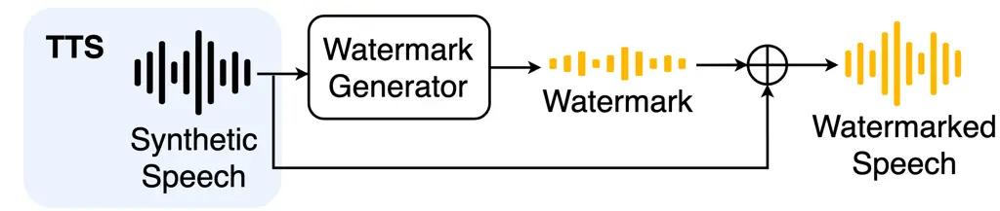
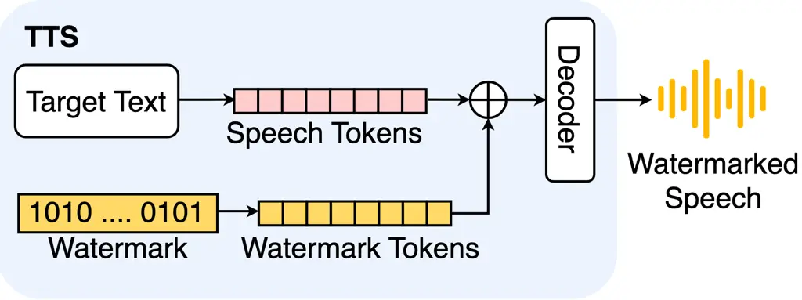
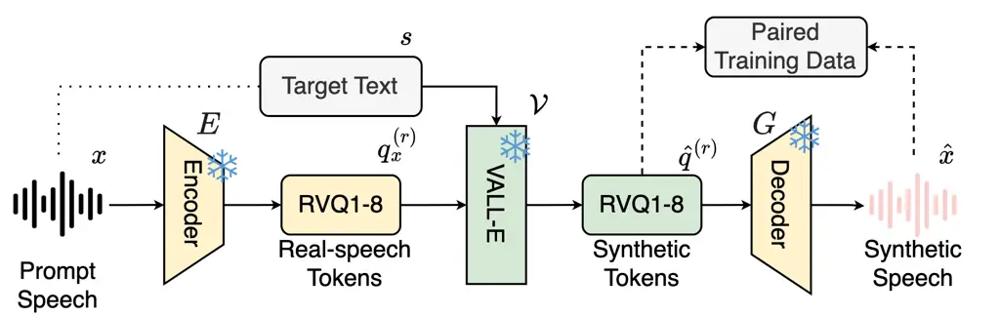
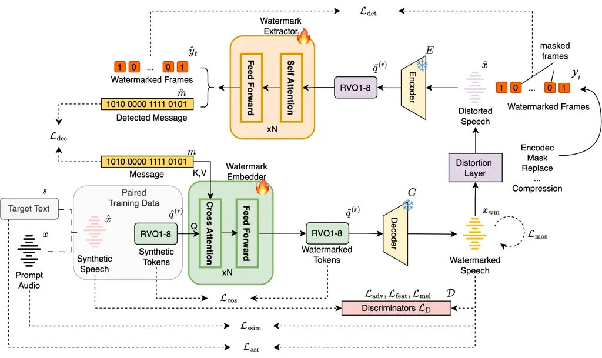

# NeuMark-Native: Robust Text-to-Speech-Native Watermarking through Full Utilization of Neural Audio Codec Latent Space

Annan Wu    Wen-Chin Huang    Tomoki Toda

###### Abstract

Speech watermarking offers proactive traceability for synthetic speech,
yet most existing models operate only after text-to-speech (TTS)
synthesis by adding a watermark perturbation to the generated waveform.
This post-hoc design leaves watermarking as an external step that can be
omitted or bypassed and restricts the watermark to a shallow waveform
representation. We propose NeuMark-Native, a TTS-native watermarking
framework for neural codec-based synthesis. It embeds payload
information into every generated codec-latent layer before waveform
decoding, improving watermark persistence under downstream digital
signal processing (DSP) and neural codec resynthesis. NeuMark-Native
keeps the pretrained TTS model and the neural codec frozen, while
optimizing only the watermark modules on generated codec tokens.
Experiments on two corpora under 11 DSP attacks and 9 neural-codec
attacks demonstrate robust watermark detection while preserving
naturalness, intelligibility, and speech quality close to synthetic
speech.

###### Index Terms: 

speech watermarking, traceable text-to-speech, neural audio codec,
speech anti-spoofing, content provenance

^(†)^(†)address: Nagoya University, Japan

## 1 Introduction

Recent neural codec-based text-to-speech models, including
VALL-E 2 \[4\], MaskGCT \[20\], and CosyVoice 3 \[8\], generate
increasingly realistic synthetic speech, creating a growing need for
reliable provenance. Speech watermarking provides proactive traceability
by embedding recoverable information into synthetic speech. Research on
speech watermarking has progressed from signal-processing-based methods
using transform coding and auditory masking \[13\] to neural methods
that learn watermark embedding and recovery.

Existing neural speech watermarking methods commonly apply the watermark
only after waveform generation \[3, 15, 16, 11, 12\]. Such post-hoc
methods add a learned waveform perturbation to synthetic speech, as
illustrated in Fig. 1. Although convenient and model agnostic, this
interface confines the watermark to the final waveform. As a separate
post-processing step, watermarking can be omitted or bypassed.
Latent-Mark \[6\] further shows that neural codec resynthesis can
largely remove conventional waveform watermarks despite their robustness
to ordinary digital signal processing (DSP) operations.

Making watermarking native to TTS generation turns traceability into
part of synthesis. TraceableSpeech \[25\] follows the TTS-native
synthesis path illustrated in Fig. 2, embedding a watermark into one
continuous codec representation and recovering it with a ResNet
extractor. However, it first jointly trains the watermark model and
speech codec, and then trains VALL-E \[19\] on the resulting codec
representations; any modification to the watermark model therefore
requires VALL-E to be retrained from scratch. It also incurs a
speech-quality cost and leaves robustness to neural codec resynthesis
unaddressed.



Figure 1: Post-hoc watermarking applied after TTS synthesis.



Figure 2: TTS-native watermarking applied during TTS synthesis.



Figure 3: Offline preparation of paired TTS-generated codec tokens and
synthetic speech.



Figure 4: NeuMark-Native training on the prepared TTS-generated codec
tokens.

To improve robustness to neural codec resynthesis without retraining the
speech codec, we previously proposed NeuMark \[22\], which keeps the
speech codec frozen and optimizes only its Transformer watermark
modules. Through cross-attention, these modules apply
message-conditioned residual updates to every residual vector
quantization (RVQ) layer, distributing watermark evidence across
codec-aligned latent representations to keep the watermark detectable
after resynthesis. However, because its carriers are encoded from real
speech, watermarking remains separate from TTS generation.

In this paper, we propose NeuMark-Native, a TTS-native framework that
extends NeuMark’s per-layer codec-latent watermarking to TTS-generated
tokens while retaining its robustness to neural codec resynthesis and
frozen-backbone training strategy. A pretrained TTS model
pre-synthesizes target codec tokens from each training transcript and a
same-speaker prompt, exposing the watermark modules to TTS-specific
characteristics while the TTS model and speech codec remain frozen.
NeuMark-Native produces watermarked synthetic speech with quality
competitive with waveform-domain methods such as AudioSeal \[15\] and
WavMark \[3\]. Our contributions are:

- •
  We propose NeuMark-Native, a TTS-native framework that adapts its
  watermark modules on pre-synthesized codec tokens carrying
  TTS-specific characteristics and distributions. It embeds payloads
  natively within codec-based synthesis using a loss design tailored to
  zero-shot voice cloning.
- •
  We evaluate NeuMark-Native on two corpora under 11 DSP and 9
  neural-codec attacks. It substantially outperforms competing methods
  in codec-resynthesis robustness while achieving speech quality
  comparable to waveform-domain models across various evaluation
  metrics. NeuMark-Native source code is available at
  [https://github.com/goannan/NeuMark-Native](https://github.com/goannan/NeuMark-Native).

## 2 Proposed Method

### 2.1 Offline generated-token preparation

VALL-E \[19\] is a neural codec language model for zero-shot TTS. It
takes target text and a speech prompt as input and predicts the codec
tokens of target speech. The VALL-E model used here was pretrained to
predict SpeechTokenizer \[24\] tokens. As shown in Fig. 3, its
input–output relation is

```math
\displaystyle\mathbf{q}_{x} \displaystyle=E(x)=\{q_{x}^{(r)}\}_{r=1}^{R}, \tag{1}
```

```math
\displaystyle\hat{\mathbf{q}} \displaystyle=\mathcal{V}(s,\mathbf{q}_{x})=\{\hat{q}^{(r)}\}_{r=1}^{R},
```

```math
\displaystyle\hat{x} \displaystyle=G(\hat{\mathbf{q}}).
```

Here $`s`$ is the target text; $`x`$ is a same-speaker prompt-speech
waveform; $`E`$ and $`G`$ are the frozen SpeechTokenizer encoder and
decoder; $`\mathbf{q}_{x}`$ is the set of prompt tokens; $`\mathcal{V}`$
is the frozen VALL-E model; $`\hat{\mathbf{q}}`$ is the set of predicted
target tokens; $`q_{x}^{(r)}`$ and $`\hat{q}^{(r)}`$ denote the prompt
and target streams at RVQ layer $`r`$, respectively; $`R`$ is the number
of RVQ layers; and $`\hat{x}`$ is the resulting synthetic speech.

For offline adaptation, $`s`$ is the transcript of a training utterance
and $`x`$ is a prompt from the same speaker. As shown in Fig. 3, each
pre-synthesis run stores the predicted tokens $`\hat{\mathbf{q}}`$
together with their decoded synthetic speech $`\hat{x}`$ as a paired
training sample. The TTS-generated tokens, rather than tokens encoded
from the target recording, serve as the watermark carrier, while
$`\hat{x}`$ provides the sample-aligned reference. This exposes the
trainable modules to the token characteristics encountered during
synthesis.

### 2.2 TTS-native training objective

Figure 4 shows how the cached TTS-generated tokens $`\hat{\mathbf{q}}`$
become the actual watermark carrier. For each random 16-bit message
$`m`$, the carrier supplies the cross-attention queries $`Q`$, while
$`m`$ supplies keys and values $`K,V`$; $`N`$ denotes the number of
stacked Transformer blocks. The embedder modifies every RVQ stream and
produces watermarked tokens $`\widetilde{\mathbf{q}}`$, which the frozen
decoder $`G`$ converts into watermarked synthetic speech
$`x_{\mathrm{wm}}`$. In parallel, decoding the unchanged
$`\hat{\mathbf{q}}`$ produces the paired reference $`\hat{x}`$. The
distortion layer transforms $`x_{\mathrm{wm}}`$ into $`\widetilde{x}`$
and provides frame labels $`y_{t}`$; the frozen encoder $`E`$ maps
$`\widetilde{x}`$ to distorted tokens $`\widetilde{q}^{(r)}`$; and the
extractor outputs predictions $`\hat{y}_{t}`$ and the recovered message
$`\hat{m}`$. Flame and snowflake symbols denote trainable and frozen
modules. Thus, only the watermark modules learn from the difference
between the paired branches.

NeuMark-Native retains six NeuMark objectives \[22\]. The decoding,
detection, latent-cosine, adversarial, feature-matching, and mel losses
are denoted by $`\mathcal{L}_{\mathrm{dec}}`$,
$`\mathcal{L}_{\mathrm{det}}`$, $`\mathcal{L}_{\mathrm{cos}}`$,
$`\mathcal{L}_{\mathrm{adv}}`$, $`\mathcal{L}_{\mathrm{feat}}`$, and
$`\mathcal{L}_{\mathrm{mel}}`$, respectively. The paired reference
branch provides a sample-aligned anchor that prevents
$`x_{\mathrm{wm}}`$ from drifting in content or acoustics. We further
introduce three speech-aware objectives.

The naturalness loss is

```math
\mathcal{L}_{\mathrm{mos}}=-U(x_{\mathrm{wm}}), \tag{2}
```

where $`U`$ is the frozen UTMOS \[14\] predictor, which maps watermarked
synthetic speech $`x_{\mathrm{wm}}`$ to a predicted mean-opinion score.
Minimizing $`\mathcal{L}_{\mathrm{mos}}`$ therefore encourages a higher
naturalness score.

The speaker-similarity (SSIM) loss is

```math
\mathcal{L}_{\mathrm{ssim}}=1-\operatorname{cos}(V(x_{\mathrm{wm}}),V(x)), \tag{3}
```

where $`V`$ is an ECAPA-TDNN speaker-verification model using frozen
WavLM-Large \[5\] features and its official fine-tuned checkpoint,¹¹ 1
[https://github.com/microsoft/UniSpeech/tree/main/downstreams/speaker_verification](https://github.com/microsoft/UniSpeech/tree/main/downstreams/speaker_verification)
and $`\operatorname{cos}`$ denotes cosine similarity. Minimizing
$`\mathcal{L}_{\mathrm{ssim}}`$ preserves the prompt speaker’s identity
in $`x_{\mathrm{wm}}`$.

The ASR loss is

```math
\mathcal{L}_{\mathrm{asr}}=\operatorname{CTC}\!\left(\log\operatorname{softmax}(B(x_{\mathrm{wm}})),\tau(s)\right), \tag{4}
```

where $`B`$ is the frozen wav2vec 2.0 Base (960 h) model \[2\]²² 2
[https://docs.pytorch.org/audio/stable/pipelines](https://docs.pytorch.org/audio/stable/pipelines)
and maps $`x_{\mathrm{wm}}`$ to framewise character logits. The
tokenizer $`\tau`$ converts target text $`s`$ into a character sequence.
Connectionist temporal classification (CTC) \[9\] sums the probabilities
of all valid frame-level paths corresponding to $`\tau(s)`$ and returns
their negative log-likelihood. Minimizing $`\mathcal{L}_{\mathrm{asr}}`$
encourages $`x_{\mathrm{wm}}`$ to preserve the target linguistic content
without frame-aligned labels.

Our joint adaptation objective is

```math
\displaystyle\mathcal{L}={} \displaystyle 5\mathcal{L}_{\mathrm{dec}}+\mathcal{L}_{\mathrm{det}}+2\mathcal{L}_{\mathrm{cos}}+\mathcal{L}_{\mathrm{adv}}+2\mathcal{L}_{\mathrm{feat}} \tag{5}
```

```math
\displaystyle+0.25\mathcal{L}_{\mathrm{mel}}+0.5\mathcal{L}_{\mathrm{mos}}+\mathcal{L}_{\mathrm{ssim}}+0.5\mathcal{L}_{\mathrm{asr}}.
```

For adversarial training, $`\mathcal{D}`$ contains multi-period,
multi-scale, and multi-scale STFT discriminators (MPD, MSD, and
MS-STFTD). Under the least-squares objective, discriminator
$`D\in\mathcal{D}`$ with $`K_{D}`$ outputs is updated by

```math
\mathcal{L}_{D}=\frac{1}{|\mathcal{D}|}\sum_{D\in\mathcal{D}}\frac{1}{K_{D}}\sum_{k=1}^{K_{D}}\left[\mathbb{E}(D_{k}(\hat{x})-1)^{2}+\mathbb{E}D_{k}(x_{\mathrm{wm}})^{2}\right]. \tag{6}
```

The watermark modules are optimized by Eq. (5) with the discriminators
frozen, whereas $`\mathcal{D}`$ is updated separately by Eq. (6) using a
detached $`x_{\mathrm{wm}}`$. All TTS, codec, and speech-assessment
networks remain frozen.

We evaluate two NeuMark-Native variants. _NeuMark-Native (direct)_
applies the NeuMark watermark modules pretrained using original codec
tokens extracted from natural speech directly to TTS-generated tokens.
_NeuMark-Native (adapted)_ initializes from the same checkpoint and
fine-tunes the modules on the paired training data in Fig. 3 using
Eq. (5). Both variants keep the TTS model and speech codec frozen and
use the same watermark-embedding procedure during synthesis.

## 3 Experimental Evaluation

### 3.1 Setup

NeuMark-Native used the three LibriTTS \[23\] training subsets:
clean-100, clean-360, and other-500. Together they contained
approximately 555 hours before duration filtering. Filtering to
0.5--10.5 sec yielded approximately 157k cuts, which were preprocessed
as in Sec. 2.1. Adaptation ran for ten epochs on one NVIDIA H100 GPU and
took approximately 69 hours. Each example received a random 16-bit
message and one augmentation sampled from identity or 11 DSP attacks
following AudioCraft:³³ 3
[https://github.com/facebookresearch/audiocraft](https://github.com/facebookresearch/audiocraft)
Gaussian noise, pink noise, low-pass filtering, high-pass filtering,
band-pass filtering, echo, smoothing, resampling, gain increase, gain
decrease, and speed change. The training pool also contained
EnCodec \[7\] resynthesis at 3, 6, and 12 kbps to adapt the model to
neural-codec attacks across different bandwidths, together with codec
resynthesis combined with frame masking or replacement; negatives
alternated between recordings and synthetic speech.

Evaluation was conducted as zero-shot text-to-speech (TTS) voice cloning
on both corpora. It used 2,078 duration-filtered utterances from
LibriTTS test-clean as the in-corpus set and 1,088 prompt–text pairs
from the English subset of Seed-TTS-Eval \[1\] (SeedTTS-en) to assess
cross-corpus generalization to unseen texts and speakers. Each test item
first followed Fig. 3: from test text $`s`$ and a same-speaker prompt
$`x`$, VALL-E predicted target speech tokens $`\hat{\mathbf{q}}`$, which
the frozen decoder converted into synthetic speech $`\hat{x}`$.

NeuMark-Native and TraceableSpeech performed watermark embedding within
TTS generation before waveform decoding, thereby producing watermarked
synthetic speech directly. By contrast, WavMark and AudioSeal operated
after TTS synthesis by adding watermark perturbations to the synthetic
speech $`\hat{x}`$ produced in Fig. 3. The resulting watermarked
synthetic speech from every method was evaluated under the same DSP and
neural-codec conditions.

The evaluation included one identity condition and the same 11 DSP
attacks. The 9 codec attacks used EnCodec at 3/6/12 kbps, DAC \[10\] at
6/8/24 kbps, and SNAC \[17\] at 0.98/1.9/2.6 kbps. DAC and SNAC were
unseen during training. Group means formed the 12/9-weighted overall
score.

|                          |            | LibriTTS test-clean |                        |                 | SeedTTS-en      |                        |                 |
| ------------------------ | ---------- | ------------------- | ---------------------- | --------------- | --------------- | ---------------------- | --------------- |
| Method                   | Conditions | AUC$`\uparrow`$     | TPR$`{}_{.1}\uparrow`$ | Bit$`\uparrow`$ | AUC$`\uparrow`$ | TPR$`{}_{.1}\uparrow`$ | Bit$`\uparrow`$ |
| WavMark \[3\]            | DSP        | 0.993               | 0.931                  | 0.954           | 0.989           | 0.925                  | 0.948           |
|                          | Codec      | 0.570               | 0.095                  | 0.542           | 0.572           | 0.092                  | 0.543           |
|                          | Overall    | 0.812               | 0.572                  | 0.778           | 0.810           | 0.568                  | 0.775           |
| AudioSeal \[15\]         | DSP        | 0.970               | 0.920                  | 0.946           | 0.971           | 0.920                  | 0.944           |
|                          | Codec      | 0.813               | 0.445                  | 0.638           | 0.806           | 0.422                  | 0.645           |
|                          | Overall    | 0.903               | 0.717                  | 0.814           | 0.900           | 0.707                  | 0.816           |
| TraceableSpeech \[25\]   | DSP        | 0.987               | 0.921                  | 0.958           | 0.984           | 0.921                  | 0.955           |
|                          | Codec      | 0.660               | 0.088                  | 0.605           | 0.697           | 0.090                  | 0.610           |
|                          | Overall    | 0.847               | 0.564                  | 0.807           | 0.861           | 0.565                  | 0.807           |
| NeuMark-Native (direct)  | DSP        | 0.999               | 0.948                  | 0.974           | 0.998           | 0.885                  | 0.973           |
|                          | Codec      | 0.942               | 0.521                  | 0.861           | 0.940           | 0.481                  | 0.885           |
|                          | Overall    | 0.975               | 0.765                  | 0.926           | 0.973           | 0.712                  | 0.936           |
| NeuMark-Native (adapted) | DSP        | 1.000               | 0.961                  | 0.982           | 0.998           | 0.914                  | 0.964           |
|                          | Codec      | 0.955               | 0.605                  | 0.842           | 0.949           | 0.490                  | 0.830           |
|                          | Overall    | 0.981               | 0.808                  | 0.922           | 0.977           | 0.733                  | 0.907           |

Table 1: Robustness under DSP and codec conditions. AUC: detection
ROC-AUC; TPR\_(.1): TPR at FPR $`\leq 0.1\%`$; Bit: payload accuracy.
DSP, Codec, and Overall report means over their respective conditions.

|                          |                     |                  |                      |                  |                  |                   |                  |                      |                  |                  |
| ------------------------ | ------------------- | ---------------- | -------------------- | ---------------- | ---------------- | ----------------- | ---------------- | -------------------- | ---------------- | ---------------- |
|                          | LibriTTS test-clean |                  |                      |                  |                  | SeedTTS-en        |                  |                      |                  |                  |
| Method                   | UTMOS$`\uparrow`$   | SSIM$`\uparrow`$ | WER(%)$`\downarrow`$ | PESQ$`\uparrow`$ | STOI$`\uparrow`$ | UTMOS$`\uparrow`$ | SSIM$`\uparrow`$ | WER(%)$`\downarrow`$ | PESQ$`\uparrow`$ | STOI$`\uparrow`$ |
| Synthetic speech         | 3.664               | 0.425            | 35.8                 | —                | —                | 3.276             | 0.420            | 36.7                 | —                | —                |
| WavMark                  | 3.632               | 0.421            | 35.7                 | 4.159            | 0.996            | 3.224             | 0.414            | 36.8                 | 4.081            | 0.988            |
| AudioSeal                | 3.651               | 0.425            | 35.8                 | 4.416            | 0.997            | 3.259             | 0.417            | 36.8                 | 4.427            | 0.990            |
| TraceableSpeech          | 2.198               | 0.174            | 41.3                 | 3.048            | 0.925            | 2.109             | 0.182            | 47.1                 | 2.463            | 0.895            |
| NeuMark-Native (direct)  | 3.638               | 0.410            | 35.7                 | 4.360            | 0.990            | 3.244             | 0.403            | 36.9                 | 4.161            | 0.979            |
| NeuMark-Native (adapted) | 3.630               | 0.413            | 35.7                 | 4.318            | 0.991            | 3.238             | 0.413            | 37.0                 | 4.212            | 0.985            |
| _w/o_ native losses      | 3.648               | 0.420            | 35.8                 | 4.443            | 0.995            | 3.254             | 0.414            | 37.0                 | 4.382            | 0.992            |
| _w/o_ generated tokens   | 3.613               | 0.413            | 35.7                 | 4.278            | 0.989            | 3.228             | 0.407            | 36.9                 | 4.058            | 0.978            |

Table 2: Speech quality. Synthetic speech is the common unwatermarked
carrier; PESQ \[21\] and STOI \[18\] use it as reference.

|                          |          |            |                     |                        |                 |                 |                        |                 |
| ------------------------ | -------- | ---------- | ------------------- | ---------------------- | --------------- | --------------- | ---------------------- | --------------- |
|                          | TTS-gen. | TTS-native | LibriTTS test-clean |                        |                 | SeedTTS-en      |                        |                 |
| Configuration            | tokens   | losses     | AUC$`\uparrow`$     | TPR$`{}_{.1}\uparrow`$ | Bit$`\uparrow`$ | AUC$`\uparrow`$ | TPR$`{}_{.1}\uparrow`$ | Bit$`\uparrow`$ |
| NeuMark-Native (adapted) | Yes      | Yes        | 0.981               | 0.808                  | 0.922           | 0.977           | 0.733                  | 0.907           |
| _w/o_ native losses      | Yes      | No         | 0.974               | 0.772                  | 0.899           | 0.968           | 0.671                  | 0.874           |
| _w/o_ generated tokens   | No       | Yes        | 0.979               | 0.822                  | 0.924           | 0.974           | 0.789                  | 0.924           |
| NeuMark-Native (direct)  | No       | No         | 0.975               | 0.765                  | 0.926           | 0.973           | 0.712                  | 0.936           |

Table 3: NeuMark-Native ablations. TTS-native losses are UTMOS, WavLM,
and ASR objectives.

### 3.2 Performance evaluation

Table 1 compares watermark robustness across the identity, DSP, and
neural-codec conditions. NeuMark-Native (adapted) achieves the best
overall detection performance on both LibriTTS test-clean and
SeedTTS-en, while NeuMark-Native (direct) provides the highest overall
payload-bit accuracy. Consistent results on both corpora demonstrate
generalization to unseen texts and speakers.

Table 2 compares speech quality against the same synthetic speech.
NeuMark-Native preserves naturalness, speaker similarity,
intelligibility, and perceptual fidelity close to the unwatermarked
reference, with quality competitive with the waveform-domain methods
WavMark and AudioSeal. These results demonstrate that TTS-native
watermarking can improve overall robustness without substantially
degrading the generated speech.

### 3.3 Ablation study

The _w/o native losses_ variant removes the UTMOS, WavLM-similarity, and
ASR objectives. The _w/o generated tokens_ variant replaces
VALL-E-predicted tokens with SpeechTokenizer tokens encoded from real
speech, as in NeuMark. Both retain the same initialization and NeuMark
objectives.

Tables 2 and 3 show complementary ablation strengths. Without TTS-native
losses, the differences from AudioSeal are only 0.003/0.005 in UTMOS and
0.005/0.003 in SSIM on LibriTTS test-clean/SeedTTS-en, with the best
LibriTTS PESQ and SeedTTS-en STOI. This confirms that NeuMark’s
reconstruction objectives provide a strong transparency anchor. Without
generated tokens, low-FPR detection and payload recovery exceed the full
adapted model despite modestly lower quality. Generated-token training
therefore favors the overall robustness–quality balance, while
real-speech tokens favor strict low-FPR detection and bit recovery;
direct integration retains the highest codec-average payload accuracy.

## 4 Conclusion

NeuMark-Native integrates watermarking into neural codec TTS by adapting
NeuMark on pre-synthesized TTS tokens and embedding the payload into
every generated RVQ stream before decoding. Across two corpora, it
provides the strongest overall detection and low-FPR performance, with
particularly large gains under neural-codec resynthesis, while retaining
naturalness, intelligibility, speaker similarity, and perceptual quality
close to synthetic speech and competitive waveform-domain methods. The
frozen-backbone design also permits transfer to compatible codec-based
TTS models through watermark-only adaptation.

## 5 Acknowledgment

This work was supported in part by JSPS KAKENHI Grant Number 26H02530,
and in part by the BRIDGE Program (R7-H05), implemented by the Cabinet
Office, Government of Japan.

## References

- \[1\] P. Anastassiou, J. Chen, J. Chen, et al. (2024) Seed-TTS: a
  family of high-quality versatile speech generation models. arXiv
  preprint arXiv:2406.02430. External Links:
  [Link](https://arxiv.org/abs/2406.02430) Cited by: §3.1.
- \[2\] A. Baevski, Y. Zhou, A. Mohamed, and M. Auli (2020) wav2vec 2.0:
  a framework for self-supervised learning of speech representations. In
  Advances in Neural Information Processing Systems, Vol. 33,
  pp. 12449–12460. External Links:
  [Link](https://proceedings.neurips.cc/paper/2020/hash/92d1e1eb1cd6f9fba3227870bb6d7f07-Abstract.html)
  Cited by: §2.2.
- \[3\] G. Chen, Y. Wu, S. Liu, T. Liu, X. Du, and F. Wei (2023)
  WavMark: watermarking for audio generation. arXiv preprint
  arXiv:2308.12770. External Links:
  [Document](https://dx.doi.org/10.48550/arXiv.2308.12770) Cited by: §1,
  §1, Table 1.
- \[4\] S. Chen, S. Liu, L. Zhou, et al. (2024) VALL-E 2: neural codec
  language models are human parity zero-shot text to speech
  synthesizers. arXiv preprint arXiv:2406.05370. External Links:
  [Link](https://arxiv.org/abs/2406.05370) Cited by: §1.
- \[5\] S. Chen, C. Wang, Z. Chen, et al. (2022) WavLM: large-scale
  self-supervised pre-training for full stack speech processing. IEEE
  Journal of Selected Topics in Signal Processing 16 (6), pp. 1505–1518.
  External Links:
  [Document](https://dx.doi.org/10.1109/JSTSP.2022.3188113) Cited by:
  §2.2.
- \[6\] Y. Chen, S. Lai, Y. Tsou, et al. (2026) Latent-Mark: an audio
  watermark robust to neural codec compression. In Interspeech 2026
  \[Long Track\], pp. 3052–3061. External Links:
  [Document](https://dx.doi.org/10.21437/Interspeech.2026-1979) Cited
  by: §1.
- \[7\] A. Défossez, J. Copet, G. Synnaeve, and Y. Adi (2023) High
  fidelity neural audio compression. Transactions on Machine Learning
  Research. External Links:
  [Link](https://openreview.net/forum?id=ivCd8z8zR2) Cited by: §3.1.
- \[8\] Z. Du, C. Gao, Y. Wang, et al. (2025) CosyVoice 3: towards
  in-the-wild speech generation via scaling-up and post-training. arXiv
  preprint arXiv:2505.17589. External Links:
  [Link](https://arxiv.org/abs/2505.17589) Cited by: §1.
- \[9\] A. Graves, S. Fernández, F. Gomez, and J. Schmidhuber (2006)
  Connectionist temporal classification: labelling unsegmented sequence
  data with recurrent neural networks. In Proceedings of the 23rd
  International Conference on Machine Learning, pp. 369–376. Cited by:
  §2.2.
- \[10\] R. Kumar, P. Seetharaman, A. Luebs, I. Kumar, and K.
  Kumar (2023) High-fidelity audio compression with improved rvqgan. In
  Advances in Neural Information Processing Systems, Vol. 36,
  pp. 27980–27993. Cited by: §3.1.
- \[11\] P. Li, X. Zhang, J. Xiao, and J. Wang (2024) IDEAW: robust
  neural audio watermarking with invertible dual-embedding. In
  Proceedings of the 2024 Conference on Empirical Methods in Natural
  Language Processing, pp. 4500–4511. External Links:
  [Document](https://dx.doi.org/10.18653/v1/2024.emnlp-main.258) Cited
  by: §1.
- \[12\] Y. Liu, L. Lu, J. Jin, L. Sun, and A. Fanelli (2025) XAttnMark:
  learning robust audio watermarking with cross-attention. In
  Proceedings of the 42nd International Conference on Machine Learning,
  Proceedings of Machine Learning Research, Vol. 267, pp. 38987–39015.
  Cited by: §1.
- \[13\] F. J. Ruiz and J. R. Deller (2000) Digital watermarking of
  speech signals for the national gallery of the spoken word. In
  Proceedings of the IEEE International Conference on Acoustics, Speech,
  and Signal Processing, Vol. 3, pp. 1499–1502. External Links:
  [Document](https://dx.doi.org/10.1109/ICASSP.2000.861923) Cited by:
  §1.
- \[14\] T. Saeki, D. Xin, W. Nakata, T. Koriyama, S. Takamichi, and H.
  Saruwatari (2022) UTMOS: UTokyo-SaruLab system for VoiceMOS challenge 2022. In Interspeech 2022, pp. 4521–4525. External Links:
  [Document](https://dx.doi.org/10.21437/Interspeech.2022-439) Cited by:
  §2.2.
- \[15\] R. San Roman, P. Fernandez, H. Elsahar, A. Défossez, T. Furon,
  and T. Tran (2024) Proactive detection of voice cloning with localized
  watermarking. In Proceedings of the 41st International Conference on
  Machine Learning, Proceedings of Machine Learning Research, Vol. 235,
  pp. 43180–43196. External Links:
  [Link](https://proceedings.mlr.press/v235/san-roman24a.html) Cited by:
  §1, §1, Table 1.
- \[16\] M. K. Singh, N. Takahashi, W. Liao, and Y. Mitsufuji (2024)
  SilentCipher: deep audio watermarking. In Interspeech 2024,
  pp. 2175–2179. External Links:
  [Document](https://dx.doi.org/10.21437/Interspeech.2024-174) Cited by:
  §1.
- \[17\] H. Siuzdak, F. Grötschla, and L. A. Lanzendörfer (2024) SNAC:
  multi-scale neural audio codec. In Audio Imagination: NeurIPS 2024
  Workshop AI-Driven Speech, Music, and Sound Generation, External
  Links: [Link](https://arxiv.org/abs/2410.14411) Cited by: §3.1.
- \[18\] C. H. Taal, R. C. Hendriks, R. Heusdens, and J. Jensen (2011)
  An algorithm for intelligibility prediction of time-frequency weighted
  noisy speech. IEEE Transactions on Audio, Speech, and Language
  Processing 19 (7), pp. 2125–2136. External Links:
  [Document](https://dx.doi.org/10.1109/TASL.2011.2114881) Cited by:
  Table 2.
- \[19\] C. Wang, S. Chen, Y. Wu, et al. (2023) Neural codec language
  models are zero-shot text to speech synthesizers. arXiv preprint
  arXiv:2301.02111. External Links:
  [Link](https://arxiv.org/abs/2301.02111) Cited by: §1, §2.1.
- \[20\] Y. Wang, H. Zhan, L. Liu, et al. (2025) MaskGCT: zero-shot
  text-to-speech with masked generative codec transformer. In
  International Conference on Learning Representations, External Links:
  [Link](https://proceedings.iclr.cc/paper_files/paper/2025/hash/74a31a3b862eb7f01defbbed8e5f0c69-Abstract-Conference.html)
  Cited by: §1.
- \[21\] (2007) Wideband extension to recommendation p.862 for the
  assessment of wideband telephone networks and speech codecs.
  International Telecommunication Union. External Links:
  [Link](https://www.itu.int/rec/T-REC-P.862.2) Cited by: Table 2.
- \[22\] A. Wu, W. Huang, and T. Toda (2026) NeuMark: neural codec
  resynthesis-robust audio watermarking in the codec latent space. arXiv
  preprint arXiv:2609.25719. External Links:
  [Link](https://arxiv.org/abs/2609.25719) Cited by: §1, §2.2.
- \[23\] H. Zen, V. Dang, R. Clark, et al. (2019) LibriTTS: a corpus
  derived from LibriSpeech for text-to-speech. In Interspeech 2019,
  pp. 1526–1530. External Links:
  [Document](https://dx.doi.org/10.21437/Interspeech.2019-2441) Cited
  by: §3.1.
- \[24\] X. Zhang, D. Zhang, S. Li, Y. Zhou, and X. Qiu (2024)
  SpeechTokenizer: unified speech tokenizer for speech language models.
  In International Conference on Learning Representations, External
  Links:
  [Link](https://proceedings.iclr.cc/paper_files/paper/2024/hash/86d1ab582afb247ccaa84bec4a7e24f7-Abstract-Conference.html)
  Cited by: §2.1.
- \[25\] J. Zhou, J. Yi, T. Wang, et al. (2024) TraceableSpeech: towards
  proactively traceable text-to-speech with watermarking. In Interspeech
  2024, pp. 2250–2254. External Links:
  [Document](https://dx.doi.org/10.21437/Interspeech.2024-534) Cited by:
  §1, Table 1.
