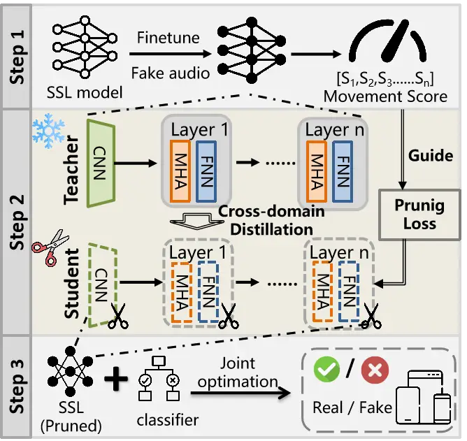
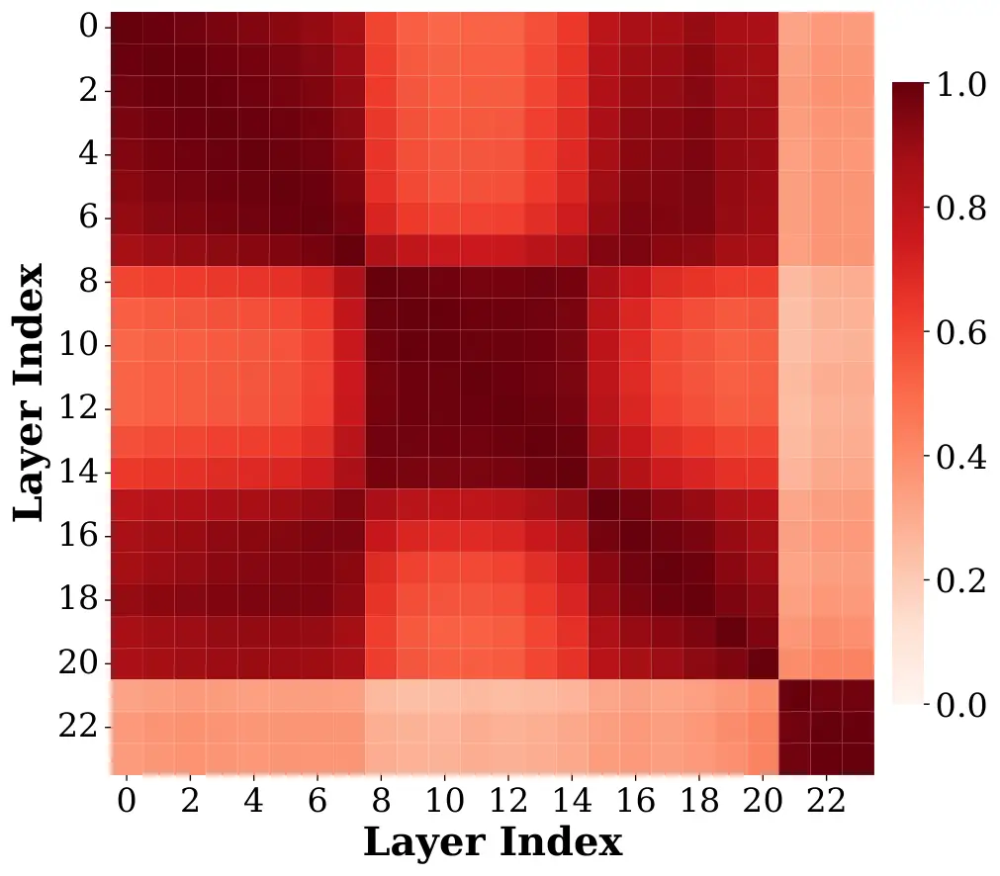
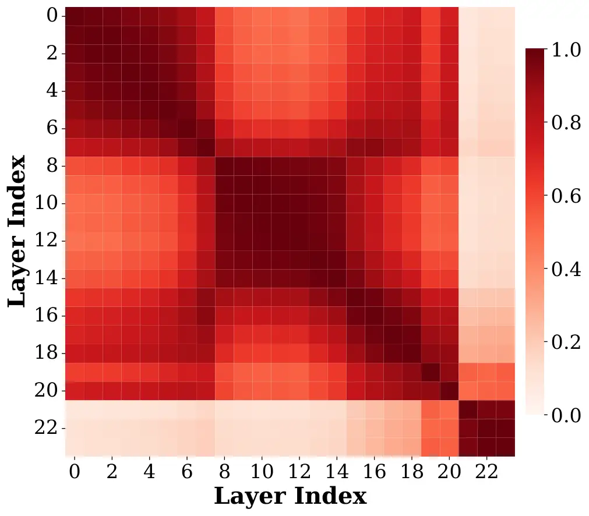

He Cheng Ba Wen Lu Yang Ren

# Task-Aware Joint Pruning and Distillation for Efficient Audio Deepfake Detection

Miao    Peng    Zhongjie    Qing    Li    Xin    Kui

###### Abstract

Advances in speech synthesis have made deepfake speeches increasingly
convincing, posing growing threats to security. While self-supervised
learning (SSL) based detectors achieve state-of-the-art performance,
their computational demands (typically 300M+ parameters) prevent
deployment on resource-constrained devices. Existing compression
methods, designed mainly for content-centric tasks, struggle to maintain
competitive performance when directly adapted to deepfake detection. We
propose a Task-Aware Joint Pruning and Distillation framework that
combines cross-domain knowledge distillation with movement-guided
structured pruning to transfer forgery-discriminative knowledge and
preserve critical structures under aggressive compression. Our framework
reduces the model to 31.9M parameters with 6.3$`\times`$ FLOPs
reduction, with an average performance drop of only 1.30% across
multiple datasets compared to the uncompressed baseline, demonstrating
strong potential for on-device deployment.

###### keywords

deepfake detection, model compression, knowledge distillation,
structured pruning

^(†)^(†)address: ¹ The State Key Laboratory of Blockchain and Data
Security, Zhejiang University, China  
² Hangzhou High-Tech Zone (Binjiang) Institute of Blockchain and Data
Security, China  
³ Shanghai Institute for Advanced Study, Zhejiang University, China  
⁴ Qingdao Institute of Software College of Computer Science and
Technology, China University of Petroleum (East China), China
^(†)^(†)email: miao_he@zju.edu.cn, peng_cheng@zju.edu.cn,
zhongjieba@zju.edu.cn

## 1 Introduction

With the rapid evolution of speech synthesis technology, generative
models can now synthesize high-fidelity speech that is perceptually
indistinguishable from bonafide audio \[1, 2\], posing an urgent need to
develop reliable countermeasures. The synthesized speeches, namely
deepfake speeches, can deceive both human and Automatic Speaker
Verification systems, posing a severe threat to security, with
real-world incidents already demonstrating malicious exploitation of
voice cloning for telecommunications fraud and identity theft \[3, 4,
5\]. To mitigate these threats, self-supervised learning (SSL)
models—such as wav2vec2.0 \[6\], XLSR \[7\], and WavLM \[8\]—have
emerged as the dominant feature extractor for deepfake detection,
achieving state-of-the-art performance \[9, 10, 11, 12, 13\].

However, the immense computational complexity of SSL-based detectors
(typically 300M+ parameters) precludes their deployment on
resource-constrained devices, necessitating cloud-based inference. This
introduces two critical bottlenecks: (1) Network Dependency: cloud
inference requires stable connectivity, compromising availability in
unstable network environments; (2) Privacy Risks: uploading user audio
to cloud servers raises privacy concerns \[14, 15\]. A promising
solution to address these bottlenecks is on-device deepfake detection,
which requires lightweight models that can operate on resource-limited
devices while maintaining competitive performance.

Recent efforts have investigated compressing speech SSL models through
knowledge distillation \[16, 17, 18\] and structured pruning \[19, 20,
21, 22\]. However, directly adapting these methods to deepfake detection
faces critical challenges. First, existing compression strategies are
predominantly tailored for content-centric tasks like ASR, leaving
deepfake-specific compression largely unexplored. Second, existing
techniques rely solely on task-specific loss or in-domain distillation
as optimization objectives. When directly adapted to deepfake detection,
such limited supervision fails to transfer sufficient discriminative
knowledge and preserve critical structures, leading to poor
generalization. Third, we also empirically observe that current methods
degrade severely at high compression ratios ($`>`$75% sparsity),
especially in out-of-domain scenarios.

To address these limitations, we propose a Task-Aware Joint Pruning and
Distillation framework specifically designed for compressing SSL-based
deepfake detection models. We introduce cross-domain knowledge
distillation to transfer forgery-discriminative representations and
enhance generalization by exploiting diverse unlabeled out-of-domain
data as richer supervisions, with representative layers selected via CKA
analysis for multi-level knowledge distillation. We further adopt
movement-guided structured pruning that leverages fine-tuning movement
score to prioritize the preservation of forgery-critical structures
during compression. Extensive experiments demonstrate that our framework
maintains competitive performance even under aggressive compression,
with an average performance drop of only 1.30% across multiple datasets
compared to the uncompressed baseline. Crucially, our compressed model
achieves a 10$`\times`$ parameter reduction (31.9M) and 6.3$`\times`$
FLOPs reduction compared to the uncompressed baseline, demonstrating
strong potential for on-device deployment.

## 2 Background and Related Work

Speech SSL for Deepfake Detection. Self-supervised learning models have
been extensively explored for audio deepfake detection in recent years
\[9, 10, 11, 12\]. These SSL frontends, typically comprising CNNs and
Transformers, leverage large-scale pretraining to learn rich
representations, making them effective for deepfake detection \[13\].
However, their computational demands (typically 300M+ parameters, 130+
GFLOPs) prevent deployment on resource-constrained devices.

Compression Methods for Speech SSL. Speech SSL model compression
primarily relies on knowledge distillation and structured pruning.
Knowledge distillation transfers knowledge to student models via
layer-wise distillation \[16, 17, 18\], yet requires manual architecture
design. While recent works \[23, 24\] have applied distillation to
deepfake detection, they optimize merely for accuracy without
compressing for on-device deployment. Conversely, structured pruning
automatically removes redundant units through task-agnostic \[22, 25\]
or task-specific approaches \[19, 20, 21\]. However, adapting these
methods to deepfake detection leads to severe performance degradation at
high compression ratios. Our proposed framework is specifically designed
to address these limitations.



Figure 1: Task-Aware Joint Pruning and Distillation framework: (1)
Task-specific preparation; (2) Joint pruning and distillation; (3)
Backend optimization. The compressed model enables efficient on-device
deepfake detection.

|          |                        |         |         |                                            |           |       |       |             |       |       |
| -------- | ---------------------- | ------- | ------- | ------------------------------------------ | --------- | ----- | ----- | ----------- | ----- | ----- |
| Sparsity | Methods                | \#Param | FLOPs   | Evaluation Datasets (EER %) $`\downarrow`$ |           |       |       |             |       |       |
|          |                        |         |         | 19LA_Dev                                   | 19LA_Eval | 21LA  | 21DF  | In-the-Wild | ASV5  | FoR   |
| 0%       | XLSR-AASIST            | 317 M   | 146.3 G | 0.04                                       | 0.14      | 2.86  | 3.09  | 8.96        | 19.92 | 14.89 |
| 60%      | HJ-Pruning\[19\]       | 127.9 M | 67.9 G  | 0.04                                       | 2.40      | 14.20 | 21.27 | 33.61       | 38.79 | 59.49 |
|          | Finetune-Pruning\[20\] | 126.3 G | 63.5 G  | 0.08                                       | 0.20      | 7.64  | 3.99  | 17.22       | 24.10 | 16.52 |
|          | Hybrid-Pruning\[21\]   | 125.6 M | 69.5 G  | 0.04                                       | 17.93     | 25.98 | 30.61 | 53.27       | 45.17 | 62.23 |
|          | Ours                   | 126.6 M | 63.8 G  | 0.03                                       | 0.18      | 3.24  | 2.21  | 7.29        | 16.46 | 9.36  |
| 75%      | HJ-Pruning             | 79.4 M  | 46.6 G  | 0.03                                       | 2.73      | 13.53 | 22.37 | 29.66       | 38.44 | 56.58 |
|          | Finetune-Pruning       | 79.0 M  | 43.7 G  | 0.04                                       | 0.38      | 9.56  | 8.23  | 25.50       | 26.13 | 14.80 |
|          | Hybrid-Pruning         | 78.1 M  | 50.3 G  | 0.04                                       | 13.19     | 25.59 | 30.50 | 39.67       | 44.73 | 63.78 |
|          | Ours                   | 79.2 M  | 43.9 G  | 0.004                                      | 0.22      | 3.03  | 2.76  | 8.43        | 17.75 | 10.51 |
| 90%      | HJ-Pruning             | 32.6 M  | 27.1 G  | 0.08                                       | 5.03      | 15.88 | 23.30 | 34.11       | 40.82 | 57.55 |
|          | Finetune-Pruning       | 31.3 M  | 22.2 G  | 0.04                                       | 0.52      | 10.09 | 12.06 | 32.54       | 35.20 | 27.43 |
|          | Hybrid-Pruning         | 29.2 M  | 29.5 G  | 0.12                                       | 10.39     | 24.55 | 26.94 | 52.06       | 43.78 | 58.61 |
|          | Ours                   | 31.9 M  | 23.3 G  | 0.002                                      | 0.30      | 3.11  | 3.78  | 7.83        | 20.16 | 22.44 |

Table 1: Performance comparison between our method and baselines across
various sparsity levels (60%, 75%, and 90%). EER (%) values are
reported, with $`\downarrow`$ indicating lower is better. Bold and
underline indicate the best and second-best results, respectively

(a) ASVspoof2019 LA Eval

(b) ASVspoof2021 DF

(c) ASVspoof5

Figure 2: Model performance (EER%) changes as sparsity increases on (a)
ASVspoof2019 LA Eval, (b) ASVspoof2021 DF, and (c) ASVspoof5. Our method
(red line) consistently outperforms the Finetune-Pruning method (blue
dashed).

|                    |         |       |      |       |       |       |
| ------------------ | ------- | ----- | ---- | ----- | ----- | ----- |
| Config.            | 19 Eval | 21LA  | 21DF | ITW   | ASV5  | FoR   |
| XLSR-AASIST        | 0.14    | 2.86  | 3.09 | 8.96  | 19.92 | 14.89 |
| Ours (Full)        | 0.22    | 3.03  | 2.76 | 8.43  | 17.75 | 10.51 |
| w/o Cross. Distill | 0.39    | 10.14 | 8.25 | 25.84 | 27.48 | 16.61 |
| w/o Move. Guide    | 0.30    | 3.00  | 3.13 | 7.83  | 19.95 | 13.56 |

Table 2: Ablation study at 75% sparsity. Results in EER (%).

## 3 Methodology

As illustrated in Figure 1, our proposed framework consists of three
steps: (1) Task-specific preparation: fine-tune the pretrained SSL model
and compute movement scores of structural units as an importance prior,
including Multi-Head Attention, FFN intermediates, and CNN channels; (2)
Joint pruning and distillation: the structured pruning is guided by the
movement importance prior, combined with cross-domain knowledge
distillation to preserve forgery-discriminative structures; (3) Backend
optimization: jointly fine-tune the pruned SSL with the backend
classifier to optimize detection accuracy.

### 3.1 Cross-Domain Knowledge Distillation

Unlike existing task-specific structured pruning with distillation
methods that distill on in-domain training data \[19, 20\], we adopt a
cross-domain distillation strategy to maintain both accuracy and
generalization under compression.

Specifically, we leverage unlabeled out-of-domain task-relevant data
covering diverse codec variations and environmental distortions to
provide richer supervisions during compression. Since our uncompressed
teacher model already exhibits reasonable generalization on several
out-of-domain scenarios (EER\<10%), enforcing the student to mimic the
teacher’s representations across these diverse scenarios encourages
learning of generalizable forgery-discriminative representations rather
than overfitting to training distribution patterns. Specifically, we
incorporate ASVspoof2021 LA, 21 DF and In-the-Wild datasets as the
out-of-domain distillation datasets.

To further improve distillation efficiency, we analyze layer similarity
via Centered Kernel Alignment (CKA) \[26\]. As shown in Figure 3, CKA
analysis of the finetuned XLSR reveals three distinct block-like
structures corresponding to different processing stages: Layers 1–8,
9–21, and 22–24. Guided by prior findings that lower layers–particularly
the 5th layer–capture discriminative features \[27, 28\], we select
representative layers in each block (e.g.,
$`\mathcal{L}_{set}=\{5,14,24\}`$) for multi-level knowledge transfer:

```math
\displaystyle\mathcal{L}_{distill}=\sum_{l\in\mathcal{L}_{set}}L^{dis}(f_{T}^{l}(x),\phi(f_{S}^{l}(x))) \tag{1}
```

where $`f_{T}^{l}`$ and $`f_{S}^{l}`$ denote teacher and student
features at layer $`l`$, $`\phi(\cdot)`$ is a dimension alignment
projection, and $`L^{dis}`$ is MSE or cosine distance. Here $`x`$ spans
both in-domain and cross-domain samples without labels, enabling the
pruned model to preserve generalization even at high compression ratios.

### 3.2 Movement-Guided Structured Pruning

Beyond cross-domain distillation, we further introduce movement-guided
pruning to better preserve task-aware structures. Previous work has
shown that weights exhibiting significant changes (i.e., movement)
during fine-tuning encode task-specific knowledge \[29\]. Building on
this insight, we define a Movement Score
$`S_{j}=||\theta_{j}^{ft}-\theta_{j}^{init}||_{1}`$ for each structural
unit $`j`$ and assign an inverse penalty weight $`w_{j}`$, yielding an
importance-aware regularization term:

```math
\displaystyle\mathcal{L}_{penalty}=\sum_{j=1}^{n}w_{j}\cdot z_{j},\quad\text{where }w_{j}=\frac{1}{S_{j}+\epsilon} \tag{2}
```

where $`z_{j}\in\{0,1\}`$ is the binary retention mask. Minimizing
$`\mathcal{L}_{penalty}`$ encourages the model to prune low-movement
redundant units while retaining those essential for deepfake detection.

### 3.3 Joint Optimization Objective

We formulate the training as a constrained multi-objective optimization
to achieve the target compression ratio $`t`$ as follows:

```math
\displaystyle\min_{\theta,\mathbf{z}}\left[\mathcal{L}_{distill}+\lambda_{p}\mathcal{L}_{penalty}\right]\quad\text{s.t.}\quad\frac{||\theta_{j}\odot\mathbf{z}_{j}||_{0}}{N}=t \tag{3}
```

Following \[22, 30\], we reparameterize the non-differentiable mask
$`\mathbf{z}_{j}`$ via the Hard Concrete distribution, making the
$`L_{0}`$ norm differentiable w.r.t. learnable parameters $`\alpha`$:

```math
\displaystyle\mathbb{E}[||\tilde{\theta}||_{0}]=\sum_{j=1}^{n}\sigma(\log\alpha_{j}-\beta\log\frac{-l}{r}) \tag{4}
```

where $`\tilde{\theta}=\{\theta_{j}\odot\mathbf{z}_{j}\}_{j=1}^{n}`$,
and $`\beta`$ is a temperature constant, and $`l{<}0`$, $`r{>}0`$
stretch the sigmoid to $`[l,r]`$, rectified to $`[0,1]`$. The current
sparsity is then $`s(\alpha)=\mathbb{E}[||\tilde{\theta}||_{0}]\ /\ N`$.
To strictly enforce target sparsity $`t`$, we apply the Augmented
Lagrangian method \[22, 31, 32\] by introducing Lagrangian multipliers
$`(\lambda_{1},\lambda_{2})`$, from which we derive the final
optimization objective:

```math
\displaystyle\max_{\lambda_{1},\lambda_{2}}\min_{\theta,\alpha}\Bigg[\underbrace{\mathcal{L}_{distill}}_{\text{Distillation}}+\underbrace{\lambda_{p}\mathcal{L}_{penalty}}_{\text{Task-Aware Prior}}+\underbrace{\mathcal{L}_{constraint}}_{\text{Target Sparsity}}\Bigg]
```

```math
\displaystyle\text{where }\mathcal{L}_{constraint}=\lambda_{1}(s(\alpha)-t)+\lambda_{2}(s(\alpha)-t)^{2} \tag{5}
```

## 4 Experiments

### 4.1 Experimental Setup

Datasets and Evaluation. We use the ASVspoof2019 LA \[33\] training set
for fine-tuning in step 1 and step 3. For distillation, we adopt the
19LA train, ASVspoof2021 LA, 21 DF \[34\], and In-the-Wild \[35\]
without labels. We evaluate on in-domain 19LA Dev and Eval; cross-domain
distillation benchmarks: ASVspoof2021 LA, 21DF, and In-the-Wild; and
totally unseen benchmarks: ASVspoof5 \[36\] and FoR \[37\]. We report
Equal Error Rate (EER) for detection performance, model size (Params)
and computation cost (FLOPs) for efficiency.

Implementation Details. We compress the XLS-R (0.3B) \[7\] of the
XLSR-AASIST \[9\] backbone. For pruning and distillation, the student is
trained for 50k steps, with target sparsity linearly increasing to $`t`$
during a 5k warmup. Learning rates are set to 2e-4 for model parameters
$`(\theta)`$ and 2e-2 for auxiliary parameters
$`(\alpha,\lambda_{1},\lambda_{2})`$. Following \[22\], the pruned
student is further distilled for 25k steps, and finally jointly
fine-tuned with the AASIST backend for a few epochs.

Baselines. We compare against the original XLSR-AASIST baseline and
three pruning methods originally designed for other speech tasks: (1)
HJ-Pruning \[19\]: Heterogeneous joint pruning of CNN and Transformer
layers for speech recognition; (2) Finetune-Pruning \[20\]: Fine-tune
before structured pruning for speaker diarization; (3)
Hybrid-Pruning \[21\]: Hybrid in-situ compression for speaker
verification and anti-spoofing. All methods are re-implemented for the
deepfake detection task under a unified framework for fair comparison.

### 4.2 Main Results

As shown in Table 1, our method consistently outperforms all baselines
across varying sparsity levels, particularly on out-of-domain datasets.
At 75% sparsity, for instance, our method achieves 8.43% EER on
In-the-Wild and 17.75% on ASVspoof5, outperforming the second-best
baseline Finetune-Pruning by 67% and 32% respectively. This demonstrates
that our framework effectively maintain both accuracy and
generalization. Remarkably, our pruned models even outperform the
uncompressed baseline on several out-of-domain benchmarks. For instance,
at 75% sparsity, our method achieves 17.75% EER on ASVspoof5 and 10.51%
on FoR, surpassing the dense model’s 19.92% and 14.89%, respectively.
Similar to observations in \[19, 21\], this counterintuitive result
suggests that the over-parameterized baseline overfits to the source
domain. Pruning acts as a structural regularization, removing redundant
capacity and forcing the model to retain discriminative forgery
artifacts during compression.

The robustness of our approach becomes evident at even higher
compression rates. At 90% sparsity, our framework retains competitive
performance with an average EER increase of only 1.30% across multiple
datasets, while other methods suffer catastrophic degradation. The
pruned model achieves 10$`\times`$ parameters and 6.3$`\times`$ FLOPs
reduction (31.9M parameters, 23.3G FLOPs) over the 317M/146.3G baseline,
making it highly promising for resource-constrained deployment.

Figure 2 visualizes how model performance changes as sparsity increases,
comparing our method against the second-best Finetune-Pruning across
three representative scenarios: ASVspoof2019 LA Eval as the in-domain
set, ASVspoof2021 DF as the cross-domain distillation set, and ASVspoof5
as a totally unseen evaluation scenario. On the in-domain 19LA
(Figure 2(a)), both methods maintain strong performance with EER\<0.6%.
However, the contrast becomes stark on out-of-domain datasets
(Figure 2(b-c)). Finetune-Pruning degrades sharply beyond 70% sparsity,
whereas our method remains competitive with the uncompressed baseline
even at sparsity beyond 90%. These results further validate that our
framework effectively addresses the generalization bottleneck of
existing compression methods under high compression ratios.



(a) Pre-trained XLSR



(b) Finetuned XLSR

Figure 3: Layer-wise CKA similarity for (a) Pre-trained XLSR and (b)
Finetuned XLSR.

### 4.3 Ablation Studies

We conduct an ablation analysis at 75% sparsity in Table 2 to dissect
the explicit contributions of each core component.

Cross-Domain Distillation. This is the primary driver of generalization.
Removing it causes severe degradation on out-of-domain datasets, such as
In-the-Wild (8.43% $`\rightarrow`$ 25.84%), ASVspoof5 (17.75%
$`\rightarrow`$ 27.48%), and ASVspoof2021 LA (3.03% $`\rightarrow`$
10.14%). Meanwhile, in-domain performance on 19LA Eval degrades
minimally (0.22% $`\rightarrow`$ 0.39%), confirming that cross-domain
distillation specifically enhances generalization and mitigates
in-domain overfitting.

Movement-Guided Pruning. This component proves critical in challenging
scenarios. Although removing it yields minimal impact on well-solved
benchmarks like 21DF (2.76% $`\rightarrow`$ 3.13%), its essential role
becomes evident in more challenging scenarios, causing a noticeable
degradation on ASVspoof5 (17.75% $`\rightarrow`$ 19.95%) and FoR (10.51%
$`\rightarrow`$ 13.56%). We attribute this to the different difficulty
levels across datasets. ASVspoof5 and FoR introduce more complex attack
patterns \[36, 37\] that are harder to distinguish. Particularly for
FoR, its high-fidelity audio renders synthetic artifacts subtle for the
pruned model to capture. This aligns with the core insights from prior
work \[38\], which demonstrates that compression weakens the model’s
ability to handle high-difficulty samples, leading to a selective
degradation on complex datasets. Our results confirm that
movement-guided pruning could mitigate this forgetting behavior and
preserve discriminative structures in challenging scenarios even under
aggressive compression.

Figure 4: The architecture of the pruned XLS-R at sparsity
{60%,75%,90%}. The original size of CNN channels, Attention heads, and
FFN intermediates are 512, 16, and 4096.

### 4.4 Further Analysis

Architectural pruning patterns. Figure 4 reveals the pruned XLSR
architecture. The CNN encoder retains most channels even at 90%
sparsity, confirming the foundational role of low-level
spectral-temporal features for deepfake detection. MHA layers exhibit a
“U-shaped” retention pattern, with layers 1–8 and 20–24 preserved, 9–19
compressed. FFN layers undergo extreme compression with intermediate
dimensions shrinking to near-zero in deeper blocks, suggesting their
parameterization is largely redundant for binary deepfake detection.

Layer selection for distillation. As shown in Figure 3, CKA similarity
analysis reveals block-like structures. Our additional experiments show
that layer choices within the same block (e.g., $`5`$ vs $`8`$, $`10`$
vs $`14`$) yield comparable performance, suggesting that representative
sampling from each stage matters more than exact indices. Future work
could explore adaptive layer selection strategies, such as
similarity-aware distillation \[39\].

Future directions. Our work suggests several promising directions for
lightweight deepfake detectors. First, although our framework is
evaluated on XLS-R, it targets standard MHA and FFN blocks in the
Transformer architecture, making it migratable to other SSL-based
detectors. Future work could explore its cross-architecture portability
and formulate more compression strategies for deepfake detection.
Second, our cross-domain distillation is inherently bounded by the
teacher’s errors on unlabeled data. We have attempted confidence-based
calibration to mitigate this, but it yields marginal gains,
necessitating further investigation into more robust distillation
strategies. Third, as larger SSL models (e.g., XLS-R-2B \[40\]) achieve
superior detection performance, scaling existing compression methods to
such models remains an important open question.

## 5 Conclusion

We propose a Task-Aware Joint Pruning and Distillation framework for
compressing SSL-based deepfake detection models. By combining
cross-domain knowledge distillation with movement-guided structured
pruning, our lightweight model preserves forgery-discriminative
structure and maintains generalization across diverse scenarios under
compression. Experiments demonstrate that we achieve 31.9M parameters
and 6.3$`\times`$ FLOPs reduction while maintaining competitive
performances, taking a promising step toward on-device deepfake
detection.

## 6 Acknowledgments

This work was supported by the Shanghai Municipal Special Program for
Basic Research on General AI Foundation Models (Grant No.
2025SHZDZX025G17), in collaboration with Shanghai Artificial
intelligence Laboratory. It was also supported by the National Natural
Science Foundation of China (No. 62472372 and No. 62572424)) and the
Zhejiang Provincial Natural Science Foundation of China under Grant (No.
LD24F020010 and No. LY24F020007).

## 7 Generative AI Use Disclosure

Generative AI tools were used solely for manuscript editing and
polishing, with the authors retaining full responsibility and
accountability for the entire work.

## References

- \[1\] K. Wang, M. Chen, L. Lu, J. Feng, Q. Chen, Z. Ba, K. Ren, and C.
  Chen (2025) From one stolen utterance: assessing the risks of voice
  cloning in the aigc era. In 2025 IEEE Symposium on Security and
  Privacy (SP), pp. 4663–4681. Cited by: §1.
- \[2\] K. Warren, T. Tucker, A. Crowder, D. Olszewski, A. Lu, C.
  Fedele, M. Pasternak, S. Layton, K. Butler, C. Gates, et al. (2024)
  “Better be computer or i’m dumb”: a large-scale evaluation of humans
  as audio deepfake detectors. In Proceedings of the 2024 on ACM SIGSAC
  Conference on Computer and Communications Security, pp. 2696–2710.
  Cited by: §1.
- \[3\] D. H. Calzada (2024) The dangers of voice cloning and how to
  combat it. Note:
  [https://theconversation.com/the-dangers-of-voice-cloning-and-how-to-combat-it-239926](https://theconversation.com/the-dangers-of-voice-cloning-and-how-to-combat-it-239926)
  Cited by: §1.
- \[4\] M. Brown (2025) Football and media personality eddie mcguire
  used in deepfake financial advertisement. Note:
  [https://www.abc.net.au/news/2025-03-31/vic-eddie-mcguire-deepfake-video-financial-scam/105115764](https://www.abc.net.au/news/2025-03-31/vic-eddie-mcguire-deepfake-video-financial-scam/105115764)
  Cited by: §1.
- \[5\] NPR (2025) Impostor ai impersonates rubio, contacts foreign
  officials. Note:
  [https://www.npr.org/2025/07/09/nx-s1-5462195/impostor-ai-impersonate-rubio-foreign-officials](https://www.npr.org/2025/07/09/nx-s1-5462195/impostor-ai-impersonate-rubio-foreign-officials)
  Cited by: §1.
- \[6\] A. Baevski, Y. Zhou, A. Mohamed, and M. Auli (2020) Wav2vec 2.0:
  a framework for self-supervised learning of speech representations.
  Advances in neural information processing systems 33, pp. 12449–12460.
  Cited by: §1.
- \[7\] A. Babu, C. Wang, A. Tjandra, K. Lakhotia, Q. Xu, N. Goyal, K.
  Singh, P. Von Platen, Y. Saraf, J. Pino, et al. (2021) XLS-r:
  self-supervised cross-lingual speech representation learning at scale.
  arXiv preprint arXiv:2111.09296. Cited by: §1, §4.1.
- \[8\] S. Chen, C. Wang, Z. Chen, Y. Wu, S. Liu, Z. Chen, J. Li, N.
  Kanda, T. Yoshioka, X. Xiao, et al. (2022) Wavlm: large-scale
  self-supervised pre-training for full stack speech processing. IEEE
  Journal of Selected Topics in Signal Processing 16 (6), pp. 1505–1518.
  Cited by: §1.
- \[9\] H. Tak, M. Todisco, X. Wang, J. Jung, J. Yamagishi, and N.
  Evans (2022) Automatic speaker verification spoofing and deepfake
  detection using wav2vec 2.0 and data augmentation. arXiv preprint
  arXiv:2202.12233. Cited by: §1, §2, §4.1.
- \[10\] Q. Zhang, S. Wen, and T. Hu (2024) Audio deepfake detection
  with self-supervised xls-r and sls classifier. In Proceedings of the
  32nd ACM International Conference on Multimedia, pp. 6765–6773. Cited
  by: §1, §2.
- \[11\] E. Rosello, A. G. Alanís, A. M. Gomez, A. M. Peinado, N.
  Harte, J. Carson-Berndsen, and G. Jones (2023) A conformer-based
  classifier for variable-length utterance processing in anti-spoofing..
  In Interspeech, Vol. 2023, pp. 5281–5285. Cited by: §1, §2.
- \[12\] Y. Xiao and R. K. Das (2025) XLSR-mamba: a dual-column
  bidirectional state space model for spoofing attack detection. IEEE
  Signal Processing Letters. Cited by: §1, §2.
- \[13\] S. Dowerah, A. Kulkarni, A. Kulkarni, H. M. Tran, J. Kalda, A.
  Fedorchenko, B. Fauve, D. Lolive, T. Alumäe, and M. M. Doss (2026)
  Speech df arena: a leaderboard for speech deepfake detection models.
  IEEE Open Journal of Signal Processing. Cited by: §1, §2.
- \[14\] C. Wang, S. S. Chow, Q. Wang, K. Ren, and W. Lou (2011)
  Privacy-preserving public auditing for secure cloud storage. IEEE
  transactions on computers 62 (2), pp. 362–375. Cited by: §1.
- \[15\] J. Yu, K. Ren, C. Wang, and V. Varadharajan (2015) Enabling
  cloud storage auditing with key-exposure resistance. IEEE Transactions
  on Information forensics and security 10 (6), pp. 1167–1179. Cited by:
  §1.
- \[16\] H. Chang, S. Yang, and H. Lee (2022) Distilhubert: speech
  representation learning by layer-wise distillation of hidden-unit
  bert. In ICASSP 2022-2022 IEEE International Conference on Acoustics,
  Speech and Signal Processing (ICASSP), pp. 7087–7091. Cited by: §1,
  §2.
- \[17\] H. Wang, S. Wang, W. Zhang, and J. Bai (2023) DistilXLSR: a
  light weight cross-lingual speech representation model. In Proc.
  Interspeech 2023, pp. 2273–2277. Cited by: §1, §2.
- \[18\] Y. Lee, K. Jang, J. Goo, Y. Jung, and H. R. Kim (2022)
  FitHuBERT: going thinner and deeper for knowledge distillation of
  speech self-supervised models. In Proc. Interspeech 2022,
  pp. 3588–3592. Cited by: §1, §2.
- \[19\] Y. Peng, K. Kim, F. Wu, P. Sridhar, and S. Watanabe (2023)
  Structured pruning of self-supervised pre-trained models for speech
  recognition and understanding. In ICASSP 2023-2023 IEEE International
  Conference on Acoustics, Speech and Signal Processing (ICASSP),
  pp. 1–5. Cited by: §1, Table 1, §2, §3.1, §4.1, §4.2.
- \[20\] J. Han, F. Landini, J. Rohdin, A. Silnova, M. Díez, J. H.
  Černocký, and L. Burget (2025) Fine-tune before structured pruning:
  towards compact and accurate self-supervised models for speaker
  diarization. Interspeech 2025. Cited by: §1, Table 1, §2, §3.1, §4.1.
- \[21\] J. Peng, L. Zhang, J. Han, O. Plchot, J. Rohdin, T.
  Stafylakis, S. Wang, and J. Černockỳ (2025) Hybrid pruning: in-situ
  compression of self-supervised speech models for speaker verification
  and anti-spoofing. arXiv preprint arXiv:2508.16232. Cited by: §1,
  Table 1, §2, §4.1, §4.2.
- \[22\] Y. Peng, Y. Sudo, S. Muhammad, and S. Watanabe (2023) DPHuBERT:
  joint distillation and pruning of self-supervised speech models. In
  Proc. Interspeech 2023, pp. 62–66. Cited by: §1, §2, §3.3, §3.3, §4.1.
- \[23\] J. Xue, C. Fan, J. Yi, C. Wang, Z. Wen, D. Zhang, and Z.
  Lv (2023) Learning from yourself: a self-distillation method for fake
  speech detection. In ICASSP 2023-2023 IEEE International Conference on
  Acoustics, Speech and Signal Processing (ICASSP), pp. 1–5. Cited by:
  §2.
- \[24\] J. Lu, Y. Zhang, W. Wang, Z. Shang, and P. Zhang (2024)
  One-class knowledge distillation for spoofing speech detection. In
  ICASSP 2024-2024 IEEE International Conference on Acoustics, Speech
  and Signal Processing (ICASSP), pp. 11251–11255. Cited by: §2.
- \[25\] H. Wang, S. Wang, W. Zhang, S. Hongbin, and Y. Wan (2023)
  Task-agnostic structured pruning of speech representation models. In
  Proc. Interspeech 2023, pp. 231–235. Cited by: §2.
- \[26\] S. Kornblith, M. Norouzi, H. Lee, and G. Hinton (2019)
  Similarity of neural network representations revisited. In Proceedings
  of the 36th International Conference on Machine Learning,
  pp. 3519–3529. Cited by: §3.1.
- \[27\] Y. El Kheir, Y. Samih, S. Maharjan, T. Polzehl, and S.
  Möller (2025) Comprehensive layer-wise analysis of ssl models for
  audio deepfake detection. In Findings of the Association for
  Computational Linguistics: NAACL 2025, pp. 4070–4082. Cited by: §3.1.
- \[28\] J. W. Lee, E. Kim, J. Koo, and K. Lee (2022) Representation
  selective self-distillation and wav2vec 2.0 feature exploration for
  spoof-aware speaker verification. In Proceedings of the Annual
  Conference of the International Speech Communication Association,
  INTERSPEECH, Vol. 2022, pp. 2898–2902. Cited by: §3.1.
- \[29\] V. Sanh, T. Wolf, and A. Rush (2020) Movement pruning: adaptive
  sparsity by fine-tuning. Advances in neural information processing
  systems 33, pp. 20378–20389. Cited by: §3.2.
- \[30\] C. Louizos, M. Welling, and D. P. Kingma (2018) Learning sparse
  neural networks through l_0 regularization. In International
  Conference on Learning Representations, Cited by: §3.3.
- \[31\] Z. Wang, J. Wohlwend, and T. Lei (2020) Structured pruning of
  large language models. In Proceedings of the 2020 conference on
  empirical methods in natural language processing (emnlp),
  pp. 6151–6162. Cited by: §3.3.
- \[32\] M. Xia, Z. Zhong, and D. Chen (2022) Structured pruning learns
  compact and accurate models. In Proceedings of the 60th Annual Meeting
  of the Association for Computational Linguistics (Volume 1: Long
  Papers), pp. 1513–1528. Cited by: §3.3.
- \[33\] M. Todisco, X. Wang, V. Vestman, M. Sahidullah, H. Delgado, A.
  Nautsch, J. Yamagishi, N. Evans, T. Kinnunen, and K. A. Lee (2019)
  ASVspoof 2019: future horizons in spoofed and fake audio detection.
  arXiv preprint arXiv:1904.05441. Cited by: §4.1.
- \[34\] J. Yamagishi, X. Wang, M. Todisco, M. Sahidullah, J. Patino, A.
  Nautsch, X. Liu, K. A. Lee, T. Kinnunen, N. Evans, et al. (2021)
  ASVspoof 2021: accelerating progress in spoofed and deepfake speech
  detection. arXiv preprint arXiv:2109.00537. Cited by: §4.1.
- \[35\] N. Müller, P. Czempin, F. Diekmann, A. Froghyar, and K.
  Böttinger (2022) Does audio deepfake detection generalize?. In Proc.
  Interspeech 2022, pp. 2783–2787. Cited by: §4.1.
- \[36\] X. Wang, H. Delgado, H. Tak, J. Jung, H. Shim, M. Todisco, I.
  Kukanov, X. Liu, M. Sahidullah, T. Kinnunen, et al. (2024) ASVspoof 5:
  crowdsourced speech data, deepfakes, and adversarial attacks at scale.
  arXiv preprint arXiv:2408.08739. Cited by: §4.1, §4.3.
- \[37\] R. Reimao and V. Tzerpos (2019) For: a dataset for synthetic
  speech detection. In 2019 International Conference on Speech
  Technology and Human-Computer Dialogue (SpeD), pp. 1–10. Cited by:
  §4.1, §4.3.
- \[38\] S. Hooker, A. Courville, G. Clark, Y. Dauphin, and A.
  Frome (2019) What do compressed deep neural networks forget?. arXiv
  preprint arXiv:1911.05248. Cited by: §4.3.
- \[39\] L. Zampierin, G. B. Hacene, B. Nguyen, and M. Ravanelli (2024)
  Skill: similarity-aware knowledge distillation for speech
  self-supervised learning. In 2024 IEEE International Conference on
  Acoustics, Speech, and Signal Processing Workshops (ICASSPW),
  pp. 675–679. Cited by: §4.4.
- \[40\] W. Ge, X. Wang, X. Liu, and J. Yamagishi (2025) Post-training
  for deepfake speech detection. arXiv preprint arXiv:2506.21090. Cited
  by: §4.4.
