# Kandinsky 6.0 Video: Foundation Models for Synchronized Video and Audio Generation

Kandinsky Lab^(\*) Affiliation: ^(\*) A detailed list of the
contributors can be found at the end of this paper.

![[Uncaptioned
image]](arxiv-2610-05608--e1c4efc2664c.figures/figure-1.webp)

Abstract: We present Kandinsky 6.0 Video, a family of foundation
diffusion models for synchronized text-to-audio-video generation,
comprising Kandinsky 6.0 Video Lite (3B parameters) and Kandinsky 6.0
Video Pro (29B parameters). Both models generate 5-second video clips
with synchronized 44 kHz audio, including lip-sync, in
text-to-audio-video (T2AV) and image-to-audio-video (I2AV) modes; a
built-in super-resolution model raises the output resolution to Full-HD
(1920$`\times`$1080). Building on the video generation capabilities of
Kandinsky 5.0, Kandinsky 6.0 Video employs a dual-stream CrossDiT
architecture that connects a pretrained video stream and a newly trained
audio stream through bidirectional cross-attention for temporal and
semantic alignment. Our continuous pretraining strategy first trains the
audio stream from scratch on large-scale audio corpora and then trains
both streams jointly on paired audio-video data while preserving
unimodal fidelity; pretraining is followed by supervised fine-tuning,
reinforcement-learning-based post-training, and distillation. In
side-by-side human evaluation, Kandinsky 6.0 Video Pro clearly
outperforms its predecessor, Kandinsky 5.0 Video Pro, and remains
competitive with leading audio-video generation models, particularly in
speech quality. To accelerate open research and deployment in multimedia
generation, we release the code, model checkpoints, and diffusers
integration under the MIT license.

Date: October 6, 2026

Website: [https://kandinskylab.ai](https://kandinskylab.ai)

GitHub:
[https://github.com/kandinskylab/kandinsky-6](https://github.com/kandinskylab/kandinsky-6)

Hugging Face:
[https://huggingface.co/collections/kandinskylab/kandinsky-60-diffusers](https://huggingface.co/collections/kandinskylab/kandinsky-60-diffusers)

###### Contents

1.  1 Introduction
2.  2 Data Processing Pipeline
    1.  2.1 Data Processing Infrastructure
    2.  2.2 Text-to-Image Dataset
    3.  2.3 Text-to-Video Dataset
    4.  2.4 Text-to-Audio Dataset
    5.  2.5 Text-to-Audio-Video Dataset
    6.  2.6 Image-to-Audio-Video Dataset
    7.  2.7 Supervised Fine-Tuning Datasets
    8.  2.8 Reinforcement Learning Dataset
    9.  2.9 Super-Resolution Data
    10. 2.10 Russian Cultural Code Dataset
3.  3 Kandinsky 6.0 Video Architecture
    1.  3.1 Overview
    2.  3.2 Core Model
    3.  3.3 Super-Resolution Model
        1.  3.3.1 SR-DiT
        2.  3.3.2 Latent Upscaler
4.  4 Training Stages
    1.  4.1 Overview
    2.  4.2 Continuous Pre-training
        1.  4.2.1 Separate Training
        2.  4.2.2 Joint T2AV Training
        3.  4.2.3 Image-to-Audio-Video (I2AV) Mode
    3.  4.3 Supervised Fine-Tuning
    4.  4.4 Reinforcement Learning
    5.  4.5 Distillation
        1.  4.5.1 Motivation and Method Selection
        2.  4.5.2 Distillation Pipeline
        3.  4.5.3 Training Details
    6.  4.6 Super-Resolution
        1.  4.6.1 Training Data and Degradations
        2.  4.6.2 SR-DiT Training Objective
        3.  4.6.3 SR-DiT Training Stages
        4.  4.6.4 Latent Upscaler Training
        5.  4.6.5 Validation
5.  5 Inference
6.  6 Optimizations and Consumer GPU Deployment
    1.  6.1 Block Offloading
    2.  6.2 VRAM Budget Presets
    3.  6.3 Inference Acceleration
    4.  6.4 Performance
    5.  6.5 Quality Under Optimization
7.  7 Results
    1.  7.1 Benchmarking
    2.  7.2 Human Evaluation
        1.  7.2.1 Methodology
        2.  7.2.2 Evaluation Criteria
        3.  7.2.3 Kandinsky 6.0 Video Pro vs Kandinsky 5.0 Video Pro
        4.  7.2.4 Kandinsky 6.0 Video Pro vs Kling 2.6
        5.  7.2.5 Kandinsky 6.0 Video Pro vs LTX 2.5
        6.  7.2.6 Kandinsky 6.0 Video Pro vs Veo 3.1 Fast
        7.  7.2.7 Kandinsky 6.0 Video Pro vs MiniMax H3
        8.  7.2.8 Kandinsky 6.0 Video Pro vs Seedance 2.0
        9.  7.2.9 Ablation: Reinforcement Learning vs SFT
        10. 7.2.10 Ablation: Distillation vs Full Model
8.  8 Examples
    1.  8.1 Audio-Visual Examples
    2.  8.2 Super-Resolution Examples
9.  9 Related Work
    1.  9.1 Image and Video Generation
    2.  9.2 Joint Audio-Video Generation
    3.  9.3 Post-Training and Few-Step Sampling
    4.  9.4 Video Super-Resolution
10. 10 Conclusion
11. 11 Contributors and Acknowledgments
12. References

## 1  Introduction

Diffusion models \[1, 2\] and flow matching methods \[3\] have proven
effective for image synthesis \[4, 5\], offering fine detail and
controllability. Extending them to video generation has required
specialized architectures based on diffusion transformers (DiT) \[6\]
and efficient spatio-temporal attention mechanisms that model temporal
dependencies without prohibitive computational cost. Today,
text-to-video (T2V) generation is represented by both closed-source
systems (Sora \[7\], Veo \[8\]) and open-source models (HunyuanVideo
\[9\], Wan \[10\], Kandinsky 5.0 \[11\]). Kandinsky 5.0, in particular,
combines the CrossDiT architecture with sparse NABLA attention \[12\] to
achieve high efficiency with modest computational resources.

Generating video with synchronized audio (text-to-audio-video, T2AV) is
substantially more challenging than generating either modality alone, as
it requires semantic, temporal, and emotional consistency across
modalities. Closed commercial systems such as Veo 3.1 \[8\], Sora 2
\[13\], and Wan 2.6 \[10\] achieve impressive results in unified
audio-visual synthesis, including natural lip synchronization, dynamic
background sounds, and multilingual speech. However, their source code
is unavailable, hindering reproducibility and further research.

Recent works target joint audio-video generation within a single
architecture, including ALIVE \[14\], SyncFlow \[15\], JavisDiT \[16\],
3MDiT \[17\], LTX-2 and its successor LTX-2.5 \[18\], MiniMax-H3 \[19\],
and NVIDIA Cosmos 3 \[20\]. These models align the modalities temporally
and semantically through mechanisms ranging from bidirectional
cross-attention and hierarchical synchronization to flow-based
architectures and omnimodal transformers. Considerable effort has also
gone into scaling model size (to about 30B parameters and beyond),
supporting additional input modes (image conditioning, multiple
references), and developing standardized benchmarks for synchronization
and quality, such as VABench \[21\], T2AV-Compass \[22\], and
AVGen-Bench \[23\]. Despite this progress, open-source solutions still
lag behind closed ones in clip duration, resolution, and synchronization
accuracy, keeping this area highly active and open to new approaches.

Continuing this research, we present Kandinsky 6.0 Video, a family of
foundation diffusion models for synchronized text-to-audio-video
generation. Our contributions are as follows:

- •
  We introduce two models of different scale: Kandinsky 6.0 Video Lite
  (3B parameters) and Kandinsky 6.0 Video Pro (29B parameters). Both
  generate 5-second video clips with synchronized 44 kHz audio,
  including lip-sync, and operate in text-to-audio-video (T2AV) and
  image-to-audio-video (I2AV) modes. Clips are generated in SD
  resolution and can be upscaled to Full-HD using a built-in
  super-resolution model.
- •
  We employ a continuous pretraining strategy: the audio stream is first
  pretrained on large-scale audio corpora, then connected to the
  pretrained video stream through newly initialized cross-attention
  layers, and finally both streams are trained jointly on paired
  audio-video data.
- •
  We describe a multi-stage post-training pipeline consisting of
  domain-specific supervised fine-tuning combined via model soup,
  reinforcement learning adapted from OmniNFT \[24\], and two-stage
  distillation ($`\pi`$-Flow followed by adversarial refinement) to 10
  function evaluations.
- •
  We evaluate Kandinsky 6.0 Video on VABench \[21\] and in side-by-side
  human evaluation. It outperforms the open-source LTX 2.5 on most
  VABench metrics, clearly surpasses its predecessor, Kandinsky 5.0
  Video Pro, and remains competitive with proprietary systems,
  particularly in speech quality.
- •
  We release all model weights, source code, and integration with the
  diffusers library to the research community under the MIT license.

## 2  Data Processing Pipeline

The development of Kandinsky 6.0 Video required a substantial expansion
of our data processing infrastructure and methodology. Building upon the
foundations established for Kandinsky 5.0, we introduced a novel audio
modality and constructed a comprehensive set of datasets for
pretraining, fine-tuning, and downstream optimization. For pretraining,
we prepared image (T2I), video (T2V), audio (T2A), joint audio-video
(T2AV), and image-conditioned (I2AV) datasets to bootstrap the model
across all modalities. For supervised fine-tuning, we developed
dedicated SFT datasets for video and audio-visual tasks to enhance
visual quality and achieve reliable audio-video synchronization.
Additionally, we curated a Reinforcement Learning dataset for online
optimisation, a Super-Resolution dataset to improve output detail, and
an expanded Russian Cultural Code dataset to support culturally aware
generation.

### 2.1  Data Processing Infrastructure

The core data processing infrastructure was upgraded: table partitioning
and load-balancing mechanisms were enhanced to support concurrent
operation of thousands of data processors, and vector indexes were
extended to support clustering of audio-visual embeddings.

### 2.2  Text-to-Image Dataset

The Kandinsky T2I dataset for Kandinsky 6.0 Video is a 50-million-image
subset of the Kandinsky 5.0 collection, re-annotated with a new
captioner.

#### Dataset Properties

The subset used for Kandinsky 6.0 Video inherits the characteristics of
the original Kandinsky 5.0 filtering pipeline. It consists of
high-quality, diverse images with minimal text content: watermarked and
text-heavy scenes were removed by the original filters, and perceptual
deduplication \[25\] ensures broad visual variety. The dataset is
balanced across object and scene categories (via YOLOv8 \[26\] and
CLIP-based classifiers \[27\]), and technical and aesthetic quality
scores (TOPIQ \[28\], Q-Align \[29\]) guarantee a high standard.
Complexity filtering (SAM 2 \[30\]) retains visually rich and
non-trivial compositions.

#### Content Annotation

- •
  Captions are generated using Qwen3-235B-A22B \[31\].
- •
  Descriptions are produced in both Russian and English.
- •
  Using Qwen3-30B-A3B, each description is rewritten into 4 levels of
  detail: long, medium, short, and shortest.

### 2.3  Text-to-Video Dataset

For Kandinsky 6.0 Video, we selected a subset of 20 million video scenes
from the original Kandinsky 5.0 T2V collection. Additional filtering was
applied to ensure quality and temporal consistency: clips with
non-standard frame rates or containing scene transitions (detected via
TransNetV2 \[32\]) were discarded. All selected scenes were re-captioned
with new, detailed captions.

#### Dataset Properties

The subset inherits the quality characteristics of the Kandinsky 5.0
pipeline while incorporating stricter temporal filtering. It consists of
stable, single-scene clips without internal scene breaks, ensuring
coherent visual narratives, and with standardized frame rates.
Watermarks and text-heavy scenes are excluded, and perceptual
deduplication ensures diverse content. Technical and aesthetic quality
is guaranteed by DOVER \[33\] and Q-Align scores, while YOLOv8 and
CLIP-based classifiers maintain balance across object and scene
categories. Camera and object dynamics (VideoMAE \[34\]) provide
controlled motion diversity, and structural dynamics (MS-SSIM \[35\])
ensures sufficient motion without excessive redundancy.

#### Content Annotation

For the video dataset, we applied the same captioning pipeline as for
images. Captions are generated using Qwen3-235B-A22B in both Russian and
English. Using Qwen3-30B-A3B, each description is rewritten into 4
levels of detail: long, medium, short, and shortest. Post-processing
includes cleaning of introductory phrases and filtering of non-English
and non-Russian characters.

### 2.4  Text-to-Audio Dataset

For pretraining the audio branch, we constructed a separate audio-only
dataset Kandinsky T2A. It consists of 40 million audio tracks (5–20
seconds in length) extracted from the Kandinsky 5.0 video collection.
Low-quality, silent, or corrupted tracks were discarded. Each track was
annotated with a textual description of its audio content using
Qwen3-30B-A3B, covering sounds, music, speech, and environmental
acoustics. This dataset was used to bootstrap the audio modality before
joint audio-video training.

### 2.5  Text-to-Audio-Video Dataset

For training joint video generation with sound, we constructed the
Kandinsky T2AV dataset. It consists of 7 million audio-video segments
derived from the Kandinsky 5.0 video collection, filtered to ensure
high-quality audio, meaningful audio–visual correspondence, and
suitability for lip-sync modeling.

#### Dataset Properties

The dataset was built by extracting audio tracks and applying a
multi-stage filtering pipeline:

- •
  Audio quality filters: Scenes with silent, corrupted, or low-quality
  audio tracks were discarded. Remaining clips have sufficient dynamic
  range, low clipping ratio, and adequate amplitude.
- •
  Lip-sync and synchronization filters: We applied two key metrics
  following the VABench benchmark \[21\]: Lip-Sync alignment score (LSA)
  and Desync. Clips with detected people were retained only if their LSA
  was at least 3 on a scale from 0 to 5, and clips with audio-visual
  events were retained only if Desync was below 0.1 on a scale from 0
  to 1. Clips without visible faces were kept as they do not require
  lip-sync (about 25% of T2AV dataset). The combined filter ensures that
  retained clips either have good synchronization or contain no faces.
- •
  Visual quality: The subset inherits the visual quality filters from
  the T2V pipeline (DOVER, Q-Align, CRAFT \[36\], YOLOv8, and CLIP-based
  classifiers), ensuring high-resolution, text-free, and diverse visual
  content.

#### Captioning Pipeline

For joint audio-video training, we generated comprehensive captions
describing both visual and audio content. The process involved:

- •
  Extracting speech transcripts using Gemma-4-E4B-it \[37\], enclosed in
  \<S\>...\<E\> markers.
- •
  Generating audio descriptions using Qwen3-30B-A3B, enclosed in
  \<AUDCAP\> ... \<ENDAUDCAP\> markers.
- •
  Combining these components and feeding them into Qwen3.5-35B-A3B
  \[38\], which produced a unified detailed caption covering both the
  visual scene and its accompanying audio.

### 2.6  Image-to-Audio-Video Dataset

For the image-conditioned generation task (I2AV), we constructed a
dedicated dataset. It consists of 116,000 specifically selected samples
derived from the Kandinsky 5.0 video collection. Each sample is a pair:
a starting frame (first frame of a video scene) and a corresponding
combined caption describing both the visual content of that frame and
the expected audio-visual continuation.

#### Captioning Pipeline

Captions were generated using a two-stage local pipeline. First, audio
descriptions were produced using Gemma-4-E4B-it and Qwen3-Omni-30B-A3B
\[39\]. Second, these audio descriptions, together with camera motion
classification labels, were fed into Qwen3.5-35B-A3B to produce a
unified video+audio caption. All captions were subsequently rewritten
into four detail levels (long, medium, short, shortest) using a
dedicated rewriter.

#### Dataset Properties

The dataset underwent additional filtering applied to the starting
frames to ensure semantic and technical suitability for
image-conditioned generation. The selection criteria included:

- •
  Zero-shot embedding quality (Qwen3-VL-Embedding-2B \[40\]): overall
  quality, sharpness, exposure, artifacts.
- •
  No-reference image quality assessment (using PyIQA library \[41\]):
  multiple metrics including clipiqa+, topiq_nr, musiq-koniq, dbcnn,
  qalign, niqe, brisque, ilniqe, pi, and others.
- •
  Classical CV detectors: blur detection via variance of Laplacian.
- •
  Semantic suitability for I2V: Qwen3-VL-8B-Instruct \[42\] verified
  that the frame represents a beginning or pause of an action (not a
  mid-action peak), that the main object is clearly visible and not
  cropped, and that the frame is not empty or transitional.

The filtering (union of all criteria) ensured that only high-quality,
semantically appropriate starting frames were retained, resulting in a
diverse and reliable dataset for both pretraining and subsequent
fine-tuning stages.

### 2.7  Supervised Fine-Tuning Datasets

For supervised fine-tuning, we constructed two datasets: for video-only
tasks and for audio-visual tasks. Both datasets share the same 11-domain
taxonomy (see Table 1) and are used in a two-stage training procedure:
Stage 1 focuses on visual quality enhancement, Stage 2 on audio-video
synchronization and lip-sync.

|               |                  |                |
| ------------- | ---------------- | -------------- |
| Domain        | Stage 1 (Visual) | Stage 2 (Sync) |
| people action | 1,410            | 1,460          |
| animals       | 591              | 840            |
| cartoons      | 550              | 998            |
| people speech | 493              | 1,069          |
| music         | 466              | 466            |
| food          | 347              | 662            |
| nature        | 214              | 668            |
| art           | 159              | 307            |
| architecture  | 147              | 474            |
| interiors     | 147              | 357            |
| tech          | 139              | 368            |
| Total         | 4,663            | 7,686          |

Table 1: Domain breakdown of SFT datasets for the audio-visual model.

The datasets were built with the following common pipeline:

- •
  Technical quality filtering: Video scenes are filtered using DOVER,
  Q-Align, CRAFT, and motion dynamics models (same as in the main T2V
  pipeline). For audio, we apply Meta Audiobox Aesthetics \[43\]
  (production quality, complexity, content enjoyment, usefulness) and
  discard silent or corrupted tracks.
- •
  Domain classification: Scenes are classified into 11 domains (people
  action, animals, cartoons, people speech, music, food, nature, art,
  architecture, interiors, tech) using combined visual
  (Qwen2.5-VL-32B-Instruct \[44\]) and audio (Qwen3-Omni-30B-A3B)
  embeddings.
- •
  Expert evaluation: Two-stage evaluation is performed by technical
  screeners and cinematography experts, with emphasis on visual
  aesthetics, cinematographic quality, audio clarity, semantic
  audio-visual alignment, and lip-sync accuracy for speech scenes.
- •
  Captioning: Audio descriptions are produced with Gemma-4-E4B-it and
  Qwen3-Omni-30B-A3B, while joint video+audio captions are generated by
  Qwen3.5-35B-A3B incorporating motion classification labels. All
  captions are subsequently rewritten into four detail levels: long,
  medium, short, shortest.

The domain breakdown for the datasets is given in Table 1. Stage 1
(4,663 scenes) is primarily used for visual enhancement, while Stage 2
(7,686 scenes) expands the data with additional speech and music content
to improve synchronization and lip-sync.

### 2.8  Reinforcement Learning Dataset

The RL dataset comprises 2,984 curated clips sourced from the SFT
collection. Each record contains T2AV-specific captions in English and
Russian, with 100% of samples containing an audio caption
(\<AUDCAP\>...\<ENDAUDCAP\>). Precomputed text embeddings are provided
for efficient online training. The dataset is used for online RL with
per-prompt rollouts and multi-objective rewards.

### 2.9  Super-Resolution Data

For super-resolution, we constructed a combined dataset comprising
150,000 unique clips from three sources:

- •
  4K video collection: 100,000 diverse high-resolution video clips used
  to construct paired HQ/LQ examples for super-resolution training.
- •
  A high-resolution subset of the Kandinsky 5.0 T2V video collection,
  comprising approximately 35,000 clips, selected through artifact
  filtering and Q-Align-based quality filtering.
- •
  15,000 synthetic camera-motion clips constructed from high-resolution
  images from the Aesthetic-4K dataset \[45\]. Each clip is produced by
  moving a spatial crop along a sampled camera trajectory over a still
  image, simulating camera motion.

##### Quality filtering.

We filter the two video datasets using different quality checks. For the
Kandinsky 5.0 T2V collection, we check for compression artifacts and
visible bands in smooth color gradients, and use Q-Align scores to
select high-quality examples. For the 4K video collection, we combine
Q-Align scores with a separate ripple detector to remove low-quality
examples and those with strong noise-like patterns.

The preparation of paired HQ/LQ training examples, including crop
selection, online filtering, and degradation pipelines, is described in
Section 4.6.1.

### 2.10  Russian Cultural Code Dataset

For Kandinsky 6.0 Video, we expanded and updated the Russian Cultural
Code (RCC) dataset \[46, 47\]. The dataset comprises 1.2M images and
530K video scenes, specifically curated to represent the Russian
cultural code — covering distinctive features related to faith,
language, historical memory, nature, architecture, and other culturally
significant elements. All samples are annotated with accurate object
names and comprehensive scene descriptions, ensuring high-quality data
for culturally aware generation. The dataset is used during the T2V
pre-training phase and is also injected through images during joint T2AV
training, in both cases with English and Russian captions, to support
the model’s ability to generate content that aligns with Russian
cultural context.

## 3  Kandinsky 6.0 Video Architecture

### 3.1  Overview

Kandinsky 6.0 Video is released in two versions: Kandinsky 6.0 Video
Lite (3B parameters) and Kandinsky 6.0 Video Pro (29B parameters). Both
versions share the same architecture and are trained with flow matching
\[3\], so we describe it in general terms below and point out
version-specific differences where they apply.

The core of the model is a CrossDiT network that inherits the
architecture of Kandinsky 5.0 \[11\] and extends it to two modalities,
video and audio. This core component is described in detail in Section
3.2.

Both versions use the Hunyuan VAE \[9\] for video encoding and decoding
and the MMAudio autoencoder \[48\], which supports a sampling rate of 44
kHz, for audio. Text is encoded with Qwen2.5-VL-7B-Instruct \[44\] and
CLIP ViT-L/14 \[27\].

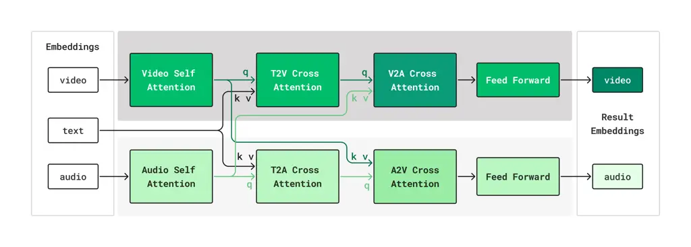

Figure 1: Simplified scheme of a single Kandinsky 6.0 Video transformer
block. The video (top) and audio (bottom) streams each apply
self-attention, cross-attention to the text embeddings (T2V and T2A),
cross-modal attention, and a feed-forward layer. In the V2A block, video
queries attend to audio keys and values; in the A2V block, audio queries
attend to video keys and values.

The super-resolution model, which is applied to the output of the
trained model to obtain Full-HD resolution, is described in Section 3.3.

### 3.2  Core Model

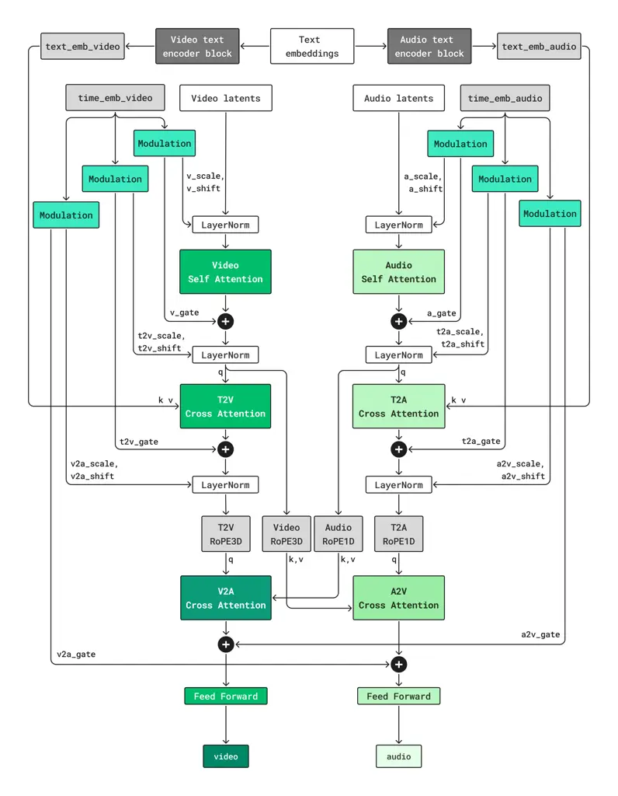

Figure 2: Detailed scheme of the Kandinsky 6.0 Video transformer block.
Each stream has its own text encoder block and timestep embedding; the
timestep embedding modulates every sub-layer through scale, shift, and
gate parameters. In the cross-modal attention layers, video tokens use
3D RoPE and audio tokens use 1D RoPE.

The core of Kandinsky 6.0 Video is a dual-stream CrossDiT architecture
that processes the video and audio modalities, similar to Ovi \[49\] and
LTX-2 \[18\]. It comprises asymmetric DiT backbones for video and audio,
connected by blockwise bidirectional cross-attention.

Figure 1 shows a simplified scheme of a single block with both streams
and the cross-attention that connects them; a detailed diagram is given
in Figure 2.

Each stream inherits its architecture from Kandinsky 5.0 \[11\]. The two
streams have the same number of transformer blocks but differ in hidden
and feed-forward (FFN) dimensions and, consequently, in parameter count.

In Kandinsky 6.0 Video Lite (3B parameters in total), the video stream
has 2B parameters, the audio stream 0.6B, and the cross-attention layers
between the streams 0.4B. In Kandinsky 6.0 Video Pro (29B in total), the
video stream has 19B parameters, the audio stream 5B, and the
cross-attention layers 5B.

Positions are encoded with Rotary Position Embedding (RoPE) \[50\]:
video tokens are indexed by frame number and audio tokens by temporal
position. For video, the frame index is normalized by the frame rate
relative to 24 fps:

```math
\text{RoPE}\left(\frac{N_{\text{frame}}}{\text{fps}/24}\right),
```

where $`N_{\text{frame}}`$ is the input frame index and fps is the
frames per second of the input video.

Table 2 lists the number of blocks and other architectural
hyperparameters for both versions at each training stage (see Section
4).

|                   |                        |                |                 |                 |
| ----------------- | ---------------------- | -------------- | --------------- | --------------- |
| Parameter         | T2V (Lite/Pro)         | T2A (Lite/Pro) | T2AV (Lite/Pro) | I2AV (Lite/Pro) |
|                   | CrossDiT               |                |                 |                 |
| video_model_dim   | 1792 / 4096            | –              | 1792 / 4096     | 1792 / 4096     |
| audio_model_dim   | –                      | 896 / 2048     | 896 / 2048      | 896 / 2048      |
| ff_dim            | 7168 / 16384           | 3584 / 7168    | 3584 (audio),   | 3584 (audio),   |
|                   |                        |                | 7168 (video) /  | 7168 (video) /  |
|                   |                        |                | 7168 (audio),   | 7168 (audio),   |
|                   |                        |                | 16384 (video)   | 16384 (video)   |
| num_visual_blocks | 32 / 60                | –              | 32 / 60         | 32 / 60         |
| num_audio_blocks  | –                      | 32 / 60        | 32 / 60         | 32 / 60         |
| num_text_blocks   | 2 / 4                  | 2 / 4          | 2 / 4           | 2 / 4           |
| in_visual_dim     | 16                     | 16             | 16              | 16              |
| out_visual_dim    | 16                     | 16             | 16              | 16              |
| in_audio_dim      | –                      | 40             | 40              | 40              |
| time_dim          | 512 / 1024             | 512 / 1024     | 512 / 1024      | 512 / 1024      |
| patch_size        | (1, 2, 2)              | (1, 2, 2)      | (1, 2, 2)       | (1, 2, 2)       |
| head_dims_video   | (16, 24, 24) /         | –              | (16, 24, 24) /  | (16, 24, 24) /  |
|                   | (32, 48, 48)           | –              | (32, 48, 48)    | (32, 48, 48)    |
| head_dim_audio    | –                      | 64 / 128       | 64 / 128        | 64 / 128        |
|                   | Qwen                   |                |                 |                 |
| version           | Qwen2.5-VL-7B-Instruct |                |                 |                 |
| max_length        | 1024                   |                |                 |                 |
| emb_size          | 3584                   |                |                 |                 |
|                   | CLIP                   |                |                 |                 |
| max_length        | 77                     |                |                 |                 |
| emb_size          | 768                    |                |                 |                 |

Table 2: Architectural hyperparameters of Kandinsky 6.0 Video Lite and
Pro (values given as Lite / Pro) at each training stage: video-only
(T2V) and audio-only (T2A) pre-training, joint text-to-audio-video
(T2AV) training, and image-to-audio-video (I2AV) training. The
Qwen2.5-VL and CLIP text encoders are the same in all configurations.

### 3.3  Super-Resolution Model

To obtain Full-HD output, videos generated by Kandinsky 6.0 Video are
upscaled by a separate video super-resolution (SR) model. Unlike the
base generator, which uses the Hunyuan VAE, the SR model operates in the
latent space of K-VAE \[51\], a video autoencoder with 64 latent
channels and $`16\times`$ spatial and $`4\times`$ temporal compression.
For spatially aligned inputs with $`T=4n+1`$ frames, a clip of
$`T\times H\times W`$ pixels is encoded into a latent of size
$`T^{\prime}\times\frac{H}{16}\times\frac{W}{16}\times 64`$, where
$`T^{\prime}=(T-1)/4+1`$. Thus, a 121-frame clip corresponds to 31
latent frames.

The SR model consists of two components trained separately:

- •
  the Latent Upscaler (LU), a convolutional network that
  deterministically upsamples a low-quality (LQ) latent by a factor of
  $`2`$ or $`4`$ to the working resolution of the SR-DiT (Section
  3.3.2);
- •
  the SR-DiT, a flow-matching diffusion transformer that removes
  degradations and restores detail in the upsampled latent (Section
  3.3.1).

A single SR-DiT is trained jointly for the $`\times 2`$ and $`\times 4`$
routes, while the LU uses scale-specific branches.

In our inference pipeline, the SR-DiT processes spatial tiles (height
$`\times`$ width) corresponding to $`512\times 768`$ px for landscape
content, $`768\times 512`$ px for portrait content, and
$`512\times 512`$ px for square content. These correspond to latent
grids of $`32\times 48`$, $`48\times 32`$, and $`32\times 32`$ cells,
respectively, with 64 channels. For a fixed scale and working tile size,
larger input videos require more tiles (Section 5). The SR model
supports scale factors of $`\times 2`$ and $`\times 4`$; the
$`\times 2.25`$ route used for Full-HD output combines bilinear
$`\times 1.125`$ pre-upscaling in pixel space with the $`\times 2`$
route.

#### 3.3.1  SR-DiT

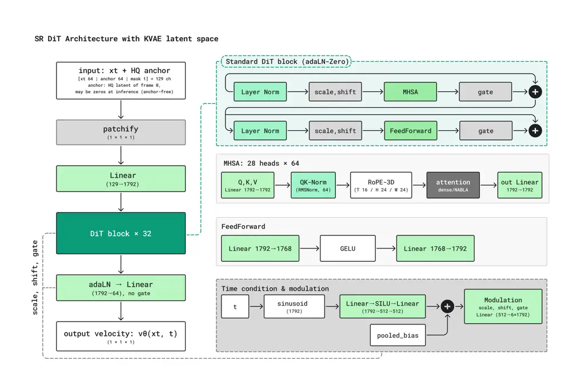

Figure 3: SR-DiT architecture. The noisy video latent, first-frame HQ
anchor, and binary anchor mask are concatenated along the channel
dimension and processed by timestep-modulated DiT blocks. The output
head predicts the flow-matching velocity. The model operates without
text conditioning.

The SR-DiT (Figure 3) is based on Kandinsky 5.0 Video Lite \[11\]. It is
initialized from a text-free Kandinsky 5.0 Video Lite (SFT) checkpoint
operating in the K-VAE latent space. The model has 32 transformer blocks
with a hidden dimension of 1792, 28 attention heads of dimension 64, an
FFN dimension of 7168, and a timestep embedding dimension of 512. The
backbone with the standard velocity head contains approximately 1.41B
parameters.

##### Text-free design.

The SR-DiT does not use text encoders or text cross-attention and
requires no prompt. The pooled text contribution to the timestep
conditioning is replaced with a learnable constant (_pooled bias_). Each
block uses six modulation vectors: scale, shift, and gate for
self-attention and for the FFN, instead of the nine vectors used by the
text-conditioned architecture. A SiLU activation followed by a linear
projection $`512\to 6\times 1792`$ produces these vectors. The
pretrained modulation weights are inherited from the initialization
checkpoint.

##### Input and tokenization.

The model receives a 64-channel noisy latent $`x_{t}`$ together with a
64-channel anchor tensor and a binary anchor mask. When an HQ anchor is
provided, its latent occupies the first temporal position of the anchor
tensor, and the mask is one at that position; the remaining positions
are zero. When the anchor is absent, both the anchor tensor and its mask
are zero. The concatenated input
$`[x_{t}\,|\,\text{anchor}\,|\,\text{mask}]`$ therefore always has
$`64+64+1=129`$ channels.

The patch size is $`(1,1,1)`$, so each token corresponds to one latent
cell, at a spatial stride of 16 px. A $`512\times 768`$ tile yields 1536
tokens per latent frame, while a $`512\times 512`$ tile yields 1024. A
linear projection $`129\to 1792`$ maps the input tokens to the model
width. The $`\times 2`$ and $`\times 4`$ routes use the same SR-DiT
weights and input dimensions, with their inputs prepared by the
corresponding LU branches.

##### Transformer block.

Each block contains self-attention and an FFN with residual connections,
LayerNorm without learnable affine parameters, and adaLN-Zero
modulation. Queries and keys are normalized with RMSNorm within each
head. The model uses 3D RoPE, with the head dimension split into
$`(16,24,24)`$ channels for the temporal, height, and width axes,
corresponding to 8, 12, and 12 rotary frequency pairs. The positional
rotations are shared across all 32 blocks.

Attention is dense (FlashAttention) in the first training stage and is
replaced with sparse NABLA attention \[12\] during the second stage
(Section 4.6). The FFN consists of two bias-free linear layers,
$`1792\to 7168\to 1792`$, with a GELU activation between them. It
accounts for approximately 58% of each block’s parameters.

##### Output head and parameter count.

Before distillation, the output head consists of a LayerNorm modulated
by the timestep conditioning through scale and shift, followed by a
linear projection $`1792\to 64`$ that predicts the velocity. Each
transformer block contains approximately 44.06M parameters: 5.52M in
modulation, 12.85M in attention, and 25.69M in the FFN. Including the
input projection, timestep embedding, pooled bias, and output head, the
model contains approximately 1.413B parameters.

For $`\pi`$-Flow DX distillation, the final projection is expanded to
$`1792\to 640`$, producing ten 64-channel outputs per token for
constructing the DX policy (Section 4.6). The transformer backbone is
unchanged, and the expanded head adds approximately 1.03M parameters.
Figure 3 shows the architecture with the standard velocity head.

#### 3.3.2  Latent Upscaler

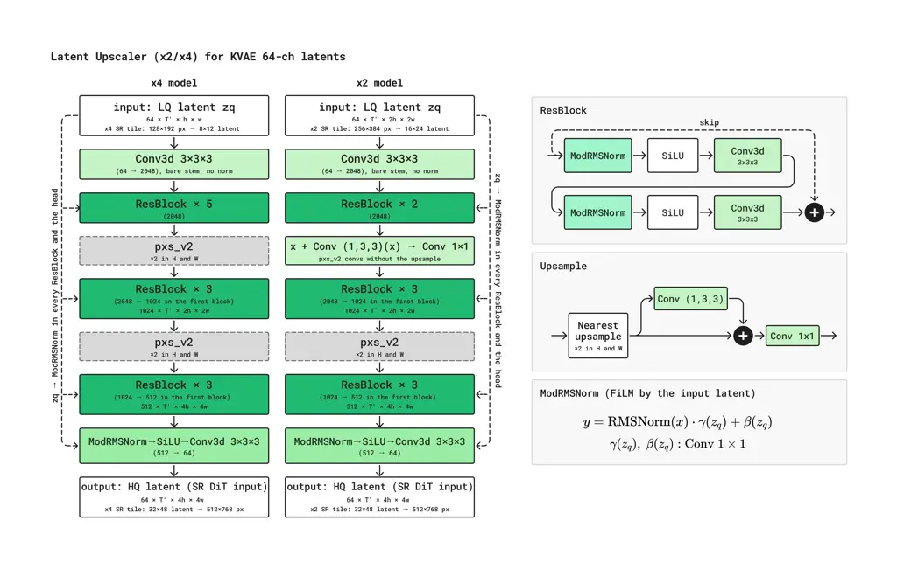

Figure 4: Latent Upscaler architecture: the $`\times 4`$ branch (left),
the $`\times 2`$ branch (middle), and their building blocks (right).
Both branches follow the K-VAE decoder geometry and map 64-channel LQ
latents to upsampled 64-channel latents, preserving the temporal
resolution. The outputs labeled ‘‘HQ latent’’ refer to the
higher-resolution latent grid; they retain degradations, which are
subsequently removed by SR-DiT.

The Latent Upscaler (LU; Figure 4) brings the LQ latent to the working
resolution of the SR-DiT directly in latent space, without decoding to
pixels. Its architecture is derived from the K-VAE decoder: the
$`\times 4`$ model follows the decoder’s channel widths, residual
blocks, modulated normalization, and spatial upsampling modules over two
upsampling stages. Unlike the decoder, it outputs 64-channel latents
instead of pixels and preserves the temporal resolution. The
$`\times 2`$ branch is constructed from the trained $`\times 4`$ model
with a shorter front section and one spatial upsampling stage.

The LU replaces pixel-space bilinear resizing followed by K-VAE encoding
of each upscaled tile. Instead, the source video is encoded once, and
spatial tiles are extracted and upscaled directly in latent space. This
avoids separately encoding each upscaled pixel tile and reduces
inference time (Section 5).

For a landscape tile, the LU maps an $`8\times 12`$ latent grid
($`128\times 192`$ px of the source video) to $`32\times 48`$ for the
$`\times 4`$ route, and a $`16\times 24`$ grid ($`256\times 384`$ px) to
$`32\times 48`$ for the $`\times 2`$ route.

##### $`\times 4`$ model.

The architecture follows the widths and block counts of the K-VAE
decoder over the part spanning two spatial upsampling stages. The input
stem, residual blocks, and upsampling modules are initialized from the
decoder; the output heads are initialized randomly. The $`\times 4`$
inference path consists of:

- •
  an input stem: a $`3\times 3\times 3`$ convolution $`64\to 2048`$
  without normalization or activation (3.5M parameters);
- •
  five ResBlocks at width 2048, operating at the input resolution
  (1135.2M parameters);
- •
  the first $`\times 2`$ spatial upsampling module (41.9M);
- •
  three ResBlocks, with the first reducing the width from 2048 to 1024
  (201.2M);
- •
  the second $`\times 2`$ spatial upsampling module (10.5M);
- •
  three ResBlocks, with the first reducing the width from 1024 to 512
  (50.5M);
- •
  an output head consisting of ModRMSNorm, SiLU, and a
  $`3\times 3\times 3`$ convolution $`512\to 64`$ (1.0M).

These modules contain approximately 1.44B parameters, of which about 79%
belong to the five input-resolution ResBlocks.

Each ResBlock consists of two ModRMSNorm–SiLU–Conv3d units with a
residual connection and no bottleneck. Blocks that reduce the channel
width use a $`1\times 1\times 1`$ projection in the residual connection.
All normalization layers, including the one in the output head, are
modulated by the input LQ latent $`z_{q}`$. The conditioning latent is
resized with nearest-neighbor interpolation to match the current feature
grid, and $`1\times 1\times 1`$ convolutions produce the modulation
scale and shift.

Each spatial upsampling module doubles the height and width using
nearest-neighbor resizing, followed by a residual $`(1,3,3)`$
convolution and a $`1\times 1\times 1`$ convolution. The
$`3\times 3\times 3`$ convolutions use symmetric temporal padding with
replicated edge frames. When transferring weights from the causal K-VAE
decoder, the temporal kernels are shifted to align them with this
symmetric window.

##### $`\times 2`$ model.

For the same output tile, the $`\times 2`$ input contains four times as
many spatial latent cells as the $`\times 4`$ input. Applying all five
2048-wide ResBlocks on this larger grid would substantially increase
computation. The $`\times 2`$ branch therefore uses a shorter front
section and only one spatial upsampling stage.

The $`\times 2`$ branch is trained after the $`\times 4`$ model and
initialized from its trained checkpoint. All branch modules are copied
from the $`\times 4`$ model, with no randomly initialized parameters:

- •
  the input stem is copied from the $`\times 4`$ stem;
- •
  two 2048-wide adapter ResBlocks are copied from the first and fifth
  ResBlocks of the $`\times 4`$ model;
- •
  the convolutions of the first upsampling module are copied and applied
  without nearest-neighbor resizing;
- •
  the remaining modules are separate copies of the three
  $`2048\to 1024`$ ResBlocks, the second upsampling module, the three
  $`1024\to 512`$ ResBlocks, and the output head.

All modulated normalization layers in this branch are conditioned on the
$`\times 2`$ input latent. The original $`\times 4`$ path remains frozen
throughout $`\times 2`$ training, while all copied $`\times 2`$ modules
are optimized from the first training step. The $`\times 2`$ inference
path contains approximately 0.763B parameters and does not execute the
original $`\times 4`$ path.

## 4  Training Stages

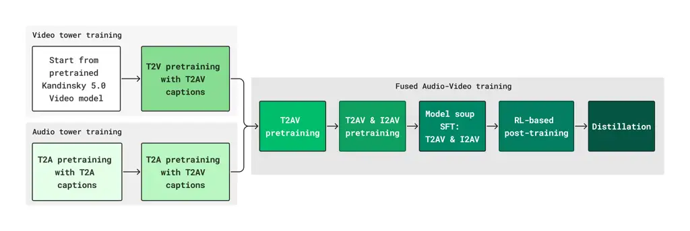

Figure 5: Training pipeline of Kandinsky 6.0 Video. The video stream
(initialized from the pretrained Kandinsky 5.0 Video model) and the
audio stream are first pre-trained separately, then fused and trained
jointly in T2AV mode and in mixed T2AV/I2AV mode. Joint pre-training is
followed by supervised fine-tuning with model soup, RL-based
post-training, and distillation.

### 4.1  Overview

Kandinsky 6.0 Video is trained in several sequential stages (Figure 5).
Pre-training comprises three phases: separate training of the video
stream, separate training of the audio stream from scratch, and joint
training of both streams. Pre-training is followed by supervised
fine-tuning (SFT), RL-based post-training (alignment), and distillation.
Kandinsky 6.0 Video Lite and Kandinsky 6.0 Video Pro follow the same
training scheme and differ mainly in the number of steps, batch size,
and learning rates; other differences are stated where they apply (e.g.,
the RL setup in Section 4.4).

### 4.2  Continuous Pre-training

All pre-training stages use flow matching \[3\] with an MSE loss. The
audio and video streams are first trained separately and are then
connected through cross-attention layers and trained jointly. The audio
stream is trained from scratch, with weights randomly initialized from a
normal distribution. The video stream is initialized from the
corresponding Kandinsky 5.0 Video (Lite or Pro) pre-training checkpoint
(SD resolution, 45k steps). At each stage, the Lite and Pro models are
trained on the same data.

#### 4.2.1  Separate Training

Kandinsky 6.0 Video Lite:

- •
  Text-to-audio (T2A): 40k steps on T2A captions; batch size
  $`128\times 640`$ seconds; sample length from 5 to 20 seconds.
- •
  T2A (continued): 2k steps on T2AV captions; batch size
  $`256\times 640`$ seconds; sample length from 5 to 20 seconds.
- •
  Text-to-video (T2V), in parallel with T2A: starting from the Kandinsky
  5.0 Video Lite SD pre-training checkpoint (45k steps on T2V captions),
  20k steps of T2V pre-training on T2AV captions; batch size
  $`2\times 512=1024`$.

Kandinsky 6.0 Video Pro:

- •
  T2A: 30k steps on T2A captions; batch size $`128\times 640`$ seconds.
- •
  T2A (continued): 4k steps on T2AV captions; batch size
  $`256\times 640`$ seconds.
- •
  T2V, in parallel with T2A: starting from the Kandinsky 5.0 Video Pro
  SD pre-training checkpoint (45k steps on T2V captions), 14k steps of
  T2V pre-training on T2AV captions; batch size $`1\times 1024=1024`$.

#### 4.2.2  Joint T2AV Training

Kandinsky 6.0 Video Lite:

- •
  T2AV: 57.5k steps; batch size 256; up to 121 frames at 23–25 fps (at
  most 5 seconds of video).
- •
  T2AV + I2AV: 4k additional steps with learning rate
  $`1\mathrm{e}{-5}`$, with 25% of samples in I2AV mode.

Kandinsky 6.0 Video Pro:

- •
  T2AV: 46k steps with learning rate $`5\mathrm{e}{-5}`$, followed by 3k
  steps with learning rate $`2.5\mathrm{e}{-5}`$ (49k steps in total).
- •
  T2AV + I2AV: 5k additional steps with learning rate
  $`2.5\mathrm{e}{-5}`$, with 25% of samples in I2AV mode.

During joint T2AV training, we use the independent_time mode, in which
the diffusion time is sampled independently for video and audio, so that
the two modalities are noised to different levels $`t`$. This is
required for audio-to-video and video-to-audio generation, where the
model must take into account information from the other modality. In
addition, a training batch may contain audio only, video only, images
only, or video with audio; images come from the image dataset, which is
also used to inject knowledge of the Russian Cultural Code (RCC).
Training is performed in bfloat16 precision. Training details and
hyperparameters for all continuous pre-training stages are given in
Table 3.

|                           |                          |                |              |                           |                          |
| ------------------------- | ------------------------ | -------------- | ------------ | ------------------------- | ------------------------ |
| Parameter                 | T2V                      | T2A,           | T2A,         | T2AV                      | T2AV +                   |
|                           | (Lite/Pro)               | Audio captions | AV captions  | (Lite/Pro)                | I2AV (25$`\%`$)          |
|                           |                          | (Lite/Pro)     | (Lite/Pro)   |                           | (Lite/Pro)               |
| num_steps                 | 45k (T2V captions)       | 40k / 30k      | 2k / 4k      | 57.5k / 49k               | 4k / 5k                  |
|                           | 20k/14k (T2AV captions)  |                |              |                           |                          |
|                           | Optimizer                |                |              |                           |                          |
| learning_rate             | 3e-05                    | 0.0001         | 3e-05        | 5e-05 / 5e-05 (46k steps) | 1e-05 / 2.5e-05          |
|                           |                          |                |              | & 2.5e-05 (3k steps)      |                          |
| weight_decay              | 1e-3                     | 0.001          | 0.001        | 0.001                     | 0.001                    |
| betas                     | (0.9, 0.95)              | (0.9, 0.999)   | (0.9, 0.999) | (0.9, 0.95)               | (0.9, 0.95)              |
| ema_decay                 | 0.999                    | 0.999          | 0.999        | 0.999                     | 0.999                    |
| num_warmup_steps          | 1000                     | 1000           | 1000         | 1000                      | 1 / 0                    |
|                           | Data                     |                |              |                           |                          |
| uncond_prob               | 0.1                      | 0              | 0.1          | 0.1                       | 0.1                      |
|                           | Image                    |                |              |                           |                          |
| data_prob                 | 0.02 / 0.01              | –              | –            | 0 / 0.01                  | –                        |
| max_seq_len               | 62 / 31                  | –              | –            | 62 / 31                   | –                        |
| resolutions_probs         | 768$`\times`$512: 0.502; | –              | –            | 768$`\times`$512: 0.502;  | –                        |
|                           | 512$`\times`$768: 0.272; | –              | –            | 512$`\times`$768: 0.272;  | –                        |
|                           | 512$`\times`$512: 0.226  | –              | –            | 512$`\times`$512: 0.226   | –                        |
| long_prompts_prob         | 0.7                      | –              | –            | as for video              | –                        |
| medium_prompts_prob       | 0.15                     | –              | –            | as for video              | –                        |
| short_prompts_prob        | 0.1                      | –              | –            | as for video              | –                        |
| shortest_prompts_prob     | 0.05                     | –              | –            | as for video              | –                        |
| RCC_en_caption_prob       | 0.5                      | –              | –            | 0.5                       | –                        |
| RCC_ru_caption_prob       | 0.5                      | –              | –            | 0.5                       | –                        |
|                           | Video                    |                |              |                           |                          |
| video_len (latent frames) | \[5, 31\]                | –              | –            | \[1, 31\]                 | \[5, 31\]                |
| data_prob                 | 0.98 / 0.99              | –              | –            | 1.0 / 0.99                | 1.0                      |
| fps_range                 | \[23, 25\]               | –              | –            | \[23, 25\]                | \[23, 25\]               |
| resolutions_probs         | 768$`\times`$512: 0.989; | –              | –            | 768$`\times`$512: 0.973;  | 768$`\times`$512: 0.999; |
|                           | 512$`\times`$768: 0.006; | –              | –            | 512$`\times`$768: 0.024;  | 512$`\times`$768: 0.001; |
|                           | 512$`\times`$512: 0.005  | –              | –            | 512$`\times`$512: 0.003   | 512$`\times`$512: 0      |
| long_prompts_prob         | 0.7                      | –              | –            | 0.7                       | 0.7                      |
| medium_prompts_prob       | 0.15                     | –              | –            | 0.15                      | 0.15                     |
| short_prompts_prob        | 0.1                      | –              | –            | 0.1                       | 0.1                      |
| shortest_prompts_prob     | 0.05                     | –              | –            | 0.05                      | 0.05                     |
| RCC_en_caption_prob       | 0.5                      | –              | –            | 0.5                       | 0.5                      |
| RCC_ru_caption_prob       | 0.5                      | –              | –            | 0.5                       | 0.5                      |
|                           | Audio                    |                |              |                           |                          |
| audio_len (sec)           | –                        | \[5, 20\]      | \[2, 31\]    | as for video              | as for video             |
| data_prob                 | –                        | 1.0            | 1.0          | as for video              | as for video             |
| long_prompts_prob         | –                        | 0.7            | 0.7          | as for video              | as for video             |
| medium_prompts_prob       | –                        | 0.15           | 0.15         | as for video              | as for video             |
| short_prompts_prob        | –                        | 0.1            | 0.1          | as for video              | as for video             |
| shortest_prompts_prob     | –                        | 0.05           | 0.05         | as for video              | as for video             |

Table 3: Training hyperparameters and data sampling settings for the
continuous pre-training stages of Kandinsky 6.0 Video Lite and Pro
(values given as Lite / Pro where they differ): separate T2V and T2A
pre-training (the latter first on audio captions and then on audio-video
captions), joint T2AV training, and the final T2AV stage with 25% of
I2AV samples.

#### 4.2.3  Image-to-Audio-Video (I2AV) Mode

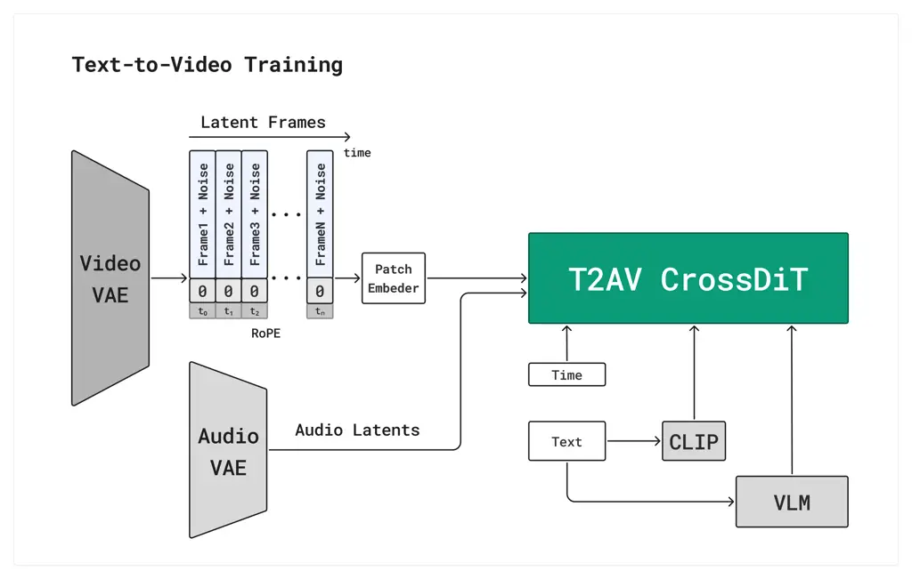

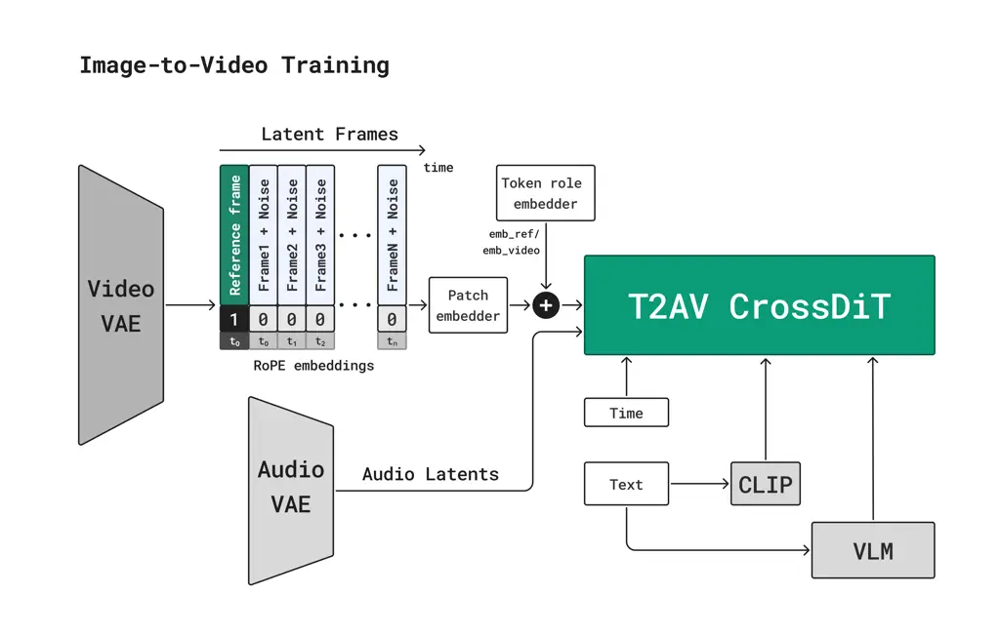

Figure 6: Input construction in T2AV (top) and I2AV (bottom) training
modes. In I2AV mode, the latent of the reference frame is concatenated
with the noisy video latents along the temporal axis and marked with
mask value 1 (0 for the frames to be generated); a learnable Token Role
Embedding (emb_ref / emb_video) is added to the patch-embedded tokens.
In both modes, the text prompt is encoded by CLIP and a VLM, and audio
latents are produced by the audio VAE.

Both model versions are trained in I2AV mode with a probability of 25%
during the final pre-training stage. The input scheme is compared with
that of T2AV mode in Figure 6. The latent of the conditioning frame is
concatenated with the video latents along the temporal axis and receives
its own temporal RoPE position. A binary channel mask distinguishes the
conditioning frame (value 1) from the frames to be denoised (value 0).
In addition, we introduce two learnable embeddings in the token space,
the Token Role Embeddings (TRE): one for the noisy video tokens and one
for the reference frame. They are added to the input tokens and provide
an additional learnable signal indicating whether a token is noise or
conditioning.

Inference-time ablations showed that TRE has a relatively weak effect on
the result. Disabling the embeddings, or decomposing them into shared
and role-specific components, changed the generations only slightly; a
noticeable effect appeared only when the role-specific component was
artificially amplified many times. This indicates that TRE carries
discriminative information about token roles but is not the primary
mechanism for recognizing the reference frame, since other cues largely
duplicate its function. At the same time, inference-time ablations
cannot fully determine how useful TRE is during training; this would
require a separate training run without these embeddings.

The channel mask and the temporal RoPE had the strongest effects.
Setting the mask to one for all tokens almost completely blocked
denoising, whereas an all-zero mask still allowed the video to be
denoised but produced artifacts, mainly in the first latent frame.
Changing the temporal RoPE position of the reference frame made the
model use it at the specified position: a reference with RoPE position
$`t_{4}`$, $`t_{8}`$, and so on acted as a condition for the
corresponding part of the video. Thus, RoPE is the primary mechanism
that binds the reference frame to a position in the generated sequence,
the mask explicitly separates conditioning tokens from tokens to be
denoised, and TRE serves as an additional, partially redundant signal.

### 4.3  Supervised Fine-Tuning

Supervised fine-tuning is performed in two stages on the SFT datasets
described in Section 2 (see Table 1). In both stages, a separate model
is fine-tuned on each of the 11 domains. The domain-specific models are
trained independently through both stages and are merged into a model
soup by uniform weight averaging only at the end of Stage 2. The same
procedure is applied to both Kandinsky 6.0 Video Lite and Kandinsky 6.0
Video Pro.

Stage 1 (visual quality). The goal of this stage is to improve visual
quality. Training starts from the pre-trained checkpoint. The audio
stream, the fusion modules, and the audio-text modules are frozen, and
only the video loss is optimized: audio inputs still pass through the
frozen audio stream but do not contribute to the loss. We use a learning
rate of $`1\times 10^{-5}`$ and the same mixture of prompt detail levels
as in pre-training (long: 0.7, medium: 0.15, short: 0.1, shortest:
0.05). The model is trained in T2AV and I2AV modes (75% and 25% of
steps, respectively). Training is stopped after 7,000 steps, the
visually best iteration before overfitting begins. To evaluate the
result of this stage, the 11 domain-specific checkpoints are uniformly
averaged into an intermediate Stage 1 soup. This soup is used only for
quality measurement and is not used in further training.

Stage 2 (synchronization and lip-sync). This stage improves audio-video
synchronization, with particular emphasis on lip-sync. Training
continues separately from each domain-specific Stage 1 checkpoint rather
than from the Stage 1 soup. All modules are unfrozen and trained with
different learning rates: $`1\times 10^{-5}`$ for the video stream and
the shared modules and $`1\times 10^{-6}`$ for the audio components. The
loss is a weighted sum of the video loss (weight 0.85), the audio loss
(0.15), and a new face loss (1.0). The face loss is the video loss
restricted to the facial region in the latent space; it encourages more
accurate lip-sync. As in Stage 1, 75% of steps are in T2AV mode and 25%
in I2AV mode. After 5,000 steps, the 11 domain-specific checkpoints are
uniformly averaged to obtain the final SFT model.

### 4.4  Reinforcement Learning

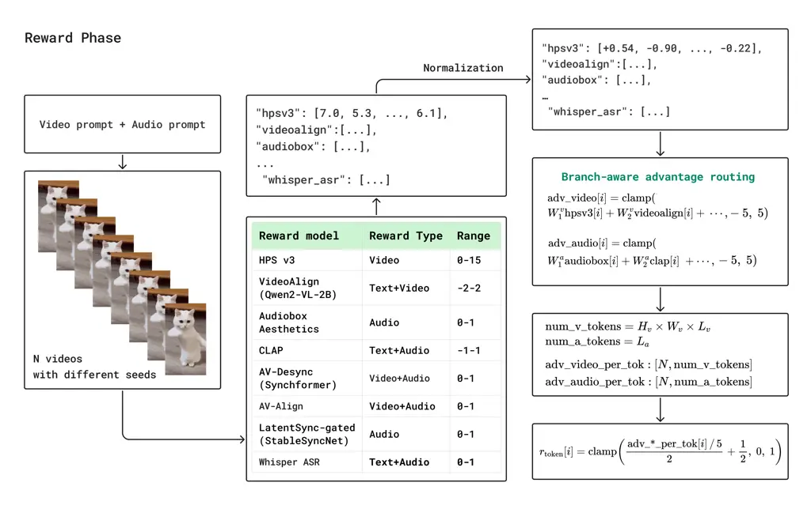

Figure 7: Reward phase of RL post-training. For each prompt, a group of
videos with audio is generated with different random seeds and scored by
eight reward terms. Each score is centered within the group and scaled
by the batch-wide standard deviation, routed into separate video and
audio advantages (sync terms enter both), clamped to $`[-5,5]`$,
broadcast to the video and audio tokens, and rescaled to per-token
rewards $`r_{\text{token}}\in[0,1]`$, where 1 corresponds to a rollout
far above the group mean and 0 far below it.

For RL post-training, we adapt the OmniNFT method \[24\], originally
developed for LTX-2 19B, to the Kandinsky 6.0 Video backbone. The
approach combines modality-wise advantage routing, layer-wise gradient
surgery, and region-wise loss reweighting. The reward phase and the
training phase are illustrated in Figures 7 and 8, respectively. A
side-by-side comparison of the RL and SFT checkpoints is given in
Section 7.2.9.

##### Data sampling and conditioning.

The RL dataset is used online. All RL training is performed in pure T2AV
mode; image-conditioned generation is not used. In each training epoch,
prompts are sampled as follows:

- •
  Bilingual prompting: each prompt is given to the model in Russian or
  English with equal probability. The language is chosen
  deterministically from a hash of the sample index and the epoch, which
  keeps the choice consistent across distributed ranks. Reward models
  always receive English metadata to ensure stable scoring.
- •
  Speech oversampling: clips containing speech are oversampled by a
  factor of 1.5 to provide sufficient signal for the speech-related
  rewards (Whisper-ASR, lip-sync).
- •
  Prompt format: visual and audio descriptions are combined into the
  native Kandinsky format:

  ```ltx_verbatim
      <visual description> <AUDCAP><audio description><ENDAUDCAP>

  ```

  For scenes with literal speech, the spoken text is enclosed in the
  markers \<S\>...\<E\>.

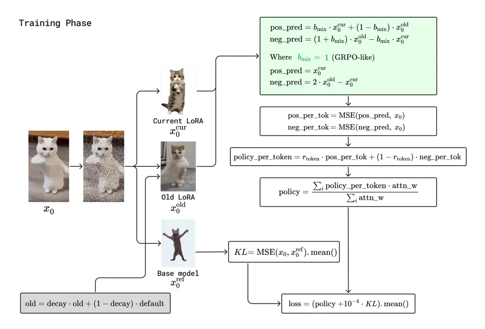

Figure 8: Training phase of RL post-training. The rollout latent is
re-noised and denoised by the current LoRA, the old LoRA, and the frozen
base (SFT) model. Predictions of the current and old LoRA are combined
into positive and negative predictions; their per-token MSE losses to
the rollout latent are interpolated with the rewards
$`r_{\text{token}}`$ from the reward phase and aggregated with the
region-wise attention weights attn_w derived from A2V cross-attention. A
KL term with respect to the base-model prediction regularizes training;
the old LoRA is an exponential moving average of the current one.

##### Reward functions and routing.

The reward stack consists of eight objectives grouped into three
branches: video, audio, and sync. Branch weights and per-reward weights
are given in parentheses:

- •
  Video branch (2.5): HPSv3 (1.5), VideoAlign (1.0);
- •
  Audio branch (2.0): AudioBox Aesthetics (0.5), CLAP (1.0), Whisper-ASR
  (0.5);
- •
  Sync branch (2.75, affects both video and audio): AV-desync (0.5),
  AV-align (0.75), LatentSync-gated (1.5). The last term is the
  StableSyncNet lip-sync score modulated by speech intelligibility,
  $`s_{\text{LS}}\cdot(0.5+0.5\,s_{\text{ASR}})`$, where
  $`s_{\text{ASR}}=\max(0,1-\mathrm{WER})`$ is the Whisper-ASR score of
  the same rollout.

Each raw reward is first converted into an advantage: it is centered by
its mean within the rollout group and scaled by the batch-wide standard
deviation, floored at $`0.1`$ to avoid advantage blow-up in near-uniform
groups. The weighted advantages are then summed into two branch-aware
advantages, one per modality. The sync-branch terms (AV-desync,
AV-align, LatentSync-gated) are added to both the video and the audio
advantages. Both advantages are clamped to $`[-5,5]`$ for stability. The
per-modality advantages are then broadcast to per-token rewards: the
video advantage over the latent video token grid
$`H_{v}\times W_{v}\times L_{v}`$ and the audio advantage over the
$`L_{a}`$ audio tokens. Each is rescaled to
$`r_{\text{token}}=\mathrm{clamp}((\mathrm{adv}/5+1)/2,\,0,\,1)`$ before
being used in the policy update.

##### RL setup.

We use GRPO groups of $`K=10`$ rollouts per prompt. Rollouts are
generated at $`512\times 768`$ resolution with $`31`$ latent frames (121
frames, 5 s at 24 fps), using the DPM2 solver with $`20`$ steps,
$`\mathrm{CFG}=1.0`$, and noise level $`0`$. With these settings, the
sampler is deterministic, so the random seed is the only source of
diversity within a group. Note that RL is performed at a lower spatial
resolution than Full-HD inference. The model is fine-tuned with LoRA
($`r=16`$, $`\alpha=32`$) on top of the frozen SFT model. LoRA is
applied to every linear layer inside the transformer blocks of both
streams — self-attention, text cross-attention, feed-forward, and both
cross-modal attention modules (Q, K, V, and output projections); text,
time, and modulation embeddings are not adapted. This amounts to 0.69%
of the parameters for Pro (199M) and 1.57% for Lite (47M). The LoRA is
trained from scratch, without a warm-start checkpoint or transferred
optimizer state.

Both model sizes undergo RL post-training with the same recipe. The
hyperparameters in this section refer to Kandinsky 6.0 Video Pro (60
blocks); for Lite (32 blocks) we use $`K=8`$ rollouts per prompt and a
gradient-surgery schedule recalibrated for its depth (see below). Unless
stated otherwise, the numbers reported here are for Pro.

##### Optimization.

The training phase is shown in Figure 8. The clean rollout sample
$`x_{0}`$ is re-noised at timesteps drawn from the 8 noisiest of the 20
sampling timesteps (8 random draws per rollout) and passed to three
models: the current LoRA, the old LoRA, and the frozen base (SFT) model,
which produce the predictions $`x_{0}^{\text{cur}}`$,
$`x_{0}^{\text{old}}`$, and $`x_{0}^{\text{ref}}`$, respectively. The
policy loss compares the predictions of the current and the old LoRA in
a DPO-like manner. The positive and negative predictions are

```math
\displaystyle\text{pos\_pred}=b_{\text{mix}}\cdot x_{0}^{\text{cur}}+(1-b_{\text{mix}})\cdot x_{0}^{\text{old}},
```

```math
\displaystyle\text{neg\_pred}=(1+b_{\text{mix}})\cdot x_{0}^{\text{old}}-b_{\text{mix}}\cdot x_{0}^{\text{cur}}.
```

We use the GRPO-like setting $`b_{\text{mix}}=1`$, for which
$`\text{pos\_pred}=x_{0}^{\text{cur}}`$ and
$`\text{neg\_pred}=2\cdot x_{0}^{\text{old}}-x_{0}^{\text{cur}}`$. Both
predictions are compared with the clean sample $`x_{0}`$,

```math
\text{pos\_per\_tok}=\mathrm{MSE}(\text{pos\_pred},x_{0}),\qquad\text{neg\_per\_tok}=\mathrm{MSE}(\text{neg\_pred},x_{0}),
```

each divided by the per-sample mean absolute deviation of the
corresponding prediction from $`x_{0}`$ (as in OmniNFT), and weighted
with the per-token rewards $`r_{\text{token}}`$:

```math
\text{policy\_per\_token}=r_{\text{token}}\cdot\text{pos\_per\_tok}+(1-r_{\text{token}})\cdot\text{neg\_per\_tok}.
```

The per-token terms are aggregated with attention weights,

```math
\text{policy}=\frac{\sum_{i}\text{policy\_per\_token}_{i}\cdot\text{attn\_w}_{i}}{\sum_{i}\text{attn\_w}_{i}},
```

where attn*w is the region-wise reweighting mask described below. The
old LoRA is an exponential moving average of the current one, updated
once per epoch as
$`\theta*{\text{old}}\leftarrow d\cdot\theta*{\text{old}}+(1-d)\cdot\theta*{\text{cur}}`$,
where the decay $`d`$ grows linearly from $`0`$ by $`10^{-3}`$ per
optimizer step and is capped at $`0.5`$. A KL term anchors the model to
the frozen SFT model:
$`\mathrm{KL}=\mathrm{MSE}(x*{0}^{\text{cur}},x*{0}^{\text{ref}})`$, and
the final loss is

```math
\text{loss}=\mathrm{mean}\left(\text{policy}+\beta\cdot\mathrm{KL}\right),\qquad\beta=10^{-4}.
```

We use AdamW, initialized from scratch, with a learning rate of
$`3\times 10^{-5}`$, linear warmup over 5 epochs, and cosine decay to
$`5\times 10^{-6}`$ over 300 epochs. Gradient norms are clipped at
$`1.0`$.

##### Checkpoint selection.

We do not take the last training epoch as the final RL checkpoint.
Instead, we track the weighted sum of rewards during training and select
the checkpoint with the best average over a sliding window of 5 epochs,
which avoids picking a single lucky iteration.

##### Regularization techniques.

- •
  Layer-wise gradient surgery. To prevent video-branch gradients from
  disrupting audio representations, we scale down the gradients on the
  key-value path of the V2A cross-attention, in which video queries
  attend to audio keys and values (Figure 1). The production Pro model
  uses a data-driven per-block schedule: scale 0.0 for block 0, 0.1 for
  blocks 1–10, and 0.3 for blocks 50–59 (a deep AV-sync zone identified
  by KV ablation), while blocks 11–49 are left unscaled (scale 1.0). For
  Lite (32 blocks) the recalibrated schedule is 0.0 for block 0, 0.1 for
  blocks 1–5, and 0.3 for blocks 22–26. The zones reported for LTX-2 did
  not transfer directly to our models, so we calibrated these schedules
  with our own probes: blockwise ablation of the cross-modal key–value
  input (measuring the resulting audio–video desynchronization) and
  measurement of the video-loss gradient leaking into the audio stream.
- •
  Region-wise loss reweighting. The weights attn_w used in the policy
  aggregation are derived from the attention maps of the A2V
  cross-attention, in which audio queries attend to video keys and
  values, sampled at a subset of denoising steps. Video patches that
  receive stronger attention from audio tokens (typically faces, hands,
  and musical instruments) are assigned higher weights. The reweighting
  factor is capped at 1.5$`\times`$ and is mapped from the DiT patch
  grid to the pre-patch loss grid by spatial unpatchifying.

##### Results.

RL post-training substantially improves speech intelligibility. For
Kandinsky 6.0 Video Pro, the word error rate (WER) on a held-out speech
benchmark (64 prompts, 3 seeds each) decreases from 0.235 for the SFT
model to 0.124, a relative reduction of 47% (paired Wilcoxon test,
$`p<10^{-3}`$); for Lite it decreases from 0.179 to 0.127 ($`-29\%`$,
$`p<10^{-3}`$). WER is computed with Whisper-large-v3, which is also one
of the reward models; the gain is confirmed on the public Harvard
sentences (100 prompts), where Pro WER drops from 0.251 to 0.180
($`p=0.005`$).

### 4.5  Distillation

Following Kandinsky 5.0 \[11\], we split distillation into two
complementary stages:

1.  1.  Trajectory distillation: the teacher’s sampling trajectory is
        compressed into a few-step student.
2.  2.  Quality improvement: the perceptual fidelity lost during aggressive
        trajectory compression is recovered using real data and adversarial
        training.

#### 4.5.1  Motivation and Method Selection

For trajectory distillation, we evaluated several families of methods:
DMD \[52\], DMD2 \[53\], SID \[54\], Phased Consistency \[55\], CFG
distillation \[56\], $`\pi`$-Flow \[57\], and Parallel Decoding
Distillation (PDD) \[58\].

Distribution-matching methods (DMD, DMD2, SID) provide a direct
objective for aligning the student and teacher distributions, but in our
experiments they were prone to mode collapse and mode dropping. They
also required substantially more GPUs because of expensive teacher
evaluations, auxiliary score estimation, and optimization overhead. This
cost is especially high for video, whose spatio-temporal latents are far
more expensive to process than those of images.

CFG distillation and consistency-based methods are simple and effective
baselines, but we observed that they can alter the teacher’s generation
behavior, including motion dynamics and the distribution of generated
samples. They remained useful but were not flexible or performant enough
for our few-step video generation setting.

We then evaluated two more recent trajectory-based methods, $`\pi`$-Flow
and PDD. Of these, $`\pi`$-Flow showed the most reliable convergence and
the best preservation of the teacher trajectory. Its imitation-learning
formulation trains the student on-policy, i.e., on the states
encountered during the student’s own rollout, which is the same
distribution the student faces at inference.

As with DMD, the quality of $`\pi`$-Flow is ultimately bounded by the
teacher. Unlike distribution-matching methods, however, it avoids an
aggressively mode-seeking objective: it encourages the student to
reproduce the teacher’s local decisions along the trajectory, which
substantially reduces mode collapse and mode dropping. The guided
teacher trajectory can also be distilled directly, which removes the
need for a separate CFG distillation stage. For these reasons, we chose
$`\pi`$-Flow for trajectory distillation.

Trajectory compression alone does not fully preserve model quality: as
the number of sampling steps decreases, generated videos become smoother
and less detailed. This effect grows with more aggressive compression
even when the semantic composition and global motion remain correct: the
student loses high-frequency texture, local contrast, and fine spatial
detail.

Additional trajectory matching does not reliably fix this degradation.
Therefore, the second stage uses real data and an adversarial objective
to restore perceptual fidelity. We build on LADD \[59\] and introduce
Simulated LADD (Sim-LADD), which aims to improve the realism of samples
from the trajectory-compressed student.

In standard LADD, the intermediate state $`x_{t}`$ used for adversarial
training is obtained via the forward noising process. Following the
on-policy formulation of DMD2, Sim-LADD instead obtains $`x_{t}`$ from
the student’s own backward denoising rollout, so the discriminator sees
the states actually encountered at inference, which reduces the
train–inference gap.

Following DRaFT \[60\], the adversarial gradient can be propagated
through the complete differentiable denoising chain rather than only
through the final sample or a single transition. In practice, truncated
backpropagation through the final $`k`$ solver steps (DRaFT-$`k`$)
provided comparable quality at a substantially lower memory cost. We
therefore use $`k=5`$, i.e., half of the student’s 10 NFE.

#### 4.5.2  Distillation Pipeline

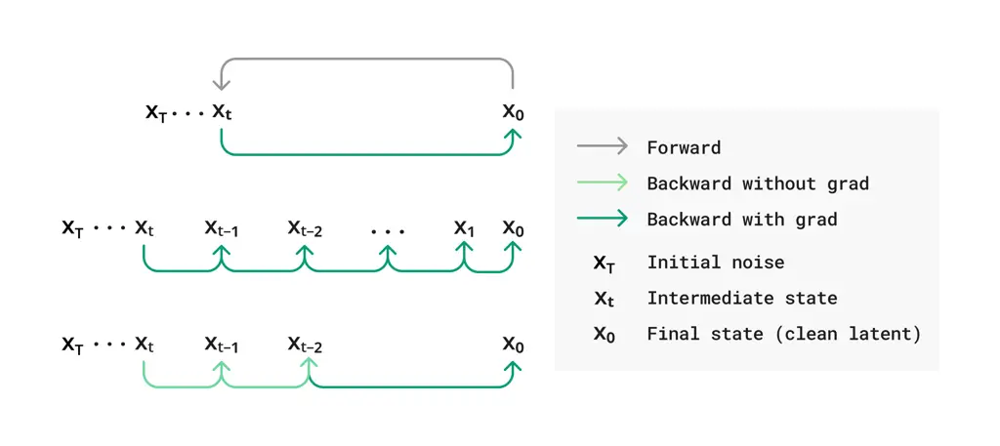

Figure 9: Rollout strategies for adversarial training. Top: standard
LADD, where the intermediate state $`x_{t}`$ is obtained by forward
noising of the clean sample $`x_{0}`$ and denoised in a single step with
gradients. Middle: backward student rollout with gradients propagated
through all denoising steps. Bottom: backward student rollout with
gradients propagated only through the final steps.

1.  1.  Trajectory compression via $`\pi`$-Flow.

    We distill the teacher into a few-step student that requires only
    $`10`$ function evaluations (NFEs). Among the methods we tried,
    $`\pi`$-Flow gave the best convergence, motion and audio fidelity,
    and trajectory alignment, without mode collapse. Because it
    formulates trajectory distillation as on-policy imitation learning,
    it directly absorbs the teacher’s CFG-guided trajectory, which
    removes the need for a separate CFG distillation stage.

2.  2.  Adversarial refinement via Sim-LADD.

    The trajectory-compressed student shows textural and perceptual
    degradation caused by the coarse discretization of the sampling
    trajectory. We refine this checkpoint with Sim-LADD: unlike standard
    LADD, which builds training states via forward diffusion, Sim-LADD
    uses actual backward rollouts of the student, which reduces the
    train–inference mismatch (Figure 9).

    We backpropagate the adversarial gradient through the final $`k`$
    sampling steps, following DRaFT-$`k`$. As in the original LADD, we
    apply stochastic re-noising to both real and generated latents
    before discriminator feature extraction. This stabilizes adversarial
    training, reduces discriminator overfitting, and removes the need
    for an explicit $`R_{1}`$ gradient penalty such as the one used in
    APT \[61\].

The two stages play complementary roles: $`\pi`$-Flow performs stable
trajectory compression while preserving the teacher’s semantics, motion,
and diversity, and Sim-LADD then uses real data and adversarial learning
to recover the high-frequency detail and perceptual sharpness lost
during compression.

#### 4.5.3  Training Details

##### Stage 1: $`\pi`$-Flow distillation.

The student policy network is initialized directly from the pretrained
teacher backbone and optimized with an on-policy imitation $`\ell_{2}`$
regression objective against the guided teacher velocity field.

Following the policy schedule described in $`\pi`$-Flow \[57\], training
proceeds through three regimes: an off-policy phase for stable initial
convergence to the teacher distribution, followed by a mixed policy
phase that prepares the student for on-policy training and lastly the
on-policy phase that corrects the train–inference mismatch. We train for
$`4`$k iterations, with the three regimes in a $`1\!:\!1\!:\!2`$ ratio.

- •
  Integration grid: $`n_{\text{grid}}=10`$;
- •
  Policy steps: $`128`$;
- •
  Optimizer: AdamW, learning rate $`3\times 10^{-6}`$, batch size
  $`64`$;
- •
  Student trajectory discretized into $`N=10`$ uniform integration
  intervals (10 NFE).

The resulting checkpoint initializes the adversarial refinement stage.

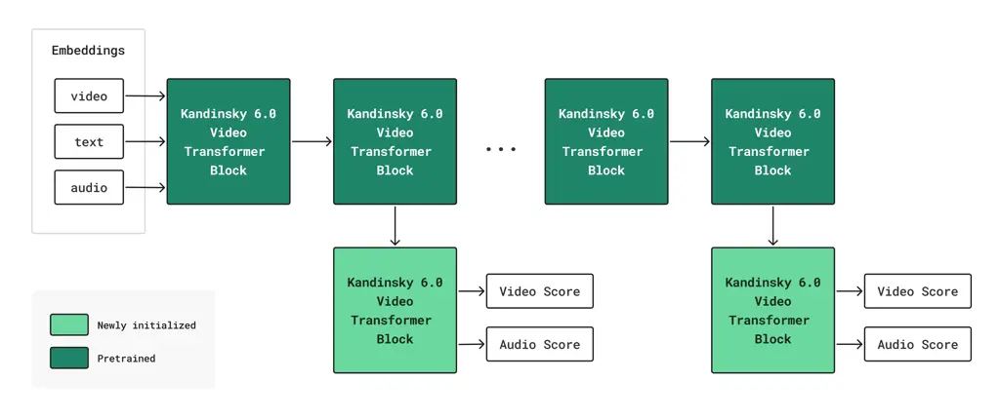

Figure 10: Discriminator architecture used in Sim-LADD. Newly
initialized Kandinsky 6.0 Video transformer blocks are attached as heads
to intermediate blocks of the pretrained backbone; each head outputs
separate video and audio scores.

##### Stage 2: Sim-LADD adversarial post-training.

Adversarial refinement uses a hinge loss computed on multi-scale latent
features extracted from intermediate layers of the frozen teacher
backbone. Following APT \[61\], all discriminator parameters are updated
during training. The discriminator heads are implemented as Fused
Transformer Decoder blocks (Figure 10). Image-conditioning tokens are
removed from the feature sequence before the discriminator logits are
computed. During the backward student rollout, gradients are propagated
through the final $`k=5`$ solver steps, and gradient checkpointing keeps
peak GPU memory consumption manageable.

Both real and generated latents are perturbed with a stochastic
re-noising schedule: before discriminator feature extraction, noise
levels are sampled from a fixed $`\operatorname{LogitNormal}(-3.5,1.0)`$
distribution.

- •
  Optimizer: AdamW for both the generator and the discriminator;
- •
  Learning rates: $`8\times 10^{-7}`$ (generator) and
  $`1.5\times 10^{-6}`$ (discriminator); batch size 8;
- •
  Gradient clipping: maximum norm $`1.0`$;
- •
  Training length: $`300`$ steps.

### 4.6  Super-Resolution

A single SR-DiT model is trained jointly for $`\times 2`$ and
$`\times 4`$ video super-resolution, using training pairs from both
scales with equal sampling probability. The SR-DiT and the Latent
Upscalers (LU), trained separately for each scale, are optimized
independently.

During SR-DiT training, the degraded LQ and HQ latents have matching
spatial dimensions. For Real-ESRGAN-style degradations, this is achieved
by bilinearly upsampling the low-resolution clip in pixel space before
K-VAE encoding. The temporal degradation pipeline directly produces a
degraded clip at the HQ resolution.

Each LU is trained to map low-resolution degraded latents to their
high-resolution degraded counterparts and is used to prepare the input
to SR-DiT at inference.

#### 4.6.1  Training Data and Degradations

The source videos come from the SR dataset described in Section 2.9.
During dataset preparation, we extract video crops of the required
spatial size, filter them, and construct degraded copies. An accepted
crop serves as the HQ target, and its degraded counterpart provides the
LQ input. Both versions are encoded with K-VAE and stored as paired
video latents.

##### Crop selection and online filtering.

For the 4K video collection and the Kandinsky 5.0 T2V collection, we
extract spatial crops of size $`512\times 768`$, $`512\times 512`$, or
$`768\times 512`$ pixels (height $`\times`$ width), retaining a sequence
of frames in each crop. Crop locations are selected using center
cropping, random cropping, optical-flow-based selection, or selection of
regions with high spatial detail.

During data preparation, dark borders are excluded from the region
available for cropping. Candidate video crops are checked for excessive
dark content, visible banding, and compression artifacts using spatial
and temporal quality measures. The crop-selection methods are tried in a
randomly sampled order, weighted by their configured probabilities. The
first candidate that passes all checks is retained; videos for which no
candidate passes are skipped. These crop-level checks complement the
dataset-level quality filtering described in Section 2.9. We use two
degradation pipelines to construct LQ counterparts from the accepted HQ
crops.

##### Real-ESRGAN-style degradation.

We use a video adaptation of the two-stage high-order degradation scheme
of Real-ESRGAN \[62\]. The first stage applies blur, resizing, Gaussian
or Poisson noise, JPEG compression, and video compression. The second
stage repeats blur, resizing, noise, and JPEG compression, with weaker
blur and noise settings. A final block applies video compression and
resizing to the target low-resolution size followed by optional sinc
filtering; the order of these two components is randomized.

Blur and resize parameters and noise strength are shared across frames,
while noise is sampled independently per frame and JPEG quality varies
gradually along the video. This pipeline degrades image quality without
explicitly warping geometry or changing the frame sequence.

The target low-resolution dimensions correspond to a downscaling factor
of 2 or 4 along each spatial axis, depending on the encoding
configuration. For SR-DiT training, it is bilinearly upsampled back to
the HQ dimensions before K-VAE encoding. The low-resolution version is
also encoded and stored for LU training.

##### CreativeVR-style temporal degradation.

Inspired by CreativeVR \[63\], this pipeline simulates structural and
temporal artifacts in generated video. We use the strong preset of our
implementation. A spatial grid warp is applied first, with a
displacement field interpolated between two randomly sampled grids over
time. Next, three or four operators are selected and applied in random
order: directional motion blur, adjacent-frame blending, stochastic
frame dropping with interpolation, and spatio-temporal downsampling
followed by reconstruction to the original frame count and spatial size.
Motion-blur parameters and blending coefficients follow smooth temporal
trajectories.

The degraded video retains the HQ dimensions but contains distortions of
geometry, motion, and fine detail. This full-resolution degraded version
is encoded directly for SR-DiT training. A separate low-resolution
version is obtained by bilinear downsampling by a factor of 2 or 4 and
encoded for LU training.

#### 4.6.2  SR-DiT Training Objective

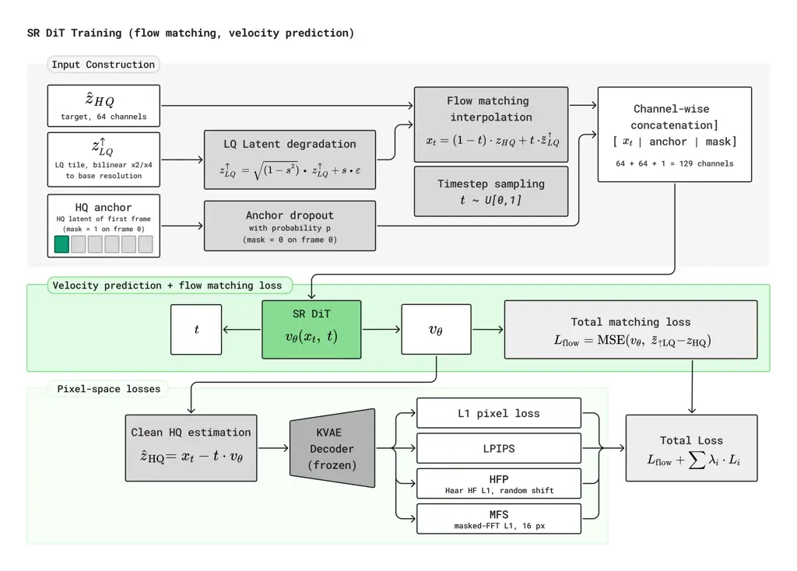

Figure 11: SR-DiT training pipeline for restoring HQ video from degraded
LQ latents with first-frame HQ anchor conditioning. Training combines a
latent-space flow-matching loss with pixel-space reconstruction and
anti-grid losses computed through the frozen K-VAE decoder. The diagram
illustrates Stages 1-2; timestep sampling uses $`u\sim U[0,1]`$ followed
by $`t=5u/(1+4u)`$.

The SR-DiT is trained with flow matching to restore HQ latents from
degraded LQ latents (Figure 11). We first add Gaussian noise to the
degraded LQ latent:

```math
\tilde{z}_{LQ}=\sqrt{1-s^{2}}\,z_{LQ}+s\,\varepsilon,\qquad\varepsilon\sim\mathcal{N}(0,I),\qquad s=0.7.
```

The training state is constructed as

```math
x_{t}=(1-t)\,z_{HQ}+t\,\tilde{z}_{LQ}.
```

In the first two training stages, we sample $`u\sim U[0,1]`$ and apply
the timestep transformation $`t=5u/(1+4u)`$.

Conditioned on an HQ anchor $`a`$ and its binary mask $`m`$, the model
predicts the velocity. The flow-matching loss is

```math
L_{\mathrm{flow}}=\mathrm{MSE}\left(v_{\theta}(x_{t},t,a,m),\,\tilde{z}_{LQ}-z_{HQ}\right).
```

All SR-DiT parameters are optimized.

##### Pixel-space losses.

We estimate the clean HQ latent as

```math
\hat{z}_{HQ}=x_{t}-t\,v_{\theta}(x_{t},t,a,m)
```

and decode it with the frozen K-VAE decoder. Gradients propagate through
the decoder to SR-DiT. The reconstruction is compared with the decoded
HQ target.

To limit memory and computation, we select matching random spatial crops
corresponding to $`256\times 256`$ pixels and decode at most four
consecutive latent frames from each of at most two samples per GPU. In
the first two training stages, pixel-space losses are applied only for
$`t\leq 0.7`$. We use:

- •
  Pixel L1 loss, with weight 0.6.
- •
  LPIPS perceptual loss with a VGG backbone \[64\], with weight 0.35.
- •
  A High-Frequency Perception (HFP) loss adapted from \[65\]: L1 between
  the high-frequency Haar subbands (LH, HL, HH) of the reconstruction
  and target, with a shared random spatial shift of 0 or 1 pixel along
  each axis. Its weight is 1.0.
- •
  A masked Fourier space (MFS) loss adapted from \[66\]: L1 between FFT
  amplitudes at the harmonic bins of a 16-pixel grid, matching the
  spatial compression factor of K-VAE. Its weight is 1.0.

HFP supervises high-frequency detail, while MFS specifically targets
periodic grid artifacts. Together, they help suppress grid and
checkerboard patterns. The total objective is

```math
L=L_{\mathrm{flow}}+\sum_{i}\lambda_{i}L_{i}.
```

The settings above apply to the first two training stages; the
distillation objective and its loss weights are described below.

##### HQ anchor.

The anchor contains the first temporal slice of the ground-truth HQ
latent, with zeros at the remaining temporal positions. A binary mask
identifies the position containing the anchor. The anchor and mask are
concatenated with $`x_{t}`$ along the channel dimension (Section 3.3.1).

In the first two training stages, the anchor and its mask are jointly
zeroed with probability 0.15, allowing the model to learn restoration
without anchor conditioning. The current inference pipeline uses zero
anchor and mask inputs. The conditioning interface also allows a future
inference variant to supply an HQ first-frame reference, for example
using an image super-resolution model.

#### 4.6.3  SR-DiT Training Stages

The SR-DiT is trained in three stages on 8 NVIDIA H100 GPUs. All stages
use AdamW with $`\beta=(0.9,0.95)`$, weight decay $`10^{-3}`$, gradient
clipping at 1.0, and an LQ noise fraction of $`s=0.7`$. The $`\times 4`$
and $`\times 2`$ pair sets are sampled with equal probability, with
source sequences of 20–31 latent frames. Each GPU processes a packed
batch of 124 latent frames, equivalent to four 31-frame clips. Stage 3
additionally accumulates gradients over two microbatches.

##### Stage 1: training with dense attention.

The SR-DiT is initialized from the text-free Kandinsky 5.0 Video Lite
(SFT) checkpoint and trained with dense attention. We use a learning
rate of $`10^{-5}`$ with 500 warmup steps, EMA decay 0.999, and timestep
scheduler scale 5.0. The checkpoint at step 7,250 is used to initialize
Stage 2. This stage takes approximately 4.5 days.

##### Stage 2: NABLA fine-tuning.

To reduce attention cost, dense attention is replaced with sparse NABLA
attention \[12\]. We use top-CDF block selection with $`P=0.8`$,
linearly annealed from 0.95 over the first 200 steps. This is combined
with a local neighborhood following sliding-tile attention (STA) \[67\],
with a window of $`11\times 7\times 7`$ attention blocks along time,
height, and width. Each spatial block contains $`8\times 8`$ latent
tokens.

Training starts from the Stage 1 checkpoint at step 7,250 and runs for
6,000 steps with a learning rate of $`10^{-5}`$, 200 warmup steps, and
the same loss settings as Stage 1. This stage takes approximately 3
days.

##### Stage 3: $`\pi`$-Flow distillation.

The model is distilled for inference with two SR-DiT calls using the DX
policy of $`\pi`$-Flow \[57\]. The frozen teacher and the student
backbone are initialized from the Stage 2 checkpoint at step 6,000. The
student’s output head is expanded to predict 10 velocity outputs and
initialized by replicating the teacher’s output head.

The denoising trajectory is divided into two segments. For each training
sample, a segment is selected, and its starting state is constructed
using the HQ and noised LQ latents, with HQ anchor conditioning as in
the preceding stages. The student makes one network call at the segment
start. Its 10 velocity outputs are converted into a grid of clean-latent
predictions, which the DX policy interpolates to evaluate velocities
within the segment without additional network calls.

The teacher is evaluated at eight states along a teacher-driven rollout
within the selected segment. The DX loss is the MSE between the teacher
velocity and the student policy’s velocity averaged over a local
integration window. The policy integration uses a resolution of 128
substeps over the full trajectory, with a minimum averaging window of
three substeps.

Pixel-space losses are computed from the policy’s clean-latent estimate
at the segment start, $`\hat{z}_{0}=x_{t}-\sigma_{t}u`$, where
$`\sigma_{t}`$ is the shifted flow-matching timestep at the segment
start and $`u`$ is the policy velocity. These losses directly supervise
the clean-latent node at the segment start; the remaining nodes are
supervised through the DX loss. They are applied at all noise levels
with reduced weights: L1 0.05, LPIPS 0.026, HFP 0.16, and MFS 0.033.
Decoding is limited to a spatial crop corresponding to $`256\times 256`$
pixels and at most four consecutive latent frames from one sample per
GPU. Anchor dropout is set to 0.15 in Stages 1-2 and disabled in Stage 3.

We use a time shift of 3.5, a final segment size scale of 0.5, a
learning rate of $`10^{-6}`$ with 100 warmup steps, gradient
accumulation over two microbatches, and EMA decay 0.9999. The checkpoint
used for inference is obtained after 750 distillation updates,
corresponding to approximately 1.5 days.

At inference, the distilled model operates with two network function
evaluations (NFE$`{}=2`$). Within each segment, the DX policy is
integrated without additional network evaluations.

#### 4.6.4  Latent Upscaler Training

The LU is trained in a _degraded-to-degraded_ setting: the input is the
K-VAE encoding of a low-resolution degraded video, and the target is the
encoding of its full-resolution degraded counterpart. The spatial grids
differ by a factor of 4 or 2 along each axis. The LU is thus trained to
upsample the latent representation, while restoration of clean HQ
content is handled by SR-DiT.

The weak/synthetic training mixtures contain four groups: the Kandinsky
5.0 T2V collection with weak degradation, the 4K collection with weak
Real-ESRGAN-style degradation, synthetic camera-motion clips constructed
from images, and the 4K collection with synthetic temporal degradation.
These mixtures contain approximately 218k pairs for $`\times 4`$ and
194k pairs for $`\times 2`$.

Both models are trained on 4 GPUs using packed batches with a budget of
124 latent frames per GPU, equivalent to four 31-frame clips. We use
AdamW with $`\beta=(0.9,0.95)`$, weight decay $`10^{-4}`$, gradient
clipping at 1.0, and EMA decay 0.99.

##### Losses.

The reconstruction objective combines a latent-space Charbonnier loss
($`\epsilon=10^{-3}`$, weight 1.0) with a pixel-space L1 loss (weight
1.0). Pixel losses are computed by decoding matching crops of the
predicted and target latents with the frozen K-VAE decoder; gradients
propagate through the decoder to the LU.

Pixel-space losses are evaluated every second training step for one
sample per GPU, using a spatial latent crop of $`16\times 24`$ cells and
the first nine latent frames. LPIPS is disabled as a training loss.

Temporal supervision matches frame-to-frame differences between the
prediction and target. In the initial $`\times 4`$ run, the latent
temporal L1 loss has weight 0.1. After 50k steps, its weight is
increased to 0.5, and a decoded pixel temporal L1 loss with weight 1.0
is added. The $`\times 2`$ model uses these latter temporal loss
settings from the start.

##### $`\times 4`$ model.

All parameters except the output heads are initialized from the
corresponding K-VAE decoder modules, including the input projection.
Only the output heads are optimized for the first 100 steps; the
transferred layers are then included in training.

Training consists of three consecutive runs: 50k steps with a base
learning rate of $`2.2\times 10^{-4}`$, 40k steps with
$`1.1\times 10^{-4}`$, and a final 10k-step polishing run with
$`1.1\times 10^{-5}`$. The temporal-loss changes described above are
introduced in the second run.

We use $`\mu`$P-inspired learning-rate scaling: hidden and output
convolution weights receive the base learning rate multiplied by
$`512/C_{\mathrm{in}}`$, where $`C_{\mathrm{in}}`$ is the number of
input channels. Input projections, normalization and modulation
parameters, and biases retain the base rate. Training takes
approximately 60 hours on 4 GPUs.

##### $`\times 2`$ model.

The $`\times 2`$ branch is initialized by copying modules from the
trained $`\times 4`$ model (Section 3.3.2). The $`\times 4`$ path is
frozen, and all parameters of the $`\times 2`$ branch are optimized from
the first step.

The model is trained for 40k steps with a base learning rate of
$`2.2\times 10^{-4}`$, followed by a 10k-step polishing run with
$`2.2\times 10^{-5}`$. The first 20k steps use the stronger-degradation
pair set; the subsequent runs use the weak/synthetic mixture described
above. Training takes approximately two days on 4 GPUs.

#### 4.6.5  Validation

##### SR-DiT metrics.

Generated videos have no paired HQ ground truth. We therefore monitor
restoration quality using no-reference quality metrics and additional
spatial and temporal diagnostics:

- •
  MUSIQ \[68\] is an image quality metric. We use the KonIQ-10k
  checkpoint, score decoded frames independently, and average the scores
  over frames and clips; higher is better. As a frame-level metric, it
  does not directly assess temporal consistency.
- •
  DOVER \[33\] is a video quality metric combining technical and
  aesthetic branches. The technical branch processes sampled fragments,
  while the aesthetic branch processes spatially downscaled video. We
  report the fused, normalized score in $`[0,1]`$; higher is better.
- •
  Warp error measures motion-compensated differences between adjacent
  frames. We estimate forward and backward optical flow with RAFT
  \[69\], warp one frame onto the other, and compute the mean absolute
  residual over valid, non-occluded pixels; lower is better. The metric
  is sensitive to temporal inconsistencies, but also to image detail and
  optical-flow accuracy. Smooth outputs can receive low errors, so the
  score must be interpreted together with spatial quality.
- •
  Laplacian artifact score measures excess high-frequency response in
  the SR output relative to the upsampled LQ input. Sobel edges in the
  LQ frame are used to exclude natural edges, restricting scoring to
  smooth regions; lower is better. The score helps identify grid and
  checkerboard artifacts, but can also respond to newly reconstructed
  detail.

We additionally report CLIP-IQA \[70\], with higher scores indicating
better predicted image quality. MUSIQ and DOVER were developed for
natural-image and user-generated-video quality assessment, respectively,
and their scores may not fully reflect SR-specific artifacts. We
therefore use these metrics as complementary indicators, rather than
treating any single score as a complete quality measure. Final SR
quality assessment and checkpoint selection are based on side-by-side
human evaluation at both the tile and full-frame levels.

##### SR-DiT validation sets.

The source videos are generated by Kandinsky 5.0 Video Lite (T2V, SFT, 5
s). We use two separate sets of 912 video crops each. For $`\times 4`$,
crops cover $`128\times 192`$ pixels of the source video; for
$`\times 2`$, they cover $`256\times 384`$ pixels. Both are enlarged to
the $`512\times 768`$ working resolution before K-VAE encoding.
Evaluation is performed on individual crops, without full-frame tiling
and blending.

Results are reported in Table 4. The two scales use different source
crops and therefore should be compared separately. For the same output
dimensions, the $`\times 4`$ input contains four times fewer pixels than
the $`\times 2`$ input and covers a smaller region of the source video.
Consequently, the difference in absolute metric scores between scales
does not isolate model quality.

| Scale        | Stage   | MUSIQ $`\uparrow`$ | DOVER $`\uparrow`$ | CLIP-IQA $`\uparrow`$ | Lapl. artifacts $`\downarrow`$ | Warp error $`\downarrow`$ |
| ------------ | ------- | ------------------ | ------------------ | --------------------- | ------------------------------ | ------------------------- |
| $`\times 4`$ | Stage 1 | 48.92              | 0.5467             | 0.4426                | 0.4366                         | 0.6141                    |
|              | Stage 2 | 50.38              | 0.5589             | 0.4569                | 0.5337                         | 0.6478                    |
|              | Stage 3 | 50.41              | 0.5553             | 0.4587                | 0.4227                         | 0.6781                    |
| $`\times 2`$ | Stage 1 | 66.05              | 0.7329             | 0.5950                | 0.6062                         | 0.6551                    |
|              | Stage 2 | 65.29              | 0.7282             | 0.5932                | 0.6072                         | 0.6531                    |
|              | Stage 3 | 65.81              | 0.7348             | 0.5906                | 0.5710                         | 0.6831                    |

Table 4: Validation metrics of the SR-DiT after each training stage on
the tiled validation sets (912 videos each). Stage 1: dense attention;
Stage 2: NABLA fine-tuning; Stage 3: $`\pi`$-Flow distillation. Values
are comparable only within one scale factor.

Within each scale, we observe the following:

- •
  At $`\times 4`$, Stages 2 and 3 improve MUSIQ from 48.92 to 50.38 and
  50.41, respectively, and also increase CLIP-IQA relative to Stage 1.
  At $`\times 2`$, MUSIQ remains between 65.29 and 66.05, with no
  consistent improvement across stages.
- •
  At $`\times 4`$, warp error increases from 0.614 to 0.648 and 0.678.
  This indicates a higher motion-compensated residual. Since the metric
  also depends on spatial detail, the temporal-quality implications
  require visual assessment.
- •
  At $`\times 4`$, the Laplacian artifact score rises from 0.437 after
  Stage 1 to 0.534 after Stage 2, then decreases to 0.423 after Stage 3.
  This indicates reduced excess high-frequency response after
  distillation, although the metric alone cannot distinguish artifacts
  from reconstructed detail.

##### Latent Upscaler validation.

During training, we monitor latent reconstruction error and
reference-based quality metrics on a validation subset balanced across
the four data groups. Checkpoints are selected by PSNR between decoded
predictions and decoded full-resolution degraded targets. We monitor
latent L1 error every 2,500 steps, and PSNR, SSIM, and LPIPS \[64\] with
an AlexNet backbone every 10k steps. During the final $`\times 2`$
polishing run, decoded reference metrics are evaluated every 5k steps.

For offline evaluation, we use 94 held-out clips whose content was
excluded from training across the data sources. The set contains four
groups: 25 clips from the Kandinsky 5.0 T2V collection with weak
degradation (source resolutions $`1920\times 1080`$ and
$`1080\times 1080`$); 19 clips from the 4K video collection with weak
Real-ESRGAN-style degradation (mostly 4K); 25 synthetic camera-motion
clips constructed from images; and 25 clips from the 4K video collection
with synthetic temporal degradation (source resolutions up to
$`7680\times 4320`$). The $`\times 2`$ and $`\times 4`$ sets contain the
same clips in the same order, enabling paired comparisons between
scales. The task is degraded-to-degraded. Evaluation uses decoded video
crops of $`512\times 512`$, $`512\times 768`$, or $`768\times 512`$
pixels with 89–121 frames, rather than full-resolution source videos.

|                                 |       |              |          |                    |              |          |                    |
| ------------------------------- | ----- | ------------ | -------- | ------------------ | ------------ | -------- | ------------------ |
|                                 |       | $`\times 2`$ |          |                    | $`\times 4`$ |          |                    |
| Group                           | $`n`$ | LU           | Bilinear | $`\Delta`$         | LU           | Bilinear | $`\Delta`$         |
| Kandinsky 5.0 T2V, weak         | 25    | 41.60        | 42.97    | $`-1.37`$          | 39.19        | 39.16    | $`+0.03`$          |
| 4K collection, weak Real-ESRGAN | 19    | 41.42        | 42.37    | $`-0.95`$          | 39.91        | 39.13    | $`+0.78`$          |
| Camera-motion clips (images)    | 25    | 38.62        | 38.26    | $`+0.36`$          | 37.85        | 36.83    | $`+1.02`$          |
| 4K collection, synthetic        | 25    | 45.08        | 42.92    | $`+2.16`$          | 40.25        | 36.98    | $`+3.26`$          |
| All                             | 94    | 41.70        | 41.58    | $`\mathbf{+0.11}`$ | 39.26        | 37.96    | $`\mathbf{+1.30}`$ |

Table 5: PSNR (dB) of the Latent Upscaler on the held-out validation
set, computed per frame on pixels decoded by K-VAE and averaged per
clip. The baseline decodes the low-resolution latent and upsamples it
bilinearly in pixel space; $`\Delta`$ is the difference between the LU
and the baseline.

As Table 5 shows, the $`\times 4`$ LU achieves higher mean PSNR than
pixel-space bilinear upsampling in all four groups. At $`\times 2`$, it
improves PSNR on the image-derived camera-motion clips and the 4K
collection synthetic-degradation group, while pixel-space bilinear
upsampling scores higher on the two weak-degradation video groups. The
pixel-space baseline decodes the low-resolution latent and then
bilinearly upsamples the decoded video. By contrast, bilinear
interpolation directly in latent space, followed by decoding, yields
only 21.44 dB at $`\times 2`$ and 19.76 dB at $`\times 4`$, showing that
this simple latent-space baseline reconstructs the target poorly.

We also measure warp error using RAFT-small \[69\] over all adjacent
frame pairs, without spatial downsampling. On the 94-clip set, the LU
obtains mean errors of 0.684 at $`\times 2`$ and 0.626 at $`\times 4`$,
compared with 0.638 and 0.587 for pixel-space bilinear upsampling. These
differences require cautious interpretation: warp error depends on
spatial detail and optical-flow accuracy, and smoothing can reduce the
residual. Moreover, the degraded-to-degraded target may itself contain
temporal artifacts introduced by the degradation pipeline, so this set
does not provide a clean reference for temporal restoration quality.

We therefore additionally evaluate 24 real clips without synthetic
degradation, covering foliage, fur, structure, and textile, with camera
or object motion. Both LU routes are evaluated on a common output
canvas; the $`\times 2`$ route includes pixel-space pre-upsampling. The
comparison baseline encodes and decodes the source video with the same
K-VAE checkpoint, then bilinearly upsamples the reconstruction to the
evaluation canvas.

The round-trip baseline has a mean warp error of approximately 0.591.
Relative to this baseline, the LU routes increase the mean error by
0.026 at $`\times 2`$ and 0.049 at $`\times 4`$, approximately 4.4% and
8.3%, respectively. For the structure category, the $`\times 4`$
difference is approximately 0.002. These results show a modest average
increase in motion-compensated residual relative to the round-trip
baseline, but do not uniquely attribute temporal error to either the VAE
or the LU. Textile has the highest absolute warp error for both routes.

## 5  Inference

Figure 12 summarizes the output resolutions supported at inference
(given as width $`\times`$ height). In SD mode, the output of the base
model (864$`\times`$480, 480$`\times`$864, or 512$`\times`$512) is
returned as is. In Full HD mode, the base-model output is upscaled by a
factor of 2.25 with the super-resolution model (Section 3.3) and then
downscaled to 1920$`\times`$1080, 1080$`\times`$1920, or
1080$`\times`$1080. An HD mode (1280$`\times`$720) is obtained in the
same way by downsampling the super-resolution output (Table 6).

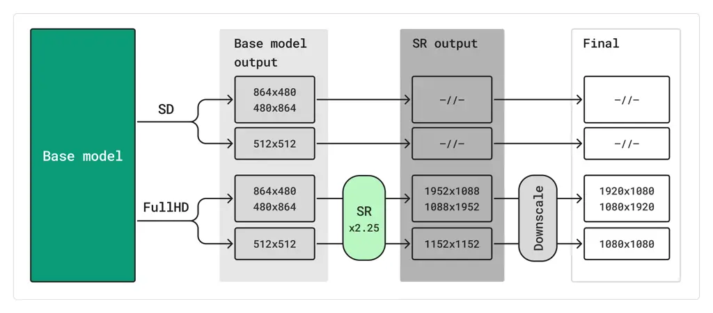

Figure 12: Output resolutions of Kandinsky 6.0 Video at inference. In SD
mode, the base-model output is returned without changes; in Full HD
mode, it is upscaled $`\times`$2.25 by the super-resolution model and
then downscaled to the target Full HD resolution.

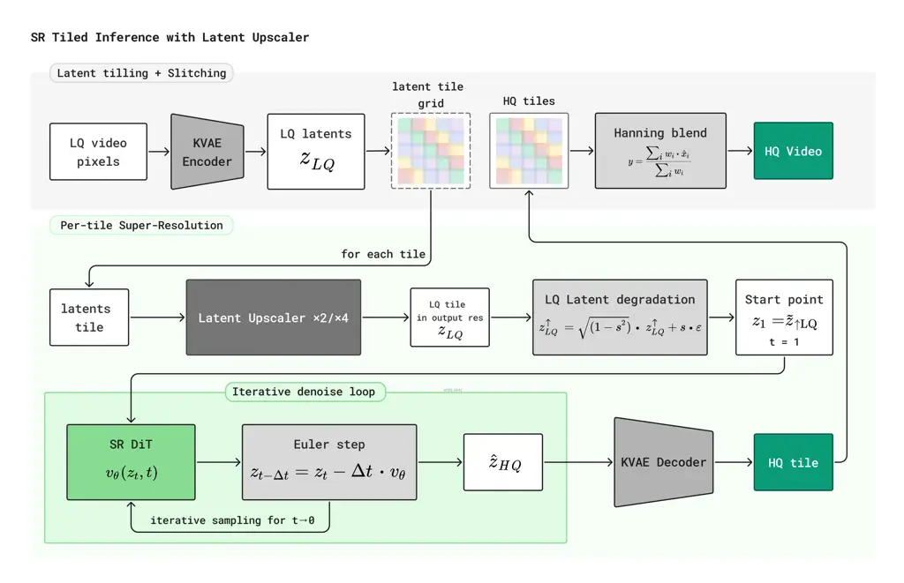

Figure 13: Tiled SR inference with the Latent Upscaler. The LQ video is
encoded once with K-VAE and split into overlapping latent tiles. Each
tile is upscaled by the $`\times 2`$ or $`\times 4`$ LU, refined by
SR-DiT, decoded, and merged using Hann-window blending. The denoising
loop shown corresponds to the pre-distillation model; the final
distilled model replaces this loop with $`\pi`$-Flow DX policy sampling
using two network evaluations (NFE$`{}=2`$).

The SR inference pipeline is shown in Figure 13. The figure illustrates
the common encoding, tiling, upscaling, and decoding stages, with the
Euler denoising loop used by the pre-distillation model. The final
distilled model replaces this loop with $`\pi`$-Flow DX policy sampling.
The pipeline consists of the following steps:

1.  1.  Pre-upscaling (only for $`\times 2.25`$). The generated video is
        bilinearly upscaled by $`\times 1.125`$ in pixel space, with the
        dimensions aligned to the spatial compression factor of K-VAE (16
        px). For example, an $`864\times 480`$ video becomes
        $`976\times 544`$. The $`\times 2`$ route is then applied.
2.  2.  Encoding. The whole clip is encoded with K-VAE once. A 121-frame
        video is mapped to 31 latent frames.
3.  3.  Latent tiling. The latent representation is split into overlapping
        spatial tiles, using a minimum overlap of 25%. Each tile covers the
        full temporal extent of the clip. For a $`512\times 768`$ working
        resolution, input tiles contain $`16\times 24`$ latent cells for the
        $`\times 2`$ route and $`8\times 12`$ cells for the $`\times 4`$
        route, corresponding to source regions of $`256\times 384`$ and
        $`128\times 192`$ pixels, respectively. For square content, the
        corresponding input tiles contain $`16\times 16`$ or $`8\times 8`$
        latent cells.
4.  4.  Latent upscaling. The scale-specific Latent Upscaler brings each
        tile to the SR-DiT working resolution: $`32\times 48`$ latent cells
        for landscape content or $`32\times 32`$ cells for square content.
        Portrait content uses the transposed spatial dimensions.
5.  5.  Denoising. The upscaled LQ latent is partially noised using the same
        noise fraction as in training ($`s=0.7`$), giving the starting state
        at $`t=1`$:

    ```math
    z_{1}=\sqrt{1-s^{2}}\,z^{\uparrow}_{LQ}+s\,\varepsilon,\qquad\varepsilon\sim\mathcal{N}(0,I).
    ```

    The Stage 2 model uses an Euler sampler, typically with 4–8 network
    evaluations (NFE), predicting the velocity at each step and updating
    the latent until $`t=0`$.

    The final Stage 3 model instead uses $`\pi`$-Flow DX policy sampling
    \[57\] with two network evaluations (NFE$`{}=2`$). At the start of
    each of two trajectory segments, SR-DiT predicts 10 velocity
    outputs, which are converted into clean-latent nodes defining a DX
    policy. The policy is integrated within the segment using
    network-free Euler substeps: velocities are computed from the
    interpolated nodes without additional SR-DiT evaluations. Thus,
    NFE$`{}=2`$ denotes two network evaluations per tile, rather than
    two Euler integration steps.

    Both models are text-free, with classifier-free guidance disabled.
    The HQ anchor and its mask are set to zero at inference.

6.  6.  Decoding and blending. Each restored latent tile is decoded with
        K-VAE. The overlapping decoded tiles are combined using normalized
        Hann-window weights to reduce boundary seams.
7.  7.  Final resizing. The assembled SR output is resized without cropping
        to the target resolution (Figure 12). Depending on the route, the
        downscaling factor ranges from approximately $`\times 1.01`$
        ($`1952\times 1088\to 1920\times 1080`$) to $`\times 1.42`$
        ($`1024\times 1024\to 720\times 720`$).

Kandinsky 6.0 Video uses the $`\times 2.25`$ routes to produce Full HD
output (Figure 12). The SR pipeline also supports HD and 2K output via
the $`\times 2`$ and $`\times 4`$ routes.

Table 6 lists the supported routes and the processing time of one
5-second clip (121 frames at 24 fps) on a single NVIDIA H100 GPU with
NABLA attention and K-VAE decoding accelerated by the Magi compiler. All
measurements use the distilled SR-DiT with $`\pi`$-Flow DX sampling
(NFE$`{}=2`$) and the scale-specific Latent Upscaler. The whole clip is
encoded with K-VAE once. Timings include K-VAE encoding and exclude the
final resize. Tiles are processed sequentially with a tile batch size of
one.

| Target  | Source            | Scale           | SR output           | Final               | Tiles | Time, s |
| ------- | ----------------- | --------------- | ------------------- | ------------------- | ----- | ------- |
| HD      | $`768\times 432`$ | $`\times 2`$    | $`1536\times 864`$  | $`1280\times 720`$  | 6     | 26.2    |
| HD      | $`512\times 512`$ | $`\times 2`$    | $`1024\times 1024`$ | $`720\times 720`$   | 9     | 24.7    |
| Full HD | $`864\times 480`$ | $`\times 2.25`$ | $`1952\times 1088`$ | $`1920\times 1080`$ | 9     | 39.6    |
| Full HD | $`512\times 512`$ | $`\times 2.25`$ | $`1152\times 1152`$ | $`1080\times 1080`$ | 9     | 24.7    |
| 2K      | $`864\times 480`$ | $`\times 4`$    | $`3456\times 1920`$ | $`2560\times 1440`$ | 30    | 130.8   |
| 2K      | $`768\times 432`$ | $`\times 4`$    | $`3072\times 1728`$ | $`2560\times 1440`$ | 25    | 108.8   |
| 2K      | $`512\times 512`$ | $`\times 4`$    | $`2048\times 2048`$ | $`1440\times 1440`$ | 25    | 68.7    |

Table 6: Super-resolution routes and processing time per 5-second clip
on a single H100 GPU, using the Latent Upscaler, the distilled SR-DiT
(NFE$`{}=2`$), and the Magi compiler \[71\] for K-VAE decoding. Times
include K-VAE encoding and exclude the final resize. Spatial dimensions
are given as width $`\times`$ height.

Inference cost depends on the working tile resolution and the number of
tiles. The distilled model uses two SR-DiT evaluations per tile; DX
policy integration within each segment does not require additional
network evaluations. The assembled output is resized on the CPU to the
target resolution without cropping.

## 6  Optimizations and Consumer GPU Deployment

Throughout this section, Lite and Pro denote Kandinsky 6.0 Video Lite
and Kandinsky 6.0 Video Pro, and SD, HD, and Full HD denote the three
operating modes defined in Section 5; a configuration such as Pro SD
refers to the Kandinsky 6.0 Video Pro model in SD mode. All base-model
measurements in this section are obtained with the full, non-distilled
model.

Peak allocated memory during a Pro SD run reaches 72.8 GiB, which does
not fit on any consumer GPU. Both Lite and Pro run on 32, 24, and 16 GB
cards through weight offloading: only two transformer blocks reside on
the GPU at a time, the rest are streamed from CPU memory during the
forward pass. The offloading mechanism itself is identical for both
model sizes; only the number of blocks and the resulting resident
footprint differ. The mathematical model is unchanged. Peak memory drops
by about $`3.4\times`$ for Pro at SD and about $`1.8\times`$ for Pro at
HD and Full HD; for Lite the reduction is approximately $`2\times`$ at
SD and $`1.1\times`$ at HD and Full HD. Total generation time on the
reference H100 changes by a few percent.

### 6.1  Block Offloading

The transfer of the next block is overlapped with the computation of the
current one on a separate CUDA stream. Embeddings, RoPE, and output
projections remain resident on the GPU for the duration of the DiT
stage. When MagCache skips a step, the weights of the skipped blocks are
not transferred at all.

Peak PyTorch allocated memory is summarized in Table 7. These values are
measured with the default SR decoding configuration; the presets
described below report lower peaks because they use a shorter SR decode
segment and, at 16 GB, additional spatial splitting of the SR decoder.

|                    | Resident  | Block offload |
| ------------------ | --------- | ------------- |
| Pro, SD            | 72.8      | 21.7          |
| Pro, HD / Full HD  | 72.8      | 39.6–39.8     |
| Lite, SD           | 43.5      | 21.7          |
| Lite, HD / Full HD | 44.5–44.8 | 39.5–39.8     |

Table 7: Peak PyTorch allocated memory (GiB) on the H100 with and
without block offloading, for both model sizes and all three operating
modes. The two values in the HD/Full HD row correspond to the two base
geometries ($`768\times 432`$ and $`864\times 480`$), not to a range
across repeats.

The mode is inference-only. It is not compatible with CUDA graphs,
whole-model compilation, or externally exported weights, including the
Magi SR backend \[71\]. PyTorch 2.13 is required: with PyTorch 2.10,
offloading breaks the compiled forward pass.

Base-model outputs match the resident variant to within the numerical
epsilon of the data type: video at SD, and both frames and audio at HD
and Full HD.

### 6.2  VRAM Budget Presets

Three presets are provided, for 32, 24, and 16 GB cards. All three use
block offloading. The 32 and 24 GB presets share the same settings:
extra headroom above 24 GB does not translate into speed. The 16 GB
preset additionally splits SR decoding along the spatial dimension and
quantizes the text encoder.

The settings of each preset are listed in Table 8.

|                          | 32 / 24 GB | 16 GB                        |
| ------------------------ | ---------- | ---------------------------- |
| DiT block offloading     | yes        | yes                          |
| SR decode segment length | 4 frames   | 4 frames                     |
| SR spatial split         | none       | 2 strips                     |
| Text encoder             | full       | NF4, released after encoding |

Table 8: Settings of the VRAM budget presets for 32/24 GB and 16 GB
GPUs.

Peak allocated memory is the same for Lite and Pro: only two blocks
remain on the GPU, so model size no longer drives memory. Peak allocated
memory at each preset is reported in Table 9.

|         | 32 / 24 GB | 16 GB |
| ------- | ---------- | ----- |
| SD      | 21.7       | 7.9   |
| HD      | 17.7       | 13.7  |
| Full HD | 21.7       | 12.3  |

Table 9: Peak PyTorch allocated memory (GiB) at the 32/24 GB and 16 GB
presets. Peak memory is the same for Lite and Pro, because only two DiT
blocks remain resident. The peak follows the base resolution, which is
why HD peaks lower than SD and Full HD.

On a real 16 GB card the process occupies 15.1 GiB out of 15.6 GiB free.
Host RAM must be large enough to hold the full set of model weights
together with their pinned copies. If some of them are paged out to
disk, block streaming becomes disk-bound and generation time degrades
sharply. At the 16 GB preset, Pro requires about 58 GiB of process RSS.
Decode segments shorter than four frames do not reduce memory further;
beyond that point the constraint is spatial, not temporal.

### 6.3  Inference Acceleration

Four mechanisms are in use.

Regional compilation. Base DiT blocks are compiled individually through
torch.compile. The model is not compiled as a whole. Compilation is
enabled in the Pro configuration.

MagCache. MagCache \[72\] skips a subset of sampling steps based on the
magnitude of the update. On Pro SD it evaluates 49 of 100 forwards and
roughly halves the base stage.

Attention backends. On the H100 visual attention is computed with
FlashAttention 3 \[73\]. On all other tested GPUs — the consumer cards
(RTX 4090, 5060 Ti, 5080, 5090), the RTX PRO 6000 workstation card, and
the A100 80 GB datacenter card — visual self-attention is computed with
SageAttention2++ \[74\]; FlashAttention 3 does not support these
architectures. Text blocks and cross-attention use FlashAttention 2
\[75\]. SR uses its own attention mechanism from the checkpoint,
including NABLA \[12\], and does not switch together with the base.

SR VAE compilation. The SR VAE decoder is compiled regionally and by
default roughly halves the SR stage. Disabling it saves a small amount
of memory, from 22.9 to 20.3 GiB.

### 6.4  Performance

The times below are for a 5-second clip, after warmup, excluding weight
loading and MP4 encoding. The large-memory cards (RTX PRO 6000 with
96 GB, A100 80 GB, H100 with 80 GB) run with module offloading instead
of block offloading; the consumer cards (RTX 4090, 5060 Ti, 5080, 5090)
run with block offloading at the preset that fits their memory budget:
the 32 GB preset for the RTX 5090, the 24 GB preset for the RTX 4090,
and the 16 GB preset for the RTX 5080 and RTX 5060 Ti. All Pro rows
include MagCache. Regional compilation is enabled for every Pro row
except the RTX PRO 6000, which was run without it.

|              | RTX 4090 | RTX 5060 Ti | RTX 5080 | RTX 5090 | RTX PRO 6000 | A100 80 GB | H100 |
| ------------ | -------- | ----------- | -------- | -------- | ------------ | ---------- | ---- |
| Lite SD      | 437      | 1310        | 577      | 309      | 242          | 532        | 239  |
| Lite HD      | 422      | 1328        | 579      | 296      | 274          | 472        | 203  |
| Lite Full HD | 578      | 1774        | 770      | 406      | 387          | 664        | 284  |
| Pro SD       | 936      | 3080        | 1336     | 754      | 621          | 972        | 356  |
| Pro HD       | 1194     | 2716        | 1189     | 638      | 561          | 791        | 292  |
| Pro Full HD  | 1247     | 3530        | 1546     | 854      | 765          | 1106       | 402  |

Table 10: Generation times in seconds for a 5-second clip with the full,
non-distilled base model, after warmup, excluding weight loading and MP4
encoding. Both model sizes (Lite and Pro) are evaluated at three
operating modes each: SD, HD, and Full HD, giving six configurations per
GPU.

Attention stack differs by architecture: RTX 4090, RTX 5060 Ti, RTX
5080, RTX 5090, RTX PRO 6000, and A100 80 GB use SageAttention2++ for
visual self-attention; H100 uses FlashAttention 3. All Pro rows include
MagCache; regional compilation is enabled for all Pro rows except RTX
PRO 6000. Timings across different attention stacks are not directly
comparable.

H100 timings do not transfer to consumer cards directly: the CPU–GPU bus
and the attention kernels differ. The comparison in the table is
therefore between hardware configurations, not between equivalent
software stacks.

On the RTX 5090, SD and Full HD times agree to within 0.5% for the base
stage: they share the same base geometry. The SR stage depends on
resolution, not on Lite or Pro: around 64 s at HD and around 96 s at
Full HD.

### 6.5  Quality Under Optimization

SR memory settings — segment length, spatial strips, offloading — change
the output at the level of rounding noise. Approximately 12% of pixels
differ by one brightness level, PSNR is around 57 dB, and no visible
structure or seams appear at segment boundaries.

Bitwise equality of SR frames between offloading modes to the epsilon of
the data type has not been established. Disabling decoder compilation
does not remove the difference.

NF4 quantization of the text encoder is the only preset setting that
changes the clip itself: a different textual representation produces a
different video. It is enabled only at 16 GB. The same prompt run on CPU
with full weights takes about 10 s and reproduces the 32 GB output.
SageAttention2++ quantizes visual attention separately and is not tied
to this preset.

## 7  Results

### 7.1  Benchmarking

We evaluate the final Kandinsky 6.0 Video checkpoints on VABench \[21\],
a benchmark for text-to-audio-video generation that covers audio
quality, cross-modal alignment, synchronization, realism, and
expressiveness. Results are reported for Kandinsky 6.0 Video Pro and
Kandinsky 6.0 Video Lite after RL post-training, both at
$`512\times 768`$ resolution, alongside LTX 2.5 in its two-stage Full HD
configuration. Scores are listed in Table 11 and visualized as a radar
chart in Figure 14.

Kandinsky 6.0 Video Pro leads on speech quality, audio aesthetics,
text-video and audio-video alignment, lip-sync accuracy,
desynchronization, and visual realism. Kandinsky 6.0 Video Lite shows
the strongest results on text-audio alignment, audio realism, and the
audio and visual quality scores. LTX 2.5 retains an advantage on the
VLM-judged alignment and expressiveness scores, and on word error rate.

The word error rate is not part of VABench. We compute it separately on
the speech subset: audio is transcribed with Qwen3-ASR-1.7B, punctuation
is removed from both the ASR output and the reference prompt, and WER is
computed with the jiwer library. Note that this differs from the WER
reported in Section 4.4, which uses Whisper-large-v3, one of the RL
reward models; the two numbers are not directly comparable and should
not be read as conflicting.

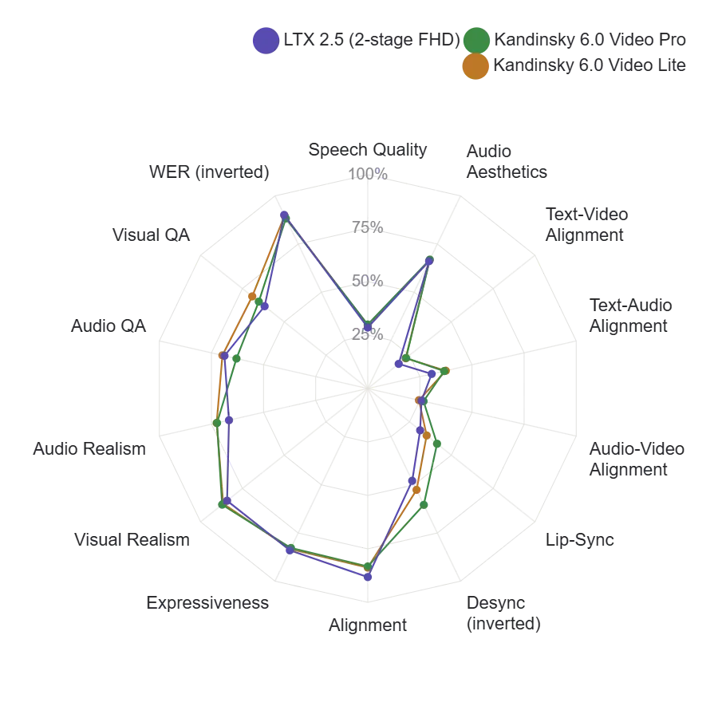

Figure 14: VABench radar chart. All metrics are normalized, with desync
and word error rate inverted so that a larger radius always indicates
better performance.

|                | LTX 2.5 | Kandinsky 6.0 Video Lite | Kandinsky 6.0 Video Pro |
| -------------- | ------- | ------------------------ | ----------------------- |
| speech_qn      | 1.427   | 1.477                    | 1.496                   |
| audio_aes      | 3.307   | 3.323                    | 3.345                   |
| tv_align       | 0.185   | 0.227                    | 0.229                   |
| ta_align       | 0.307   | 0.374                    | 0.367                   |
| av_align       | 0.258   | 0.245                    | 0.268                   |
| lipsync        | 1.567   | 1.761                    | 2.072                   |
| desync         | 0.521   | 0.474                    | 0.396                   |
| alignment      | 4.527   | 4.351                    | 4.329                   |
| expressiveness | 4.360   | 4.334                    | 4.312                   |
| visual_realism | 4.366   | 4.459                    | 4.485                   |
| audio_realism  | 3.663   | 3.900                    | 3.893                   |
| audio_qa       | 0.688   | 0.697                    | 0.630                   |
| visual_qa      | 0.617   | 0.691                    | 0.652                   |
| WER            | 0.099   | 0.103                    | 0.117                   |

Table 11: VABench results. Higher is better for all metrics except
desync and word error rate. Best per row in bold, second best
underlined.

### 7.2  Human Evaluation

#### 7.2.1  Methodology

The human evaluation is performed as a side-by-side (SBS) comparison of
pairs of videos generated from the same prompt by two different models.
The annotator is shown both videos simultaneously and can freely replay,
pause, scrub, and zoom each of them in order to inspect differences in
motion, detail, and audio. The videos are anonymized, their left/right
positions are randomized per task, and the order of tasks is shuffled.

The evaluation is organized as a single annotation session with a fixed
question sequence. Initially, audio is disabled for both videos, and the
annotator answers the visual questions without sound. The annotator is
then asked to enable sound and answer the remaining questions, which
cover speech quality, audio-video synchronization, overall audio
quality, sound-prompt correspondence, and overall task solving. For
image-to-video comparisons, an additional question about correspondence
to the input image is asked.

Each question targets a specific criterion and offers a fixed set of
answer options, including a symmetric tie option (‘‘Equally’’, ‘‘Both
fully correct’’, etc.) and, where applicable, an ‘‘N/A’’ option for
cases where the criterion cannot be evaluated (e.g., no speech in either
video). A majority-vote aggregation is applied across annotators.
Approximately 200 or more pairwise comparisons are collected for each
evaluated criterion, with the exact number depending on the comparison.

#### 7.2.2  Evaluation Criteria

The annotator answers the following questions.

Visual questions (audio disabled):

1.  1.  Overall Visual Quality. Which video is preferred visually, without
        taking the prompt into account? The annotator considers composition,
        lighting, colour and contrast, and overall visual appeal.
2.  2.  Artifacts and Semantic Breaks. Which video contains fewer artifacts
        and fewer unintended semantic breaks? Artifacts include extra limbs,
        fingers, unrelated objects, watermarks, unrelated text, grain,
        flicker, texture changes without a reason, and loss of face
        identity. Semantic breaks include unintended object transformations
        and sudden appearances or disappearances of objects. The prompt is
        available for reference to distinguish artifacts from requested
        content.
3.  3.  Motion Realism and Physics. Which video has more realistic object
        motion and better adheres to the rules of the physical world? The
        annotator evaluates trajectories of limbs, head, and facial
        expression, body coherence, and physical plausibility of object
        interactions. The prompt is available for reference.
4.  4.  Visual Prompt Following. Which video better follows the prompt,
        ignoring the audio-related part of the description? The evaluation
        considers, in priority order, the number of objects, their
        quantities, properties, spatial arrangement, actions, and on-screen
        text.
5.  5.  Camera Motion. Which video correctly reproduces the camera motion
        requested in the prompt? If several camera motions are requested,
        their count is compared. If the prompt does not specify any camera
        motion, the question is marked as not applicable.

Audio and audio-visual questions (audio enabled):

1.  6.  Speech Quality. Which video has better speech quality? The annotator
        evaluates intelligibility, naturalness of voice and articulation,
        and, if singing is requested, whether the content is actually sung.
        Lip-sync and facial expression are evaluated only when the speaker
        is on screen.
2.  7.  Audio-Video Synchronization. Which video has less desynchronization
        between audio and visuals? Temporal alignment is evaluated between
        sound events and their visual counterparts (e.g., speech and lip
        movement, impact and contact, door opening and sound).
        Desynchronization explicitly requested in the prompt is not
        penalized.
3.  8.  Overall Audio Quality. Which video has better overall audio quality?
        The annotator evaluates audio defects such as muffled sound, extreme
        quietness, harsh clipping, unexpected interruptions, noise, and
        artifacts. The correspondence between audio and prompt is not
        evaluated here.
4.  9.  Sound Prompt Following. Which video’s audio better corresponds to
        the prompt? The annotator evaluates how accurately the requested
        sounds (speech, sound effects, background music, ambience) are
        reproduced. Missing requested sounds, wrong sounds, or wrong spoken
        text are counted as errors.
5.  10. User Task Solving. Which video better solves the user’s task as a
        whole? The annotator evaluates visual and audio logic, coherence,
        and whether the generation can be used as a finished result. For
        contradictory prompts, the video offering the better creative
        synthesis is preferred.

Image-to-Video additional question:

1.  11. Reference Image Correspondence. Which video better preserves the
        input image? The annotator evaluates identity of characters, main
        objects and their attributes, clothing, colours, scene content,
        spatial arrangement, and visual style. Changes explicitly requested
        by the prompt, or required by the prompt, are not penalized.

The number of questions per comparison depends on the mode: purely
visual comparisons use questions 1–5 only; audio-visual comparisons add
questions 6–10; image-to-video comparisons further add question 11.

#### 7.2.3  Kandinsky 6.0 Video Pro vs Kandinsky 5.0 Video Pro

We compare Kandinsky 6.0 Video Pro against the previous generation,
Kandinsky 5.0 Video Pro, in both text-to-video (T2V) and image-to-video
(I2V) modes supported by Kandinsky 5.0. Audio is rendered, but ignored.

The comparison shows a clear and consistent advantage for Kandinsky 6.0
Video Pro across all perceptual and semantic criteria. In T2V mode
(Figure 15, top), the new model dominates in overall visual quality,
artifact suppression, motion realism, and visual prompt following, with
a smaller but still positive advantage in camera motion. In I2V mode
(Figure 15, bottom), the same pattern holds: Kandinsky 6.0 Video Pro
leads in overall visual quality, artifacts, motion realism, visual
prompt following, camera motion, and also improves on reference image
correspondence — a criterion that is otherwise challenging for video
generation models. The magnitude of the gains is substantial for overall
visual quality and prompt following, and moderate for motion realism.

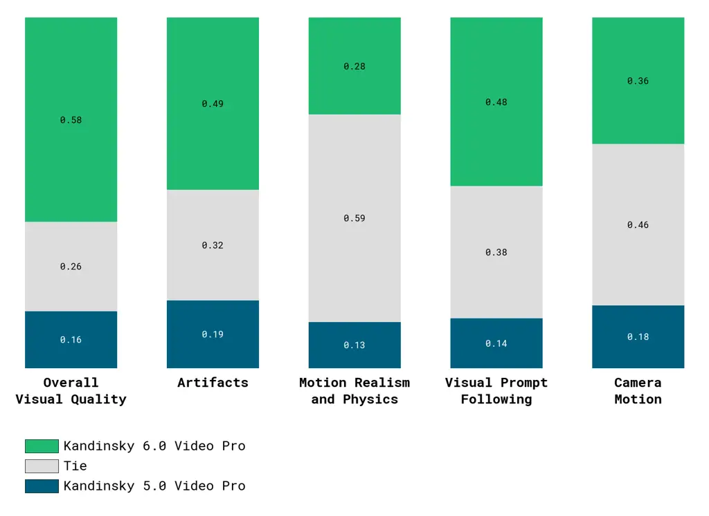

(a) Text-to-Video

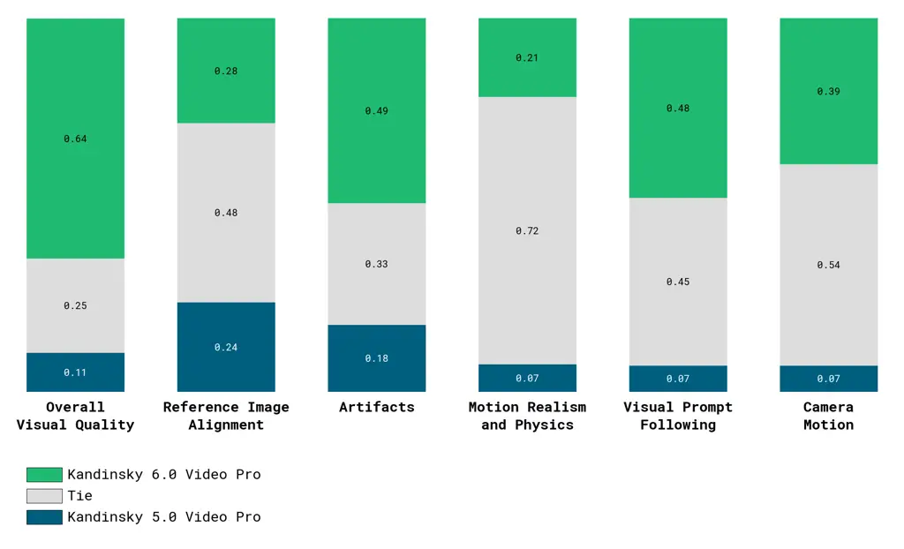

(b) Image-to-Video

Figure 15: Side-by-side comparison of Kandinsky 6.0 Video Pro vs
Kandinsky 5.0 Video Pro. In all figures of this section, the light green
segment denotes preference for Kandinsky 6.0 Video Pro, gray denotes
ties, and the dark segment denotes preference for the opponent model.

#### 7.2.4  Kandinsky 6.0 Video Pro vs Kling 2.6

We compare Kandinsky 6.0 Video Pro with Kling 2.6 in T2AV and I2AV
modes. In addition to the perceptual and semantic criteria, this
comparison covers the full set of audio and audio-visual criteria.

The results, presented in Figure 16, show a mixed picture. On perceptual
criteria, Kling 2.6 is preferred in overall visual quality, while
Kandinsky 6.0 Video Pro achieves close-to-parity performance on
artifacts and motion realism. On semantic criteria, visual prompt
following is essentially tied in T2AV mode and slightly favors Kling 2.6
in I2AV mode, whereas sound prompt following clearly favors Kandinsky
6.0 Video Pro in both modes. On audio quality, overall audio quality and
audio-video synchronization are moderately in favor of Kling 2.6, but
speech quality and user-task solving are close to parity. In I2AV mode,
camera motion also favors Kandinsky 6.0 Video Pro. Overall, the two
models are competitive: Kling 2.6 leads on visual aesthetics and audio
quality, while Kandinsky 6.0 Video Pro leads on audio-prompt alignment
and, in I2AV, camera control.

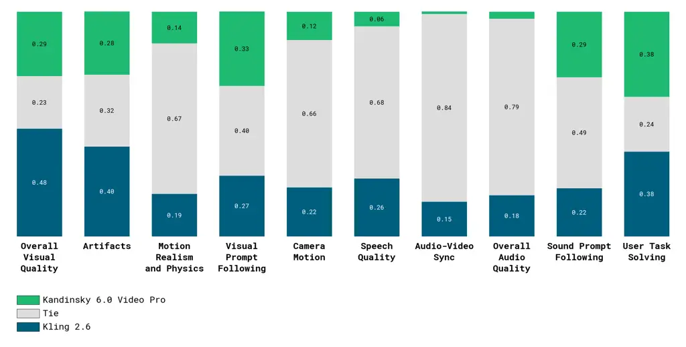

(a) Text-to-Video + Audio

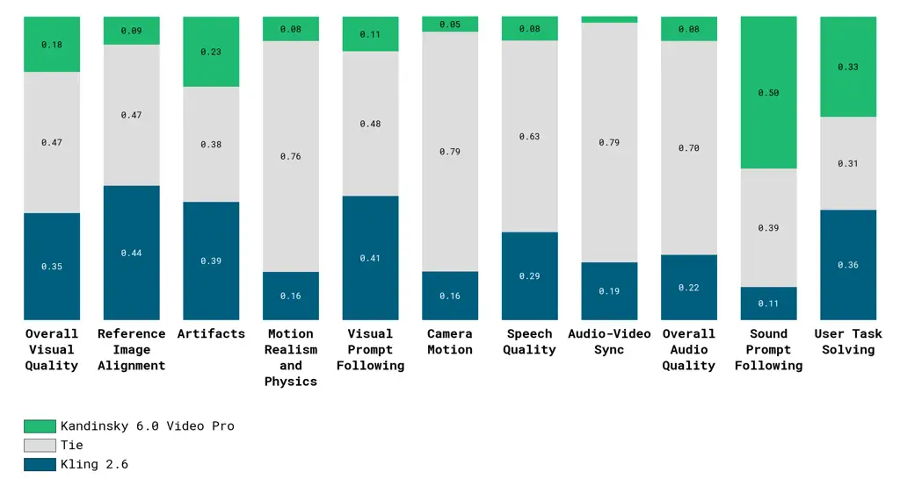

(b) Image-to-Video + Audio

Figure 16: Side-by-side comparison of Kandinsky 6.0 Video Pro vs Kling
2.6.

#### 7.2.5  Kandinsky 6.0 Video Pro vs LTX 2.5

We compare Kandinsky 6.0 Video Pro with LTX 2.5 in T2AV and I2AV modes.
As in the previous subsection, this comparison covers the full set of
visual, semantic, audio, and audio-visual criteria.

The results are shown in Figure 17. On the visual side, Kandinsky 6.0
Video Pro is clearly preferred: it leads in overall visual quality,
artifacts, motion realism, visual prompt following, and user-task
solving, with the advantage statistically significant for overall visual
quality and task solving. Camera motion is close to parity, though the
majority of prompts did not request any camera movement, so this
criterion is informative for only a small subset of comparisons.

On the audio side, the picture is more balanced. Speech quality favors
Kandinsky 6.0 Video Pro with a statistically significant margin, while
audio-video synchronization, overall audio quality, and sound-prompt
following are slightly in favor of LTX 2.5, though none of these three
differences reaches statistical significance. Overall, Kandinsky 6.0
Video Pro leads on the visual and speech-related dimensions, while LTX
2.5 retains a small, non-significant edge on general audio fidelity.

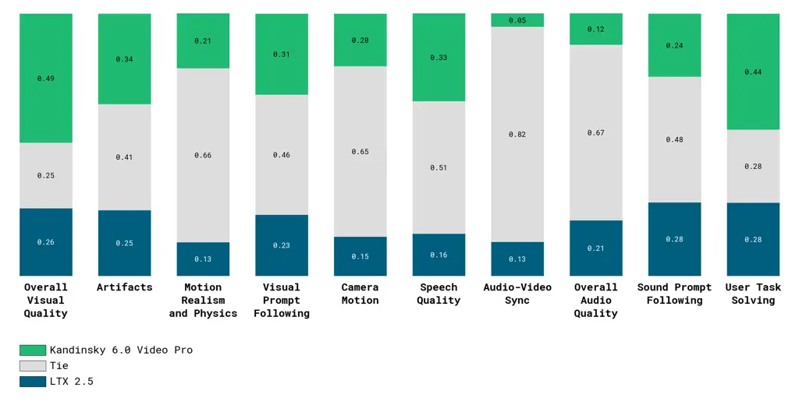

(a) Text-to-Video + Audio

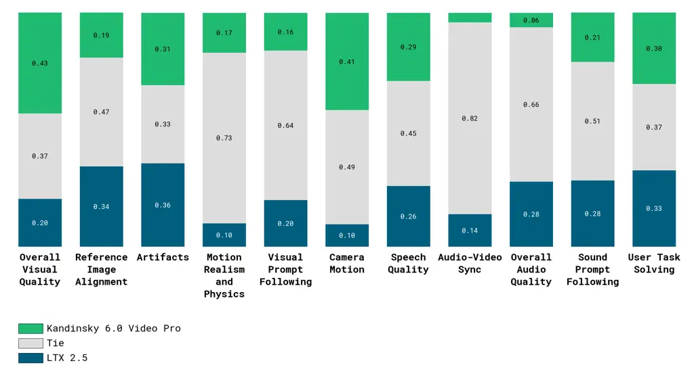

(b) Image-to-Video + Audio

Figure 17: Side-by-side comparison of Kandinsky 6.0 Video Pro vs LTX
2.5.

#### 7.2.6  Kandinsky 6.0 Video Pro vs Veo 3.1 Fast

We compare Kandinsky 6.0 Video Pro with Veo 3.1 Fast in both T2AV and
I2AV modes. The comparison covers the full set of criteria described
above.

Results are presented in Figure 18. In both modes, the two models trade
strengths across different criteria, with no model dominating the entire
set.

In T2AV mode (top), Kandinsky 6.0 Video Pro is preferred on artifacts
and camera motion with statistically significant margins, and motion
realism slightly favors it as well (though the sample is dominated by
ties). Veo 3.1 Fast leads on visual prompt following, speech quality,
audio-video synchronization, overall audio quality, sound-prompt
following, and user-task solving — all but speech reaching significance.
Overall visual quality is close to parity with a slight edge to Veo.

In I2AV mode (bottom), Kandinsky 6.0 Video Pro is preferred on overall
visual quality, reference-image alignment, artifacts, and camera motion
— all statistically significant. Veo 3.1 Fast leads on visual prompt
following, audio-video synchronization, overall audio quality,
sound-prompt following, and user-task solving — also significant. Motion
realism and speech quality are close to parity.

Overall, the comparison reveals a clear split: Kandinsky 6.0 Video Pro
produces cleaner visuals and better preserves the input image, while Veo
3.1 Fast better follows the prompt and delivers stronger audio.

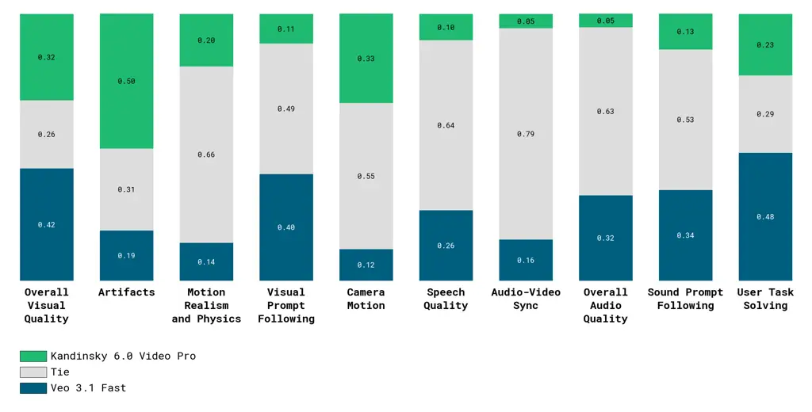

(a) Text-to-Video + Audio

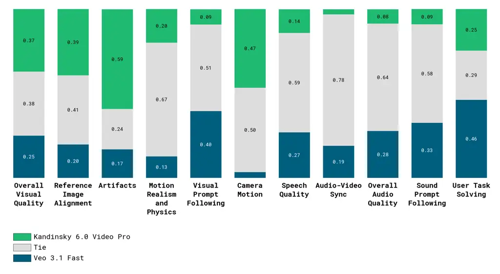

(b) Image-to-Video + Audio

Figure 18: Side-by-side comparison of Kandinsky 6.0 Video Pro vs Veo 3.1
Fast. Light green — Kandinsky 6.0 Video Pro, gray — ties, dark — Veo 3.1
Fast.

#### 7.2.7  Kandinsky 6.0 Video Pro vs MiniMax H3

We compare Kandinsky 6.0 Video Pro with MiniMax H3 in both T2AV and I2AV
modes. The comparison covers the full set of criteria described above.

Results are presented in Figure 19. MiniMax H3 is preferred on the
majority of criteria in both modes, with statistically significant
margins on overall visual quality, artifacts, motion realism, visual
prompt following, overall audio quality, sound-prompt following, and
user-task solving. Kandinsky 6.0 Video Pro remains competitive on speech
quality, camera motion, and audio-video synchronization, where a large
fraction of comparisons result in ties and the differences do not reach
statistical significance.

The pattern is similar in I2AV mode: H3 leads on the visual and
audio-visual criteria, while Kandinsky 6.0 Video Pro stays close on
audio-video synchronization and speech quality. As in T2AV, these
criteria are applicable for only a subset of prompts.

Overall, MiniMax H3 is the stronger model on this benchmark, while
Kandinsky 6.0 Video Pro remains competitive on synchronization and
speech-related criteria.

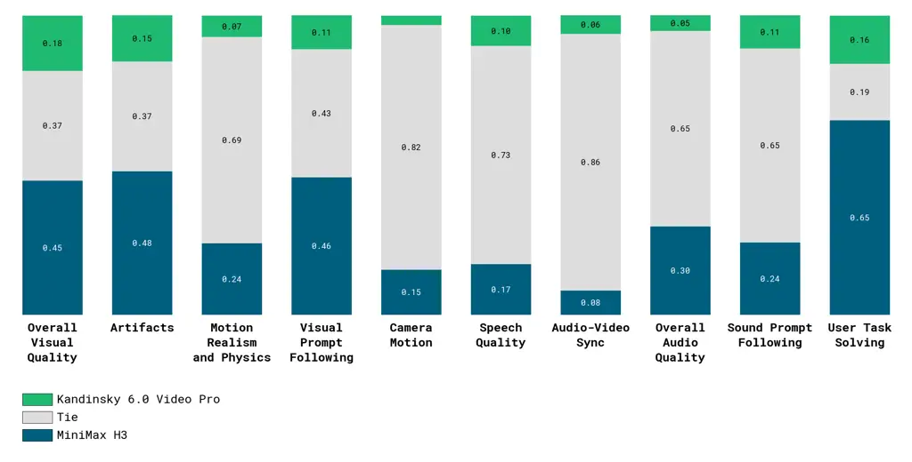

(a) Text-to-Video + Audio

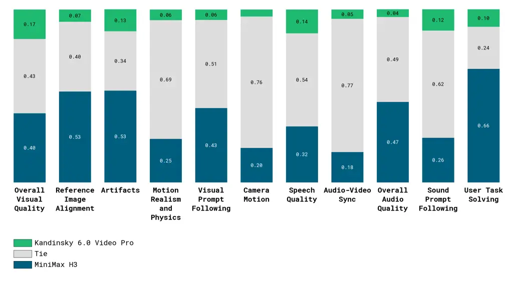

(b) Image-to-Video + Audio

Figure 19: Side-by-side comparison of Kandinsky 6.0 Video Pro vs MiniMax
H3. Light green — Kandinsky 6.0 Video Pro, gray — ties, dark — MiniMax
H3.

#### 7.2.8  Kandinsky 6.0 Video Pro vs Seedance 2.0

We compare Kandinsky 6.0 Video Pro with Seedance 2.0 in both T2AV and
I2AV modes. The comparison covers the full set of criteria described
above.

Results are presented in Figure 20. Seedance 2.0 is preferred on the
visual criteria, with statistically significant margins on overall
visual quality, artifacts, motion realism, and visual prompt following.
In the audio domain the picture is more balanced: audio-video
synchronization is close to parity, with a large fraction of ties and no
significant difference between the two models, and speech quality favors
Kandinsky 6.0 Video Pro. Sound-prompt following is also close to parity.

In I2AV mode (bottom), the pattern is similar. Seedance 2.0 leads on
overall visual quality, reference-image alignment, artifacts, and visual
prompt following, while motion realism and audio-video synchronization
are close to parity. Speech quality again favors Kandinsky 6.0 Video
Pro, and sound-prompt following is competitive.

Overall, Seedance 2.0 is the stronger model on purely visual criteria,
while Kandinsky 6.0 Video Pro is competitive on synchronization and
leads on speech quality. The comparison shows that the two models
address different strengths: Seedance 2.0 focuses on visual fidelity,
whereas Kandinsky 6.0 Video Pro performs particularly well when speech
and audio-visual coherence are the priority.

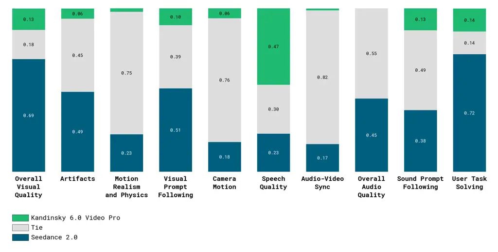

(a) Text-to-Video + Audio

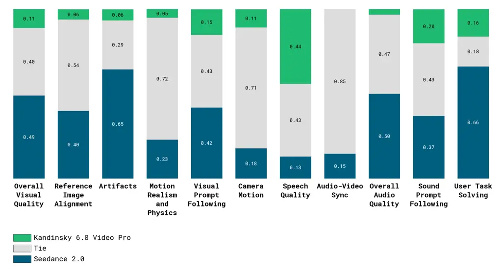

(b) Image-to-Video + Audio

Figure 20: Side-by-side comparison of Kandinsky 6.0 Video Pro vs
Seedance 2.0. Light green — Kandinsky 6.0 Video Pro, gray — ties, dark —
Seedance 2.0.

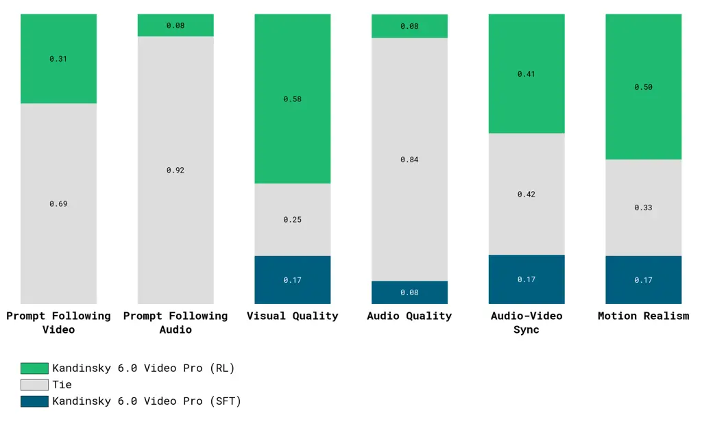

(a) Text-to-Video + Audio, speech-focused

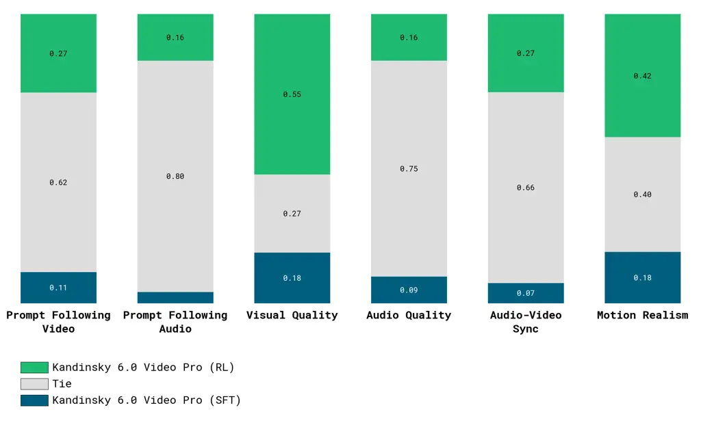

(b) Text-to-Video + Audio, general domain

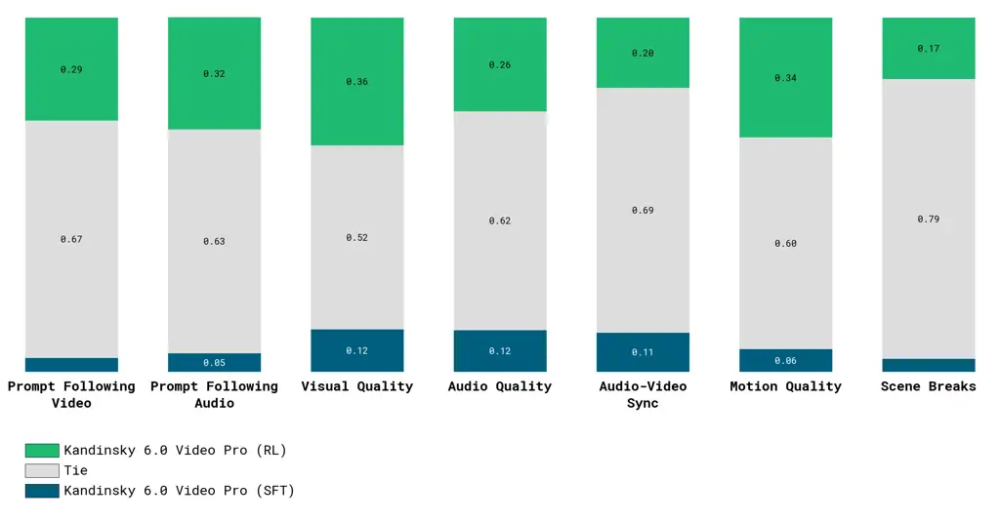

(c) Image-to-Video + Audio, general domain

Figure 21: Side-by-side comparison of Kandinsky 6.0 Video Pro (RL) vs
Kandinsky 6.0 Video Pro (SFT) on three benchmarks (T2AV —
Text-to-Audio-Video, I2AV — Image-to-Audio-Video). Light green — RL,
gray — ties, dark — SFT.

#### 7.2.9  Ablation: Reinforcement Learning vs SFT

We conduct an ablation study to isolate the effect of reinforcement
learning post-training relative to the supervised fine-tuning stage. The
comparison is performed in three settings: (a) T2AV mode on a curated
speech-focused benchmark, (b) T2AV mode on a general-domain benchmark,
and (c) I2AV mode on a general-domain benchmark. In all three settings,
the SFT checkpoint of Kandinsky 6.0 Video Pro is compared against its RL
checkpoint obtained after the reinforcement learning stage described in
Section 4.4.

Results are presented in Figure 21. The RL stage brings consistent and
substantial improvements across all three settings.

(a) T2AV, speech-focused benchmark. The improvement is most pronounced
here. Speech quality, sound-prompt following, and audio-video
synchronization all improve significantly, and the fraction of ties
decreases correspondingly. Visual prompt following and motion realism
also improve, though by a smaller margin. This indicates that the RL
stage is particularly effective at aligning the audio and speech
components with the prompt, which is the primary target of the
multi-objective reward stack.

(b) T2AV, general domain. On the general-domain benchmark, the gains are
more balanced. Visual quality, motion realism, and visual prompt
following all improve substantially, while audio-related criteria show
more moderate but still positive gains. This suggests that the RL stage
does not specialize on speech at the expense of general-domain visual
quality — both dimensions improve, with the largest effect on the visual
side.

(c) I2AV, general domain. In image-conditioned mode, the pattern is
similar to (b): visual quality, motion quality, and audio-video
synchronization improve, with prompt-following metrics also trending
upward. Scene breaks decrease, indicating more stable, single-scene
generations.

Across all three settings, the RL checkpoint is preferred by a clear
margin, confirming that the reinforcement learning stage provides a
meaningful improvement over SFT alone.

#### 7.2.10  Ablation: Distillation vs Full Model

We compare the distilled checkpoint of Kandinsky 6.0 Video Pro against
the full, non-distilled model of the same training stage in I2AV mode.
Results are presented in Figure 22.

The distilled model is preferred or tied on the majority of criteria,
and no individual difference reaches statistical significance at either
the 0.95 or the 0.975 level. The mean preference across all criteria is
51% vs 49% in favor of the distilled model. The largest gains are on
reference image alignment and artifacts, while the full model retains a
small edge on visual prompt following and user task solving. Overall,
distillation preserves the quality of the full model while reducing
inference cost.

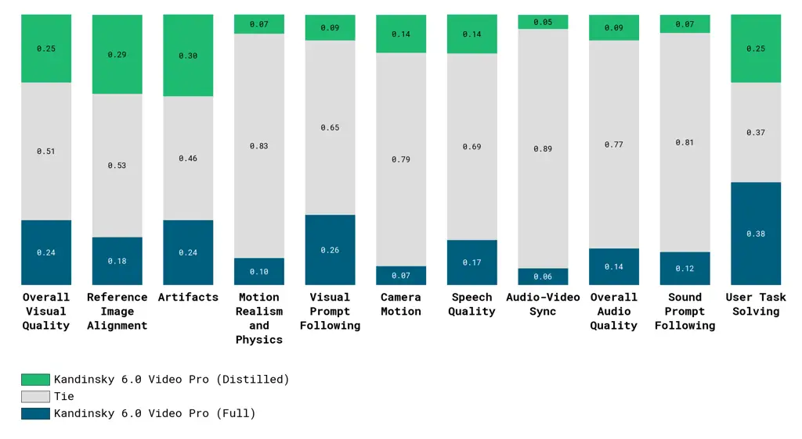

Figure 22: Side-by-side comparison of Kandinsky 6.0 Video Pro
(distilled) vs Kandinsky 6.0 Video Pro (full). Light green — distilled,
gray — ties, dark — full.

## 8   Examples

This section presents qualitative results that are difficult to convey
through quantitative benchmarks alone. Video and synchronized audio
generation cannot be fully represented on the printed page: the reader
cannot play back the generated audio track or observe the temporal
alignment between sound and motion. We therefore rely on two
complementary forms of illustration.

For audio-visual examples (Section 8.1), each figure shows a sequence of
frames sampled from a single 5-second generation at 24 fps, together
with the waveform of the corresponding audio track. The waveform makes
two properties visible at a glance. First, the audio is synchronized
with the video: impact sounds produce spikes at the exact frames where
the impact occurs, and speech amplitude follows the movements of the
lips. Second, the generated audio is semantically consistent with the
visual scene: the model produces the sound of the objects and actions it
has generated, not generic ambient noise. These properties are further
confirmed by the side-by-side human evaluation and by the VABench
results reported in Section 7, where Kandinsky 6.0 Video is competitive
with leading audio-video generation models on both synchronization and
speech quality.

Super-resolution examples are provided in Section 8.2.

All examples in this section are generated by Kandinsky 6.0 Video Pro
unless stated otherwise. Examples of generated videos with their audio
tracks are available in the public release materials at
[https://github.com/kandinskylab/kandinsky-6](https://github.com/kandinskylab/kandinsky-6).

### 8.1  Audio-Visual Examples

Figures 23–29 show examples in the general and speech domains, covering
animated scenes, speaking characters, and impact-synchronized sound.

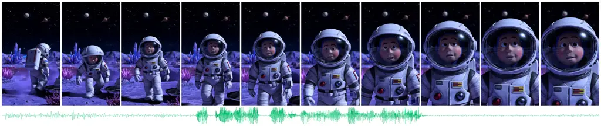

Figure 23: A 3D animated astronaut in a bulky white spacesuit walks
across the surface of an alien planet with glowing purple crystals and
two distant planets in the sky, turns to the camera, and speaks in awe:
\<S\>I have definitely never seen anything like this on Earth.\<E\>
\<AUDCAP\> Soft, muffled footsteps on dusty alien soil; a gentle
ethereal hum with subtle crystalline chimes and a soft cinematic score.
\<ENDAUDCAP\>

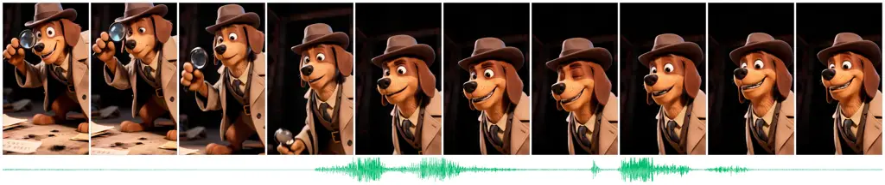

Figure 24: A cartoon dog detective in a trench coat and fedora examines
a strange print through a magnifying glass, then looks up at the camera
and says: \<S\>I know who it is!\<E\> \<AUDCAP\> Ambient night city
sounds, distant traffic, a suspenseful underscore, and a sharp gasp of
realization. \<ENDAUDCAP\>

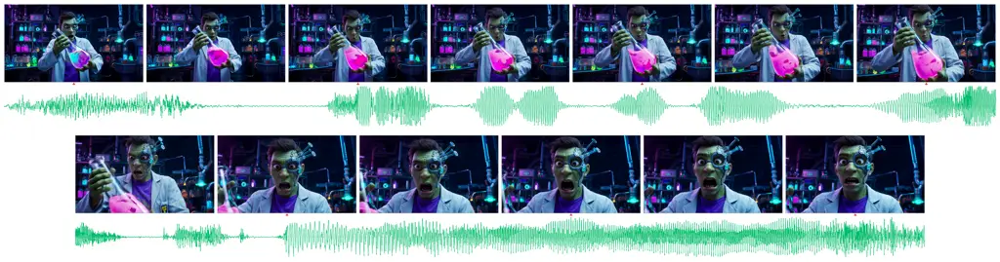

Figure 25: A cartoon mad scientist in a neon-lit laboratory mixes two
glowing liquids in a flask; the mixture foams up, and he turns to the
camera in panic: \<S\>I mixed up the formula! How did this happen?!\<E\>
\<AUDCAP\> Hum of laboratory equipment, bubbling liquid, faint
electrical zaps, vigorous fizzing, and a sharp gasp of panic.
\<ENDAUDCAP\>

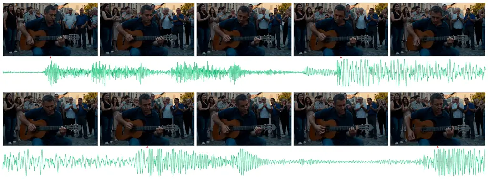

Figure 26: A street musician plays acoustic guitar on a cobblestone
square in warm late-afternoon light while a small crowd claps along.
\<AUDCAP\> Melodic fingerpicked acoustic guitar with rhythmic
synchronized clapping and faint ambient sounds of a public square.
\<ENDAUDCAP\>

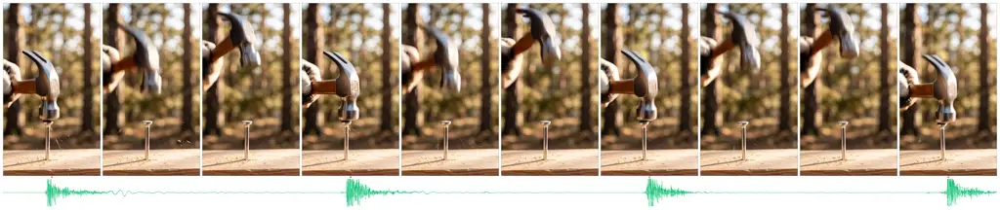

Figure 27: A gloved hand drives a metal nail into a wooden plank with a
claw hammer in a sunlit forest. Each strike sends small wood chips
flying. \<AUDCAP\> Loud metallic clinks and heavy resonant thuds at each
strike, with faint forest ambience and birds in the distance.
\<ENDAUDCAP\>

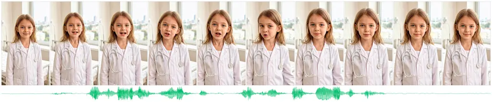

Figure 28: A young girl in a white medical coat with a stethoscope
stands in a bright hospital room and speaks to the camera: \<S\>When I
grow up, I want to be a doctor!\<E\> \<AUDCAP\> Quiet hospital room
ambience, soft cheerful background music, and a clear, sweet,
enthusiastic young voice. \<ENDAUDCAP\>

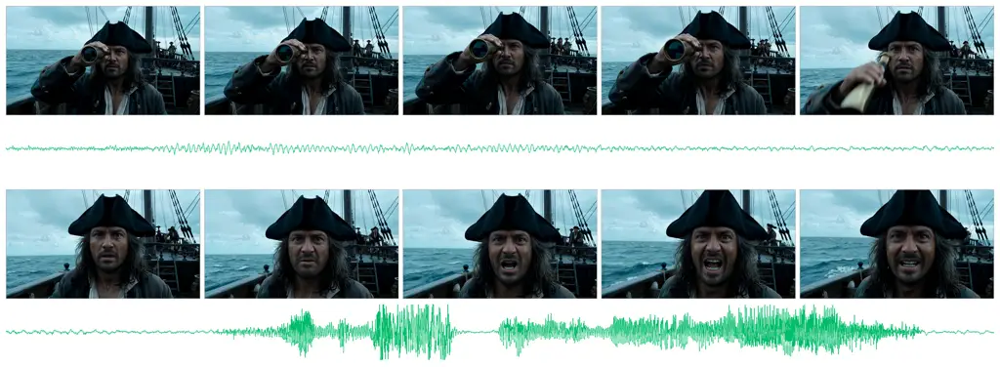

Figure 29: A pirate captain on the deck of a wooden sailing ship in
rough seas lowers his spyglass and shouts toward the camera: \<S\>Land
ahead!\<E\> \<AUDCAP\> Crashing waves against the hull, creaking planks
and rigging, strong wind, and a loud triumphant shout. \<ENDAUDCAP\>

### 8.2  Super-Resolution Examples

Figures 30, 31, and 32 illustrate the effect of super-resolution on
selected crops from generated videos. Each figure shows an input frame
on the left and three corresponding crop regions on the right. From top
to bottom, the rows show the enlarged input, decoded LU outputs at
$`\times 2`$ and $`\times 4`$, and outputs of the full SR pipeline at
$`\times 2`$ and $`\times 4`$. The LU outputs remain visually close to
the enlarged input. The full SR pipeline produces sharper boundaries and
finer textures, with the $`\times 4`$ route showing more pronounced
detail than the $`\times 2`$ route in these examples.

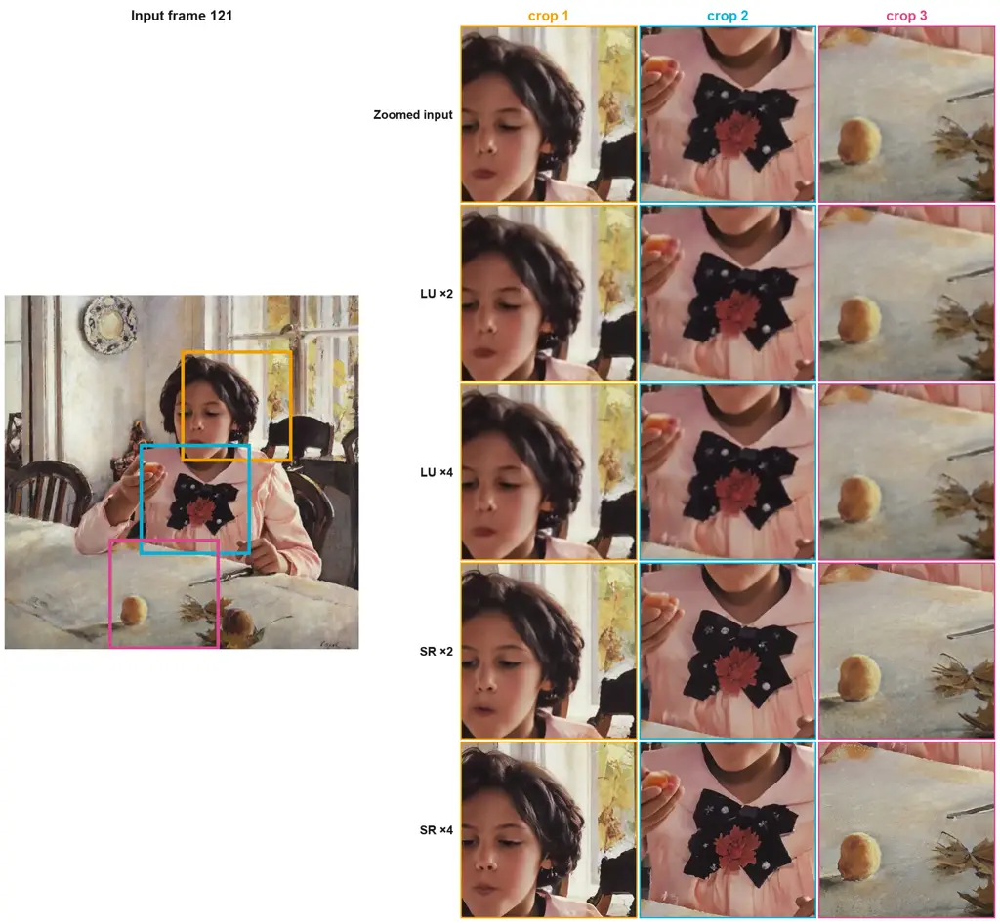

Figure 30: An animated painting based on Valentin Serov’s _Girl with
Peaches_ (1887); the original painting is in the public domain. The
crops show the face and hair, the bow on the dress, and a fruit on the
table. LU outputs remain visually close to the enlarged input. SR
sharpens hair strands and adds texture to the bow, fruit, and
tablecloth, with finer detail at $`\times 4`$ than at $`\times 2`$.

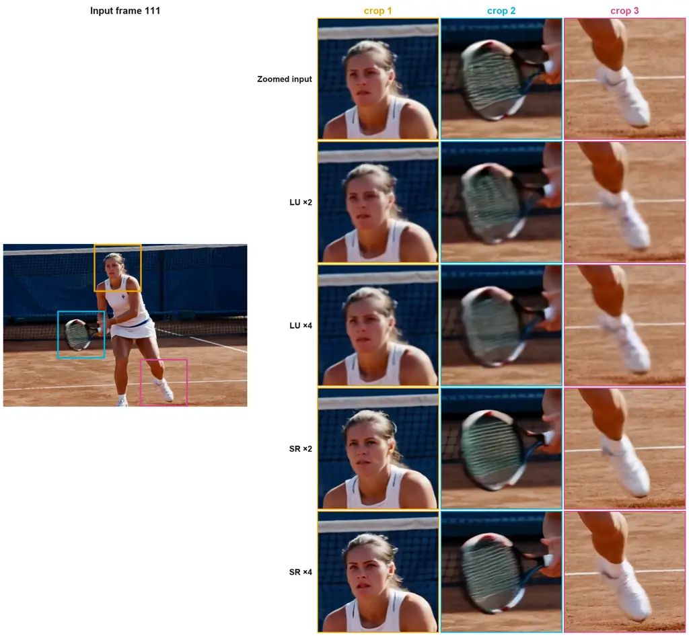

Figure 31: A tennis scene, frame 111. The crops show the face, the
racket, and the shoe with the surrounding court surface. LU outputs
remain visually close to the enlarged input. SR makes facial features,
racket strings, and shoe and court textures more distinct, particularly
at $`\times 4`$.

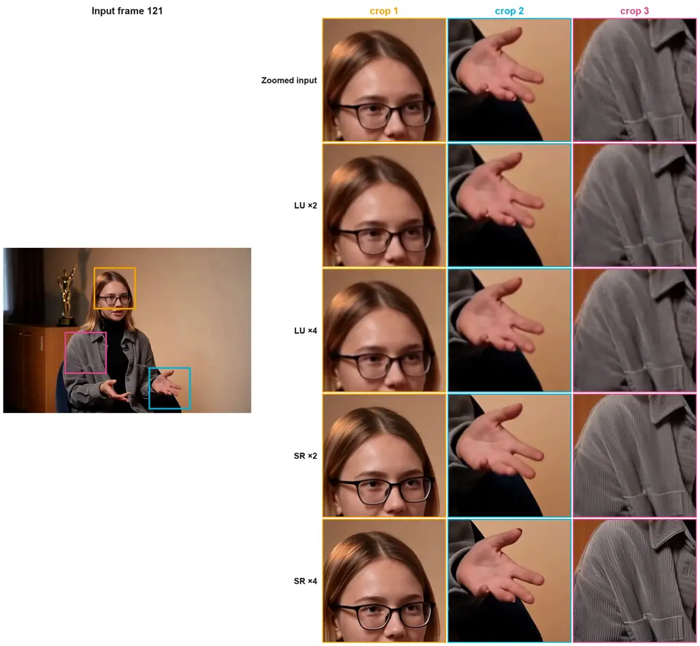

Figure 32: An interview scene, frame 121. The crops show the face and
glasses, the hand, and the fabric of the jacket. LU outputs remain
visually close to the enlarged input. SR sharpens facial features and
glasses contours and enhances hair and fabric detail, with more
pronounced texture at $`\times 4`$ than at $`\times 2`$.

## 9  Related Work

### 9.1  Image and Video Generation

Diffusion models \[1, 2\] and flow matching \[3, 76\] have become the
dominant paradigm for visual generation. Latent diffusion \[4\] made
high-resolution synthesis computationally tractable, and transformer
backbones \[6, 77\] have largely replaced convolutional U-Nets in recent
systems. The Kandinsky family of text-to-image models followed this
trajectory over several generations \[78, 79, 80\].

Early video diffusion models extended image generators with temporal
layers \[81, 82, 83\], while more recent systems train spatio-temporal
diffusion transformers at scale \[84, 85, 86, 9, 10, 87, 88\]. Within
the Kandinsky line, architectural design choices for text-to-video
pipelines were studied in \[89, 90\], followed by the CrossDiT-based
Kandinsky 5.0 family \[11\], on which Kandinsky 6.0 Video directly
builds. Other works address individual components of video generation
pipelines, including efficient attention for long spatio-temporal
sequences \[12, 67, 91\], autoencoder training without characteristic
artifacts \[92\], explicit temporal control in video diffusion
transformers \[93\], and temporally correlated generative priors for
video-to-video tasks \[94\]. Culture-specific generation and its
evaluation are supported by dedicated datasets and benchmarks \[46,
47\], which underlie the Russian Cultural Code data used in this work
(Section 2).

### 9.2  Joint Audio-Video Generation

Audio and video have long been generated separately or sequentially, for
example by synthesizing a soundtrack for a given video \[48\]. Closed
commercial systems such as Veo 3.1 \[8\] and Sora 2 \[13\] demonstrated
that both modalities can be generated jointly with natural lip
synchronization and sound effects. Open research models pursue the same
goal with a range of designs: temporally aligned flow-based generation
\[15\], hierarchical spatio-temporal synchronization priors \[16\],
unified tri-modal transformers \[17\], and dual-stream transformers with
cross-modal fusion \[49, 18\]. Large-scale systems such as ALIVE \[14\],
MiniMax-H3 \[19\], and Cosmos 3 \[20\] further extend joint audio-video
generation. Kandinsky 6.0 Video follows the dual-stream design but
initializes the video stream from a pretrained video model and trains
the audio stream from scratch (Section 3). Joint audio-video models can
also be extended with additional conditioning, such as reference-based
voice cloning \[95\]. Progress in this area is measured by dedicated
benchmarks for audio-video quality and synchronization \[21, 22, 23\].

### 9.3  Post-Training and Few-Step Sampling

Supervised fine-tuning on curated data and averaging of fine-tuned
weights (model soups) \[96, 97\] are common ways to improve the quality
of pretrained generators. Reinforcement learning further aligns
diffusion and flow models with human preferences and reward models \[98,
99, 100, 101\]; OmniNFT \[24\] adapts this approach to joint audio-video
generation. To reduce the number of sampling steps, prior work has
explored progressive distillation \[102\], consistency models \[103,
104, 55\], distribution matching \[52, 53, 54\], adversarial
distillation \[105, 59, 61\], and policy-based imitation distillation
\[57\].

### 9.4  Video Super-Resolution

Real-world super-resolution models are commonly trained on synthetic
degradations that imitate blur, noise, resizing, and compression \[62\].
Diffusion-based approaches add strong generative priors and reduce the
number of sampling steps \[65, 66\], and recent work addresses
structural and temporal artifacts specific to generated videos \[63\] as
well as temporally consistent video-to-video restoration \[94\]. Our SR
model operates in latent space and combines a deterministic latent
upscaler with a text-free diffusion transformer distilled to two network
evaluations (Section 3.3).

## 10  Conclusion

We presented Kandinsky 6.0 Video, a family of foundation models for
synchronized text-to-audio-video and image-to-audio-video generation,
comprising Kandinsky 6.0 Video Lite (3B parameters) and Kandinsky 6.0
Video Pro (29B parameters). Both models use a dual-stream CrossDiT
architecture in which a video stream inherited from Kandinsky 5.0 and an
audio stream trained from scratch are connected by blockwise
bidirectional cross-attention. The models are trained with continuous
pre-training, first separately for each modality and then jointly,
followed by domain-specific supervised fine-tuning merged into a model
soup, reinforcement learning adapted from OmniNFT, and two-stage
distillation ($`\pi`$-Flow followed by adversarial refinement) to 10
function evaluations. A separate latent-space super-resolution model,
consisting of a Latent Upscaler and a text-free SR-DiT distilled to two
network evaluations, raises the output resolution to Full HD. Block
offloading and memory presets make both models usable on consumer GPUs
with 16–32 GB of memory.

In side-by-side human evaluation, Kandinsky 6.0 Video Pro clearly
outperforms its predecessor, Kandinsky 5.0 Video Pro, and is preferred
over LTX 2.5 in visual quality and speech quality. Compared with
proprietary systems, the results are mixed: the model is competitive
with Kling 2.6 and Veo 3.1 Fast, with strengths that differ by
criterion, while MiniMax H3 and Seedance 2.0 remain stronger on visual
criteria; Kandinsky 6.0 Video Pro stays competitive on speech quality
and audio-video synchronization. On VABench, Kandinsky 6.0 Video Pro
achieves the best scores among the evaluated models (Kandinsky 6.0 Video
Lite and LTX 2.5) in speech quality, audio aesthetics, text-video and
audio-video alignment, lip-sync, desynchronization, and visual realism.
Reinforcement learning reduces the word error rate of generated speech
by 47% for the Pro model.

The models have several limitations. They generate clips of up to 5
seconds, the base generation runs at SD resolution with Full HD obtained
through super-resolution, and a gap remains to the strongest proprietary
systems in visual quality and overall audio quality. Natural directions
for future work include longer clips, higher native resolution, and
additional reference-based conditioning.

We release the model weights, source code, and diffusers integration
under the MIT license to support further research on multimodal
generation.

### Ethical Considerations

Kandinsky 6.0 Video is intended to support research, education, and
creative work, including content production, prototyping, and accessible
tools for visual and audio storytelling. We believe that openly
available generative models should be developed and used responsibly,
with respect for human rights, personal dignity, and applicable law.

Models that produce realistic video with synchronized speech and lip
movements carry specific risks. They can be misused to create misleading
or deceptive content, to impersonate real individuals, to spread
disinformation, or to facilitate fraud and harassment. We do not support
and explicitly discourage any such use. In particular, the models should
not be used to depict real people without their consent, to imitate a
person’s voice or appearance for deceptive purposes, to generate content
that sexualizes minors or depicts non-consensual intimate imagery, to
promote violence, hatred, or discrimination, or to infringe intellectual
property rights.

We encourage users and downstream developers to clearly label generated
content as synthetic, to comply with the laws and regulations of their
jurisdictions, including those governing personal data, image and voice
rights, and the disclosure of AI-generated media, and to implement
appropriate safeguards, such as content moderation, when deploying the
models in public-facing products.

Like other models trained on large-scale data, Kandinsky 6.0 Video may
reflect biases present in its training data, including uneven
representation of demographic groups, cultures, and languages. Its
outputs may also contain factual, physical, or cultural inaccuracies and
should not be treated as depictions of real events. We encourage the
research community to study these limitations and to report problematic
behavior.

## 11  Contributors and Acknowledgments

### Contributors

Core Contributors:

- •
  Pre-training: Anna Dmitrienko, Alexander Ivanov, Denis Koposov, Eugeny
  Vilisov
- •
  Post-training: Nikita Kiselev, Georgy Makarov, Ivan Mikheev, Alexander
  Sentsov, Sergey Taranov
- •
  Optimization: Sofiya Bogakovskaya, Dmitry Ermilov, Mikhail Karaev,
  Anastasiia Kargapoltseva, Anatoliy Parpara
- •
  Distillation: Kirill Kozlov
- •
  Super-resolution: Vladimir Dokholyan, Georgii Fedorov, Aleksandr
  Gordeev
- •
  VAE: David Chikovani, Valeria Kobenko, Kirill Malakhov
- •
  Captioning Pipeline: Alexander Belykh, Maxim Litvinov
- •
  Metrics & Evaluation: Mikhail Aksyutin, Kirill Buzygin
- •
  Pre-training Data: Kirill Chernyshev, Vladimir Chernyy, Elizaveta
  Muromtseva, Konstantin Reznikov, Azat Saginbaev, Artem Sherstyuk,
  Matvey Suprunov
- •
  Post-training Data: Anastasia Aliaskina, Mark Bulygin, Irina
  Cheremnykh, Sergey Emelyanov, Andrey Inozemtsev, Vladislav Lakhtionov,
  Egor Malykh, Nikolai Nazarkin, Olga Varlashina
- •
  Harness: Bulat Akhmatov, Anton Bukashkin, Mikhail Mamaev, Polina
  Mikhailova
- •
  Technical Report: Vladimir Polovnikov
- •
  Track Leaders: Julia Agafonova, Andrei Ivaniuta, Ivan Kirillov, Yury
  Kolabushin, Anatoly Korobov, Denis Krzhivokolskiy, Alexey Letunovskiy,
  Dmitrii Mikhailov, Lev Novitskiy, Nikita Samsonov, Andrey Shutkin,
  Irina Tolstykh, Viacheslav Vasilev
- •
  Project Supervisors: Vladimir Arkhipkin, Denis Parkhomenko, Vladimir
  Korviakov, Nikolai Gerasimenko, Denis Dimitrov

##### Contributors:

Grigorii Alekseenko, Olga Androsova, Anna Averchenkova, Serafima
Bocharova, Mikhail Chernyshov, Georgy Daniltsev, Polina Gavrilova,
Konstantin Kuklev, Alexander Kunitsyn, Sergey Kuzin, Alexander Lyulkov,
Tatiana Nikulina, Stanislav Onuchin, Nikita Osterov, Nikita Shaimov,
Egor Silvestrov, Bulat Suleimanov, Tatiana Trofimuk, Ilya Trushkin,
Aleksandra Tsybina, Ilya Vasiliev, Sergey Yakubson, Konstantin Zakharov

### Acknowledgments

We would like to thank the following people for their help, advice, and
support:

##### TagMe Team:

Sergey Gorelov, Olga Pavlova, Dmitry Popov, Alexey Potapov, Alexander
Potemkin

##### GigaData Team:

Andrey Berezin, Andrey Evtikhov, Yulduz Fattakhova, Vyacheslav Fedotov,
Alexey Sandakov, Sergey Volkov

##### Cloud.ru:

Alena Drobyshevskaia, Nikita Kochetkov, Sergey Kovylov, Alyona
Kuznetsova, Alexander Naumov, Vladislav Shidlovsky, Viktor Strelkov

##### Model Risk Management Team:

Alexey Isakov, Viktor Panshin, Stepan Ponomarev, Vladislav Rodionov,
Oleg Yangalichin

##### Kandinsky Office:

Alexey Bondarenko, Vladimir Kozlov, Margarita Kusakina, Elizaveta
Raubishko

as well as Anton Frolov, Andrey Korystin, and Fyodor Minkin.

## References

- \[1\] J. Ho, A. Jain, and P. Abbeel (2020) Denoising Diffusion
  Probabilistic Models. In Advances in Neural Information Processing
  Systems (NeurIPS), Cited by: §1, §9.1.
- \[2\] Y. Song, J. Sohl-Dickstein, D. P. Kingma, A. Kumar, S. Ermon,
  and B. Poole (2021) Score-Based Generative Modeling through Stochastic
  Differential Equations. In International Conference on Learning
  Representations (ICLR), Cited by: §1, §9.1.
- \[3\] Y. Lipman, R. T. Q. Chen, H. Ben-Hamu, M. Nickel, and M.
  Le (2023) Flow Matching for Generative Modeling. In The Eleventh
  International Conference on Learning Representations (ICLR), Cited by:
  §1, §3.1, §4.2, §9.1.
- \[4\] R. Rombach, A. Blattmann, D. Lorenz, P. Esser, and B.
  Ommer (2022) High-Resolution Image Synthesis With Latent Diffusion
  Models. In Proceedings of the IEEE/CVF Conference on Computer Vision
  and Pattern Recognition (CVPR), pp. 10684–10695. Cited by: §1, §9.1.
- \[5\] D. Podell, Z. English, K. Lacey, A. Blattmann, T. Dockhorn, J.
  Müller, J. Penna, and R. Rombach (2024) SDXL: Improving Latent
  Diffusion Models for High-Resolution Image Synthesis. In The Twelfth
  International Conference on Learning Representations (ICLR), Cited by:
  §1.
- \[6\] W. Peebles and S. Xie (2023) Scalable Diffusion Models with
  Transformers. In Proceedings of the IEEE/CVF International Conference
  on Computer Vision (ICCV), Cited by: §1, §9.1.
- \[7\] OpenAI (2024) Video Generation Models as World Simulators.
  External Links:
  [Link](https://openai.com/index/video-generation-models-as-world-simulators/)
  Cited by: §1.
- \[8\] G. DeepMind (2025) Veo. Note:
  [https://deepmind.google/models/veo/](https://deepmind.google/models/veo/)
  Cited by: §1, §1, §9.2.
- \[9\] W. Kong, Q. Tian, Z. Zhang, R. Min, Z. Dai, J. Zhou, J.
  Xiong, X. Li, B. Wu, J. Zhang, et al. (2024) HunyuanVideo: A
  Systematic Framework For Large Video Generative Models. External
  Links: 2412.03603, [Link](https://arxiv.org/abs/2412.03603) Cited by:
  §1, §3.1, §9.1.
- \[10\] T. Wan, A. Wang, B. Ai, B. Wen, C. Mao, C. Xie, D. Chen, F.
  Yu, H. Zhao, J. Yang, et al. (2025) Wan: Open and Advanced Large-Scale
  Video Generative Models. arXiv preprint arXiv:2503.20314. Cited by:
  §1, §1, §9.1.
- \[11\] V. Arkhipkin, V. Korviakov, N. Gerasimenko, D. Parkhomenko, V.
  Vasilev, A. Letunovskiy, N. Vaulin, M. Kovaleva, I. Kirillov, L.
  Novitskiy, et al. (2026) Kandinsky 5.0: A Family of Foundation Models
  for Image and Video Generation. External Links: 2511.14993,
  [Link](https://arxiv.org/abs/2511.14993) Cited by: §1, §3.1, §3.2,
  §3.3.1, §4.5, §9.1.
- \[12\] D. Mikhailov, A. Letunovskiy, M. Kovaleva, V. Arkhipkin, V.
  Korviakov, V. Polovnikov, V. Vasilev, E. Sidorova, and D.
  Dimitrov (2026) NABLA: Neighborhood Adaptive Block-Level Attention for
  Efficient Video Generation. IEEE Access 14, pp. 64655–64665. External
  Links: [Document](https://dx.doi.org/10.1109/ACCESS.2026.3686867)
  Cited by: §1, §3.3.1, §4.6.3, §6.3, §9.1.
- \[13\] OpenAI (2025) Sora 2 is Here. External Links:
  [Link](https://openai.com/index/sora-2/) Cited by: §1, §9.2.
- \[14\] Y. Guo, Q. Gan, Y. Zhang, J. Liu, Y. Hu, P. Xie, D. Qian, Y.
  Zhang, R. Li, Y. Zhang, et al. (2026) ALIVE: Animate Your World with
  Lifelike Audio-Video Generation. External Links: 2602.08682,
  [Link](https://arxiv.org/abs/2602.08682) Cited by: §1, §9.2.
- \[15\] H. Liu, G. Le Lan, X. Mei, Z. Ni, A. Kumar, V. Nagaraja, W.
  Wang, M. D. Plumbley, Y. Shi, and V. Chandra (2024) SyncFlow: Toward
  Temporally Aligned Joint Audio-Video Generation from Text. External
  Links: 2412.15220, [Link](https://arxiv.org/abs/2412.15220) Cited by:
  §1, §9.2.
- \[16\] K. Liu, W. Li, L. Chen, S. Wu, Y. Zheng, J. Ji, F. Zhou, J.
  Luo, Z. Liu, H. Fei, and T. Chua (2026) JavisDiT: Joint Audio-Video
  Diffusion Transformer with Hierarchical Spatio-Temporal Prior
  Synchronization. In The Fourteenth International Conference on
  Learning Representations (ICLR), Cited by: §1, §9.2.
- \[17\] Y. Li, H. Si, F. Landi, P. O. Gallegos, I.
  Koutsoumpas, O. R. C. Vazquez, R. Fu, Q. Guo, X. Jin, S. Liu, and M.
  Song (2025) 3MDiT: Unified Tri-Modal Diffusion Transformer for
  Text-Driven Synchronized Audio-Video Generation. External Links:
  2511.21780, [Link](https://arxiv.org/abs/2511.21780) Cited by: §1,
  §9.2.
- \[18\] Y. HaCohen, B. Brazowski, N. Chiprut, Y. Bitterman, A.
  Kvochko, A. Berkowitz, D. Shalem, D. Lifschitz, D. Moshe, E. Porat, et
  al. (2026) LTX-2: Efficient Joint Audio-Visual Foundation Model.
  External Links: 2601.03233, [Link](https://arxiv.org/abs/2601.03233)
  Cited by: §1, §3.2, §9.2.
- \[19\] MiniMaxAI (2026) MiniMax-H3. Note:
  [https://github.com/MiniMax-AI/MiniMax-H3](https://github.com/MiniMax-AI/MiniMax-H3)
  Cited by: §1, §9.2.
- \[20\] NVIDIA (2026) Cosmos 3: Omnimodal World Models for Physical AI.
  External Links: 2606.02800, [Link](https://arxiv.org/abs/2606.02800)
  Cited by: §1, §9.2.
- \[21\] D. Hua, X. Wang, B. Zeng, X. Huang, H. Liang, J. Niu, X.
  Chen, Q. Xu, and W. Zhang (2026) VABench: A Comprehensive Benchmark
  for Audio-Video Generation. External Links: 2512.09299,
  [Link](https://arxiv.org/abs/2512.09299) Cited by: 4th item, §1, 2nd
  item, §7.1, §9.2.
- \[22\] Z. Cao, T. Wang, J. Wang, Y. Wang, Y. Zhang, J. Wang, J.
  Chen, M. Deng, Y. Guo, C. Liao, et al. (2026) T2AV-Compass: Towards
  Unified Evaluation for Text-to-Audio-Video Generation. External Links:
  2512.21094, [Link](https://arxiv.org/abs/2512.21094) Cited by: §1,
  §9.2.
- \[23\] Z. Zhou, Z. Lai, R. Wang, Y. Yang, Z. Xing, Y. Yang, Q. Dai, L.
  Qiu, and C. Luo (2026) AVGen-Bench: A Task-Driven Benchmark for
  Multi-Granular Evaluation of Text-to-Audio-Video Generation. External
  Links: 2604.08540, [Link](https://arxiv.org/abs/2604.08540) Cited by:
  §1, §9.2.
- \[24\] G. Zhang, X. Ma, J. Huang, H. Xu, H. Yu, S. Fu, Y. Li, Z.
  Xue, L. Song, H. Huang, N. Duan, and F. Zhao (2026) OmniNFT:
  Modality-wise Omni Diffusion Reinforcement for Joint Audio-Video
  Generation. External Links: 2605.12480,
  [Link](https://arxiv.org/abs/2605.12480) Cited by: 3rd item, §4.4,
  §9.3.
- \[25\] C. Zauner (2010) Implementation and benchmarking of perceptual
  image hash functions. Master’s Thesis, Upper Austria University of
  Applied Sciences. Cited by: §2.2.
- \[26\] G. Jocher, A. Chaurasia, and J. Qiu (2023) YOLOv8. External
  Links: [Link](https://github.com/ultralytics/ultralytics) Cited by:
  §2.2.
- \[27\] A. Radford, J. W. Kim, C. Hallacy, A. Ramesh, G. Goh, S.
  Agarwal, G. Sastry, A. Askell, P. Mishkin, J. Clark, et al. (2021)
  Learning transferable visual models from natural language supervision.
  In International Conference on Machine Learning (ICML), pp. 8748–8763.
  Cited by: §2.2, §3.1.
- \[28\] C. Chen, J. Mo, J. Hou, H. Wu, L. Liao, W. Sun, Q. Yan, and W.
  Lin (2023) TOPIQ: A Top-Down Approach from Semantics to Distortions
  for Image Quality Assessment. arXiv preprint arXiv:2308.03060. Cited
  by: §2.2.
- \[29\] H. Wu, Z. Zhang, E. Zhang, C. Chen, L. Liao, A. Wang, C. Li, W.
  Sun, Q. Yan, G. Zhai, and W. Lin (2023) Q-Align: Teaching LMMs for
  Visual Scoring via Discrete Text-Defined Levels. External Links:
  2312.17090, [Link](https://arxiv.org/abs/2312.17090) Cited by: §2.2.
- \[30\] N. Ravi, V. Gabeur, Y. Hu, R. Hu, C. Ryali, T. Ma, H. Khedr, R.
  Rädle, C. Rolland, L. Gustafson, et al. (2024) SAM 2: Segment Anything
  in Images and Videos. External Links: 2408.00714,
  [Link](https://arxiv.org/abs/2408.00714) Cited by: §2.2.
- \[31\] A. Yang, A. Li, B. Yang, B. Zhang, B. Hui, B. Zheng, B. Yu, C.
  Gao, C. Huang, C. Lv, et al. (2025) Qwen3 Technical Report. External
  Links: 2505.09388, [Link](https://arxiv.org/abs/2505.09388) Cited by:
  1st item.
- \[32\] T. Souček and J. Lokoč (2020) TransNet V2: An Effective Deep
  Network Architecture for Fast Shot Transition Detection. External
  Links: 2008.04838, [Link](https://arxiv.org/abs/2008.04838) Cited by:
  §2.3.
- \[33\] H. Wu, E. Zhang, L. Liao, C. Chen, J. Hou, A. Wang, W. Sun, Q.
  Yan, and W. Lin (2023) Exploring video quality assessment on user
  generated contents from aesthetic and technical perspectives. In
  Proceedings of the IEEE/CVF International Conference on Computer
  Vision (ICCV), pp. 20144–20154. Cited by: §2.3, 2nd item.
- \[34\] L. Wang, B. Huang, Z. Zhao, Z. Tong, Y. He, Y. Wang, Y. Wang,
  and Y. Qiao (2023) VideoMAE V2: Scaling Video Masked Autoencoders with
  Dual Masking. arXiv preprint arXiv:2303.16727. Cited by: §2.3.
- \[35\] Z. Wang, E. P. Simoncelli, and A. C. Bovik (2003) Multi-scale
  structural similarity for image quality assessment. In Signals,
  Systems and Computers, 2004. Conference Record of the Thirty-Seventh
  Asilomar Conference on, Vol. 2, pp. 1398–1402. Cited by: §2.3.
- \[36\] Y. Baek, B. Lee, D. Han, S. Yun, and H. Lee (2019) Character
  region awareness for text detection. In Proceedings of the IEEE/CVF
  Conference on Computer Vision and Pattern Recognition (CVPR),
  pp. 9365–9374. Cited by: 3rd item.
- \[37\] G. Team (2026) Gemma 4 Technical Report. External Links:
  2607.02770, [Link](https://arxiv.org/abs/2607.02770) Cited by: 1st
  item.
- \[38\] Qwen Team (2026) Qwen3.5: Towards Native Multimodal Agents.
  External Links: [Link](https://qwen.ai/blog?id=qwen3.5) Cited by: 3rd
  item.
- \[39\] J. Xu, Z. Guo, H. Hu, Y. Chu, X. Wang, J. He, Y. Wang, X. Shi,
  et al. (2025) Qwen3-Omni Technical Report. External Links: 2509.17765,
  [Link](https://arxiv.org/abs/2509.17765) Cited by: §2.6.
- \[40\] M. Li, Y. Zhang, D. Long, K. Chen, S. Song, S. Bai, Z. Yang, P.
  Xie, A. Yang, D. Liu, J. Zhou, and J. Lin (2026) Qwen3-VL-Embedding
  and Qwen3-VL-Reranker: A Unified Framework for State-of-the-Art
  Multimodal Retrieval and Ranking. External Links: 2601.04720,
  [Link](https://arxiv.org/abs/2601.04720) Cited by: 1st item.
- \[41\] C. Chen and J. Mo (2022) IQA-PyTorch: PyTorch Toolbox for Image
  Quality Assessment. Note:
  [https://github.com/chaofengc/IQA-PyTorch](https://github.com/chaofengc/IQA-PyTorch)Accessed:
  2025 Cited by: 2nd item.
- \[42\] S. Bai et al. (2025) Qwen3-VL Technical Report. External Links:
  2511.21631, [Link](https://arxiv.org/abs/2511.21631) Cited by: 4th
  item.
- \[43\] A. Tjandra, Y. Wu, B. Guo, J. Hoffman, B. Ellis, A. Vyas, B.
  Shi, S. Chen, M. Le, N. Zacharov, C. Wood, A. Lee, and W. Hsu (2025)
  Meta Audiobox Aesthetics: Unified Automatic Quality Assessment for
  Speech, Music, and Sound. External Links: 2502.05139,
  [Link](https://arxiv.org/abs/2502.05139) Cited by: 1st item.
- \[44\] S. Bai, K. Chen, X. Liu, J. Wang, W. Ge, S. Song, K. Dang, P.
  Wang, S. Wang, J. Tang, et al. (2025) Qwen2.5-VL Technical Report.
  External Links: 2502.13923, [Link](https://arxiv.org/abs/2502.13923)
  Cited by: 2nd item, §3.1.
- \[45\] J. Zhang, Q. Huang, J. Liu, X. Guo, and D. Huang (2025)
  Diffusion-4K: Ultra-High-Resolution Image Synthesis with Latent
  Diffusion Models. External Links: 2503.18352,
  [Link](https://arxiv.org/abs/2503.18352) Cited by: 3rd item.
- \[46\] V. A. Vasilev, V. S. Arkhipkin, J. D. Agafonova, T. V.
  Nikulina, E. O. Mironova, A. A. Shichanina, N. A. Gerasimenko, M. A.
  Shoytov, and D. V. Dimitrov (2024) CRAFT: Cultural Russian-Oriented
  Dataset Adaptation for Focused Text-to-Image Generation. Doklady
  Mathematics 110, pp. S137–S150. External Links:
  [Document](https://dx.doi.org/10.1134/S1064562424602324) Cited by:
  §2.10, §9.1.
- \[47\] V. Vasilev, J. Agafonova, N. Gerasimenko, A. Kapitanov, P.
  Mikhailova, E. Mironova, and D. Dimitrov (2025) RusCode: Russian
  Cultural Code Benchmark for Text-to-Image Generation. In Findings of
  the Association for Computational Linguistics: NAACL 2025,
  pp. 7641–7657. External Links:
  [Document](https://dx.doi.org/10.18653/v1/2025.findings-naacl.425)
  Cited by: §2.10, §9.1.
- \[48\] H. K. Cheng, M. Ishii, A. Hayakawa, T. Shibuya, A. Schwing,
  and Y. Mitsufuji (2025) MMAudio: Taming Multimodal Joint Training for
  High-Quality Video-to-Audio Synthesis. In Proceedings of the IEEE/CVF
  Conference on Computer Vision and Pattern Recognition (CVPR),
  pp. 28901–28911. External Links:
  [Document](https://dx.doi.org/10.1109/CVPR52734.2025.02691) Cited by:
  §3.1, §9.2.
- \[49\] C. Low, W. Wang, and C. Katyal (2025) Ovi: Twin Backbone
  Cross-Modal Fusion for Audio-Video Generation. External Links:
  2510.01284, [Link](https://arxiv.org/abs/2510.01284) Cited by: §3.2,
  §9.2.
- \[50\] J. Su, Y. Lu, S. Pan, A. Murtadha, B. Wen, and Y. Liu (2023)
  RoFormer: Enhanced Transformer with Rotary Position Embedding.
  External Links: 2104.09864, [Link](https://arxiv.org/abs/2104.09864)
  Cited by: §3.2.
- \[51\] A. Shutkin, D. Parkhomenko, I. Kirillov, K. Chernyshev, K.
  Malakhov, I. Vasiliev, I. Trushkin, V. Kobenko, D. Chikovani, A.
  Ivanov, A. Saginbaev, E. Silvestrov, I. Mikheev, and K.
  Zakharov (2026) KVAE: Family of Tokenizers for Multimodal Generative
  Models. External Links: 2608.05798,
  [Link](https://arxiv.org/abs/2608.05798) Cited by: §3.3.
- \[52\] T. Yin, M. Gharbi, R. Zhang, E. Shechtman, F. Durand, W. T.
  Freeman, and T. Park (2024) One-step Diffusion with Distribution
  Matching Distillation. In Proceedings of the IEEE/CVF Conference on
  Computer Vision and Pattern Recognition (CVPR), pp. 6613–6623. Cited
  by: §4.5.1, §9.3.
- \[53\] T. Yin, M. Gharbi, T. Park, R. Zhang, E. Shechtman, F. Durand,
  and W. T. Freeman (2024) Improved Distribution Matching Distillation
  for Fast Image Synthesis. arXiv preprint arXiv:2405.14867. Cited by:
  §4.5.1, §9.3.
- \[54\] M. Zhou, H. Zheng, Z. Wang, M. Yin, and H. Huang (2024) Score
  identity Distillation: Exponentially Fast Distillation of Pretrained
  Diffusion Models for One-Step Generation. In International Conference
  on Machine Learning (ICML), Cited by: §4.5.1, §9.3.
- \[55\] F. Wang, Z. Huang, A. W. Bergman, D. Shen, P. Gao, M.
  Lingelbach, K. Sun, W. Bian, G. Song, Y. Liu, X. Wang, and H.
  Li (2024) Phased Consistency Models. In Advances in Neural Information
  Processing Systems (NeurIPS), Cited by: §4.5.1, §9.3.
- \[56\] C. Meng, R. Rombach, R. Gao, D. Kingma, S. Ermon, J. Ho, and T.
  Salimans (2023) On Distillation of Guided Diffusion Models. In
  Proceedings of the IEEE/CVF Conference on Computer Vision and Pattern
  Recognition (CVPR), pp. 14297–14306. Cited by: §4.5.1.
- \[57\] H. Chen, K. Zhang, H. Tan, L. Guibas, G. Wetzstein, and S.
  Bi (2025) $`\pi`$-Flow: Policy-Based Few-Step Generation via Imitation
  Distillation. arXiv preprint arXiv:2510.14974. Cited by: §4.5.1,
  §4.5.3, §4.6.3, item 5, §9.3.
- \[58\] N. Shaul, C. Liu, A. Vahdat, and J. Berner (2026) Parallel
  Decoding Distillation for Fast Image and Video Generation. arXiv
  preprint arXiv:2607.26004. Cited by: §4.5.1.
- \[59\] A. Sauer, F. Boesel, T. Dockhorn, A. Blattmann, P. Esser,
  and R. Rombach (2024) Fast High-Resolution Image Synthesis with Latent
  Adversarial Diffusion Distillation. arXiv preprint arXiv:2403.12015.
  Cited by: §4.5.1, §9.3.
- \[60\] K. Clark, P. Vicol, K. Swersky, and D. J. Fleet (2023) Directly
  Fine-Tuning Diffusion Models on Differentiable Rewards. arXiv preprint
  arXiv:2309.17400. Cited by: §4.5.1.
- \[61\] S. Lin, X. Xia, Y. Ren, C. Yang, X. Xiao, and L. Jiang (2025)
  Diffusion Adversarial Post-Training for One-Step Video Generation.
  External Links: 2501.08316, [Link](https://arxiv.org/abs/2501.08316)
  Cited by: item 2., §4.5.3, §9.3.
- \[62\] X. Wang, L. Xie, C. Dong, and Y. Shan (2021) Real-ESRGAN:
  Training Real-World Blind Super-Resolution with Pure Synthetic Data.
  In Proceedings of the IEEE/CVF International Conference on Computer
  Vision Workshops (ICCVW), Cited by: §4.6.1, §9.4.
- \[63\] T. Panambur, I. R. Dave, C. Ge, E. Yumer, and X. Bai (2025)
  CreativeVR: Diffusion-Prior-Guided Approach for Structure and Motion
  Restoration in Generative and Real Videos. External Links: 2512.12060,
  [Link](https://arxiv.org/abs/2512.12060) Cited by: §4.6.1, §9.4.
- \[64\] R. Zhang, P. Isola, A. A. Efros, E. Shechtman, and O.
  Wang (2018) The Unreasonable Effectiveness of Deep Features as a
  Perceptual Metric. In Proceedings of the IEEE Conference on Computer
  Vision and Pattern Recognition (CVPR), Cited by: 2nd item, §4.6.5.
- \[65\] X. Wu, J. Xin, Z. Tu, J. Hu, J. Li, N. Wang, and X. Gao (2025)
  One-Step Diffusion-based Real-World Image Super-Resolution with Visual
  Perception Distillation. External Links: 2506.02605,
  [Link](https://arxiv.org/abs/2506.02605) Cited by: 3rd item, §9.4.
- \[66\] Y. Wang, S. Zhao, J. Li, and L. Zhang (2026) Eliminating VAE
  for Fast and High-Resolution Generative Detail Restoration. External
  Links: 2602.10630, [Link](https://arxiv.org/abs/2602.10630) Cited by:
  4th item, §9.4.
- \[67\] P. Zhang, Y. Chen, R. Su, H. Ding, I. Stoica, Z. Liu, and H.
  Zhang (2025) Fast Video Generation with Sliding Tile Attention.
  External Links: 2502.04507, [Link](https://arxiv.org/abs/2502.04507)
  Cited by: §4.6.3, §9.1.
- \[68\] J. Ke, Q. Wang, Y. Wang, P. Milanfar, and F. Yang (2021) MUSIQ:
  Multi-Scale Image Quality Transformer. In Proceedings of the IEEE/CVF
  International Conference on Computer Vision (ICCV), Cited by: 1st
  item.
- \[69\] Z. Teed and J. Deng (2020) RAFT: Recurrent All-Pairs Field
  Transforms for Optical Flow. In European Conference on Computer Vision
  (ECCV), Cited by: 3rd item, §4.6.5.
- \[70\] J. Wang, K. C. K. Chan, and C. C. Loy (2023) Exploring CLIP for
  Assessing the Look and Feel of Images. In Proceedings of the AAAI
  Conference on Artificial Intelligence, Cited by: §4.6.5.
- \[71\] H. Jia, Z. Cen, T. Wang, and Y. Zhang (2026) MagiCompiler:
  Break the Boundaries of Local Compilation for Large Models. External
  Links: [Link](https://github.com/SandAI-org/MagiCompiler) Cited by:
  Table 6, Table 6, §6.1.
- \[72\] Z. Ma, L. Wei, F. Wang, S. Zhang, and Q. Tian (2025) MagCache:
  Fast Video Generation with Magnitude-Aware Cache. External Links:
  2506.09045, [Link](https://arxiv.org/abs/2506.09045) Cited by: §6.3.
- \[73\] J. Shah, G. Bikshandi, Y. Zhang, V. Thakkar, P. Ramani, and T.
  Dao (2024) FlashAttention-3: Fast and Accurate Attention with
  Asynchrony and Low-precision. External Links: 2407.08608,
  [Link](https://arxiv.org/abs/2407.08608) Cited by: §6.3.
- \[74\] J. Zhang, X. Xu, J. Wei, H. Huang, P. Zhang, J. Zhu, and J.
  Chen (2025) SageAttention2++: A More Efficient Implementation of
  SageAttention2. External Links: 2505.21136,
  [Link](https://arxiv.org/abs/2505.21136) Cited by: §6.3.
- \[75\] T. Dao (2024) FlashAttention-2: Faster Attention with Better
  Parallelism and Work Partitioning. In International Conference on
  Learning Representations (ICLR), Cited by: §6.3.
- \[76\] X. Liu, C. Gong, and Q. Liu (2022) Flow Straight and Fast:
  Learning to Generate and Transfer Data with Rectified Flow. External
  Links: 2209.03003, [Link](https://arxiv.org/abs/2209.03003) Cited by:
  §9.1.
- \[77\] P. Esser, S. Kulal, A. Blattmann, R. Entezari, J. Müller, H.
  Saini, Y. Levi, D. Lorenz, A. Sauer, F. Boesel, et al. (2024) Scaling
  Rectified Flow Transformers for High-Resolution Image Synthesis.
  External Links: 2403.03206, [Link](https://arxiv.org/abs/2403.03206)
  Cited by: §9.1.
- \[78\] A. Razzhigaev, A. Shakhmatov, A. Maltseva, V. Arkhipkin, I.
  Pavlov, I. Ryabov, A. Kuts, A. Panchenko, A. Kuznetsov, and D.
  Dimitrov (2023) Kandinsky: An Improved Text-to-Image Synthesis with
  Image Prior and Latent Diffusion. In Proceedings of the 2023
  Conference on Empirical Methods in Natural Language Processing: System
  Demonstrations, pp. 286–295. External Links:
  [Document](https://dx.doi.org/10.18653/v1/2023.emnlp-demo.25) Cited
  by: §9.1.
- \[79\] V. Arkhipkin, A. Filatov, V. Vasilev, A. Maltseva, S.
  Azizov, I. Pavlov, J. Agafonova, A. Kuznetsov, and D. Dimitrov (2023)
  Kandinsky 3.0 Technical Report. External Links: 2312.03511,
  [Link](https://arxiv.org/abs/2312.03511) Cited by: §9.1.
- \[80\] V. Arkhipkin, V. Vasilev, A. Filatov, I. Pavlov, J.
  Agafonova, N. Gerasimenko, A. Averchenkova, E. Mironova, A.
  Bukashkin, K. Kulikov, A. Kuznetsov, and D. Dimitrov (2024) Kandinsky
  3: Text-to-Image Synthesis for Multifunctional Generative Framework.
  In Proceedings of the 2024 Conference on Empirical Methods in Natural
  Language Processing: System Demonstrations, pp. 475–485. External
  Links: [Document](https://dx.doi.org/10.18653/v1/2024.emnlp-demo.48)
  Cited by: §9.1.
- \[81\] J. Ho, W. Chan, C. Saharia, J. Whang, R. Gao, A.
  Gritsenko, D. P. Kingma, B. Poole, M. Norouzi, D. J. Fleet, and T.
  Salimans (2022) Imagen Video: High Definition Video Generation with
  Diffusion Models. External Links: 2210.02303,
  [Link](https://arxiv.org/abs/2210.02303) Cited by: §9.1.
- \[82\] A. Blattmann, R. Rombach, H. Ling, T. Dockhorn, S. W. Kim, S.
  Fidler, and K. Kreis (2023) Align Your Latents: High-Resolution Video
  Synthesis with Latent Diffusion Models. In Proceedings of the IEEE/CVF
  Conference on Computer Vision and Pattern Recognition (CVPR),
  pp. 22563–22575. External Links:
  [Document](https://dx.doi.org/10.1109/CVPR52729.2023.02161) Cited by:
  §9.1.
- \[83\] A. Blattmann, W. Van Gansbeke, K. Kreis, P. Lüthi, A. Sauer, M.
  Tatarchenko, A. Geiger, and R. Rombach (2023) Stable Video Diffusion:
  Scaling Latent Video Diffusion Models to Large Datasets. arXiv
  preprint arXiv:2311.15127. Cited by: §9.1.
- \[84\] X. Ma, Y. Wang, X. Chen, G. Jia, Z. Liu, Y. Li, C. Chen, and Y.
  Qiao (2025) Latte: Latent Diffusion Transformer for Video Generation.
  Transactions on Machine Learning Research. Cited by: §9.1.
- \[85\] Z. Yang, J. Teng, W. Zheng, M. Ding, S. Huang, J. Xu, Y.
  Yang, W. Hong, X. Zhang, G. Feng, et al. (2024) CogVideoX:
  Text-to-Video Diffusion Models with An Expert Transformer. External
  Links: 2408.06072, [Link](https://arxiv.org/abs/2408.06072) Cited by:
  §9.1.
- \[86\] G. AI (2024) Mochi Video Generation Framework. External Links:
  [Link](https://genmo.ai) Cited by: §9.1.
- \[87\] A. Polyak, A. Zohar, A. Brown, A. Tjandra, A. Sinha, A. Lee, A.
  Vyas, B. Shi, C. Ma, C. Chuang, et al. (2024) Movie Gen: A Cast of
  Media Foundation Models. arXiv preprint arXiv:2410.13720. Cited by:
  §9.1.
- \[88\] T. Seaweed, C. Yang, Z. Lin, Y. Zhao, S. Lin, Z. Ma, H. Guo, H.
  Chen, L. Qi, S. Wang, et al. (2025) Seaweed-7B: Cost-Effective
  Training of Video Generation Foundation Model. External Links:
  2504.08685, [Link](https://arxiv.org/abs/2504.08685) Cited by: §9.1.
- \[89\] V. Arkhipkin, Z. Shaheen, V. Vasilev, E. Dakhova, A. Kuznetsov,
  and D. Dimitrov (2023) FusionFrames: Efficient Architectural Aspects
  for Text-to-Video Generation Pipeline. External Links: 2311.13073,
  [Link](https://arxiv.org/abs/2311.13073) Cited by: §9.1.
- \[90\] V. Arkhipkin, Z. Shaheen, V. Vasilev, E. Dakhova, K.
  Sobolev, A. Kuznetsov, and D. Dimitrov (2025) ImproveYourVideos:
  Architectural Improvements for Text-to-Video Generation Pipeline. IEEE
  Access 13, pp. 1986–2003. External Links:
  [Document](https://dx.doi.org/10.1109/ACCESS.2024.3522510) Cited by:
  §9.1.
- \[91\] H. Xi, S. Yang, Y. Zhao, C. Xu, M. Li, X. Li, Y. Lin, H.
  Cai, J. Zhang, D. Li, J. Chen, I. Stoica, K. Keutzer, and S.
  Han (2025) Sparse VideoGen: Accelerating Video Diffusion Transformers
  with Spatial-Temporal Sparsity. External Links: 2502.01776,
  [Link](https://arxiv.org/abs/2502.01776) Cited by: §9.1.
- \[92\] L. Novitskiy, V. Vasilev, M. Kovaleva, V. Arkhipkin, and D.
  Dimitrov (2025) VIVAT: Virtuous Improving VAE Training through
  Artifact Mitigation. External Links: 2506.07863,
  [Link](https://arxiv.org/abs/2506.07863) Cited by: §9.1.
- \[93\] K. Kuklev, V. Vasilev, A. Kunitsyn, A. Ivaniuta, and D.
  Dimitrov (2026) Making Time Editable in Video Diffusion Transformers.
  External Links: 2606.10183, [Link](https://arxiv.org/abs/2606.10183)
  Cited by: §9.1.
- \[94\] V. Vasilev, A. Ivanov, N. Gushchin, M. Kovaleva, and A.
  Korotin (2026) Time-Correlated Video Bridge Matching. External Links:
  2510.12453, [Link](https://arxiv.org/abs/2510.12453) Cited by: §9.1,
  §9.4.
- \[95\] I. Mikheev, V. Vasilev, A. Dmitrienko, A. Letunovskiy, I.
  Kirillov, K. Chernyshev, and D. Dimitrov (2026) Adding Voice Cloning
  to Text-to-Audio-Video Models with a Single Zero-Initialised Layer.
  External Links: 2608.15690, [Link](https://arxiv.org/abs/2608.15690)
  Cited by: §9.2.
- \[96\] M. Wortsman, G. Ilharco, S. Y. Gadre, R. Roelofs, R.
  Gontijo-Lopes, A. S. Morcos, H. Namkoong, A. Farhadi, Y. Carmon, S.
  Kornblith, et al. (2022) Model soups: averaging weights of multiple
  fine-tuned models improves accuracy without increasing inference time.
  In International Conference on Machine Learning (ICML),
  pp. 23965–23998. Cited by: §9.3.
- \[97\] B. Biggs, A. Seshadri, Y. Zou, A. Jain, A. Golatkar, Y. Xie, A.
  Achille, A. Swaminathan, and S. Soatto (2024) Diffusion Soup: Model
  Merging for Text-to-Image Diffusion Models. External Links:
  2406.08431, [Link](https://arxiv.org/abs/2406.08431) Cited by: §9.3.
- \[98\] K. Black, M. Janner, Y. Du, I. Kostrikov, and S. Levine (2023)
  Training Diffusion Models with Reinforcement Learning. External Links:
  2305.13301, [Link](https://arxiv.org/abs/2305.13301) Cited by: §9.3.
- \[99\] B. Wallace, M. Dang, R. Rafailov, L. Zhou, A. Lou, S.
  Purushwalkam, S. Ermon, C. Xiong, S. Joty, and N. Naik (2023)
  Diffusion Model Alignment Using Direct Preference Optimization.
  External Links: 2311.12908, [Link](https://arxiv.org/abs/2311.12908)
  Cited by: §9.3.
- \[100\] J. Liu, G. Liu, J. Liang, Y. Li, J. Liu, X. Wang, P. Wan, D.
  Zhang, and W. Ouyang (2025) Flow-GRPO: Training Flow Matching Models
  via Online RL. External Links: 2505.05470,
  [Link](https://arxiv.org/abs/2505.05470) Cited by: §9.3.
- \[101\] J. Liu, G. Liu, J. Liang, Z. Yuan, X. Liu, M. Zheng, X. Wu, Q.
  Wang, M. Xia, X. Wang, et al. (2025) Improving Video Generation with
  Human Feedback. External Links: 2501.13918,
  [Link](https://arxiv.org/abs/2501.13918) Cited by: §9.3.
- \[102\] T. Salimans and J. Ho (2022) Progressive Distillation for Fast
  Sampling of Diffusion Models. In International Conference on Learning
  Representations (ICLR), Cited by: §9.3.
- \[103\] Y. Song, P. Dhariwal, M. Chen, and I. Sutskever (2023)
  Consistency models. In Proceedings of the 40th International
  Conference on Machine Learning (ICML), Cited by: §9.3.
- \[104\] S. Luo, Y. Tan, L. Huang, J. Li, and H. Zhao (2023) Latent
  Consistency Models: Synthesizing High-Resolution Images with Few-Step
  Inference. External Links: 2310.04378,
  [Link](https://arxiv.org/abs/2310.04378) Cited by: §9.3.
- \[105\] A. Sauer, D. Lorenz, A. Blattmann, and R. Rombach (2023)
  Adversarial Diffusion Distillation. External Links: 2311.17042,
  [Link](https://arxiv.org/abs/2311.17042) Cited by: §9.3.
