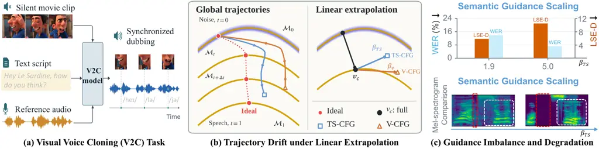
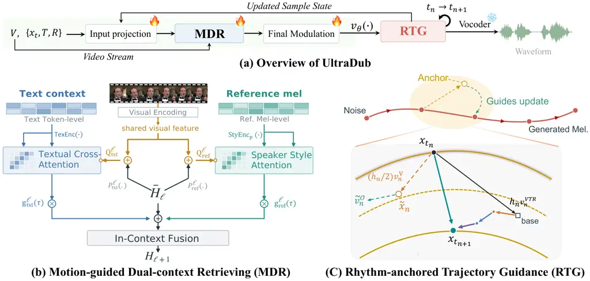
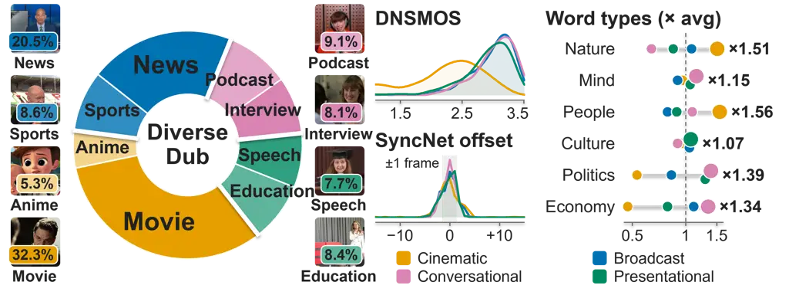
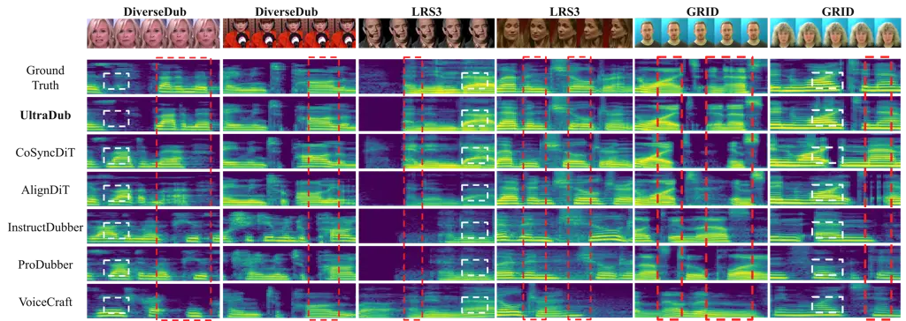
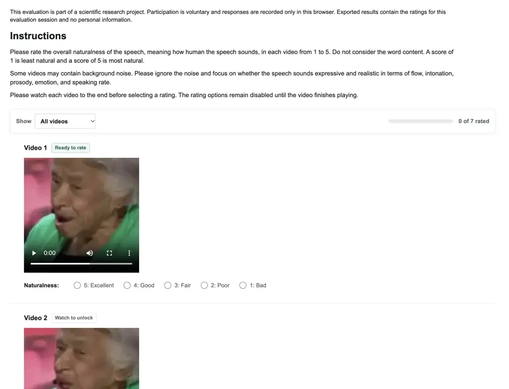

# UltraDub: Towards Authentic Dubbing by Unifying Visually-Steered Flow Learning and Trajectory Guidance

Gaoxiang Cong^(1,2)   Liang Li¹   Jianwei Wen^(1,2)
  Zhedong Zhang^(3,4)  
  Zheng-Jun Zha⁵   Qingming Huang²  
¹Institute of Computing Technology, Chinese Academy of Sciences
 ²University of Chinese Academy of Sciences  ³Hangzhou Dianzi University
 ⁴ ByteDance  ⁵University of Science and Technology of China

###### Abstract

Visual voice cloning requires intelligible, speaker-consistent speech
synchronized with visible articulation. However, sequential multimodal
conditioning can disrupt previously established temporal and speaker
cues, while imbalanced inference guidance can improve linguistic
accuracy at the expense of lip synchronization. In this paper, we
propose UltraDub, a Unifying Visually-Steered Flow learning and
trajectory Guidance Dubbing framework that leverages vision in two ways:
as continuous motion for multimodal context aggregation, and as
structural rhythm for trajectory rectification. Specifically, we
introduce the Motion-guided Dual-context Retrieving (MDR) module, which
continually recalibrates linguistic and speaker-style retrieval through
shared lip-motion query residuals, utilizing independent
time-conditioned gates to regulate their contributions. Furthermore, we
propose Rhythm-anchored Trajectory Guidance (RTG), a training-free
mechanism that evaluates hierarchical multimodal corrections at a
visual-only predictive midpoint, safely strengthening semantic
conditioning while better preserving temporal alignment. Finally, we
construct DiverseDub, a multi-scenario benchmark to evaluate video
dubbing in the wild. Extensive experiments demonstrate that UltraDub
achieves state-of-the-art performance across four datasets. Our project
page is available at:
[https://galaxycong.github.io/ultra](https://galaxycong.github.io/ultra)

|     |
| --- |
|     |

## 1 Introduction

Visual Voice Cloning (V2C) aims to generate high-fidelity speech for
characters in silent videos, jointly conditioned on a text script and
reference speech Chen et al. (2022a). As shown in Fig. 1(a), each
condition imposes distinct demands: the script specifies linguistic
content, the reference speech conveys speaker characteristics, and the
silent video defines articulation rhythm and pauses. Driven by these
capabilities, V2C demonstrates immense application potential in film
post-production and personalized AIGC. However, achieving authentic
dubbing is fundamentally more challenging than traditional
text-to-speech (TTS) tasks, as it requires models to synthesize
intelligible, expressive, and style-consistent speech without
sacrificing fine-grained audiovisual alignment.

Existing V2C methods primarily pursue two complementary directions:
expressive prosody modeling and acoustic pretraining. The former
translates hierarchical visual cues into expressive speech (_e.g._,
M2CI-Dubber Zhao et al. (2025) utilizes facial expressions and
HPMDubbing Cong et al. (2023) further leverages scene information to
extract emotion). However, these methods learn directly from movie
corpora and may suffer from poor data quality and background
interference Zhang et al. (2024), worsening clarity and Word Error Rate
(WER). The latter direction transfers pronunciation knowledge from clean
TTS corpora. For example, ProDubber Zhang et al. (2025b) and
InstructDubber Zhang et al. (2025a) use pretrained TTS models Li et al.
(2023) to improve clarity. However, they rely on duration predictors
coupled with these TTS architectures, which enforce rigid,
integer-quantized phoneme-to-frame assignments, ultimately degrading lip
synchronization and naturalness Jiang et al. (2025). Crucially, both
paradigms rely heavily on Montreal Forced Aligner (MFA) McAuliffe et al.
(2017), which is an external forced aligner used to predefine temporal
boundaries, inherently increasing pipeline complexity and error
propagation.

Recent V2C methods explore joint modeling of text, video, and reference
speech without explicit MFA supervision, through autoregressive codec
prediction Sung-Bin et al. (2025) or non-autoregressive flow matching.
By jointly refining acoustic frames rather than decoding them
autoregressively, flow-matching models support parallel sequence
generation and improve efficiency. For example, AlignDiT Choi et al.
(2025) combines conditional flow matching with auxiliary Connectionist
Temporal Classification (CTC) supervision to learn implicit multimodal
alignment. Recently, CoSyncDiT Cong et al. (2026) introduces a
progressive architecture to sequentially perform speaker adaptation,
visual calibration, and text alignment. However, sequential conditioning
forces each stage to rely heavily on the current evolving
representation, without ensuring that prior cues are preserved. As a
result, later semantic updates may gradually deviate from the visual
calibration and disrupt established speaker cues, exacerbating the risk
of cross-modal interference.



Figure 1: (a) Illustration of the V2C task. (b) Conventional CFG relies
on linear extrapolation from fully conditioned velocity ($`v_{c}`$) via
scaling factors $`\beta_{*}`$, making it prone to off-manifold
trajectory drift. (c) For the multi-conditional V2C task, existing
guidance easily triggers imbalance and degradation.

Beyond architectural design, inference poses another challenge for
flow-based dubbing methods, which typically rely on classifier-free
guidance (CFG). As illustrated in Fig. 1(b), CFG strengthens
conditioning through linear extrapolation Wang et al. (2026), adding
scaled residuals to the fully conditioned velocity. However, simply
amplifying one condition may compromise adherence to others, risking
off-manifold drift and artifacts. For example, Fig. 1(c) demonstrates
that imbalanced guidance improves clarity but sacrifices
synchronization, yielding a sharp surge in LSE-D ($`\downarrow`$) Chung
& Zisserman (2016). The accompanying mel-spectrograms corroborate this,
exhibiting temporal misalignment (red boxes) and spectral distortions
(white boxes). These observations reveal a key challenge of authentic
dubbing: gains in linguistic accuracy are rendered obsolete if the
speech falls out of sync with visual motion. Thus, effective guidance
must strengthen conditional adherence while preserving audiovisual
temporal alignment.

To achieve authentic dubbing, we propose UltraDub, a Unifying
Visually-Steered Flow learning and trajectory Guidance Dubbing framework
that naturally unifies the dual roles of vision to ensure high-fidelity
dubbing, deploying it as a continuous _motion_ to aggregate multimodal
context for velocity field estimation, and as a structural _rhythm_ to
rectify multimodal guidance along the generative trajectory.
Specifically, to govern multimodal conditioning during the flow learning
phase, we propose the Motion-guided Dual-context Retrieving (MDR)
module. As the hidden states evolve, MDR continually recalibrates
linguistic and speaker-style retrieval through shared lip-motion query
residuals and adaptively modulates their respective contributions via
independent time-conditioned gates. With the velocity field established
by MDR, we design Rhythm-anchored Trajectory Guidance (RTG), a
training-free mechanism devised to mitigate generative drift during
inference. It determines a visual-only predictive midpoint as a
structural rhythm anchor, where hierarchical multimodal corrections are
exclusively evaluated and safely injected into the fully conditioned
velocity. Furthermore, we construct DiverseDub, a challenging V2C
dubbing benchmark of 2,595 clips across eight diverse categories. Unlike
existing limited datasets, it facilitates robust evaluation by
incorporating unconstrained real-world scenarios with varied recording
environments and speaking styles.

Our main contributions are summarized as follows:

- •
  We propose UltraDub, a visually steered flow framework that unifies
  multimodal context retrieval and trajectory guidance for V2C. Its MDR
  module anchors linguistic and speaker-style retrieval to shared lip
  motion through independently gated context readouts.
- •
  We introduce Rhythm-anchored Trajectory Guidance (RTG), a
  training-free sampling strategy that evaluates hierarchical multimodal
  corrections at a visual-only predictive midpoint, incorporating visual
  rhythm into conditional guidance.
- •
  We construct DiverseDub, a challenging benchmark comprising 2,595
  clips across eight categories, extending V2C evaluation to
  unconstrained recording environments and diverse speaking styles.
- •
  Experiments on three public datasets and DiverseDub demonstrate
  state-of-the-art performance compared with existing methods.

## 2 Related Work

Visual Voice Cloning. Visual Voice Cloning (V2C) generates speech for a
target video given a script and reference speech, requiring linguistic
accuracy, speaker similarity, and lip synchronization to be satisfied
jointly Chen et al. (2022a). Earlier methods explicitly model visual
prosody and duration: HPMDubbing and StyleDubber associate lip motion
with phoneme timing, whereas ProDubber transfers acoustic knowledge from
clean TTS corpora Cong et al. (2023); Cong et al. (2024); Zhang et al.
(2025b). More recently, InstructDubber integrates multimodal large
language models to provide detailed duration descriptions. However, its
audiovisual alignment remains sub-optimal Zhang et al. (2025a). This is
because its synchronization heavily relies on forced boundaries or
predicted durations, allowing local timing errors to propagate into
pronunciation and lip synchronization. Recent methods replace explicit
alignment with joint generation: VoiceCraftDub predicts codec tokens
autoregressively, while AlignDiT and CoSyncDiT learn implicit alignment
with flow-based DiTs Sung-Bin et al. (2025); Choi et al. (2025); Cong
et al. (2026). Nevertheless, these flow-based approaches still struggle
with cross-modal interference and guidance imbalance. To overcome these
limitations, we propose UltraDub, which elegantly unifies the dual roles
of vision by employing Motion-guided Dual-context Retrieving (MDR) for
robust flow learning, and introducing Rhythm-anchored Trajectory
Guidance (RTG) to rectify generative drift during inference, achieving
authentic dubbing.

Classifier-Free Guidance for Flows. Classifier-free guidance (CFG)
strengthens conditional generation by extrapolating the velocity field
along the difference between conditional and unconditional
predictions Ho & Salimans (2022). In text-to-image diffusion, while this
improves prompt adherence, it can distort the sampled distribution and
introduce artifacts. Thus, CFG++ replaces unconstrained extrapolation
with manifold-aware guidance Chung et al. (2025). Flow models inherit
this sensitivity under deterministic ODE integration: CFG-Zero\*
suppresses unreliable early guidance, whereas Rectified-CFG++ anchors
conditional corrections to the learned transport path Fan et al. (2025);
Saini et al. (2025). However, these methods predominantly address a
single semantic condition. In contrast, V2C is more complex, coupling
linguistic content, speaker identity, and visual timing within a single
trajectory. Amplifying text-speaker guidance may improve pronunciation,
but it simultaneously alters the joint velocity governing phoneme
onsets, durations, and pauses Choi et al. (2025). Consequently,
subsequent residuals are prone to being evaluated along an altered,
drifted trajectory. In this work, we evaluate multimodal corrections at
a visual rhythm anchor, ensuring that semantic refinements remain bound
to the target temporal dynamics.

## 3 Method

### 3.1 Overview

Given a silent video $`V`$, a script $`T`$, and a reference audio clip
$`R`$, we learn a conditional velocity field
$`v_{\theta}(x_{t},t;\mathcal{C})`$, with $`\mathcal{C}=(V,T,R)`$, for
noise-to-speech generation. During training, for a clean mel sequence
$`x_{1}`$ and Gaussian noise $`x_{0}\sim\mathcal{N}(0,I)`$, the
intermediate state at flow time $`t\in[0,1]`$ is
$`x_{t}=(1-t)x_{0}+tx_{1}`$. Unlike previous methods, the proposed
UltraDub introduces two novel designs, Motion-guided Dual-context
Retrieving (MDR) and Rhythm-anchored Trajectory Guidance (RTG), as
illustrated in Fig. 2. First, the input projection initializes prior
representations from $`x_{t}`$, $`R`$, and $`T`$. Then, the proposed MDR
(Fig. 2(b)) absorbs the input prior and dynamic lip-motion features
extracted from $`V`$. Specifically, MDR enables the model to recalibrate
the content and speaker-style context retrieval to a shared visual
timeline while retaining independent control over each context’s
contribution by time-conditioned gates. Evolving through MDR, the output
result then undergoes final modulation to predict the target velocity.
RTG (Fig. 2(c)) guides multimodal corrections toward consistency with
the motion rhythm in a training-free manner. For an integration step of
size $`h_{n}=t_{n+1}-t_{n}`$ in flow time, RTG determines the
rhythm-related velocity by constructing an auxiliary midpoint anchor.
Multimodal corrections are evaluated at this rhythm anchor to adjust the
base transport direction defined by the fully conditioned velocity. The
resulting update is
$`x_{t_{n+1}}=\Phi_{\mathrm{RTG}}^{h_{n}}[v_{\theta}](x_{t_{n}},t_{n};\mathcal{C})`$,
where $`\Phi_{\mathrm{RTG}}^{h_{n}}[v_{\theta}]`$ denotes one RTG
integration step of size $`h_{n}`$ using the learned velocity network
$`v_{\theta}`$. Each updated state is fed back into the network until
$`t=1`$. Finally, the generated mel-spectrogram is extracted and decoded
into a waveform by a pretrained vocoder.

### 3.2 Input Projection without Early Visual Fusion

Unlike previous methods Choi et al. (2025); Cong et al. (2026) that fuse
visual features into the initial projection early, the input projection
takes only the current noisy state $`x_{t}`$, the reference audio $`R`$,
and the script $`T`$:

```math
p_{t}=\mathcal{F}_{\mathrm{in}}\left(\left[x_{t}\,\|\,\mathbf{B}\odot\operatorname{MelEnc}(R)\,\|\,\operatorname{TexEnc}(T;\langle\mathrm{pad}\rangle)\right]\right)\in\mathbb{R}^{L\times D}, \tag{1}
```

where $`\operatorname{MelEnc}(\cdot)`$ extracts the mel-spectrogram of
$`R`$, $`\mathbf{B}`$ is a binary mask that retains reference
frames Chen et al. (2025), and $`\odot`$ denotes element-wise
multiplication. The text encoder $`\operatorname{TexEnc}(\cdot)`$
comprises token embeddings and ConvNeXt V2 blocks Woo et al. (2023), and
uses the padding symbol $`\langle\mathrm{pad}\rangle`$ to extend the
text sequence to the mel-sequence length $`L`$. Here, $`\|`$ denotes
channel-wise concatenation, and $`\mathcal{F}_{\mathrm{in}}(\cdot)`$ is
a learnable input projection with convolutional positional encoding. The
resulting $`p_{t}`$ serves as the initial prior without visual features.



Figure 2: Overview of UltraDub, a Unifying Visually Steered Flow
learning and trajectory Guidance Dubbing framework. The visually steered
flow learning phase consists of an input projection, the core
Motion-guided Dual-context Retrieving (MDR) layers, and a final
modulation to predict the target velocity field $`v_{\theta}`$. With the
velocity field established, Rhythm-anchored Trajectory Guidance (RTG)
acts as a training-free inference mechanism. It constructs a visual-only
midpoint as a rhythm anchor to evaluate multimodal corrections,
continuously rectifying the base transport velocity.

### 3.3 Motion-guided Dual-context Retrieving

#### Visual Encoding.

To ensure a fair comparison, we adopt the same visual extractor pipeline
$`\operatorname{ViEnc}(\cdot)`$ Choi et al. (2025) with an
AV-HuBERT-based Shi et al. (2022) backbone to encode $`V`$:

```math
\mathbf{z}_{\mathrm{lip}}=(1-\mathbf{B})\odot\operatorname{Up}\bigl(\operatorname{ViEnc}(V)\bigr)\in\mathbb{R}^{L\times D}, \tag{2}
```

where $`\operatorname{Up}(\cdot)`$ comprises two transposed-convolution
upsampling layers followed by a Conformer encoder to model fine-grained
temporal dynamics, while $`1-\mathbf{B}`$ retains the target region. As
a result, $`\mathbf{z}_{\mathrm{lip}}`$ captures lip-motion patterns and
provides visual rhythmic cues for subsequent retrieval.

#### Dual-Memory Retrieval.

Rather than relying on early audiovisual fusion or staged progressive
conditioning, MDR establishes a stable dual-memory retrieval mechanism
that continually recalibrates linguistic content and speaker-style
context to align with shared visual timing as the DiT hidden states
evolve. Let the textual and speaker-style memories be
$`\mathbf{M}_{\mathrm{txt}}=\operatorname{TexEnc}(T)`$ and
$`\mathbf{M}_{\mathrm{ref}}=\operatorname{StyEnc}_{\mathrm{p}}(\mathbf{B}\odot\operatorname{MelEnc}(R))`$,
where $`\mathbf{M}_{\mathrm{txt}}`$ is obtained from the same text
encoder used for input projection but retains the text-token resolution.
To construct $`\mathbf{M}_{\mathrm{ref}}`$,
$`\operatorname{StyEnc}_{\mathrm{p}}(\cdot)`$ packs the valid reference
frames according to $`\mathbf{B}`$ and encodes them into a dedicated
speaker-style memory using two lightweight convolutional layers with
LayerNorm and SiLU activation. At layer $`\ell`$, let
$`\bar{\mathbf{H}}_{\ell}=\operatorname{AdaLN}_{\ell}(\mathbf{H}_{\ell},\bm{\tau})`$,
where $`\mathbf{H}_{0}`$=$`p_{t}`$ and $`\bm{\tau}`$ embeds the flow
time $`t`$. Two independently parameterized cross-attention branches
retrieve linguistic content and speaker-style cues. For
$`c\in\{\mathrm{txt},\mathrm{ref}\}`$,

```math
\mathbf{r}_{c}^{\ell}=\operatorname{MHAttn}_{c}^{\ell}\!\left(\mathbf{Q}_{c}^{\ell},\,\mathcal{K}_{c}^{\ell}(\mathbf{M}_{c}),\,\mathcal{V}_{c}^{\ell}(\mathbf{M}_{c})\right),\quad\mathbf{Q}_{c}^{\ell}=\mathcal{P}_{c}^{\ell}(\bar{\mathbf{H}}_{\ell})+\mathbf{z}_{\mathrm{lip}}, \tag{3}
```

where $`\mathcal{P}_{c}^{\ell}`$, $`\mathcal{K}_{c}^{\ell}`$, and
$`\mathcal{V}_{c}^{\ell}`$ are branch-specific learnable projections.
Crucially, both queries are driven by the shared visual residual,
enabling continuous recalibration of the two retrieval pathways as DiT
hidden states evolve, and the outputs are integrated through independent
time-conditioned gates
$`\mathbf{g}_{c}^{\ell}(\bm{\tau})\odot\mathbf{r}_{c}^{\ell}`$. Each
gate $`\mathbf{g}_{c}^{\ell}(\cdot)`$ is an independently parameterized,
zero-initialized affine projection of
$`\operatorname{SiLU}(\bm{\tau})`$. This couples content and style
retrieval to a common visual timeline while preserving separate control
over their contributions.

#### In-Context Fusion and Final Modulation.

The in-context fusion module consists of a bidirectional self-attention
and a feed-forward network, yielding contextually refined
representations for the next MDR layer. After the final MDR layer, the
final modulation module applies a linear projection with a time-adaptive
layer to predict the target velocity field.

### 3.4 Rhythm-anchored Trajectory Guidance

In V2C, the conditioning modalities impose distinct demands: text
specifies linguistic content, reference speech conveys voice
characteristics, and video provides the timing. However, stronger
content or voice conditioning does not necessarily preserve visual
rhythm. Instead of normal extrapolation, RTG addresses this tension by
introducing rhythm anchoring and hierarchical multimodal corrections
during training-free sampling.

#### Rhythm Anchor.

Let $`\mathcal{O}\in\{\emptyset,V,VT,VTR\}`$ index the retained
conditions, with $`VTR`$ denoting full conditioning $`\mathcal{C}`$, and
define $`v_{n}^{\mathcal{O}}:=v_{\theta}(x_{t_{n}},t_{n};\mathcal{O})`$;
in RTG, $`v_{n}^{V}`$ places the auxiliary anchor, whereas
$`v_{n}^{VTR}`$ supplies the base transport direction. For an
integration step $`h_{n}:=t_{n+1}-t_{n}>0`$, we evaluate guidance at a
predicted midpoint Saini et al. (2025), with its location determined
specifically by the visual-only field:

```math
t_{n}^{m}:=t_{n}+\frac{h_{n}}{2},\qquad\widetilde{x}_{n}\leftarrow x_{t_{n}}+\frac{h_{n}}{2}v_{n}^{V}, \tag{4}
```

where text and reference audio inputs are dropped for this prediction,
so explicit content and voice guidance do not determine the anchor
displacement. The resulting half-step provides a visually directed
look-ahead state at which multimodal refinement is assessed, making
target motion the reference for subsequent corrections.

#### Hierarchical Multimodal Corrections.

At the anchor, we re-evaluate the same network under each condition
configuration:

```math
\widetilde{v}_{n}^{\mathcal{O}}\leftarrow v_{\theta}(\widetilde{x}_{n},t_{n}^{m};\mathcal{O}). \tag{5}
```

We organize these predictions into the hierarchy
$`\emptyset\rightarrow V\rightarrow VT\rightarrow VTR`$: visual
conditioning establishes the initial contrast, text refines content
given vision, and reference acoustics further refine voice given both
vision and text. This ordering makes content guidance vision-conditioned
and voice guidance content-aware, rather than treating the modalities as
independent corrections:

```math
\Delta_{n}^{V}:=\widetilde{v}_{n}^{V}-\widetilde{v}_{n}^{\emptyset},\quad\Delta_{n}^{T}:=\widetilde{v}_{n}^{VT}-\widetilde{v}_{n}^{V},\quad\Delta_{n}^{R}:=\widetilde{v}_{n}^{VTR}-\widetilde{v}_{n}^{VT}. \tag{6}
```

Evaluating all three contrasts at the same visual anchor provides a
common rhythm reference while allowing their strengths to be controlled
separately.

#### Guided Flow Update.

RTG combines the current fully conditioned velocity with the above
anchored corrections to introduce rhythm guidance:

```math
\widehat{v}_{n}\leftarrow v_{n}^{VTR}+\alpha(t_{n})\left(s_{V}\Delta_{n}^{V}+s_{T}\Delta_{n}^{T}+s_{R}\Delta_{n}^{R}\right), \tag{7}
```

where $`s_{V},s_{T},s_{R}`$ scale the conditional increments, and
$`\alpha(t_{n})=\lambda_{\max}t_{n}^{\gamma}`$ with
$`\lambda_{\max},\gamma\geq 0`$; for $`\gamma=0`$,
$`\alpha(t_{n})=\lambda_{\max}`$ throughout. The complete
prediction–correction procedure defines the one-step RTG integration
operator:

```math
\Phi_{\mathrm{RTG}}^{h_{n}}[v_{\theta}](x_{t_{n}},t_{n};\mathcal{C}):=x_{t_{n}}+h_{n}\widehat{v}_{n}. \tag{8}
```

This operator advances the acoustic state by $`h_{n}`$ in flow time
using the learned velocity network $`v_{\theta}`$. Starting from
$`x_{0}\sim\mathcal{N}(0,I)`$, we repeatedly apply
$`x_{t_{n+1}}\leftarrow\Phi_{\mathrm{RTG}}^{h_{n}}[v_{\theta}](x_{t_{n}},t_{n};\mathcal{C})`$
until $`t=1`$. The generated target mel is then extracted and decoded
into speech by a fixed pretrained vocoder.

## 4 DiverseDub Benchmark



Figure 3: Statistical overview of DiverseDub. (a) Left: distribution of
clips over the eight dubbing categories, with a representative frame for
each category. (b) Middle top: per-domain distributions of clip-level
DNSMOS quality. (c) Middle bottom: per-domain distributions of SyncNet
audiovisual offsets. (d) Right: relative frequency of word types among
the nouns and adjectives of each domain, normalized by the corpus
average.

To support a comprehensive evaluation under authentic dubbing
conditions, we construct DiverseDub, an English video dubbing benchmark
comprising 2,595 single-shot clips (4.79 h) across eight dubbing
categories. In contrast to existing benchmarks dominated by a particular
source domain or production format, DiverseDub covers diverse speaking
styles, visual compositions, recording environments, and editorial
contexts. Fig. 3 summarizes the benchmark from four complementary
perspectives: the category distribution characterizes its scenario
coverage, the clip-level DNSMOS distributions describe the speech
quality, the SyncNet offset distributions describe the synchronization
of the retained samples, and the word-type distribution reflects its
lexical diversity. Further details regarding DiverseDub will be provided
in the Appendix.

## 5 Experiments

Datasets. We evaluate our framework on three public datasets and our
newly introduced real-world benchmark, DiverseDub. LRS3 Afouras et al.
(2018) contains TED and TEDx speech, with approximately 119,000
utterances from 5,090 speakers in its pretraining split. For evaluation,
we use the LRS3-Cross test set, following the official split of
AlignDiT Choi et al. (2025). GRID Cooke et al. (2006) contains
laboratory recordings with frontal faces and a constrained vocabulary.
The test set comprises 3,283 samples. CelebV-Dub Sung-Bin et al. (2025)
is a recently released public dataset for dubbing. However, its
evaluation capacity is highly limited in scale and diversity. We
evaluate on 213 samples from the CelebV-Dub test set. DiverseDub extends
the evaluation scope to diverse, unconstrained real-world scenarios to
assess generalization beyond existing benchmarks (Sec. 4). Across all
evaluations, we adhere to the cross-utterance (_i.e._, Setting2)
protocol: the reference audio is always sourced from a different
utterance of the target speaker. This rigorous setting prevents
information leakage and maximally tests the model’s robustness for
authentic dubbing.

| Method          | WER (%) $`\downarrow`$ | SPKSIM (%) $`\uparrow`$ | EmoSIM (%) $`\uparrow`$ | LSE-C $`\uparrow`$ | LSE-D $`\downarrow`$ |
| --------------- | ---------------------- | ----------------------- | ----------------------- | ------------------ | -------------------- |
| GT              | 1.07                   | 69.92                   | 100.00                  | 6.64               | 7.83                 |
| ProDubber       | 13.86                  | 25.17                   | 69.29                   | 2.40               | 11.87                |
| VoiceCraftDub   | 84.68                  | 41.26                   | 72.90                   | 4.89               | 9.60                 |
| AlignDiT        | 20.61                  | 49.78                   | 80.09                   | 6.33               | 8.15                 |
| InstructDubber  | 8.38                   | 23.87                   | 67.72                   | 1.85               | 12.47                |
| CoSyncDiT       | 12.01                  | 56.32                   | 81.72                   | 6.88               | 7.86                 |
| UltraDub (Ours) | 9.60                   | 61.15                   | 82.93                   | 7.13               | 7.56                 |

Table 1: Results on the DiverseDub benchmark. Arrows indicate the
preferred direction; the best result among dubbing methods is shown in
bold.

Implementation Details. UltraDub operates on mel-spectrograms extracted
from 16-kHz audio and visual features from 25 FPS video streams. The
noisy state, masked reference mel, and 512-dimensional padded text
features form a 712-channel input that is projected to width 1024
without visual fusion. Four ConvNeXt V2 blocks produce the
512-dimensional text memory, while two kernel-3
convolution-LayerNorm-SiLU blocks encode packed reference frames into a
256-dimensional memory. Each MDR layer performs two parallel 16-head
cross-attention reads (64 dimensions per head) from the text and
reference memories. In both branches, the shared lip-motion residuals
guide the branch-specific query projections, while keys, values, and
attention normalization remain separate. The retrieved features are
integrated through the layer’s two 1024-dimensional time-conditioned
gates, followed by self-attention and an FFN. Training masks 70–100% of
valid mel frames. With 32 integration steps and a sway coefficient of
$`-1`$, the flow-time nodes are $`t_{n}=1-\cos(\pi n/64)`$,
$`n=0,\ldots,32`$. The rhythm anchor velocity constructs the midpoint
state $`\widetilde{x}_{n}=x_{t_{n}}+\frac{h_{n}}{2}v_{n}^{V}`$, while
the fully conditioned $`v_{n}^{VTR}`$ supplies the base velocity. At
$`t_{n}^{m}=(t_{n}+t_{n+1})/2`$, four condition branches are evaluated
at this rhythm anchor to obtain $`\Delta_{n}^{V}`$, $`\Delta_{n}^{T}`$,
and $`\Delta_{n}^{R}`$. We set
$`\alpha(t_{n})=\lambda_{\max}t_{n}^{\gamma}`$ with
$`(\lambda_{\max},\gamma)=(1,0)`$; hence the common multiplier is one at
every step, while the three corrections retain their distinct scales.

Baselines. We compare our method against five recent strong baselines:
ProDubber Zhang et al. (2025b) (CVPR’25), VoiceCraftDub Sung-Bin et al.
(2025) (ICCV’25), AlignDiT Choi et al. (2025) (MM’25),
InstructDubber Zhang et al. (2025a) (AAAI’26), and CoSyncDiT Cong et al.
(2026) (ECCV’26). To ensure a fair comparison, we use the official
implementations of all baseline methods. Additional details are provided
in Appendix A.1.

| Method          | WER (%) $`\downarrow`$ | SPKSIM (%) $`\uparrow`$ | EmoSIM (%) $`\uparrow`$ | LSE-C $`\uparrow`$ | LSE-D $`\downarrow`$ |
| --------------- | ---------------------- | ----------------------- | ----------------------- | ------------------ | -------------------- |
| GT              | 4.15                   | 66.13                   | 100.00                  | 6.88               | 7.39                 |
| ProDubber       | 9.71                   | 22.32                   | 65.97                   | 2.44               | 11.94                |
| VoiceCraftDub   | 41.19                  | 34.65                   | 72.89                   | 5.46               | 8.83                 |
| AlignDiT        | 25.86                  | 46.25                   | 74.89                   | 6.29               | 8.01                 |
| InstructDubber  | 6.47                   | 24.82                   | 72.43                   | 2.43               | 11.96                |
| CoSyncDiT       | 12.52                  | 49.05                   | 78.93                   | 6.86               | 7.56                 |
| UltraDub (Ours) | 9.21                   | 56.91                   | 80.91                   | 7.38               | 7.09                 |

Table 2: Results on the CelebV-Dub benchmark. Arrows indicate the
preferred direction; the best result among dubbing methods is shown in
bold.

Metrics. We evaluate content accuracy via Word Error Rate
(WER$`\downarrow`$) Radford et al. (2023), speaker identity via Speaker
Embedding Similarity (SPKSIM$`\uparrow`$) Chen et al. (2022b), emotional
consistency via Emotion Embedding Similarity (EmoSIM$`\uparrow`$) Ma
et al. (2024), and lip synchronization via SyncNet Chung & Zisserman
(2016) confidence (LSE-C$`\uparrow`$) and distance
(LSE-D$`\downarrow`$).

Results on the DiverseDub Benchmark. As shown in Tab. 1, UltraDub
achieves a strong balance across all evaluation metrics on the
unconstrained DiverseDub benchmark. While InstructDubber obtains the
lowest WER of 8.38%, it exhibits notable trade-offs in speaker
similarity and synchronization, with an SPKSIM of 23.87% and an LSE-D of
12.47. In contrast, UltraDub maintains competitive intelligibility with
a WER of 9.60%, alongside stronger identity preservation and lip
synchronization. Furthermore, compared with CoSyncDiT’s sequential
conditioning, UltraDub improves SPKSIM from 56.32% to 61.15% and EmoSIM
from 81.72% to 82.93%. These gains are consistent with MDR’s design of
coordinating linguistic and speaker-style retrieval through shared
visual cues. UltraDub also achieves the best synchronization, with an
LSE-C of 7.13 and an LSE-D of 7.56, supporting the use of visual timing
to organize both context retrieval and RTG-based trajectory correction.

Category-wise Robustness on DiverseDub. To further assess performance
across production formats, we examine four distinct categories in
Fig. 4. In movies and animation, UltraDub demonstrates superior
synchronization, achieving an LSE-C of 6.886 and an LSE-D of 8.116,
respectively, outperforming the displayed baselines, including the
MFA-dependent ProDubber. For news, UltraDub achieves an SPKSIM of 69.8%,
surpassing CoSyncDiT’s 64.7% and InstructDubber’s 27.6%. For podcasts,
it achieves the lowest WER among the displayed methods at 6.67%,
compared with 15.45% for AlignDiT and 9.54% for CoSyncDiT. These
category-level results demonstrate UltraDub’s strengths in
synchronization, speaker preservation, and intelligibility across
diverse dubbing scenarios.

Figure 4: Category-wise comparisons on DiverseDub. Error bars indicate
95% confidence intervals.

| Methods         | WER (%) $`\downarrow`$ | SPKSIM (%) $`\uparrow`$ | LSE-C $`\uparrow`$ | LSE-D $`\downarrow`$ |
| --------------- | ---------------------- | ----------------------- | ------------------ | -------------------- |
| GT              | 2.33                   | 56.18                   | 7.80               | 6.85                 |
| ProDubber       | 3.41                   | 24.27                   | 4.27               | 10.12                |
| VoiceCraftDub   | 14.85                  | 35.17                   | 6.49               | 8.08                 |
| AlignDiT        | 1.40                   | 51.46                   | 7.91               | 6.78                 |
| InstructDubber  | 2.39                   | 24.16                   | 3.29               | 11.12                |
| CoSyncDiT       | 2.09                   | 47.53                   | 7.83               | 6.88                 |
| UltraDub (Ours) | 1.37                   | 52.05                   | 8.23               | 6.50                 |

Table 3: Comparison with dubbing methods on the LRS3 benchmark. Best
results among dubbing methods are shown in bold.

Results on the CelebV-Dub Benchmark. As shown in Tab. 2, our method
achieves the best speaker similarity, emotion similarity, and lip
synchronization among the compared dubbing methods. Compared with
CoSyncDiT, it increases SPKSIM from 49.05% to 56.91% and EmoSIM from
78.93% to 80.91%, while improving LSE-C from 6.86 to 7.38, reducing
LSE-D from 7.56 to 7.09, and lowering WER from 12.52% to 9.21%. Although
InstructDubber yields lower WER, its substantially weaker lip
synchronization underscores the need to coordinate linguistic accuracy
with visual timing. These results support UltraDub’s visually steered
design, which anchors context retrieval and trajectory correction to lip
motion, jointly improving alignment and voice fidelity while retaining
competitive intelligibility.

Results on the LRS3 Benchmark. As shown in Tab. 3, UltraDub achieves
state-of-the-art performance across all four evaluated metrics among the
compared dubbing methods. Compared with AlignDiT, the strongest baseline
on all metrics, UltraDub reduces WER from 1.40% to 1.37% and improves
SPKSIM from 51.46% to 52.05%. The gains are more pronounced in
synchronization: LSE-C increases from 7.91 to 8.23, while LSE-D
decreases from 6.78 to 6.50. These results show that UltraDub improves
audiovisual alignment alongside linguistic accuracy and speaker
similarity, supporting our approach of using visual motion to coordinate
multimodal retrieval and guide the rhythm-anchored trajectory.

Results on the GRID Benchmark. As shown in Tab. 4, UltraDub outperforms
all compared dubbing methods across the four metrics. It achieves a WER
of 14.53%, approaching the 13.14% measured on ground-truth speech, and
the highest SPKSIM of 58.01%. UltraDub also achieves the best
synchronization, with an LSE-C of 7.60 and an LSE-D of 6.44,
demonstrating joint improvements in intelligibility, speaker
preservation, and audiovisual alignment.

Figure 5: Preserving audiovisual alignment under increasing guidance
strength on the LRS3 test set. AVSync is a recently introduced metric
that provides a more reliable assessment of audiovisual
synchronization Choi et al. (2025).

| Methods         | WER (%) $`\downarrow`$ | SPKSIM (%) $`\uparrow`$ | LSE-C $`\uparrow`$ | LSE-D $`\downarrow`$ |
| --------------- | ---------------------- | ----------------------- | ------------------ | -------------------- |
| GT              | 13.14                  | 63.69                   | 7.14               | 6.84                 |
| ProDubber       | 44.29                  | 34.91                   | 3.71               | 11.08                |
| VoiceCraftDub   | 64.47                  | 33.37                   | 5.13               | 8.50                 |
| AlignDiT        | 19.47                  | 55.06                   | 7.17               | 6.84                 |
| InstructDubber  | 27.67                  | 36.30                   | 3.33               | 11.32                |
| CoSyncDiT       | 19.64                  | 53.45                   | 7.21               | 6.86                 |
| UltraDub (Ours) | 14.53                  | 58.01                   | 7.60               | 6.44                 |

Table 4: Comparison with dubbing methods on the GRID benchmark. EmoSIM
is not evaluated because GRID consists primarily of neutral emotion.

#### Robustness to guidance strength.

Fig. 5 examines linguistic accuracy and audiovisual synchronization as
the scale increases. We use the conventional guidance strategy adopted
in the official AlignDiT implementation Choi et al. (2025) as the
baseline. Besides, we report AVSync Choi et al. (2025), which measures
the cosine similarity between AV-HuBERT features of the same video
paired with synthesized and ground-truth speech; higher scores indicate
better synchronization. Increasing the scale from 1 to 5 reduces
UltraDub’s WER from 4.65% to 1.48% while improving AVSync from 0.7414 to
0.7565. By contrast, the baseline exhibits greater WER fluctuations, and
its AVSync declines after peaking near scale 2. Although both methods
show decreasing LSE-C and increasing LSE-D, UltraDub degrades more
gradually and consistently outperforms the baseline on both metrics. At
scale 5, UltraDub yields only slightly higher WER, 1.48% versus 1.38%,
while achieving better AVSync, 0.7565 versus 0.7439, higher LSE-C, 8.277
versus 7.838, and lower LSE-D, 6.513 versus 6.785. These results support
the rationale behind rhythm-anchored guidance: evaluating multimodal
corrections at a shared visual anchor helps accommodate stronger text
conditioning while limiting synchronization degradation.

## 6 Conclusion

In this paper, we propose UltraDub to coordinate multimodal context
retrieval through MDR and anchor training-free trajectory guidance
through RTG. Together, these components establish visual timing as a
shared reference for flow learning and sampling. We also introduce
DiverseDub, a benchmark spanning eight categories for evaluating dubbing
in unconstrained real-world scenarios. Experiments on four benchmarks
demonstrate improvements in intelligibility, speaker preservation, and
lip synchronization. Further analysis shows that UltraDub limits
alignment degradation under stronger guidance, supporting more balanced
multimodal conditioning during synthesis.

## References

- Afouras et al. (2018) Triantafyllos Afouras, Joon Son Chung, and
  Andrew Zisserman. LRS3-TED: a large-scale dataset for visual speech
  recognition. _CoRR_, abs/1809.00496, 2018.
- Castellano (2026) Brandon Castellano. PySceneDetect: Video cut
  detection and analysis tool.
  [https://github.com/Breakthrough/PySceneDetect](https://github.com/Breakthrough/PySceneDetect), 2026.
  Version 0.7.1.
- Chen et al. (2022a) Qi Chen, Mingkui Tan, Yuankai Qi, Jiaqiu Zhou,
  Yuanqing Li, and Qi Wu. V2C: visual voice cloning. In _CVPR_, pp.
  21210–21219, 2022a.
- Chen et al. (2022b) Sanyuan Chen, Chengyi Wang, Zhengyang Chen, Yu Wu,
  Shujie Liu, Zhuo Chen, Jinyu Li, Naoyuki Kanda, Takuya Yoshioka, Xiong
  Xiao, Jian Wu, Long Zhou, Shuo Ren, Yanmin Qian, Yao Qian, Jian Wu,
  Michael Zeng, Xiangzhan Yu, and Furu Wei. Wavlm: Large-scale
  self-supervised pre-training for full stack speech processing.
  _IEEE J. Sel. Top. Signal Process._, 16(6):1505–1518, 2022b.
- Chen et al. (2025) Yushen Chen, Zhikang Niu, Ziyang Ma, Keqi Deng,
  Chunhui Wang, Jian Zhao, Kai Yu, and Xie Chen. F5-TTS: A fairytaler
  that fakes fluent and faithful speech with flow matching. In
  _Proceedings of the 63rd Annual Meeting of the Association for
  Computational Linguistics (Volume 1: Long Papers)_, pp. 6255–6271,
  Vienna, Austria, 2025. Association for Computational Linguistics. doi:
  10.18653/v1/2025.acl-long.313.
- Choi et al. (2025) Jeongsoo Choi, Ji-Hoon Kim, Kim Sung-Bin, Tae-Hyun
  Oh, and Joon Son Chung. Aligndit: Multimodal aligned diffusion
  transformer for synchronized speech generation. In _ACM MM_, pp.
  10758–10767, 2025.
- Chung et al. (2025) Hyungjin Chung, Jeongsol Kim, Geon Yeong Park,
  Hyelin Nam, and Jong Chul Ye. Cfg++: Manifold-constrained classifier
  free guidance for diffusion models. In _ICLR_, volume 2025, pp.
  30824–30850, 2025.
- Chung & Zisserman (2016) Joon Son Chung and Andrew Zisserman. Out of
  time: Automated lip sync in the wild. In _ACCV 2016 Workshops_, pp.
  251–263, 2016.
- Cong et al. (2023) Gaoxiang Cong, Liang Li, Yuankai Qi, Zheng-Jun Zha,
  Qi Wu, Wenyu Wang, Bin Jiang, Ming-Hsuan Yang, and Qingming Huang.
  Learning to dub movies via hierarchical prosody models. In _CVPR_, pp.
  14687–14697, 2023.
- Cong et al. (2024) Gaoxiang Cong, Yuankai Qi, Liang Li, Amin Beheshti,
  Zhedong Zhang, Anton van den Hengel, Ming-Hsuan Yang, Chenggang Yan,
  and Qingming Huang. Styledubber: Towards multi-scale style learning
  for movie dubbing. _arXiv preprint arXiv:2402.12636_, 2024.
- Cong et al. (2026) Gaoxiang Cong, Liang Li, Jiaxin Ye, Zhedong Zhang,
  Hongming Shan, Yuankai Qi, and Qingming Huang. Cosyncdit: Cognitive
  synchronous diffusion transformer for movie dubbing. _arXiv preprint
  arXiv:2604.12292_, 2026.
- Cooke et al. (2006) Martin Cooke, Jon Barker, Stuart Cunningham, and
  Xu Shao. An audio-visual corpus for speech perception and automatic
  speech recognition. _The Journal of the Acoustical Society of
  America_, 120(5):2421–2424, 2006.
- Fan et al. (2025) Weichen Fan, Amber Yijia Zheng, Raymond A Yeh, and
  Ziwei Liu. Cfg-zero\*: Improved classifier-free guidance for flow
  matching models. _arXiv preprint arXiv:2503.18886_, 2025.
- Ho & Salimans (2022) Jonathan Ho and Tim Salimans. Classifier-free
  diffusion guidance. _arXiv preprint arXiv:2207.12598_, 2022.
- Jiang et al. (2025) Ziyue Jiang, Yi Ren, Ruiqi Li, Shengpeng Ji,
  Boyang Zhang, Zhenhui Ye, Chen Zhang, Bai Jionghao, Xiaoda Yang,
  Jialong Zuo, et al. Megatts 3: Sparse alignment enhanced latent
  diffusion transformer for zero-shot speech synthesis. _arXiv preprint
  arXiv:2502.18924_, 2025.
- Li et al. (2023) Yinghao Aaron Li, Cong Han, Vinay S. Raghavan, Gavin
  Mischler, and Nima Mesgarani. Styletts 2: Towards human-level
  text-to-speech through style diffusion and adversarial training with
  large speech language models. In _NeurIPS_, 2023.
- Ma et al. (2024) Ziyang Ma, Zhisheng Zheng, Jiaxin Ye, Jinchao Li,
  Zhifu Gao, Shiliang Zhang, and Xie Chen. emotion2vec: Self-supervised
  pre-training for speech emotion representation. In _Findings of ACL_,
  pp. 15747–15760, 2024.
- McAuliffe et al. (2017) Michael McAuliffe, Michaela Socolof, Sarah
  Mihuc, Michael Wagner, and Morgan Sonderegger. Montreal forced
  aligner: Trainable text-speech alignment using kaldi. In
  _Interspeech_, pp. 498–502, 2017.
- Radford et al. (2023) Alec Radford, Jong Wook Kim, Tao Xu, Greg
  Brockman, Christine McLeavey, and Ilya Sutskever. Robust speech
  recognition via large-scale weak supervision. In _ICML_, pp.
  28492–28518, 2023.
- Rayson et al. (2004) Paul Rayson, Dawn Archer, Scott Piao, and Tony
  McEnery. The UCREL semantic analysis system. In _Proceedings of the
  Workshop on Beyond Named Entity Recognition: Semantic Labelling for
  NLP Tasks (LREC)_, pp. 7–12, 2004.
- Reddy et al. (2021) Chandan KA Reddy, Vishak Gopal, and Ross Cutler.
  Dnsmos: A non-intrusive perceptual objective speech quality metric to
  evaluate noise suppressors. In _ICASSP_, pp. 6493–6497. IEEE, 2021.
- Saini et al. (2025) Shreshth Saini, Shashank Gupta, and Alan Bovik.
  Rectified CFG++ for flow based models. In _NeurIPS_, pp.
  149034–149074, 2025.
- Shi et al. (2022) Bowen Shi, Wei-Ning Hsu, Kushal Lakhotia, and
  Abdelrahman Mohamed. Learning audio-visual speech representation by
  masked multimodal cluster prediction. In _ICLR_, 2022.
- Sung-Bin et al. (2025) Kim Sung-Bin, Jeongsoo Choi, Puyuan Peng,
  Joon Son Chung, Tae-Hyun Oh, and David Harwath. Voicecraft-dub:
  Automated video dubbing with neural codec language models. _arXiv
  preprint arXiv:2504.02386_, 2025.
- Tao et al. (2021) Ruijie Tao, Zexu Pan, Rohan Kumar Das, Xinyuan Qian,
  Mike Zheng Shou, and Haizhou Li. Is someone speaking? exploring
  long-term temporal features for audio-visual active speaker detection.
  In _Proceedings of the 29th ACM International Conference on
  Multimedia_, pp. 3927–3935, 2021.
- Wang et al. (2026) Hanyang Wang, Yiyang Liu, Jiawei Chi, Fangfu Liu,
  Ran Xue, and Yueqi Duan. Cfg-ctrl: Control-based classifier-free
  diffusion guidance. _arXiv preprint arXiv:2603.03281_, 2026.
- Woo et al. (2023) Sanghyun Woo, Shoubhik Debnath, Ronghang Hu, Xinlei
  Chen, Zhuang Liu, In So Kweon, and Saining Xie. Convnext v2:
  Co-designing and scaling convnets with masked autoencoders. In _CVPR_,
  pp. 16133–16142, 2023.
- Zhang et al. (2024) Zhedong Zhang, Liang Li, Gaoxiang Cong, YIN
  Haibing, Yuhan Gao, Chenggang Yan, Anton van den Hengel, and Yuankai
  Qi. From speaker to dubber: Movie dubbing with prosody and duration
  consistency learning. In _ACM MM_, 2024.
- Zhang et al. (2025a) Zhedong Zhang, Liang Li, Gaoxiang Cong, Chunshan
  Liu, Yuhan Gao, Xiaowan Wang, Tao Gu, and Yuankai Qi. Instructdubber:
  Instruction-based alignment for zero-shot movie dubbing. _arXiv
  preprint arXiv:2512.17154_, 2025a.
- Zhang et al. (2025b) Zhedong Zhang, Liang Li, Chenggang Yan, Chunshan
  Liu, Anton van den Hengel, and Yuankai Qi. Prosody-enhanced acoustic
  pre-training and acoustic-disentangled prosody adapting for movie
  dubbing. _arXiv preprint arXiv:2503.12042_, 2025b.
- Zhao et al. (2025) Yuan Zhao, Rui Liu, and Gaoxiang Cong. Towards
  expressive video dubbing with multiscale multimodal context
  interaction. In _ICASSP_, pp. 1–5, 2025.

## Appendix A Appendix

This appendix provides additional methodological, benchmark, and
experimental details that complement the main paper. It includes:

- •
  Training and Evaluation Protocol Appendix A.1 describes the training
  setting and zero-shot evaluation protocol.
- •
  Additional Details of RTG Appendix A.2 presents the complete sampling
  procedure and additional analysis of RTG.
- •
  Details of the Training Objective: Appendix A.3 describes the training
  loss details.
- •
  Benchmark Details and Construction Appendix A.4 describes the data
  sources, processing pipeline, category organization, transcription
  procedure, and quality-control criteria of DiverseDub.
- •
  Mel-Spectrogram Comparisons Appendix A.5 provides qualitative
  comparisons of temporal alignment and local acoustic details across
  different methods.
- •
  More Category-Wise Results on DiverseDub Appendix A.6 presents
  detailed evaluations across the eight real-world categories included
  in DiverseDub.
- •
  Ablation on Flow Guidance Strategies Appendix A.7 compares RTG with
  conventional classifier-free guidance under increasing text-guidance
  strengths.
- •
  Ablation on UltraDub Components Appendix A.8 analyzes the individual
  contributions of MDR, its dual-memory design, and RTG.
- •
  Additional AVSync Results Appendix A.9 provides supplementary
  evaluations of audiovisual consistency.
- •
  Subjective MOS Evaluation Appendix A.10 reports human evaluations of
  speech naturalness and speaker similarity.
- •
  Limitations and Social Impact Appendix A.11 discusses potential
  applications, misuse risks, and considerations for responsible
  deployment.

### A.1 Training and Evaluation Protocol

AlignDiT is a strong existing baseline whose official training protocol
uses LRS3. We directly use its best-performing official LRS3
checkpoint¹¹ 1
[https://github.com/kaistmm/AlignDiT](https://github.com/kaistmm/AlignDiT),
without retraining it or adapting it to any target domain. Following
this setup, we train UltraDub and other competing methods on the LRS3 to
ensure a fair comparison. The large scale of LRS3 provides sufficient
training data for a reliable comparison across methods, while
CelebV-Dub, GRID, and DiverseDub are reserved for zero-shot evaluation.
No samples from these three datasets are used for training or
dataset-specific fine-tuning. At inference time, we evaluate all methods
on the LRS3 test set and directly apply them to the CelebV-Dub and GRID
test sets, as well as our proposed DiverseDub benchmark. The results on
CelebV-Dub, GRID, and DiverseDub therefore measure zero-shot
cross-dataset generalization beyond LRS3.

### A.2 Additional Details of Rhythm-anchored Trajectory Guidance

RTG separates two decisions in multimodal sampling: _where_ to evaluate
conditional refinements and _how strongly_ to apply each refinement. It
evaluates multimodal corrections at a visual rhythm anchor. We present
the complete sampling procedure in Algorithm 1 and provide further
analysis of RTG below, using the notation from the main paper
throughout.

Algorithm 1 expands $`\Phi_{\mathrm{RTG}}^{h_{n}}[v_{\theta}]`$ into a
complete noise-to-speech sampling procedure from $`t=0`$ to $`t=1`$.
Here $`\operatorname{EvalBranches}(x,t;\mathcal{C})`$ evaluates the same
network in the order $`(VTR,VT,V,\emptyset)`$ in one packed call. The
$`VT`$ branch drops reference acoustics, the $`V`$ branch additionally
drops text, and the unconditional branch drops all three modalities.
Following the main paper, for $`\mathcal{O}\in\{\emptyset,V,VT,VTR\}`$,
write $`v_{n}^{\mathcal{O}}:=v_{\theta}(x_{t_{n}},t_{n};\mathcal{O})`$
for the current-state prediction. The corresponding predictions at the
rhythm anchor are

```math
\widetilde{v}_{n}^{\mathcal{O}}\leftarrow v_{\theta}(\widetilde{x}_{n},t_{n}^{m};\mathcal{O}). \tag{9}
```

Line 9 evaluates these four predictions in one packed call. Their
differences in lines 10–12 follow the hierarchy
$`\emptyset\rightarrow V\rightarrow VT\rightarrow VTR`$:
$`\Delta_{n}^{V}`$ adds vision, $`\Delta_{n}^{T}`$ adds text given
vision, and $`\Delta_{n}^{R}`$ adds reference acoustics given vision and
text.

1: Trained $`v_{\theta}`$; $`\mathcal{C}=(V,T,R)`$; reference mask
$`\mathbf{B}`$ and valid-frame masks;

2:    grid $`0=t_{0}<\cdots<t_{N}=1`$; scales $`s_{V},s_{T},s_{R}`$;

3:    $`\lambda_{\max},\gamma\geq 0`$; fixed vocoder $`\mathcal{D}`$

4: Sample $`x_{0}\sim\mathcal{N}(0,I)`$ on valid mel frames; set padding
to zero

5: for $`n=0,\ldots,N-1`$ do

6:   $`h_{n}\leftarrow t_{n+1}-t_{n}`$;
$`t_{n}^{m}\leftarrow t_{n}+h_{n}/2`$

7:
  $`(v_{n}^{VTR},v_{n}^{VT},v_{n}^{V},v_{n}^{\emptyset})\leftarrow\operatorname{EvalBranches}(x_{t_{n}},t_{n};\mathcal{C})`$

8:   $`\widetilde{x}_{n}\leftarrow x_{t_{n}}+(h_{n}/2)v_{n}^{V}`$
$`\triangleright`$ Visual rhythm anchor

9:
  $`\widetilde{v}_{n}^{\mathcal{O}}\leftarrow v_{\theta}(\widetilde{x}_{n},t_{n}^{m};\mathcal{O}),\quad\forall\mathcal{O}\in\{\emptyset,V,VT,VTR\}`$
$`\triangleright`$ One packed call

10:
  $`\Delta_{n}^{V}\leftarrow\widetilde{v}_{n}^{V}-\widetilde{v}_{n}^{\emptyset}`$

11:
  $`\Delta_{n}^{T}\leftarrow\widetilde{v}_{n}^{VT}-\widetilde{v}_{n}^{V}`$

12:
  $`\Delta_{n}^{R}\leftarrow\widetilde{v}_{n}^{VTR}-\widetilde{v}_{n}^{VT}`$

13:   if $`\gamma=0`$ then

14:    $`\alpha(t_{n})\leftarrow\lambda_{\max}`$

15:   else

16:    $`\alpha(t_{n})\leftarrow\lambda_{\max}t_{n}^{\gamma}`$

17:   end if

18:
  $`\widehat{v}_{n}\leftarrow v_{n}^{VTR}+\alpha(t_{n})(s_{V}\Delta_{n}^{V}+s_{T}\Delta_{n}^{T}+s_{R}\Delta_{n}^{R})`$

19:   $`x_{t_{n+1}}\leftarrow x_{t_{n}}+h_{n}\widehat{v}_{n}`$

20: end for

21:
$`x_{\mathrm{out}}\leftarrow\mathbf{B}\odot\operatorname{MelEnc}(R)+(1-\mathbf{B})\odot x_{t_{N}}`$

22: return $`\mathcal{D}(\operatorname{TargetCrop}(x_{\mathrm{out}}))`$

Algorithm 1 Rhythm-anchored Trajectory Guidance (RTG)

The base velocity and $`\alpha`$ are evaluated at $`t_{n}`$, not
$`t_{n}^{m}`$. Reference frames are restored after integration, rather
than clamped at each step. No additional noise is injected at the
midpoint. With the default $`N=32`$ and sway coefficient $`-1`$, the
nonuniform grid is $`t_{n}=1-\cos(\pi n/64)`$, $`n=0,\ldots,32`$. The
midpoint time is $`(t_{n}+t_{n+1})/2`$, computed _after_ the grid
transformation. In general, UltraDub leverages vision in two
complementary ways: as _continuous motion_ for multimodal context
aggregation in MDR, and as _structural rhythm_ for trajectory
rectification in RTG. Specifically, continuous motion updates the MDR
hidden state through dual-context retrieval, while structural rhythm
determines the visually guided evolution of the inference trajectory. In
RTG, Line 8 constructs the visual rhythm anchor by advancing the current
state by a half step along the visual velocity $`v_{n}^{V}`$. This
construction yields a look-ahead state at which all multimodal
corrections are evaluated, ensuring that they respond to the visually
directed prediction.

### A.3 Details of Training Loss

UltraDub is trained with the same flow matching loss and auxiliary
connectionist temporal classification (CTC) loss as AlignDiT Choi et al.
(2025), ensuring a fair comparison under a consistent training
objective. Unlike the recent state-of-the-art CoSyncDiT Cong et al.
(2026), UltraDub requires no additional AV-HuBERT-based contrastive
loss, resulting in a simpler training objective and avoiding potential
over-optimization of AVSync.

#### Flow matching loss.

Given a clean mel sequence $`x_{1}`$ and its conditions
$`\mathcal{C}=(V,T,R)`$, we sample $`x_{0}\sim\mathcal{N}(0,I)`$ and
$`t\sim\mathcal{U}(0,1)`$, and construct $`x_{t}=(1-t)x_{0}+tx_{1}`$ as
in the main paper. The corresponding target velocity is $`x_{1}-x_{0}`$.
We learn $`v_{\theta}`$ using the conditional flow-matching objective:

```math
\mathcal{L}_{\mathrm{FM}}=\mathbb{E}_{(x_{1},\mathcal{C}),\,x_{0},\,t}\left[\left\|v_{\theta}(x_{t},t;\mathcal{C})-(x_{1}-x_{0})\right\|_{2}^{2}\right], \tag{10}
```

where the expectation is taken over training data, Gaussian noise, and
flow time. In implementation, modality dropout is applied to
$`\mathcal{C}`$, and the squared regression error is averaged over valid
target mel elements only, excluding reference frames retained by
$`\mathbf{B}`$ and padding. $`\theta`$ denotes the trainable parameters
of the visually steered flow learning phase, which consists of an input
projection without early visual fusion, a stack of Motion-guided
Dual-context Retrieving (MDR) layers, and a final modulation module that
predicts the target velocity field, as detailed in Sections 3.2 and 3.3.

#### Auxiliary CTC loss.

Auxiliary connectionist temporal classification (CTC) heads predict the
complete transcript $`T`$ by marginalizing over all valid token
alignments. Let $`\mathcal{L}_{\mathrm{CTC}}`$ denote the weighted mean
of these CTC losses. The overall training objective is

```math
\mathcal{L}_{\mathrm{train}}=\mathcal{L}_{\mathrm{FM}}+\lambda_{\mathrm{CTC}}\mathcal{L}_{\mathrm{CTC}}, \tag{11}
```

where $`\lambda_{\mathrm{CTC}}`$ balances the auxiliary supervision.
Training optimizes $`v_{\theta}`$, whereas Algorithm 1 constructs
$`\widehat{v}_{n}`$ from its conditional predictions only at inference.
The CTC heads are not used during sampling.

### A.4 Benchmark Details and Construction

#### Data Sources and Cleaning.

We collect English audiovisual content from YouTube using
category-specific queries and curated movie and animation playlists
designed to cover diverse production formats and real-world dubbing
conditions. Each source video is first segmented into individual shots
using pySceneDetect Castellano (2026). We then detect and track visible
faces, identify the active speaker by associating face tracks with the
corresponding speech using TalkNet Tao et al. (2021), and crop the
resulting tracks into speaker-centered clips. Segments containing shot
transitions, multiple active speakers, overlapping speech, within-clip
speaker changes, or unreliable face–speech associations are removed.

#### Dubbing Categories

We assign each clip a single primary category according to the
production format or dominant editorial context of its source video, and
group the categories into four domains: _Cinematic_ (_Movie_,
_Animation_), _Broadcast_ (_News_, _Sports_), _Conversational_
(_Interview_, _Podcast_), and _Presentational_ (_Speech_, _Education_).
These categories cover scripted and animated productions, broadcast and
event coverage, conversational programs, and public and educational
speech. In particular, _Movie_ includes live-action films and
film-related media, while _Sports_ primarily contains condensed sports
and event coverage. _Podcast_ also includes moderated multi-participant
programs and documentary-style discussions, although each retained clip
contains only one active speaker. The resulting distribution, shown in
Fig. 3(a), provides broad coverage without allowing a single content
domain to dominate the benchmark.

#### Construction Pipeline

Following structural cleaning, we perform evaluation-oriented curation
to ensure both broad scenario coverage and reliable ground-truth
annotations. Candidates are selected across all eight categories while
avoiding excessive concentration in any individual source domain. We
retain only clips with reliable audiovisual synchronization and adequate
DNSMOS Reddy et al. (2021) speech quality. We additionally compute
SyncNet Chung & Zisserman (2016) statistics for every retained clip and
report their complete per-domain distributions in Fig. 3, rather than
reporting only aggregate averages. The mean DNSMOS is 2.73, with domain
means ranging from 2.31 to 3.03, and 63.7% of clips have offsets within
$`\pm`$1 frame.



Figure 6: Mel-spectrogram comparisons between ground-truth speech and
speech synthesized by different models on DiverseDub, LRS3, and GRID.
The red and white rectangles highlight audiovisual alignment intervals
and local phonetic details, respectively.

Figure 7: More category-wise comparisons on DiverseDub. Error bars
indicate 95% confidence intervals. Further details and qualitative
examples are provided in the supplementary demo.

For transcript construction, Whisper large-v3 Radford et al. (2023)
first produces an initial transcription. Segments with low ASR
confidence, measured by the negative log-likelihood of the transcription
given the speech, are discarded, and incomplete sentences at segment
boundaries are trimmed. Each resulting clip is re-transcribed and
retained only if its WER falls below a strict threshold. An LLM agent
then cross-checks the transcriptions and corrects evident recognition
errors, followed by manual verification. Samples with unresolved
transcript ambiguities, inconsistent speaker identity, synchronization
failures, or uncertain textual annotations are discarded. The word-type
distribution in Fig. 3(d) is computed from the final verified
transcripts using USAS Rayson et al. (2004) semantic fields and provides
a complementary view of the linguistic content covered by DiverseDub.

### A.5 Mel-Spectrogram Comparisons

Fig. 6 presents qualitative mel-spectrogram comparisons, with red and
white boxes highlighting alignment intervals (onsets, offsets, pauses)
and local phonetic details, respectively. Across all benchmarks,
UltraDub produces temporal boundaries and alignment trajectories that
most closely resemble the ground truth, precisely synchronizing vocal
events with lip movements. Although AlignDiT and CoSyncDiT generally
capture the coarse timing of speech, they both exhibit local boundary
shifts, delayed onsets, and inaccurate syllable offsets within the
highlighted regions. The discrepancies are substantially more pronounced
for InstructDubber, ProDubber, and VoiceCraftDub, which trigger speech
events at completely incorrect time steps and lose temporal alignment
altogether.

### A.6 More Category-wise Results on DiverseDub

Figs. 4 and 7 report detailed results across eight real-world
categories. The category-wise comparisons illustrate UltraDub’s
advantages in synchronization, speaker similarity, and content accuracy
across diverse scenarios. In particular, it achieves substantially
higher LSE-C on Movie and higher SPKSIM on News, Speech, and Sports,
demonstrating improved lip synchronization and speaker-identity
preservation across diverse content. UltraDub also obtains the lowest
WER on Podcast (6.67%), Education (10.46%), and Interview (9.04%),
indicating more reliable linguistic generation. On Animation, it reduces
LSE-D to 8.116, outperforming both AlignDiT and ProDubber. These
consistent category-level improvements demonstrate that UltraDub
generalizes robustly across heterogeneous speaking styles and visual
scenarios.

Figure 8: Preserving audiovisual alignment under increasing guidance
strength on the CelebV-Dub test set. AVSync is a recently introduced
metric that provides a more reliable assessment of audiovisual
synchronization Choi et al. (2025).

|                                    |                        |                         |                    |                      |
| ---------------------------------- | ---------------------- | ----------------------- | ------------------ | -------------------- |
| Methods                            | WER (%) $`\downarrow`$ | SPKSIM (%) $`\uparrow`$ | LSE-C $`\uparrow`$ | LSE-D $`\downarrow`$ |
| GT                                 | 2.33                   | 56.18                   | 7.80               | 6.85                 |
| SA+FFN (base)                      | 1.52                   | 47.12                   | 3.17               | 11.25                |
| +MDR (Single Linguistic Memory)    | 1.43                   | 46.53                   | 8.17               | 6.59                 |
| +MDR (Single Speaker-Style Memory) | 1.58                   | 51.92                   | 8.13               | 6.64                 |
| +MDR (Dual-context Memories)       | 1.39                   | 51.49                   | 8.18               | 6.56                 |
| RTG + MDR (Dual-context Memories)  | 1.37                   | 52.05                   | 8.23               | 6.50                 |

Table 5: Component ablation study of UltraDub on LRS3-Cross. Starting
from a self-attention and feed-forward network (SA+FFN) backbone, we
evaluate different MDR memory configurations and the contribution of
RTG. Arrows indicate the preferred metric directions, and bold denotes
the best result. Each architectural variant is trained independently
under the same training configuration, while RTG is applied only at
inference time.

### A.7 Ablation on Flow Guidance Strategies

To evaluate the ability of Rhythm-anchored Trajectory Guidance to
preserve audiovisual alignment, we progressively increased the scale and
compared RTG with the conventional classifier-free guidance strategy
used in the official AlignDiT implementation Choi et al. (2025). As
shown in Figs. 5 (LRS3 results) and 8 (CelebV-Dub results), increasing
text guidance generally reduced WER on both benchmarks. However, under
conventional guidance, stronger text guidance progressively impaired
audiovisual alignment, as indicated by lower AVSync and LSE-C scores and
a substantial increase in LSE-D at larger guidance scales. In contrast,
RTG preserved or improved AVSync and considerably limited the
deterioration in LSE-C and LSE-D while retaining comparable WER
improvements. This behavior is consistent with the design of RTG. Rather
than relying on simple linear extrapolation, RTG computes hierarchical
multimodal corrections at a visual-only predictive midpoint and injects
them into the fully conditioned velocity field, thereby reducing the
tendency of stronger text guidance to override the visual timing
established by lip motion. Together, these results support the intended
protective role of RTG in strengthening linguistic adherence while
mitigating audiovisual alignment drift.

### A.8 Ablation on UltraDub Components

Tab. 5 isolates the contribution of each component on the LRS3
benchmark. All architectural variants are trained as separate models
using the same training configuration. The SA+FFN backbone achieves a
low WER but exhibits weak audiovisual alignment. Introducing either
memory component into MDR substantially improves synchronization. The
linguistic memory favors content accuracy, whereas the speaker-style
memory improves speaker similarity, revealing the limitations of
optimizing either context alone. MDR (Dual-context Memories) retrieval
better balances these objectives. Adding RTG consistently improves all
four metrics and yields the best overall results. These gains are
obtained without retuning the guidance scales, indicating that RTG
provides additional benefits under the same nominal guidance settings.
Overall, the results validate the contributions of visually guided
dual-memory retrieval and rhythm-anchored trajectory guidance.

| Method          | WER (%) $`\downarrow`$ | SPKSIM (%) $`\uparrow`$ | EmoSIM (%) $`\uparrow`$ | LSE-C $`\uparrow`$ | LSE-D $`\downarrow`$ | AVSync $`\uparrow`$ |
| --------------- | ---------------------- | ----------------------- | ----------------------- | ------------------ | -------------------- | ------------------- |
| GT              | 1.07                   | 69.92                   | 100.00                  | 6.64               | 7.83                 | 1.000               |
| ProDubber       | 13.86                  | 25.17                   | 69.29                   | 2.40               | 11.87                | 0.175               |
| VoiceCraftDub   | 84.68                  | 41.26                   | 72.90                   | 4.89               | 9.60                 | 0.248               |
| AlignDiT        | 20.61                  | 49.78                   | 80.09                   | 6.33               | 8.15                 | 0.344               |
| InstructDubber  | 8.38                   | 23.87                   | 67.72                   | 1.85               | 12.47                | 0.129               |
| CoSyncDiT       | 12.01                  | 56.32                   | 81.72                   | 6.88               | 7.86                 | 0.365               |
| UltraDub (Ours) | 9.60                   | 61.15                   | 82.93                   | 7.13               | 7.56                 | 0.370               |

Table 6: Results on the DiverseDub benchmark. Arrows indicate the
preferred direction; the best result among dubbing methods is shown in
bold. AVSync is the mean cosine similarity between AV-HuBERT features of
generated and GT audiovisual pairs; higher is better.

| Methods         | WER (%) $`\downarrow`$ | SPKSIM (%) $`\uparrow`$ | LSE-C $`\uparrow`$ | LSE-D $`\downarrow`$ | AVSync $`\uparrow`$ |
| --------------- | ---------------------- | ----------------------- | ------------------ | -------------------- | ------------------- |
| GT              | 2.33                   | 56.18                   | 7.80               | 6.85                 | 1.000               |
| ProDubber       | 3.41                   | 24.27                   | 4.27               | 10.12                | 0.220               |
| VoiceCraftDub   | 14.85                  | 35.17                   | 6.49               | 8.08                 | 0.568               |
| AlignDiT        | 1.40                   | 51.46                   | 7.91               | 6.78                 | 0.751               |
| InstructDubber  | 2.39                   | 24.16                   | 3.29               | 11.12                | 0.172               |
| CoSyncDiT       | 2.09                   | 47.53                   | 7.83               | 6.88                 | 0.731               |
| UltraDub (Ours) | 1.37                   | 52.05                   | 8.23               | 6.50                 | 0.756               |

Table 7: Comparison with dubbing methods on the LRS3-Cross benchmark.
Best results among dubbing methods are shown in bold. Note that EmoSIM
is not evaluated here, as LRS3 predominantly features neutral TED talks
with limited emotional variation. AVSync is the mean cosine similarity
between AV-HuBERT features of generated and GT audiovisual pairs; higher
is better.

### A.9 Additional AVSync Results

To further evaluate audiovisual consistency, we use AVSync Choi et al.
(2025), which measures the mean cosine similarity between AV-HuBERT
features extracted from generated and ground-truth audiovisual pairs.
The results are reported in Tabs. 6 and 7. A higher AVSync score
indicates stronger correspondence between the generated speech and
visual content. While the previously reported WER, SPKSIM, EmoSIM,
LSE-C, and LSE-D results remain unchanged, UltraDub achieves the highest
AVSync score among all dubbing methods on both DiverseDub and LRS3, with
scores of 0.370 and 0.756, respectively. It outperforms the
best-performing baseline on both benchmarks, demonstrating more accurate
and consistent audiovisual alignment.

### A.10 Subjective MOS Evaluation

Following prior work, we conduct a five-point mean opinion score
evaluation involving 20 listeners and 30 randomly selected samples from
LRS3-Cross. The instructions and an example item used in the listening
test are shown in Fig. 9. MOS-N evaluates speech naturalness, whereas
MOS-S measures perceptual similarity to the reference speaker. As shown
in Tab. 8, the subjective results on LRS3-Cross further confirm the
perceptual advantages of UltraDub. UltraDub achieves the highest
naturalness score among all dubbing methods, obtaining 3.96 $`\pm`$
0.13, compared with 3.86 $`\pm`$ 0.12 for CoSyncDiT and 3.82 $`\pm`$
0.14 for AlignDiT. For speaker similarity, UltraDub achieves 4.01
$`\pm`$ 0.12, surpassing all competing methods. These results indicate
that UltraDub generates more natural speech while more faithfully
preserving the identity of the reference speaker.



Figure 9: Instructions and an example item for the human listening test
of overall speech naturalness.

### A.11 Limitations and Social Impact

| Method         | Naturalness (MOS-N) $`\uparrow`$ | Similarity (MOS-S) $`\uparrow`$ |
| -------------- | -------------------------------- | ------------------------------- |
| Ground Truth   | 4.15 $`\pm`$ 0.12                | 4.01 $`\pm`$ 0.13               |
| ProDubber      | 3.10 $`\pm`$ 0.17                | 2.55 $`\pm`$ 0.13               |
| VoiceCraftDub  | 3.31 $`\pm`$ 0.09                | 3.15 $`\pm`$ 0.15               |
| InstructDubber | 3.36 $`\pm`$ 0.12                | 2.60 $`\pm`$ 0.14               |
| AlignDiT       | 3.82 $`\pm`$ 0.14                | 3.99 $`\pm`$ 0.13               |
| CoSyncDiT      | 3.86 $`\pm`$ 0.12                | 3.98 $`\pm`$ 0.15               |
| Ours           | 3.96 $`\pm`$ 0.13                | 4.01 $`\pm`$ 0.12               |

Table 8: Subjective evaluation results on LRS3-Cross for naturalness
(MOS-N) and speaker similarity (MOS-S).

By generating speech that preserves speaker identity and remains
synchronized with silent video, UltraDub can facilitate film
post-production, accessibility services, and speech restoration for
videos with missing or corrupted audio. However, this capability also
introduces risks of unauthorized voice cloning, impersonation, and
deceptive audiovisual content. In particular, malicious users could
combine manipulated scripts with a target speaker’s reference speech and
facial motion to generate statements that the depicted person never
made. The present work focuses on generation quality and does not
provide a complete solution for detecting or preventing such misuse.
Responsible deployment should therefore incorporate informed consent
procedures, explicit disclosure of synthesized content, provenance
tracking, access controls, and human oversight. Developing reliable
watermarking and misuse-detection mechanisms remains an important
direction for future work.
