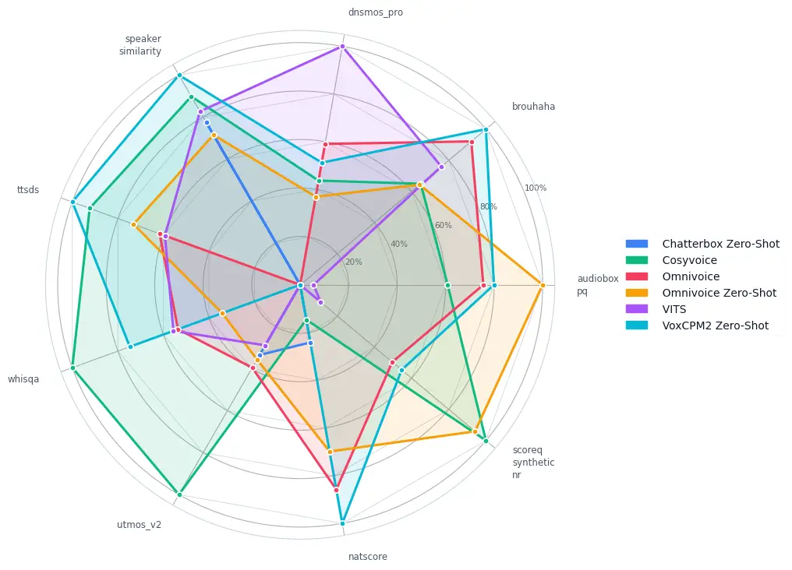
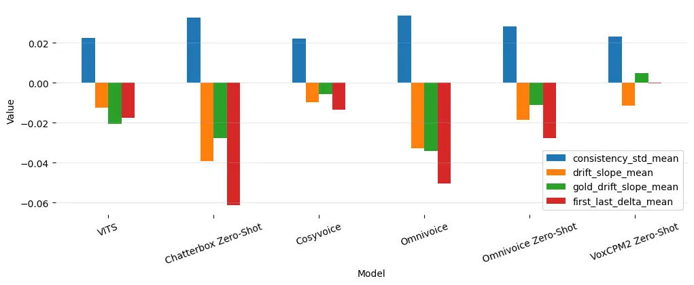
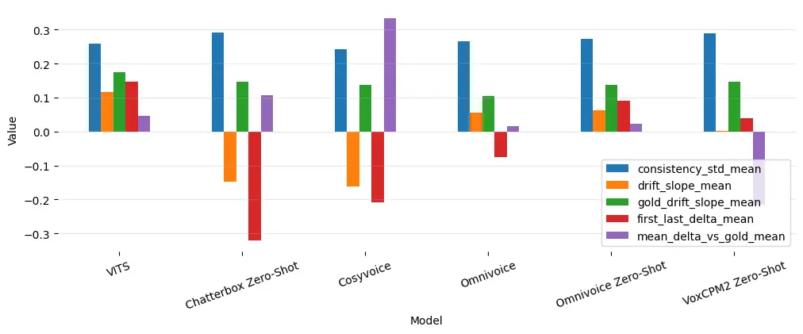

# A Comprehensive Objective Evaluation of Modern Text-to-Speech for Turkish Using Speech Quality Assessment Models

Yunus Emre Ozkose    Alperen Kahraman    Ali Haznedaroglu
Affiliation: Sestek, Ankara, Türkiye E-mail [{yunusemre.ozkose,
alperen.kahraman,
ali.haznedaroglu}@sestek.com](mailto:%7Byunusemre.ozkose,%20alperen.kahraman,%20ali.haznedaroglu%7D@sestek.com)

###### Abstract

Modern text-to-speech (TTS) systems can clone a target speaker from a
short reference clip or be fine-tuned on a target voice, yet their
behaviour on morphologically rich, lower-resource languages such as
Turkish remain under-characterised. We present a systematic benchmark of
four contemporary systems (Chatterbox, CosyVoice, OmniVoice, and
VoxCPM2) evaluated across fine-tuned and zero-shot configurations,
contrasted with a conventional VITS baseline and anchored to natural
gold speech. Each configuration is scored with eighteen complementary
objective metrics spanning learned naturalness predictors (UTMOS v2,
DNSMOS-Pro, SCOREQ, WhisQA, AudioBox-PQ, NatScore, SpeechLMScore),
intelligibility and signal-quality estimators (SQUIM PESQ/SI-SDR/STOI,
Brouhaha), speaker similarity, distributional fidelity (TTSDS) and
low-level acoustic descriptors. We further analyse how quality varies
with utterance length and quantify long-form temporal consistency
through speaker-identity and naturalness drift over chunked utterances.
We release our evaluation code to support reproducible TTS evaluation.

###### Keywords: 

Text-to-speech Turkish speech synthesis Objective evaluation Speaker
similarity Voice cloning Benchmark. Speech Quality Assessment

## 1 Introduction

Speech synthesis is one of the most important tasks for various
speech-oriented pipelines such as voice chatbots, virtual assistants,
etc … The primary objective is to generate a qualified synthesis from
the given text. While it is a crucial part of various pipelines, the
evaluation and selection of models are still hard and time-consuming
because of metrics such as mean opinion score (MOS) and AB test, which
require human investigation. Several works try to mimic MOS score, such
as UTMOS \[18, 1\]. However, observing MOS score is not enough to select
a text-to-speech (TTS) model since speech includes multiple quality
dimensions like naturalness, signal quality, prominence, etc. Hence, a
more comprehensive strategy is need to select metrics and methods.

In recent years, TTS models have achieved high success in natural and
high-quality synthesis. Models have moved from per-speaker training
towards zero-shot synthesis, where a single model is able to produce an
unseen speaker synthesis from only a few reference audio without
speaker-based finetuning. The latest systems \[6, 7\] clone timbre,
prosody, and speaking style from a short prompt, and bring a
high-quality voice cloning without the high cost of speaker-specific
data collection. Almost all of these evaluations and achievements are
demonstrated on relatively high-resource languages such as English and
Chinese. Turkish is comparatively underserved where it is an
agglutinative language with vowel harmony, productive suffixation, and a
largely transparent orthography. To our knowledge, no prior study
evaluates several state-of-the-art zero-shot systems on Turkish under a
single, controlled, reference-aware protocol.

In this paper, we benchmark four state-of-the-art TTS models which span
complementary design philosophies (LLM-plus-flow-matching, discrete
diffusion-language-model decoding and tokenizer-free continuous
diffusion) in various states (finetuned, zero-shot, text-based,
phoneme-based). We contrast them with a conventional, non-zero-shot VITS
baseline. These models are evaluated under eighteen objective metrics
covering naturalness, intelligibility, signal quality, speaker
similarity, distributional fidelity, and low-level acoustics. Beyond
these comparisons, we investigate whether models are able to generate
consistent synthesis or not. Our analysis yields several findings that
several automatic speech assessment methods are need to be observed for
specific demand, and an averaged leaderboard would obscure. A single
system cannot win by itself, but per-metric winners partition cleanly by
metric family. Several models even surpass the gold reference on
signal-clean predictors, exposing a tension between metrics that reward
clean, intelligible audio and those that track human-likeness. Speaker
similarity, the one dimension on which natural speech reliably tops
every system, emerges as the most trustworthy single indicator of
cloning fidelity.

In summary, our contributions are: (i) a reproducible, multi-metric
benchmark of TTS models in Turkish, covering four contemporary systems
and a conventional baseline against a natural-speech anchor across
eighteen objective metrics; (ii) an analysis showing that relative
system rankings are largely determined by the chosen metric family and
by utterance length, together with evidence that several signal-oriented
predictors reward idealised audio over genuine naturalness; and (iii) a
long-form temporal-consistency study that separately quantifies
speaker-identity drift and naturalness drift over an utterance. Public
release of our evaluation code.¹¹ 1 Code and results:
[https://github.com/EmreOzkose/tr-tts-eval](https://github.com/EmreOzkose/tr-tts-eval)

## 2 Related Work

### 2.1 Modern Speech Synthesis

Recent TTS models have shifted from traditional parametric or purely
end-to-end neural architectures toward generative, zero-shot voice
cloning systems. While more traditional architectures like VITS \[9\]
successfully integrated acoustic and waveform generation into a unified,
high-quality framework, they remain constrained by the requirement of
per-speaker training and struggle with unseen target voices. Modern TTS
methods \[26, 6\] address this limitation by reframing speech synthesis
as a conditional generation task, where a speaker’s identity is cloned
directly from a short, unannotated reference audio clip without any
fine-tuning. The neural codec language model line VALLE \[24\] treats
TTS as language modelling over discrete audio codes and clones a voice
from a few seconds prompt while flow and diffusion based systems such as
NaturalSpeech2 \[19\] pursued the same goal through continuous
representations. Multilingual voice-cloning systems, including
YourTTS \[4\] and XTTS \[3\], extended zero-shot synthesis to many
languages, often covering low and medium resource ones. The four systems
evaluated here continue this trajectory along complementary design axes:
CosyVoice \[6\] couples an LLM over supervised semantic tokens with flow
matching; OmniVoice \[26\] uses a diffusion-language-model-style
discrete non-autoregressive decoder over multi-codebook acoustic tokens;
VoxCPM2 \[25\] dispenses with discrete tokens entirely, modelling a
continuous acoustic space with a diffusion-autoregressive pipeline; and
Chatterbox \[17\] pairs an LLM-style token model with a flow-matching
decoder and emotion control. We include the conventional, non-zero-shot
VITS \[9\] as a well-understood reference point. Despite this rich
landscape, head-to-head comparisons on Turkish are scarce, which is the
gap this paper addresses.

### 2.2 Evaluation of Synthetic Speech

Automatic speech quality assessment has seen significant advancement
with the advent of deep-learning-based models designed to mimic human
Mean Opinion Scores (MOS) since subjective listening tests are slow and
costly. This has driven a large body of work on automatic predictors:
learned naturalness/MOS estimators such as UTMOS \[1\] and
DNSMOS \[16\]; reference-free intelligibility and signal-quality
measures such as TorchAudio-SQUIM \[10\] (PESQ/SI-SDR/STOI) and
SCOREQ \[15\]; acoustic-condition estimators such as Brouhaha \[11\];
and distribution-level scores such as TTSDS \[13\], which compare the
feature distribution of synthetic and natural speech. Each predictor
captures only a slice of perceptual quality and can disagree with the
others.

Classic subjective speech quality assessment models also suffer from a
lack of robustness and poor out-of-domain generalization when applied to
unseen acoustic environments or speech synthesis systems. To address
these systemic validation gaps, Huang et al. \[8\] introduced MOS-Bench,
a comprehensive evaluation benchmark containing diverse training and
testing partitions specifically curated to evaluate the
out-of-distribution generalization capabilities of existing metrics.
Recognizing that single-score absolute regression struggles with
inconsistent rating standards across heterogeneous datasets, recent
efforts have shifted toward preference-based or comparative frameworks.
For instance, Cao et al. \[2\] formulated MOS-RMBench, a benchmark that
reframes historical MOS datasets into a preference-comparison setting
tailored for speech quality reward modeling, demonstrating that
generative reward models utilizing a MOS-difference-based reward
function can markedly improve fine-grained quality discrimination.
Building upon these paradigms, UrgentMOS \[23\] bridges absolute and
relative paradigms by proposing a unified framework that jointly learns
from multi-metric objective and perceptual targets while explicitly
modeling pairwise quality preferences via comparative MOS (CMOS)
prediction.

## 3 Systems Under Evaluation

We conduct experiments with four modern TTS models and one conventional
model. Natural speech (_gold_) records serve as a gold reference anchor.
All systems are open-source and capable to generate a specific speaker’s
speech. They have different design philosophies: LLM-plus-flow-matching,
tokenizer-free continuous diffusion, and diffusion-language-model
discrete NAR, which makes them a representative cross-section of the
current state of the art.

CosyVoice \[6\] (finetuned)  
A scalable multilingual zero-shot synthesizer from the Alibaba
FunAudioLLM group. It represents speech with supervised semantic tokens
derived from a multilingual ASR encoder, generates these tokens with an
LLM, and reconstructs the waveform with a conditional flow-matching
model conditioned on a speaker embedding. We evaluate it under two
textual front-ends: _raw text_ and _phonemes_ to isolate the effect of
the input representation on a morphologically rich language such as
Turkish.

OmniVoice \[26\] (finetuned and zero-shot)  
A massively multilingual zero-shot model from Xiaomi that scales to
$`600+`$ languages. Rather than a two-stage text-to-semantic-to-acoustic
pipeline, it uses a diffusion-language-model style discrete
non-autoregressive architecture that maps text directly to
multi-codebook acoustic tokens, trained with full-codebook random
masking and initialised from a pre-trained LLM for intelligibility. We
evaluate two configurations: a _finetuned_ mode and a _zero-shot_ mode.

Chatterbox \[17\] (zero-shot)  
An open-source model from Resemble AI built on a $`0.5`$ B-parameter
Llama-style backbone and trained on roughly $`500`$k hours of speech. It
couples a text-to-token model with a flow-matching token-to-waveform
decoder and supports zero-shot cloning from a short reference clip. We
use its multilingual variant, which extends the system to Turkish among
$`23`$ languages.

VoxCPM2 \[25\] (zero-shot)  
A tokenizer-free system from OpenBMB built on a MiniCPM-4 backbone. The
evaluated checkpoint is the multilingual VoxCPM2 release.

VITS \[9\] (finetuned)  
A conventional, non-zero-shot end-to-end model that combines a
conditional variational autoencoder with normalising flows, adversarial
training, and a stochastic duration predictor. It is _not_ a
voice-cloning system and is included as a strong, well-understood
reference point against which the zero-shot systems are contrasted.

Chatterbox and VoxCPM2 are evaluated for only the zero-shot case. VITS
is fine-tuned for a specific speaker who has 20 hours of records.
Cosyvoice and Omnivoice are finetuned with 2000 hours of speech, which
includes 4 languages (English, Arabic, Turkish, and Urdu) and 22
speakers. This setup also includes 20 hours of speaker speech, which is
in VITS training. All zero-shot cases are using this specific speaker’s
9-second prompt:

> Bir serin rüzgarın dokunuşundan sonra keşfettiği ateşe, başının,
> ciğerlerinin, bütün varlığının ateşine bu üşümenin şifa vereceğini
> zannediyordu.

## 4 Evaluation Methodology

We conduct experiments with various objective metrics on synthesised
audio and on natural reference audio. Metrics are grouped by the
perceptual dimension they target.

### 4.1 Reference-Free Naturalness and Quality Predictors

UTMOSv2\[1\], DNSMOS-Pro \[16\] (with its BVCC, NISQA, and VCC2018
heads), SCOREQ \[15\](synthetic-nr), WhisQA \[5\], AudioBox-PQ \[21\],
NatScore \[20\], and SpeechLMScore \[12\] are learned predictors of
perceived naturalness and overall quality.

### 4.2 Intelligibility and Signal-Level Metrics

SQUIM (PESQ, SDR, and STOI)  \[10\] provides reference-free estimates of
perceptual quality, signal-to-distortion ratio, and intelligibility,
respectively. Brouhaha \[11\] estimates speech/noise characteristics
(reported here as an SNR-like score).

### 4.3 Speaker Similarity

Speaker similarity is the cosine similarity between speaker embeddings
of the synthesised utterance and the target reference; values approach
the gold anchor as cloning fidelity improves. Wespeaker \[22\] is used
to compute speaker embeddings. We use ResNet221-LM speaker verification
model that is trained on VoxCeleb \[14\]

### 4.4 Distributional Fidelity

TTSDS (TTS Distribution Score) v2 \[13\] measures how closely the
distribution of synthetic speech features matches that of natural
speech.

### 4.5 Low-Level Acoustic Descriptors

Integrated loudness (LUFS) and a sibilance ratio characterise low-level
acoustic behaviour; for these, proximity to the gold reference is the
relevant criterion.

### 4.6 Long-Form Temporal Consistency

To probe stability over long utterances, each utterance is split into
chunks, and 2 metrics (speaker similarity and UTMOS scores) are tracked
across chunks. We report average similarity to the reference
(mean_sim_vs_ref), std of similarity across chunks; lower is more stable
(consistency_std), linear trend of similarity over the utterance
(drift_slope), and similarity change from first to last chunk
(first_last_delta).

## 5 Experimental Setup

For evaluation, a small-scale test dataset was constructed. A subset was
sampled from the test set of the existing 20-hour Turkish speaker
dataset, consisting of 100 short, 100 medium-length, and 100 long
utterances selected at random. Short, medium-length, and long utterances
were defined based on character length intervals of 0–50, 51–150, and
greater than 150 characters, respectively. The 20-hour speaker dataset
is a TTS dataset that we collect internally to train our TTS models.
Sampling rate is 48 kHz originally, but we adapt samples according to
model requirements.

## 6 Results

### 6.1 Overall Comparison

All averaged metric results over the full test set for all models and
the gold set are reported in Table 1. For each metric, the best result
is shown in bold. The gold column is an anchor, not a competitor.
Figure 1 summarises the nine headline metrics on a common normalized
scale and annotates, per system, the number of headline metrics it wins.

| Metric               | CB      | CV      | OV      | OV-Z    | VITS    | VOX     | Gold    |
| -------------------- | ------- | ------- | ------- | ------- | ------- | ------- | ------- |
| audiobox-pq          | 7.643   | 7.793   | 7.785   | 7.831   | 7.654   | 7.793   | 7.657   |
| brouhaha             | 50.132  | 60.249  | 61.498  | 58.066  | 59.507  | 62.471  | 55.309  |
| dnsmos_pro           | 3.564   | 3.770   | 3.954   | 3.808   | 4.225   | 3.902   | 3.601   |
| dnsmos-pro-bvcc      | 3.347   | 3.643   | 3.745   | 3.522   | 3.616   | 3.533   | 3.698   |
| dnsmos-pro-nisqa     | 3.564   | 3.770   | 3.954   | 3.808   | 4.225   | 3.902   | 3.601   |
| dnsmos-pro-vcc2018   | 3.045   | 2.925   | 2.722   | 2.773   | 3.138   | 2.886   | 3.171   |
| speaker-similarity   | 0.873   | 0.878   | 0.843   | 0.870   | 0.875   | 0.881   | 0.894   |
| squim-pesq           | 0.995   | 0.993   | 0.996   | 0.996   | 0.992   | 0.995   | 0.992   |
| squim-si-sdr         | 24.939  | 25.736  | 27.119  | 28.523  | 25.211  | 27.053  | 24.455  |
| squim-stoi           | 3.762   | 3.753   | 3.772   | 3.926   | 3.690   | 3.788   | 3.639   |
| utmos-v2             | 3.092   | 3.441   | 3.129   | 3.105   | 3.064   | 2.886   | 3.079   |
| low-level-lufs       | -26.624 | -22.443 | -24.163 | -27.600 | -23.989 | -25.601 | -25.151 |
| low-level-sib.-ratio | 0.041   | 0.050   | 0.068   | 0.070   | 0.053   | 0.077   | 0.084   |
| scoreq-synthetic-nr  | 3.697   | 4.063   | 3.888   | 4.059   | 3.740   | 3.907   | 3.782   |
| speechlmscore        | 1.592   | 1.672   | 1.636   | 1.637   | 1.733   | 1.623   | 1.703   |
| whisqa               | 4.341   | 4.720   | 4.509   | 4.448   | 4.515   | 4.575   | 4.331   |
| natscore             | -1.447  | -1.233  | -1.016  | -1.128  | -1.616  | -0.917  | -1.384  |
| ttsds                | 77.012  | 79.735  | 78.334  | 78.580  | 78.284  | 79.156  | 77.864  |

Table 1: Overall objective metrics (mean over the full test set). Best
synthetic system per row in bold. CosyVoice is represented by its
canonical raw-text configuration. Columns: CB = Chatterbox (zero-shot),
CV = CosyVoice (raw text), OV = OmniVoice (finetuned), OV-Z = OmniVoice
(zero-shot), VITS = VITS, VOX = VoxCPM2 (zero-shot), Gold = natural
reference.

Figure 1: Radar comparison of metrics, normalized to a common
$`[0,100]\%`$ scale, with CosyVoice represented by its canonical
raw-text configuration. Legend annotations report, per system, the
number of headlines

First of all, _no system wins globally_: Table 1 shows that the
per-metric best is spread across five different entries that cluster
cleanly by family. VITS dominates the DNSMOS-Pro family and
speechlmscore; OmniVoice (zero-shot) sweeps the SQUIM
intelligibility/signal triplet (squim-pesq, squim-si-sdr, squim-stoi)
together with audiobox-pq; CosyVoice owns the
learned-naturalness/distributional cluster (utmos-v2,
scoreq-synthetic-nr, whisqa, ttsds); and VoxCPM2 leads on speaker
similarity, natscore and brouhaha. Counting per-metric winners over the
full battery, these four systems take three to four metrics each,
OmniVoice (raw) takes one, and Chatterbox none.

Secondly, several synthetic systems _exceed_ the gold reference on a
number of predictors: VITS on dnsmos_pro ($`4.225`$ vs. $`3.601`$),
OmniVoice ZS on squim-si-sdr ($`28.5`$ vs. $`24.5`$), and audiobox-pq,
and VoxCPM2 on natscore ($`-0.92`$ vs. $`-1.38`$).

Because natural speech cannot plausibly be less natural than synthesis,
these inversions indicate that the signal-quality and clean-MOS
predictors reward idealised, low-noise, smoothly voiced audio rather
than perceptual realism. The metric on which gold remains clearly
highest is speaker-similarity ($`0.894`$); among synthetic systems
VoxCPM2 is closest ($`0.881`$) and OmniVoice (raw) the furthest
($`0.843`$). Finally, Chatterbox is the only system that wins no metric.
Sec. 6.2 shows this is driven largely by a collapse on short utterances.
For the low-level descriptors, proximity to gold is the relevant
reading: among the systems in Table 1, VoxCPM2 comes closest to the gold
low_level_sibilance_ratio ($`0.077`$ vs. $`0.084`$), whereas the
highlighted low-level-lufs cell merely marks the loudest system and is
in fact further from the gold loudness than several others.

### 6.2 Effect of Utterance Length

Evaluation by length gropus are given in Table 2. Results show that the
hardest setup is short-length group since for almost every system and
metric, scores are lowest in the short group and recover for medium and
long utterances. The most dramatic case is Chatterbox, which collapses
on short input (squim-si-sdr) falls from $`26.4`$ (long) to $`20.4`$
(short), speaker similarity from $`0.889`$ to $`0.825`$, whisqa from
$`4.58`$ to $`3.61`$, and natscore from $`-1.28`$ to $`-2.22`$, and its
brouhaha uniquely _drops_ on short input ($`53.2\!\rightarrow\!40.5`$)
while it rises for every other system. By contrast the CosyVoice,
OmniVoice and VoxCPM2 configurations remain comparatively length-robust,
with OmniVoice ZS holding the highest squim-si-sdr across all three
groups and VoxCPM2 the best natscore in the long and medium groups
(CosyVoice (raw) edges it on short utterances). Speaker similarity
declines with shorter utterances for _every_ entry including gold
($`0.917\!\rightarrow\!0.827`$); since the natural reference degrades in
the same direction, part of this drop is an artifact of estimating
speaker embeddings from very short audio rather than a synthesis defect.

| Len.   | System        | APQ   | BRH   | DM    | SPK   | SISDR | UTM   | WHQ   | NAT    |
| ------ | ------------- | ----- | ----- | ----- | ----- | ----- | ----- | ----- | ------ |
| long   | Chatterbox    | 7.735 | 53.18 | 3.654 | 0.889 | 26.39 | 3.179 | 4.578 | -1.282 |
|        | CosyVoice     | 7.836 | 58.36 | 3.819 | 0.900 | 25.35 | 3.465 | 4.765 | -1.308 |
|        | OmniVoice     | 7.791 | 58.12 | 3.948 | 0.872 | 26.23 | 3.135 | 4.581 | -1.027 |
|        | OmniVoice (Z) | 7.852 | 55.10 | 3.770 | 0.887 | 28.49 | 3.165 | 4.526 | -1.064 |
|        | VITS          | 7.724 | 56.76 | 4.228 | 0.894 | 24.80 | 3.077 | 4.582 | -1.641 |
|        | VoxCPM2       | 7.820 | 59.23 | 3.926 | 0.899 | 26.85 | 2.914 | 4.640 | -0.803 |
|        | gold          | 7.722 | 53.09 | 3.641 | 0.917 | 24.03 | 3.124 | 4.385 | -1.420 |
| medium | Chatterbox    | 7.697 | 51.47 | 3.565 | 0.877 | 25.57 | 3.164 | 4.434 | -1.203 |
|        | CosyVoice     | 7.819 | 60.73 | 3.788 | 0.883 | 26.20 | 3.461 | 4.759 | -1.090 |
|        | OmniVoice     | 7.828 | 63.70 | 4.016 | 0.850 | 27.94 | 3.168 | 4.591 | -0.779 |
|        | OmniVoice (Z) | 7.851 | 58.79 | 3.891 | 0.877 | 28.58 | 3.213 | 4.539 | -0.864 |
|        | VITS          | 7.686 | 60.46 | 4.269 | 0.881 | 25.33 | 3.117 | 4.579 | -1.562 |
|        | VoxCPM2       | 7.819 | 64.11 | 3.928 | 0.887 | 27.50 | 2.912 | 4.646 | -0.677 |
|        | gold          | 7.705 | 56.21 | 3.662 | 0.901 | 24.28 | 3.116 | 4.422 | -1.241 |
| short  | Chatterbox    | 7.332 | 40.49 | 3.335 | 0.825 | 20.36 | 2.766 | 3.607 | -2.221 |
|        | CosyVoice     | 7.647 | 64.33 | 3.621 | 0.814 | 26.03 | 3.350 | 4.546 | -1.250 |
|        | OmniVoice     | 7.703 | 66.81 | 3.879 | 0.757 | 28.18 | 3.057 | 4.208 | -1.339 |
|        | OmniVoice (Z) | 7.746 | 64.53 | 3.784 | 0.818 | 28.54 | 2.927 | 4.118 | -1.675 |
|        | VITS          | 7.426 | 65.06 | 4.151 | 0.817 | 26.07 | 2.949 | 4.253 | -1.631 |
|        | VoxCPM2       | 7.685 | 68.27 | 3.805 | 0.830 | 26.91 | 2.776 | 4.307 | -1.556 |
|        | gold          | 7.420 | 59.61 | 3.412 | 0.827 | 25.80 | 2.909 | 4.058 | -1.501 |

Table 2: Quality by utterance-length group for representative metrics.
APQ = audiobox-pq, BRH = brouhaha, DM = dnsmos_pro, SPK =
speaker-similarity, SISDR = squim-si-sdr, UTM = utmos-v2, WHQ = whisqa,
NAT = natscore.

### 6.3 Long-Form Temporal Consistency

To investigate consistency over time in synthetic speech, we divide the
long utterances into 2-second chunks and calculate speaker similarity
separately. Quantitative results are given in Table 3. First, the
drift_slope is negative for every system: speaker similarity to the
reference decays as the utterance progresses. Crucially, the gold
reference also exhibits negative drift (gold_drift_slope), so a portion
of the decay is inherent to the chunked-similarity measurement rather
than a model defect; drift is therefore best read relative to its gold
counterpart. Secondly, we can observe stability with this setup.
CosyVoice and VITS are the most consistent ones (low consistency_std,
$`0.021`$/$`0.023`$; small drift_slope, $`-0.008`$/$`-0.013`$; and small
first-to-last change), whereas Chatterbox and OmniVoice are the least
stable, with the largest dispersion ($`0.033`$–$`0.034`$) and the
steepest decay (first_last_delta of $`-0.061`$ and $`-0.051`$
respectively). VoxCPM2 has a notable case: although its mean similarity
is mid-pack, its end-to-end change is essentially zero (first_last_delta
$`=-0.0003`$) and its gold-relative drift is the smallest. It means that
its voice identity stays stable over long passages. These differences
matter most for long-form deployment such as audiobook or narration
synthesis, where slow identity drift accumulates over minutes of audio.
Figs. 2 visualize quantitative results.

| System          | $`\bar{n}_{\text{chunks}}`$ | sim    | std    | drift   | g-drift | $`\Delta_{\text{fl}}`$ |
| --------------- | --------------------------- | ------ | ------ | ------- | ------- | ---------------------- |
| Chatterbox (ZS) | 12.08                       | 0.8309 | 0.0325 | -0.0391 | -0.0279 | -0.0613                |
| CosyVoice       | 11.14                       | 0.8533 | 0.0212 | -0.0077 | -0.0068 | -0.0094                |
| OmniVoice       | 11.73                       | 0.8054 | 0.0336 | -0.0329 | -0.0340 | -0.0505                |
| OmniVoice (ZS)  | 11.88                       | 0.8191 | 0.0282 | -0.0184 | -0.0110 | -0.0276                |
| VITS            | 10.42                       | 0.8545 | 0.0226 | -0.0125 | -0.0207 | -0.0175                |
| VoxCPM2 (ZS)    | 11.89                       | 0.8493 | 0.0233 | -0.0115 | -0.0049 | -0.0003                |

Table 3: Long-form temporal consistency. $`\bar{n}_{\text{chunks}}`$ =
mean chunks per utterance; sim = mean*sim_vs_ref; std =
consistency_std_mean (lower is more stable); drift = drift_slope_mean;
g-drift = gold_drift_slope_mean; $`\Delta*{\text{fl}}`$ =
first_last_delta_mean.

Figure 2: Drift and consistency metrics per system:
consistency_std_mean, drift_slope_mean, gold_drift_slope_mean,
first_last_delta_mean.

We repeat the consistency analysis with UTMOS-v2 while we evaluate
chunks separately and observe stability. Results are given in Table 4
and Figs. 3 visualise numerical results. First, naturalness is far more
volatile: the per-chunk standard deviation is roughly an order of
magnitude larger ($`0.23`$–$`0.29`$) than for speaker similarity
($`\sim`$$`0.02`$–$`0.03`$), so quality fluctuates strongly across an
utterance even when identity is stable. CosyVoice is the most stable
from the perspective of naturaless. On the other hand, Chatterbox and
VoxCPM2 are the least consistent models. Second, the gold reference
shows a _positive_ UTMOS drift for every system ($`+0.10`$ to
$`+0.17`$): natural speech tends to score lower on its opening chunk and
rise thereafter, so the expected temporal profile is upward. Against
this baseline, VITS and both OmniVoice modes drift upward like gold,
whereas Chatterbox drifts _downward_ ($`-0.149`$) and shows by far the
largest first-to-last drop ($`-0.321`$); CosyVoice drifts only mildly
downward ($`-0.041`$). Third, the mean offset from gold
(mean_delta_vs_gold) mirrors Table 1: CosyVoice sits well above gold
($`+0.31`$), VoxCPM2 clearly below ($`-0.22`$), and the remaining
systems are close to natural speech. A system can therefore be
identity-stable yet naturalness-unstable: Chatterbox is unstable on both
axes, while CosyVoice holds its identity but, in its phoneme mode, sheds
perceived quality over the utterance (Sec. 6.4).

| System          | UTMOS | std   | drift  | g-drift | $`\Delta_{\text{fl}}`$ | $`\Delta_{\text{gold}}`$ |
| --------------- | ----- | ----- | ------ | ------- | ---------------------- | ------------------------ |
| Chatterbox (ZS) | 3.026 | 0.293 | -0.149 | 0.148   | -0.321                 | -0.107                   |
| CosyVoice (raw) | 3.243 | 0.233 | -0.041 | 0.124   | -0.067                 | -0.305                   |
| OmniVoice (raw) | 2.938 | 0.267 | -0.057 | 0.105   | -0.076                 | -0.015                   |
| OmniVoice (ZS)  | 2.941 | 0.272 | -0.063 | 0.138   | -0.090                 | -0.022                   |
| VITS            | 2.992 | 0.260 | -0.118 | 0.175   | -0.147                 | -0.046                   |
| VoxCPM2 (ZS)    | 2.708 | 0.288 | -0.001 | 0.148   | -0.039                 | -0.216                   |

Table 4: Long-form temporal consistency of _naturalness_ (UTMOS v2) per
system. UTMOS = mean*utmos_mean; std = consistency_std_mean; drift =
drift_slope_mean; g-drift = gold_drift_slope_mean;
$`\Delta*{\text{fl}}`$ = first_last_delta_mean; $`\Delta\_{\text{gold}}`$
= mean_delta_vs_gold_mean. Positive drift means quality rises over the
utterance; gold drifts upward for all systems.

Figure 3: Naturalness (UTMOS-v2) drift/consistency quantities per
system: consistency_std_mean, drift_slope_mean, gold_drift_slope_mean,
first_last_delta_mean and mean_delta_vs_gold_mean.

### 6.4 CosyVoice Front-End Ablation: Raw Text vs. Phonemes

Since the Turkish language has a largely transparent orthography
(grapheme-to-phoneme conversion is close to regular), a natural question
is whether an explicit phoneme front-end helps CosyVoice at all. Table 5
isolates this by comparing the raw-text and phoneme configurations on
every overall metric. The differences are small and mixed: no
configuration is consistently better, and speaker identity is
essentially unaffected (speaker-similarity differs by $`0.001`$). The
phoneme front-end reproduces the gold sibilance ratio almost exactly
($`0.084`$ vs. gold $`0.084`$, against $`0.050`$ for raw text) and is
marginally ahead on the SQUIM and DNSMOS-Pro/UTMOS-style scores, whereas
raw text is clearly ahead on dnsmos-pro-bvcc ($`+0.283`$), natscore
($`+0.281`$), and ttsds ($`+0.743`$). For a shallow-orthography language
such as Turkish, this near-parity is expected: phonemisation adds little
that the model cannot already recover from the text. The one place the
front-ends diverge meaningfully is in temporal behaviour. On the
identity axis, they are nearly indistinguishable (mean similarity
$`0.853`$ vs. $`0.853`$, consistency_std $`0.021`$ vs. $`0.022`$,
first_last_delta $`-0.009`$ vs. $`-0.014`$). On the naturalness axis,
however, raw text drifts only mildly downward over an utterance (UTMOS
drift_slope $`-0.041`$, first_last_delta $`-0.067`$) while the phoneme
mode decays markedly ($`-0.162`$ and $`-0.208`$), even though its mean
UTMOS is fractionally higher ($`3.276`$ vs. $`3.243`$). In alternative
terms, utilizing a phoneme-based front-end optimizes mean architectural
naturalness only minimally, a benefit that is heavily counterbalanced by
a pronounced degradation in intra-utterance consistency.

| Metric               | CV-R (raw) | CV-P (phon.) | $`\Delta_{\text{P$-$R}}`$ | Gold    |
| -------------------- | ---------- | ------------ | ------------------------- | ------- |
| audiobox-pq          | 7.793      | 7.757        | $`-0.036`$                | 7.657   |
| brouhaha             | 60.249     | 58.140       | $`-2.109`$                | 55.309  |
| dnsmos_pro           | 3.770      | 3.853        | $`+0.083`$                | 3.601   |
| dnsmos-pro-bvcc      | 3.643      | 3.360        | $`-0.283`$                | 3.698   |
| dnsmos-pro-nisqa     | 3.770      | 3.853        | $`+0.083`$                | 3.601   |
| dnsmos-pro-vcc2018   | 2.925      | 2.928        | $`+0.003`$                | 3.171   |
| speaker-similarity   | 0.878      | 0.877        | $`-0.001`$                | 0.894   |
| squim-pesq           | 0.993      | 0.993        | $`+`$$`0.000`$            | 0.992   |
| squim-si-sdr         | 25.736     | 26.215       | $`+0.479`$                | 24.455  |
| squim-stoi           | 3.753      | 3.818        | $`+0.065`$                | 3.639   |
| utmos-v2             | 3.441      | 3.501        | $`+0.060`$                | 3.079   |
| low-level-lufs       | -22.443    | -24.376      | $`-1.933`$                | -25.151 |
| low-level-sib.-ratio | 0.050      | 0.084        | $`+0.034`$                | 0.084   |
| scoreq-synthetic-nr  | 4.063      | 4.082        | $`+0.019`$                | 3.782   |
| speechlmscore        | 1.672      | 1.708        | $`+0.036`$                | 1.703   |
| whisqa               | 4.720      | 4.655        | $`-0.065`$                | 4.331   |
| natscore             | -1.233     | -1.514       | $`-0.281`$                | -1.384  |
| ttsds                | 79.735     | 78.992       | $`-0.743`$                | 77.864  |

Table 5: CosyVoice front-end ablation: raw text (CV-R) vs. phonemes
(CV-P), mean over the full test set. $`\Delta_{\text{P$-$R}}`$ is the
phoneme$`-`$raw difference; Gold is the natural reference. Differences
are small for most metrics and speaker identity is essentially
unchanged.

## 7 Discussion

### 7.1 No Single Winner Across Metric Families

The primary result of this benchmark is that the best TTS system for
Turkish is undefined without fixing target objective. As illustrated by
the per-metric performance in Table 1, the optimal architectures
partition almost perfectly along specific metric classification
families. VITS demonstrates superior efficacy within the DNSMOS-Pro
domain, whereas OmniVoice consistently outperforms other models across
the SQUIM intelligibility and signal metrics. Concurrently, CosyVoice
exhibits robust performance in learned-naturalness and distributional
evaluations (UTMOS-v2, SCOREQ, WhisQA, TTSDS), while VoxCPM2 excels in
perceptual-naturalness and speaker-fidelity metrics (NatScore, speaker
similarity, Brouhaha). This clustered result is more informative than a
regular ranking, since a user might pick one of the systems for a
specific goal: OmniVoice ZS or VITS, where a clean, intelligible signal
is paramount; CosyVoice or VoxCPM2, where perceived naturalness and
faithful voice cloning matter.

### 7.2 Naturalness Predictors vs. Intelligibility/Signal Metrics

The two metric groups are not merely different. Several systems beat the
gold reference on signal-oriented predictors (VITS on DNSMOS,
OmniVoice ZS on SQUIM SI-SDR, and AudioBox-PQ), which is implausible for
genuine naturalness and instead reveals that these predictors reward
clean, low-noise, smoothly voiced audio. A conventional model such as
VITS, whose vocoder produces very tidy spectra, can therefore top DNSMOS
while sounding less natural than an expressive zero-shot system. The
learned-naturalness and distributional metrics (UTMOS-v2, WhisQA, TTSDS)
align better with perceptual realism and rank the expressive
LLM/diffusion systems (chiefly CosyVoice) highest. We therefore treat
the signal-clean metrics as quality floors (is the audio clean and
intelligible?) and the naturalness/distributional metrics as the more
decision-relevant indicators of human-likeness, and we caution that
optimising the former can be mildly anti-correlated with the latter.

### 7.3 Sensitivity to Utterance Length

Utterance length is a first-order factor that an averaged leaderboard
obscures. All systems degrade on short utterances, but the degree varies
enormously: the CosyVoice/OmniVoice/VoxCPM2 families stay relatively
flat, while Chatterbox collapses across nearly every metric on short
input and recovers only on medium/long utterances. Because the gold
reference also loses speaker-similarity on short audio,
length-stratified reporting is needed both to surface genuine model
weaknesses (Chatterbox short-form) and to avoid mistaking a short-audio
measurement artifact (speaker-embedding instability) for a synthesis
defect. Deployments dominated by short prompts (voice assistants, IVR,
command responses) should weight the short-group results far more
heavily than the overall averages.

### 7.4 Stability in Long-Form Synthesis

The temporal analysis adds a dimension that single-utterance metrics
cannot capture: how steady a system remains across a long passage, along
two distinct axes: speaker identity and perceived naturalness. On the
identity axis, similarity to the reference drifts downward for every
system, but only relative to the gold drift is this meaningful. On that
basis, CosyVoice and VITS are the most stable, Chatterbox and OmniVoice
the least, and VoxCPM2’s near-zero first-to-last change makes it
attractive for minutes-long content where small per-chunk drifts would
otherwise compound. The _naturalness_ axis behaves differently and is
arguably the more revealing of the two: per-chunk quality fluctuates an
order of magnitude more than identity, and its expected profile is
upward, since gold UTMOS rises across chunks for every system. VITS and
both OmniVoice modes follow this profile, but Chatterbox drifts downward
and shows the largest first-to-last drop; the same downward pattern is
even stronger for CosyVoice’s phoneme front-end (Sec. 6.4). The key
lesson is that identity stability does not imply naturalness stability:
a system can hold its voice yet shed perceived quality over the
utterance, whereas a per-utterance average would simply call it good and
stable. For audiobook, dubbing, and narration use-cases, where these
effects accumulate over minutes, long-form deployment should therefore
monitor both identity drift and naturalness drift rather than trusting a
single per-utterance score.

### 7.5 Distance to Natural Speech (Gold) and Metric Reliability

Anchoring every metric to gold doubles as a sanity check on the metrics
themselves. Where synthetic systems surpass gold (DNSMOS, SQUIM,
AudioBox-PQ, NatScore, parts of TTSDS), the metric is rewarding
something other than human-likeness and should be interpreted with care
for Turkish. The one dimension on which gold reliably tops all systems
is speaker similarity, which behaves as expected and is thus the most
trustworthy single indicator of cloning fidelity in our battery. We
recommend reporting all objective scores alongside the gold value so
that better than real speech artifacts are visible rather than hidden
inside a normalised aggregate. The temporal view sharpens this point:
CosyVoice not only exceeds gold UTMOS on average but especially in its
phoneme mode (Sec. 6.4) follows a different within-utterance trajectory
(declining where natural speech rises), while VoxCPM2 sits below gold
throughout a structure that any single averaged score conceals.

## 8 Conclusion

We present a multi-metric benchmark of Turkish text-to-speech with
various objective speech quality assessment metrics. We conduct
experiments with four modern TTS models (both finetuned and zero-shot
configurations) and one conventional TTS model on a targeted Turkish
testset. Gold records of the speaker are added to the results for
analyzing the shift between real and synthetic speech. We observe
evaluations on several objective metrics, investigate utterance-length
breakdown, and a long-form temporal-consistency analysis. Performance is
not concentrated in any single system; instead, leadership is
distributed across metric families, with each system excelling within a
distinct group: VITS on DNSMOS-Pro metrics, OmniVoice (ZS) on SQUIM
intelligibility and signal-quality metrics, CosyVoice on
learned-naturalness and distributional metrics, and VoxCPM2 on
perceptual-naturalness and speaker-fidelity metrics. Several systems
surpass gold on signal-clean predictors, exposing a tension between
metrics that reward clean, intelligible audio and those that track
human-likeness; this dissociation motivates a panel of complementary
metrics anchored to gold rather than a single aggregate. The length and
temporal analyses further show that short utterances are the hardest
setting, eliciting a pronounced collapse in Chatterbox, whereas
CosyVoice and VITS are the most temporally stable, and VoxCPM2 shows
essentially no first-to-last identity drift. Speaker similarity emerges
as the most trustworthy single indicator of cloning fidelity. This study
is restricted to objective metrics and relies on a single Turkish test
set with limited speaker coverage, evaluated using general-purpose
multilingual checkpoints; absolute scores should therefore be
interpreted relative to the gold anchor rather than in isolation. Future
work should incorporate human evaluation through MOS and preference
studies, extend the analysis to a broader range of speakers and domains,
and investigate long-form stability over multi-minute passages.

## References

- \[1\] K. Baba, W. Nakata, Y. Saito, and H. Saruwatari (2024) The t05
  system for the VoiceMOS Challenge 2024: transfer learning from deep
  image classifier to naturalness MOS prediction of high-quality
  synthetic speech. In IEEE Spoken Language Technology Workshop (SLT),
  pp. 818–824. External Links:
  [Document](https://dx.doi.org/10.1109/SLT61566.2024.10832315) Cited
  by: §1, §2.2, §4.1.
- \[2\] Y. Cao, C. Jiang, J. Zhuang, J. Sun, M. Zhang, Z. Xi, H. Li, S.
  Dou, Y. Wang, Y. Zhang, et al. (2025) From scores to preferences:
  redefining mos benchmarking for speech quality reward modeling. arXiv
  preprint arXiv:2510.00743. Cited by: §2.2.
- \[3\] E. Casanova, K. Davis, E. Gölge, G. Göknar, I. Gulea, L.
  Hart, A. Aljafari, J. Meyer, R. Morais, S. Olayemi, et al. (2024)
  Xtts: a massively multilingual zero-shot text-to-speech model. arXiv
  preprint arXiv:2406.04904. Cited by: §2.1.
- \[4\] E. Casanova, J. Weber, C. D. Shulby, A. C. Junior, E. Gölge,
  and M. A. Ponti (2022) Yourtts: towards zero-shot multi-speaker tts
  and zero-shot voice conversion for everyone. In International
  Conference on Machine Learning, pp. 2709–2720. Cited by: §2.1.
- \[5\] G. Close, K. Hong, T. Hain, and S. Goetze (2025) WhiSQA:
  non-intrusive speech quality prediction using whisper encoder
  features. In International Conference on Speech and Computer,
  pp. 39–51. Cited by: §4.1.
- \[6\] Z. Du, C. Gao, Y. Wang, F. Yu, T. Zhao, H. Wang, X. Lv, H.
  Wang, X. Shi, K. An, et al. (2025) CosyVoice 3: towards in-the-wild
  speech generation via scaling-up and post-training. arXiv preprint
  arXiv:2505.17589. Cited by: §1, §2.1, item CosyVoice \[\] (finetuned),
  item CosyVoice \[\] (finetuned).
- \[7\] Y. Gong, B. Jiang, Y. Zhao, Y. Yuan, K. Chen, Y. Jiang, C.
  Chang, D. Hong, M. Chen, R. Li, Y. Zhang, Y. Gao, H. Chen, K. Chen, S.
  Wang, X. Yang, Y. Zhang, K. Huang, Z. Lin, K. Yu, Z. Chen, J. Wang, Z.
  Fei, Q. Cheng, S. Li, and X. Qiu (2026) MOSS-tts technical report.
  External Links: 2603.18090, [Link](https://arxiv.org/abs/2603.18090)
  Cited by: §1.
- \[8\] W. Huang, E. Cooper, and T. Toda (2026) Mos-bench: benchmarking
  generalization abilities of subjective speech quality assessment
  models. IEEE Transactions on Audio, Speech and Language Processing.
  Cited by: §2.2.
- \[9\] J. Kim, J. Kong, and J. Son (2021) Conditional variational
  autoencoder with adversarial learning for end-to-end text-to-speech.
  In International conference on machine learning, pp. 5530–5540. Cited
  by: §2.1, item VITS \[\] (finetuned), item VITS \[\] (finetuned).
- \[10\] A. Kumar, K. Tan, Z. Ni, P. Manocha, X. Zhang, E. Henderson,
  and B. Xu (2023) Torchaudio-squim: reference-less speech quality and
  intelligibility measures in torchaudio. In ICASSP 2023-2023 IEEE
  International Conference on Acoustics, Speech and Signal Processing
  (ICASSP), pp. 1–5. Cited by: §2.2, §4.2.
- \[11\] M. Lavechin, M. Métais, H. Titeux, A. Boissonnet, J. Copet, M.
  Rivière, E. Bergelson, A. Cristia, E. Dupoux, and H. Bredin (2023)
  Brouhaha: multi-task training for voice activity detection,
  speech-to-noise ratio, and C50 room acoustics estimation. ASRU. Cited
  by: §2.2, §4.2.
- \[12\] S. Maiti, Y. Peng, T. Saeki, and S. Watanabe (2023)
  Speechlmscore: evaluating speech generation using speech language
  model. In ICASSP 2023-2023 IEEE International Conference on Acoustics,
  Speech and Signal Processing (ICASSP), pp. 1–5. Cited by: §4.1.
- \[13\] C. Minixhofer, O. Klejch, and P. Bell (2025) TTSDS2: resources
  and benchmark for evaluating human-quality text to speech systems.
  arXiv preprint arXiv:2506.19441. Cited by: §2.2, §4.4.
- \[14\] A. Nagrani, J. S. Chung, and A. Zisserman (2017) Voxceleb: a
  large-scale speaker identification dataset. arXiv preprint
  arXiv:1706.08612. Cited by: §4.3.
- \[15\] A. Ragano, J. Skoglund, and A. Hines (2024) SCOREQ: speech
  quality assessment with contrastive regression. In Advances in Neural
  Information Processing Systems, Vol. 37, pp. 105702–105729. External
  Links:
  [Link](https://proceedings.neurips.cc/paper_files/paper/2024/file/bece7e02455a628b770e49fcfa791147-Paper-Conference.pdf)
  Cited by: §2.2, §4.1.
- \[16\] C. K. Reddy, V. Gopal, and R. Cutler (2021) DNSMOS: a
  non-intrusive perceptual objective speech quality metric to evaluate
  noise suppressors. In ICASSP 2021-2021 IEEE International Conference
  on Acoustics, Speech and Signal Processing (ICASSP), pp. 6493–6497.
  Cited by: §2.2, §4.1.
- \[17\] Resemble AI (2025) Chatterbox-TTS. Note:
  [https://github.com/resemble-ai/chatterbox](https://github.com/resemble-ai/chatterbox)GitHub
  repository Cited by: §2.1, item Chatterbox \[\] (zero-shot), item
  Chatterbox \[\] (zero-shot).
- \[18\] T. Saeki, D. Xin, W. Nakata, T. Koriyama, S. Takamichi, and H.
  Saruwatari (2022) UTMOS: UTokyo-SaruLab System for VoiceMOS Challenge 2022. In Interspeech 2022, pp. 4521–4525. External Links:
  [Document](https://dx.doi.org/10.21437/Interspeech.2022-439), ISSN
  2958-1796 Cited by: §1.
- \[19\] K. Shen, Z. Ju, X. Tan, E. Liu, Y. Leng, L. He, T. Qin, J.
  Bian, et al. (2024) Naturalspeech 2: latent diffusion models are
  natural and zero-shot speech and singing synthesizers. In
  International conference on learning representations, Vol. 2024,
  pp. 698–722. Cited by: §2.1.
- \[20\] NatScore: a small, preference-supervised naturalness scorer for
  modern neural tts External Links:
  [Link](https://github.com/cybernovas/natscore) Cited by: §4.1.
- \[21\] A. Tjandra, Y. Wu, B. Guo, J. Hoffman, B. Ellis, A. Vyas, B.
  Shi, S. Chen, M. Le, N. Zacharov, C. Wood, A. Lee, and W. Hsu (2025)
  Meta audiobox aesthetics: unified automatic quality assessment for
  speech, music, and sound. External Links:
  [Link](https://arxiv.org/abs/2502.05139) Cited by: §4.1.
- \[22\] S. Wang, Z. Chen, B. Han, H. Wang, C. Liang, B. Zhang, X.
  Xiang, W. Ding, J. Rohdin, A. Silnova, et al. (2024) Advancing speaker
  embedding learning: wespeaker toolkit for research and production.
  Speech Communication 162, pp. 103104. Cited by: §4.3.
- \[23\] W. Wang, W. Zhang, C. Li, J. Wang, S. Cornell, M. Sach, K.
  Saijo, Y. Fu, Z. Ni, B. Han, et al. (2026) UrgentMOS: unified
  multi-metric and preference learning for robust speech quality
  assessment. arXiv preprint arXiv:2601.18438. Cited by: §2.2.
- \[24\] Z. Zhang, L. Zhou, C. Wang, S. Chen, Y. Wu, S. Liu, Z. Chen, Y.
  Liu, H. Wang, J. Li, et al. (2023) Speak foreign languages with your
  own voice: cross-lingual neural codec language modeling. arXiv
  preprint arXiv:2303.03926. Cited by: §2.1.
- \[25\] Y. Zhou, G. Zeng, X. Liu, X. Li, R. Yu, J. Gui, J. Wu, Z.
  Wang, X. Shen, R. Ye, Z. Zhang, J. Zhou, B. Bai, W. Sun, M. Deng, Q.
  Shi, Z. Wu, and Z. Liu (2026) VoxCPM2 technical report. arXiv preprint
  arXiv:2606.06928. Cited by: §2.1, item VoxCPM2 \[\] (zero-shot), item
  VoxCPM2 \[\] (zero-shot).
- \[26\] H. Zhu, L. Ye, W. Kang, Z. Yao, L. Guo, F. Kuang, Z. Han, W.
  Zhuang, L. Lin, and D. Povey (2026) OmniVoice: towards omnilingual
  zero-shot text-to-speech with diffusion language models. arXiv
  preprint arXiv:2604.00688. Cited by: §2.1, item OmniVoice \[\]
  (finetuned and zero-shot), item OmniVoice \[\] (finetuned and
  zero-shot).
