# BabelFake: A Multilingual Audio-Visual DeepFake Benchmark

Carlotta Segna    Joel Tschesche    Anna Rohrbach Affiliation: TU
Darmstadt & Hessian.AI, Germany

###### Abstract

Reliable and practical audio-visual DeepFake detection requires
benchmarks that reflect diverse linguistic contexts and modern data
synthesis pipelines for visual as well as audio manipulations. However,
existing datasets predominantly contain footage of English-speakers,
often include outdated manipulation types, or overlook the audio
modality. Further, many datasets feature individuals who did _not_
consent to be used in DeepFake creation. We introduce _BabelFake_ , a
multilingual audio-visual DeepFake benchmark recorded with consenting
participants. BabelFake contains 399k clips (1,323 hours) from 496
individuals spanning five languages (English, German, Italian, French,
Spanish). Our modular data generation pipeline pairs 11 modern video
manipulation methods with 4 voice cloning engines, distinguishing
visual-only (face swapping) and joint audio-visual manipulations (lip
synchronization and portrait animation). By benchmarking
state-of-the-art detectors, we show that detection difficulty depends on
the audio-visual generation pairing, with substantial performance
degradation when authentic audio is preserved.
Cross-language/demographic evaluation reveals sensitivity varying across
detector architectures and training data, while human evaluation reveals
that perceived realism and machine-detection difficulty do not
necessarily align.

## 1 Introduction

The rapid evolution of generative models has dramatically increased the
realism and accessibility of synthetic media. Modern frameworks can
seamlessly clone speech \[34, 41, 59\], reenact facial dynamics \[39,
53\], or entirely replace identities in video \[14, 55\]. While enabling
beneficial applications, they also pose severe risks for disinformation
and digital impersonation \[23, 2, 21\], making robust DeepFake
detection a matter of priority.

Progress in DeepFake detection is driven by benchmarks. Early visual
DeepFake datasets, such as FaceForensics++ \[42\], Celeb-DF \[31\],
KoDF \[29\], and DFDC \[18\], significantly advanced research in
detecting visual manipulation. More recently, audio-visual datasets such
as FakeAVCeleb \[27\], LAV-DF \[11\], and DeepSpeak \[9\] have advanced
the development of multimodal detection approaches that jointly analyze
audio and visual information. Despite these advances, existing datasets
present several critical limitations: (i) _Monolingual Bias_: most
datasets remain predominantly English-centric, and the emerging
multilingual datasets \[52, 16\] originate from uncontrolled web-scraped
media; (ii) _Outdated Manipulation Types_: although manipulation
capabilities improved during the four-year span from FakeAVCeleb to
DeepSpeak, the latter still retains some older manipulation types,
limiting its alignment with contemporary deepfake generation frameworks;
(iii) _Overlooked Audio_: existing audio-visual benchmarks are heavily
skewed towards visual manipulations. While they provide extensive
variations of face swapping and lip synchronization, they include few
audio manipulations; (iv) _Consent_: the vast majority of DeepFake
benchmarks scrape videos of public figures or online users without
explicit consent, raising privacy and data-use concerns.

| Dataset                 | Year | \# Lang. | English % | Consent/        | \# Manipulations | Video Manipulations |         |                    | Audio | Samples      |              |
| ----------------------- | ---- | -------- | --------- | --------------- | ---------------- | ------------------- | ------- | ------------------ | ----- | ------------ | ------------ |
|                         |      |          |           | Ethics Approval |                  | Faceswap            | Lipsync | Portrait Animation |       | Real Samples | Fake Samples |
| PolyGlotFake \[24\]     | 2024 | 7        | 16.7%     | N/N             | 7                | –                   | ✓       | –                  | ✓     | 766          | 14,472       |
| ILLUSION - Set D \[52\] | 2025 | 26       | UnK       | N/✓             | UnK              | UnK                 | UnK     | UnK                | UnK   | 100          | 125          |
| MAVOS-DD \[16\]         | 2025 | 8        | 22.6%     | N/N             | 7                | ✓                   | –       | ✓                  | –     | 25,195       | 35,169       |
| BabelFake (Ours)        | 2026 | 5        | 20.2%     | ✓/✓             | 15               | ✓                   | ✓       | ✓                  | ✓     | 20,117       | 379,582      |

Table 1: Comparison between BabelFake and other recent multilingual
DeepFake datasets. For ILLUSION, only set D (video subset) is included
in the comparison, as it is the only one considering the multilingual
scenario, UnK means unknown.

To overcome these limitations, we introduce BabelFake, a multilingual
audio-visual DeepFake benchmark recorded with consenting participants
and approved by our Institutional Review Board (IRB, an ethics
committee). Captured via a controlled webcam protocol, the dataset
reflects realistic remote communication scenarios. It comprises
recordings from speakers in five languages (English, German, French,
Italian, and Spanish) who explicitly consent to the collection,
processing, and release of their data for academic research. All
recordings were captured on personal devices in unconstrained home
environments from diverse geographic locations, ensuring natural
variability while maintaining consistent acquisition constraints. To
capture realistic conversational behavior, our protocol incorporates a
structured task hierarchy spanning phonetically rich reading, quick-fire
Q&A, spontaneous open-ended storytelling, and action- or gesture-based
prompts.

Next, we implement a data generation protocol that addresses audio
modality under-representation. We combine 11 state-of-the-art video
manipulation methods with 4 recent multilingual voice-cloning engines.
This design covers visual-only generation (Face Swapping), and joint
audio-visual manipulations (Lip Synchronization and Portrait Animation)
conditioned on both pristine and synthetic audio.

We benchmark several state-of-the-art DeepFake detectors
(SpeechForensics \[33\], AVH-Align \[48\], (B)RAVEn \[22\]) on
BabelFake. Our evaluation reveals that existing detectors suffer
performance drops when visual manipulations are paired with authentic
audio, hinting at over-reliance on cross-modal synchronization cues in
multimodal models. While multimodal models generally outperform their
unimodal counterparts, their advantage varies considerably across
audio-video generation combinations. Finally, multilingual evaluation
shows no language is consistently harder to detect, but highlights
language sensitivity in the detector architecture and training data.

Our contributions can be summarized as follows: (i) _Ethically Sourced
Benchmark:_ we release BabelFake, an IRB-approved multilingual DeepFake
detection dataset featuring recordings with consenting participants
across 5 languages, ensuring diverse linguistic/demographic
representation and responsible data use; (ii) _Modality-Disentangled
Generation Pipeline_: we introduce a modular generation protocol pairing
11 video manipulation engines with 4 voice-cloning models, covering
video-only manipulations alongside audio-visual DeepFakes under both
authentic and synthesized speech conditions; (iii) _Diagnostic
Insights:_ we present a comprehensive evaluation of state-of-the-art
multimodal detectors, exposing their blind spots to authentic audio and
analyzing their cross-lingual robustness. BabelFake also enables
analysis across demographic groups.

## 2 Related Work

Audio-Visual DeepFake Datasets. The availability of large-scale datasets
plays a crucial role in advancing audio-visual DeepFake detection. Early
datasets, such as DFDC \[18\], primarily focus on visual manipulation
and large-scale face-swapping scenarios. To support multimodal
detection, FakeAVCeleb \[27\] introduces synchronized manipulations on
both facial and speech, enabling the study of audio-visual inconsistency
arising from jointly manipulated content. More recently, DeepSpeak \[9\]
expands the diversity of manipulation methods and generation pipelines,
providing more challenging benchmarks for multimodal DeepFake detection.
Despite these advances, existing audio-visual datasets are primarily
designed to improve manipulation diversity and scale, while offering
limited support for systematic analysis across languages and modality
configurations. These aspects are essential for understanding the
robustness and generalization capabilities of current DeepFake
detectors.

Multilingual DeepFake Datasets. The growing availability of multilingual
generative models has motivated the development of DeepFake benchmarks
that extend beyond English. Early efforts include KoDF \[29\], which
introduces Korean-speaking subjects for visual DeepFake detection. More
recently, multilingual audio-visual benchmarks such as
PolyGlotFake \[24\] and MAVOS-DD \[16\] have expanded the linguistic
diversity of DeepFake datasets by including multiple languages,
subjects, and generation methods. ILLUSION \[52\] further introduces a
large-scale benchmark spanning image, audio, video, and audio-visual
DeepFakes. However, to the best of our knowledge, among its subsets,
_only subset D supports the multilingual scenario_, while the remaining
subsets primarily focus on large-scale multimodal generation in English.
Consequently, only Set D is considered in our comparison.¹¹ 1 We were
not able to access the data to confirm all the details.

Although these datasets represent important steps towards multilingual
evaluation, as shown in Tab. 1, BabelFake is the first multilingual
audio-visual DeepFake benchmark to combine consented and controlled data
acquisition with multiple manipulation modalities, including face
swapping, lip-syncing, avatar generation, and audio DeepFakes, thereby
enabling a comprehensive evaluation of detector robustness across
languages and manipulation types.

## 3 BabelFake: Real Data Collection

In this section we outline our scheme for real data recording, with the
goal to later facilitate multilingual multimodal DeepFake data
generation (described in Sec. 4).

### 3.1 Design Goals

The design of BabelFake was guided by three primary objectives: ethical
data collection, multilingual coverage, and realistic data acquisition
conditions. First, unlike many existing DeepFake benchmarks that rely on
publicly available online footage, we adopt a consent-first acquisition
strategy, in which participants explicitly agree to the collection,
processing, and public release of their recordings for research
purposes. Additionally, the data acquisition protocol was reviewed and
approved by our institutional ethics committee. This approach addresses
the growing concerns regarding privacy, data ownership, and the ethical
use of biometric information in DeepFake research \[35, 1\].

Second, the dataset is designed to support multilingual DeepFake
detection. While modern generative approaches can produce DeepFakes in
many languages, most existing benchmarks remain English-centric. To
address this limitation, BabelFake includes recordings in five
languages - English (en), German (de), Italian (it), French (fr), and
Spanish (es) - enabling the study of language-specific effects and
cross-language generalization. Moreover, we do not only capture distinct
languages, but, consequently, distinct geographic locations and ethnic
groups (see Fig. 1).

Finally, the dataset aims to capture realistic webcam-based
interactions. As remote interactions become increasingly common, these
settings represent an important real-world deployment scenario for
DeepFake detection systems. All recordings were collected using
participants’ personal devices in an unconstrained home environment,
while following standardized recording protocol designed to ensure good
audio and video quality.

### 3.2 Participant Recruitment and Consent

Participants were recruited through the Prolific²² 2
https://www.prolific.com/ crowdsourcing platform and were financially
compensated based on the estimated study duration (ca. 40 minutes),
following Prolific’s recommended hourly compensation guidelines
(£9/hour). Data collection was conducted in four stages: an initial
pilot study, followed by three collection phases. Each language was
collected through a dedicated study, with the target language as the
primary criterion for recruitment. To avoid duplicate participants and
ensure unique identities in the dataset, participants who completed any
collection study were excluded from all subsequent studies. For more
details, see  Appendix C. Before starting the recording phase,
participants reviewed a detailed consent form (see Appendix A). The form
explains the study’s purpose, data recording and storing, public dataset
release, potential risks, and how to withdraw consent.

### 3.3 Recording Protocol & Speech Content

We collect the data through a custom web-based platform; participants
complete the task on their own devices in their everyday environments.
Our recording protocol combines scripted reading, spontaneous Q&A
interactions, open responses, emotional speech prompts, and action-based
instructions, inspired by DeepSpeak \[9\]. Jointly, these tasks capture
a wide range of speech patterns, facial expressions, head poses,
gestures, and natural behaviors typical of everyday video calls.

For _voice cloning_ tasks, participants complete a set of standardized
speech tasks. These tasks provide broad phonetic coverage and allow
direct comparison among speakers of the same language. Specifically,
participants record a _language-specific_ version of “The North Wind and
the Sun” \[3\] and a set of phonetically balanced sentences.

To capture natural speaking behavior, participants complete
_question-answering_ (e.g., concise answers) and _open-ended_ (e.g.,
spontaneous storytelling) responses to encourage natural habits like
pauses, hesitations, filler words, varying speech rates, and spontaneous
gestures.

We also include _emotional reading prompts_ to add variety to both audio
and video. These prompts capture changes in tone, intonation, speaking
rate, facial expressions, and emotional behavior across happy, sad, and
neutral speech.

Finally, participants follow _action-based instructions_ that mimic
behaviors common in real-world video calls. These tasks trigger
movements, gaze shifts, facial expressions, partial face obstructions,
and speech-related gestures, which provide extra visual variety needed
for audio-video DeepFake generation and detection.

We choose text prompts that maximize linguistic diversity and phonetic
coverage, while ensuring content safety. Further details on prompt
sources, filtering procedures, and prompt selection are presented in
 Sec. C.3; the text prompts are given in Appendix D.

## 4 BabelFake: DeepFake Generation Pipeline

Starting from the pristine recordings described in  Sec. 3, we generate
manipulated samples via a modular pipeline combining preprocessing,
controlled identity pairing, multilingual voice cloning, and multiple
types of video manipulation (both visual-only and audio-visual).

### 4.1 Preprocessing Pipeline

Raw recordings collected via our web acquisition platform are
standardized to MP4 (H.264 video, AAC audio at 48kHz). To support
text-driven audio synthesis, we transcribe the authentic recordings
using Whisper Large \[40\] and post-process the transcripts with Gemini
2.5 \[51\] to remove transcription errors and ensure grammatical flow
for text-to-speech (TTS) voice synthesis input.

For generative pipelines based on cloned speech, audio tracks are
resampled to 16kHz. To prevent temporal-looping artifacts or unrealistic
static padding, we enforce strict audio-visual duration alignment by
trimming the source video when it exceeds the driving audio by more than
0.5s and discarding samples where the driving audio exceeds the video
length. Full encoding, frame rate handling, and alignment thresholds are
detailed in Sec. F.1.

### 4.2 Identity Pairing

To generate realistic identity manipulations, BabelFake employs a
controlled demographic pairing strategy for both facial and vocal
identities. For face-based manipulations, each target participant is
paired with a source using a hierarchical demographic matcher. The
demographic matcher is based on the language, sex, age bucket (18-35,
35-50, 50+), and ethnicity. When no candidate matches the full criteria,
the constraints are progressively relaxed by first removing ethnicity,
then age, and finally sex, while language is always preserved, until a
match is found. For each selected face source, the reference image is
selected on the “best eye pose” (more details in Sec. F.2), using the
question-answering videos as the starting point.

Regarding the fake audio generation, the target provides the video
identity and transcript, while the source voice is the reference speech
used for voice cloning. By separating facial and vocal identity,
 BabelFake supports manipulations in which the target face and voice
source are composed of two different participants.

### 4.3 DeepFake Generation

We generate manipulated videos using several state-of-the-art DeepFake
generation methods, covering $`3`$ types of manipulation: _face
swapping, lip synchronization, and portrait animation_. Implementation
details and descriptions of all the audio and video manipulation models
are provided in  Appendix E. Here, we summarize the key characteristics
of the employed methods and respective generation settings; note, only
three methods predate 2025, all others are very recent.

Face Swapping. We use CanonSwap \[37\] (2025), DeepLive Cam \[19\]
(2025), HiFiFace \[55\] (2021), and InSwapper \[54\] (2024). For each
target video, a face is selected by randomly picking a source matching
identity following the rules above (Sec. 4.2). Face-swapping methods
preserve the target video’s motion, facial expression, and original
audio while replacing the visible facial identity.

Speech Synthesis & Lip Synchronization. Synthetic audio is generated by
conditioning the target transcript on the assigned source voice donor.
We use $`4`$ multilingual text-to-speech methods: Qwen3-TTS \[25\]
(2026), FishAudio2 \[34\] (2026), OmniVoice \[59\] (2026), and
ChatterBox \[41\] (2025). The synthetic audio is used to drive lip
synchronization and a subset of portrait animation methods. Using
KeySync \[13\] (2025), LatentSync \[30\] (2024), and MuseTalk \[58\]
(2025), we alter the mouth dynamics of a source video to match a target
audio (real or synthetic).

Portrait Animation. We use AvatarForcing \[28\] (2026),
PersonaLive \[32\] (2025), HunyuanPortrait \[56\] (2025), and
UniAVGen \[57\] (2025) for the last category of manipulations. In this
case, starting from a static image of a target identity, animation is
driven by audio (AvatarForcing, UniAVGen) or by video (HunyuanPortrait,
PersonaLive).

## 5 BabelFake Analysis

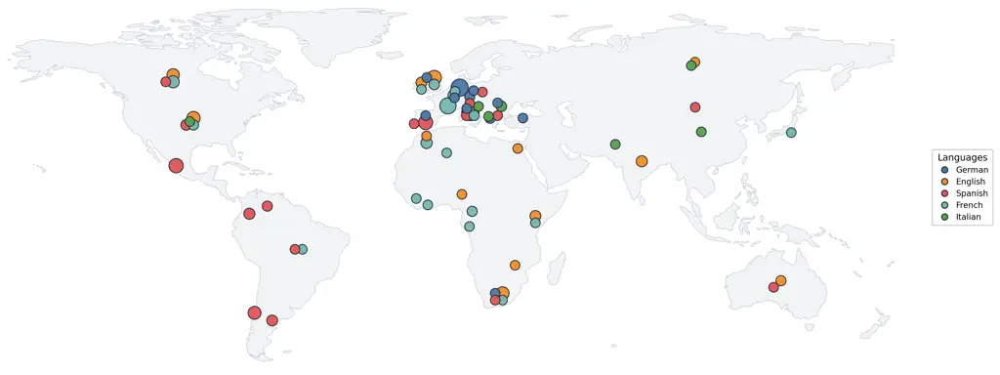

Figure 1: Geographic diversity of BabelFake. Each marker corresponds to
one or more participants, with marker size proportional to the number of
subjects collected at that location. Colors indicate the language in
which the participant was recorded. The figure illustrates the worldwide
geographic diversity of the benchmark and shows that each language
subset contains participants from multiple countries rather than a
single geographic region.

[TABLE]

Table 2: BabelFake composition by language.

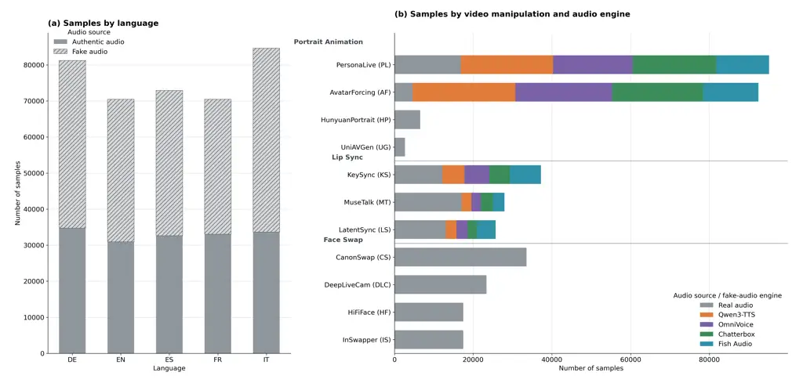

Figure 2: Composition of the generated BabelFake benchmark. (a)
Distribution of fake samples across the five supported languages. Gray
bars correspond to videos with authentic audio, while hatched bars
denote videos with synthesized speech. (b) Distribution of generated
samples across the three video manipulation categories. Colors indicate
the speech synthesis model paired with each manipulation method
(PL \[32\], AF \[28\], HP \[56\], UG \[57\], KS \[13\], MT \[58\],
LS \[30\], CS \[37\], DLC \[19\], HF \[55\], IS \[54\]). Face-swapping
methods preserve the authentic audio, whereas portrait animation and lip
synchronization are available with both authentic and synthesized
speech.

To better understand the proposed benchmark, we analyze it from multiple
perspectives, including language distribution, clip duration, and
manipulation diversity. Overall, the dataset contains $`\sim`$399k video
clips, subdivided into $`\sim`$20k real and $`\sim`$379k fake videos,
spanning $`5`$ languages and $`3`$ classes of visual plus audio
manipulations.

### 5.1 Demographic Diversity

The demographic diversity of a DeepFake benchmark is an important factor
for evaluating model robustness and reducing population-specific biases.
Beyond balancing the number of speakers across languages, BabelFake
includes participants with diverse demographic backgrounds in terms of
age, sex, ethnicity, and geographic origin. Participants range from 18
to 78 years old, with a median age of 32, and exhibit a nearly balanced
sex distribution (49.6% female and 50.4% male). The dataset also
includes participants from different ethnic backgrounds, with 72.2%
identifying as White, 11.1% Mixed, 8.7% Black, 3.6% Asian, and 4.0%
other ethnicities.

Figure 1 presents the geographic distribution of participants across
(and within) the $`5`$ languages. Rather than limiting each language to
a single region, the dataset includes speakers from diverse regions
worldwide. For example, the English bucket includes speakers from the
United Kingdom, the United States, Canada, South Africa, and several
other countries, while the Spanish and French subsets similarly comprise
participants from multiple national backgrounds. This diversity reduces
the correlation between language and nationality, encouraging models to
prioritize the manipulation artifacts over demographic or geographic
cues.

Overall,  BabelFake includes participants from 45 countries, providing
substantially broader geographic coverage than datasets collected from a
single linguistic region.

### 5.2 Language and Manipulation Distribution

As summarized in Tab. 2 and Fig. 2, BabelFake is balanced across $`5`$
supported languages, with $`98–100`$ unique participants per language;
the real and manipulated samples are roughly balanced per language. This
composition minimizes language-specific bias and supports multilingual
and cross-lingual evaluation. Fig. 2(b) illustrates the distribution
across manipulations. The benchmark combines three complementary video
manipulation categories, portrait animation, lip synchronization, and
face swapping, covering $`11`$ state-of-the-art generation methods.
Portrait animation and lip synchronization are available with both
authentic and synthesized speech, whereas face swapping preserves the
original audio, enabling controlled comparisons between visual-only and
audio-visual manipulations.

### 5.3 Clip Duration

Fig. 3 shows the distribution of clip durations in BabelFake. The shaded
regions correspond to the set of real recordings, encompassing all
languages, while the colored curves show the duration distributions of
the manipulated samples, divided by language. Most clips are between 5
and 15 seconds long, reflecting the combination of standardized reading
tasks and short spontaneous responses in the recording protocol. A small
group of clips is around 30 seconds, and corresponds to the longer
open-ended tasks.

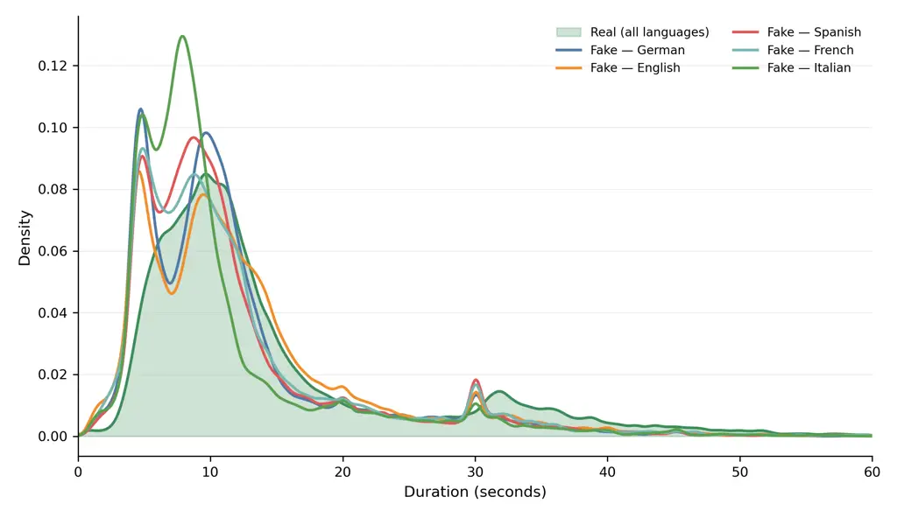

Figure 3: Distribution of clip durations in BabelFake. The shaded area
represents the real recordings; the colored curves correspond to
manipulated videos (by language). The similarity between the real and
fake distributions shows that the DeepFakes largely preserve the
temporal characteristics of the source recordings.

## 6 Benchmark Evaluation

[TABLE]

Table 3: Performance of different DeepFake detectors on the BabelFake
dataset. Models ((B)RAVEn \[22\], AVH-Align \[48\],
SpeechForensics \[33\]) are evaluated using AUC on the test set, both
overall and for each manipulation method (in order, PL \[32\],
AF \[28\], HP \[56\], UG \[57\], KS \[13\], MT \[58\], LS \[30\],
CS \[37\], DLC \[19\], HF \[55\], IS \[54\]). Bold values indicate the
best AUC for each manipulation. Avg. Audio and Avg. Video report the
average AUC across all audio-only and video-only models, respectively,
while Avg. AV reports the average AUC across the best-performing
audio-visual variants of each detector (underscored).

### 6.1 Experimental Setup

We partition BabelFake into identity-disjoint training, validation, and
test sets with a 70/10/20 split. We set up the evaluation using three
different state-of-the-art models.

SpeechForensics \[33\] is an unsupervised approach that leverages
synchronization to detect DeepFakes. It extracts AV-HuBERT \[47\]
audio-visual features and evaluates their temporal consistency. The
model is trained on LRS3 \[4\] and VoxCeleb2 \[15\] and, due to its
unsupervised nature, does not require any DeepFake-specific fine-tuning.
Similarly, AVH-Align \[48\] leverages AV-HuBERT representations and is
trained on real videos to maximize audio-visual embedding alignment. It
also supports a probing layer for supervised DeepFake detection. For the
unsupervised baseline, we use the public checkpoints trained on
AV-DeepFake-1M \[12\] (AV1M). For the supervised setting, we train
AVH-Align on MAVOS-DD \[16\] and use the available checkpoints on
FakeAVCeleb \[27\] and AV-DeepFake-1M. Finally, (B)RAVEn \[22\] is a
self-supervised representation-learning framework, adapted for DeepFake
detection via linear probing. We keep the audio-visual encoder frozen
and train a single linear layer for binary real/fake classification,
considering audio-only (-A), video-only (-V), and audio-visual (-AV)
variants. The classification heads are trained on both DeepSpeak \[9\]
and MAVOS-DD. Further details are presented in Sec. G.1.

### 6.2 Evaluation Results on BabelFake

Tab. 12 reports in-domain results, showing that it is “solvable” when
training/testing in-domain. More importantly,  Table 3 reports the
cross-dataset evaluation of state-of-the-art detectors on the test set
of the BabelFake benchmark.

Overall Performance. SpeechForensics achieves the best overall AUC
(79.79), showing robust generalization. It performs well on fully
synthetic inputs, peaking on PersonaLive \[32\] (97.01) and
AvatarForcing \[28\] (85.45) with fake audio. However, performance
degrades significantly on manipulations paired with _real_ audio, such
as KeySync \[13\] (43.75) and HiFiFace \[55\] (63.62), showing the
difficulty of detecting visual artifacts when audio cues remain
pristine.

Multimodal vs Unimodal. Multimodal evaluation consistently yields more
balanced detection performance. Under DeepSpeak training, (B)RAVEn-AV
achieves 72.05 AUC, outperforming its audio-only (60.09) and video-only
(70.31) versions. Similarly, with MAVOS-DD, (B)RAVEn-AV obtains the
highest score among the probed models. This trend is consistent across
the macro-averages, where multimodal architectures achieve an AUC of
74.27, compared to 71.44 for video-only, confirming that complementary
cross-modal information enhances generalization.

Impact of Training Data. Generalization is highly sensitive to the
training dataset. For (B)RAVEn, MAVOS-DD improves the video-only and
audio-visual variants over DeepSpeak, while the audio-only model
transfers substantially better from DeepSpeak. Training on
AV-DeepFake-1M seems to fail, potentially due to its focus on partially
manipulated samples rather than fully fake ones. At the same time,
AVH-Align Supervised on FakeAVCeleb generalizes effectively (71.37 AUC),
achieving the highest performance on the AvatarForcing subset with real
audio, which is challenging for the other models.

Weakness on Real-Audio Manipulations. Performance varies drastically
across generation techniques. In particular, KeySync \[13\] and
UniAVGen \[57\] are harder to detect, on average. Crucially, a
consistent degradation emerges across almost every evaluated method:
detection accuracy drops in the _real-audio_ scenario compared to the
fake-audio. This reveals a common weakness of current detectors when the
original audio is preserved. Interestingly, this degradation also
affects video-only models, suggesting that the resulting video quality
is impacted by using fake audio during synthesis. Overall, video
manipulations with real-audio constitute a particularly challenging
setting for current detection approaches.

### 6.3 Multilingual Generalization Results

|                 |                |       |       |       |       |       |
| --------------- | -------------- | ----- | ----- | ----- | ----- | ----- |
| Model           | Training data  | EN    | DE    | IT    | FR    | ES    |
| (B)RAVEn-A      | DeepSpeak      | 56.79 | 62.46 | 60.66 | 59.83 | 64.41 |
| (B)RAVEn-V      | DeepSpeak      | 74.84 | 71.38 | 69.99 | 68.16 | 70.22 |
| (B)RAVEn-AV     | DeepSpeak      | 78.73 | 74.73 | 71.37 | 70.35 | 73.49 |
| (B)RAVEn-A      | MAVOS-DD       | 43.30 | 45.22 | 44.58 | 45.46 | 41.69 |
| (B)RAVEn-V      | MAVOS-DD       | 71.50 | 70.63 | 75.83 | 74.64 | 71.09 |
| (B)RAVEn-AV     | MAVOS-DD       | 73.09 | 72.38 | 77.41 | 75.57 | 72.05 |
| AVH-Align       | AV1M           | 21.46 | 17.28 | 18.07 | 16.88 | 19.22 |
| AVH-Align Sup   | MAVOS-DD       | 64.04 | 69.05 | 66.88 | 66.31 | 68.77 |
| AVH-Align Sup   | FakeAVCeleb    | 75.55 | 76.37 | 68.40 | 69.47 | 67.09 |
| AVH-Align Sup   | AV1M           | 43.94 | 43.03 | 39.44 | 42.34 | 37.46 |
| SpeechForensics | VoxCeleb2&LRS3 | 80.99 | 78.91 | 77.54 | 77.73 | 83.83 |

Table 4: Per-language AUC on the BabelFake benchmark. Results are
reported separately for English (EN), German (DE), Italian (IT), French
(FR), and Spanish (ES). Bold values indicate the best performance for
each language.

Tab. 4 reports per-language performance across English (EN), German
(DE), Italian (IT), French (FR), and Spanish (ES). Individual models
exhibit different performance patterns across languages, with no
language consistently yielding the highest or lowest AUC. This
highlights the role of BabelFake as a multilingual benchmark for
exposing language-dependent variations in DeepFake detectors.

Overall Performance. SpeechForensics achieves the highest AUC across all
five languages, peaking at 83.83 on Spanish and reaching 80.99 on
English. The model demonstrates consistent cross-lingual generalization,
maintaining an AUC above 77.50 across all language splits. Furthermore,
across both (B)RAVEn training schemes, multimodal modeling (-AV)
consistently improves over video-only representations (-V) in every
language evaluated. Correlation analysis shows that performance on EN
diverges from the other languages, highlighting its “special” status in
the training data. EN correlates the most with DE, another Germanic
language. At the same time, the Romance languages (IT, FR, ES) show
strong mutual correlation.

Training Data Bias. Training distributions influence linguistic transfer
differently across detector architectures. For (B)RAVEn, MAVOS-DD
training yields stronger multimodal transfer on Romance languages such
as Italian (77.41 vs. 71.37) and French (75.57 vs. 70.35), whereas
DeepSpeak yields higher transfer on English (78.73 vs. 73.09) and German
(74.73 vs. 72.38). For AVH-Align, FakeAVCeleb supervision provides the
strongest representations overall, consistently outperforming MAVOS-DD
and AV-DeepFake-1M on almost all languages. Across all splits,
AV-DeepFake-1M yields the lowest transferability, likely due to being
focused on local manipulations.

Language Robustness. No individual language proves systematically harder
or easier across detectors. (B)RAVEn trained on MAVOS-DD performs the
best on Italian, while SpeechForensics peaks on Spanish, and AVH-Align
supervised on FakeAVCeleb performs the best on German. The absence of a
consistent ranking across languages suggests that language sensitivity
depends on the detector architecture and training data, highlighting the
importance of multilingual evaluation for assessing detector robustness.

### 6.4 Performance Across Demographic Subgroups

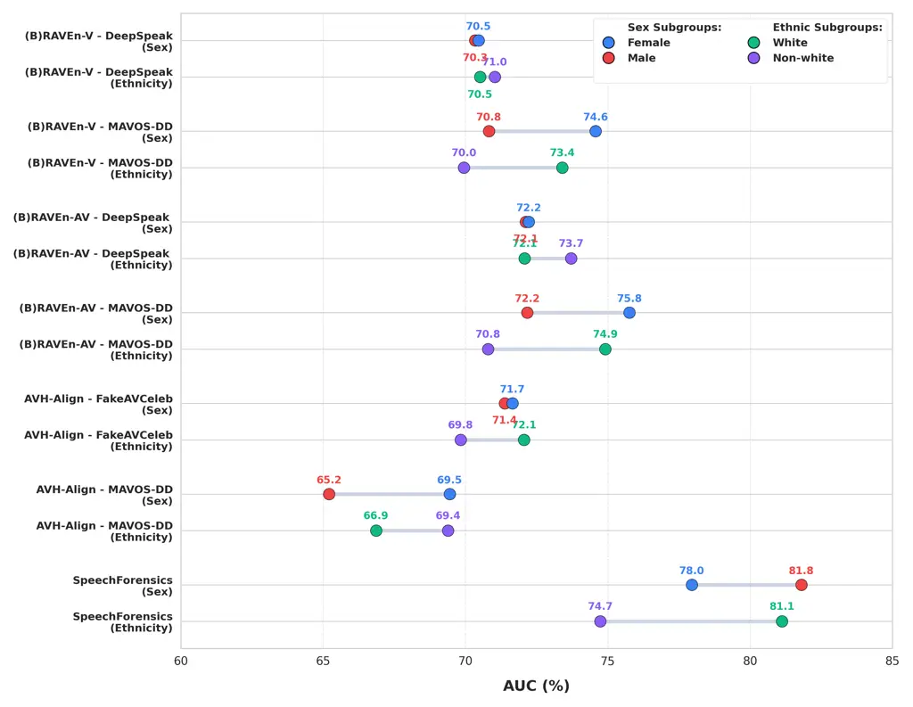

Figure 4: Demographic bias analysis across sex (Female vs. Male) and
ethnicity (White vs. Non-white) subgroups on the BabelFake test set.
Points report the AUC per subgroup, with connecting bars indicating the
performance gap across detector backbones and training datasets.

BabelFake’s design allows us to study whether detection methods exhibit
systematic demographic biases. For that, we evaluate detector
performance across reported sex (Female, Male) and ethnicity (White,
Non-white) partitions. Fig. 4 shows the subgroup AUC distributions for
each detector. In most cases, performance remains fairly balanced across
partitions. Most subgroup disparities however remain below 4 AUC points.

Sex and Ethnicity Disparities. Gaps in sex are generally tighter than in
ethnicity. For instance, (B)RAVEn-AV trained on DeepSpeak exhibits
nearly identical accuracy across female and male subjects, and AVH-Align
supervised on FakeAVCeleb shows a minor $`0.3`$ AUC gap. Larger
differences appear under MAVOS-DD training, where both (B)RAVEn-AV (75.8
vs 72.2) and AVH-Align (69.5 vs 65.2) perform significantly better on
female subjects, with gaps of $`3.6`$ and $`4.3`$ AUC points,
respectively. Similar behavior emerges across ethnicity partitions:
SpeechForensics exhibits the largest disparity across the benchmark,
achieving 81.1 AUC on White subjects compared to 74.7 on Non-white
subjects ($`\Delta=6.4`$).

Impact of Training. Demographic disparities also vary substantially with
the training distribution. Models trained on DeepSpeak exhibit small
subgroup gaps, remaining below $`1.6`$ AUC points across both sex and
ethnicity. In contrast, MAVOS-DD training produces larger disparities
for both unimodal and multimodal (B)RAVEn variants, consistently
favoring Female and White subjects.

### 6.5 Human Evaluation

[TABLE]

Table 5: Human evaluation results on a subset of 1,036 videos from the
BabelFake benchmark, annotated by 51 participants. Ratings are collected
using a four-point scale (1: Real, 2: Probably Real, 3: Probably Fake,
4: Fake). The _Deception Rate_ denotes the percentage of manipulated
videos rated as Real or Probably Real (scores $`\leq 2`$). For real
videos, the same quantity indicates the percentage correctly perceived
as genuine. The _AUC_ column reports the average AUC of the multimodal
detectors (Avg. AV in Tab. 3).

To complement the detector-based evaluation, we conduct an evaluation
with _fluent language speakers_ to assess the perceptual realism of the
manipulated videos in BabelFake, Tab 5. The ratings are collected using
a $`4`$-point scale (1: Real, 2: Probably Real, 3: Probably Fake, 4:
Fake). Based on these ratings, we define the _deception rate_ as the
percentage of fake videos perceived as Real or Probably Real (scores
$`\leq 2`$). InSwapper and CanonSwap achieve the highest deception rate
(50%), followed by AvatarForcing (47.5%), MuseTalk (43.8%), KeySync
(43.4%), and LatentSync (38.0%), while UniAVGen (26.40%) and PersonaLive
(10.90%) are more easily recognized as fake. Participants correctly
perceive 87.60% of real videos as genuine. Preserving authentic audio
substantially increases the deception rate for KeySync (38.05% to
63.33%), LatentSync (26.92% to 66.67%), and PersonaLive (7.21% to
26.93%), while having a limited impact on AvatarForcing. Overall, the
substantial deception rates across several generation techniques confirm
that BabelFake contains perceptually convincing manipulations. However,
human deception and detector performance show only a moderate inverse
correlation ($`r=-0.48`$), indicating that perceptual realism and
machine detection difficulty do not fully align. (e.g., CanonSwap and
InSwapper). See Sec. G.4 for more results.

## 7 Discussion and Limitations

Ethical Considerations and Data Distribution. The creation and
dissemination of DeepFake datasets carry inherent risks of misuse. To
mitigate these risks while supporting reproducible forensic research,
BabelFake was developed under institutional ethical guidelines. Unlike
datasets that scrape footage without consent, our participants provided
informed consent for their biometric data to be manipulated and
distributed for academic purposes. BabelFake will not be released
publicly on the open web; access will be granted behind a strict,
non-commercial research license, following institutional verification
and a data-use agreement.

Limitations and Future Work. While BabelFake significantly broadens the
linguistic scope of DeepFake benchmarks by incorporating five languages
and participants from 45 countries, it currently focuses on Germanic and
Romance languages (English, German, French, Italian, and Spanish).
Consequently, the benchmark does not capture the phonetic and
visual-speech dynamics of non-Latin-script languages (e.g., Mandarin,
Arabic, or Hindi), which remain an important avenue for future
extensions. Furthermore, although our pipeline incorporates 15
state-of-the-art generative models, the rapid pace of generative AI
means synthesis artifacts will continually evolve.

## 8 Conclusion

In this paper, we introduced BabelFake, a consent-first multilingual
audio-visual DeepFake benchmark. By combining a controlled webcam
acquisition protocol with a modular synthesis pipeline, BabelFake
disentangles visual manipulations from synthetic speech. This enables a
systematic diagnostic evaluation of state-of-the-art multimodal
detectors. Our benchmarking reveals that detection outcome strongly
depends on the audio-visual generation pairing, with substantial
performance decrease when authentic audio is preserved. Cross-lingual
evaluation shows no language consistently harder across detectors;
sensitivity instead varies across architectures and training data.
Further, fine-grained demographic evaluation exposes detector- and
training-specific subgroup disparities that can be obscured by aggregate
performance. Finally, human evaluation shows that perceptual realism and
machine-detection difficulty do not fully align. BabelFake provides a
rigorous, ethically sourced foundation for developing fair,
language-agnostic, and modality-robust DeepFake detection systems.

#### Acknowledgments.

We gratefully acknowledge support from the hessian.AI Service Center
(funded by the Federal Ministry of Research, Technology and Space,
BMFTR, grant no. 16IS22091) and the hessian.AI Innovation Lab (funded by
the Hessian Ministry for Digital Strategy and Innovation, grant no.
S-DIW04/0013/003).

## References

- \[1\] EU Artificial Intelligence Act. Article 50: Transparency
  Obligations for Providers and Deployers of Certain AI Systems — EU
  Artificial Intelligence Act, 2026. \[Accessed 27-08-2026\].
- \[2\] Ayodeji Adegboyega. Elon musk and johann rupert deepfake ads
  drew south africans into a \$61 million investment scheme, 2026.
- \[3\] Aesop. The north wind and the sun, 600 BCE. Public domain fable.
- \[4\] Triantafyllos Afouras, Joon Son Chung, and Andrew Zisserman.
  Lrs3-ted: a large-scale dataset for visual speech recognition, 2018.
- \[5\] Sai Saketh Aluru, Binny Mathew, Punyajoy Saha, and Animesh
  Mukherjee. Deep learning models for multilingual hate speech
  detection. _CoRR_, abs/2004.06465, 2020.
- \[6\] International Phonetic Association. _Handbook of the
  International Phonetic Association: A Guide to the Use of the
  International Phonetic Alphabet_. Cambridge University Press, 1999.
- \[7\] Vincent Aubanel, Maria Luisa García Lecumberri, and Martin
  Cooke. The sharvard corpus: A phonemically-balanced spanish sentence
  resource for audiology. _International Journal of Audiology_,
  53(9):633–638, 2014. PMID: 24863133.
- \[8\] Vincent Aubanel, C. Bayard, A. Strauß, and J.-L. Schwartz. The
  fharvard corpus: A phonemically-balanced french sentence resource for
  audiology and intelligibility research. _Speech Communication_,
  124:68–74, 2020.
- \[9\] Sarah Barrington, Maty Bohacek, and Hany Farid. The deepspeak
  dataset. In _Proceedings of the IEEE/CVF Conference on Computer Vision
  and Pattern Recognition (CVPR) Findings_, pages 1893–1902, 2026.
- \[10\] G. Bradski. The OpenCV Library. _Dr. Dobb’s Journal of
  Software Tools_, 2000.
- \[11\] Zhixi Cai, Shreya Ghosh, Abhinav Dhall, Tom Gedeon, Kalin
  Stefanov, and Munawar Hayat. Glitch in the matrix: A large scale
  benchmark for content driven audio-visual forgery detection and
  localization. _Computer Vision and Image Understanding_,
  236:103818, 2023.
- \[12\] Zhixi Cai, Shreya Ghosh, Aman Pankaj Adatia, Munawar Hayat,
  Abhinav Dhall, Tom Gedeon, and Kalin Stefanov. Av-deepfake1m: A
  large-scale llm-driven audio-visual deepfake dataset. In _Proceedings
  of the 32nd ACM International Conference on Multimedia_, pages
  7414–7423, 2024.
- \[13\] Antoni Bigata Casademunt, Rodrigo Mira, Stella Bounareli,
  Michał Stypułkowski, Konstantinos Vougioukas, Stavros Petridis, and
  Maja Pantic. Keysync: A robust approach for leakage-free lip
  synchronization in high resolution. _Transactions on Machine Learning
  Research_, 2026.
- \[14\] Renwang Chen, Xuanhong Chen, Bingbing Ni, and Yanhao Ge.
  Simswap: An efficient framework for high fidelity face swapping. In
  _MM ’20: The 28th ACM International Conference on Multimedia, Virtual
  Event / Seattle, WA, USA, October 12-16, 2020_, pages 2003–2011.
  ACM, 2020.
- \[15\] Joon Son Chung, Arsha Nagrani, and Andrew Zisserman. Voxceleb2:
  Deep speaker recognition. In _Interspeech 2018_, page 1086–1090.
  ISCA, 2018.
- \[16\] Florinel-Alin Croitoru, Vlad Hondru, Marius Popescu, Radu Tudor
  Ionescu, Fahad Shahbaz Khan, and Mubarak Shah. MAVOS-DD: multilingual
  audio-video open-set deepfake detection benchmark. _CoRR_,
  abs/2505.11109, 2025.
- \[17\] Maria-Gabriella Di Benedetto, Stefanie Shattuck-Hufnagel, Luca
  De Nardis, Sara Budoni, Javier Arango, Ian Chan, and Alec DeCaprio.
  Lexical and syntactic gemination in italian consonants—does a geminate
  italian consonant consist of a repeated or a strengthened consonant?
  _The Journal of the Acoustical Society of America_,
  149(5):3375–3386, 2021.
- \[18\] Brian Dolhansky, Joanna Bitton, Ben Pflaum, Jikuo Lu, Russ
  Howes, Menglin Wang, and Cristian Canton Ferrer. The deepfake
  detection challenge dataset, 2020.
- \[19\] Kenneth Estanislao, KRSHH, Max Buckley, Vic P., Dopan, Lauri
  Gates, Roland Pereira, ozp3, KUNJ SHAH, Fad, qitianai, Jan
  Badertscher, dependabot\[bot\], Highpressure, Gordon Böer, Ihor
  Kuzmychov, zuyua9, Ryanba, carpusherw, wesleySTX, Viet Nguyen, Sean
  Newell, Pedro Santos, øbook, Nimish Gåtam, Mahdi Moosavi, Jasurbek
  Odilov, Dmitry Samoylenko, David Strouk, and David Girón.
  hacksider/Deep-Live-Cam.
  https://github.com/hacksider/Deep-Live-Cam, 2025.
- \[20\] Elizabeth Cleghorn Gaskell. _Wives and Daughters: An Every-Day
  Story_. Smith, Elder & Co., 1866.
- \[21\] Eliza Gkritsi. Eu in a bind as deepfakes flood hungarian
  election campaign, 2026.
- \[22\] Alexandros Haliassos, Andreas Zinonos, Rodrigo Mira, Stavros
  Petridis, and Maja Pantic. Braven: Improving self-supervised
  pre-training for visual and auditory speech recognition. In _ICASSP
  2024-2024 IEEE International Conference on Acoustics, Speech and
  Signal Processing (ICASSP)_, pages 11431–11435. IEEE, 2024.
- \[23\] Caroline Haskins. They dedicated their lives to teaching. then
  the deepfakes started, 2026.
- \[24\] Yang Hou, Haitao Fu, Chunkai Chen, Zida Li, Haoyu Zhang, and
  Jianjun Zhao. Polyglotfake: A novel multilingual and multimodal
  deepfake dataset. In _Pattern Recognition - 27th International
  Conference, ICPR 2024, Kolkata, India, December 1-5, 2024,
  Proceedings, Part XIV_, pages 180–193. Springer, 2024.
- \[25\] Hangrui Hu, Xinfa Zhu, Ting He, Dake Guo, Bin Zhang, Xiong
  Wang, Zhifang Guo, Ziyue Jiang, Hongkun Hao, Zishan Guo, Xinyu Zhang,
  Pei Zhang, Baosong Yang, Jin Xu, Jingren Zhou, and Junyang Lin.
  Qwen3-tts technical report. _arXiv preprint arXiv:2601.15621_, 2026.
- \[26\] Yury Kartynnik, Artsiom Ablavatski, Ivan Grishchenko, and
  Matthias Grundmann. Real-time facial surface geometry from monocular
  video on mobile gpus, 2019.
- \[27\] Hasam Khalid, Shahroz Tariq, Minha Kim, and Simon S. Woo.
  Fakeavceleb: A novel audio-video multimodal deepfake dataset. In
  _Proceedings of the Neural Information Processing Systems Track on
  Datasets and Benchmarks 1, NeurIPS Datasets and Benchmarks 2021,
  December 2021, virtual_, 2021.
- \[28\] Taekyung Ki, Sangwon Jang, Jaehyeong Jo, Jaehong Yoon, and
  Sung Ju Hwang. Avatar forcing: Real-time interactive head avatar
  generation for natural conversation. In _Proceedings of the IEEE/CVF
  Conference on Computer Vision and Pattern Recognition (CVPR)_, pages
  18074–18084, 2026.
- \[29\] Patrick Kwon, Jaeseong You, Gyuhyeon Nam, Sungwoo Park, and
  Gyeongsu Chae. Kodf: A large-scale korean deepfake detection dataset.
  In _2021 IEEE/CVF International Conference on Computer Vision, ICCV
  2021, Montreal, QC, Canada, October 10-17, 2021_, pages 10724–10733.
  IEEE, 2021.
- \[30\] Chunyu Li, Chao Zhang, Weikai Xu, Jingyu Lin, Jinghui Xie,
  Weiguo Feng, Bingyue Peng, Cunjian Chen, and Weiwei Xing. Latentsync:
  Taming audio-conditioned latent diffusion models for lip sync with
  syncnet supervision. _arXiv preprint arXiv:2412.09262_, 2024.
- \[31\] Yuezun Li, Xin Yang, Pu Sun, Honggang Qi, and Siwei Lyu.
  Celeb-df: A large-scale challenging dataset for deepfake forensics. In
  _2020 IEEE/CVF Conference on Computer Vision and Pattern Recognition,
  CVPR 2020, Seattle, WA, USA, June 13-19, 2020_, pages 3204–3213.
  Computer Vision Foundation / IEEE, 2020.
- \[32\] Zhiyuan Li, Chi-Man Pun, Chen Fang, Jue Wang, and Xiaodong Cun.
  Personalive! expressive portrait image animation for live
  streaming, 2025.
- \[33\] Yachao Liang, Min Yu, Gang Li, Jianguo Jiang, Boquan Li, Feng
  Yu, Ning Zhang, Xiang Meng, and Weiqing Huang. Speechforensics:
  Audio-visual speech representation learning for face forgery
  detection, 2024.
- \[34\] Shijia Liao, Yuxuan Wang, Songting Liu, Yifan Cheng, Ruoyi
  Zhang, Tianyu Li, Shidong Li, Yisheng Zheng, Xingwei Liu, Qingzheng
  Wang, Zhizhuo Zhou, Jiahua Liu, Xin Chen, and Dawei Han. Fish audio S2
  technical report. _CoRR_, abs/2603.08823, 2026.
- \[35\] Shayne Longpre, Robert Mahari, Anthony Chen, Naana Obeng-Marnu,
  Damien Sileo, William Brannon, Niklas Muennighoff, Nathan Khazam, Jad
  Kabbara, Kartik Perisetla, Xinyi Wu, Enrico Shippole, Kurt Bollacker,
  Tongshuang Wu, Luis Villa, Sandy Pentland, and Sara Hooker. The data
  provenance initiative: A large scale audit of dataset licensing &
  attribution in ai, 2023.
- \[36\] Ilya Loshchilov and Frank Hutter. Decoupled weight decay
  regularization. In _ICLR_, 2019.
- \[37\] Xiangyang Luo, Ye Zhu, Yunfei Liu, Lijian Lin, Cong Wan, Zijian
  Cai, Shao-Lun Huang, and Yu Li. Canonswap: High-fidelity and
  consistent video face swapping via canonical space modulation, 2025.
- \[38\] Valérie Mapelli. Strange Corpus 10 – SC10 (Accents II), 2004.
  ELRA-S0114, ISLRN 024-991-750-952-3, distributed via CLARIN VLO.
- \[39\] Ziqiao Peng, Haoyu Wu, Zhenbo Song, Hao Xu, Xiangyu Zhu, Jun
  He, Hongyan Liu, and Zhaoxin Fan. Emotalk: Speech-driven emotional
  disentanglement for 3d face animation. In _IEEE/CVF International
  Conference on Computer Vision, ICCV 2023, Paris, France, October 1-6,
  2023_, pages 20630–20640. IEEE, 2023.
- \[40\] Alec Radford, Jong Wook Kim, Tao Xu, Greg Brockman, Christine
  McLeavey, and Ilya Sutskever. Robust speech recognition via
  large-scale weak supervision, 2022.
- \[41\] Resemble AI. Chatterbox-TTS.
  [https://github.com/resemble-ai/chatterbox](https://github.com/resemble-ai/chatterbox), 2025.
  GitHub repository.
- \[42\] Andreas Rössler, Davide Cozzolino, Luisa Verdoliva, Christian
  Riess, Justus Thies, and Matthias Nießner. Faceforensics++: Learning
  to detect manipulated facial images. In _2019 IEEE/CVF International
  Conference on Computer Vision, ICCV 2019, Seoul, Korea (South),
  October 27 - November 2, 2019_, pages 1–11. IEEE, 2019.
- \[43\] Ernst H Rothauser. Ieee recommended practice for speech quality
  measurements. _IEEE Transactions on Audio and Electroacoustics_,
  17(3):225–246, 1969.
- \[44\] Henry Ruhs and Harisreedhar. facefusion/facefusion.
  https://github.com/facefusion/facefusion, 2026.
- \[45\] Gerard Salton and Christopher Buckley. Term-weighting
  approaches in automatic text retrieval. _Information Processing &
  Management_, 24(5):513–523, 1988.
- \[46\] C.E. Shannon and W. Weaver. _The Mathematical Theory of
  Communication_. University of Illinois Press, 1949.
- \[47\] Bowen Shi, Wei-Ning Hsu, Kushal Lakhotia, and Abdelrahman
  Mohamed. Learning audio-visual speech representation by masked
  multimodal cluster prediction. _arXiv preprint
  arXiv:2201.02184_, 2022.
- \[48\] Stefan Smeu, Dragos-Alexandru Boldisor, Dan Oneata, and
  Elisabeta Oneata. Circumventing shortcuts in audio-visual deepfake
  detection datasets with unsupervised learning localization. In
  _Proceedings of The IEEE/CVF Conference on Computer Vision and Pattern
  Recognition (CVPR)_, 2025.
- \[49\] I. Celeste Aurora Solak and Dima Naumov. The m-ailabs speech
  dataset.
  [https://github.com/i-celeste-aurora/m-ailabs-dataset](https://github.com/i-celeste-aurora/m-ailabs-dataset), 2017.
- \[50\] Tereza Soukupová and Jan Cech. Real-time eye blink detection
  using facial landmarks, 2016.
- \[51\] Gemini Team. Gemini 2.5: Pushing the frontier with advanced
  reasoning, multimodality, long context, and next generation agentic
  capabilities. _CoRR_, abs/2507.06261, 2025.
- \[52\] Kartik Thakral, Rishabh Ranjan, Akanksha Singh, Akshat Jain,
  Mayank Vatsa, and Richa Singh. ILLUSION: unveiling truth with a
  comprehensive multi-modal, multi-lingual deepfake dataset. In _The
  Thirteenth International Conference on Learning Representations, ICLR
  2025, Singapore, April 24-28, 2025_. OpenReview.net, 2025.
- \[53\] Justus Thies, Michael Zollhöfer, Marc Stamminger, Christian
  Theobalt, and Matthias Nießner. Face2face: Real-time face capture and
  reenactment of RGB videos. In _2016 IEEE Conference on Computer Vision
  and Pattern Recognition, CVPR 2016, Las Vegas, NV, USA, June 27-30,
  2016_, pages 2387–2395. IEEE Computer Society, 2016.
- \[54\] Haofan Wang. Inswapper: One-click face swapper and restoration
  powered by insightface, 2024. \[Online; accessed 2026-07-23\].
- \[55\] Yuhan Wang, Xu Chen, Junwei Zhu, Wenqing Chu, Ying Tai,
  Chengjie Wang, Jilin Li, Yongjian Wu, Feiyue Huang, and Rongrong Ji.
  Hififace: 3d shape and semantic prior guided high fidelity face
  swapping. In _Proceedings of the Thirtieth International Joint
  Conference on Artificial Intelligence, IJCAI 2021, Virtual Event /
  Montreal, Canada, 19-27 August 2021_, pages 1136–1142.
  ijcai.org, 2021.
- \[56\] Zunnan Xu, Zhentao Yu, Zixiang Zhou, Jun Zhou, Xiaoyu Jin,
  Fa-Ting Hong, Xiaozhong Ji, Junwei Zhu, Chengfei Cai, Shiyu Tang,
  et al. Hunyuanportrait: Implicit condition control for enhanced
  portrait animation. In _Proceedings of the Computer Vision and Pattern
  Recognition Conference_, pages 15909–15919, 2025.
- \[57\] Guozhen Zhang, Zixiang Zhou, Teng Hu, Ziqiao Peng, Youliang
  Zhang, Yi Chen, Yuan Zhou, Qinglin Lu, and Limin Wang. Uniavgen:
  Unified audio and video generation with asymmetric cross-modal
  interactions, 2025a.
- \[58\] Yue Zhang, Zhizhou Zhong, Minhao Liu, Zhaokang Chen, Bin Wu,
  Yubin Zeng, Chao Zhan, Yingjie He, Junxin Huang, and Wenjiang Zhou.
  Musetalk: Real-time high-fidelity video dubbing via spatio-temporal
  sampling. _arxiv_, 2025b.
- \[59\] Han Zhu, Lingxuan Ye, Wei Kang, Zengwei Yao, Liyong Guo,
  Fangjun Kuang, Zhifeng Han, Weiji Zhuang, Long Lin, and Daniel Povey.
  Omnivoice: Towards omnilingual zero-shot text-to-speech with diffusion
  language models. _arXiv preprint arXiv:2604.00688_, 2026.

## Appendix A Informed Consent Form

As the dataset was collected from human participants, all contributors
were required to provide informed consent before participating. The
consent form describes the purpose of the study, the types of data
collected, the intended use of the recordings, the potential risks
associated with participation, and participants’ rights regarding the
deletion of their data. The full consent form used during data
collection is presented below.

### A.1 Dataset Access, Governance, and Participant Withdrawal

BabelFake will be distributed through a controlled-access system rather
than released publicly. Access will be limited to verified researchers
affiliated with academic institutions and granted for research purposes
under a data-use agreement. The agreement will prohibit unauthorized
redistribution, sharing with non-approved third parties, and misuse of
participant identities or recordings.

Access requests and authorized recipients will be recorded to enable
communication of dataset updates and participant withdrawal requests.
Dataset releases will be versioned to track changes resulting from
withdrawals or data corrections.

Participants may request the removal of their data in accordance with
the consent procedure. Upon a valid withdrawal request, we will remove
the participant’s original recordings, associated metadata, and all
derived samples that use their face or voice. The participant will
consequently be excluded from all future releases of the dataset.

Since distributed copies cannot be recalled, researchers who have
already received the dataset will be notified of the withdrawal and,
under the data-use agreement, required to delete the corresponding
participant IDs and associated data from their local copies. Subsequent
dataset versions and newly granted access will exclude the withdrawn
participant.

## Appendix B Web Application

To support large-scale, standardized data collection, we developed a
custom web-based application that guides participants through the
acquisition process. The platform manages participant registration,
informed consent, device verification, and task presentation while
recording synchronized audio and video directly within the browser. This
design ensures a consistent acquisition protocol across participants,
even when recordings are performed remotely on personal devices.

Figure 5 illustrates the main stages of the application. Participants
first review the study information and provide informed consent (Fig.5
a). Once registered, they proceed to the recording workflow (Fig.5 b),
where the application verifies the recording environment by checking the
camera, microphone, framing, and lighting while presenting the required
recording conditions (Fig.5 c). Finally, the platform presents the
recording tasks - including standardized reading, spontaneous speech,
and action-based prompts - through a unified browser interface that
records audio and video for subsequent processing (Fig.5 d).

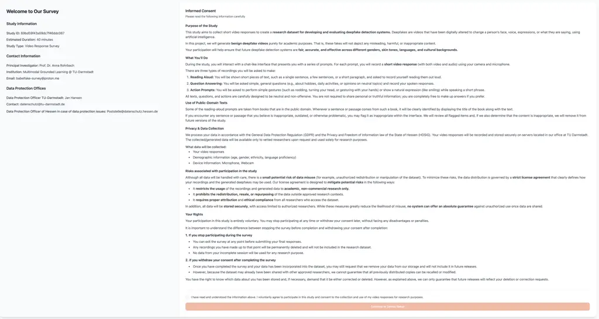

(a) Study information and informed consent.

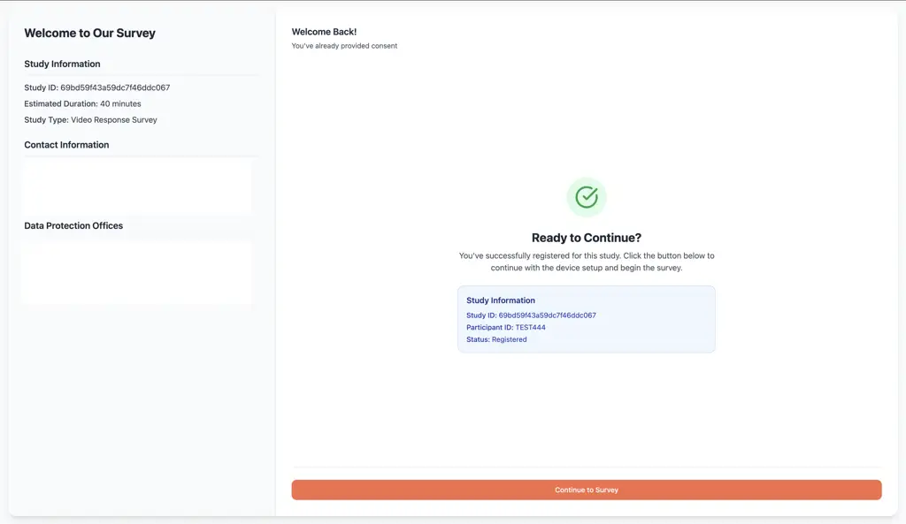

(b) Registration completed.

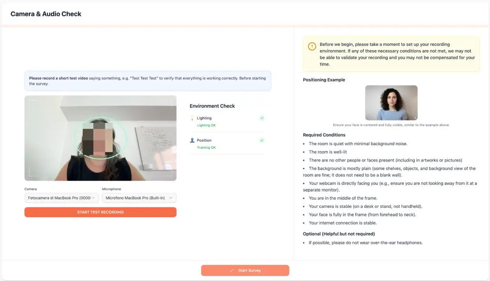

(c) Camera and audio setup with environment verification.

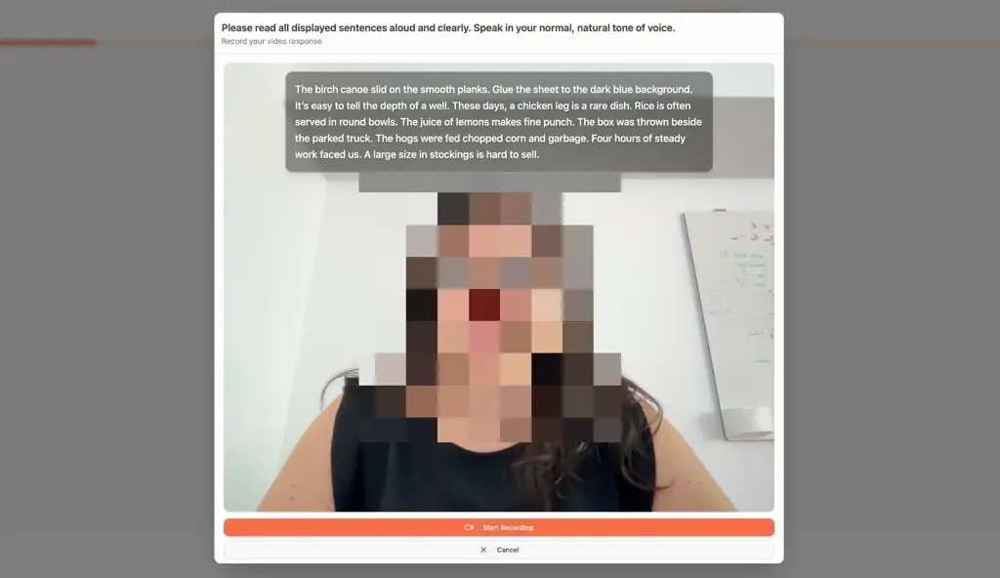

(d) Browser-based recording interface.

Figure 5: Overview of the custom web application used to collect
BabelFake. Participants first review the study information and provide
informed consent (a), after which, they can begin the survey (b). Before
recording, the platform verifies the recording environment by checking
the camera, microphone, framing, and lighting (c). Finally, participants
complete the recording tasks through a browser-based interface that
presents the prompts and captures synchronized audio and video (d).

## Appendix C Real Data Acquisition

### C.1 Participant Recruitment

We collected the dataset in four stages: one pilot study and three
subsequent collection phases. During the pilot study, we selected
participants solely on the basis of their native or fluent language,
without any additional demographic constraints. To increase accent
diversity relative to existing DeepFake datasets, our recruitment
focuses on speakers living outside the United States. Following the
pilot study, we refined the screening criteria. First, we required the
study’s target language to match the participant’s primary language and
introduced demographic-balancing targets. The goal was to recruit
approximately 48% male, 48% female, and 4% non-binary participants. We
largely achieved these targets across all language groups. However,
recruiting non-binary participants proved more challenging for some
languages. The French and German cohorts fell short of the target by one
and two participants, respectively. For the second and third English
collection phases, we restricted recruitment to native English speakers
living in the United Kingdom, the United States, Ireland, Australia,
Canada, and New Zealand.

All participants were recruited through Prolific and compensated at the
same rate of £9/hour (recommended by the Prolific platform),
irrespective of region, as payments were administered through the
UK-based platform.

### C.2 Recording Environment

Data collection was handled through a custom web-based application
hosted on institutional infrastructure, and all recordings were stored
on secure local servers. Participants complete the study using their own
devices in their usual environments. Before recording, participants were
instructed to ensure that:

- •
  The recording environment is quiet and free from excessive background
  noise;
- •
  The scene is adequately clean;
- •
  No other people or visible faces appear in the frame;
- •
  The webcam sits directly in front of the participant;
- •
  The participant’s face remains fully visible within the frame;
- •
  The camera stays stable during recording;
- •
  The internet connection is stable enough to support uninterrupted
  recording.

Unlike laboratory-controlled datasets, we collect recordings in
unconstrained home environments. This setup introduces natural
variability in the background, lighting, microphones, cameras, and
overall recording quality.

### C.3 Prompt Sources and Selection

#### Standardized Speech Material

The voice cloning component of BabelFake relies on two forms of
standardized speech material. First, participants record a
language-specific version of The North Wind and the Sun \[3\]. Phonetic
and linguistic researchers use this passage widely, and it appears in
the Handbook of the International Phonetic Association \[6\]. Because it
is available in multiple languages and offers broad phonetic coverage,
it is well-suited to cross-language speaker analysis and voice cloning.

Alongside this paragraph, participants record a set of phonetically
balanced sentences. Following the design philosophy of DeepSpeak \[9\],
which uses Harvard Sentences for English \[43\], BabelFake uses
language-specific, Harvard-style sentence collections or equivalent
phonetically balanced corpora for each language \[17, 8, 7, 38\]. The
sentence sets give us controlled speech samples with broad phonetic
coverage while keeping a natural linguistic structure.

#### Emotional and Randomized Reading Prompts

These prompts come from the M-AILABS corpus \[49\], which provides a
large collection of multilingual text, allowing for the generation of
diverse prompts across different languages and speaking styles. To
improve consistency across recordings, we filter out candidate sentences
with estimated reading times under 7 seconds or over 12 seconds. The
remaining prompts take about 10 seconds to read on average.
Additionally, to keep content safe, we run all the candidate sentences
through a hate-speech detection model \[5\]. Following this step, we
drop those sentences flagged as potentially harmful.

#### Phonetic Diversity Selection

After filtering, we convert the remaining sentences into phoneme
sequences and rank them using a phonetic richness score. We compute the
score as
$`0.5\cdot N_{\text{unique}}+0.3\cdot N_{\text{total}}+0.2\cdot L`$,
where $`N_{\text{unique}}`$ denotes the number of unique phonemes,
$`N_{\text{total}}`$ the total number of phonemes, and $`L`$ the
sentence length. Sentences were subsequently clustered using
TF–IDF \[45\] representations of their phoneme sequences, allowing
phonetically similar utterances to be grouped together and promoting
diversity in the final selection.

#### Emotion Prompts

To build the emotion reading tasks, we employ sentiment classification
on the chosen sentences, sorting each prompt into a positive, neutral,
or negative sentiment category. We use the sentiment labels as a coarse
filtering heuristic for the target emotion prompts (happy, sad,
surprised, and neutral). We pull happy prompts mostly from the positive
sentiment group, and sad prompts from the negative group. Surprised
prompts come from the remaining positive samples, and neutral prompts
come strictly from the neutral category. If we run short on prompts for
a specific category, we draw extra sentences from the neutral pool.

The final prompt set combines broad phonetic coverage, linguistic
diversity, emotional variety, and content safety,providing a diverse
basis for multilingual audio-visual data collection.

## Appendix D Textual Prompts

Below, we report the textual prompts used during data collection
together with the rationale behind the different task categories. For
clarity, we show the English version of the prompts; the same task
structure is used across all selected languages.

Table 6 reports the standardized elicitation sentences used for
controlled reading. These prompts provide short, phonetically diverse
utterances under relatively constrained speaking conditions. Table 7
contains short quick-fire questions designed to elicit brief spontaneous
responses, while Table 8 reports the open-ended questions used to obtain
longer and more natural unscripted speech.

To complement these conversational tasks with longer controlled reading
material, Table 9 lists excerpts from the public-domain novel _Wives and
Daughters_ by Elizabeth Cleghorn Gaskell. These passages were used to
collect extended read speech while avoiding copyright restrictions.

Table 10 reports the action prompts, which combine speech with
controlled head movements, gaze changes, facial expressions, hand
gestures, and other visible actions. These prompts were introduced to
increase the diversity of facial motion, pose, occlusion, and expression
present in the recordings.

Finally, Table 11 summarizes the overall task structure and the
corresponding instructions shown to participants in the recording
interface. It provides the mapping between the individual prompt types
and the higher-level stages of the data-collection procedure.

| \#  | Sentence                                    | \#  | Sentence                                    |
| --- | ------------------------------------------- | --- | ------------------------------------------- |
| 1   | The birch canoe slid on the smooth planks.  | 2   | Glue the sheet to the dark blue background. |
| 3   | It’s easy to tell the depth of a well.      | 4   | These days, a chicken leg is a rare dish.   |
| 5   | Rice is often served in round bowls.        | 6   | The juice of lemons makes fine punch.       |
| 7   | The box was thrown beside the parked truck. | 8   | The hogs were fed chopped corn and garbage. |
| 9   | Four hours of steady work faced us.         | 10  | A large size in stockings is hard to sell.  |

Table 6: Standardized elicitation sentences used for controlled reading.

| \#  | Question                                  | \#  | Question                                                    |
| --- | ----------------------------------------- | --- | ----------------------------------------------------------- |
| 1   | What is your favorite color?              | 2   | What is your favorite song or type of music?                |
| 3   | What did you do first thing this morning? | 4   | If you could live anywhere in the world, where would it be? |
| 5   | What is something you are really good at? |     |                                                             |

Table 7: Quick-fire questions used for short, spontaneous responses.

| Type                 | Question                                                       |
| -------------------- | -------------------------------------------------------------- |
| Procedural           | Please describe the steps of your morning routine.             |
| Personal narrative   | Tell me about a time you helped someone, or someone helped you |
| Emotional reflection | What is something that always makes you feel happy?            |
| Opinion              | What do you think makes a good friend?                         |

Table 8: Open-ended unscripted questions used for longer spontaneous
responses.

| Excerpt                                                                                                                                                                                  |
| ---------------------------------------------------------------------------------------------------------------------------------------------------------------------------------------- |
| but it was such an unheard-of thing for him to be sitting in that room in the middle of the day, reading or making pretence to read, that she had never thought of his remaining.        |
| Lady Cumnor and her daughters received all the school visitors at the Towers, the great family mansion standing in aristocratic seclusion in the center of the large park,               |
| But every time that Missis Gibson was struck by Cynthia’s beauty, she thought it more and more advisable that Mister Osborne Hamley should be cheered up by a quiet little dinner-party. |
| But they had understood that he was not coming to the Hall until the following week, and therefore they had felt themselves at full liberty this afternoon to follow their own devices.  |
| Then the carriage came round, and after numberless last words from the earl - who appeared to have put off every possible direction to the moment when he stood,                         |
| Molly made a point of turning the conversation from all personal subjects after this, and kept the Squire talking about the progress of his drainage during the rest of lunch.           |
| His daughter-in-law came in at the sound, and told the Squire that he had these coughing-bouts very frequently, and that she thought he would go off in one of them before long.         |
| She has brought up the young ladies at the Towers, and has a daughter of her own, therefore it is probable she will have a kind, motherly feeling towards Molly.                         |
| The small window that gave it light looked right on to the moor, as it was called; and by day the check curtain was drawn aside so that he might watch the progress of the labour.       |
| and although this attention on her part was melting the heart he tried to harden, he controlled himself into writing her the briefest acknowledgments.                                   |

Table 9: Public-domain passages from Wives and Daughters \[20\] by
Elizabeth Cleghorn Gaskell used for extended controlled reading.

| ID                                             | Instruction                                                                                                                                                                                                                |
| ---------------------------------------------- | -------------------------------------------------------------------------------------------------------------------------------------------------------------------------------------------------------------------------- |
| Lean forward and emphasize point               | \[LEAN SLIGHTLY FORWARD TOWARDS THE CAMERA\] while saying: “Let me emphasize this, this is really important:” \[Wait approx. 1 second\] then emphasize: “Pineapple on pizza is good!” \[RETURN TO THE STARTING POSITION\]. |
| Look down to the right                         | \[LOOK DOWN TO THE RIGHT\] as if you were checking something there, and say: “If I look here, I can see what’s happening on my right side.”                                                                                |
| Look down to the middle and focus              | \[LOOK SLIGHTLY DOWN TO THE MIDDLE\] Pretend you are checking a document. Name any date and briefly say that the document looks correct.                                                                                   |
| Look down to the left                          | \[LOOK DOWN TO THE LEFT\], as if you were checking something there, and say: “If I look here, I can see what’s happening on my left side.”                                                                                 |
| Look up to the left and recall                 | \[LOOK UP TO THE LEFT\], as if you were remembering something, and say: “Looking up here reminds me of the pattern on the ceiling at home.”                                                                                |
| Look up to the middle and examine              | \[LIFT YOUR GAZE UPWARDS\], as if you were examining something above you, and say: “I’m just looking up to see how everything fits together.”                                                                              |
| Look up to the right and notice                | \[LOOK UP TO THE RIGHT\], as if you were noticing something new, and say: “Oh, I can really see that corner now—I hadn’t noticed that before.”                                                                             |
| Wave hand in front of face                     | \[WAVE YOUR HAND LOOSELY FROM SIDE TO SIDE IN FRONT OF YOUR FACE\], while describing the motion: “You see how my hand moves, back and forth, back and forth.”                                                              |
| Pretend to yawn                                | \[PRETEND TO YAWN\] while saying: “I’m a little tired today.” \[OPTIONAL ACTION: COVER YOUR MOUTH WITH YOUR HAND\]                                                                                                         |
| Pretend to laugh                               | \[LAUGH BRIEFLY NATURALLY OR PLAYFULLY\] while saying: “That was hilarious!”                                                                                                                                               |
| Clap continuously, slowly, and loudly (5 sec.) | \[CLAP CONTINUOUSLY SLOWLY, LOUDLY AND AUDIBLY FOR ABOUT FIVE (5) SECONDS\]. Then say: “That’s a start. But there is still a lot to do.”                                                                                   |
| Shake head twice to say no                     | \[SHAKE YOUR HEAD TWICE CLEARLY FROM SIDE TO SIDE\] while rejecting an idea: “No, I really don’t think that’s the right approach.”                                                                                         |
| Nod twice to say yes                           | \[NOD NATURALLY TWICE\] while agreeing: “Yes, absolutely, that makes perfect sense to me.”                                                                                                                                 |
| Tilt head to the right and think               | \[TILT YOUR HEAD STRONGLY TO YOUR RIGHT SHOULDER WHILE THINKING\] “Hmm… let me think about that for a moment…” \[RETURN TO THE STARTING POSITION\] and then say: “Okay, here’s what I think.”                              |
| Tilt head to the left and think                | \[TILT YOUR HEAD STRONGLY TO YOUR LEFT SHOULDER WHILE THINKING\] “I might see this differently… let me consider…” \[RETURN TO THE STARTING POSITION\] and then say: “Yes, that’s one way to see it.”                       |
| Smile widely                                   | \[SMILE OPENLY AND HEARTILY\] while talking about something nice: “The surprise party was honestly the nicest moment in years!”                                                                                            |
| Scan the room from left to right               | \[SCAN THE ROOM SLOWLY FROM LEFT TO RIGHT\] Briefly name and describe three things (real or imaginary) that you see. Take about 10 seconds to do this.                                                                     |
| Describe object in hand                        | \[TAKE ANY OBJECT AND HOLD IT VISIBLY TOWARDS THE CAMERA\] Look at it closely and describe its details (e.g., shape, color, or material) for 15 seconds.                                                                   |

Table 10: Action prompts used during data collection.

| Type                      | Title                             | Description / Messages                                                                                                                                                                                                                                                                                                                                            |
| ------------------------- | --------------------------------- | ----------------------------------------------------------------------------------------------------------------------------------------------------------------------------------------------------------------------------------------------------------------------------------------------------------------------------------------------------------------- |
| Unscripted Answers        |                                   | Please answer the question in detail (target: approx. 30 seconds).                                                                                                                                                                                                                                                                                                |
| Voice Cloning Prompts     | Reading a short list of sentences | Please read all displayed sentences aloud and clearly. Speak in your normal, natural tone of voice.                                                                                                                                                                                                                                                               |
| Voice Cloning Prompts     | Reading a sample text             | Read the entire text aloud. Make sure to speak calmly and clearly – just as you would in everyday life.                                                                                                                                                                                                                                                           |
| Q&A Task                  | Question and answer interview     | You will see a list of questions. Read each question aloud, then answer it immediately in the same recording.                                                                                                                                                                                                                                                     |
| Interleave Reading Task   | Mixed Reading and Action Tasks    | You have successfully completed the introductory tasks. Now we will move on to the main block of data entry. In this section, different types of tasks will alternate: • Sometimes you will read sentences in a neutral tone. • Sometimes you will read sentences with a given emotion. • Some tasks combine speaking with small movements or facial expressions. |
| Standardized Reading Task | Reading standardized sentences    | Please read the displayed sentence aloud. Try to speak naturally.                                                                                                                                                                                                                                                                                                 |
| Randomized Reading Task   | Speaking with Emotion             | Read the following sentence aloud. Try to express the indicated emotion.                                                                                                                                                                                                                                                                                          |
| Action Prompts            | Action prompts with speech        | Please read the instruction and then perform the described action while speaking the provided text.                                                                                                                                                                                                                                                               |
| Introduction Questions    | Open-ended Questions              | To begin, we will show you four open-ended questions. There are no right or wrong answers. You may also make something up if you like.                                                                                                                                                                                                                            |

Table 11: Task structure and interface messages used during data
collection.

## Appendix E Generation Methods

### E.1 Audio Models

For audio generation, we employ four multilingual text-to-speech models:
Qwen3-TTS \[25\], FishAudio2 \[34\], OmniVoice \[59\], and
ChatterBox \[41\]. Qwen3-TTS is an open-source multilingual
text-to-speech model that supports zero-shot voice cloning from short
reference audio samples. The model captures speaker-specific
characteristics, such as timbre and speaking style, and generates novel
utterances that preserve the target speaker’s vocal identity. FishAudio2
provides rapid voice cloning from short reference recordings, typically
requiring only 10-30 seconds of speech. It can synthesize arbitrary
utterances while maintaining speaker characteristics and natural
prosody, enabling realistic speaker-consistent speech generation.
OmniVoice is a multilingual text-to-speech model that combines
language-agnostic speech representations with diffusion language models
to achieve high-fidelity speech synthesis and speaker transfer. Given a
short reference recording, it generates arbitrary utterances while
preserving speaker-specific attributes, including vocal timbre and
prosodic patterns. ChatterBox supports zero-shot voice cloning and
expressive speech synthesis from short reference audio. Beyond
preserving speaker identity and speaking style, the model provides
controllable emotional expressiveness, enabling diverse speech
realizations from the same speaker.

We leverage the zero-shot voice-cloning capabilities and the
multilingual nature of these models to generate realistic audio
DeepFakes. The synthesized speech is subsequently combined with video
generation engines to produce the final audio-visual fake samples.

### E.2 Video Models

Following the recent literature, we consider three categories of video
manipulation: _face swapping_, _lip synchronization_, and _portrait
animation_. Face swapping replaces the identity of a target subject
while preserving facial motion; lip synchronization alters mouth
movements to match a target speech signal without changing the speaker’s
identity; and avatar/talking-head animation synthesizes an entire facial
performance from a reference portrait or avatar.

#### FaceSwap

Face swapping replaces the identity of the target subject while
preserving facial dynamics, including head pose, facial expressions, and
eye movements. CanonSwap \[37\] performs identity transfer in a
canonical facial space, explicitly disentangling identity from facial
motion. After removing motion-related information, the source identity
is injected into the canonical representation, thereby restoring the
original facial dynamics and improving temporal consistency while
preserving expressions, head pose, and lip synchronization.
DeepLiveCam \[19\] is a real-time face swapping framework designed for
both prerecorded videos and live webcam streams. It combines robust face
detection, identity replacement, and face enhancement to generate
temporally coherent face-swapped videos with minimal user intervention.
HiFiFace \[55\] leverages a 3D shape-aware identity representation to
preserve the geometric characteristics of the source face during
identity transfer. Combined with a Semantic Facial Fusion module, it
adaptively merges source identity and target facial attributes,
producing realistic face swaps while maintaining pose, expression, and
illumination consistency. InSwapper \[54\] uses InsightFace to detect
and localize facial landmarks, aligns the source and target faces, and
then superimposes the transformed source identity onto each target
frame.

Both HiFiFace and InSwapper are generated through the FaceFusion
Library \[44\].

#### LipSynchronization

Lip synchronization modifies only the mouth region to match a target
speech signal while preserving the speaker’s identity, facial
appearance, and the remaining facial dynamics. KeySync \[13\] is a
two-stage lip synchronization framework designed to produce
high-resolution, temporally consistent talking-face videos. The method
explicitly addresses two major challenges of lip synchronization:
expression leakage from the source video and facial occlusions. It
introduces a masking strategy that suppresses undesired facial
expressions while preserving identity and background information,
resulting in realistic lip movements with improved temporal consistency
and robustness to occlusions. LatentSync \[30\] is an end-to-end
audio-conditioned latent diffusion framework. It performs lip-sync
generation directly in the latent space without relying on intermediate
motion representations. To improve temporal consistency, it introduces a
Temporal REPresentation Alignment (TREPA) module that aligns temporal
video features across consecutive frames, while enhanced SyncNet
supervision strengthens audio-visual synchronization. The resulting
videos exhibit accurate lip movements, high visual quality, and temporal
coherence. MuseTalk \[58\] is a real-time audio-driven lip
synchronization framework that generates high-quality talking-face
videos by performing latent space inpainting on the mouth region. The
method leverages a pretrained latent diffusion model, along with audio
and visual encoders, to synthesize realistic lip movements while
preserving the target identity, facial expressions, and head pose. Its
latent-space formulation enables efficient inference while maintaining
high visual fidelity and accurate audio-visual synchronization.

#### Portrait Animation

Portrait animation synthesizes an entire facial performance from a
reference portrait and a driving signal, such as audio or video. Unlike
lip synchronization, these methods jointly generate lip movements,
facial expressions, head pose, and, in some cases, upper-body motion,
while preserving the identity of the reference subject.
AvatarForcing \[28\] is a diffusion-based talking-head generation model
that animates a reference portrait from an input speech signal. By
employing a one-step streaming diffusion framework, it generates
photorealistic talking-head videos with synchronized lip movements,
stable facial identity, and temporally consistent facial dynamics,
enabling high-quality long-form avatar generation.
HunyuanPortrait \[56\] is a diffusion-based portrait animation model
that animates a reference image using motion extracted from a driving
video. It explicitly disentangles identity and motion through separate
appearance and motion representations, enabling accurate lip
synchronization while preserving facial identity and generating
realistic facial expressions, head movements, and upper-body dynamics.
PersonaLive \[32\] is a diffusion-based portrait animation model that
synthesizes expressive talking-head videos from a reference image. It
leverages hybrid motion representations to jointly model facial
expressions and head movements while preserving the subject’s identity,
and adopts a streaming diffusion framework to generate temporally
consistent animations with low latency. UniAVGen \[57\] is a unified
audio-visual generation model that jointly synthesizes synchronized
speech and talking-head videos using dual diffusion transformers.
Through asymmetric cross-modal interactions and face-aware modulation,
the model explicitly couples audio and visual generation to improve lip
synchronization, temporal consistency, and identity preservation. In our
pipeline, we employ UniAVGen for talking-head animation from speech.

#### Implementation Details

All generation methods are employed out of the box, using their publicly
available implementations. For each method, we follow the released code
and the corresponding preprocessing and inference pipelines, including
the required input preparation, face detection and alignment, audio
preprocessing, and post-processing steps, whenever applicable. We do not
introduce modifications to the underlying architectures or generation
procedures. This setup is intended to reflect each method’s publicly
released generation pipeline, support reproducibility, and provide a
representative evaluation of contemporary DeepFake generation
techniques.

## Appendix F Raw Data Processing and Audio-Visual Curation

### F.1 Real Data Preprocessing and Standardization

#### Video and Audio Encoding.

Raw recordings captured via the web-based acquisition interface are
saved in WebM format (VP8/VP9 video, Opus audio). We batch-transcode all
raw streams to MP4 using FFmpeg, re-encoding video tracks with H.264
(preserving native resolution) and audio tracks with AAC at 48 kHz.
Constant frame rates (CFR) are estimated per clip based on decoded frame
counts and total duration; whenever timestamps are non-uniform, videos
are processed in variable-frame-rate (VFR) mode to eliminate motion
jitter and temporal distortion.

#### Transcript Extraction and Refinement.

Audio transcripts are extracted using Whisper Large \[40\]. Because
these transcripts exclusively serve as intermediate text prompts for TTS
voice-cloning engines (rather than evaluation targets), word-for-word
ground-truth precision is secondary to phonetic naturalness. We utilize
Gemini 2.5 \[51\] in a zero-shot prompt setup to correct common ASR
acoustic artifacts, restore punctuation, and clean up broken sentence
boundaries, providing coherent text inputs for downstream TTS synthesis.

#### Audio-Visual Temporal Alignment.

Audio-driven lip-synchronization and talking-head models require precise
alignment between the source video and the conditioning audio. Audio
streams fed to synthesis pipelines are normalized and resampled to
16 kHz. When the source video duration exceeds the driving audio by
$`\Delta t>0.5`$ s, we trim the terminal video frames to match the
audio. If the driving audio exceeds the source video by
$`\Delta t>0.5`$ s, the pair is discarded rather than looped or frozen,
preventing synthetic temporal discontinuities from leaking into
downstream detector benchmarks.

### F.2 Best-Eye-Pose Computation

Facial landmarks are detected in each frame using the MediaPipe Face
Mesh \[26\]. Eyes’ openness was quantified using the Eye Aspect Ratio
(EAR) \[50\], computed for each eye and then averaged. We estimated head
orientation from six 2D facial landmarks and their 3D facial coordinates
by using the PnP (perspective-n-point) implementation from the OpenCV
library \[10\]. The retained frames have an average EAR of at least 0.22
and the estimated pose $`|\mathrm{yaw}|\leq 12^{\circ}`$ - so the
estimated left-right rotation of the participant’s head around the
vertical axis-, pitch deviation $`\leq 12^{\circ}`$, and
$`|\mathrm{roll}|\leq 10^{\circ}`$. Among the retained frames, we
selected the one minimizing a normalized pose-deviation score.

## Appendix G Benchmark Evaluation Details

### G.1 Dataset Preprocessing and Model Training Setup

Dataset Preprocessing For each evaluated model, we preprocess the audio
and video inputs according to the requirements of the corresponding
model and its official implementation. This ensures that each method is
evaluated using the input representation and preprocessing procedure for
which it was originally designed.

Model Setup While SpeechForensics \[33\] is evaluated with the
pretrained model provided by the authors, we train task-specific models
for AVH-Align \[48\] and (B)RAVEn \[22\]. For AVH-Align, we train the
supervised version using the code released by the authors, without
modifying any hyperparameters.

For (B)RAVEn, instead, we use the pretrained Base+ audio and video
encoders as frozen feature extractors and train a binary linear probe on
top of their representations. The encoders remain frozen throughout
training. For each 4-second input clip, we temporally average the
encoder outputs to obtain a 768-dimensional representation for each
modality. The unimodal classifiers consist of a single 768-to-1 linear
layer, while the audiovisual classifier operates on the concatenated
1536-dimensional audio-video representation. We train the linear probes
for 10 epochs using AdamW \[36\] (learning rate ($`10^{-3}`$), weight
decay ($`10^{-4}`$)) and binary cross-entropy \[46\] with logits.

### G.2 Training and testing on BabelFake

We additionally evaluate the models when trained on BabelFake training
data and tested on the test set. Results are reported in Tab. 12.
AVH-Align achieves the best performance, with an AUC of 97.37,
outperforming (B)RAVEn-AV 95.52, (B)RAVEn-V (93.47), and (B)RAVEn-A
(80.03). Overall, we confirm that the test set is “solvable” when
training and testing in-domain.

| Model       | AUC   |
| ----------- | ----- |
| (B)RAVEn-A  | 80.03 |
| (B)RAVEn-V  | 93.47 |
| (B)RAVEn-AV | 95.52 |
| AVH-Align   | 97.37 |

Table 12: AUC results when training and evaluating on BabelFake (test
set). Best performance is highlighted in bold.

### G.3  BabelFake Results Breakdown

[TABLE]

Table 13: Fine-grained benchmark evaluation across talking-head and
audio-visual generation methods decomposed by driving audio condition
(Part 1). Results are reported in AUC (%).

[TABLE]

Table 14: Fine-grained benchmark evaluation across lip-synchronization
and face-swapping manipulation methods decomposed by driving audio
condition (Part 2). Results are reported in AUC (%).

[TABLE]

Table 15: Human evaluation results across manipulation methods, with
audio manipulations breakdown. Mean Score denotes the average human
rating, while Deception Rate reports the percentage of manipulated
samples perceived as real (for real samples, the percentage correctly
perceived as real). AUC reports the average performance of the
best-performing audio-visual DeepFake detectors evaluated on the
corresponding manipulation.

In Tables 13 and 14, we report a fine-grained breakdown of audio-driven
visual manipulations. While the main benchmark aggregates results across
video synthesis pipelines by considering Fake and Real Audio, here we
further break down performance by specific driving audio conditions:
ChatterBox \[41\], FishAudio2 \[34\], OmniVoice \[59\],
Qwen3-TTS \[25\], and Real Audio. This analysis evaluates whether
detection difficulty is governed solely by the visual generation
pipeline or modulated by the underlying speech synthesis engine.

The results reveal substantial performance variation across audio
conditions, particularly for multimodal detectors. For example, the
average audio-visual AUC on LatentSync \[30\] ranges from 58.57 with
Real Audio to 74.32 with OmniVoice; similarly, on KeySync \[13\],
performance ranges from 52.94 with Real Audio to 66.39 with OmniVoice.
This sensitivity varies across visual engines: PersonaLive \[32\]
remains consistently detectable across audio sources (78.79–81.23 AUC),
whereas KeySync and LatentSync exhibit larger shifts depending on the
driving audio. These results show that detection performance depends not
only on the visual synthesis method, but also on the specific pairing of
audio and visual generation techniques.

Modality-specific averages further highlight the role of joint
audio-visual modeling. Across the full benchmark, audio-only models
achieve an average AUC of 52.01, compared with 71.44 for video-only and
74.27 for multimodal architectures. However, the magnitude of this
multimodal gain varies considerably across synthesis pairs, indicating
that the usefulness of cross-modal cues depends on the artifact profile
introduced by each generation pipeline.

### G.4 Human Evaluation Breakdown

We extend the human evaluation reported in the main paper with a
finer-grained analysis of audio-driven manipulations, as shown in
Table 15. Specifically, while the main paper reports results aggregated
by video manipulation method, here we additionally break down KeySync,
MuseTalk, LatentSync, AvatarForcing, and PersonaLive by audio
manipulation. This allows us to examine how different voice-generation
methods affect the perceived realism of the resulting audio-visual
manipulations.

As in the main paper, real videos provide a reference baseline and are
perceived as real in 87.6% of the evaluations. Among manipulated
samples, however, the human deception rate varies substantially both
across video manipulation methods and across audio conditions. For
example, KeySync achieves an overall deception rate of 43.4%, but this
ranges from 25.00% with FishAudio2 to 63.33% with real audio. Similarly,
for LatentSync, the deception rate ranges from 17.40% with OmniVoice to
66.67% with real audio. These differences indicate that the perceived
realism of an audio-driven manipulation depends not only on the visual
generation method, but also on the audio used to drive it.
Interestingly, the effect of a given audio-generation method is not
consistent across visual methods, suggesting an interaction between the
audio and visual components rather than a single voice-cloning method
being systematically more deceptive.

For comparison with automated detection, we additionally report the
average AUC of the best-performing audio-visual deepfake detectors for
each condition. Human and machine difficulty do not necessarily follow
the same trend. For instance, CanonSwap and InSwapper are perceived as
real in 50.00% of human evaluations, while the corresponding average
detector AUCs remain 76.59 and 72.42, respectively. More generally, the
results suggest that perceptual realism is insufficient to characterize
detection difficulty: manipulations that are convincing to human
observers may still contain discriminative audio-visual cues that are
exploitable by automated detectors, while the relative difficulty of
individual audio conditions can differ between humans and detection
approaches.

## Appendix H Qualitative Analysis

To complement the quantitative evaluation, we qualitatively examine
representative examples from BabelFake across the three visual
manipulation categories: portrait animation, lip synchronization, and
face swapping. Figs. 6, 7, and 8 illustrate the diversity of outputs
produced by the different generation pipelines included in the
benchmark.

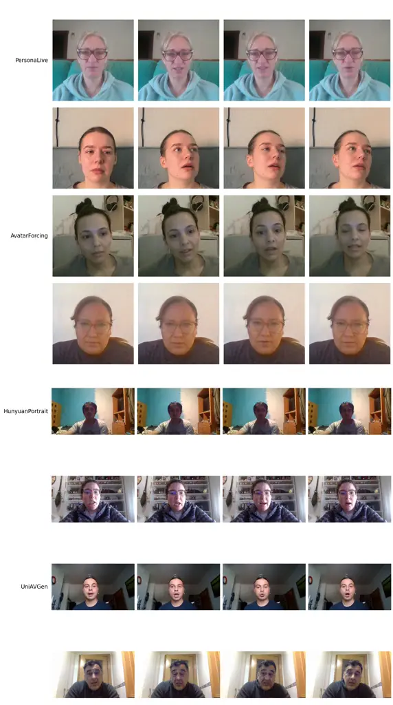

Figure 6: Qualitative examples of portrait animation manipulations in
BabelFake. Each row shows consecutive frames from a manipulated video
generated with a different method. From top to bottom:
PersonaLive \[32\], AvatarForcing \[28\], HunyuanPortrait \[56\], and
UniAVGen \[57\].

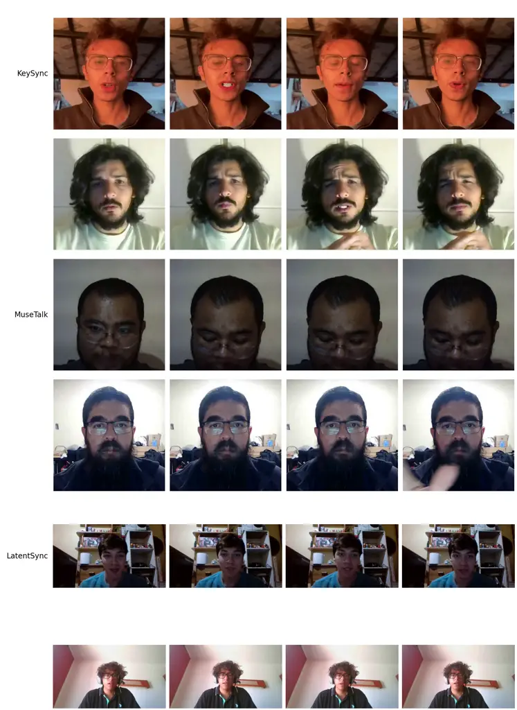

Figure 7: Qualitative examples of lip-synchronization manipulations in
BabelFake. Each row shows consecutive frames from a manipulated video
generated with a different method. From top to bottom: KeySync \[13\],
MuseTalk \[58\], and LatentSync \[30\].

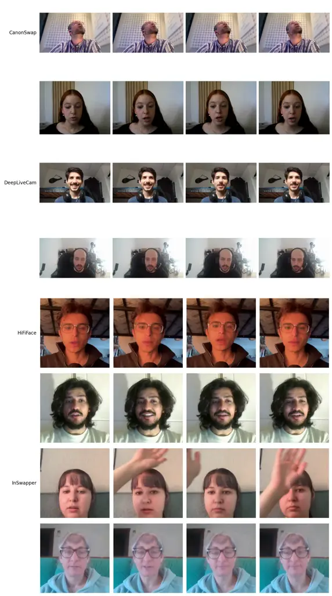

Figure 8: Qualitative examples of face-swapping manipulations in
BabelFake. Each row shows consecutive frames from a manipulated video
generated with a different method. From top to bottom: CanonSwap \[37\],
DeepLiveCam \[19\], HiFiFace \[55\], and InSwapper \[54\].
