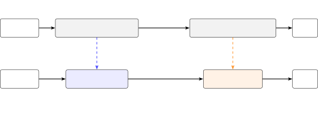

# Paradee: Distilling Kokoro-82M into an 8M-Parameter Single-Voice Text-to-Speech Model

Sahil Mahendrakar

September 2026

###### Abstract

We distill Kokoro-82M, a widely used open text-to-speech model with 54
voices, into Paradee, an 8.07M-parameter model that speaks one of them.
Paradee keeps Kokoro’s architecture with much narrower layers, and each
of its two halves is trained separately against the frozen teacher. It
has 10$`\times`$ fewer parameters and needs 15$`\times`$ less compute.
We first synthesize a corpus with the teacher and keep its durations,
pitch, energy and phoneme features. We then train a small text side to
predict these values, and a small decoder to turn the teacher’s saved
values into the teacher’s audio, first with spectral losses and then
adversarially. Finally, we connect the two halves and quantize the
weights to int8. It needs no alignment learning and no joint training,
and it runs on one laptop. Stored in int8, Paradee is 8.5 MB, runs
25$`\times`$ faster than real time on one CPU thread, and scores 4.41 on
UTMOS against the teacher’s 4.52. The student initially kept a slight
buzz, which we trace to the phase of voiced speech between 2 and 8 kHz.
A phase-locking filter applied after synthesis removes most of it, with
no training and no extra parameters. Code, model files and audio samples
are at
[github.com/sahilmahendrakar/paradee](https://github.com/sahilmahendrakar/paradee).

## 1 Introduction

Text-to-speech that runs on the device, without a server, has to be
small enough to ship, fast enough to run faster than real time on a CPU,
and natural enough to listen to for long stretches. Kokoro-82M \[11\] is
a widely used open-weight text-to-speech model with high naturalness for
its size. It is derived from StyleTTS 2 \[31\] and ships 54 voices, but
it has 82 million parameters and needs 55 GFLOP per second of audio.

Many applications only ever use one voice. We ask how small Kokoro can
get if it has to speak just one voice, and whether that can be done
cheaply. Its authors trained it with about 1,000 A100 GPU-hours \[11\],
whereas we want a student that can be distilled and run on one laptop.

Our approach follows the structure of the teacher (Figure 1). Kokoro has
two halves. The text side predicts durations, pitch, energy and phoneme
features, and the decoder turns them into audio. We first run the
teacher on 12,000 English sentences. For each one we save the audio it
produced along with the values it computed on the way, namely the
duration of each phoneme, the pitch and energy contours, and the phoneme
features passed to the decoder. These saved outputs are the training
data for both halves of the student.

We then shrink each half and train it separately against the teacher,
which stays frozen, meaning its weights are never updated and it only
supplies targets. The student text side reads the phonemes and learns to
predict the teacher’s saved durations, pitch, energy and phoneme
features. The student decoder is given the teacher’s saved durations,
pitch, energy and phoneme features as input and learns to reproduce the
teacher’s saved audio from them. Because each half trains against fixed
teacher outputs, no alignment has to be learned.

To join them, we connect the student text side’s outputs to the student
decoder’s inputs. At inference the text side reads the phonemes and
predicts a duration for each one. These durations stretch its phoneme
features to one per audio frame, and it then predicts pitch and energy
for every frame. The decoder turns these into audio, and nothing is
retrained after the halves are joined. Last, we quantize the weights to
8-bit integers, which makes the model four times smaller with no
measurable change in UTMOS.

The result, Paradee, has 8.07M parameters (10$`\times`$ fewer than the
teacher’s 81.8M) and needs 15$`\times`$ less compute. Stored in int8, it
is 8.5 MB, runs 25$`\times`$ faster than real time on one CPU thread,
and scores 4.41 on UTMOS \[44\] against the teacher’s 4.52.

Our contributions are:

1.  1.  A simple single-voice distillation method (Section 4). Each half is
        distilled separately against the frozen teacher and the halves are
        joined without joint training. It needs no alignment learning and no
        teacher at inference time, and it trains on one laptop.
2.  2.  What we learn from distilling the halves separately (Section 6).
        Pairing each student half with the other half of the teacher shows
        what each one costs. A 4.2M text side scores UTMOS 4.36 through the
        teacher’s decoder, and a 7.1M one does no better. The 3.9M decoder
        scores 4.37 from the teacher’s text side. Together the two halves
        score 4.39, so their errors do not add up. For the decoder, the
        balance of the training losses matters more than its size. Lowering
        the weight of the spectral loss so that the adversarial critics
        could take effect raised UTMOS from 3.0 to 4.4, while making the
        decoder wider or twice as large did not help. Finally, the text side
        must be trained to match the teacher’s durations, pitch, energy and
        phoneme features directly. A text side trained instead to make the
        teacher’s decoder sound good reached the teacher’s own score with
        that decoder, but fell to 3.78 with the student decoder, against
        4.39 for the directly trained one.
3.  3.  A map of where Kokoro spends its parameters and compute (Section 3).
        The waveform generator is a quarter of the parameters but 89% of the
        compute, and the small text side is the part most sensitive to
        quantization.
4.  4.  A diagnosis and fix for the student’s residual buzz (Section 7).
        Listening tests place it in the phase of voiced speech between 2 and
        8 kHz, just above where Kokoro’s harmonic excitation stops, and a
        training-free phase-locking filter removes most of it.

## 2 Background

Kokoro follows the StyleTTS 2 design \[31, 28\]. Text is converted to
phonemes, and the model then works in two halves (Figure 1, top), both
of which receive a style vector that selects the voice.

The text side decides what to say and how. A phoneme-level BERT \[30\]
with the ALBERT architecture \[25\] reads the phonemes, and a prosody
predictor turns them into a duration for each phoneme, a pitch contour
(F0) and an energy contour. A separate text encoder produces 512-channel
features that describe the sound of each phoneme (we call them the
_phoneme features_). After they are stretched by the durations, they are
passed to the decoder.

The acoustic side, or decoder, decides what the waveform looks like. It
works in two stages. First, a stack of residual convolutional blocks
with adaptive instance normalization (AdaIN) \[14\] combines the phoneme
features with the pitch and energy contours, conditioned on the style
vector. These blocks account for 41% of Kokoro’s parameters. Then a
waveform generator, an iSTFTNet \[16\] built on HiFi-GAN \[22\], turns
the result into audio at 24 kHz. To help it produce voiced sounds, the
generator is also given a tone computed from the predicted pitch, made
of sine waves at the pitch and its first eight overtones \[49\].

Figure 1: Kokoro’s two halves (top) and Paradee’s (bottom). Each student
half learns from the frozen teacher separately (dashed arrows). At
inference the two student halves are connected and turn phonemes into
audio on their own, without the teacher.

## 3 Analysis of the teacher

Before training anything, we measured how Kokoro’s parameters and
compute are divided among its parts and how sensitive each part is to
quantization. These decide which part must shrink most. All measurements
use Kokoro-82M v1.0 with voice af_heart on an Apple M4 Pro.

#### Parameter and compute breakdown.

Figure 2 and Table 1 split the model into three parts. The text side
holds 35% of the parameters, the decoder’s AdaIN blocks 41% and the
generator 24%. The compute is split very differently. The generator
performs 89% of the 55 GFLOP needed per second of audio, because its
last stages run convolutions at 60$`\times`$ the frame rate. The text
side is under 10%. So on a CPU, run time is dominated by the generator’s
per-sample convolutions, not by the parameter count. Any large speed-up
therefore has to come from shrinking the generator, whatever happens to
the text side.

Figure 2: Share of Kokoro’s parameters and of its compute (FLOPs per
second of audio) in each part. The text side is ALBERT, the text encoder
and the prosody predictor. The waveform generator is a quarter of the
parameters but almost all of the arithmetic.

| Subsystem                                                       | Parameters | Share |
| --------------------------------------------------------------- | ---------- | ----- |
| Decoder AdaIN encode/decode blocks (1024 channels)              | 33.6M      | 41%   |
| Decoder iSTFTNet generator                                      | 19.7M      | 24%   |
| LSTMs (text encoder and prosody predictor)                      | 11.2M      | 14%   |
| ALBERT (12 shared layers, 768 hidden) and its output projection | 6.7M       | 8%    |
| F0, energy and duration heads                                   | 6.6M       | 8%    |
| Text encoder CNN and phoneme embedding                          | 4.0M       | 5%    |
| Total (PyTorch)                                                 | 81.8M      |       |

Table 1: Parameter census of Kokoro-82M v1.0.

#### Quantization sensitivity.

Storing Kokoro’s weights in 8 bits barely changes its output, and every
quantized version of the teacher we tried still scored 4.52–4.54 on
UTMOS. The small text side is the most sensitive part, because a
slightly changed duration shifts every sound that follows. The common
int8 download of Kokoro sounds worse mainly because it also quantizes
activations. Appendix B gives the full breakdown.

## 4 Method

### 4.1 Single-voice specialization

Paradee is trained for a single voice, af_heart. Because the voice is
fixed, we remove the style input from both halves of the student and
replace it with a learned constant vector. In Kokoro, the style vector
for a given voice also changes with the length of the utterance, so the
student has to learn this dependence on length from the training data.

### 4.2 Teacher corpus

We synthesized 12,000 English sentences from WikiText-103 \[35\] with
the teacher, 23.9 hours of audio. For every sentence we stored the
phonemes, the predicted durations, F0 and energy contours, the phoneme
features and the waveform (6.9 GB). Waveforms were generated on CPU with
a fixed seed per sentence so the excitation can be reproduced exactly,
since Kokoro’s output differs slightly between CPU and GPU. The first
200 sentences are held out for evaluation.

### 4.3 Student architecture

Each student half is Kokoro’s own code with smaller widths, so every
student layer has a teacher counterpart to learn from.

#### Text side (4.23M parameters).

It has an ALBERT with 256 hidden units, 6 layers and 4 heads, and a
prosody predictor and text encoder with 192 channels and 3 layers. A
2-layer MLP projects the 192-channel text features up to the 512
channels the decoder expects. We also trained a variant with a linear
projection (4.0M) and a wider one (7.1M).

#### Decoder (3.85M parameters).

The decoder keeps Kokoro’s layout, with 256 channels in the AdaIN blocks
instead of 1,024 and 128 in the generator instead of 512. It also keeps
Kokoro’s upsampling factors, kernel sizes (3, 7, 11), excitation module
and iSTFT head. The whole decoder needs 3.36 GFLOP per second of audio,
15$`\times`$ less than the teacher’s decoder, and its generator has
1.19M parameters. Table 8 in the appendix lists the other sizes we
built.

### 4.4 Training

#### Text side.

The student reads phonemes and is trained, with the teacher’s durations
given (teacher forcing), to predict the teacher’s log durations, pitch,
energy and phoneme features with L1 losses. We train it for 8,000 steps
at batch size 32 with AdamW and a learning rate of $`5\times 10^{-4}`$.

#### Decoder.

The student decoder is fed the teacher’s own phoneme features, pitch and
energy and trained to reproduce the teacher’s waveform on 1.6 s
segments. Stage one uses only spectral losses, which compare how loud
each frequency is over time in the student’s audio and the teacher’s,
ignoring phase. The first is a log-mel L1 loss, which compares
spectrograms on the mel scale, a frequency scale spaced the way human
hearing works. The second is a multi-resolution STFT loss \[50\], which
compares ordinary spectrograms at three resolutions (FFT sizes 512, 1024
and 2048). Stage one runs for 50,000 steps at batch size 16 and a
learning rate of $`2\times 10^{-4}`$. Stage two adds HiFi-GAN-style
adversarial training \[22\], in which small discriminator networks learn
to tell the student’s audio from the teacher’s and the student learns to
fool them. We use a multi-period discriminator (periods 2, 3, 5, 7 and 11) and a multi-resolution spectrogram discriminator \[15\], 3.2M
parameters together, with least-squares GAN losses and feature matching,
at batch size 8. We ran 5,000 steps with the spectral losses weighted 10
times the adversarial loss, then 5,000 more with them weighted 3 times.

#### Assembly.

The two halves are then connected with no joint training, as described
in Section 1.

### 4.5 Phase-locking filter

After synthesis, a filter with no parameters corrects the phase of
voiced speech between 2 and 8 kHz. Section 7 describes and evaluates it.

### 4.6 Post-training quantization

Every weight matrix is quantized to int8 per output channel with an fp16
scale, and all other parameters are kept in fp16. Saved this way, the
whole model is an 8.45 MB file, against 32.5 MB in fp32.

## 5 Experimental setup

#### Metrics.

_DTW log-mel L1_ compares the spectrogram of a rendition with the
teacher’s after aligning the two in time with dynamic time warping
(DTW), which locally stretches or compresses one of them so that
matching sounds line up. A rendition that is slightly faster or slower
is therefore not penalized for timing alone. It is good for
teacher-forced comparisons where timing is fixed, but it saturates for
free-running students, whose valid prosody differs from the teacher’s (a
3% speed change alone scores 0.36). *UTMOS* \[44\] is a neural network
trained on human ratings to predict the mean opinion score (MOS) that
listeners would give a clip for naturalness, on a scale from 1 (bad) to
5 (excellent). We use its utmos22_strong checkpoint, and it is our main
metric for comparing free-running students. All UTMOS scores are
averages over the 200 held-out sentences. The 95% confidence interval of
the mean is $`\pm 0.003`$ for the teacher and between $`\pm 0.01`$ and
$`\pm 0.04`$ for the students. _Word error rate_ (WER) comes from
transcribing the audio with Whisper (base) and comparing it with the
source text. It measures intelligibility, and it barely separates our
models, so we report it only for the main result. _Speaker similarity_
is the cosine between Resemblyzer speaker embeddings \[43\] of a
system’s utterance and the teacher’s utterance of the same sentence. We
also compared samples by listening throughout, which the author did
informally.

#### Hardware.

All training ran on one MacBook Pro (Apple M4 Pro, 24 GB) using the MPS
backend. Speed is measured on the same machine on one CPU thread, over 8
held-out sentences (about 61 seconds of audio), excluding
grapheme-to-phoneme conversion for both models.

## 6 Results

### 6.1 Main result

|                                          | Kokoro-82M (teacher)         | Paradee (student)             |
| ---------------------------------------- | ---------------------------- | ----------------------------- |
| Parameters                               | 81.8M                        | 8.07M (10.1$`\times`$ fewer)  |
| Weights on disk                          | 325 MB fp32 ONNX; 82 MB int8 | 8.45 MB int8                  |
| Compute per second of audio              | 55 GFLOP                     | 3.4 GFLOP (15$`\times`$ less) |
| Speed, PyTorch, 1 CPU thread             | 7.6$`\times`$ real time      | 25.0$`\times`$ real time      |
| Decoder alone, onnxruntime, 1 CPU thread |                              | 20.5$`\times`$ real time      |
| UTMOS, fp32                              | 4.52 $`\pm`$ 0.003           | 4.41 $`\pm`$ 0.01             |
| UTMOS, int8                              |                              | 4.41 $`\pm`$ 0.01             |
| Whisper WER                              | 5.7%                         | 5.7%                          |
| Speaker similarity to the teacher        |                              | 0.958 $`\pm`$ 0.002           |

Table 2: Paradee against its teacher. The student uses the 4.23M text
side (feature-supervised, MLP projection), the 3.85M decoder after both
training stages, and the phase-locking filter. UTMOS, WER and speaker
similarity are over 200 held-out sentences, with 95% confidence
intervals.

Table 2 compares Paradee with its teacher. With a tenth of the
parameters and a fifteenth of the compute, Paradee scores 4.41 on UTMOS
against the teacher’s 4.52, has the same word error rate, and runs 3.3
times faster on one CPU thread. Speed improves less than compute
(3.3$`\times`$ against 15$`\times`$) because at this size PyTorch’s
per-operation overhead on small convolutions and LSTMs dominates. The
phase-locking filter takes 5% of the run time. Int8 weights cost nothing
measurable (UTMOS 4.41 in both cases), and intelligibility is the same
as the teacher’s (WER 5.7% for both). Quantizing to 4 bits, however,
lowered the decoder’s UTMOS to 3.98 in an earlier test on 3 sentences,
although the teacher’s much larger decoder blocks changed little at 4
bits (Appendix B). A small model has no redundant channels left to
absorb the rounding.

Paradee keeps the teacher’s voice. Its speaker similarity to the teacher
on the same sentences is 0.958. For reference, a different Kokoro voice,
af_bella, reading the same sentences scores 0.842.

| Model (voice)                  | Params | File size | Speed          | UTMOS              | WER  |
| ------------------------------ | ------ | --------- | -------------- | ------------------ | ---- |
| Kokoro-82M, teacher (af_heart) | 81.8M  | 325 MB    | 7.6$`\times`$  | 4.52 $`\pm`$ 0.003 | 5.7% |
| Paradee (af_heart)             | 8.07M  | 8.45 MB   | 25.0$`\times`$ | 4.41 $`\pm`$ 0.01  | 5.7% |
| Paradee, released ONNX file    | 8.07M  | 9.0 MB    | 17.8$`\times`$ | 4.41               | 6.0% |
| Kokoro-7M-Distill (af_msa)     | 7.48M  | 30.1 MB   | 35.5$`\times`$ | 4.18 $`\pm`$ 0.03  | 7.4% |
| Piper, en_US-lessac-medium     | 15.7M  | 63.2 MB   | 15.4$`\times`$ | 4.36 $`\pm`$ 0.02  | 8.8% |
| KittenTTS nano 0.8 (Bella)     | 14.0M  | 56.8 MB   | 10.7$`\times`$ | 4.01 $`\pm`$ 0.04  | 5.5% |

Table 3: Paradee against other small open models on the same 200
held-out sentences, with the same scoring. File size is the model as
distributed (Paradee int8, the others fp32). Speed is real-time factor
on one CPU thread of the same machine. Paradee and the Kokoro models are
timed from phonemes. Piper and KittenTTS are timed from text, so their
times include phonemization. Each model speaks its own voice, so UTMOS
compares naturalness, not closeness to af_heart.

Table 3 compares Paradee with three small open models. It also lists the
released version of Paradee, a single int8 ONNX file with the
phase-locking filter built in, measured on the same sentences. It is
slightly larger and slower than our PyTorch model because of how the
model and filter are packaged, and its quality is the same. Paradee
scores highest on UTMOS among them and has the smallest file.
Kokoro-7M-Distill \[36\], the closest in design, runs about 1.4 times as
fast but scores 0.23 lower on UTMOS, and KittenTTS \[21\] has the lowest
word error rate.

### 6.2 Text-side students

| Text side, rendered by the teacher decoder          | Params | DTW log-mel  | UTMOS |
| --------------------------------------------------- | ------ | ------------ | ----- |
| Teacher text side                                   | 28M    | 0.12 (floor) | 4.52  |
| Student s, linear projection                        | 4.0M   | 0.97         | 4.15  |
| Student s, MLP projection                           | 4.2M   | 0.91         | 4.36  |
| Student m, MLP projection                           | 7.1M   | 0.89         | 4.35  |
| Student s, MLP, trained through the teacher decoder | 4.2M   | 0.99         | 4.52  |

Table 4: Text-side students, each rendered by the frozen teacher decoder
on the 200 held-out sentences. The teacher row’s DTW is the teacher
against a second run of itself with a different random seed. The last
row adds a log-mel loss on audio produced by passing the student’s
outputs through the frozen teacher decoder. It has the worst DTW but the
best UTMOS, because it learns prosody that sounds natural but differs
from the teacher’s rendition.

We first tested each student text side by plugging it into the frozen
teacher decoder (Table 4).

#### Effect of size.

Growing the text side from 4.2M to 7.1M improved every teacher-forced
loss slightly but left the free-running result unchanged (DTW 0.91
against 0.89, UTMOS 4.36 against 4.35). The remaining gap is set by the
training objective, not capacity.

#### Feature projection.

The teacher’s 512 phoneme-feature channels are highly redundant. About
190 dimensions hold 90% of their variance and 430 hold 99%. A student
with 192 channels and a linear projection can express at most 192 of
those dimensions, and it came close to the best error any such
projection allows (0.079 against 0.068), so the projection, not the
student, was the limit. Replacing the linear projection with a small
two-layer network (an MLP) removed this limit. Its error fell to 0.066,
below what any linear projection can reach, and UTMOS rose from 4.15 to
4.36. To see where the remaining error comes from, we took one kind of
output at a time from the student and the rest from the teacher, and
measured the distance to the teacher’s audio on 8 held-out sentences.
Compared with the teacher’s own floor of 0.12, student phoneme features
add about 0.47, student pitch and energy about 0.35, and student
durations only about 0.13.

#### Training through the teacher decoder.

We also tried giving the text side one more training objective. Its
predictions are passed through the frozen teacher decoder, and the
resulting audio is compared with the teacher’s recording using a log-mel
loss. This lifted the 4.2M text side to the teacher’s own score (4.52).
But those features were specialized to the teacher’s decoder. Connected
to Paradee’s student decoder, they scored 3.78, while the text side
trained on the teacher’s values directly scored 4.39 with the same
decoder. Features learned by matching the teacher’s features transfer to
a new decoder, and features learned by pleasing one particular decoder
do not. Paradee therefore uses the feature-supervised text side.

### 6.3 Decoder students

| Decoder A (3.85M) training                                  | Decoder alone | Full student |
| ----------------------------------------------------------- | ------------- | ------------ |
| Spectral losses only, 50k steps                             | 2.98          | 3.00         |
| + adversarial, spectral weight 45, 3k steps                 | 3.02          |              |
| + adversarial, spectral weight 10, 5k steps                 | 4.29          | 4.32         |
| + adversarial, spectral weight 3, 5k more steps (stage two) | 4.37          | 4.39         |
| + phase-locking filter (Paradee)                            |               | 4.41         |

Table 5: UTMOS of the student decoder (driven by the teacher’s text
side) and of the full student, over 200 held-out sentences. The teacher
scores 4.52.

With spectral losses alone the small decoder converged to a DTW distance
of 0.50 but scored only 2.98 on UTMOS (Table 5). At this point the full
student sounds like the af_heart voice with a second, robotic voice
speaking at the same time. Spectrograms show why. The student keeps
crisp harmonic stripes up to 6–8 kHz, whereas the teacher’s harmonics
dissolve into breathy noise above 3–4 kHz, so the sine excitation leaks
through almost unchanged. Level, frequency balance and silence were all
correct.

Adversarial training fixes most of this, but only once the critics are
allowed to matter. With HiFi-GAN’s default spectral weight of 45, the
spectral term outweighed the adversarial terms about 15 to 1, and UTMOS
barely moved in 3,000 steps (2.98 to 3.02). Lowering the weight to 10
and then 3 raised the decoder to 4.37 and the full student to 4.39. The
phase-locking filter adds little to UTMOS (4.39 to 4.41) but is what
removes most of the audible buzz (Section 7).

#### Joining the halves.

With spectral-only decoders, the student text side through the teacher
decoder scored 0.87 on DTW, the teacher text side through the student
decoder 0.50, and the full student 0.81, better than the text side
alone. The teacher decoder, trained on exact features, amplifies small
feature errors. The student decoder, trained on audio, is more
forgiving. Measuring each half against the other teacher half therefore
overstates what the combination loses, and we did not need joint
training. The final models show the same on UTMOS. The student text side
through the teacher decoder scores 4.36 and the teacher text side
through the student decoder 4.37, each about 0.15 below the teacher, yet
the full student scores 4.39 before the filter.

## 7 Residual buzz and the phase-locking filter

After adversarial training, the student’s one audible flaw was a slight
buzz on voiced sounds. To locate it, we combined the magnitude of the
student’s spectrogram with the teacher’s phase, and the reverse, using
identical excitation. The student’s magnitude with the teacher’s phase
had no audible buzz (UTMOS 4.49, against 4.37 for the student and 4.52
for the teacher), while the teacher’s magnitude with the student’s phase
still buzzed (4.45). Swapping in the teacher’s phase only between 2 and
8 kHz was enough to remove it. This band starts just above the reach of
the excitation tone, whose 9 harmonics end near 1.9 kHz for this voice.
Above that frequency the generator has to synthesize the harmonics
itself, and the small student gets their timing slightly wrong.

Changes to training did not remove the buzz. Wider critics, direct
waveform and phase losses, distilling the teacher’s final layer, and
larger decoders all left it audible.

We therefore correct the phase after synthesis instead, through a
phase-locking filter. The decoder already produces its own excitation
tone, whose harmonics have steady phase. In voiced frames and in the
2–8 kHz band, the filter measures how far the output’s phase drifts from
this tone, smooths that drift over about a third of a second, and
resynthesizes the audio with the smoothed phase and the original
magnitude. The idea is close to identity phase locking in the phase
vocoder \[26\]. The filter has no parameters and takes about 5% of
Paradee’s run time. By ear, it removes most of the buzz. A slight buzz
remains on some stressed syllables, where the student is 3–6 dB quieter
than the teacher between 2 and 8 kHz, which no phase correction can fix.
UTMOS barely registers the change (4.39 to 4.41), and it did not track
this artifact reliably elsewhere either, rating a larger decoder 0.5
lower than one that sounded the same by ear. For this artifact we
therefore relied on listening.

## 8 Related work

#### Kokoro and its lineage.

Kokoro-82M \[11\] uses the StyleTTS 2 architecture \[31\] without its
diffusion and encoder parts. StyleTTS 2 builds on StyleTTS \[28\], which
introduced the style-conditioned duration, pitch and energy predictor
that Paradee’s text side imitates, and on PL-BERT \[30\], a
phoneme-level ALBERT \[25\]. The decoder is an iSTFTNet \[16\], a
HiFi-GAN \[22\] whose last layers are replaced by a small inverse STFT,
with Snake activations from BigVGAN \[27\] and a harmonic sine
excitation from the neural source-filter family \[49, 48\].
HiFTNet \[29\] combines the same two ideas as a standalone vocoder. The
hn-NSF model \[48\] learns a maximum voiced frequency above which the
excitation is noise, which is directly relevant to our finding that the
student’s defect begins where Kokoro’s fixed 9-harmonic excitation ends.

#### Distilling and compressing speech synthesis.

Knowledge distillation \[12\] entered TTS through FastSpeech \[41\],
which takes durations from an autoregressive teacher and trains on its
outputs, and FastSpeech 2 \[42\], which adds explicit pitch and energy
predictors. Paradee’s text side is supervised the same way, but also on
the teacher’s phoneme features. LightSpeech \[33\] profiled FastSpeech’s
components before compressing it 15$`\times`$, a precedent for our
census. Lai et al. \[24\] studied how pruning TTS models and vocoders
affects naturalness, intelligibility and prosody. Vocoder distillation
dates to Parallel WaveNet \[47\]. More recently, Du et al. \[9\]
distilled a teacher’s intermediate features into an amplitude-and-phase
iSTFT vocoder, whereas distilling the teacher’s iSTFT head did not help
us (Section 7). StyleTTS-ZS \[32\] “distills” within the StyleTTS
family, but it distills the diffusion sampler, not the model size.

The closest published work is Nix-TTS \[6\], which distills VITS \[20\]
module by module into a 5.23M student that runs 3$`\times`$ faster on
CPU. sanoTTS \[46\] distills VITS voices from Piper into students under
2M parameters for microcontrollers, and notes that aggregate quality
predictors missed a sibilant failure. Both distill a VITS teacher, whose
decoder is a HiFi-GAN without a harmonic source, and neither studies the
excitation or phase effects we report.

#### Distilling Kokoro.

We know of no paper that distills Kokoro or StyleTTS 2 into a small
model. Pipatanakul et al. \[40\] train a full-size Kokoro as a
single-voice Thai student on synthetic speech, so there Kokoro is the
student and is not compressed. The closest work is an unpublished model,
Kokoro-7M-Distill \[36\], released on Hugging Face in September 2026
while this work was under way. It is a 7.48M single-voice English
student of Kokoro-82M with the same broad shape as Paradee. It uses
teacher durations, a narrowed decoder, multi-resolution STFT and log-mel
losses, multi-period and multi-resolution critics, and a WavLM
feature-matching term \[5\]. Its training notes report UTMOS 4.14 and
observe that without the WavLM term the output “stays subtly robotic”,
which may be the artifact we analyze. The two efforts are independent.
Paradee differs in supervising the teacher’s internal pitch, energy and
phoneme features and in training the two halves separately. It also adds
an analysis of the teacher’s parameters, compute and quantization
sensitivity and the localization of the residual artifact. On our 200
held-out sentences, with its matching voice pack, it scores UTMOS 4.18
against Paradee’s 4.41 and runs about 1.4 times as fast (Table 3).

#### Small on-device TTS.

Piper \[10\] ships per-voice VITS models and is the usual local
baseline. KittenTTS \[21\] credits the StyleTTS 2 architecture. Its
smallest model has 14M parameters and eight voices, and it is not
described as distilled. SupertonicTTS \[19\] is an efficient 44M
flow-matching system trained from scratch. MB-iSTFT-VITS \[18\] makes an
end-to-end model light by using a multi-band iSTFT decoder. For Kokoro
itself, community int8 ONNX exports \[38\] are about 86–92 MB, against
Paradee’s 8.45 MB.

#### Small iSTFT vocoders and phase.

Vocos \[45\] predicts a full-resolution spectrum and phase at frame rate
and inverts it with one iSTFT, and iSTFTNet2 \[17\] and WaveNeXt \[37\]
push the same direction. APNet and APNet2 \[2, 8\] and FreeV \[34\]
predict amplitude and phase explicitly, and use anti-wrapping phase
losses \[1\] that handle the $`\pm\pi`$ wrap-around of phase.
Wavehax \[51\] argues that time-frequency vocoders lack a harmonic prior
and adds one, which matches our diagnosis that the small decoder fails
exactly where the harmonic prior stops. The perceptual importance of
phase in speech is well established \[39\], and loss of phase coherence
across bins is the classical “phasiness” of the phase vocoder, which
identity phase locking addresses \[26\]. On the critic side, our
multi-period and multi-resolution discriminators come from HiFi-GAN and
UnivNet \[22, 15\] and see only waveforms and magnitudes.
EnCodec’s \[7\] and DAC’s \[23\] discriminators look at complex spectra
and split them into bands, and StyleTTS 2 adds a WavLM-based
discriminator. The multi-resolution STFT loss is from Parallel
WaveGAN \[50\].

#### Evaluating naturalness automatically.

UTMOS \[44\] and its successor \[4\] predict MOS well on average, but
recent work shows score-preserving degradations that UTMOS does not
penalize \[13\] and that reference-free metrics do not reliably pick the
clip listeners prefer among modern TTS systems \[3\]. Our results are a
concrete case. UTMOS rated one decoder 0.5 lower than another that
sounded the same by ear, and it scores audibly buzzy output only 0.13
below the teacher.

## 9 Limitations

Paradee speaks only a single English voice, and we did not train it to
speak any other voices or languages. It can only be as good as its
teacher and inherits the teacher’s mispronunciations. The quality
evidence rests on an automatic predictor over 200 sentences and on
informal listening by the author, rather than a formal listening test.
Besides the teacher, we compare against only three small open systems,
each speaking a different voice. Speed was measured on one machine only.
Paradee keeps a slight buzz on some voiced sounds, caused by phase and
loudness errors in the 2–8 kHz band.

## 10 Conclusion

An application that needs one voice does not need most of Kokoro.
Kokoro’s architecture with much narrower layers, its two halves trained
separately against the frozen teacher on one laptop, keeps most of its
naturalness at a tenth of the parameters and a fifteenth of the compute.
The text side compresses easily. The difficulty is concentrated in the
waveform generator, and specifically in the phase of voiced speech just
above the band that the excitation signal covers. A filter that locks
that phase to the model’s own excitation, with no training, removes most
of the resulting buzz. We hope the teacher census, the quantization map
and the buzz diagnosis save others the same search. Code is available at
[github.com/sahilmahendrakar/paradee](https://github.com/sahilmahendrakar/paradee),
and the model files and audio samples at
[huggingface.co/sahilmahendrakar/Paradee-8M-v1.0](https://huggingface.co/sahilmahendrakar/Paradee-8M-v1.0).

## References

- \[1\] Yang Ai and Zhen-Hua Ling. Neural speech phase prediction based
  on parallel estimation architecture and anti-wrapping losses. In
  _Proc. IEEE ICASSP_, 2023a. arXiv:2211.15974.
- \[2\] Yang Ai and Zhen-Hua Ling. APNet: An all-frame-level neural
  vocoder incorporating direct prediction of amplitude and phase
  spectra. _IEEE/ACM Transactions on Audio, Speech, and Language
  Processing_, 2023b. arXiv:2305.07952.
- \[3\] Antonis Asonitis, Juan Pablo Zuluaga Gomez, Francesco Verdini,
  Aref Farhadipour, Marzieh Razavi, Pierre-Edouard Honnet, and Vijeta
  Avijeet. The limits of reference-free speech quality metrics as
  evaluators and rewards on modern text-to-speech. _arXiv preprint
  arXiv:2609.13150_, 2026.
- \[4\] Kaito Baba, Wataru Nakata, Yuki Saito, and Hiroshi Saruwatari.
  The T05 system for the VoiceMOS challenge 2024: Transfer learning from
  deep image classifier to naturalness MOS prediction of high-quality
  synthetic speech. In _Proc. IEEE Spoken Language Technology Workshop
  (SLT)_, 2024. arXiv:2409.09305.
- \[5\] Sanyuan Chen, Chengyi Wang, Zhengyang Chen, Yu Wu, Shujie Liu,
  Zhuo Chen, Jinyu Li, Naoyuki Kanda, Takuya Yoshioka, Xiong Xiao,
  et al. WavLM: Large-scale self-supervised pre-training for full stack
  speech processing. _arXiv preprint arXiv:2110.13900_, 2021.
- \[6\] Rendi Chevi, Radityo Eko Prasojo, Alham Fikri Aji, Andros
  Tjandra, and Sakriani Sakti. Nix-TTS: Lightweight and end-to-end
  text-to-speech via module-wise distillation. In _Proc. IEEE Spoken
  Language Technology Workshop (SLT)_, 2022. arXiv:2203.15643.
- \[7\] Alexandre Défossez, Jade Copet, Gabriel Synnaeve, and Yossi Adi.
  High fidelity neural audio compression. _arXiv preprint
  arXiv:2210.13438_, 2022.
- \[8\] Hui-Peng Du, Ye-Xin Lu, Yang Ai, and Zhen-Hua Ling. APNet2:
  High-quality and high-efficiency neural vocoder with direct prediction
  of amplitude and phase spectra. _arXiv preprint
  arXiv:2311.11545_, 2023.
- \[9\] Hui-Peng Du, Yang Ai, and Zhen-Hua Ling. A distilled low-latency
  neural vocoder with explicit amplitude and phase prediction. In _Proc.
  APSIPA ASC_, 2025. arXiv:2509.13667.
- \[10\] Michael Hansen and The Rhasspy Project. Piper: A fast, local
  neural text to speech system.
  [https://github.com/rhasspy/piper](https://github.com/rhasspy/piper), 2023.
- \[11\] hexgrad. Kokoro-82M.
  [https://huggingface.co/hexgrad/Kokoro-82M](https://huggingface.co/hexgrad/Kokoro-82M), 2025.
  Hugging Face model card, v1.0.
- \[12\] Geoffrey Hinton, Oriol Vinyals, and Jeff Dean. Distilling the
  knowledge in a neural network. _arXiv preprint
  arXiv:1503.02531_, 2015.
- \[13\] Wen-Chin Huang and Tomoki Toda. Attacking UTMOS: Probing the
  robustness of a speech quality assessment model. In _Proc. IEEE Spoken
  Language Technology Workshop (SLT)_, 2026. arXiv:2606.31105.
- \[14\] Xun Huang and Serge Belongie. Arbitrary style transfer in
  real-time with adaptive instance normalization. In _Proc. IEEE
  International Conference on Computer Vision (ICCV)_, 2017.
  arXiv:1703.06868.
- \[15\] Won Jang, Dan Lim, Jaesam Yoon, Bongwan Kim, and Juntae Kim.
  UnivNet: A neural vocoder with multi-resolution spectrogram
  discriminators for high-fidelity waveform generation. In _Proc.
  Interspeech_, 2021. arXiv:2106.07889.
- \[16\] Takuhiro Kaneko, Kou Tanaka, Hirokazu Kameoka, and Shogo Seki.
  iSTFTNet: Fast and lightweight mel-spectrogram vocoder incorporating
  inverse short-time Fourier transform. In _Proc. IEEE ICASSP_, 2022.
  arXiv:2203.02395.
- \[17\] Takuhiro Kaneko, Hirokazu Kameoka, Kou Tanaka, and Shogo Seki.
  iSTFTNet2: Faster and more lightweight iSTFT-based neural vocoder
  using 1D-2D CNN. In _Proc. Interspeech_, 2023. arXiv:2308.07117.
- \[18\] Masaya Kawamura, Yuma Shirahata, Ryuichi Yamamoto, and Kentaro
  Tachibana. Lightweight and high-fidelity end-to-end text-to-speech
  with multi-band generation and inverse short-time Fourier transform.
  In _Proc. IEEE ICASSP_, 2023. arXiv:2210.15975.
- \[19\] Hyeongju Kim, Jinhyeok Yang, Yechan Yu, Seunghun Ji, Jacob
  Morton, Frederik Bous, Joon Byun, and Juheon Lee. SupertonicTTS:
  Towards highly efficient and streamlined text-to-speech system. _arXiv
  preprint arXiv:2503.23108_, 2025.
- \[20\] Jaehyeon Kim, Jungil Kong, and Juhee Son. Conditional
  variational autoencoder with adversarial learning for end-to-end
  text-to-speech. In _International Conference on Machine Learning
  (ICML)_, 2021. arXiv:2106.06103.
- \[21\] KittenML. KittenTTS.
  [https://github.com/KittenML/KittenTTS](https://github.com/KittenML/KittenTTS), 2025.
- \[22\] Jungil Kong, Jaehyeon Kim, and Jaekyoung Bae. HiFi-GAN:
  Generative adversarial networks for efficient and high fidelity speech
  synthesis. In _Advances in Neural Information Processing Systems
  (NeurIPS)_, 2020. arXiv:2010.05646.
- \[23\] Rithesh Kumar, Prem Seetharaman, Alejandro Luebs, Ishaan Kumar,
  and Kundan Kumar. High-fidelity audio compression with improved
  RVQGAN. In _Advances in Neural Information Processing Systems
  (NeurIPS)_, 2023. arXiv:2306.06546.
- \[24\] Cheng-I Jeff Lai, Erica Cooper, Yang Zhang, Shiyu Chang, Kaizhi
  Qian, Yi-Lun Liao, Yung-Sung Chuang, Alexander H. Liu, Junichi
  Yamagishi, David Cox, and James Glass. On the interplay between
  sparsity, naturalness, intelligibility, and prosody in speech
  synthesis. _arXiv preprint arXiv:2110.01147_, 2021.
- \[25\] Zhenzhong Lan, Mingda Chen, Sebastian Goodman, Kevin Gimpel,
  Piyush Sharma, and Radu Soricut. ALBERT: A lite BERT for
  self-supervised learning of language representations. In
  _International Conference on Learning Representations (ICLR)_, 2020.
  arXiv:1909.11942.
- \[26\] Jean Laroche and Mark Dolson. Improved phase vocoder time-scale
  modification of audio. _IEEE Transactions on Speech and Audio
  Processing_, 7(3):323–332, 1999. doi: 10.1109/89.759041.
- \[27\] Sang-gil Lee, Wei Ping, Boris Ginsburg, Bryan Catanzaro, and
  Sungroh Yoon. BigVGAN: A universal neural vocoder with large-scale
  training. In _International Conference on Learning Representations
  (ICLR)_, 2023. arXiv:2206.04658.
- \[28\] Yinghao Aaron Li, Cong Han, and Nima Mesgarani. Styletts: A
  style-based generative model for natural and diverse text-to-speech
  synthesis. _arXiv preprint arXiv:2205.15439_, 2022.
- \[29\] Yinghao Aaron Li, Cong Han, Xilin Jiang, and Nima Mesgarani.
  HiFTNet: A fast high-quality neural vocoder with harmonic-plus-noise
  filter and inverse short time Fourier transform. _arXiv preprint
  arXiv:2309.09493_, 2023a.
- \[30\] Yinghao Aaron Li, Cong Han, Xilin Jiang, and Nima Mesgarani.
  Phoneme-level BERT for enhanced prosody of text-to-speech with
  grapheme predictions. _arXiv preprint arXiv:2301.08810_, 2023b.
- \[31\] Yinghao Aaron Li, Cong Han, Vinay S. Raghavan, Gavin Mischler,
  and Nima Mesgarani. Styletts 2: Towards human-level text-to-speech
  through style diffusion and adversarial training with large speech
  language models. In _Advances in Neural Information Processing Systems
  (NeurIPS)_, 2023c. arXiv:2306.07691.
- \[32\] Yinghao Aaron Li, Xilin Jiang, Cong Han, and Nima Mesgarani.
  StyleTTS-ZS: Efficient high-quality zero-shot text-to-speech synthesis
  with distilled time-varying style diffusion. _arXiv preprint
  arXiv:2409.10058_, 2024.
- \[33\] Renqian Luo, Xu Tan, Rui Wang, Tao Qin, Jinzhu Li, Sheng Zhao,
  Enhong Chen, and Tie-Yan Liu. LightSpeech: Lightweight and fast text
  to speech with neural architecture search. In _Proc. IEEE
  ICASSP_, 2021. arXiv:2102.04040.
- \[34\] Yuanjun Lv, Hai Li, Ying Yan, Junhui Liu, Danming Xie, and Lei
  Xie. FreeV: Free lunch for vocoders through pseudo inversed mel
  filter. In _Proc. Interspeech_, 2024. arXiv:2406.08196.
- \[35\] Stephen Merity, Caiming Xiong, James Bradbury, and Richard
  Socher. Pointer sentinel mixture models. In _International Conference
  on Learning Representations (ICLR)_, 2017. arXiv:1609.07843.
- \[36\] oddadmix. Kokoro-7M-Distill.
  [https://huggingface.co/oddadmix/Kokoro-7M-Distill](https://huggingface.co/oddadmix/Kokoro-7M-Distill), 2026.
  Hugging Face model card and training notes.
- \[37\] Takuma Okamoto, Haruki Yamashita, Yamato Ohtani, Tomoki Toda,
  and Hisashi Kawai. WaveNeXt: ConvNeXt-based fast neural vocoder
  without ISTFT layer. In _Proc. IEEE Automatic Speech Recognition and
  Understanding Workshop (ASRU)_, 2023. doi:
  10.1109/ASRU57964.2023.10389765.
- \[38\] ONNX Community. Kokoro-82M-v1.0-ONNX.
  [https://huggingface.co/onnx-community/Kokoro-82M-v1.0-ONNX](https://huggingface.co/onnx-community/Kokoro-82M-v1.0-ONNX), 2025.
- \[39\] Kuldip Paliwal, Kamil Wójcicki, and Benjamin Shannon. The
  importance of phase in speech enhancement. _Speech Communication_,
  53(4):465–494, 2011. doi: 10.1016/j.specom.2010.12.003.
- \[40\] Kunat Pipatanakul, Potsawee Manakul, Warit Sirichotedumrong,
  Sittipong Sripaisarnmongkol, Pakorn Nathong, and Phatrasek
  Jirabovonvisut. Building and evaluating fixed-voice Thai TTS from
  synthetic speech. _arXiv preprint arXiv:2609.03502_, 2026.
- \[41\] Yi Ren, Yangjun Ruan, Xu Tan, Tao Qin, Sheng Zhao, Zhou Zhao,
  and Tie-Yan Liu. FastSpeech: Fast, robust and controllable text to
  speech. In _Advances in Neural Information Processing Systems
  (NeurIPS)_, 2019. arXiv:1905.09263.
- \[42\] Yi Ren, Chenxu Hu, Xu Tan, Tao Qin, Sheng Zhao, Zhou Zhao, and
  Tie-Yan Liu. FastSpeech 2: Fast and high-quality end-to-end text to
  speech. In _International Conference on Learning Representations
  (ICLR)_, 2021. arXiv:2006.04558.
- \[43\] Resemble AI. Resemblyzer.
  [https://github.com/resemble-ai/Resemblyzer](https://github.com/resemble-ai/Resemblyzer), 2019.
  Version 0.1.4.
- \[44\] Takaaki Saeki, Detai Xin, Wataru Nakata, Tomoki Koriyama,
  Shinnosuke Takamichi, and Hiroshi Saruwatari. UTMOS: UTokyo-SaruLab
  system for VoiceMOS challenge 2022. In _Proc. Interspeech_, 2022.
  arXiv:2204.02152.
- \[45\] Hubert Siuzdak. Vocos: Closing the gap between time-domain and
  Fourier-based neural vocoders for high-quality audio synthesis. _arXiv
  preprint arXiv:2306.00814_, 2023.
- \[46\] Ashish Thapa. sanoTTS: The smallest real-time neural TTS on a
  general-purpose microcontroller. _arXiv preprint
  arXiv:2608.21378_, 2026.
- \[47\] Aaron van den Oord, Yazhe Li, Igor Babuschkin, Karen Simonyan,
  Oriol Vinyals, Koray Kavukcuoglu, et al. Parallel WaveNet: Fast
  high-fidelity speech synthesis. _arXiv preprint
  arXiv:1711.10433_, 2017.
- \[48\] Xin Wang and Junichi Yamagishi. Neural harmonic-plus-noise
  waveform model with trainable maximum voice frequency for
  text-to-speech synthesis. In _Proc. ISCA Speech Synthesis Workshop
  (SSW)_, 2019. arXiv:1908.10256.
- \[49\] Xin Wang, Shinji Takaki, and Junichi Yamagishi. Neural
  source-filter-based waveform model for statistical parametric speech
  synthesis. _arXiv preprint arXiv:1810.11946_, 2018.
- \[50\] Ryuichi Yamamoto, Eunwoo Song, and Jae-Min Kim. Parallel
  WaveGAN: A fast waveform generation model based on generative
  adversarial networks with multi-resolution spectrogram. In _Proc. IEEE
  ICASSP_, 2020. arXiv:1910.11480.
- \[51\] Reo Yoneyama, Atsushi Miyashita, Ryuichi Yamamoto, and Tomoki
  Toda. Wavehax: Aliasing-free neural waveform synthesis based on 2D
  convolution and harmonic prior for reliable complex spectrogram
  estimation. _IEEE/ACM Transactions on Audio, Speech, and Language
  Processing (accepted)_, 2024. arXiv:2411.06807.

## Appendix

## Appendix A DTW log-mel distance

The distance is the mean absolute difference between RMS-normalized
log-mel spectrograms after dynamic-time-warping alignment, so a
rendition that is slightly faster or slower is not penalized for timing
alone. It is not gain-invariant without RMS normalization. The ONNX
export of the teacher is 1.44$`\times`$ louder than the PyTorch package,
which at first showed up as a 0.69 gap. Table 6 gives reference points
on the same 5 sentences. Two renditions at 0.39 could not be told apart
by ear, and one at 0.94 sounded close to the teacher but slightly odd in
places, so audible differences begin somewhere between about 0.4 and
0.9.

| Reference point                                        | DTW log-mel | Duration change |
| ------------------------------------------------------ | ----------- | --------------- |
| Teacher against itself, second run (random excitation) | 0.09        | 0               |
| All weights fp16                                       | 0.11        | 0               |
| ONNX fp32 export against PyTorch                       | 0.21        | 0               |
| All weights int8 per channel, activations fp32         | 0.28        | 25 ms           |
| Teacher at speed 0.97 (timing change only)             | 0.36        | 130 ms          |
| Teacher on CPU against Apple MPS                       | 0.39        | 0               |
| Prebuilt dynamic-int8 ONNX (activations quantized)     | 0.58        | 65 ms           |
| All weights int4 group-64                              | 0.67        | 60 ms           |
| A different voice (af_bella), same text                | 1.27        | 445 ms          |

Table 6: Reference points for the distance metric.

## Appendix B Quantization sensitivity of the teacher

We quantized the weights of one part of Kokoro at a time, keeping
activations in fp32, and measured the change in the output with the
distance of Appendix A (Table 7). Sensitivity runs opposite to size. The
decoder’s convolutional blocks, 41% of the parameters, are unchanged at
8 bits and change little at 4 bits. The text side changes more at 8
bits, because a nudged duration moves every later frame. Quantizing all
weights to 8 bits shifts durations by 25 ms on average. The prebuilt
dynamic-int8 ONNX file, which also quantizes activations, shifts them by
65 ms and doubles the distance. All weights in fp16 are
indistinguishable from fp32.

| Part              | Params | 8-bit | 4-bit (groups) | 4-bit | Timing shift, 8-bit |
| ----------------- | ------ | ----- | -------------- | ----- | ------------------- |
| ALBERT            | 6.3M   | 0.263 | 0.495          | 0.555 | 10 ms               |
| Text encoder      | 5.6M   | 0.153 | 0.266          | 0.319 | 5 ms                |
| Prosody predictor | 16.2M  | 0.312 | 0.379          | 0.402 | 25 ms               |
| Decoder AdaIN     | 33.6M  | 0.090 | 0.126          | 0.179 | 0                   |
| Generator         | 19.7M  | 0.103 | 0.354          | 0.537 | 0                   |
| All weights       | 81.8M  | 0.270 | 0.624          |       | 25 ms               |

Table 7: Quantizing the weights of one part of Kokoro at a time, with
the rest at full precision (8-bit per channel, 4-bit in groups of 64,
4-bit per channel). Each value is the DTW log-mel distance from the
full-precision teacher on 5 sentences. Lower is better, and 0.09, the
teacher’s difference from its own second run, means no real change. The
0.4M projection after ALBERT is not quantized on its own. Snake
activation parameters are kept in fp32, because quantizing them rounds
small values to zero and produces NaNs.

## Appendix C Decoder sizes

| Preset                 | Widths and kernels  | Params | Generator | GFLOP/s audio |
| ---------------------- | ------------------- | ------ | --------- | ------------- |
| Teacher                | 1024 / 512 / 3,7,11 | 53.3M  | 19.7M     | 51.9          |
| A (Paradee)            | 256 / 128 / 3,7,11  | 3.85M  | 1.19M     | 3.36          |
| B                      | 256 / 128 / 3,7     | 3.49M  | 0.83M     | 2.28          |
| C                      | 192 / 96 / 3,7      | 2.16M  | 0.48M     | 1.31          |
| D                      | 128 / 64 / 3,7      | 1.15M  | 0.23M     | 0.61          |
| W2 (wider final stage) | 128 / 256 / 3,7     | 4.39M  | 3.12M     | 8.2           |
| L                      | 384 / 192 / 3,7,11  | 7.86M  | 2.58M     | 7.44          |

Table 8: Student decoders, each a copy of Kokoro’s decoder with scaled
widths.
