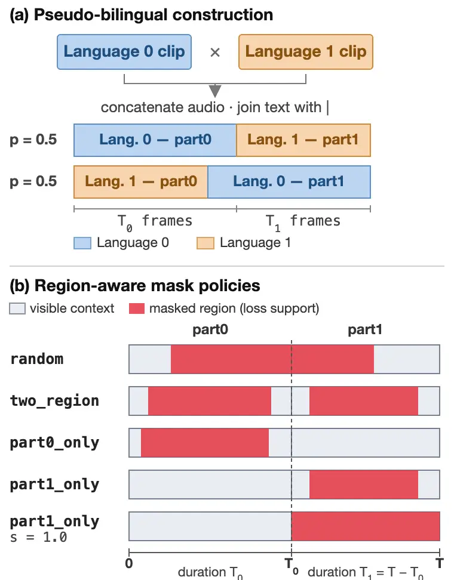

# Region-Aware Masking for Accent-Robust Cross-Lingual Text-to-Speech

Haoqi Li    Shivam Mehta    Ravi Teja Gadde    Yinghong Lan

###### Abstract

Accent leakage remains a critical challenge in cross-lingual zero-shot
text-to-speech (TTS), where models inadvertently transfer both the
speaker’s timbre and source-language accent into the target-language
output. In mask-reconstruction TTS this is amplified by a
train–inference mismatch: training reconstructs from same-language
context, while inference conditions on cross-lingual context. We close
this gap by concatenating utterances from two languages and placing the
reconstruction mask relative to the language boundary, so training
presents the cross-lingual prompting pattern the model encounters at
inference. This requires no language IDs, accent labels, parallel
same-speaker recordings, or architectural changes—only the mask geometry
differs. In a listening study with native speakers, region-aware masking
reduces perceived accent from 4.3 to 0.5 on a 0-5 scale against the
unadapted baseline, and by 18-51% in seen regimes and 35-55% on unseen
source languages against bilingual adaptation alone, with no measurable
loss in intelligibility or naturalness. Comparing mask geometries shows
that placement, not the amount masked, governs the balance between
accent suppression and speaker preservation: masks confined to the
reconstruction region suppress accent most but retain the reference
speaker least reliably, whereas two-region masking achieves both. Mask
geometry is thus a simple, effective lever for accent robustness.

###### Index Terms: 

cross-lingual speech synthesis, zero-shot text-to-speech, accent
leakage, flow matching, speaker similarity

^(†)^(†)address: Netflix Inc., USA

## 1 Introduction

Cross-lingual zero-shot text-to-speech (TTS) often exhibits accent
leakage: although the synthesized speech preserves the reference
speaker’s timbre, its target-language pronunciation commonly inherits
the source-language accent. This issue arises in voice-preserving speech
translation, media localization, and multilingual voice interfaces,
where speaker characteristics should remain stable while pronunciation
follows target-language norms. However, addressing this challenge
through direct supervised learning is difficult, as parallel
cross-lingual speech from the same speaker is scarce and expensive to
collect at scale.

The problem stems from two related sources. First, speaker timbre is
entangled with language-dependent pronunciation and prosody, allowing a
model to encode them jointly. Prior work addresses this using language
embeddings or tokens, disentangled speaker and linguistic
representations, adversarial accent suppression, language-dependent
generators, or inference-time model fusion \[1, 2, 3, 4, 5, 6, 7\].
While these methods highlight the need to separate speaker-related cues
from pronunciation, they leave open a complementary question: can the
training objective itself provide an effective separation signal without
explicit language IDs, accent, or other token- or embedding-based
conditioning?

Second, mask-reconstructing TTS introduces a fundamental train–inference
mismatch. Voicebox \[8\], E2 TTS \[9\], and F5-TTS \[10\] learn speech
infilling by masking part of an utterance and reconstructing it from
text and surrounding audio. During standard training, both the masked
target and its acoustic context come from the same language and
utterance. During cross-lingual inference, however, target speech in one
language must be generated using acoustic context from another. This
mismatch encourages the model to copy language-dependent acoustic
attributes—most notably, the source-language accent—from the reference
audio rather than relying on the target text for pronunciation.

In this work, we propose a region-aware masking method for accent-robust
cross-lingual TTS. Building on F5-TTS \[10\], we construct
pseudo-bilingual examples by concatenating utterances from two distinct
languages, optionally guided by speaker-embedding similarity. By
reconstructing speech in one language while conditioning on the other as
acoustic context, the model is exposed during training to the same
cross-lingual prompting pattern encountered at inference time. This
directly targets the train–inference mismatch underlying accent leakage,
without explicit language IDs, accent conditioning, or architectural
modifications.

To summarize, our main contributions are:

- •
  A region-aware cross-lingual adaptation strategy: We construct
  pseudo-bilingual training pairs from speaker-disjoint monolingual data
  via region-aware masking, directly addressing the train–inference
  mismatch.
- •
  Conditioning-free accent control: Our approach improves accent
  robustness without requiring explicit language IDs, accent embeddings,
  or model modifications.
- •
  A practical trade-off analysis: We show that mask placement governs
  the trade-off between accent suppression and speaker-timbre
  preservation, identify two-region masking as the best overall setting,
  and demonstrate that the resulting gains generalize to unseen language
  combinations.

Audio demos are provided on the supplementary website.¹¹ 1
[https://doubleblindauthor.github.io/region-aware-masking-TTS-demo](https://doubleblindauthor.github.io/region-aware-masking-TTS-demo)

## 2 Related work

Masked and cross-lingual generation. Prior work adapts masked
reconstruction or codec-based language modeling for cross-lingual speech
generation. Voicebox \[8\] introduced large-scale text-guided
flow-matching infilling, and E2 TTS \[9\] and F5-TTS \[10\] simplified
it to alignment-free zero-shot TTS . Cross-Lingual F5-TTS extends base
F5-TTS toward language-agnostic voice cloning, dropping the reference
transcript via forced alignment and speaking-rate prediction \[14\].
VALL-E established neural-codec language modeling for zero-shot TTS
\[11\], and VALL-E X concatenates source- and target-language phoneme
prompts within a codec language model for cross-lingual synthesis \[1\].
SpeechPainter \[12\] and ERNIE-SAT \[13\] apply masked reconstruction
directly to speech editing and synthesis. Separately, teacher-student
augmentation synthesizes unseen speaker-language combinations for
cross-lingual training \[15\].

Speaker, language, and accent separation. A separate line of work
addresses accent leakage by separating speaker cues from linguistic
content. Zhang _et al._ use adversarial training to separate the two and
show that accented outputs can still receive higher speaker-similarity
ratings \[16\], underscoring that similarity metrics alone cannot
certify accent-free synthesis. YourTTS \[17\] and XTTS \[18\] extend
zero-shot synthesis across languages . DSE-TTS separates a
native-speaker representation for linguistic style from target-speaker
timbre \[2\]; CrossSpeech++ uses separate language- and
speaker-dependent generators \[3\]; AccentBox and CrossAccent-TTS learn
explicit accent representations or suppression modules \[4, 5\]; X-Voice
injects language identity at the text and frame levels \[6\]; PFluxTTS
applies inference-time vector-field fusion \[7\]. Accent normalization
has also been studied using non-parallel data and a separate
discrete-token conversion model \[20\].

Both lines rely on masked or codec-based reconstruction with explicit
language, accent, or speaker representations. We instead study how mask
placement relative to the language boundary changes the training signal
itself, improving accent robustness without language IDs, accent labels,
or architectural changes.

## 3 Method

### 3.1 Masked flow-matching supervision

Our method builds on F5-TTS \[10\], a non-autoregressive
diffusion-transformer TTS model trained for text-guided speech
infilling. It uses optimal-transport conditional flow matching (OT-CFM)
to learn a vector field between Gaussian noise and speech data \[21,
22\]. Let $`x_{1}\in\mathbb{R}^{T\times F}`$ be a log-mel spectrogram
and $`y`$ its transcript. OT-CFM samples $`x_{0}\sim\mathcal{N}(0,I)`$
and $`t\sim\mathcal{U}[0,1]`$, and defines
$`\psi_{t}=(1-t)x_{0}+tx_{1}`$ and $`\dot{\psi}_{t}=x_{1}-x_{0}`$. Let
$`m\in\{0,1\}^{T}`$ indicate frames to reconstruct and
$`c=(1-m)\odot x_{1}`$ be the visible acoustic context. The masked CFM
objective is

```math
\mathcal{L}_{\mathrm{MCFM}}=\mathbb{E}_{\begin{subarray}{c}t,\,x_{1}\sim q,\,x_{0}\sim p_{0},\\
m\sim p_{\mathrm{mask}}\end{subarray}}\left\|m\odot\left(v_{\theta}(\psi_{t},t,c,y)-\dot{\psi}_{t}\right)\right\|_{2}^{2} \tag{1}
```

Here, $`v_{\theta}`$ is the time-dependent vector field predicted by
F5-TTS, and $`q`$, $`p_{0}`$, and $`p_{\mathrm{mask}}`$ denote the
speech-data, Gaussian-noise, and training-mask distributions. Eq. (1)
omits the normalization factor, as in prior work; in practice, we
average over masked time–frequency bins. Standard F5-TTS masks one
random contiguous span of length $`sT`$, where
$`s\sim\mathcal{U}[0.7,1.0]`$ \[10\].

### 3.2 Construction of concatenated bilingual examples

Let $`\mathcal{D}_{0}`$ and $`\mathcal{D}_{1}`$ denote monolingual
corpora for Language 0 and Language 1. We sample one utterance from each
corpus, concatenate their log-mel spectrograms, and join their
character-token sequences with the in-vocabulary separator “\|”. The
concatenation order is sampled uniformly, exposing the model to both
language directions. After ordering, we refer to the first and second
positional regions as _part0_ and _part1_; these names do not correspond
to a fixed language. Let their durations be $`T_{0}`$ and $`T_{1}`$ mel
frames.

The language boundary determines how the example is masked, but no
language ID is passed to the model. The two utterances need not be
semantically aligned or recorded from the same speaker. To preserve
ordinary monolingual behavior, a fraction $`p_{\mathrm{single}}`$ of
training examples remains monolingual and uses the standard F5-TTS mask;
the remaining examples use the concatenated construction. At inference,
the reference audio is prompted with its transcript and the target text
joined by the same separator, and the model generates the
target-language continuation.



Figure 1: Pseudo-bilingual example construction and region-aware
masking. (a) Two utterances are concatenated into regions of durations
$`T_{0}`$ and $`T_{1}`$. (b) Gray denotes visible acoustic context and
red denotes masked regions used in the flow-matching loss.

### 3.3 Region-aware mask distributions

Our key idea is to place two languages in one training example, then
mask one region so the model reconstructs it while receiving the other
as acoustic context. This encourages transfer of language-independent
cues such as timbre across the boundary while relying on the target text
for pronunciation. The original random-span mask does not reliably
create this condition, since it may cross the language boundary or leave
target-region speech visible. We therefore define several position-aware
masking strategies.

For an interval beginning at $`t_{\mathrm{start}}`$ and ending at
$`t_{\mathrm{end}}`$, let
$`\mathrm{span}(t_{\mathrm{start}},t_{\mathrm{end}},s)`$ denote a
uniformly positioned contiguous mask of duration
$`\lfloor s(t_{\mathrm{end}}-t_{\mathrm{start}})\rfloor`$, with masked
fraction $`s`$. With $`T=T_{0}+T_{1}`$, we define four policies:
_random_ masks a span in $`[0,T]`$; _part0-only_ masks a span in
$`[0,T_{0}]`$; _part1-only_ masks a span in $`[T_{0},T]`$; and
_two-region_ independently masks one span in each region. Formally,
these correspond to $`\mathrm{span}(0,T,s)`$,
$`\mathrm{span}(0,T_{0},s)`$, $`\mathrm{span}(T_{0},T,s)`$, and
$`\mathrm{span}(0,T_{0},s_{0})\cup\mathrm{span}(T_{0},T,s_{1})`$, where
$`s,s_{0},s_{1}\stackrel{{\scriptstyle\mathrm{iid}}}{{\sim}}\mathcal{U}[0.7,1.0]`$
unless specified otherwise. The _uniform_ policy samples one of the four
with equal probability at each optimization step. Because concatenation
order is randomized, _part0-only_ and _part1-only_ are symmetric over
training.

The most inference-aligned policy is _part1-only_. Under the default
span-fraction distribution, part of the second region remains visible;
setting $`s=1`$ masks it completely, requiring the model to reconstruct
it from its transcript and cross-language acoustic context. With order
randomized, either language can occupy the reconstruction region. This
signal is intended to encourage, rather than guarantee, separation of
timbre from language-dependent pronunciation.

### 3.4 Speaker-similarity-selected pseudo-pairs

Region-aware masking does not require any cross-lingual speaker
matching: the simplest setting concatenates utterances from the two
languages at random. Random concatenation, however, can pair very
different voices, weakening cross-region acoustic context for speaker
timbre. We therefore also study a pseudo-pairing strategy based on
speaker similarity.

For each utterance in an anchor language, we retrieve the top $`K`$
candidates from a candidate language by cosine similarity between
normalized pretrained speaker embeddings and sample one candidate during
training. This raises similarity in speaker characteristics only; it
does not guarantee that the paired utterances share the same speaker. We
therefore refer to them as _pseudo-pairs_.

To quantify how strongly an embedding model separates retrieved from
random pairs, we define

```math
\rho=\frac{\mathbb{E}_{i}[\cos(e_{i},e_{\mathrm{NN}_{1}(i)})]}{\mathbb{E}_{i,j}[\cos(e_{i},e_{j})]} \tag{2}
```

where $`e_{i}`$ is an anchor-language embedding, $`e_{j}`$ a randomly
selected candidate-language embedding, and $`e_{\mathrm{NN}_{1}(i)}`$
the nearest candidate-language embedding to $`e_{i}`$. A value near one
indicates little separation between retrieved and random pairs under
that encoder. This ratio is descriptive rather than a direct measure of
pair quality: speaker embeddings may also encode channel, language,
accent, or other attributes, and $`\rho`$ evaluates the nearest
candidate although training samples from the top $`K`$.

## 4 Experimental setup

Datasets. We instantiate Language 0 and Language 1 as English and
Spanish. Both languages offer large, diverse corpora, and their
phonological and prosodic differences provide a meaningful test of
cross-lingual accent transfer. We construct pseudo-bilingual training
examples from an internal corpus of approximately 21.2M English and 9.3M
Spanish utterances. Each utterance is a single-speaker audio clip with
durations between 2 and 16 seconds. The two language subsets are
speaker-disjoint, and no same-speaker bilingual recordings are used.

For evaluation, we use an internal ES$`\rightarrow`$EN test set of 20
verified cross-lingual speech–text pairs, with Spanish reference speech
and English target text. To assess accent robustness beyond the training
language pair and domain, we also build a test set from FLEURS \[25\],
which provides semantically parallel speech and text across languages.
We select 30 sentences and pair their Spanish, French, and Portuguese
recordings with the corresponding English target text, yielding 90
cross-lingual items across three source languages. All paired utterances
preserve the same semantic content.

Cross-lingual speaker-pair retrieval. For the optional pairing strategy,
we precompute cross-language nearest-neighbor tables with FAISS \[26\],
avoiding online similarity search during training. English utterances
serve as anchors, Spanish utterances as candidates. For each anchor, we
retrieve the top $`K=10`$ candidates by cosine similarity between
normalized speaker embeddings and sample one uniformly from this set,
balancing speaker similarity with pair diversity. After pairing, the
concatenation order during training is sampled uniformly. Table 1
reports the top-1 retrieval contrast from Eq. (2) over 1,000 anchors.
ECAPA-TDNN yields a substantially larger retrieved-versus-random
contrast than x-vector, indicating stronger discrimination between
retrieved and random pairs and motivating its use in the optional
speaker-pairing experiments.

| Encoder           | Dim. | NN cosine | Random cosine | $`\rho`$ |
| ----------------- | ---- | --------- | ------------- | -------- |
| x-vector \[23\]   | 512  | 0.982     | 0.923         | 1.06     |
| ECAPA-TDNN \[24\] | 192  | 0.762     | 0.322         | 2.37     |

Table 1: Top-1 speaker-pair retrieval statistics.

Model setup. We adopt two measures to avoid degrading monolingual
generation. First, all systems are initialized from the same pretrained
multilingual F5-TTS checkpoint, rather than training from scratch: we
evaluate it directly as baseline B and adapt the rest from it. Second,
alongside concatenated bilingual examples, we retain a small proportion
of monolingual examples during adaptation to mitigate catastrophic
forgetting.

We set $`p_{\mathrm{single}}=0.2`$, so 80% of adaptation examples are
concatenated and 20% remain monolingual. During training, we use AdamW
with a learning rate of $`10^{-4}`$ and a 4,000-update warmup. All
systems are compared at the same training budget of 2.04 epochs on the
concatenated mixture, so differences reflect the method rather than
training length.

We evaluate the masking methods summarized in Table 2. In the Mask
column, _uniform_ denotes a mixture of all four masking policies: At
each training step, one of the policies defined in Section 3.3 is
sampled with equal probability. $`U`$ indicates that the corresponding
mask fraction is sampled from $`\mathcal{U}[0.7,1.0]`$. M+P denotes the
corresponding masking policy with the optional ECAPA-TDNN-based
speaker-pair retrieval.

| System | Mask ($`s`$)       | Pairing                          |
| ------ | ------------------ | -------------------------------- |
| B      | random ($`U`$)     | None (single-language utterance) |
| M1     | random ($`U`$)     | Random                           |
| M2     | two_region ($`U`$) | Random                           |
| M3     | part1_only ($`U`$) | Random                           |
| M4     | part1_only ($`1`$) | Random                           |
| M5     | uniform ($`U`$)    | Random                           |
| M5+P   | uniform ($`U`$)    | ECAPA-TDNN                       |
| M2+P   | two_region ($`U`$) | ECAPA-TDNN                       |

Table 2: Systems. $`U=\mathcal{U}[.7,1]`$.

Evaluation. We report three objective measures, along with a subjective
listening test. Speaker similarity (SIM) is computed using both WavLM
\[27\] and ECAPA-TDNN \[24\]. Since ECAPA-TDNN is also used for
pseudo-pair retrieval, WavLM provides an independent check against
potential bias from pair selection. Intelligibility is measured by word
error rate (WER) using Whisper large-v3 \[28\], and naturalness is
estimated with UTMOS \[29\]. We treat UTMOS as a proxy for naturalness
and overall generation quality.

To directly assess accent robustness, we conduct a human listening test.
Each page presents a non-English reference utterance, the English target
text, and the generated English speech. Twenty English native speakers
rate each clip on two criteria. The first rates the perceived strength
of the source-language accent on a 0–5 scale: 0 none, 1 very slight, 2
mild, 3 moderate, 4 strong, and 5 very strong; lower is better. The
second asks whether the speaker timbre is noticeably changed relative to
the reference, which we report as the fraction of clips flagged.

## 5 Results and discussion

We report results in three configurations that cross two axes of shift:
source language and audio domain. Internal ES$`\rightarrow`$EN is
in-domain on both. FLEURS ES$`\rightarrow`$EN keeps the language pair
and switches to out-of-domain (OOD) audio. FLEURS FR/PT$`\rightarrow`$EN
shifts both at once, with French and Portuguese unseen during adaptation
and retrieval. The first two test the adapted model’s language-pair
performance across domains; the third evaluates generalization to unseen
source languages. In the listening study, 20 raters score each clip for
accent on a 0–5 scale and judge whether its timbre is preserved.
Inter-rater agreement is high for accent (Krippendorff’s
$`\alpha=0.98`$) and moderate for timbre ($`\alpha=0.53`$), so we
interpret the latter mainly at the level of large between-policy
differences.

Region-aware masking consistently reduces accent leakage. The unadapted
baseline B exhibits strong accent leakage across all three regimes, with
accent scores of 4.21–4.37, showing that cross-lingual prompting largely
transfers the source-language accent together with the reference
speaker’s timbre. Adapting the pretrained multilingual checkpoint on
bilingual concatenations already mitigates this effect substantially: M1
reduces the accent score to 0.45 on the internal set, 0.69 on FLEURS
ES$`\rightarrow`$EN, and 1.05 on FLEURS FR/PT$`\rightarrow`$EN. All
region-aware masking variants further improve over M1.

Compared to M1, region-aware masking reduces perceived accent by 18–51%
in the seen regimes and 35–55% on unseen source languages. These gains
are significant in all settings except M5 on the 20-item internal set.
The largest gains appear in the hardest regime, FLEURS
FR/PT$`\rightarrow`$EN, where adaptation provides no direct support for
the source languages: the accent score drops from 1.05 for M1 to 0.69
for M2, 0.60 for M5, and 0.48–0.54 for M3/M4. The trend holds in-domain
and out-of-domain, suggesting that the gain comes from the training
strategy, not the recording domain.

Accent suppression and speaker preservation trade off. The gains from
region-aware masking come with a clear trade-off, but it is driven by
where the mask falls, not by how much it covers: random and two-region
both mask 85% of the example in expectation, yet spreading the mask
across both regions lowers accent and raises Joint. The part1-only
variants mask only 42.5% in expectation, yet preserve timbre least
reliably. On unseen languages, accent improves from 0.69 with M2 to 0.48
with M3, but the share of clips that deviate from the reference
speaker’s timbre rises sharply from 15.1% to 42.1%. SIM exhibits the
same trend: the part1-only variants show the largest similarity drop. In
several such cases the change is perceptually obvious, indicating that
these failures are substantial rather than marginal.

This trade-off makes accent score alone an inadequate selection
criterion. If systems are ranked only by accent suppression, these
part1-only variants appear best; but they also fail most often to
preserve the reference speaker’s timbre, making them unsuitable for
voice-preserving applications. To capture both requirements, we further
report Joint: the fraction of clips with both accent score $`\leq 1`$
and preserved speaker timbre. This threshold corresponds to no accent or
only a very slight accent. Under this criterion the ranking reverses: on
unseen languages, M2, M2+P, M5 and M5+P are tied-best on Joint (66–70%),
while M3 and M4 drop to 51.3% and 42.5%. We therefore recommend
two-region masking as the default.

Intelligibility and naturalness are largely preserved. Accent-robustness
gains bring no measurable loss in intelligibility or naturalness. Across
the adapted systems, WER and UTMOS differences are generally not
statistically resolvable in the seen configurations; UTMOS separates the
unadapted baseline in both, while WER does so only on FLEURS. This
suggests the proposed adaptation mainly changes accent and
speaker-preservation behavior while leaving overall generation quality
largely intact. The only notable exception is M5 on FLEURS
FR/PT$`\rightarrow`$EN, which improves over M1 in WER; no other masking
variant shows this pattern.

|                                                                |                      |                             |                     |                                 |                   |                   |
| -------------------------------------------------------------- | -------------------- | --------------------------- | ------------------- | ------------------------------- | ----------------- | ----------------- |
| System                                                         | Accent$`\downarrow`$ | Timbre chg. %$`\downarrow`$ | Joint %$`\uparrow`$ | SIM$`\uparrow`$ (WavLM / ECAPA) | WER$`\downarrow`$ | UTMOS$`\uparrow`$ |
| _In-domain_ — Internal ES$`\rightarrow`$EN                     |                      |                             |                     |                                 |                   |                   |
| B                                                              | 4.28                 | 1.5                         | 1.3                 | 0.953 / 0.701                   | 0.051             | 2.88              |
| M1                                                             | 0.45                 | 10.8                        | 79.1                | 0.673 / 0.313                   | 0.042             | 3.77              |
| M2                                                             | 0.32                 | 14.7                        | 80.2                | 0.645 / 0.249                   | 0.060             | 3.85              |
| M3                                                             | 0.22                 | 45.3                        | 52.3                | 0.520 / 0.079                   | 0.024             | 4.01              |
| M4                                                             | 0.26                 | 51.0                        | 45.2                | 0.478 / 0.066                   | 0.039             | 3.93              |
| M5                                                             | 0.37                 | 21.3                        | 71.1                | 0.614 / 0.198                   | 0.036             | 3.86              |
| M5+P                                                           | 0.23                 | 26.5                        | 70.6                | 0.578 / 0.171                   | 0.054             | 3.91              |
| M2+P                                                           | 0.36                 | 11.4                        | 82.4                | 0.653 / 0.261                   | 0.042             | 3.95              |
| _OOD, seen source language_ — FLEURS ES$`\rightarrow`$EN       |                      |                             |                     |                                 |                   |                   |
| B                                                              | 4.37                 | 1.4                         | 0.7                 | 0.951 / 0.717                   | 0.070             | 3.38              |
| M1                                                             | 0.69                 | 7.4                         | 75.3                | 0.722 / 0.406                   | 0.049             | 3.97              |
| M2                                                             | 0.50                 | 12.7                        | 75.9                | 0.671 / 0.270                   | 0.049             | 3.90              |
| M3                                                             | 0.45                 | 55.0                        | 40.1                | 0.507 / 0.073                   | 0.037             | 3.88              |
| M4                                                             | 0.36                 | 73.5                        | 23.4                | 0.427 / 0.069                   | 0.037             | 4.00              |
| M5                                                             | 0.45                 | 29.2                        | 62.4                | 0.623 / 0.218                   | 0.058             | 3.86              |
| M5+P                                                           | 0.40                 | 25.2                        | 66.9                | 0.603 / 0.224                   | 0.058             | 3.95              |
| M2+P                                                           | 0.52                 | 10.0                        | 77.4                | 0.699 / 0.316                   | 0.055             | 4.04              |
| _OOD, unseen source languages_ — FLEURS FR/PT$`\rightarrow`$EN |                      |                             |                     |                                 |                   |                   |
| B                                                              | 4.21                 | 1.5                         | 3.1                 | 0.960 / 0.710                   | 0.122             | 3.20              |
| M1                                                             | 1.05                 | 10.0                        | 64.5                | 0.776 / 0.358                   | 0.089             | 3.81              |
| M2                                                             | 0.69                 | 15.1                        | 69.6                | 0.704 / 0.234                   | 0.066             | 3.94              |
| M3                                                             | 0.48                 | 42.1                        | 51.3                | 0.558 / 0.072                   | 0.064             | 3.89              |
| M4                                                             | 0.54                 | 52.2                        | 42.5                | 0.535 / 0.053                   | 0.066             | 3.85              |
| M5                                                             | 0.60                 | 22.0                        | 65.7                | 0.663 / 0.168                   | 0.035             | 3.93              |
| M5+P                                                           | 0.62                 | 16.2                        | 69.4                | 0.694 / 0.241                   | 0.055             | 3.87              |
| M2+P                                                           | 0.67                 | 16.0                        | 69.7                | 0.718 / 0.277                   | 0.038             | 3.92              |

Table 3: Objective and subjective results by evaluation regime. Joint is
the share of clips with accent $`\leq 1`$ and preserved speaker timbre.
SIM reports WavLM / ECAPA-TDNN. Gray rows (B, M1) are reference points;
bold marks the tied-best proposed systems (paired bootstrap,
$`p>0.05`$). WER is unbolded in-domain, where no adapted systems are
statistically distinguishable.

Speaker-similarity pairing is an optional extension that mainly improves
SIM under aggressive masking. We include pseudo-pair retrieval because
purely random cross-lingual concatenation can pair very different
voices. Its effect is smaller and more selective than that of masking
itself. Under two-region masking, some same-speaker acoustic context
remains visible, so retrieval yields only modest SIM gains (+0.046 on
FLEURS ES and +0.043 on unseen languages). Under uniform masking, the
target region can be fully masked, leaving no same-speaker evidence; the
retrieved pair then becomes the only speaker anchor and yields the
largest gain we observe (+0.073 on unseen languages), while it is small
on FLEURS ES (+0.006) and slightly negative in-domain. Because
ECAPA-TDNN is used both for retrieval and as one similarity metric, we
also report WavLM-based SIM as an independent check. The gains persist
there at smaller magnitude. However, these objective improvements do not
translate into a clearly resolved gain in human timbre judgments, and
pairing does not materially affect accent.

We therefore view pairing as optional: it can improve similarity when
masking removes most speaker evidence, but the main gains in accent
robustness come from region-aware masking. More broadly, SIM should be
interpreted carefully in cross-lingual accent evaluation, since higher
SIM can also reflect stronger source-accent copying. This is most
evident in baseline B, which achieves the highest SIM while also
exhibiting the strongest accent leakage. Taken together, these results
identify two-region masking as the best trade-off between accent
robustness and speaker-timbre preservation.

## 6 Conclusion

We introduced a region-aware masking strategy for accent-robust
cross-lingual TTS. By reconstructing speech in one language from
acoustic context in another, the method better aligns masked training
with cross-lingual inference, without architectural changes, explicit
language or accent conditioning, or same-speaker bilingual recordings.
Experiments show that this change to the training signal consistently
reduces perceived accent, generalizes to unseen source languages, and
reveals a clear trade-off between accent suppression and speaker-timbre
preservation. Mask geometry thus provides an effective lever for
controlling accent robustness.

## References

- \[1\] Z. Zhang _et al._, “Speak foreign languages with your own
  voice: Cross-lingual neural codec language modeling,”
  arXiv:2303.03926, 2023.
- \[2\] S. Liu, Y. Guo, C. Du, X. Chen, and K. Yu, “DSE-TTS: Dual
  speaker embedding for cross-lingual text-to-speech,” in _Proc.
  Interspeech_, 2023, pp. 616–620.
- \[3\] J.-H. Kim _et al._, “CrossSpeech++: Cross-lingual speech
  synthesis with decoupled language and speaker generation,” _IEEE/ACM
  Trans. Audio, Speech, Lang. Process._, vol. 33, pp. 1364–1374, 2025.
- \[4\] J. Zhong, K. Richmond, Z. Su, and S. Sun, “AccentBox: Towards
  high-fidelity zero-shot accent generation,” in _Proc. IEEE
  ICASSP_, 2025.
- \[5\] R. Annamdevula, A. Tatawat, A. P. Gudmalwar, N. J. Shah, and P.
  Wasnik, “CrossAccent-TTS: Cross-lingual accent-intensity controllable
  text-to-speech via disentangled speaker and accent representations,”
  arXiv:2606.25403, 2026.
- \[6\] R. Xu _et al._, “X-Voice: Enabling everyone to speak 30
  languages via zero-shot cross-lingual voice cloning,”
  arXiv:2605.05611, 2026.
- \[7\] V. Pankov _et al._, “PFluxTTS: Hybrid flow-matching TTS with
  robust cross-lingual voice cloning and inference-time model fusion,”
  in _Proc. IEEE ICASSP_, 2026, doi: 10.1109/ICASSP55912.2026.11462483.
- \[8\] M. Le _et al._, “Voicebox: Text-guided multilingual universal
  speech generation at scale,” in _Adv. Neural Inf. Process.
  Syst._, 2023.
- \[9\] S. E. Eskimez _et al._, “E2 TTS: Embarrassingly easy fully
  non-autoregressive zero-shot TTS,” in _Proc. IEEE SLT_, 2024, pp.
  682–689.
- \[10\] Y. Chen, Z. Niu, Z. Ma, K. Deng, C. Wang, J. Zhao, K. Yu,
  and X. Chen, “F5-TTS: A fairytaler that fakes fluent and faithful
  speech with flow matching,” in _Proc. ACL_, 2025, pp. 6255–6271.
- \[11\] S. Chen _et al._, “Neural codec language models are zero-shot
  text to speech synthesizers,” _IEEE/ACM Trans. Audio, Speech, Lang.
  Process._, vol. 33, pp. 705–718, 2025.
- \[12\] Z. Borsos, M. Sharifi, and M. Tagliasacchi, “SpeechPainter:
  Text-conditioned speech inpainting,” in _Proc. Interspeech_, 2022, pp.
  431–435.
- \[13\] X. Fan _et al._, “ERNIE-SAT: Speech and text joint pretraining
  for cross-lingual multi-speaker text-to-speech,”
  arXiv:2211.03545, 2022.
- \[14\] Q. Liu _et al._, “Cross-Lingual F5-TTS: Towards
  language-agnostic voice cloning and speech synthesis,” in _Proc. IEEE
  ICASSP_, 2026.
- \[15\] M. de Korte, J. Kim, A. Kunikoshi, A. Adigwe, and E. Klabbers,
  “Data-augmented cross-lingual synthesis in a teacher-student
  framework,” in _Proc. Interspeech_, 2022.
- \[16\] Y. Zhang _et al._, “Learning to speak fluently in a foreign
  language: Multilingual speech synthesis and cross-language voice
  cloning,” in _Proc. Interspeech_, 2019, pp. 2080–2084.
- \[17\] E. Casanova _et al._, “YourTTS: Towards zero-shot
  multi-speaker TTS and zero-shot voice conversion for everyone,” in
  _Proc. ICML_, 2022, pp. 2709–2720.
- \[18\] E. Casanova _et al._, “XTTS: A massively multilingual
  zero-shot text-to-speech model,” in _Proc. Interspeech_, 2024, pp.
  4978–4982.
- \[19\] M. Yang and J. H. L. Hansen, “Activation steering for
  accent-neutralized zero-shot text-to-speech,” arXiv:2603.05977, 2026.
- \[20\] Q. Bai, S. Inoue, S. Wang, Z. Jiang, Y. Wang, and H. Li,
  “Accent normalization using self-supervised discrete tokens with
  non-parallel data,” in _Proc. Interspeech_, 2025, pp. 1618–1622.
- \[21\] Y. Lipman, R. T. Q. Chen, H. Ben-Hamu, M. Nickel, and M. Le,
  “Flow matching for generative modeling,” in _Proc. ICLR_, 2023.
- \[22\] A. Tong _et al._, “Improving and generalizing flow-based
  generative models with minibatch optimal transport,” _Trans. Mach.
  Learn. Res._, 2024.
- \[23\] D. Snyder, D. Garcia-Romero, G. Sell, D. Povey, and S.
  Khudanpur, “X-vectors: Robust DNN embeddings for speaker recognition,”
  in _Proc. IEEE ICASSP_, 2018, pp. 5329–5333.
- \[24\] B. Desplanques, J. Thienpondt, and K. Demuynck, “ECAPA-TDNN:
  Emphasized channel attention, propagation and aggregation in TDNN
  based speaker verification,” in _Proc. Interspeech_, 2020, pp.
  3830–3834.
- \[25\] A. Conneau _et al._, “FLEURS: Few-shot learning evaluation of
  universal representations of speech,” in _Proc. IEEE SLT_, 2023, pp.
  798–805.
- \[26\] M. Douze _et al._, “The Faiss library,”
  arXiv:2401.08281, 2024.
- \[27\] S. Chen _et al._, “WavLM: Large-scale self-supervised
  pre-training for full stack speech processing,” _IEEE J. Sel. Topics
  Signal Process._, vol. 16, no. 6, pp. 1505–1518, 2022.
- \[28\] A. Radford _et al._, “Robust speech recognition via
  large-scale weak supervision,” in _Proc. ICML_, 2023, pp. 28492–28518.
- \[29\] T. Saeki _et al._, “UTMOS: UTokyo-SaruLab system for VoiceMOS
  Challenge 2022,” in _Proc. Interspeech_, 2022, pp. 4521–4525.
