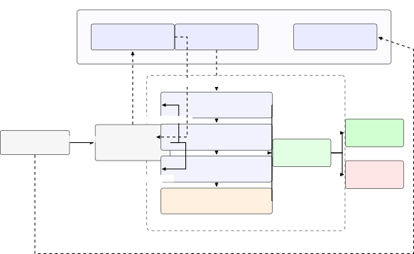
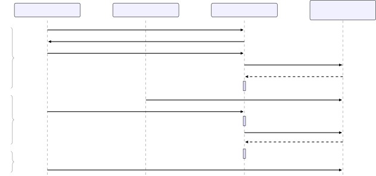

# BVI: Lightweight, Data-Centric Blockchain-Based Verification of Identity Claims

Harshith Pothapala    Gagandeep Singh    Samudi Amarasinghe    Priyanka
Singh    Xue Li Affiliation: The University of Queensland

###### Abstract

A person who answers an unexpected call claiming to come from a bank has
no way to check the claim. Australian text messaging has labelled a
message as unverified when the sender identifier is not registered since
1 July 2026, but a voice call still arrives with nothing behind it, and
voice cloning has removed the last cue recipients relied on. We present
BVI, which answers one question for the recipient: did the calling party
prove it holds a credential a registered organisation issued for this
call? BVI keeps the organisational record, its authorised channels and
its revocation state on a public ledger in a directly queryable form,
and puts all decision logic in the handset, which performs eleven
checks, pays no transaction fee and holds no full-chain state. We define
ten attack classes plus the case in which revocation cannot be resolved,
compare them in a 10-by-4 coverage matrix spanning BBCA, the content
digest, the detector and composed BVI, and run 27 automated scenario
tests against isolated Hardhat fixture states of the BVI contract; all
27 pass. For media substitution and synthetic speech, the contract tests
validate commitment and gating properties rather than claiming detector
accuracy. The mandatory per-session anchor costs about 91.5k gas and is
invariant in call duration and hop count; each participating
intermediary additionally contributes one optional attestation write. In
a 20,000-session-per-cell path simulation, at one quarter carrier
participation BVI detects 20.6 per cent of randomly located in-path
rewrites versus 0.1 per cent for the every-hop comparison, while
identity and content evidence remain available even when path evidence
is indeterminate. We also quantify the throughput ceiling of the
anchoring design.

###### Keywords: 

Distributed ledger Decentralised identity Verifiable credentials Caller
identity Smart contracts Voice fraud

Anonymous artefact. The implementation and evaluation artefact is
available at
[https://anonymous.4open.science/r/bvi-D415](https://anonymous.4open.science/r/bvi-D415).

## 1 Introduction

At 4:12 on a Tuesday afternoon a phone rings. The caller says she is
from the fraud team at the recipient’s bank, that a payment has been
flagged, and that she needs to confirm a few details before the account
is frozen. The handset shows a number and, if the network happens to
support it, a name pulled from a directory. The recipient now has to
decide. The only evidence available is how the caller sounds and how
well she knows the script, and both of those are now cheap to
manufacture.

We take this call as the running example of the paper and return to it
in every section. We write S0 for the honest version of it, A1 to A10
for the ten ways the same call can be dishonest, and U for the case in
which the handset cannot resolve enough to say. Throughout we ask what
the handset could show the recipient at 4:12 that she could act on.

### 1.1 The Asymmetry Between Text and Voice

Australia has already answered a version of this question for text. The
_Telecommunications (SMS Sender ID Register) Industry Standard 2025_,
made under Part 24B of the _Telecommunications Act 1997_ (Cth), requires
providers to over-stamp any unregistered alphanumeric sender identifier
with the word “Unverified” and to group those messages away from the
registered ones. Registration opened on 30 November 2025 and
over-stamping took effect on 1 July 2026 \[2, 3\]. A recipient reading a
text now gets a registry-backed statement about the sender before she
reads a word of it.

No equivalent exists for a voice call. The secure telephone identity
framework \[21, 34, 22, 1\] signs a numbering resource and attaches an
attestation level, which is a statement about a phone number and its
assignment rather than about the organisation the caller claims to
represent, and it says nothing about what happens after the call
connects; Wang et al. document its practical limits, including the
difficulty of scaling its certificate infrastructure across
jurisdictions and its silence on legs not carried over IP \[33\].
Branded calling and the Australian _Reducing Scam Calls and Scam SMs_
industry code \[10\] improve what appears on the screen within one
operator’s domain and stop the moment the call is answered. The
recipient in S0 is therefore worse off on a voice call than on a text
from the same organisation, which is the wrong way round, because voice
is the channel where an attacker can improvise.

### 1.2 Why This Matters Now

The National Anti-Scam Centre reports combined losses of AUD 2.18
billion across its reporting partners in 2025, up 7.8 per cent, from
481,523 reports of which 274,577 involved a loss \[18\]. The regulatory
response places duties on the organisations in the middle rather than on
the recipient. The _Scams Prevention Framework Act 2025_ (Cth) inserted
Part IVF into the _Competition and Consumer Act 2010_ (Cth), imposing
governance, prevention, detection, reporting, disruption and response
obligations with penalties reaching AUD 50 million per
contravention \[20\]. Banking, telecommunications and digital-platform
services were designated by instrument F2026L00627, registered on 28 May
2026 \[9\]. Treasury also released exposure-draft rules and sector codes
for consultation in May 2026 \[32\]; the _Competition and Consumer
(Scams Prevention Framework) Rules 2026_ were subsequently made and
registered on 31 August 2026 \[8\]. Transitional provisions defer most
substantive sector obligations until 31 March 2027. Two things follow. A
bank must be able to evidence after the fact that a call it made was the
call it says it made, and a recipient needs more than a brand name on a
screen, because the screen is what an attacker controls most easily.

### 1.3 What Existing Work Leaves on the Table

Four bodies of work bear on S0. Ledger-based caller identity registers
an organisation or a number against a tamper-evident record \[6, 14,
16\], and all of it finishes when the session is established. BBCA
re-checks the calling identifier at every hop until termination, so a
transit element that rewrites the origin becomes detectable \[31\]; but
it authenticates a number rather than an organisation, publishes no
implementation or measurement of any kind, defines no behaviour for a
carrier outside the ledger, and answers the privacy objection by
encrypting caller data on a record that cannot be deleted. Cryptographic
content authentication exchanges robust digests over a side channel and
separates legitimate network modification from tampering \[24, 25\], but
its trust root is a central service that also retains the result.
Notably, BBCA cites that work as caller identifier verification,
omitting the content authentication that is half its title: the ledger
line has inherited the identity half and left the content half behind.
Learned detection sees synthesis but does not transfer beyond its
training distribution \[17, 4\], and watermarking \[26\] needs the
generator to have cooperated. None of this puts anything in the
recipient’s hand at 4:12 that is cheap enough for every call and
specific enough to act on.

### 1.4 What BVI Does

BVI answers a narrower question than the literature usually asks, and
answers it completely: _did the calling party prove, for this call and
no other, that it holds a credential issued by an organisation whose
ledger record is currently active and whose authorised channels include
the one the call arrived on?_

The handset asks for that proof, reads the organisation’s record, runs
eleven checks, and returns a credential score $`s_{\mathrm{cred}}`$. It
writes nothing, pays no transaction fee, keeps no full-chain state, and
performs no call-time chain write. Three layers surround this one,
covering the route, the audio, and the residual case in which a
registered key is in the wrong hands.

Two words in the title are deliberate. _Lightweight_ means the verifier
carries no operational burden: no gas, no full node, no subscription,
and no call-time transaction write. _Data-centric_ means the ledger
holds the identity facts in a directly addressable shape, so
verification is a lookup over structured state rather than a replay of
an event log through an intermediary index. The second is what makes the
first achievable without reintroducing a trusted service.

### 1.5 Contributions

C1. An attack catalogue for organisational impersonation on unsolicited
calls: ten attack classes and one indeterminate state, each stated in
terms of what the recipient sees and each a distinct code path in the
verifier (Section 2). C2. A requirement-driven ledger selection over six
candidates against light-client verifiability, state shape, cost model
and permission model, resolved as a split deployment that keeps
revocation off a single-sequencer ordering path and places per-session
anchors where they can be afforded (Section 3). C3. A four-layer design
in which the organisation, not its carrier, is the subject of the
record, path attestation is optional and session-bound, and the detector
may only remove a verdict it never granted, with a proposition
establishing that gating is the only non-degenerate linear composition
(Section 4). C4. A prototype of the registry, path attestation, session
anchoring, digest pipeline and composition gate, together with a 10-by-4
attack-coverage matrix and 27 automated Hardhat tests grouped by A1–A10;
all 27 pass under isolated Hardhat fixture states (Sections 5 and 6).
C5. Evaluation (Section 6): measured gas for the on-chain operations, a
roughly 91.5k-gas per-session anchor whose cost is independent of
duration and hop count, path coverage under partial participation
against average-case and strategic attacker models, controlled splice
detection at fixed false positive rates, and a derived throughput
ceiling.

We are explicit about what is not ours. The robust speech digest is due
to AuthentiCall \[24\] and the fingerprinting it rests on \[12, 5\].
Hop-by-hop ledger verification of a calling identifier is due to
BBCA \[31\]. We propose no new synthetic speech detector.

## 2 The Problem from the Recipient’s Side

### 2.1 Eleven Ways S0 Can Go

Scenario S0 is the honest case: a real agent of a real bank, calling for
a real reason. Table 1 sets out the ten ways the same call can be
dishonest, plus the case in which the handset cannot tell. We derive
these from the shape of the credential presentation and the shape of the
session rather than from a threat-modelling framework, because each is
something an implementer must write code for and each is what the
recipient would describe if asked what went wrong.

| ID  | Attack                 | What the calling party does                                        | Layer |
| --- | ---------------------- | ------------------------------------------------------------------ | ----- |
| A1  | No credential          | Presents nothing and relies on the calling identifier alone        | L1    |
| A2  | Self-signed credential | Presents a credential it issued to itself                          | L1    |
| A3  | Stolen credential      | Presents a genuine credential issued to somebody else              | L1    |
| A4  | Tampered claim         | Presents a genuine credential with a field edited                  | L1    |
| A5  | Revoked credential     | Presents a credential the issuer has since withdrawn               | L1    |
| A6  | Expired key epoch      | Signs under a key whose validity window has closed                 | L1    |
| A7  | Replayed assertion     | Replays a capture of a genuine earlier presentation                | L1    |
| A8  | In-path rewrite        | Rewrites the calling identifier at a transit element               | L2    |
| A9  | Media substitution     | Replaces or splices audio after authentication                     | L3    |
| A10 | Synthetic speech       | Speaks in cloned voice under a valid credential                    | L4    |
| U   | Status unknown         | Presents a well-formed credential the handset cannot fully resolve | L1    |

Table 1: The attack catalogue. Each row is a distinct thing that can be
wrong with the call at 4:12, a distinct code path in the verifier, and a
distinct test group in Section 5. U is not an attack; it is the state in
which the handset cannot resolve revocation and must say so rather than
guess.

A1 through A5 and A7 are adversarial and must fail closed. A6 differs in
kind: a revoked credential is usually a former employee or a compromised
key and should be treated as hostile, while an expired one is more often
a badge that timed out over a weekend, where the right answer is to
withhold the verified indicator without accusing the caller of anything.
U is the honest admission that if the revocation status cannot be
reached, the handset knows less than it would like, and saying so beats
guessing in either direction. This three-way distinction is the whole
reason $`s_{\mathrm{cred}}`$ is graded rather than binary.

A8, A9 and A10 are the reason the design has more than one layer, and
they are worth reading together. In A8 the audio is authentic and the
route is not, so a digest cannot see it. In A9 the route is authentic
and the audio is not, so a transcript cannot see it. In A10 both are
authentic and the speaker is a machine, so neither can see it. A scheme
carrying one mechanism misclassifies the attack it cannot see as no
attack at all.

### 2.2 Requirements

Six requirements follow from S0, from A1 to A10 and U, and from the
regulatory position above. R1, no prior trust: verification succeeds
with no shared secret, prior contact or out-of-band channel, because the
recipient in S0 has never spoken to this agent. R2, no shared operator:
verification requires no shared carrier, platform or vendor, and no
account with any verification service, which rules out a subscription
trust root. R3, one session only: a presentation is valid for exactly
one call on exactly one channel and cannot be transferred, or A7
succeeds. R4, no recipient transaction burden: no transaction fee, no
full-node operation and no call-time chain write, because a defence that
requires the recipient to transact or operate infrastructure is one most
recipients will not have. R5, incremental deployability: the guarantee
degrades gracefully in the number of participating intermediaries, and a
call over a wholly non-participating path is still verifiable at the
identity layer, so no precondition is placed on carriers before the
scheme is useful to anybody. R6, evidence after the call: any party,
including a regulator or a court, can check a claim about what the
endpoint asserted against a record no participant in the dispute
controls.

R4 is the requirement this literature most often skips and it decides
whether a design can reach a handset at all. R2 and R6 rule out a plain
signed registry file served by one party, but they do not logically
force a blockchain: an independently monitored append-only transparency
log can also expose rollback or equivocation \[15\]. The next section
states why we nevertheless choose a permissionless ledger for this
threat and governance model.

## 3 Why a Ledger, and Which One

### 3.1 The Signed Registry File Objection

A distributed ledger audience should ask why a signed registry file
served over HTTPS does not solve this. It nearly does. Organisations are
listed, the file is signed, handsets fetch it. A plain file, however,
can be silently rolled back by its serving party and does not by itself
give an independently auditable statement of when a credential’s status
changed. Append-only transparency logs are a genuine alternative: Merkle
consistency and inclusion proofs can expose rollback and some forms of
log misbehaviour \[15\]. They retain a log-operator trust and monitoring
model, including the need to detect inconsistent views. Our design
instead uses a permissionless ledger so the status transition and its
ordering are established by the ledger consensus rather than by a single
registry operator. The claim is therefore not that only a blockchain can
provide auditable history, but that this trust model matches R2 and R6
without introducing a separate log operator. The per-session anchor
serves the same evidential goal for session data.

### 3.2 Selection Criteria

Five criteria follow, four from the requirements and one from the
design. _Permissionless read and light verification_, because R2
requires a verifier to check a read against a block header without a
full node and without trusting an operator’s endpoint, which would
reintroduce the trust root we removed. _State shape_, because
verification is a handful of point lookups, and a platform whose
queryable state is a transaction log requiring an off-chain indexer puts
that indexer on the trust path and costs us R2 again; this is what we
mean by data-centric, and it is as much a property of our storage layout
as of the platform. _Cost model_, because recipients pay nothing (R4)
while organisations pay for registration, amortised over call volume.
_Contract language and toolchain maturity_, because a registry is
long-lived infrastructure and migration is a governance event.
_Permission model_, because registration is permissioned while
verification is not, so a platform coupling the two forces us to give up
one.

The platform comparison follows current platform documentation and
distinguishes consensus openness from public readability. Ethereum
provides protocol-level state-root verification; the standard OP Stack
model has a sequencer plus an L1 forced-inclusion path; Solana exposes
standard account reads through RPC; Fabric and Corda use
membership-controlled networks; and CometBFT leaves application-state
proof semantics to the application layer \[11, 19, 27, 13, 23, 7\].

### 3.3 The Choice, and What It Costs Us

We deploy the registry as an Ethereum contract \[35, 11\]. Permissioned
platforms such as Fabric and Corda put network access under membership
control and therefore do not meet R2 for an unaffiliated recipient.
Solana’s account model is attractively data-centric, but the standard
RPC read path we evaluate does not provide the proof-carrying state read
R2 requires.

That leaves a decision between the base layer and a rollup, and the two
classes of write in BVI want opposite answers. Revocation is the
operation where delay is a security property rather than an
inconvenience. A default OP Stack deployment has a single sequencer,
although users can bypass it through L1 forced transactions \[19\]; this
still introduces a distinct sequencing-window and finality model.
Per-session anchoring is the operation where recurring cost decides
whether the scheme can run at all. Because spot fee prices vary, our
evaluation compares measured gas and write counts rather than treating a
dollar-per-call estimate as a stable system property.

We therefore split the deployment rather than pretending one platform
dominates. The registry and every status transition, including
revocation, are written to Ethereum L1, so ordinary inclusion does not
depend on a single rollup sequencer. This is not a claim of
instantaneous or censorship-proof inclusion: L1 still has block
production and finality delay. Per-session anchors are written to an OP
Stack rollup, where the recurring write can be provisioned separately.
The registry read a handset performs at 4:12 is an L1 read and carries
the revocation guarantee; the anchor it may later be asked about is a
rollup read and carries the evidential guarantee, and the two are bound
together by the session identifier rather than by the platform. The cost
of the split is that a dispute resolved months later involves two
chains, and that rollup settlement delay bounds how quickly an anchor
becomes final. We state the throughput consequence in Section 6.4 rather
than leave it to be found.

Ethereum gives us no native query language, so we recover the
data-centric property through storage layout instead: records in a
mapping keyed by the hash of the identifier, authorised channels in a
nested mapping so membership is a single storage read rather than a
scan, attestations keyed by session and hop, anchors keyed by
organisation and session. Every read a verifier needs is one indexed
lookup, which is what keeps the recipient’s work at the level Section 6
measures.

## 4 Design

### 4.1 Four Layers over One Ledger

Figure 1 shows the arrangement. The identity layer holds organisational
records and authorised channels on chain and issues a per-session
assertion bound to a recipient nonce and to the arrival channel. The
path layer collects optional attestations from participating
intermediaries, each bound to that assertion, and reduces them to an
ordered transcript. The content layer computes robust digests at both
endpoints, compares them during the call, and commits to the digest
sequence and the transcript together in one write at teardown. The
liveness layer runs a learned detector locally and may only demote. The
ordering is not decorative: the first three layers are cryptographic and
carry the guarantee, while the fourth is statistical and is confined,
because its error rate against a generator an adversary chooses is high
and cannot be known in advance.



Figure 1: BVI architecture. The recipient evaluates four layers before
presenting a verified indicator. L1 establishes the organisation and
session-bound credential, L2 evaluates optional session-bound path
evidence, L3 checks media integrity, and L4 supplies a statistical
liveness signal that may only demote a verdict. Audio and digests remain
inside the recipient trust boundary. The ledger stores organisational
state, optional hop attestations, and one joint session anchor. The
anchor write is constant in call duration and hop count, while optional
path-attestation writes scale with the number of participating
intermediaries.

### 4.2 Layer 1: The Organisational Record and the Eleven Checks

Each participating organisation publishes a record

```math
\mathcal{R}[o]=(\mathsf{did}_{o},\ pk_{o},\ \mathcal{C}_{o},\ m_{o},\ \mathsf{status}_{o}),
```

in which $`\mathsf{did}_{o}`$ is a decentralised identifier following
the W3C data model \[28\], $`pk_{o}`$ the current verification key,
$`\mathcal{C}_{o}`$ the authorised channel identifiers, $`m_{o}`$ a
content-addressed pointer to off-chain metadata such as legal name and
business number, and the status is active, suspended or revoked.
Credentials issued to outbound platforms follow the verifiable
credential data model \[29\]. Channels are stored as hashes rather than
plaintext identifiers, so a verifier that already observes an identifier
can test membership without publishing the literal value in contract
state. This is pseudonymisation, not strong secrecy: low-entropy spaces
such as telephone numbers remain susceptible to dictionary enumeration.

This is where we depart from BBCA, where an enterprise is reachable only
through its provider’s registration, so the anchor is the set of
participating providers and changing carrier changes anchor \[31\]. Here
the organisation is the subject and the channel an attribute of it, so
the anchor is independent of who carries the call, which is what R2
demands.

During setup, for a call $`c`$ claiming $`o`$: the calling party signals
the claim carrying $`\mathsf{did}_{o}`$; the handset draws a nonce
$`n\leftarrow\{0,1\}^{128}`$ and returns it; the calling party replies
with
$`\sigma=\mathsf{Sig}_{sk_{o}}(\mathsf{H}(\mathsf{did}_{o}\|n\|\mathsf{chid}\|t\|k_{c}))`$,
where $`\mathsf{chid}`$ is the hashed identifier of the channel carrying
the call, $`t`$ a timestamp and $`k_{c}`$ a per-session digest key for
Layer 3. The handset then reads $`\mathcal{R}[o]`$ and runs the checks
described below. We write $`\mathsf{sid}=\mathsf{H}(n\|\mathsf{chid})`$
for the session identifier; it is unpredictable to anyone who has not
seen the nonce, which is what makes it usable as the key under which
everything else about the call is recorded.

The handset performs eleven ordered checks: credential presence and
structure, issuer resolution and claim matching, issuer signature,
subject binding and holder proof of possession, nonce freshness, channel
authorisation, validity window and revocation status. Cheap structural
and registry failures are rejected first.

#### Grading the credential score.

The outcome is a credential score
$`s_{\mathrm{cred}}(c,o)\in\{0.0,\ 0.2,\ 0.5,\ 1.0\}`$, where $`1.0`$
means every check passed, $`0.0`$ means a check failed in a way that can
only be adversarial, $`0.2`$ means the credential is well formed and
correctly signed but outside its validity window, and $`0.5`$ means the
handset could not resolve revocation state and therefore does not know.

The grading is a diagnostic, not an input to a weighted sum. The gate
treats $`s_{\mathrm{cred}}=1.0`$ as the only value satisfying its
conjunct, so a good audio score cannot promote a call with
$`s_{\mathrm{cred}}=0.2`$ or $`0.5`$, and nothing whatsoever can promote
$`s_{\mathrm{cred}}=0.0`$. What the grading buys is what the handset can
honestly tell the recipient: at 4:12 she sees “verified”, “not verified”
with a reason, or “blocked”, and those are three different sentences.

One nuance in A3 is worth stating rather than glossing. Checks 6 and 7
defeat presentation of a stolen credential document, because the holder
must sign the challenge. They do not defeat theft of the organisation’s
signing key, which is contained instead by revocation under check 11
and, failing that, falls into the residual case A10 addresses.

### 4.3 Layer 2: Optional, Session-Bound Path Attestation

Let $`Q\subseteq\{1,\dots,h\}`$ be the participating subset of
intermediaries on the path. A participating hop $`R_{j}`$, on forwarding
the call, writes

```math
\mathsf{attest}\bigl(\mathsf{sid},\ j,\ \mathsf{H}(\mathsf{did}_{o}\|\mathsf{chid}_{j}\|\mathsf{sid}),\ \tau_{j}\bigr) \tag{1}
```

signed under $`R_{j}`$’s registered key, where $`\mathsf{chid}_{j}`$ is
the hashed calling identifier as $`R_{j}`$ observed it. The handset
reads the attestations for $`\mathsf{sid}`$ and forms the transcript
$`\mathcal{T}_{c}=\langle(j,\mathsf{chid}_{j},\tau_{j})\rangle_{j\in Q}`$
ordered by $`j`$.

Including $`\mathsf{sid}`$ inside the attested hash is the whole
construction, and three properties follow. Attestations are not
transferable, because $`\mathsf{sid}`$ depends on a nonce this recipient
generated for this call, so a capture from an earlier call cannot be
replayed into a later one. Rewriting is detected wherever it is
straddled: if an adversary rewrites the identifier at a
non-participating element between $`R_{j}`$ and $`R_{j^{\prime}}`$, then
$`\mathsf{chid}_{j}\neq\mathsf{chid}_{j^{\prime}}`$ and the transcript
is inconsistent, which needs two participants either side of the rewrite
rather than every hop participating. And non-participation is
distinguishable from tampering, so $`s_{\mathrm{path}}`$ is ternary:
$`0`$ if $`\mathcal{T}_{c}`$ is inconsistent or an attestation fails
verification, $`\bot`$ if $`|Q|<2`$, and $`1`$ otherwise. We treat
$`\bot`$ as satisfying its conjunct in Equation 2, so a call over a
non-participating path is not blocked while an affirmatively
inconsistent one is. This is R5, and it is sound only because media
substitution is covered by Layer 3 rather than by the carriers.

Attestation is a write and therefore has a payer. A hop pays gas and
receives no direct benefit, which is the classic externality in transit
security. Our contract accepts attestations live, during the call, which
is what allows the handset to read the transcript during early media;
batching them after the session would cut the marginal cost but is
incompatible with a verdict inside the call, so we keep the live path
and report the measured per-hop cost explicitly in the evaluation.

### 4.4 Layer 3: Digest Commitment and One Joint Anchor

Call audio is legitimately altered in transit, so a cryptographic hash
of the waveform is useless. Following AuthentiCall \[24\] and the
fingerprinting it draws on \[12, 5\], we use a robust digest
$`\mathsf{D}(\cdot)`$ mapping a short speech frame to a bit string that
preserves perceptual content while tolerating transcoding and loss. The
originating endpoint transmits $`d_{i}=\mathsf{D}(a_{i})`$ over the side
channel keyed under $`k_{c}`$; the handset computes $`d_{i}^{\prime}`$
from the audio it received and accepts frame $`i`$ when
$`\mathrm{BER}(d_{i},d_{i}^{\prime})\leq\tau_{\mathrm{BER}}`$, with
$`s_{\mathrm{int}}`$ the fraction of accepted frames over a sliding
window.

Nothing so far needs a ledger. At teardown the originating endpoint
computes the Merkle root $`\mathsf{root}_{c}`$ over
$`(d_{1},\dots,d_{T})`$ and the path commitment
$`\mathsf{ptr}_{c}=\mathsf{H}(\mathcal{T}_{c})`$, and submits one
transaction
$`\mathsf{anchor}(\mathsf{did}_{o},\mathsf{sid},\mathsf{root}_{c},\mathsf{ptr}_{c},T,|Q|)`$.
Three consequences follow. No audio and no digest reaches the chain,
only roots. The mandatory anchor cost is constant in duration and hop
count, since a ten-second and a fifty-minute call anchor one root each,
and a two-hop and a twelve-hop path one transcript commitment each.
Optional Layer 2 attestations remain one write per participating hop, so
total system writes are $`1+|Q|`$; both costs are reported in
Section 6.4. And the evidence survives the call held by nobody: given a
retained recording, any third party can recompute $`d_{i}^{\prime}`$,
open the Merkle path and check it against a root the organisation signed
and the chain timestamped, so the recipient cannot fabricate a
favourable root and the organisation cannot repudiate one it signed.
This is R6, and its evidential value is conditional on a recording being
retained, which is a property of the design rather than an oversight.

### 4.5 Layer 4 and the Composition Rule

The liveness component returns $`s_{\mathrm{beh}}(c)\in[0,1]`$, an
estimate that the audio in the first $`W`$ seconds is natural rather
than synthetic, computed locally from a cepstral front end with a neural
back end of the kind surveyed in the spoofing detection
literature \[30\]. The choice of detector is not a contribution and the
argument below holds for any detector with comparable error
characteristics. What the layer is for is narrow: not a second opinion
on integrity, which Layer 3 settles cryptographically, nor on route,
which Layer 2 settles where it applies, but solely A10, the case in
which the registered endpoint itself emitted synthetic audio under a
valid key, where every digest and attestation therefore verifies.

Writing $`\mathsf{verified}(c,o)`$ for the event that the handset
presents the call as verified, the policy is

```math
\mathsf{verified}(c,o)\iff\underbrace{s_{\mathrm{cred}}=1}_{\text{L1}}\wedge\underbrace{s_{\mathrm{path}}\neq 0}_{\text{L2}}\wedge\underbrace{s_{\mathrm{int}}\geq\theta_{\mathrm{int}}}_{\text{L3}}\wedge\underbrace{s_{\mathrm{beh}}\geq\theta}_{\text{L4}}. \tag{2}
```

The first three conjuncts are necessary and their thresholds come from
cryptographic and signal-processing analysis; the fourth may only remove
a verdict the first three granted. This is not a design preference but
the only non-degenerate option available in the linear family.

###### Proposition 1 (Gating is canonical in positive linear fusion)

For a positive-weight linear fusion of binary cryptographic conjuncts
and a behavioural score, any non-degenerate rule that prevents
behavioural evidence from rescuing a failed cryptographic conjunct
reduces to Equation 2 for some behavioural threshold $`\theta`$.

The full parameterisation and proof are given in Appendix A. The
consequence is that the cryptographic layers are conjunctive rather than
tradeable: their individual fusion weights carry no safe notion of
relative importance, and $`\theta`$ is the only surviving operating
parameter. We therefore treat $`s_{\mathrm{path}}=\bot`$ as satisfying
the path conjunct; otherwise every non-participating path would be
refused.

Because compromise of a registered key is rare relative to legitimate
credentialled traffic, the prior that a call passing all three
cryptographic conjuncts is an A10 attack is small, and $`\theta`$ must
therefore sit at a low false demotion rate rather than near the equal
error rate at which such detectors are usually reported. Detectors of
this family lose most of their discrimination under corpus shift \[17,
4\], so we fix $`\theta`$ from a target false demotion rate on held-out
genuine data rather than from equal error rate. We report no detector
results in this paper and make no claim about the residual protection
Layer 4 provides against A10; what we claim is architectural, that the
weakness of the detector cannot become a weakness of the guarantee.



Figure 2: Sequence of one verified session. Steps 1 to 4 complete within
call setup and cost the recipient reads only. Step 5 is contributed
independently by each participating hop and is simply absent for hops
outside $`Q`$, which yields $`s_{\mathrm{path}}=\bot`$ rather than a
failure. Steps 6 to 8 run inside the early media window. Step 9 is the
single anchoring write, made by the originating endpoint at teardown and
therefore off the path the recipient waits on.

## 5 Implementation

### 5.1 Contract

The registry is implemented in Solidity against the Ethereum virtual
machine \[35\], compiled with solc 0.8.24 and the optimiser enabled at
200 runs. Hop attestations are append-only and keyed by
$`(\mathsf{sid},j)`$, so a verifier retrieves a transcript with one
indexed read and no intermediary can overwrite another’s entry. Session
anchors are write-once and keyed by $`(\mathsf{did}_{o},\mathsf{sid})`$,
which makes an anchor addressable by a party holding the session context
without that key revealing the channel to a casual observer.
Administrative operations are guarded by a registrar role, and every
state-changing operation emits an event so verifiers maintaining a local
index can follow the contract without replaying full state. Key rotation
retains superseded keys with their validity intervals rather than
overwriting, so an anchor written before a rotation is still verifiable
against the key that signed it; without this, routine key management
would silently destroy the auditability of R6. Revocation is a state
transition, not a deletion. The implementation follows the registry,
attestation and anchor interfaces described above; the source artefact
contains the complete contract interface.

### 5.2 Verifier Client

The handset performs all four layers locally, and nothing about the call
leaves the device as a condition of verification. Resolved records are
cached with a short time to live, and an entry is invalidated
immediately on observing a status change event, which is what gives
revocation its practical effect. Attestation reads are session-scoped
and not cached. The digest engine is kept separate from the detector, so
that no code path allows a behavioural score to reach either the digest
comparison or the chain.

### 5.3 What Is Implemented, and What Is Not

The prototype implements the registry and registrar controls,
session-bound path attestation, session anchoring, the digest pipeline
and the composition gate. Layer 4 is deliberately detector-agnostic: the
architecture consumes a local behavioural score, but this paper does not
claim accuracy for a particular synthetic-speech detector.

The scenario suite contains exactly 27 Hardhat tests: 26 assertions
grouped under A1–A10 plus one coverage-summary consistency test. Each
test runs from an isolated Hardhat fixture state containing a deployed
BVIRegistry; all 27 pass. The scope of those tests follows the
architecture. For A9 they establish that the digest commitment is
session-bound, joint with the path commitment and immutable once
written, while media separability is measured separately. For A10 they
establish the gating property that no detector score can enter chain
state or promote a verdict; detector miss and false-demotion rates are
not evaluated here.

Production carrier deployment is not implemented. Path results are
simulated over a modelled path, and public-network confirmation latency
is not measured. We keep measured, simulated and not-yet-done results
separate throughout.

## 6 Evaluation

We report measured, simulated and derived results separately. Gas
figures come from a local Hardhat chain with solc 0.8.24, the optimiser
at 200 runs and EVM version paris; each operation value is the median of
five transaction receipts. The path study is one seeded simulation (seed 20260909) with 20,000 sessions per cell. No recipient-side timing
experiment is claimed in this paper.

### 6.1 Attack Coverage and Automated Tests

| ID  | Attack                        | BBCA      | Digest         | Detector       | BVI                       |
| --- | ----------------------------- | --------- | -------------- | -------------- | ------------------------- |
| A1  | No credential                 | –         | –              | –              | $`\checkmark`$            |
| A2  | Self-signed credential        | –         | –              | –              | $`\checkmark`$            |
| A3  | Stolen/compromised credential | $`\circ`$ | –              | –              | $`\checkmark^{\dagger}`$  |
| A4  | Tampered claim                | $`\circ`$ | –              | –              | $`\checkmark`$            |
| A5  | Revoked credential            | –         | –              | –              | $`\checkmark`$            |
| A6  | Stale key epoch               | –         | –              | –              | $`\checkmark`$            |
| A7  | Replayed assertion            | –         | $`\checkmark`$ | –              | $`\checkmark`$            |
| A8  | In-path rewrite               | $`\circ`$ | –              | –              | $`\checkmark`$            |
| A9  | Media substitution            | –         | $`\checkmark`$ | –              | $`\checkmark`$            |
| A10 | Synthetic speech              | –         | –              | $`\checkmark`$ | $`\checkmark^{\ddagger}`$ |

Table 2: Attack coverage by mechanism. $`\checkmark`$ denotes coverage,
$`\circ`$ partial coverage and – no coverage. The 27 A1–A10 tests
exercise BVI’s contract-side behaviour; A9/A10 scope is stated in the
text.

The matrix explains the composition: A8 leaves audio unchanged, A9 can
leave route and speaker type unchanged, and A10 can originate from a
credentialled endpoint, so no single mechanism subsumes the others. The
A3 mark combines verifier-side holder binding/proof of possession with
revocation containment for signing-key compromise; the pre-revocation
window remains a stated limitation. A10 coverage is architectural only:
the local detector may demote, but its miss rate is not measured here.

The 27-test suite contains 2, 3, 3, 2, 2, 2, 3, 3, 3 and 3 tests for
A1–A10 plus one coverage-summary check. For A9/A10 the contract tests
cover commitment/gating properties, not media or detector accuracy. Case
U remains an explicit indeterminate outcome.

### 6.2 Path Evidence Under Partial Participation

The unified path study uses 20,000 sessions per cell for 3, 5, 8 and 12
hops, independent participation and a 30 per cent tamper rate. At five
hops and $`p=0.25`$, BVI detects 20.6 per cent of randomly located
rewrites versus 0.1 per cent for the every-hop baseline; at least one
path observation exists in 75.7 per cent of sessions, while insufficient
evidence returns $`\bot`$ rather than failure. The anchor itself is
independent of path participation.

The path-length advantage is average-case. A strategic attacker who
knows participation reduces detection to approximately $`p^{2}`$; at
$`p=0.5`$ and 12 hops, average and strategic BVI detection are 82.8 and
24.6 per cent, while the every-hop baseline is below 0.1 per cent.
Five-hop false demotion is 3.8 per cent at $`p=0.5`$ and 6.4 per cent at
full participation, driven by legitimate rewrites at unregistered border
controllers. These are simulated results.

| $`p`$ | BVI avg. | BVI strategic | BBCA   | Path evidence | BBCA record |
| ----- | -------- | ------------- | ------ | ------------- | ----------- |
| 0.00  | 0.0%     | 0.0%          | 0.0%   | 0.0%          | 0.0%        |
| 0.25  | 20.6%    | 5.9%          | 0.1%   | 75.7%         | 0.1%        |
| 0.50  | 56.6%    | 24.8%         | 3.1%   | 96.9%         | 3.1%        |
| 0.75  | 82.7%    | 55.7%         | 23.5%  | 99.9%         | 23.9%       |
| 1.00  | 100.0%   | 100.0%        | 100.0% | 100.0%        | 100.0%      |

Table 3: Five-hop path results, 20,000 sessions per cell, seed 20260909.
Detection is over tampered sessions; “strategic” knows the participating
set.

### 6.3 Content Layer

At 17 Bark-spaced bands and a 20 ms hop the digest stream is 800 bits/s.
In controlled fully voiced synthetic sessions, a fixed benign threshold
gives 100 per cent detection at 1 and 5 per cent FPR for all tested
splice fractions (2–100 per cent), with local splice BER 0.479–0.499 and
a shortest analysis window of about 240 ms. These are upper-bound
feasibility results; real speech and gateway carriage remain outside
this experiment.

### 6.4 On-Chain Cost and the Throughput Ceiling

The median anchorSession cost is 91,547 gas; across 30 duration-by-hop
combinations it ranges only from 91,523 to 91,547, confirming
fixed-width cost. Each participating intermediary adds one optional
116,392-gas attestation, so total BVI writes are $`1+|Q|`$; under full
participation BBCA requires 2, 5, 8, 14 and 23 writes for
$`h=1,2,3,5,8`$.

A representative 60M-gas, two-second rollup yields about 328 anchors/s
on a BVI-dedicated chain. Batching is bounded near 1.30$`\times`$
because per-anchor storage writes remain, leaving higher capacity or
horizontal partitioning as the main scaling levers. Public-network
confirmation latency is not measured and is off the recipient’s call
path.

## 7 Discussion and Conclusion

The main limits are explicit. The splice corpus is fully voiced and
synthetic; path evidence is simulated under a specified participation
model; Layer 4 detector accuracy is unevaluated; and the 27 scenario
tests establish contract-side behaviour rather than real carrier
deployment. Organisation registration remains a bootstrap requirement,
recipient interpretation is untested, and a still-valid signing key or
human caller creates a pre-revocation exposure window that the ledger
can audit but cannot retroactively prevent.

Within those bounds, BVI verifies a live, session-bound organisational
credential on the arriving channel without a call-time chain write. Its
10-by-4 coverage matrix and 27 passing scenario tests exercise the
composed design. The roughly 91.5k-gas anchor keeps session state
fixed-width, while path evidence improves with carrier participation.

## References

- \[1\] Alliance for Telecommunications Industry Solutions (2022)
  Signature-based handling of asserted information using tokens
  (SHAKEN). Technical report Technical Report ATIS-1000074.v003,
  ATIS/SIP Forum IP-NNI Task Force. Cited by: §1.1.
- \[2\] Australian Communications and Media Authority (2025)
  Telecommunications (SMS sender ID register) industry standard 2025.
  Note: Made under Part 24B of the Telecommunications Act 1997 (Cth);
  over-stamping in force from 1 July 2026 Cited by: §1.1.
- \[3\] Australian Communications and Media Authority (2026) SMS sender
  ID register: rules for telcos. Note:
  [https://www.acma.gov.au/sms-sender-id-register-rules-telcos](https://www.acma.gov.au/sms-sender-id-register-rules-telcos)Accessed
  14 September 2026 Cited by: §1.1.
- \[4\] S. Barrington, M. Bohacek, and H. Farid (2024) The DeepSpeak
  dataset. Note: arXiv:2408.05366 Cited by: §1.3, §4.5.
- \[5\] P. Cano, E. Batlle, T. Kalker, and J. Haitsma (2005) A review of
  audio fingerprinting. Journal of VLSI Signal Processing 41 (3),
  pp. 271–284. Cited by: §1.5, §4.4.
- \[6\] Y. Chen, Y. Wang, Y. Wang, M. Li, G. Dong, and C. Liu (2021)
  CallChain: identity authentication based on blockchain for telephony
  networks. In IEEE 24th International Conference on Computer Supported
  Cooperative Work in Design (CSCWD), pp. 416–421. Cited by: §1.3.
- \[7\] CometBFT (2026) ABCI 2.0 specification. Note:
  [https://docs.cometbft.com/main/spec/abci/](https://docs.cometbft.com/main/spec/abci/)Accessed
  14 September 2026 Cited by: §3.2.
- \[8\] Commonwealth of Australia (2026) Competition and consumer (scams
  prevention framework) rules 2026. Note:
  [https://www.legislation.gov.au/F2026L01140](https://www.legislation.gov.au/F2026L01140)Federal
  Register of Legislation F2026L01140; registered 31 August 2026 Cited
  by: §1.2.
- \[9\] Commonwealth of Australia (2026) Competition and consumer (scams
  prevention framework—regulated sectors) designation 2026. Note:
  [https://www.legislation.gov.au/F2026L00627](https://www.legislation.gov.au/F2026L00627)Federal
  Register of Legislation F2026L00627; registered 28 May 2026 Cited by:
  §1.2.
- \[10\] Communications Alliance (2022) Industry code C661:2022,
  reducing scam calls and scam SMs. Note: Registered by the ACMA under
  the Telecommunications Act 1997 (Cth) Cited by: §1.1.
- \[11\] Ethereum Foundation (2026) Nodes and clients. Note:
  [https://ethereum.org/developers/docs/nodes-and-clients/](https://ethereum.org/developers/docs/nodes-and-clients/)Accessed
  14 September 2026 Cited by: §3.2, §3.3.
- \[12\] J. Haitsma and T. Kalker (2002) A highly robust audio
  fingerprinting system. In 3rd International Conference on Music
  Information Retrieval (ISMIR), pp. 107–115. Cited by: §1.5, §4.4.
- \[13\] Hyperledger Foundation (2026) Hyperledger fabric documentation:
  glossary. Note:
  [https://hyperledger-fabric.readthedocs.io/en/latest/glossary.html](https://hyperledger-fabric.readthedocs.io/en/latest/glossary.html)Accessed
  14 September 2026 Cited by: §3.2.
- \[14\] M. Kara, H. R. J. Merzeh, M. A. Aydın, and H. H. Balık (2023)
  VoIPChain: a decentralized identity authentication in voice over IP
  using blockchain. Computer Communications 198, pp. 247–261. External
  Links: [Document](https://dx.doi.org/10.1016/j.comcom.2022.11.019)
  Cited by: §1.3.
- \[15\] B. Laurie, E. Messeri, and R. Stradling (2021) Certificate
  transparency version 2.0. Technical report Technical Report RFC 9162,
  Internet Engineering Task Force. Note:
  [https://www.rfc-editor.org/rfc/rfc9162.html](https://www.rfc-editor.org/rfc/rfc9162.html)
  Cited by: §2.2, §3.1.
- \[16\] F. Liu, B. Yang, L. Su, K. Wang, and J. Yan (2020) A blockchain
  based scheme for authentic telephone identity. In Blockchain and
  Trustworthy Systems (BlockSys 2020), Communications in Computer and
  Information Science, Vol. 1267, pp. 675–682. External Links:
  [Document](https://dx.doi.org/10.1007/978-981-15-9213-3%5F52) Cited
  by: §1.3.
- \[17\] N. M. Müller, P. Czempin, F. Dieckmann, A. Froghyar, and K.
  Böttinger (2022) Does audio deepfake detection generalize?. In
  Interspeech, Cited by: §1.3, §4.5.
- \[18\] National Anti-Scam Centre (2026) Targeting scams: report of the
  national anti-scam centre on scams data and activity 2025. Technical
  report Australian Competition and Consumer Commission. Cited by: §1.2.
- \[19\] Optimism (2026) Forced transaction. Note:
  [https://docs.optimism.io/op-stack/transactions/forced-transaction](https://docs.optimism.io/op-stack/transactions/forced-transaction)Accessed
  14 September 2026 Cited by: §3.2, §3.3.
- \[20\] Parliament of Australia (2025) Scams prevention framework act
  2025 (cth). Note: Inserting Part IVF into the Competition and Consumer
  Act 2010 (Cth) Cited by: §1.2.
- \[21\] J. Peterson, C. Jennings, E. Rescorla, and C. Wendt (2018)
  Authenticated identity management in the session initiation protocol
  (SIP). Technical report Technical Report RFC 8224, Internet
  Engineering Task Force. Cited by: §1.1.
- \[22\] J. Peterson and S. Turner (2018) Secure telephone identity
  credentials: certificates. Technical report Technical Report RFC 8226,
  Internet Engineering Task Force. Cited by: §1.1.
- \[23\] R3 (2026) Corda application networks. Note:
  [https://docs.r3.com/en/platform/corda/5.1/key-concepts/fundamentals/application-networks.html](https://docs.r3.com/en/platform/corda/5.1/key-concepts/fundamentals/application-networks.html)Accessed
  14 September 2026 Cited by: §3.2.
- \[24\] B. Reaves, L. Blue, H. Abdullah, L. Vargas, P. Traynor, and T.
  Shrimpton (2017) AuthentiCall: efficient identity and content
  authentication for phone calls. In 26th USENIX Security Symposium,
  pp. 575–592. Cited by: §1.3, §1.5, §4.4.
- \[25\] B. Reaves, L. Blue, and P. Traynor (2016) AuthLoop: end-to-end
  cryptographic authentication for telephony over voice channels. In
  25th USENIX Security Symposium, pp. 963–978. Cited by: §1.3.
- \[26\] R. San Roman, P. Fernandez, H. Elsahar, A. Défossez, T. Furon,
  and T. Tran (2024) Proactive detection of voice cloning with localized
  watermarking. In 41st International Conference on Machine Learning
  (ICML), Proceedings of Machine Learning Research, Vol. 235,
  pp. 43180–43196. Cited by: §1.3.
- \[27\] Solana Foundation (2026) Solana core concepts. Note:
  [https://solana.com/docs/core](https://solana.com/docs/core)Accessed
  14 September 2026 Cited by: §3.2.
- \[28\] M. Sporny, A. Guy, M. Sabadello, and D. Reed (2022)
  Decentralized identifiers (DIDs) v1.0. Note: W3C Recommendation, 19
  July 2022 Cited by: §4.2.
- \[29\] M. Sporny, T. Thibodeau Jr., I. Herman, G. Cohen, and M. B.
  Jones (2025) Verifiable credentials data model v2.0. Note: W3C
  Recommendation, 15 May 2025 Cited by: §4.2.
- \[30\] H. Tak, M. Todisco, X. Wang, J. Jung, J. Yamagishi, and N.
  Evans (2022) Automatic speaker verification spoofing and deepfake
  detection using wav2vec 2.0 and data augmentation. In The Speaker and
  Language Recognition Workshop (Odyssey 2022), pp. 112–119. External
  Links: [Document](https://dx.doi.org/10.21437/Odyssey.2022-16) Cited
  by: §4.5.
- \[31\] I. M. Tas and S. Baktir (2024) Blockchain-based caller-ID
  authentication (BBCA): a novel solution to prevent spoofing attacks in
  VoIP/SIP networks. IEEE Access 12, pp. 60123–60137. External Links:
  [Document](https://dx.doi.org/10.1109/ACCESS.2024.3393487) Cited by:
  §1.3, §1.5, §4.2.
- \[32\] The Treasury, Australian Government (2026) Scams prevention
  framework codes and rules exposure draft. Note:
  [https://consult.treasury.gov.au/c2026-765133](https://consult.treasury.gov.au/c2026-765133)Consultation
  opened 28 May 2026 and closed 25 June 2026; cited for exposure-draft
  code material Cited by: §1.2.
- \[33\] S. Wang, M. Delavar, M. A. Azad, F. Nabizadeh, S. Smith, and F.
  Hao (2024) Spoofing against spoofing: toward caller ID verification in
  heterogeneous telecommunication systems. ACM Transactions on Privacy
  and Security 27 (1), pp. 1–25. External Links:
  [Document](https://dx.doi.org/10.1145/3625546) Cited by: §1.1.
- \[34\] C. Wendt and J. Peterson (2018) PASSporT: personal assertion
  token. Technical report Technical Report RFC 8225, Internet
  Engineering Task Force. Cited by: §1.1.
- \[35\] G. Wood (2023) Ethereum: a secure decentralised generalised
  transaction ledger. Note:
  [https://ethereum.github.io/yellowpaper/paper.pdf](https://ethereum.github.io/yellowpaper/paper.pdf)Ethereum
  Project Yellow Paper, Shanghai version; accessed 14 September 2026
  Cited by: §3.3, §5.1.

## Appendix A Proof of Proposition 1

Let $`c_{1},\dots,c_{k}\in\{0,1\}`$ be cryptographic conjunct outcomes
and $`b\in[0,1]`$ a behavioural score. Let
$`S=\sum_{j}\lambda_{j}c_{j}+\lambda_{b}b`$, with $`\lambda_{j}>0`$,
$`\lambda_{b}>0`$, $`\Lambda=\sum_{j}\lambda_{j}`$ and
$`\Lambda+\lambda_{b}=1`$, and accept iff $`S\geq\tau`$. If $`c_{j}=0`$
and all other conjuncts equal one, acceptance is possible for some $`b`$
iff $`\tau\leq 1-\lambda_{j}`$; avoiding this for every $`j`$ requires
$`\tau>1-\min_{j}\lambda_{j}`$. With all $`c_{j}=1`$, the rule accepts
iff $`b\geq(\tau-\Lambda)/\lambda_{b}`$. The behavioural term is
therefore inert when $`\tau\leq\Lambda`$ and otherwise acts only as the
threshold $`\theta=(\tau-\Lambda)/\lambda_{b}`$. Hence every
non-degenerate positive linear rule that prevents behavioural evidence
rescuing a failed cryptographic conjunct reduces to Equation 2. ∎

## Appendix B Reproducibility

#### Scenario tests.

The Hardhat suite contains 27 tests: 2/3/3/2/2/2/3/3/3/3 under A1–A10
plus one coverage-summary check. The fixture deploys BVIRegistry, and
Hardhat restores an isolated fixture state for each test. For A9 the
suite tests the contract-side commitment properties; for A10 it tests
the demotion-only gating boundary rather than detector accuracy.

#### Gas.

Measurements use a local Hardhat chain, solc 0.8.24, EVM version paris,
and the optimiser at 200 runs; reported operation costs are medians of
five transaction receipts. The fixed-width anchor sweep covers 30
duration-by-hop combinations and ranges from 91,523 to 91,547 gas.

#### Path simulation.

The reported path figures use seed 20260909 and 20,000 sessions per cell
for path lengths 3, 5, 8 and 12. Participation is drawn independently
per hop and tampering independently per session with probability 0.3.
The average-case attacker places the rewrite uniformly; the strategic
attacker observes participation and chooses the tamper point
accordingly.

#### Digest.

The controlled content experiment uses 17 Bark-spaced bands, a 20 ms
hop, 800 bits/s and 400-frame synthetic sessions. The threshold is
derived from held-out benign data and held fixed across splice
fractions.

#### Attack construction.

A1 omits the credential; A2 substitutes a self-issued key; A3 covers
stolen-holder material and the compromise/revocation branch; A4 tampers
with a claim; A5 uses revoked state; A6 a stale key epoch; A7 replays a
presentation into a fresh session; A8 rewrites the observed identifier;
A9 substitutes authenticated media; and A10 preserves the cryptographic
conjuncts while supplying synthetic speech.
