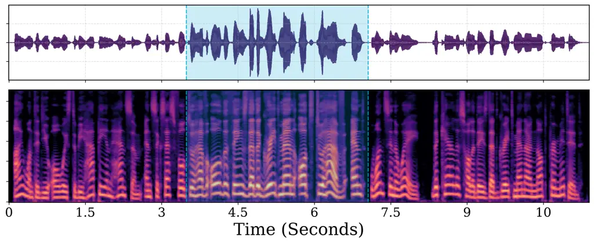

# LOUD AND CLEAR: DYNAMIC ACTIVATION STEERING FOR IMPROVING SPEECH INTELLIGIBILITY IN NOISY ENVIRONMENTS

Seymanur Akti    Alexander Waibel

###### Abstract

Speech becomes less intelligible in noisy environments, and humans
naturally adapt their voice to compensate. Inspired by this behavior, we
investigate whether a text-to-speech (TTS) model can be guided to
produce more intelligible speech using activation steering, without
retraining. We focus on two characteristics of the Lombard effect:
increased vocal effort and hyper-articulation. We introduce a
prompt-relative steering mechanism that prevents steering effects from
accumulating during generation while allowing their strength to be
adjusted dynamically. Across seen and unseen speakers and multiple
languages, our method produces systematic changes in Lombard-related
acoustic features, preserves speaker similarity (89–95%), and reduces
WER under background noise by 7–22% at 1 dB SNR. These results show that
pretrained TTS models can be dynamically controlled to generate more
intelligible speech without retraining.

###### Index Terms: 

text-to-speech, activation steering, speech intelligibility, Lombard
effect

^(†)^(†)address: ¹Karlsruhe Institute of Technology (KIT), Karlsruhe,
Germany  
²KIT Campus Transfer (KCT), Karlsruhe, Germany  
³Carnegie Mellon University (CMU), Pittsburgh, USA

## 1 Introduction

Humans naturally adapt their speaking style to challenging acoustic
conditions such as noise, a phenomenon known as the Lombard effect.
These adaptations improve speech intelligibility through increased vocal
effort, higher pitch, slower speaking rate, flattened spectral tilt, and
clearer articulation \[1, 2\]. Such articulatory changes have also been
shown to be relevant to robust speech recognition \[3\]. Reproducing
such adaptations in synthesized speech could benefit speech synthesis in
noisy environments and applications requiring enhanced intelligibility,
such as second-language (L2) learning and assistive communication.

Early near-end listening enhancement (NELE) and Lombard synthesis relied
on signal-processing techniques, including spectral modification \[4, 5,
6, 7\], dynamic-range compression \[8, 9\], and prosodic
manipulation \[10\], often introducing acoustic distortions. Recent
neural TTS approaches instead use transfer learning \[11, 12\],
fine-tuning \[13\], spectral-tilt augmentation \[14\], explicit
pitch/energy modeling \[15\], ASR-guided loudness control \[16\], and
latent-space interpolation \[17\]. These methods primarily target global
acoustic properties such as vocal effort, pitch, and spectral
characteristics, while hyper-articulation remains less explored.
Articulation has been modeled using HMMs \[18\] and Global Style Tokens
(GSTs) \[19\], but vocal effort and hyper-articulation have generally
been treated as separate control dimensions. A recent study proposed
joint continuous control of both attributes at the utterance and word
levels \[20\].

In real-world settings, the required degree of intelligibility
enhancement may vary with acoustic conditions or listener requirements.
Human speakers continuously adapt their speaking style to environmental
feedback, motivating TTS systems that can dynamically adjust
intelligibility-related attributes, potentially within an utterance.
Prior work has explored incremental speech transformation \[21\] and
ASR-based feedback for dynamic loudness control \[16\], but does not
provide joint, continuous, within-utterance control of vocal effort and
hyper-articulation. Moreover, existing Lombard TTS methods generally
rely on training, fine-tuning, or fixed signal-level transformations,
limiting dynamic inference-time control of multiple attributes across
speakers and languages.

We address these limitations with inference-time activation steering,
which modifies hidden representations along attribute-specific
directions without changing model parameters \[22\]. Recent work has
applied activation steering to TTS for emotion control \[23, 24, 25\]
and accent neutralization \[26\], but repeatedly applying a fixed
intervention during autoregressive generation can accumulate across
tokens and distort the output \[27\]. To overcome this limitation, we
introduce Prompt-Relative Activation Steering, which compares each
generated token’s activation with its baseline activation from the
reference prompt and applies only the residual steering needed to reach
the target. This prevents steering accumulation while enabling stable,
continuous control. Using paired speech data, we extract activation
directions for vocal effort and hyper-articulation from Qwen3-TTS \[28\]
and evaluate the approach across multiple speakers and languages. Audio
samples are shared at demo page. ¹¹ 1
https://seymanurakti.github.io/loud-and-clear/

Our contributions are threefold: (1) joint and continuous control of
vocal effort and hyper-articulation through training-free activation
steering, demonstrated across speakers and languages, (2) a
prompt-relative mechanism that prevents steering accumulation during
autoregressive generation, and (3) dynamic within-utterance control,
allowing steering strength to be modified during synthesis.

## 2 Method

Following prior work on activation steering \[25, 24, 26\], we extract
attribute-specific steering directions from paired speech conditions and
apply them to hidden representations during inference. We use Qwen3-TTS
and intervene on the residual outputs of its LLM-based autoregressive
backbone. We consider two intelligibility-related attributes: vocal
effort and hyper-articulation. Their steering directions are extracted
independently and combined for joint control. The control is applied
only to generated tokens to enable dynamic control in streaming mode.

### 2.1 Steering Vector Extraction

We first synthesize paired speech samples using the voice-cloning
generation method of Qwen3-TTS. Each pair is produced by the same
speaker with identical linguistic content but different speaking styles,
isolating the target attribute.

Let $`\mathbf{h}_{l,t}^{(x,i)}`$ denote the hidden representation at
layer $`l`$ and generated-token position $`t`$ for utterance $`i`$ with
speaking style $`x`$. We obtain an utterance-level representation by
averaging over generated tokens:

```math
\mathbf{h}_{l,i}^{(x)}=\frac{1}{T_{i}}\sum_{t=1}^{T_{i}}\mathbf{h}_{l,t}^{(x)} \tag{1}
```

where $`T_{i}`$ is the number of generated tokens for utterance $`i`$.
The steering direction for attribute $`k`$ at layer $`l`$ is computed as
the average difference between the target and reference speaking styles
across $`N_{k}`$ paired samples:

```math
\mathbf{v}_{l}^{k}=\frac{1}{N_{k}}\sum_{i=1}^{N_{k}}(\mathbf{h}_{l,i}^{(target)}-\mathbf{h}_{l,i}^{(reference)}) \tag{2}
```

where $`k\in\{E,A\}`$ denotes vocal effort and hyper-articulation,
respectively. For vocal effort, the target and reference conditions
correspond to loud and regular speech from EARS dataset \[29\], while
for hyper-articulation they correspond to enunciated and default speech
from Expresso dataset \[30\]. The directions are extracted only from
generated-token positions rather than input prompt tokens, so that they
characterize the representations used during speech generation and can
be applied directly to the autoregressive generation process.

### 2.2 Joint Control of Vocal Effort and Articulation

The two attributes are controlled jointly by combining their layer-wise
steering directions. Let $`\mathbf{v}_{l}^{E}`$ and
$`\mathbf{v}_{l}^{A}`$ denote the vocal-effort and articulation
directions, respectively and $`\lambda_{E}`$ and $`\lambda_{A}`$ are the
user-defined control coefficients:

```math
\mathbf{v}_{l}^{\mathrm{joint}}=\lambda_{E}\mathbf{v}_{l}^{E}+\lambda_{A}\mathbf{v}_{l}^{A} \tag{3}
```

This formulation provides continuous control over the relative
contribution of vocal effort and articulation. In particular, setting
one coefficient to zero produces single-attribute steering, while
non-zero values for both coefficients provide joint continuous control.

### 2.3 Prompt-Relative Activation Steering

Adding a fixed steering vector to every generated token can lead to
cumulative changes in the hidden representations, as each token already
inherits part of the steering effect through causal attention.
Consequently, the generated audio gets distorted as the sequence becomes
longer. To mitigate this effect, we perform prompt-relative steering.

During prompt processing, we compute the mean projection of the hidden
representations corresponding to the reference audio segment onto the
normalized joint steering direction. This projection
$`p_{l}^{baseline}`$ serves as the prompt-specific baseline for
subsequent generation. The target projection $`p^{*}_{l}`$ is then
defined as the baseline projection plus the magnitude of the weighted
joint steering vector at each layer.

```math
p_{l}^{baseline}=\frac{1}{T_{p}}\sum_{t=1}^{T_{p}}\mathbf{h}_{l,t}^{\top}\frac{\mathbf{v}_{l}^{\mathrm{joint}}}{||\mathbf{v}_{l}^{\mathrm{joint}}||_{2}} \tag{4}
```

```math
p^{*}_{l}=p_{l}^{baseline}+||\mathbf{v}_{l}^{\mathrm{joint}}||_{2} \tag{5}
```

During generation, for each hidden representation $`\mathbf{h}_{l,t}`$,
we compute its projection onto the unit joint steering vector,
representing its current alignment with the steering direction.

```math
p_{l,t}=\mathbf{h}_{l,t}^{\top}\frac{\mathbf{v}_{l}^{\mathrm{joint}}}{||\mathbf{v}_{l}^{\mathrm{joint}}||_{2}} \tag{6}
```

The required steering magnitude is calculated as the difference between
the target and current projections, and the residual is applied along
the unit joint steering direction:

```math
\tilde{\mathbf{h}}_{l,t}=\mathbf{h}_{l,t}+(p^{*}_{l}-p_{l,t})\frac{\mathbf{v}_{l}^{\mathrm{joint}}}{||\mathbf{v}_{l}^{\mathrm{joint}}||_{2}} \tag{7}
```

The residual steering is signed and can therefore be either steering the
token in positive or negative direction. This is important for online
control: when the steering strengths are reduced during generation, the
target projection is reduced accordingly, and a negative residual
removes part of the previously applied steering, allowing the hidden
representation to move back toward the prompt baseline.

Finally, the modified representation is normalized to preserve the
original hidden-state magnitude. The steering procedure is applied to
selected Transformer layers (19–20) during autoregressive inference.

## 3 Experiments and Results

The activation steering vectors were extracted from the regular and loud
subsets of EARS \[29\] (107 speakers) and the default and enunciated
subsets of Expresso \[30\] (4 speakers). We follow the same evaluation
protocol with SLE \[20\], synthesizing first 5 lists of Harvard
sentences \[31\] for four Expresso speakers. We additionally evaluate
generalization to unseen speakers using the first 10 speakers of VCTK
and to unseen languages using the German, Spanish, and Japanese test
sets from TTS Multilingual ²² 2 ![[Uncaptioned
image]](arxiv-2610-07647v1--6c7fbc7c5a85.figures/figure-1.webp)[MiniMaxAI/TTS-Multilingual-Test-Set](https://huggingface.co/datasets/MiniMaxAI/TTS-Multilingual-Test-Set).

We use acoustic and intelligibility measures to assess the effects of
steering. Vowel Space Area (VSA) is the area spanned by the corner
vowels /a/, /i/, and /u/ in the F1--F2 space, correlated with increased
articulatory distinctiveness. Phoneme alignments were obtained by the
Montreal Forced Aligner ³³ 3 ![[Uncaptioned
image]](arxiv-2610-07647v1--6c7fbc7c5a85.figures/figure-2.webp)[MontrealCorpusTools/Montreal-Forced-Aligner](https://github.com/MontrealCorpusTools/Montreal-Forced-Aligner),
with formants extracted using Parselmouth ⁴⁴ 4 ![[Uncaptioned
image]](arxiv-2610-07647v1--6c7fbc7c5a85.figures/figure-2.webp)[YannickJadoul/Parselmouth](https://github.com/YannickJadoul/Parselmouth).
Spectral Tilt (ST) is computed as the ratio of spectral energy in the
1–5 kHz band to that below 1 kHz and reflects changes associated with
vocal effort. Phoneme Rate (PR) is the number of phonemes produced per
second. Speaker Similarity (SSIM) is measured as the cosine similarity
between WavLM speaker embeddings ⁵⁵ 5 ![[Uncaptioned
image]](arxiv-2610-07647v1--6c7fbc7c5a85.figures/figure-1.webp)[microsoft/wavlm-base-sv](https://huggingface.co/microsoft/wavlm-base-sv)
of synthesized and reference speech.Word Error Rate (WER) is computed
using Whisper-medium ⁶⁶ 6 ![[Uncaptioned
image]](arxiv-2610-07647v1--6c7fbc7c5a85.figures/figure-2.webp)[openai/whisper](https://github.com/openai/whisper)
as an intelligibility measure.

|                              |                    |                 |                  |                   |                   |
| ---------------------------- | ------------------ | --------------- | ---------------- | ----------------- | ----------------- |
| Condition                    | WER $`\downarrow`$ | ST $`\uparrow`$ | VSA $`\uparrow`$ | PR $`\downarrow`$ | SSIM $`\uparrow`$ |
| SLE \[20\]                   |                    |                 |                  |                   |                   |
| Baseline                     | 4.86               | -19.89          | 5.51             | 15.97             | 0.86              |
| Half scaling                 | 0.70               | -17.81          | 7.71             | 12.36             | 0.86              |
| Full scaling                 | 1.09               | -14.70          | 7.30             | 10.63             | 0.84              |
| Ours                         |                    |                 |                  |                   |                   |
| Baseline                     | 1.89               | -18.87          | 4.18             | 15.14             | 0.90              |
| Low ($`\lambda_{E,A}=0.5`$)  | 1.77               | -16.61          | 5.35             | 14.13             | 0.90              |
| Mid ($`\lambda_{E,A}=1.0`$)  | 1.41               | -15.89          | 5.77             | 13.25             | 0.90              |
| High ($`\lambda_{E,A}=2.0`$) | 1.22               | -15.03          | 5.84             | 12.30             | 0.89              |
| Vocal effort only            | 1.81               | -14.76          | 5.52             | 15.06             | 0.90              |
| Articulation only            | 1.71               | -18.83          | 5.28             | 12.36             | 0.89              |

Table 1: Performance on the Expresso dataset. Highlighted rows indicate
proposed configurations.

| Test Set | Condition | WER $`\downarrow`$ | ST $`\uparrow`$ | VSA $`\uparrow`$ | PR $`\downarrow`$ | SSIM $`\uparrow`$ |
| -------- | --------- | ------------------ | --------------- | ---------------- | ----------------- | ----------------- |
| VCTK     | Baseline  | 0.51               | -21.19          | 1.31             | 16.88             | 0.96              |
|          | Steered   | 0.29               | -17.41          | 1.93             | 14.93             | 0.95              |
| German   | Baseline  | 0.77               | -18.18          | 9.05             | 14.22             | 0.96              |
|          | Steered   | 1.26               | -13.04          | 4.00             | 11.59             | 0.95              |
| Spanish  | Baseline  | 1.76               | -22.91          | 5.09             | 16.88             | 0.98              |
|          | Steered   | 1.80               | -18.29          | 6.76             | 10.93             | 0.95              |
| Japanese | Baseline  | 4.68               | -19.61          | 2.13             | 12.35             | 0.96              |
|          | Steered   | 5.64               | -15.88          | 2.32             | 11.95             | 0.94              |

Table 2: Multilingual and multispeaker evaluation across VCTK, German,
Spanish, and Japanese test sets.

### 3.1 Lombard-Related Acoustic Changes

We evaluate multiple steering strengths, with
$`\lambda_{E}=\lambda_{A}=2.0`$ being the maximum safe strength observed
experimentally, thereby also testing extrapolation beyond the reference
data. The baseline is unsteered Qwen3-TTS speech.

Table 1 shows systematic changes with increasing steering strength:
spectral tilt becomes less negative, speaking rate decreases, and
vowel-space dispersion increases. These trends are consistent with
increased vocal effort and hyper-articulation. The individual directions
produce distinct effects, with vocal-effort steering primarily affecting
spectral tilt and articulation steering producing a stronger reduction
in speaking rate. Both directions also increase VSA, while joint
steering combines these effects. Compared to SLE \[20\], Qwen3-TTS
baseline achieves lower WER ($`\Delta=-2.97`$) for regular speech and
maintains slightly higher speaker similarity across steering conditions.
The proposed method produces comparable changes in spectral tilt,
speaking rate, and VSA relative to their corresponding baselines. While
SLE was trained with the same speakers, our model achieves comparable
results without additional training, suggesting potential generalization
to other speakers.

We further evaluate generalization to unseen VCTK speakers and to
German, Spanish, and Japanese, as results shown in Table 2. The steering
directions consistently modify spectral tilt and speaking rate across
speakers and languages, although VSA changes are more speaker- and
language-dependent. This is expected since the acoustic realization of
hyper-articulation depends on phonological structure. The multilingual
results nevertheless provide evidence of cross-lingual transfer, while
suggesting that precise articulatory control may benefit from
language-specific calibration.

Speaker similarity remains largely preserved across steering conditions,
indicating that the method can modify Lombard-related attributes without
compromising speaker identity.

Figure 1: WER results in background noise with different SNR levels.

### 3.2 Speech Intelligibility In Noise

We evaluate speech intelligibility under restaurant babble noise at SNRs
of 1, 5, and 10 dB using WER. For each condition, the noise is scaled to
the speech power to maintain a fixed SNR across conditions and avoid
attributing intelligibility differences to overall energy gain which
could be simply achieved by turning on the device volume. The results in
Figure 1 show that WER consistently decreases when steering is applied.
The effect is more prominent in higher noise levels, especially for
German, Spanish and Japanese.

### 3.3 Human Evaluation

We conduct a user study to evaluate the perceived intelligibility of the
proposed method. Participants evaluate 15 pairs of baseline and steered
utterances presented with background noise at an SNR of 5 dB. For each
pair, participants rate their preference on a scale from $`-3`$ to
$`+3`$, where $`+3`$ indicates a strong preference for the steered audio
and $`-3`$ indicates a strong preference for the baseline. Participants
are not informed which sample corresponds to which system, and the order
is randomized. Seven participants completed the evaluation, resulting in
a Comparison Mean Opinion Score (CMOS) of +0.958 $`\pm`$ 0.48 with a 95%
confidence interval. The positive CMOS indicates a preference for the
proposed method and provides subjective evidence consistent with the
objective intelligibility results.

### 3.4 Dynamic Steering Evaluation

We adapt the steering method to Qwen3-TTS streaming mode to simulate
dynamic steering-strength adaptation. We synthesize 10 long sentences
from LibriTTS \[32\] (12–18 seconds) using a single Expresso reference
speaker. Steering is applied only during an interval of the utterance,
after which the steering strength returns to zero. We measure spectral
tilt changes over time and the additional latency introduced by
token-level steering during streaming generation.

| Steering Mode     | Mean TTFA (s) | Mean RTF |
| ----------------- | ------------- | -------- |
| No Steering       | 0.469         | 1.078    |
| Dynamic Steering  | 0.474         | 1.088    |
| Constant Steering | 0.475         | 1.086    |

Table 3: Streaming performance across evaluation modes.

As shown in Table 3, our streaming activation steering mechanism
maintains real-time efficiency, confirming that the streaming hooks add
negligible computational overhead. Meanwhile, Table 4 demonstrates
temporal precision: dynamic steering successfully follows the no
steering baseline prior to intervention, shifts instantaneously during
the active steering window and matches constant steering behavior, and
cleanly reverts post-intervention.

| Steering Mode     | Before | During | After  |
| ----------------- | ------ | ------ | ------ |
| No Steering       | -20.84 | -21.06 | -20.96 |
| Dynamic Steering  | -20.51 | -16.94 | -20.68 |
| Constant Steering | -17.75 | -17.26 | -17.65 |

Table 4: Segmented spectral tilt (dB) across steering modes.

Figure 2 shows an example of dynamically steered speech. The increase in
amplitude and shift in energy toward higher frequencies during steering
correspond to the simulated Lombard effect. After the steering interval
ends, speech returns to its baseline amplitude and frequency
distribution, demonstrating dynamic control during streaming.



Figure 2: Features of the dynamically steered speech. Highlighted part
corresponds to active steering window.

## 4 Conclusion

We presented a training-free activation steering approach for
controllable Lombard speech synthesis with Qwen3-TTS. Using paired
speech data, our method jointly controls vocal effort and
hyper-articulation without model fine-tuning, with experiments across
seen and unseen speakers and multiple languages. To prevent cumulative
effects in autoregressive generation, we introduced Prompt-Relative
Activation Steering, which regulates each activation relative to the
reference voice and enables stable, dynamic control within an utterance.
Experiments demonstrate systematic Lombard-related acoustic changes,
preserved speaker similarity, and improved ASR-based intelligibility
under noise. Future work will address more diverse acoustic environments
and listener types and improve hyper-articulation control across
languages.

## References

- \[1\] J. Junqua (1993) The lombard reflex and its role on human
  listeners and automatic speech recognizers. The Journal of the
  Acoustical Society of America 93 (1), pp. 510–524. Cited by: §1.
- \[2\] H. Soltau and A. Waibel (2000) Specialized acoustic models for
  hyperarticulated speech. In ICASSP, Cited by: §1.
- \[3\] F. Metze and A. Waibel (2002) A flexible stream architecture for
  asr using articulatory features. In Proc. ICSLP 2002, pp. 2133–2136.
  Cited by: §1.
- \[4\] H. Brouckxon, W. Verhelst, and B. D. Schuymer (2008) Time and
  frequency dependent amplification for speech intelligibility
  enhancement in noisy environments. In Interspeech, Cited by: §1.
- \[5\] B. Sauert and P. Vary (2012) Near-end listening enhancement in
  the presence of bandpass noises. In Speech Communication; 10. ITG
  Symposium, Cited by: §1.
- \[6\] C. H. Taal and J. Jensen (2013) SII-based speech preprocessing
  for intelligibility improvement in noise.. In Interspeech, Cited by:
  §1.
- \[7\] C. H. Taal, R. C. Hendriks, and R. Heusdens (2014) Speech energy
  redistribution for intelligibility improvement in noise based on a
  perceptual distortion measure. Computer Speech & Language 28 (4),
  pp. 858–872. Cited by: §1.
- \[8\] T. Zorila and Y. Stylianou (2014) On spectral and time domain
  energy reallocation for speech-in-noise intelligibility enhancement..
  In Interspeech, Cited by: §1.
- \[9\] V. Kandia (2012) Speech-in-noise intelligibility improvement
  based on spectral shaping and dynamic range compression. In
  Interspeech, Cited by: §1.
- \[10\] T. Raitio, A. Suni, M. Vainio, and P. Alku (2011) Analysis of
  hmm-based lombard speech synthesis.. In Interspeech, Cited by: §1.
- \[11\] B. Bollepalli, L. Juvela, and P. Alku (2019) Lombard speech
  synthesis using transfer learning in a tacotron text-to-speech system.
  In Interspeech, Cited by: §1.
- \[12\] D. Paul, M. P. Shifas, Y. Pantazis, and Y. Stylianou (2020)
  Enhancing speech intelligibility in text-to-speech synthesis using
  speaking style conversion. In Interspeech, Cited by: §1.
- \[13\] Q. Hu, T. Bleisch, P. Petkov, T. Raitio, E. Marchi, and V.
  Lakshminarasimhan (2021) Whispered and lombard neural speech
  synthesis. In SLT, Cited by: §1.
- \[14\] T. Raitio, P. Petkov, J. Li, M. Shifas, A. Davis, and Y.
  Stylianou (2022) Vocal effort modeling in neural tts for improving the
  intelligibility of synthetic speech in noise. In Interspeech, Cited
  by: §1.
- \[15\] D. Woszczyk, M. S. Ribeiro, T. Merritt, and D. Korzekwa (2025)
  Voice conversion for lombard speaking style with implicit and explicit
  acoustic feature conditioning. arXiv preprint arXiv:2507.09310. Cited
  by: §1.
- \[16\] S. Novitasari, S. Sakti, and S. Nakamura (2021) Dynamically
  adaptive machine speech chain inference for tts in noisy environment:
  listen and speak louder.. In Interspeech, Cited by: §1, §1.
- \[17\] T. H. G. Lobato and M. Schäfer (2025) Gradual modeling of the
  lombard effect by modifying speaker embeddings from a text-to-speech
  model. In Interspeech, Cited by: §1.
- \[18\] B. Picart, T. Drugman, and T. Dutoit (2020) Analysis and
  synthesis of hypo and hyperarticulated speech. arXiv preprint
  arXiv:2006.04136. Cited by: §1.
- \[19\] M. Nishihara, D. Wells, K. Richmond, and A. Pine (2024)
  Low-dimensional style token control for hyperarticulated speech
  synthesis. In Interspeech, Cited by: §1.
- \[20\] S. Akti and A. Waibel (2026) Synthesizing the lombard effect:
  multi-level control of speech clarity and vocal effort in tts. arXiv
  preprint arXiv:2606.23176. Cited by: §1, §3.1, Table 1, §3.
- \[21\] S. Rottschäfer, H. Buschmeier, H. van Welbergen, and S.
  Kopp (2015) Online lombard-adaptation in incremental speech synthesis.
  In Interspeech, Cited by: §1.
- \[22\] A. M. Turner, L. Thiergart, G. Leech, D. Udell, J. J.
  Vazquez, U. Mini, and M. MacDiarmid (2023) Steering language models
  with activation engineering. arXiv preprint arXiv:2308.10248. Cited
  by: §1.
- \[23\] L. Zhou, H. Jiang, J. Li, T. Wang, and H. Li (2026) Emoshift:
  lightweight activation steering for enhanced emotion-aware speech
  synthesis. In ICASSP, Cited by: §1.
- \[24\] S. Wang, S. Tan, S. Liu, H. Jia, G. Huang, J. Bailey, and T.
  Dang (2026) Cocoemo: composable and controllable human-like emotional
  tts via activation steering. arXiv preprint arXiv:2602.03420. Cited
  by: §1, §2.
- \[25\] T. Xie, S. Yang, C. Li, D. Yu, and L. Liu (2025) Emosteer-tts:
  fine-grained and training-free emotion-controllable text-to-speech via
  activation steering. arXiv preprint arXiv:2508.03543. Cited by: §1,
  §2.
- \[26\] M. Yang and J. H. Hansen (2026) Activation steering for
  accent-neutralized zero-shot text-to-speech. arXiv preprint
  arXiv:2603.05977. Cited by: §1, §2.
- \[27\] D. Kang, Z. Liu, N. Ma, Y. Huang, Z. Tan, and M. Jiang (2026)
  Prompt-activation duality: improving activation steering via
  attention-level interventions. arXiv preprint arXiv:2605.10664. Cited
  by: §1.
- \[28\] H. Hu, X. Zhu, T. He, D. Guo, B. Zhang, X. Wang, Z. Guo, Z.
  Jiang, H. Hao, Z. Guo, et al. (2026) Qwen3-tts technical report. arXiv
  preprint arXiv:2601.15621. Cited by: §1.
- \[29\] J. Richter, Y. Wu, S. Krenn, S. Welker, B. Lay, S. Watanabe, A.
  Richard, and T. Gerkmann (2024) EARS: an anechoic fullband speech
  dataset benchmarked for speech enhancement and dereverberation. arXiv
  preprint arXiv:2406.06185. Cited by: §2.1, §3.
- \[30\] T. A. Nguyen, W. Hsu, A. d’Avirro, B. Shi, I. Gat, M.
  Fazel-Zarani, T. Remez, J. Copet, G. Synnaeve, M. Hassid, et
  al. (2023) Expresso: a benchmark and analysis of discrete expressive
  speech resynthesis. In Interspeech, Cited by: §2.1, §3.
- \[31\] E. H. Rothauser (1969) IEEE recommended practice for speech
  quality measurements. IEEE Transactions on Audio and Electroacoustics
  17 (3), pp. 225–246. Cited by: §3.
- \[32\] Y. Koizumi, H. Zen, S. Karita, Y. Ding, K. Yatabe, N.
  Morioka, M. Bacchiani, Y. Zhang, W. Han, and A. Bapna (2023)
  Libritts-r: a restored multi-speaker text-to-speech corpus. In
  Interspeech, Cited by: §3.4.
