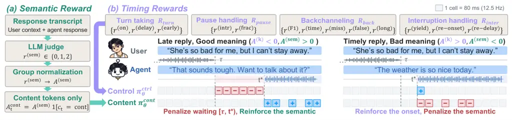
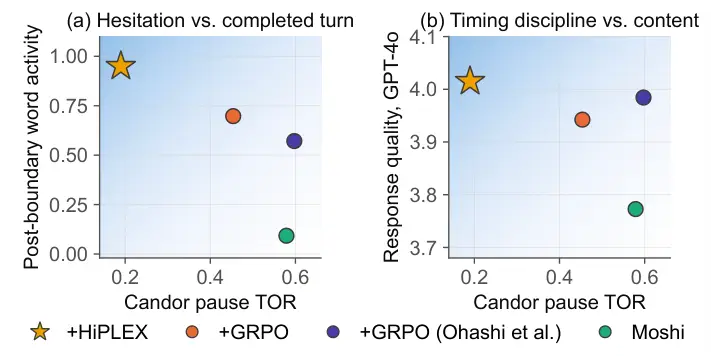

# HiPLEX: Hierarchical Policy Factorization for Full Duplex Speech Language Models

Kyudan Jung ^(†)^(†)thanks: This publication was created by Kyudan Jung
while an intern at Qualcomm Technologies, Inc. (QTI) and currently
attends Korea Advanced Institute of Sceience and Technology (KAIST).
Affiliation: Qualcomm AI Research Affiliation: KAIST AI
Email: <kyudan@kaist.ac.kr>    Hyunsin Park Affiliation: Qualcomm AI
Research Email: <hyunsinp@qti.qualcomm.com>    Yoonhyung Lee
Affiliation: Qualcomm AI Research Email: <jinhpark@qti.qualcomm.com>   
Jinhwan Park Affiliation: Qualcomm AI Research
Email: <yoonhyun@qti.qualcomm.com>    Jinhyeok Yang, KiHyun Nam, Jaegul
Choo, Jinkyu Lee Affiliation: Qualcomm AI Research Affiliation: KAIST AI
Email: <jinhyang@qti.qualcomm.com> Email: <kihynam@qti.qualcomm.com>
Email: <jchoo@kaist.ac.kr> Email: <jinkyu@qti.qualcomm.com>

###### Abstract

As human–AI interactions become more conversational, full-duplex speech
language models capable of natural real-time dialogue are growing in
importance. Beyond generating appropriate responses, these models must
coordinate turn-taking, backchanneling, and floor management in real
time. Reinforcement learning (RL) provides a way to refine these
behaviors through direct feedback on interaction outcomes. However,
existing RL methods either apply timing feedback to a token policy or
optimize semantic content, leaving the joint improvement of timing and
content unresolved. We introduce HiPLEX, an RL framework that factorizes
a pretrained full-duplex text policy into a control policy that decides
when to emit content and a conditional content policy that decides what
to emit. The first factor selects among $`\mathtt{pad}`$,
$`\mathtt{epad}`$, and $`\mathtt{cont}`$. The second selects a token
only when $`\mathtt{cont}`$ is chosen. This hierarchy describes
conditional actions within each frame and uses the model’s existing text
head. We route timing advantages to the token-group factor through
event-causal masks derived from generated speech episodes, and route an
LLM-judge semantic advantage to the conditional content factor. Across
three Moshi seeds on Full-Duplex-Bench v1, HiPLEX reduces takeover rates
during natural user pauses and backchannel opportunities, and shortens
post-interruption response latency relative to GRPO, while maintaining
comparable judged interruption-response quality. On Moshi and
PersonaPlex, HiPLEX better matches pooled human turn-timing and
backchannel-rate marginals than GRPO.

|     |
| --- |
|     |

## 1 Introduction

Speech is an intrinsically duplex medium. Humans listen while preparing
to speak, produce short acknowledgments without taking the floor, stop
when interrupted, and resume when the floor becomes available (Skantze,
2021). Recent full-duplex speech language models (SLMs) move toward this
interaction pattern by generating audio in a streaming fashion while
continuously conditioning on incoming user speech (Défossez et al.,
2024; Roy et al., 2026; Chen et al., 2025). However, learning such
behavior remains difficult: the model must decide not only _what_ to
say, but also _when_, _how long_, and _under which conversational floor
state_ to say it. Recent full-duplex RL methods already separate timing
from content. ASPIRin projects the action space into binary
active/inactive speech states (Hsiao et al., 2026), DuplexPO optimizes
purely timing-based rewards with GRPO inside fixed _dynamics-critical
windows_ around annotated events, keeping semantics out of the RL
objective (Li et al., 2026). Yet two structural questions remain. First,
where should credit land within an event? A fixed window applies one
advantage to every token inside it, yet the frames that cause a late
onset differ from those that cause a well-timed one, blaming the wrong
frames pushes timing the wrong way. Second, must content be excluded
from RL to be protected? If nothing in the reward asks for a better
answer, content can stay at the level supervised fine-tuning left it,
and it could even degrade: the timing reward still flows through the
same policy that selects content tokens, and we show that timing-only
training degrades judged quality while timing improves.

We treat full-duplex speech RL as a hierarchical credit-assignment
problem, in the spirit of hierarchical advantage estimation for LLM
agents (Peng et al., 2026), resolved with a mechanism specific to
streaming speech. At each frame the high level decides whether and when
content emission is invoked: the text stream emits padding tokens as
placeholders when the model is not speaking (listening), exits padding
(about to speak), or enters the text content partition (speaking). Only
in the last case is the low-level content decision invoked. HiPLEX
derives these two conditional decisions from a Moshi (Défossez et al.,
2024)-style softmax, taking
$`\mathtt{pad}`$/$`\mathtt{epad}`$/$`\mathtt{cont}`$ marginals via
log-sum-exp and content tokens conditional inside the $`\mathtt{cont}`$
partition. Thus this is a conditional per-frame action
hierarchy—_whether/when to emit_ above _what to emit_—rather than an
option hierarchy or a pair of separate network modules. Both factors
come from the same pretrained head and introduce no new parameters. Each
decomposed interaction reward (turn onset, pause, backchannel, yield) is
then routed through an _event-causal credit mask_, a sign-dependent
eligibility rule computed from the policy’s own generated speech
episodes. An ASR-plus-LLM-judge semantic reward is routed to the
conditional content factor. The result is a high-level objective for
when to emit and a low-level objective for what to emit, rather than one
advantage broadcast over the flat token stream.

We make three contributions:

- •
  A two-level conditional action hierarchy with no architectural change.
  We factorize the pretrained text policy into a high-level decision
  over whether and when to invoke content emission and, when
  $`\mathtt{cont}`$ is selected, a low-level decision over which content
  token to emit. This exposes a hierarchy already implicit in generation
  and requires no new parameters.
- •
  Credit that follows event structure, not proximity. Our _event-causal
  credit masks_ are sign-dependent and read off the policy’s own speech
  episodes: a late response penalizes the waiting decisions that delayed
  it, whereas a timely response credits its onset. A fixed window cannot
  make this distinction.
- •
  A frontier full-duplex model post-training method with comprehensive
  analysis. On Full-Duplex-Bench v1, HiPLEX gives the strongest overall
  trade-off on Moshi and improves the restraint axes on PersonaPlex. We
  report a complementary post-boundary word-activity diagnostic for the
  mixed PersonaPlex turn results and analyze the interaction styles that
  different metrics favor.

## 2 Related Work

#### RL for full-duplex interaction.

Speech language models pursue end-to-end full duplex system to implement
human-like behavior and gain low latency (Défossez et al., 2024; Chen et
al., 2025; Roy et al., 2026; Kim et al., 2026; Wang et al., 2026). Moshi
interleaves an inner-monologue text stream with streaming audio
generation and is the substrate most full-duplex work builds on
(Défossez et al., 2024). PersonaPlex adds prompt-based voice and role
control on top of it (Roy et al., 2026), and related systems target
simultaneous listening and speaking, backchannels, and interruption
handling (Ma et al., 2025; Veluri et al., 2024). We assume this modeling
and study the RL objective that refines its interaction dynamics.
Raw-token RL can improve turn timing while degrading content through
repetition and drift (Hsiao et al., 2026). Kyutai team applies GRPO to
Moshi with four faceted rewards (Ohashi et al., 2026). DuplexPO applies
GRPO with timing-only factorized rewards inside fixed dynamics-critical
windows around annotated events (Li et al., 2026).

#### Hierarchical RL and credit assignment.

Hierarchical reinforcement learning introduces structured decisions
through options, subpolicies, or manager–worker decompositions (Sutton
et al., 1999; Bacon et al., 2017; Kulkarni et al., 2016). For language
agents, flat policy-gradient methods must propagate sparse rewards
across long trajectories, which can be unstable (Peng et al., 2026).
HiPER aligns credit assignment with high-level subgoal segments and
low-level actions via Hierarchical Advantage Estimation (Peng et al.,
2026). HiPLEX adapts the principle that credit should follow the
decision structure rather than the token sequence to streaming speech.
Its hierarchy is conditional rather than option-based: the high-level
$`\mathtt{pad}`$/$`\mathtt{epad}`$/$`\mathtt{cont}`$ action determines
whether a low-level content decision is invoked at that frame. The
token-group factorization uses the pretrained text head without an added
manager, and audio-grounded event masks replace learned segment values.
Appendix A gives extended related works.



Figure 1: Timing and semantic credit assignment in HiPLEX. (a) An LLM
judge evaluates response relevance and coherence. HiPLEX normalizes
these scores within each rollout group and applies the semantic
advantage to the conditional content policy only where
$`c_{t}=\mathrm{cont}`$. (b) Timing components for the active
interaction type are normalized separately, and event-causal masks route
their advantages to control decisions. Each cell represents an 80-ms
frame.

## 3 Method

HiPLEX trains a full-duplex speech language model by assigning timing
feedback to a control policy and semantic feedback to a conditional
content policy. We first define the streaming setting and derive both
policies from the model’s existing text distribution. We then describe
the rewards, explain how they are assigned to individual decisions, and
present the training objective.

### 3.1 Problem Setup

We consider a full-duplex speech language model that processes and
generates audio in $`80`$ ms frames. At frame $`t`$, the model is
conditioned on user audio $`x_{\leq t}`$, its own past audio $`a_{<t}`$,
its past text tokens $`w_{<t}`$, and optional role or voice conditioning
$`p`$ (Roy et al., 2026). These inputs form the causal state
$`s_{t}=(x_{\leq t},a_{<t},w_{<t},p)`$. In Moshi-style models, the text
stream follows the same clock as the audio stream. We refer to text
tokens other than $`\mathtt{pad}`$ and $`\mathtt{epad}`$ as _content
tokens_. The $`\mathtt{pad}`$ token fills a frame without a new content
token, and $`\mathtt{epad}`$ marks the end of a padding span. Padding
can occur both during silence and within ongoing speech. Thus an
individual text token does not reliably indicate whether the model is
currently producing speech.

We train on annotated interaction windows covering four conversational
behaviors: turn taking, pause handling, backchanneling, and interruption
handling. These windows specify when the model should acknowledge the
user, respond after a user turn, remain silent during a user hesitation,
or yield to an interruption and re-enter after it ends. Appendix F
details how these windows are extracted from human conversations.

We measure the model’s timing behavior from its generated audio. We
extract speech spans with Silero VAD (Silero Team, 2024) and merge
consecutive spans separated by gaps of at most $`1`$ s into _speech
episodes_. Episodes lasting at most $`1`$ s are classified as _short_,
and longer episodes as _sustained_. Short episodes are used to identify
candidate backchannels, while sustained episodes are used to identify
turn and re-entry onsets. Together with the annotated event times and
intervals, these episodes provide a common temporal basis for computing
timing rewards across all four behaviors and selecting the control
decisions that receive credit (Section 3.3).

### 3.2 Control and Content Policy Factorization

Figure 2: Hierarchical policy factorization in HiPLEX.

We factorize the text policy into a high-level control policy and a
low-level _content policy_ $`\mathtt{cont}`$ as shown in Figure 2. The
control policy selects a token group at each frame. The content policy
selects a token only when the control policy selects the content group.
We partition the vocabulary into the singleton groups
$`\mathcal{V}_{\mathtt{pad}}=\{\mathtt{pad}\}`$ and
$`\mathcal{V}_{\mathtt{epad}}=\{\mathtt{epad}\}`$, and the content group
$`\mathcal{V}_{\mathtt{cont}}`$.

Let $`\ell_{t}(v)`$ denote the logit used to form text-token
probabilities at frame $`t`$. In our training runs, we divide the
model’s raw text logits by the text sampling temperature
$`T_{\mathrm{text}}=0.7`$ before constructing either factor. The control
policy assigns each group its total probability under the resulting flat
text distribution. We compute this group probability using a log-sum-exp
over its tokens and a softmax over the three groups.

```math
g_{t}(c)=\log\!\!\sum_{v\in\mathcal{V}_{c}}\!\exp\ell_{t}(v),\qquad\pi_{\theta}^{\mathrm{ctrl}}(c_{t}\!=\!c\mid s_{t})=\mathrm{softmax}(g_{t})_{c},\quad c\in\{\mathtt{pad},\mathtt{epad},\mathtt{cont}\}. \tag{1}
```

When $`c_{t}=\mathtt{cont}`$, the content policy is the conditional
distribution within $`\mathcal{V}_{\mathtt{cont}}`$.

```math
\pi_{\theta}^{\mathtt{cont}}(w_{t}\!=\!v\mid s_{t},c_{t}\!=\!\mathtt{cont})=\frac{\exp\ell_{t}(v)}{\sum_{u\in\mathcal{V}_{\mathtt{cont}}}\exp\ell_{t}(u)},\qquad v\in\mathcal{V}_{\mathtt{cont}}. \tag{2}
```

For a content token $`v`$, the two factors multiply to recover its
probability under this text distribution.

```math
\pi_{\theta}(w_{t}=v\mid s_{t})=\pi_{\theta}^{\mathrm{ctrl}}(c_{t}=\mathtt{cont}\mid s_{t})\pi_{\theta}^{\mathtt{cont}}(w_{t}=v\mid s_{t},c_{t}=\mathtt{cont}). \tag{3}
```

For $`\mathtt{pad}`$ and $`\mathtt{epad}`$, the control probability
alone equals the corresponding token probability. This factorization
reconstructs the temperature-scaled text-token distribution and
introduces no new parameters. Appendix C reports a numerical
reconstruction check.

This hierarchy describes whether to emit a content token and which token
to emit at each frame. The speech episodes connect these token decisions
to conversational timing. We assign timing advantages to the control
log-probability and semantic advantages to the conditional content
log-probability. The control and content policies are two factors of a
single model’s text distribution and share the same parameters. Thus,
although timing and semantic rewards are assigned to different policy
factors, optimizing either factor can also affect the other.

### 3.3 Rewards and Credit Assignment

For each annotated interaction window, we sample a group of $`G`$
rollouts from the current sampling policy
$`\pi_{\theta_{\mathrm{old}}}`$. The rollouts share the same user
context and annotated event. We score their timing with reward
components and their response quality with a semantic reward. Each score
is normalized within this group before it is assigned to policy
decisions. Figure 1 illustrates this procedure.

#### Timing rewards.

We use three timing-reward components for turn taking, two for pause
handling, five for backchanneling, and three for interruption handling.
Each component assigns a scalar score to a rollout by comparing the
generated speech with the annotated event. Only the components
corresponding to the sampled window’s interaction type are used. To
illustrate the reward design, we describe the turn-taking components in
detail and briefly summarize the remaining three interaction types.
Appendix D provides the precise definitions, matching rules, weights,
and edge cases for all components. Appendix G lists the training
hyperparameters.

- •
  Turn taking
  ($`R_{turn}=\{r^{(\mathrm{on})},r^{(\mathrm{delay})},r^{(\mathrm{early})}\}`$),
  the three components score response onset ($`r^{(\mathrm{on})}`$),
  response delay ($`r^{(\mathrm{delay})}`$), and early speech
  ($`r^{(\mathrm{early})}`$). Let $`\tau`$ be the end of the user’s turn
  and $`T`$ the end of the interaction window, measured from the window
  start. Let $`t^{\star}`$ be the earliest onset in $`[\tau,T]`$ of a
  speech episode lasting longer than $`1`$ s, if one exists. The onset
  and delay scores are

  ```math
  \displaystyle r^{(\mathrm{on})} \displaystyle=\begin{cases}\exp\left[-\dfrac{(t^{\star}-\tau)^{2}}{2\sigma^{2}}\right]+\beta\exp\left[-\dfrac{t^{\star}-\tau}{\kappa}\right],&\text{if a qualifying episode exists},\\
  -0.5,&\text{otherwise},\end{cases} \tag{4}
  ```

  ```math
  \displaystyle r^{(\mathrm{delay})} \displaystyle=\begin{cases}-\min\left(1,\dfrac{t^{\star}-\tau}{T-\tau}\right),&\text{if a qualifying episode exists},\\
  -1,&\text{otherwise}.\end{cases}
  ```

  The onset component $`r^{(\mathrm{on})}`$ favors responses close to
  $`\tau`$ and gives any valid response a higher score than a missing
  response. The parameters $`\sigma`$ and $`\kappa`$ control how quickly
  the two terms decay, and $`\beta`$ weights the second term. The delay
  component $`r^{(\mathrm{delay})}`$ decreases linearly with response
  delay relative to the remaining window length. We standardize their
  nonlinear onset and linear delay signals separately before weighting.
  To discourage premature responses, we assign an early-start penalty
  $`r^{(\mathrm{early})}=-0.5\rho_{\mathrm{early}}`$, where
  $`\rho_{\mathrm{early}}`$ is the duration of model speech in
  $`[0,\tau)`$ divided by $`\tau`$. Figure 6 illustrates these scores.
  The remaining interaction types use the following components.

- •
  Pause ($`R_{pause}=\{r^{(\mathrm{intr})},r^{(\mathrm{frac})}\}`$). A
  binary intrusion score penalizes any speech episode lasting at least
  $`1`$ s during a user hesitation. A speech-fraction penalty also
  discourages shorter intrusions by measuring the fraction of the window
  occupied by model speech.
- •
  Backchannel
  ($`R_{back}=\{r^{(\mathrm{F1})},r^{(\mathrm{time})},r^{(\mathrm{miss})},r^{(\mathrm{false})},r^{(\mathrm{long})}\}`$).
  An F1 score measures how well short episodes match annotated
  backchannel opportunities, following Ohashi et al. (2026). A separate
  timing score decreases with the distance from each opportunity to the
  nearest short episode. Three penalties cover missed opportunities,
  unmatched short episodes (false alarms), and episodes longer than
  $`1`$ s (overlong acknowledgments).
- •
  Interruption
  ($`R_{inter}=\{r^{(\mathrm{yield})},r^{(\text{re-onset})},r^{(\text{re-delay})}\}`$).
  A yield score penalizes model speech that overlaps the user’s
  interruption after a $`0.16`$ s grace period. Re-entry onset and delay
  use Eq. 4, with $`\tau`$ set to the end. They score the first
  sustained response that starts at or after the anchor.

#### Group-relative advantages.

We use parenthesized superscripts to identify reward components and
subscripts to index rollouts. For example, $`r_{i}^{(\mathrm{on})}`$
denotes the onset reward for rollout $`i`$. We omit the rollout index
when defining reward components. For each active timing component $`k`$
defined above, let $`r_{i}^{(k)}`$ denote its score for rollout $`i`$
among the $`G`$ rollouts sampled for the same interaction window.
Following Shao et al. (2024), we standardize each component
independently within this group. Let $`\bar{r}^{(k)}`$ and
$`s_{r}^{(k)}`$ denote the mean and population standard deviation of
$`\{r_{j}^{(k)}\}_{j=1}^{G}`$. The component advantage is

```math
A_{i}^{(k)}=\frac{r_{i}^{(k)}-\bar{r}^{(k)}}{\max(s_{r}^{(k)},\delta)},\qquad i=1,\ldots,G. \tag{5}
```

The constant $`\delta=10^{-8}`$ stabilizes the denominator. Independent
normalization makes components with different reward scales comparable.
If all rollouts receive the same score for a component, its advantage is
zero. For designated sparse components, we replace this zero advantage
with a fixed negative value when all rollouts fail. Appendix D specifies
the affected components, activation conditions, and constants.

#### Event-causal credit masks.

The group-relative advantage provides one score per reward component for
each rollout. We next determine which control decisions within that
rollout should receive this score. We select these decisions using the
model’s speech episodes, the ground-truth event timing, and the sign of
the component advantage. A binary mask $`M_{t}^{(k)}`$ is one at
selected frames and zero elsewhere. Omitting the rollout index $`i`$,
the advantage applied to the control policy
$`\pi_{\theta}^{\mathrm{ctrl}}`$ at frame $`t`$ is

```math
A_{t}^{\mathrm{ctrl}}=\sum_{k}w_{k}A^{(k)}\,M^{(k)}_{t}. \tag{6}
```

Here $`w_{k}`$ weights component $`k`$. The selected frames follow the
speech behavior relevant to that component, such as waiting before a
response or continuing to speak during an interruption. We call these
_event-causal masks_ because they assign credit according to the role of
each control decision in the observed timing outcome. Speech episodes
distinguish waiting from padding within ongoing speech. All episode
boundaries, advantages, and masks are computed after rollout and held
fixed during the policy update. The masking rules for each interaction
axis are as follows:

- •
  Turn taking. Positive onset or delay advantages reinforce the decision
  to begin speaking. Non-positive advantages select the preceding
  waiting interval, so a late-response penalty discourages waiting
  without suppressing the eventual response. Early-start penalties
  target speech before the user’s turn ends.
- •
  Pause. Intrusion penalties target the speech produced in the
  pause-handling window. For a silent rollout, positive advantages
  reinforce the control decisions within the ground-truth pause windows.
- •
  Backchannel. Positive timing credit targets a matching short episode.
  Miss penalties target opportunity windows, false-alarm penalties
  target unmatched episodes, and overlong penalties target speech beyond
  the allowed duration.
- •
  Interruption. Failure-to-yield penalties target speech overlapping the
  user. For a rollout that yields, positive advantages reinforce silence
  during the interruption. Re-entry uses the same onset-versus-waiting
  rule as turn taking.

If several components select the same frame, their weighted advantages
add. Figure 1 illustrates these credit locations. Appendix E specifies
the component-level masks, temporal boundaries, and missing-event cases.

#### Semantic reward.

We assess response relevance and coherence by transcribing the user
context and generated speech with Parakeet-TDT-0.6B-v2 (NVIDIA, 2025)
and asking Gemini 2.5 Flash-Lite (Google DeepMind, 2025) to assign a
response-level score $`r_{i}^{(\mathrm{sem})}\in\{0,1,2\}`$. We
standardize these scores across the $`G`$ rollouts for the same context
to obtain
$`A_{i}^{(\mathrm{sem})}=(r_{i}^{(\mathrm{sem})}-\bar{r}^{(\mathrm{sem})})/\max(s_{r}^{(\mathrm{sem})},\delta)`$,
where $`\bar{r}^{(\mathrm{sem})}`$ and $`s_{r}^{(\mathrm{sem})}`$ are
the group mean and population standard deviation, and $`\delta`$ is the
same denominator floor used for timing advantages. Although the judge
scores the response as a whole, we apply its advantage only to the
conditional content policy $`\pi_{\theta}^{\mathtt{cont}}`$ at frames
where a content token was generated. Omitting the rollout index, this
gives
$`A_{t}^{\mathtt{cont}}=A^{(\mathrm{sem})}\,\mathbf{1}[c_{t}=\mathtt{cont}]`$.
Appendix H gives the scoring prompt and protocol.

### 3.4 Objective and Learning Rate

We optimize $`\pi_{\theta}^{\mathrm{ctrl}}`$ and
$`\pi_{\theta}^{\mathrm{cont}}`$ using their respective advantages. Each
policy has its own importance ratio relative to the policy that
generated the rollouts.

```math
\rho_{t}^{\mathrm{ctrl}}=\frac{\pi_{\theta}^{\mathrm{ctrl}}(c_{t}\mid s_{t})}{\pi_{\theta_{\mathrm{old}}}^{\mathrm{ctrl}}(c_{t}\mid s_{t})},\qquad\rho_{t}^{\mathtt{cont}}=\frac{\pi_{\theta}^{\mathtt{cont}}(w_{t}\mid s_{t},c_{t}\!=\!\mathtt{cont})}{\pi_{\theta_{\mathrm{old}}}^{\mathtt{cont}}(w_{t}\mid s_{t},c_{t}\!=\!\mathtt{cont})}. \tag{7}
```

The content ratio is evaluated only when $`c_{t}=\mathtt{cont}`$. For
factor $`z\in\{\mathrm{ctrl},\mathtt{cont}\}`$, let $`m_{t}^{z}`$ be a
binary mask indicating whether the decision at frame $`t`$ is included
in that factor’s policy loss. A value of one includes the decision, and
zero excludes it. The control mask selects decisions covered by the
event-causal masks, and the content mask selects content decisions. We
use PPO-style clipped losses (Schulman et al., 2017), normalized by the
number of decisions selected for each factor.

```math
\displaystyle\mathcal{L}_{z} \displaystyle=-\frac{1}{\sum_{t}m_{t}^{z}}\sum_{t}m_{t}^{z}\min\!\left(\rho_{t}^{z}A_{t}^{z},\ \mathrm{clip}(\rho_{t}^{z},1\!-\!\epsilon,1\!+\!\epsilon)A_{t}^{z}\right), \tag{8}
```

```math
\displaystyle\mathcal{L} \displaystyle=\alpha_{c}\mathcal{L}_{\mathrm{ctrl}}+\alpha_{l}\mathcal{L}_{\mathtt{cont}}+\mathcal{L}_{\mathrm{KL}}.
```

Here $`\epsilon`$ is the clipping range, and $`\alpha_{c}`$ and
$`\alpha_{l}`$ weight the two losses. A factor contributes no policy
loss when it has no selected decisions. Separate normalization keeps the
content loss from being diluted by long padding spans. We also
regularize each policy toward a frozen reference model, following the
reference-policy regularization in Shao et al. (2024):

```math
\displaystyle\mathcal{L}_{\mathrm{KL}} \displaystyle=\beta_{c}\mathrm{KL}(\pi_{\theta}^{\mathrm{ctrl}}\|\pi_{\mathrm{ref}}^{\mathrm{ctrl}})+\beta_{l}\pi_{\theta}^{\mathrm{ctrl}}(\mathtt{cont})\mathrm{KL}(\pi_{\theta}^{\mathtt{cont}}\|\pi_{\mathrm{ref}}^{\mathtt{cont}}). \tag{9}
```

The coefficients $`\beta_{c}`$ and $`\beta_{l}`$ control the strength of
regularization for the two policies. Training updates all model
parameters in a single phase. Appendix B gives the full training loop.

#### Learning rate.

Event-causal masking selects approximately $`20`$–$`30\%`$ of the frames
used by a flat update in our reported runs. Normalizing each loss by its
selected decisions controls the loss scale, but the two objectives still
update different decisions at different frequencies. We therefore tune
their learning rates separately. For Moshi, validation selects
$`4\times 10^{-6}`$ for HiPLEX and $`1\times 10^{-6}`$ for the flat GRPO
baseline. PersonaPlex uses $`2\times 10^{-6}`$ for HiPLEX with the
reward settings in Appendix G. Appendix L reports the Moshi baseline
sweep over the same learning-rate range.

|                                                                  |                             |                          |                   |                  |                   |                    |                       |                   |                   |                       |
| ---------------------------------------------------------------- | --------------------------- | ------------------------ | ----------------- | ---------------- | ----------------- | ------------------ | --------------------- | ----------------- | ----------------- | --------------------- |
|                                                                  | Pause                       |                          | Backchannel       |                  |                   | Smooth Turn Taking |                       | User Interruption |                   |                       |
| Model                                                            | Syn TOR$`{}^{*}\downarrow`$ | Candor TOR$`\downarrow`$ | TOR$`\downarrow`$ | Freq$`\uparrow`$ | JSD$`\downarrow`$ | TOR$`\uparrow`$    | Latency$`\downarrow`$ | TOR$`\uparrow`$   | Judge$`\uparrow`$ | Latency$`\downarrow`$ |
| Moshi (Défossez et al., 2024)                                    | 0.416                       | 0.579                    | 0.473             | 0.126            | 0.724             | 0.387              | 0.000                 | 0.772             | 3.773             | 0.852                 |
| \+ GRPO                                                          | 1.000                       | 0.454                    | 0.309             | 0.110            | 0.737             | 0.992              | 0.000                 | 0.955             | 3.942             | 0.660                 |
| + HiPLEX                                                         | 1.000                       | 0.306                    | 0.127             | 0.134            | 0.734             | 1.000              | 0.000                 | 0.960             | 4.083             | 0.439                 |
| PersonaPlex (Roy et al., 2026)                                   | 0.847                       | 0.426                    | 0.218             | 0.103            | 0.755             | 0.882              | 0.000                 | 0.945             | 2.693             | 0.712                 |
| \+ GRPO                                                          | 0.876                       | 0.444                    | 0.236             | 0.107            | 0.746             | 0.882              | 0.000                 | 0.956             | 2.712             | 0.548                 |
| + HiPLEX                                                         | 0.715                       | 0.218                    | 0.018             | 0.106            | 0.769             | 0.714              | 0.002                 | 0.975             | 2.938             | 0.590                 |
| _Reference numbers for the same RL recipe (Ohashi et al., 2026)_ |                             |                          |                   |                  |                   |                    |                       |                   |                   |                       |
| Moshi + RL, as reported                                          | 0.307                       | 0.463                    | 0.145             | 0.101            | 0.794             | 0.958              | 0.160                 | 1.000             | 3.630             | 0.409                 |
| Moshi + RL, released checkpoint                                  | 1.000                       | 0.597                    | 0.255             | 0.157            | 0.711             | 0.992              | 0.000                 | 0.955             | 3.984             | 0.530                 |
| PersonaPlex + RL, as reported                                    | 0.350                       | 0.356                    | 0.073             | 0.112            | 0.786             | 0.975              | 0.086                 | 0.995             | 4.533             | 0.223                 |
| PersonaPlex + RL, released checkpoint                            | 0.818                       | 0.384                    | 0.145             | 0.178            | 0.730             | 0.849              | 0.001                 | 0.995             | 3.427             | 0.534                 |

Table 1: Result of Full-Duplex-Bench v1. The trained Moshi rows are
seed-42 terminal checkpoints. Three-seed results are reported in
Table 12. The lower block contains calibration references and is not
used as a training baseline. Best per metric within a family in bold,
second best underlined.

## 4 Experimental Setup

#### Models and data.

We use Moshi (Défossez et al., 2024) which generates speech and an
aligned inner-monologue text stream on a $`12.5`$ Hz frame clock and
PersonaPlex (Roy et al., 2026) which adds role-prompt and voice
conditioning on the same backbone, which we hold fixed across training
and evaluation so that any difference comes from the RL objective. All
RL training uses conversation-only subsets of the Seamless-Interaction
corpus (Agrawal and others, 2025), following Ohashi et al. (2026). We
extract $`73{,}561`$ annotated interaction windows, approximately
balanced across the four conversational behaviors: turn taking, pause
handling, backchanneling, and interruption handling. Appendix F gives
the filtering, window rules, and statistics.

#### Baselines.

For each model family, we compare HiPLEX with the pretrained base model
and our reproduction of the GRPO-based training method of Ohashi et al.
(2026) (Table 1). This reproduced GRPO baseline uses the same pretrained
backbone as HiPLEX and serves as our primary comparison. We also report
Ohashi et al.’s published results alongside our evaluations of their
released Seamless-trained checkpoints in the lower block of Table 1.
Appendix L examines the sensitivity of the reproduced Moshi GRPO
baseline to its learning rate.

#### Ablations.

On Moshi, we first compare GRPO and HiPLEX with and without the semantic
reward. We then hold the factorized policy and rewards fixed and compare
four timing-credit rules: all-frame, fixed-window, random masking with
matched sparsity, and event-causal masking. To examine the fixed-window
credit assignment used in DuplexPO (Li et al., 2026), we include a
fixed-window variant under our training setup. We further examine the
training-judge scale on Moshi and stronger semantic feedback on
PersonaPlex (Appendices O and P).

#### Evaluation.

We evaluate on Full-Duplex-Bench v1 (Lin et al., 2025b), which measures
four full-duplex behaviors: holding silence during hesitation,
backchanneling without taking the floor, taking turns after user yield,
and responding to user interruptions. We follow the official streaming
protocol with real-time playback from $`t{=}0`$ and no silence
modification. Interruption latency measures the delay from the end of
the user’s interruption to the start of the model response, clamped at
zero. Response quality (Judge) is scored by gpt-4o-2024-08-06 (OpenAI, 2024) on frozen ASR transcripts (Appendix H). Since no single metric
fully captures all interaction behaviors, we report results across
multiple evaluation axes. For comparability, we report the official
metrics, while details of the evaluation protocol and metric
interpretation are provided in Appendices I and J.

## 5 Results

### 5.1 Main Comparison



Figure 3: Moshi family on Full-Duplex-Bench v1. (a) shows post-boundary
word activity, which may include speech initiated before the annotated
turn end. (b) shows judged quality conditional on a qualifying
interruption response. “+GRPO (Ohashi et al.)” is our evaluation of
their released checkpoint.

Table 1 reports Full-Duplex-Bench v1 results. The trained Moshi rows
correspond to 100-epoch checkpoints, following the training duration of
Ohashi et al. (2026). On Moshi, HiPLEX reduces CANDOR pause and
backchannel takeover rates and post-interruption response latency
relative to GRPO. These gains hold across three training seeds, while
mean judged response quality remains comparable (Table 12). The official
smooth-turn TOR is nearly saturated for both methods and therefore
provides limited evidence about turn-boundary behavior. On PersonaPlex,
HiPLEX also reduces pause and backchannel takeovers relative to GRPO.
These restraint gains coexist with a lower official smooth-turn TOR and
a longer post-interruption response latency. A complementary diagnostic
(Appendix J) shows more qualifying post-boundary word activity and a
shorter median offset to the first post-boundary word for HiPLEX in both
model families. On PersonaPlex, HiPLEX also begins speaking before the
boundary less often. Together, these diagnostics show a more favorable
balance of pre-boundary restraint and post-boundary word activity than
the official TOR alone suggests.

#### Pause restraint and response behavior.

A user hesitation and a completed turn can both contain a brief silence,
making them a joint test of when the model speaks. Figure 3(a) plots
CANDOR pause TOR against post-boundary word activity rather than the
nearly saturated official smooth-turn TOR. HiPLEX combines stronger
pause restraint with more post-boundary word activity than GRPO. As
discussed in Appendix J, this activity can include speech initiated
before the user turn ended and does not establish a higher rate of newly
initiated responses. Figure 3(b) plots CANDOR pause TOR against the
interruption-task Judge score, which is conditional on a qualifying
model response. For the displayed checkpoint, HiPLEX combines stronger
pause restraint with higher judged quality than GRPO. Across training
seeds, mean judged quality remains comparable.

### 5.2 The Same Recipe Needs a Different Step Size on the Two Families

Figure 4: Reward during training with otherwise identical settings
within each model family. Moshi is stable at $`4\!\times\!10^{-6}`$.
PersonaPlex (PP) collapses, remains suppression-dominated at half that
rate, and recovers with the rebalanced configuration (RB). Dotted lines
show endpoint benchmark scores.

Figure 5: Human timing in the training corpora. Each panel is one
quantity the benchmark scores.

Despite sharing Moshi’s backbone, PersonaPlex is considerably more
sensitive to the learning rate under the same training recipe, as shown
in Figure 4. At Moshi’s learning rate of $`4\times 10^{-6}`$, training
collapses with suppression increasing while initiation steadily
declines. Reducing the learning rate by half only delays convergence to
the same near-silent behavior. We attribute this narrower optimization
margin to PersonaPlex’s more talkative, floor-holding prompt prior,
which causes the early suppression signal to dominate learning.
Rebalancing the rewards toward initiation prevents this collapse and
keeps both rewards healthy throughout training. Additional diagnostic
analyses are provided in Appendix M.

### 5.3 Matching Human Timing, Not Just Passing a Rule

Official scores largely ask whether an event occurred, whereas human
timing is distributed. Figure 5 shows broad corpus distributions for
pauses, backchannel rate and length, and floor-transfer offset
(Appendix N explains more detail about data statistics). Thus a model
can pass a binary rule yet answer consistently late or acknowledge too
often. Given this nature, we report Wasserstein-1 distance between model
and pooled Seamless–Fisher marginals as shown in Table 2.

|             |                            |                                 |                                   |                                |
| ----------- | -------------------------- | ------------------------------- | --------------------------------- | ------------------------------ |
| Model       | Turn taking $`\downarrow`$ | Backchannel rate $`\downarrow`$ | Backchannel length $`\downarrow`$ | Pause intrusion $`\downarrow`$ |
| Moshi       | 4.698                      | 1.798                           | 0.292                             | 0.068                          |
|    + GRPO   | 1.781                      | 1.512                           | 0.266                             | 0.012                          |
|    + HiPLEX | 0.902                      | 0.327                           | 0.238                             | 0.080                          |
| PersonaPlex | 3.551                      | 1.738                           | 0.080                             | 0.088                          |
|    + GRPO   | 3.511                      | 1.652                           | 0.054                             | 0.109                          |
|    + HiPLEX | 2.627                      | 1.187                           | 0.168                             | 0.091                          |

Table 2: Wasserstein-1 distance to pooled human timing marginals (lower
is closer).

On Moshi, HiPLEX is closest for turn timing, backchannel rate, and
backchannel length. GRPO is closest on pause intrusion because it is
nearly always silent during hesitations, whereas the human rate is small
but nonzero. PersonaPlex remains mixed: HiPLEX is closer on turn timing
and backchannel rate, but not on the other two marginals. Unanswered
turns receive a 6-s ceiling so silence cannot win by omission.

### 5.4 Effect of Semantic Feedback

|                        |                       |                          |                   |                  |                   |                    |                       |                   |                   |                       |
| ---------------------- | --------------------- | ------------------------ | ----------------- | ---------------- | ----------------- | ------------------ | --------------------- | ----------------- | ----------------- | --------------------- |
|                        | Pause                 |                          | Backchannel       |                  |                   | Smooth Turn Taking |                       | User Interruption |                   |                       |
| Model                  | Syn TOR$`\downarrow`$ | Candor TOR$`\downarrow`$ | TOR$`\downarrow`$ | Freq$`\uparrow`$ | JSD$`\downarrow`$ | TOR$`\uparrow`$    | Latency$`\downarrow`$ | TOR$`\uparrow`$   | Judge$`\uparrow`$ | Latency$`\downarrow`$ |
| GRPO w/o $`R_{llm}`$   | 1.000                 | 0.384                    | 0.509             | 0.102            | 0.744             | 1.000              | 0.000                 | 0.955             | 3.859             | 0.611                 |
| GRPO w/ $`R_{llm}`$    | 1.000                 | 0.454                    | 0.309             | 0.110            | 0.737             | 0.992              | 0.000                 | 0.955             | 3.942             | 0.660                 |
| HiPLEX w/o $`R_{llm}`$ | 1.000                 | 0.338                    | 0.364             | 0.108            | 0.754             | 1.000              | 0.000                 | 0.952             | 2.332             | 0.479                 |
| HiPLEX w/ $`R_{llm}`$  | 1.000                 | 0.306                    | 0.127             | 0.134            | 0.734             | 1.000              | 0.000                 | 0.960             | 4.083             | 0.439                 |

Table 3: Matched 100-epoch ablation of $`R_{llm}`$ with the $`0`$–$`2`$
rubric. The reported HiPLEX checkpoint is reused. Best values within
each method are bold.

Table 3 compares each training objective with and without semantic
feedback. Adding this reward substantially improves judged
interruption-response quality for HiPLEX, while GRPO shows only a small
quality gain. For HiPLEX, semantic feedback also reduces CANDOR pause
and backchannel takeover rates and shortens post-interruption response
latency. In this ablation, HiPLEX improves response quality and
interaction timing together when semantic feedback is added.
Appendices O and P discuss the coarse rubric and semantic overweighting.
These analyses show that rubric choice and semantic-reward strength
affect the balance of judged quality and participation, with stronger
settings sometimes raising conditional quality as response rates fall.

### 5.5 Why Event-Causal Masks Matter

|                          |                     |                         |                   |                  |
| ------------------------ | ------------------- | ----------------------- | ----------------- | ---------------- |
| Credit rule              | Pause$`\downarrow`$ | Int. lat.$`\downarrow`$ | Judge$`\uparrow`$ | Turn$`\uparrow`$ |
| flat GRPO                | 0.454               | 0.660                   | 3.942             | 0.992            |
| factorized, all frames   | 0.264               | 0.874                   | 4.330             | 0.958            |
| fixed window             | 0.463               | 0.465                   | 4.273             | 0.933            |
| random, matched sparsity | 0.028               | 3.277                   | 3.579             | 0.067            |
| event-causal (HiPLEX)    | 0.306               | 0.439                   | 4.083             | 1.000            |

Table 4: Moshi credit-routing ablation. Factorized rows differ only in
credit eligibility. Int. lat. denotes post-interruption response
latency. Random masking is excluded from ranking because its $`0.067`$
turn rate indicates silence.

Table 4 demonstrates results where we keeps the factorized policy and
rewards fixed while changing timing-credit eligibility. All-frame credit
reduces the turn-response rate and increases post-interruption response
latency. Matched-random sparsity collapses toward silence, answering
only $`6.7\%`$ under the official turn-taking rule. Thus neither
factorization nor sparsity alone explains the result. Event-causal
routing is the variant that reaches an official turn TOR of $`1.0`$
while remaining competitive on pause handling, post-interruption
response latency, and quality. Appendix E gives the detailed
experiments. The mask definitions illustrate the credit-assignment
principle: a delayed-response penalty targets the wait before speech
while leaving the eventual onset untouched by that component.

## 6 Conclusion

We presented HiPLEX, a hierarchical policy factorization that treats
full-duplex speech RL as credit assignment over when to speak and what
to say. The policy separates per-frame emission control from conditional
content selection, and event-causal masks place timing feedback on
decisions tied to generated speech episodes. Compared with our
reproduced GRPO baseline, HiPLEX improves pause and backchannel
restraint in both model families and shortens post-interruption response
latency on Moshi. The ablations further show that event-causal timing
credit shapes turn-taking and interruption behavior, while semantic
feedback can improve judged response quality alongside timing. Training
sensitivity shows that reward balance and learning rate affect whether
the model remains responsive. Event-level success alone can obscure
early speech and excessive silence, so evaluation also needs response
activity and comparisons with human timing distributions.

## 7 Ethics Statement

Our training data consists of consented dyadic recordings, from which we
use only audio and interaction annotations. We do not perform speaker
identification, and no raw participant audio is included in the released
artifacts.

## 8 Reproducibility Statement

Appendix G lists the complete training configuration for both reported
models, Appendix F gives the corpus filtering and event-window
extraction rules, and Appendix B states the training loop. The
evaluation protocol, including the two metric caveats we document, is
described in Appendices I, J, and K.

## 9 AI Use Statement

We used generative AI tools, including language models and coding
agents, to assist with translation, language editing, SVG file
generation, and coding tasks related to research implementation and
manuscript preparation, such as debugging, LaTeX formatting, and
consistency checks. The authors reviewed and verified all AI-assisted
outputs and take full responsibility for the experimental design,
results, analysis, claims, and final manuscript.

## References

- Agrawal et al. (2025) V. Agrawal et al. Seamless interaction: dyadic
  audiovisual motion modeling and large-scale dataset. CoRR
  abs/2506.22554. External Links: 2506.22554,
  [Document](https://dx.doi.org/10.48550/arXiv.2506.22554),
  [Link](https://arxiv.org/abs/2506.22554) Cited by: Appendix F, §4.
- Arjona-Medina et al. (2019) J. A. Arjona-Medina, M. Gillhofer, M.
  Widrich, T. Unterthiner, J. Brandstetter, and S. Hochreiter RUDDER:
  return decomposition for delayed rewards. In Advances in Neural
  Information Processing Systems, Vol. 32, pp. 13544–13555. External
  Links:
  [Link](https://proceedings.neurips.cc/paper/2019/hash/16105fb9cc614fc29e1bda00dab60d41-Abstract.html)
  Cited by: Appendix A.
- Bacon et al. (2017) P. Bacon, J. Harb, and D. Precup The option-critic
  architecture. In Proceedings of the AAAI Conference on Artificial
  Intelligence, Vol. 31. Cited by: Appendix A, §2.
- Borsos et al. (2023) Z. Borsos, R. Marinier, D. Vincent, E.
  Kharitonov, O. Pietquin, M. Sharifi, D. Roblek, O. Teboul, D.
  Grangier, M. Tagliasacchi, and N. Zeghidour AudioLM: a language
  modeling approach to audio generation. IEEE/ACM Transactions on Audio,
  Speech, and Language Processing 31, pp. 2523–2533. External Links:
  [Document](https://dx.doi.org/10.1109/TASLP.2023.3288409) Cited by:
  Appendix A.
- Chen et al. (2025) Q. Chen, Y. Chen, Y. Chen, M. Chen, Y. Chen, C.
  Deng, Z. Du, R. Gao, C. Gao, Z. Gao, Y. Li, X. Lv, J. Liu, H. Luo, B.
  Ma, C. Ni, X. Shi, J. Tang, H. Wang, H. Wang, W. Wang, Y. Wang, Y.
  Xu, F. Yu, Z. Yan, Y. Yang, B. Yang, X. Yang, G. Yang, T. Zhao, Q.
  Zhang, S. Zhang, N. Zhao, P. Zhang, C. Zhang, and J. Zhou MinMo: a
  multimodal large language model for seamless voice interaction.
  External Links: 2501.06282,
  [Document](https://dx.doi.org/10.48550/arXiv.2501.06282),
  [Link](https://arxiv.org/abs/2501.06282) Cited by: Appendix A, §1, §2.
- Christiano et al. (2017) P. F. Christiano, J. Leike, T. B. Brown, M.
  Martic, S. Legg, and D. Amodei Deep reinforcement learning from human
  preferences. In Advances in Neural Information Processing Systems,
  Vol. 30, pp. 4299–4307. External Links:
  [Link](https://proceedings.neurips.cc/paper/2017/hash/d5e2c0adad503c91f91df240d0cd4e49-Abstract.html)
  Cited by: Appendix A.
- Cieri et al. (2004) C. Cieri, D. Miller, and K. Walker The Fisher
  corpus: a resource for the next generations of speech-to-text. In
  Proceedings of the Fourth International Conference on Language
  Resources and Evaluation, External Links:
  [Link](https://aclanthology.org/L04-1500/) Cited by: Appendix N.
- Défossez et al. (2024) A. Défossez, L. Mazaré, M. Orsini, A. Royer, P.
  Pérez, H. Jégou, E. Grave, and N. Zeghidour Moshi: a speech-text
  foundation model for real-time dialogue. External Links: 2410.00037,
  [Link](https://arxiv.org/abs/2410.00037) Cited by: Appendix A, §1, §1,
  §2, Table 1, §4.
- Dietterich (2000) T. G. Dietterich Hierarchical reinforcement learning
  with the MAXQ value function decomposition. Journal of Artificial
  Intelligence Research 13, pp. 227–303. External Links:
  [Document](https://dx.doi.org/10.1613/jair.639) Cited by: Appendix A.
- Ekstedt and Skantze (2020) E. Ekstedt and G. Skantze TurnGPT: a
  transformer-based language model for predicting turn-taking in spoken
  dialog. In Findings of the Association for Computational Linguistics:
  EMNLP 2020, pp. 2981–2990. External Links:
  [Document](https://dx.doi.org/10.18653/v1/2020.findings-emnlp.268)
  Cited by: Appendix A.
- Ekstedt and Skantze (2022) E. Ekstedt and G. Skantze Voice activity
  projection: self-supervised learning of turn-taking events. In
  Proceedings of Interspeech 2022, pp. 5190–5194. External Links:
  [Document](https://dx.doi.org/10.21437/Interspeech.2022-10955) Cited
  by: Appendix A.
- Google DeepMind (2025) Google DeepMind Gemini 2.5 Flash-Lite model
  card. Note: Model cardAccessed: 2026-09-17 External Links:
  [Link](https://storage.googleapis.com/deepmind-media/Model-Cards/Gemini-2-5-Flash-Lite-Model-Card.pdf)
  Cited by: Appendix H, §3.3.
- Harutyunyan et al. (2019) A. Harutyunyan, W. Dabney, T. Mesnard, M.
  Gheshlaghi Azar, B. Piot, N. Heess, H. P. van Hasselt, G. Wayne, S.
  Singh, D. Precup, and R. Munos Hindsight credit assignment. In
  Advances in Neural Information Processing Systems, Vol. 32,
  pp. 12467–12476. External Links:
  [Link](https://proceedings.neurips.cc/paper/2019/hash/195f15384c2a79cedf293e4a847ce85c-Abstract.html)
  Cited by: Appendix A.
- Hsiao et al. (2026) C. Hsiao, K. Lu, Y. Fu, G. Lin, H. Hung, and H.
  Lee ASPIRin: action space projection for interactivity-optimized
  reinforcement learning in full-duplex speech language models. External
  Links: 2604.10065, [Link](https://arxiv.org/abs/2604.10065) Cited by:
  §1, §2.
- Kim et al. (2026) B. Kim, C. Choi, D. Kim, D. Lee, E. Ewer, E. Kim, G.
  Kim, H. Kim, H. Kim, I. Park, J. Yun, J. Moon, J. Kim, J. Bae, J.
  Kim, M. Kim, S. Lee, S. Chung, S. Cho, D. Park, D. Kim, H. Kang, J.
  Lee, K. Lee, K. Lee, and J. Cho Raon-Speech technical report. External
  Links: 2605.23912,
  [Document](https://dx.doi.org/10.48550/arXiv.2605.23912),
  [Link](https://arxiv.org/abs/2605.23912) Cited by: §2.
- Koehn (2004) P. Koehn Statistical significance tests for machine
  translation evaluation. In Proceedings of the 2004 Conference on
  Empirical Methods in Natural Language Processing, pp. 388–395.
  External Links: [Link](https://aclanthology.org/W04-3250/) Cited by:
  Appendix K.
- Kulkarni et al. (2016) T. D. Kulkarni, K. Narasimhan, A. Saeedi,
  and J. B. Tenenbaum Hierarchical deep reinforcement learning:
  integrating temporal abstraction and intrinsic motivation. In Advances
  in Neural Information Processing Systems, Vol. 29. Cited by: Appendix
  A, §2.
- Li et al. (2026) Y. Li, D. Wu, G. Lin, H. Lee, C. Qin, Z. Chen, and C.
  Chen Decoupling conversational dynamics in full-duplex spoken models
  through reinforcement learning. External Links: 2607.07148,
  [Link](https://arxiv.org/abs/2607.07148) Cited by: §1, §2, §4.
- Lin et al. (2025a) G. Lin, S. S. Kuan, Q. Wang, J. Lian, T. Li, S.
  Watanabe, and H. Lee Full-Duplex-Bench v1.5: evaluating overlap
  handling for full-duplex speech models. CoRR abs/2507.23159. External
  Links: [Link](https://arxiv.org/abs/2507.23159) Cited by: Appendix A.
- Lin et al. (2025b) G. Lin, J. Lian, T. Li, Q. Wang, G.
  Anumanchipalli, A. H. Liu, and H. Lee Full-Duplex-Bench: a benchmark
  to evaluate full-duplex spoken dialogue models on turn-taking
  capabilities. In IEEE Automatic Speech Recognition and Understanding
  Workshop, pp. 1–8. External Links:
  [Document](https://dx.doi.org/10.1109/ASRU65441.2025.11433838) Cited
  by: Appendix A, Appendix J, Appendix H, Appendix I, §4.
- Loshchilov and Hutter (2017) I. Loshchilov and F. Hutter SGDR:
  stochastic gradient descent with warm restarts. In International
  Conference on Learning Representations, External Links:
  [Link](https://arxiv.org/abs/1608.03983) Cited by: Appendix G.
- Loshchilov and Hutter (2019) I. Loshchilov and F. Hutter Decoupled
  weight decay regularization. In International Conference on Learning
  Representations, External Links:
  [Link](https://openreview.net/forum?id=Bkg6RiCqY7) Cited by: Appendix
  G.
- Ma et al. (2025) Z. Ma, Y. Song, C. Du, J. Cong, Z. Chen, Y. Wang, Y.
  Wang, and X. Chen Language model can listen while speaking. In
  Proceedings of the AAAI Conference on Artificial Intelligence, Vol.
  39, pp. 24831–24839. External Links:
  [Document](https://dx.doi.org/10.1609/aaai.v39i23.34665) Cited by:
  Appendix A, §2.
- Nachum et al. (2018) O. Nachum, S. Gu, H. Lee, and S. Levine
  Data-efficient hierarchical reinforcement learning. In Advances in
  Neural Information Processing Systems, Vol. 31, pp. 3307–3317.
  External Links:
  [Link](https://proceedings.neurips.cc/paper/2018/hash/e6384711491713d29bc63fc5eeb5ba4f-Abstract.html)
  Cited by: Appendix A.
- Nguyen et al. (2025) T. A. Nguyen, B. Muller, B. Yu, M. R.
  Costa-jussa, M. Elbayad, S. Popuri, C. Ropers, P. Duquenne, R.
  Algayres, R. Mavlyutov, I. Gat, M. Williamson, G. Synnaeve, J.
  Pino, B. Sagot, and E. Dupoux SpiRit-LM: interleaved spoken and
  written language model. Transactions of the Association for
  Computational Linguistics 13, pp. 30–52. External Links:
  [Document](https://dx.doi.org/10.1162/tacl%5Fa%5F00728),
  [Link](https://aclanthology.org/2025.tacl-1.2/) Cited by: Appendix A.
- NVIDIA (2025) NVIDIA Parakeet-TDT-0.6B-v2: model card. Note: Hugging
  Face model cardAccessed: 2026-09-17 External Links:
  [Link](https://huggingface.co/nvidia/parakeet-tdt-0.6b-v2) Cited by:
  Appendix H, §3.3.
- Ohashi et al. (2026) A. Ohashi, N. Zeghidour, A. Défossez, and E.
  Kharitonov Multi-faceted interactivity alignment in full-duplex speech
  models. External Links: 2606.11167,
  [Document](https://dx.doi.org/10.48550/arXiv.2606.11167),
  [Link](https://arxiv.org/abs/2606.11167) Cited by: Appendix K,
  Appendix P, Appendix I, §2, 3rd item, Table 1, §4, §4, §5.1.
- OpenAI (2024) OpenAI GPT-4o system card. Note: Technical report
  External Links: [Link](https://cdn.openai.com/gpt-4o-system-card.pdf)
  Cited by: Appendix H, §4.
- Ouyang et al. (2022) L. Ouyang, J. Wu, X. Jiang, D. Almeida, C. L.
  Wainwright, P. Mishkin, C. Zhang, S. Agarwal, K. Slama, A. Ray, J.
  Schulman, J. Hilton, F. Kelton, L. Miller, M. Simens, A. Askell, P.
  Welinder, P. F. Christiano, J. Leike, and R. Lowe Training language
  models to follow instructions with human feedback. In Advances in
  Neural Information Processing Systems, Vol. 35. External Links:
  [Link](https://proceedings.neurips.cc/paper_files/paper/2022/hash/b1efde53be364a73914f58805a001731-Abstract-Conference.html)
  Cited by: Appendix A.
- Peng et al. (2026) J. Peng, Y. Liu, R. Zhou, C. Fleming, Z. Wang, A.
  Garcia, and M. Hong HiPER: hierarchical reinforcement learning with
  explicit credit assignment for large language model agents. External
  Links: 2602.16165, [Link](https://arxiv.org/abs/2602.16165) Cited by:
  Appendix A, §1, §2.
- Rafailov et al. (2023) R. Rafailov, A. Sharma, E. Mitchell, C. D.
  Manning, S. Ermon, and C. Finn Direct preference optimization: your
  language model is secretly a reward model. In Advances in Neural
  Information Processing Systems, Vol. 36. External Links:
  [Link](https://proceedings.neurips.cc/paper_files/paper/2023/hash/a85b405ed65c6477a4fe8302b5e06ce7-Abstract-Conference.html)
  Cited by: Appendix A.
- Reece et al. (2023) A. Reece, G. Cooney, P. Bull, C. Chung, B.
  Dawson, C. Fitzpatrick, T. Glazer, D. Knox, A. Liebscher, and S. Marin
  The CANDOR corpus: insights from a large multimodal dataset of
  naturalistic conversation. Science Advances 9 (13), pp. eadf3197.
  External Links: [Document](https://dx.doi.org/10.1126/sciadv.adf3197)
  Cited by: Appendix B, Appendix I.
- Roy et al. (2026) R. Roy, J. Raiman, S. Lee, T. Ene, R. Kirby, S.
  Kim, J. Kim, and B. Catanzaro PersonaPlex: voice and role control for
  full duplex conversational speech models. External Links: 2602.06053,
  [Document](https://dx.doi.org/10.48550/arXiv.2602.06053),
  [Link](https://arxiv.org/abs/2602.06053) Cited by: Appendix A, §1, §2,
  §3.1, Table 1, §4.
- Schulman et al. (2017) J. Schulman, F. Wolski, P. Dhariwal, A.
  Radford, and O. Klimov Proximal policy optimization algorithms. CoRR
  abs/1707.06347. External Links: 1707.06347,
  [Link](https://arxiv.org/abs/1707.06347) Cited by: Appendix A, §3.4.
- Shao et al. (2024) Z. Shao, P. Wang, Q. Zhu, R. Xu, J. Song, X. Bi, H.
  Zhang, M. Zhang, Y. K. Li, Y. Wu, and D. Guo DeepSeekMath: pushing the
  limits of mathematical reasoning in open language models. CoRR
  abs/2402.03300. External Links: 2402.03300,
  [Document](https://dx.doi.org/10.48550/arXiv.2402.03300),
  [Link](https://arxiv.org/abs/2402.03300) Cited by: Appendix A,
  Appendix B, Appendix C, §3.3, §3.4.
- Silero Team (2024) Silero Team Silero VAD: pre-trained
  enterprise-grade voice activity detector (VAD), number detector and
  language classifier. Note: GitHub repositoryAccessed: 2026-09-17
  External Links: [Link](https://github.com/snakers4/silero-vad) Cited
  by: Appendix D, §3.1.
- Skantze (2021) G. Skantze Turn-taking in conversational systems and
  human-robot interaction: a review. Computer Speech & Language 67,
  pp. 101178. External Links:
  [Document](https://dx.doi.org/10.1016/j.csl.2020.101178) Cited by:
  Appendix A, §1.
- Sutton et al. (1999) R. S. Sutton, D. Precup, and S. Singh Between
  MDPs and semi-MDPs: a framework for temporal abstraction in
  reinforcement learning. Artificial Intelligence 112 (1–2),
  pp. 181–211. External Links:
  [Document](https://dx.doi.org/10.1016/S0004-3702%2899%2900052-1) Cited
  by: Appendix A, §2.
- Veluri et al. (2024) B. Veluri, B. N. Peloquin, B. Yu, H. Gong, and S.
  Gollakota Beyond turn-based interfaces: synchronous LLMs as
  full-duplex dialogue agents. In Proceedings of the 2024 Conference on
  Empirical Methods in Natural Language Processing, pp. 21390–21402.
  External Links:
  [Document](https://dx.doi.org/10.18653/v1/2024.emnlp-main.1192),
  [Link](https://aclanthology.org/2024.emnlp-main.1192/) Cited by:
  Appendix A, §2.
- Vezhnevets et al. (2017) A. S. Vezhnevets, S. Osindero, T. Schaul, N.
  Heess, M. Jaderberg, D. Silver, and K. Kavukcuoglu FeUdal networks for
  hierarchical reinforcement learning. In Proceedings of the 34th
  International Conference on Machine Learning, Proceedings of Machine
  Learning Research, Vol. 70, pp. 3540–3549. External Links:
  [Link](https://proceedings.mlr.press/v70/vezhnevets17a.html) Cited by:
  Appendix A.
- Wang et al. (2026) W. Wang, C. Li, L. Zhang, Y. Zhao, Y. Zou, H.
  Li, M. Cui, H. Zhang, K. Wei, L. Xu, Z. Huang, J. Xu, J. Hu, X. He, Z.
  Xie, J. Kang, Y. Chen, M. Yu, D. Yu, R. Chen, L. Di, S. Feng, N.
  Hu, Y. Liu, B. Wang, and S. Yang Covo-Audio technical report. External
  Links: 2602.09823,
  [Document](https://dx.doi.org/10.48550/arXiv.2602.09823),
  [Link](https://arxiv.org/abs/2602.09823) Cited by: §2.
- Zhang et al. (2023) D. Zhang, S. Li, X. Zhang, J. Zhan, P. Wang, Y.
  Zhou, and X. Qiu SpeechGPT: empowering large language models with
  intrinsic cross-modal conversational abilities. In Findings of the
  Association for Computational Linguistics: EMNLP 2023,
  pp. 15757–15773. External Links:
  [Document](https://dx.doi.org/10.18653/v1/2023.findings-emnlp.1055)
  Cited by: Appendix A.

## Appendix A Extended Related Work

#### Speech language models and full-duplex dialogue.

Discrete audio tokenization made it possible to model speech with the
same machinery as text, first for unconditional generation (Borsos et
al., 2023) and then for instruction following and dialogue (Zhang et
al., 2023; Nguyen et al., 2025). These models generate speech and text
in a single token sequence rather than modeling both speakers as
concurrent streams. Full-duplex systems remove that assumption by
generating and listening on the same clock. Moshi does this with an
inner-monologue text stream aligned to streaming audio (Défossez et al.,
2024), and PersonaPlex builds prompt-based voice and role control on the
same architecture (Roy et al., 2026). Related work targets particular
pieces of the same problem: listening while speaking (Ma et al., 2025),
backchannels and interruption handling (Veluri et al., 2024), and
broader multimodal interaction (Chen et al., 2025). Our contribution is
orthogonal to the architecture: we assume a Moshi-style model and change
how RL assigns credit inside it.

#### Turn-taking as a modeling problem.

Long before speech LLMs, dialogue research treated turn-taking as its
own prediction task, with models that decide when a turn is complete and
when to take the floor (Skantze, 2021). TurnGPT predicts turn completion
from text (Ekstedt and Skantze, 2020), and Voice Activity Projection
learns the near-future activity of both speakers directly from audio
(Ekstedt and Skantze, 2022). That literature makes the point our reward
decomposition rests on: turn-taking behaviors are not a single skill but
several, with hesitation, backchanneling, and floor transfer having
different cues and different failure modes. Where those systems predict
turn-taking as an external classifier, we optimize it inside the
generative policy itself.

#### Policy optimization for language models.

The standard recipe optimizes a language policy against a learned or
rule-based reward with PPO-style clipping (Schulman et al., 2017;
Christiano et al., 2017; Ouyang et al., 2022). Two later directions
matter here. Preference optimization removes the reward model entirely
(Rafailov et al., 2023), which is convenient for pairwise judgments but
ill-suited to our setting, where the signals are measurable event-level
quantities such as onset latency rather than preferences over
completions. Group-relative optimization removes the critic instead,
standardizing rewards across a sampled group (Shao et al., 2024), which
is the estimator we build on: it is stable at our scale and requires no
value network over frame-level speech states. What both share is a flat
view of the trajectory, in which one advantage multiplies every token
log-probability. That is exactly the assumption HiPLEX breaks.

#### Hierarchy and credit assignment in RL.

Hierarchical RL introduces temporal abstraction so that decisions at
different time scales are learned by different components: options and
their termination conditions (Sutton et al., 1999; Bacon et al., 2017),
subgoal-conditioned controllers (Kulkarni et al., 2016; Nachum et al.,
2018), learned manager-worker splits (Vezhnevets et al., 2017), and
value decompositions over a task hierarchy (Dietterich, 2000). A
parallel line asks not who acts but which past decisions deserve the
reward: return decomposition redistributes delayed rewards to the steps
that caused them (Arjona-Medina et al., 2019), and hindsight credit
assignment reweights actions by how much they actually mattered for the
observed outcome (Harutyunyan et al., 2019). HiPER brings this to LLM
agents by aligning advantages with subgoal segments (Peng et al., 2026).
HiPLEX sits at the intersection: the hierarchy is not learned but read
exactly out of the pretrained policy’s own token partition, and the
credit assignment is not learned either but derived from the audio the
policy produced, which makes it an objective-level modification of GRPO
rather than a new architecture.

#### Evaluating full-duplex behavior.

Because the failure modes are temporal, they are invisible to text-based
dialogue metrics, which has produced benchmarks that score interaction
dynamics directly on streaming audio (Lin et al., 2025b; Lin et al.,
2025a). We evaluate on v1 and, as Appendices I and J document, we found
two of the v1 metrics to be degenerate under the official protocol; we
report them for comparability but base our claims on the subsets that
discriminate.

## Appendix B Algorithm

Algorithm 1 states the full HiPLEX training loop. Steps 1–3 are the
rollout and grounding stage, steps 4–7 build the two advantage streams,
and steps 8–9 apply them to the two factors of the policy. Everything
except the steps marked _(HiPLEX)_ is standard group-relative policy
optimization (Shao et al., 2024).

 

Algorithm 1 HiPLEX training loop for one iteration

 

Require: policy $`\pi_{\theta}`$, frozen reference
$`\pi_{\mathrm{ref}}`$, group size $`G`$, event windows $`\mathcal{D}`$,
clip $`\epsilon`$, factor weights $`\alpha_{c},\alpha_{l}`$, KL weights
$`\beta_{c},\beta_{l}`$, learning rate $`\eta`$

1.  1.  Sample a window $`(s_{0},\text{event }e)\sim\mathcal{D}`$ with axis
        $`\in\{\text{pause},\text{turn},\text{bc},\text{int}\}`$.
2.  2.  Stream $`G`$ causal rollouts from $`\pi_{\theta_{\mathrm{old}}}`$;
        at each frame $`t`$ record the group label
        $`c_{t}\in\{\mathtt{pad},\mathtt{epad},\mathtt{cont}\}`$ and, when
        $`c_{t}=\mathtt{cont}`$, the content token $`w_{t}`$.
3.  3.  Decode the generated audio, extract speech spans with Silero VAD,
        and merge them into _speech episodes_, labelling each short
        (backchannel-like) or sustained (turn-like).
4.  4.  For each reward component $`k`$ of this axis: score every rollout
        against $`e`$ and normalize within the group,
        $`A^{(k)}_{i}=(r^{(k)}_{i}-\mathrm{mean}_{j}r^{(k)}_{j})/\max(\mathrm{std}_{j}r^{(k)}_{j},\delta)`$.
        If the group is degenerate ($`\mathrm{std}_{j}r^{(k)}_{j}\approx 0`$
        with all rollouts failing), re-anchor $`A^{(k)}`$ against a fixed
        failure baseline.
5.  5.  (HiPLEX) Build the component-specific event-causal mask $`M^{(k)}`$
        from the generated episodes and the outcome sign: e.g., a successful
        onset selects its first frame, a late onset selects the pre-onset
        control interval, an intrusion selects realized speech, and correct
        silence selects the annotated hesitation or barge-in interval.
        Appendix E specifies every component and fallback. Stop gradients
        through episode analysis, reward sign, and mask construction.
6.  6.  (HiPLEX) Route timing credit to control decisions only:
        $`A^{\mathrm{ctrl}}_{t}=\sum_{k}w_{k}A^{(k)}M^{(k)}_{t}`$ (Eq. 6).
7.  7.  Score the ASR transcript with the LLM judge, normalize within the
        group to get $`A^{(\mathrm{sem})}`$, and (HiPLEX) route it to the
        content factor only:
        $`A^{\mathtt{cont}}_{t}=A^{(\mathrm{sem})}\textbf{1}[c_{t}=\mathtt{cont}]`$.
8.  8.  Form the per-factor ratios
        $`\rho^{\mathrm{ctrl}}_{t}=\pi^{\mathrm{ctrl}}_{\theta}(c_{t}\mid s_{t})/\pi^{\mathrm{ctrl}}_{\theta_{\mathrm{old}}}(c_{t}\mid s_{t})`$
        and
        $`\rho^{\mathtt{cont}}_{t}=\pi^{\mathtt{cont}}_{\theta}(w_{t}\mid s_{t},\mathtt{cont})/\pi^{\mathtt{cont}}_{\theta_{\mathrm{old}}}(w_{t}\mid s_{t},\mathtt{cont})`$,
        and the clipped losses
        $`\mathcal{L}_{z}=-\mathbb{E}[\min(\rho^{z}_{t}A^{z}_{t},\mathrm{clip}(\rho^{z}_{t},1\!-\!\epsilon,1\!+\!\epsilon)A^{z}_{t})]`$,
        each averaged over _its own_ decisions.
9.  9.  Update
        $`\theta\leftarrow\theta-\eta\nabla_{\theta}[\alpha_{c}\mathcal{L}_{\mathrm{ctrl}}+\alpha_{l}\mathcal{L}_{\mathtt{cont}}+\beta_{c}\mathrm{KL}(\pi^{\mathrm{ctrl}}_{\theta}\|\pi^{\mathrm{ctrl}}_{\mathrm{ref}})+\beta_{l}\mathrm{KL}(\pi^{\mathtt{cont}}_{\theta}\|\pi^{\mathtt{cont}}_{\mathrm{ref}})]`$
        at the method’s tuned rate.

 

Figure 6: Raw timing rewards before group normalization. Both panels
show valid responses starting at or after the event anchor. Left: the
reported Moshi onset reward ($`\beta=0.3`$, $`\sigma=0.8`$ s,
$`\kappa=4`$ s) favors prompt responses and retains a graded tail for
late responses. The other curves vary one parameter at a time. Right:
the delay reward decreases linearly with the fraction of the remaining
window spent waiting. Each curve ends at its window boundary, where the
score reaches $`-1`$. Early speech and missing responses are scored
separately as shown below the plots. The early-speech penalty shown here
applies to turn taking. The two components are normalized independently
rather than added as raw scores.

#### Why two scores for one onset?

This is a reward-shaping design choice, not a claim that onset and delay
are independent behavioral variables. The onset-shaped component
concentrates preference near the anchor and, through its graded tail and
fixed miss penalty, distinguishes a late valid response from a miss; it
is also the component re-anchored when every rollout misses. The delay
component supplies a dense linear ordering among late responses and
makes delays comparable across window lengths. Crucially, training
standardizes the two components _separately_ within each rollout group
and only then forms
$`w_{\mathrm{on}}A^{(\mathrm{on})}+w_{\mathrm{delay}}A^{(\mathrm{delay})}`$.
A single raw-sum curve would therefore not depict the optimized signal:
its shape depends on the other rollouts through both means and standard
deviations. Figure 6 instead plots the two raw quantities that are
actually computed before group normalization. The distinction between
early speech and post-anchor delay is motivated by natural turn
exchanges rather than by fitting the reward constants. In CANDOR,
$`47.9\%`$ of speaker transitions are negative overlaps and $`52.1\%`$
are positive gaps; the overall median is $`+80`$ ms, and both sides are
overwhelmingly shorter than one second (Reece et al., 2023). This
supports treating overlap and gap as distinct near-zero regimes, but
does not imply that all overlap is undesirable. Short acknowledgments
are handled by the backchannel axis; on a turn-taking window, sustained
speech before the annotated floor release is instead the early-start
event. Thus CANDOR provides qualitative motivation for this distinction,
not a fitted justification for the penalty magnitude. Two properties are
worth restating here. The control and content log-probabilities in step
8 come from the same softmax by the exact factorization of §3.2, so no
second head is trained and the product of the two factors is the
original token probability. And because the masks in step 5 select
approximately $`20`$–$`30\%`$ of the frames that a flat update would
touch, the step size is tuned separately to compensate for the lower
update frequency, as described in §3.4.

#### Worked factorization example.

At one audio frame $`t`$, suppose the only available tokens are
$`\mathtt{pad}`$, $`\mathtt{epad}`$, and three content tokens with
logits

```math
\displaystyle\ell_{t}(\mathtt{pad}) \displaystyle=2.0, \displaystyle\ell_{t}(\mathtt{epad}) \displaystyle=0.5,
```

```math
\displaystyle\ell_{t}(\texttt{hello}) \displaystyle=1.0, \displaystyle\ell_{t}(\texttt{yes}) \displaystyle=0.7, \displaystyle\ell_{t}(\texttt{thanks}) \displaystyle=0.2.
```

The grouped control logits are therefore

```math
\displaystyle g_{t}(\mathtt{pad})=\log\exp(2.0)=2.0,
```

```math
\displaystyle g_{t}(\mathtt{epad})=\log\exp(0.5)=0.5,
```

```math
\displaystyle g_{t}(\mathtt{cont})=\log\!\left(\exp(1.0)+\exp(0.7)+\exp(0.2)\right)=\log(5.95)\approx 1.78.
```

Applying the three-way softmax gives

```math
\pi^{\mathrm{ctrl}}_{\theta}(c_{t}\mid s_{t})=\frac{\exp g_{t}(c_{t})}{\exp g_{t}(\mathtt{pad})+\exp g_{t}(\mathtt{epad})+\exp g_{t}(\mathtt{cont})}=\begin{cases}0.49,&c_{t}=\mathtt{pad},\\
0.11,&c_{t}=\mathtt{epad},\\
0.40,&c_{t}=\mathtt{cont}.\end{cases}
```

Thus, $`g_{t}(c)`$ is a group score rather than a probability: the
$`\mathtt{cont}`$ score pools the support for every content token. The
final $`0.40`$ is exactly the original softmax probability mass of those
three content tokens,

```math
\pi^{\mathrm{ctrl}}_{\theta}(\mathtt{cont}\mid s_{t})=\frac{\exp(1.0)+\exp(0.7)+\exp(0.2)}{\exp(2.0)+\exp(0.5)+\exp(1.0)+\exp(0.7)+\exp(0.2)}\approx 0.40.
```

More generally, the outer logarithm in $`g_{t}(c)`$ cancels with the
exponential in the control softmax:

```math
\pi^{\mathrm{ctrl}}_{\theta}(c_{t}=c\mid s_{t})=\frac{\exp g_{t}(c)}{\sum_{c^{\prime}}\exp g_{t}(c^{\prime})}=\frac{\sum_{v\in\mathcal{V}_{c}}\exp\ell_{t}(v)}{\sum_{u\in\mathcal{V}}\exp\ell_{t}(u)}.
```

Thus, grouping with
$`g_{t}(c)=\log\sum_{v\in\mathcal{V}_{c}}\exp\ell_{t}(v)`$ is exactly a
convenient way to express the original token softmax probability mass
assigned to each control group.

#### Worked onset and delay example.

Consider a turn opportunity at $`\tau=5`$ s in a window ending at
$`T=10`$ s. For the Moshi reward settings, take $`\sigma=0.8`$ s,
$`\kappa=4`$ s, and $`\beta=0.3`$. The outcomes show the localized onset
preference, linear delay penalty, and explicit missing-response values:

|                       |                            |                                            |                          |
| --------------------- | -------------------------- | ------------------------------------------ | ------------------------ |
| Outcome               | Actual onset $`t^{\star}`$ | $`r^{(\mathrm{on})}`$                      | $`r^{(\mathrm{delay})}`$ |
| Starts at the anchor  | $`5.0`$ s                  | $`1+0.3=1.300`$                            | $`0`$                    |
| Starts $`0.4`$ s late | $`5.4`$ s                  | $`e^{-0.125}+0.3e^{-0.1}\approx 1.154`$    | $`-0.4/5=-0.080`$        |
| Starts $`3.0`$ s late | $`8.0`$ s                  | $`e^{-7.03125}+0.3e^{-0.75}\approx 0.143`$ | $`-3/5=-0.600`$          |
| No valid response     | $`\bot`$                   | $`-0.500`$                                 | $`-1.000`$               |

The onset-shaped score falls rapidly near the target but retains a
positive tail for a late valid response; the delay score declines
linearly and reaches $`-1`$ at the window horizon. Speech beginning
before $`\tau`$ does not qualify as $`t^{\star}`$ and is handled by the
separate early-start component.

#### Worked event-causal routing example.

Equation 6 uses $`k`$ to index reward components (such as turn onset or
turn delay), not the control groups $`\mathtt{pad}`$, $`\mathtt{epad}`$,
and $`\mathtt{cont}`$. For the examples below, we denote frames by their
start times in seconds. Suppose the user finishes at $`\tau=5.0`$ s and
frames arrive every $`0.08`$ s. The following cases illustrate where
each normalized advantage is allowed to land.

- •
  Well-timed turn. The agent waits until a sustained speech episode
  starts at $`5.28`$ s. If the normalized turn-onset advantage is
  $`A^{(\text{turn onset})}=+1.2`$, its mask selects only the first
  $`80`$ ms onset frame:

  ```math
  M_{t}^{(\text{turn onset})}=\begin{cases}1,&t=5.28\text{ s},\\
  0,&\text{otherwise.}\end{cases}\qquad A_{t}^{\mathrm{ctrl}}=\begin{cases}+1.2,&t=5.28\text{ s},\\
  0,&\text{otherwise.}\end{cases}
  ```

  The positive signal therefore makes the decision to start speaking at
  the right time more likely, without rewarding the earlier waiting
  frames or every later content token.

- •
  Late turn. The agent instead remains in the pre-onset control interval
  from $`5.00`$ through $`7.92`$ s and starts speaking at $`8.00`$ s. If
  the turn-delay advantage is $`A^{(\text{turn delay})}=-0.8`$, the mask
  selects the preceding waiting decisions, but _not_ the eventual onset.
  Under the interval-to-frame mapping in Appendix E, the first selected
  frame starts at $`4.96`$ s and contains the anchor at $`5.00`$ s:

  ```math
  \displaystyle M_{t}^{(\text{turn delay})} \displaystyle=\begin{cases}1,&4.96\leq t\leq 7.92\text{ s},\\
  0,&\text{otherwise, including }t=8.00\text{ s},\end{cases}
  ```

  ```math
  \displaystyle A_{t}^{\mathrm{ctrl}} \displaystyle=\begin{cases}-0.8,&4.96\leq t\leq 7.92\text{ s},\\
  0,&\text{otherwise.}\end{cases}
  ```

  The negative signal says “do not keep waiting this long,” rather than
  “do not start speaking,” which would teach the wrong behavior.

- •
  Overlapping components. If a control decision at frame $`t`$ is causal
  for two components, their routed advantages add. For example, with
  $`A^{(1)}=+1.0`$, $`M_{t}^{(1)}=1`$, $`A^{(2)}=-0.3`$, and
  $`M_{t}^{(2)}=1`$,

  ```math
  A_{t}^{\mathrm{ctrl}}=(+1.0)(1)+(-0.3)(1)=+0.7.
  ```

  If either mask is zero, that component contributes nothing at that
  frame.

## Appendix C Verifying the Exact Policy Factorization


#### Exact probability reconstruction.

Fix a state $`s`$ and use the vocabulary partition defined in
Section 3.2. For readability, we suppress the conditioning on $`s`$
below. The singleton groups contain only $`\mathtt{pad}`$ and
$`\mathtt{epad}`$, respectively. Their conditional token probabilities
are therefore one. Using the control probabilities and the content
conditional in Equation equation 2, the reconstructed token
log-probability is

```math
L_{\theta}(v)=\begin{cases}\log\pi_{\theta}^{\mathrm{ctrl}}(\mathtt{pad}),&v=\mathtt{pad},\\
\log\pi_{\theta}^{\mathrm{ctrl}}(\mathtt{epad}),&v=\mathtt{epad},\\
\log\pi_{\theta}^{\mathrm{ctrl}}(\mathtt{cont})+\log\pi_{\theta}^{\mathtt{cont}}(v\mid\mathtt{cont}),&v\in\mathcal{V}_{\mathtt{cont}}.\end{cases}
```

Substituting the grouped softmax definitions cancels the within-group
normalizer and gives

```math
L_{\theta}(v)=\log\pi_{\theta}(v).
```

This identity requires both factors to be derived from the same token
distribution. To reconstruct sampling probabilities, any temperature
scaling or support restriction must also be included in that
distribution.

#### Numerical check.

The diagnostic computes the absolute reconstruction error for each
tested token:

```math
\epsilon(v)=\bigl|\log\pi_{\theta}(v)-L_{\theta}(v)\bigr|.
```

In the saved diagnostic report, the median error is zero for all three
input dtypes. The maximum errors are

```math
\begin{array}[]{c|ccc}\text{Input dtype}&\texttt{float32}&\texttt{bfloat16}&\texttt{float16}\\
\hline\cr\max\epsilon&7.6\times 10^{-6}&3.8\times 10^{-6}&3.8\times 10^{-6}\end{array}
```

The diagnostic casts each input to its stated dtype, then computes both
log-probabilities in float32.

#### Exact KL decomposition.

For two policies with the same vocabulary partition and positive token
probabilities, the KL chain rule gives

```math
\displaystyle\mathrm{KL}(\pi_{\theta}\|\pi_{\mathrm{ref}}) \displaystyle=\mathrm{KL}(\pi_{\theta}^{\mathrm{ctrl}}\|\pi_{\mathrm{ref}}^{\mathrm{ctrl}})
```

```math
\displaystyle+\pi_{\theta}^{\mathrm{ctrl}}(\mathtt{cont})\,\mathrm{KL}\!\left(\pi_{\theta}^{\mathtt{cont}}(\cdot\mid\mathtt{cont})\middle\|\pi_{\mathrm{ref}}^{\mathtt{cont}}(\cdot\mid\mathtt{cont})\right).
```

The singleton groups contribute zero conditional KL. The content KL is
weighted by the current policy’s probability of selecting content. The
saved diagnostic compares this decomposition against token KL using a
perturbed copy of the input logits, with a maximum absolute discrepancy
of $`5.8\times 10^{-7}`$. A separately weighted sum of control and
content KL penalties, as used in our objective, is not generally equal
to the full token KL.

#### Relation to GRPO.

GRPO (Shao et al., 2024) uses a shared advantage for the sampled token
decisions in a rollout. Differentiating the reconstruction identity
gives

```math
\nabla_{\theta}\log\pi_{\theta}(v)=\nabla_{\theta}L_{\theta}(v).
```

Thus, for a content token, the control and conditional-content score
gradients sum to the full token score gradient. For $`\mathtt{pad}`$ and
$`\mathtt{epad}`$, only the control term is needed. The same on-policy
score-function estimator is recovered when these terms receive the same
fixed advantage, equal weights, identical token eligibility, and a
common normalization over sampled tokens.

This gradient identity does not imply equality of the separately clipped
objectives. In particular, for a content token the full importance ratio
is a product:

```math
\frac{\pi_{\theta}(v)}{\pi_{\theta_{\mathrm{old}}}(v)}=\frac{\pi_{\theta}^{\mathrm{ctrl}}(\mathtt{cont})}{\pi_{\theta_{\mathrm{old}}}^{\mathrm{ctrl}}(\mathtt{cont})}\frac{\pi_{\theta}^{\mathtt{cont}}(v\mid\mathtt{cont})}{\pi_{\theta_{\mathrm{old}}}^{\mathtt{cont}}(v\mid\mathtt{cont})}.
```

Even without clipping, separate factor ratios need not give the same
gradient as this product away from the sampling policy. Our
factor-specific advantages, masks, normalization, clipping, and KL
penalties further distinguish the objective from GRPO.

## Appendix D Reward Components: Definitions, Weights, and Edge Cases

#### Component index and normalization.

- •
  Component index. In Eq. 5, $`k`$ identifies one scalar timing score
  for the interaction axis of the sampled window. For example, a
  turn-taking rollout receives separate onset, delay, and early-start
  scores. The rollout index $`i`$ and control-action label are separate
  indices.
- •
  Within-window normalization. Each component is standardized across the
  $`G`$ rollouts of the same window. The implementation uses the
  population standard deviation,
  $`s_{r}^{(k)}=\sqrt{G^{-1}\sum_{i=1}^{G}(r_{i}^{(k)}-\bar{r}^{(k)})^{2}}`$,
  and divides by $`\max(s_{r}^{(k)},\delta)`$, with $`\delta`$ as
  specified in the main text. A constant component therefore has zero
  advantage before the sparse-failure exception below.
- •
  Active components. Table 5 lists the active timing-score inventory and
  the weights used by the reported Moshi and PersonaPlex runs. Only
  components with nonzero weight contribute to the control update.
- •
  Semantic score. The semantic score is normalized separately and routed
  to the conditional content policy; it is not part of this
  timing-component index.

|                |                           |                     |       |             |
| -------------- | ------------------------- | ------------------- | ----- | ----------- |
| Window axis    | Reward                    | Implementation name | Moshi | PersonaPlex |
| Turn taking    | $`r^{(\mathrm{on})}`$     | turn_onset          | 1     | 1           |
|                | $`r^{(\mathrm{delay})}`$  | turn_delay          | 1     | 2           |
|                | $`r^{(\mathrm{early})}`$  | turn_early_start    | 1     | 1           |
| Pause          | $`r^{(\mathrm{intr})}`$   | interaction         | 1     | 1           |
|                | $`r^{(\mathrm{frac})}`$   | listen_false_alarm  | 1     | 1           |
| Backchanneling | $`r^{(\mathrm{F1})}`$     | interaction         | 1     | 1           |
|                | $`r^{(\mathrm{time})}`$   | bc_timing           | 1     | 1           |
|                | $`r^{(\mathrm{miss})}`$   | bc_miss             | 1     | 1           |
|                | $`r^{(\mathrm{false})}`$  | bc_false_alarm      | 0.5   | 0.5         |
|                | $`r^{(\mathrm{long})}`$   | bc_overlong         | 1     | 1           |
| Interruption   | $`r^{(\mathrm{yield})}`$  | interruption_yield  | 2     | 0.5         |
|                | $`r^{(\text{re-onset})}`$ | reentry_onset       | 1     | 1           |
|                | $`r^{(\text{re-delay})}`$ | reentry_delay       | 1     | 2           |

Table 5: Active timing components and their weights $`w_{k}`$ in the
reported training configurations. Turn taking, pause, backchanneling,
and interruption use 3, 2, 5, and 3 components, respectively. The
component labels re-onset and re-delay denote re-entry onset and delay
after an interruption. The implementation name interaction refers to
different scores on different axes.

The weights multiply the independently standardized advantages, rather
than the raw scores before normalization:
$`A_{i,t}^{\mathrm{ctrl}}=\sum_{k\in\mathcal{K}(e)}w_{k}A_{i}^{(k)}M_{i,t}^{(k)}`$,
where $`\mathcal{K}(e)`$ contains the active components for the window’s
axis $`e`$. For example, Moshi turn-taking uses the three separately
normalized advantages with unit weights, whereas PersonaPlex doubles the
delay advantage. Raw penalties such as $`-0.5`$ below define the scores
$`r_{i}^{(k)}`$; they are distinct from the weights $`w_{k}`$ in the
table. All timing scores are oriented so that larger is better.

#### Speech spans and event anchors.

In the training implementation, Silero VAD (Silero Team, 2024) extracts
speech spans $`U`$ from the generated audio. Let $`S`$ be the speech
episodes obtained by merging these spans separated by at most $`1`$ s.
Episodes of duration at most $`1`$ s are short; longer episodes are
sustained. Episode duration and onset determine event detection, while
speech-fraction and overlap penalties sum the durations of the
underlying spans $`U`$, without filling the gaps introduced by episode
merging. Let $`T`$ be the window end and define
$`D_{U}(a,b)=\sum_{u\in U}\max(0,\min(u_{\mathrm{end}},b)-\max(u_{\mathrm{start}},a))`$.
All times are relative to the window start. Duration denominators are
lower-bounded by $`10^{-6}`$ s in the implementation.

#### Turn taking.

For turn taking, $`\tau`$ is the user’s turn end and $`t^{\star}`$ is
the first sustained episode onset at or after $`\tau`$.

- •
  Onset ($`r^{(\mathrm{on})}`$). The onset score in Eq. 4, with
  $`\sigma=0.8`$ s, $`\kappa=4`$ s, and onset bonus $`\beta=0.3`$ for
  Moshi or $`0.5`$ for PersonaPlex. A missing qualifying response
  receives $`-0.5`$. The exponential bonus retains a response signal
  beyond the narrow Gaussian peak.
- •
  Delay ($`r^{(\mathrm{delay})}`$). The delay score in Eq. 4, the
  negative delay divided by the remaining window duration and clipped to
  $`[-1,0]`$. A missing response receives $`-1`$ for a positive
  remaining horizon.
- •
  Early start ($`r^{(\mathrm{early})}`$). The pre-anchor speech penalty
  is

  ```math
  r^{(\mathrm{early})}=-0.5\min\!\left(1,\frac{D_{U}(0,\tau)}{\max(\tau,10^{-6})}\right).
  ```

The raw negative delay in seconds is also logged as interaction, with
$`-(T-\tau)`$ for a missing response. Its weight is zero, so it does not
add a fourth turn-taking advantage.

#### Pause.

- •
  Intrusion ($`r^{(\mathrm{intr})}`$). A binary penalty detects
  sustained speech:

  ```math
  r^{(\mathrm{intr})}=-\mathbf{1}[\exists s\in S:\ |s|\geq 1\,\mathrm{s}].
  ```

- •
  Speech fraction ($`r^{(\mathrm{frac})}`$). A duration-based penalty
  also discourages shorter intrusions:

  ```math
  r^{(\mathrm{frac})}=-0.5\min\!\left(1,\frac{\sum_{u\in U}|u|}{\max(T,10^{-6})}\right).
  ```

Both scores cover the sampled pause-handling window. Their frame-level
credit is selected by the masks in Appendix E.

#### Backchanneling.

Let $`W=\{W_{j}\}_{j=1}^{m}`$ be the annotated opportunity windows,
$`B`$ the short episodes, and $`L`$ the sustained episodes. For a short
episode $`b`$, let $`d(b,W_{j})`$ be the distance of its centre to
$`W_{j}`$, with distance zero inside the window. The five active
components are:

- •
  F1 ($`r^{(\mathrm{F1})}`$). The legacy backchannel score is

  ```math
  r^{(\mathrm{F1})}=\frac{2\mathrm{TP}}{2\mathrm{TP}+\mathrm{FP}+\mathrm{FN}}.
  ```

  Short episodes are visited in temporal order and matched to the first
  still-unmatched opportunity within $`1`$ s. Unmatched short episodes
  and all sustained episodes count as false positives. Unmatched
  opportunities count as false negatives. The score is zero when its
  denominator is zero.

- •
  Timing ($`r^{(\mathrm{time})}`$). The soft proximity score is

  ```math
  r^{(\mathrm{time})}=\frac{1}{m}\sum_{j=1}^{m}\exp\!\left[-2\min_{b\in B}d(b,W_{j})\right].
  ```

  The score is zero if $`W`$ or $`B`$ is empty. This is a soft proximity
  score over all opportunities, without the hard matching cutoff or a
  one-to-one constraint.

- •
  Miss ($`r^{(\mathrm{miss})}`$). The unmatched-opportunity penalty is

  ```math
  r^{(\mathrm{miss})}=-0.5\frac{m-n_{W}}{m},
  ```

  with score zero when $`m=0`$. Here $`n_{W}`$ is the number of matched
  opportunities.

- •
  False alarm ($`r^{(\mathrm{false})}`$). The unmatched-episode penalty
  is

  ```math
  r^{(\mathrm{false})}=-0.5\frac{|B|-n_{B}}{\max(1,|B|)}.
  ```

  For these two components, $`n_{W}`$ and $`n_{B}`$ count matched
  opportunities and short episodes under a one-to-one matching:
  candidate pairs within $`1`$ s are sorted by distance, then greedily
  accepted if neither member is already matched. This matching is
  computed separately from the legacy F1 matching above.

- •
  Overlong ($`r^{(\mathrm{long})}`$). Sustained episodes incur

  ```math
  r^{(\mathrm{long})}=-0.5\,\mathbf{1}[|L|>0].
  ```

  The penalty is binary: one or more sustained episodes incurs the same
  score, rather than a penalty proportional to their count or excess
  duration.

Thus F1, proximity, omission, false-alarm, and duration scores each have
their own group-relative advantage.

#### Interruption.

For a barge-in spanning $`[\beta_{0},\beta_{1}]`$, re-entry is anchored
at $`\tau=\beta_{1}`$.

- •
  Yield ($`r^{(\mathrm{yield})}`$). The overlap penalty is

  ```math
  r^{(\mathrm{yield})}=-\min\!\left(1,\frac{D_{U}(\beta_{0}+0.16,\beta_{1})}{1\,\mathrm{s}}\right).
  ```

  The $`0.16`$ s grace is two audio frames. The score is zero if no
  interruption interval is supplied.

- •
  Re-entry onset ($`r^{(\text{re-onset})}`$). This uses the same onset
  score as turn taking, evaluated at the first sustained episode
  starting at or after $`\beta_{1}`$. Speech already crossing the anchor
  is not a new response.
- •
  Re-entry delay ($`r^{(\text{re-delay})}`$). This uses the same
  normalized-delay score as turn taking, now relative to $`\beta_{1}`$.

The raw negative re-entry delay in seconds is logged as interaction with
zero weight.

#### Degenerate groups.

- •
  Activation. The sparse-failure escape activates only if all component
  scores are finite, their maximum absolute deviation from the group
  mean is at most $`10^{-8}`$, and their maximum is at most $`-0.05`$.
  This uniformity tolerance is a separate check from the denominator
  floor $`\delta`$.
- •
  Replacement. Before weighting and masking, the component advantage is
  replaced by $`-1.5`$ for $`r^{(\mathrm{on})}`$ and
  $`r^{(\mathrm{miss})}`$, or by $`-1.0`$ for $`r^{(\text{re-onset})}`$.
  This replacement does not change the raw reward.
- •
  Other groups and components. Ordinary group-relative normalization
  applies when the activation conditions fail and to all unlisted
  components, including zero advantage for constant groups.

## Appendix E Event-Causal Masks in Detail

This appendix specifies the masks that §3.3 summarizes. Throughout,
_speech episodes_ are the Silero VAD speech spans of the agent’s own
output, merged across gaps of at most $`1`$ s and labelled short
(backchannel-like) or sustained (turn-like) by duration. Masks combine
these generated episodes with the ground-truth event timing and
component advantage, so credit depends on what the policy actually did
in relation to the target event. Reward symbols follow Appendix D.

#### Operational meaning of event-causal.

The term _causal_ denotes structural eligibility for policy-gradient
credit, not a learned causal graph or a counterfactual effect estimator.
For each reward component we begin with the action type that can
directly realize the event under the model’s autoregressive emission
process (starting, waiting, continuing, or stopping speech), then select
the realized frames of that type from the generated episode. Proximity
alone is insufficient: a frame can lie inside an annotated event window
yet be unable to correct the observed failure. This definition is
falsifiable at the mechanism level—replacing it with the whole window or
a random set of equal density gives the controlled comparisons in
Table 4.

All episode extraction, reward signs, and binary masks are computed
after rollout under $`\pi_{\theta_{\mathrm{old}}}`$ and treated as
fixed, non-differentiable credit weights during the PPO update. Thus no
gradient is taken through VAD extraction, episode boundaries, reward
sign, or mask construction; gradients enter only through the selected
control log-probabilities. If masks from multiple independently
normalized reward components select the same frame, their signed
advantages add as in Eq. equation 6, after which the control loss is
normalized over the selected decisions.

#### Episode construction.

Silero VAD speech spans separated by at most $`1`$ s are merged. An
episode of duration at most $`1`$ s is treated as short
(backchannel-like), and a longer episode as sustained (turn-like). These
constants are shared with reward extraction. The masks below are
temporal eligibility regions over sampled control decisions; a waiting
interval is not defined by blindly equating every raw $`\mathtt{pad}`$
token with acoustic silence.

#### Turn taking.

Let $`\tau`$ be the ground-truth end of the user’s turn and
$`t^{\star}`$ the first sustained episode onset at or after $`\tau`$.
The onset and delay components, $`r^{(\mathrm{on})}`$ and
$`r^{(\mathrm{delay})}`$, are masked separately using the sign of their
respective advantages.

- •
  Positive onset or delay advantage. Select the onset interval
  $`[t^{\star},\min(T,t^{\star}+0.08\,\mathrm{s}))`$. Under ordinary
  group normalization, a positive advantage indicates a score above the
  group mean. Both scores evaluate when the response starts, so this
  local interval assigns credit to beginning speech without reinforcing
  the preceding wait.
- •
  Non-positive onset or delay advantage. Select $`[\tau,t^{\star})`$,
  excluding the response onset. A negative advantage then discourages
  the waiting decisions that delayed the response. Penalizing the
  eventual onset could instead suppress the response. A zero advantage
  makes no contribution to the update. If the selected interval contains
  no frames, use the onset interval as a fallback.
- •
  Missing response. With no valid post-anchor onset, select
  $`[\tau,T)`$. If a sustained episode already crosses $`\tau`$, select
  the boundary interval $`[\tau,\min(T,\tau+0.08\,\mathrm{s}))`$ and any
  waiting interval after that episode ends. When several episodes
  qualify as crossing the anchor, use the latest end time. The
  continuing episode is not counted as a new response.
- •
  Early start. For $`r^{(\mathrm{early})}`$, select the portions of
  generated episodes before $`\tau`$. If no episode starts before the
  anchor, select $`[0,\min(\tau,T))`$ instead.

#### Pause handling.

The binary intrusion and speech-fraction components,
$`r^{(\mathrm{intr})}`$ and $`r^{(\mathrm{frac})}`$, use the same mask.

- •
  Speech present. Select all generated speech episodes in the sampled
  pause-handling window. Their component advantages update these speech
  decisions without assigning intrusion penalties to unrelated silent
  frames.
- •
  Silent rollout. Select the ground-truth pause windows. A positive
  advantage then reinforces remaining silent in those windows. If no
  pause window is supplied, select the whole segment.

#### Backchanneling.

Expand each ground-truth opportunity window by $`1`$ s on both sides and
clip it to $`[0,T]`$. For mask construction, a short episode matches
when its centre lies in any expanded window. This membership rule does
not require the one-to-one matching used to compute some reward scores.

- •
  Timing and miss ($`r^{(\mathrm{time})},r^{(\mathrm{miss})}`$). For
  each component, a positive advantage with at least one matching short
  episode selects those episodes. Otherwise, select the expanded
  opportunity windows. A negative miss advantage therefore discourages
  the decisions made while the opportunity passed.
- •
  False alarm ($`r^{(\mathrm{false})}`$). Select generated episodes
  whose centres lie outside all expanded opportunity windows. The
  implementation checks both short and sustained episodes when
  constructing this mask.
- •
  Overlong ($`r^{(\mathrm{long})}`$). If sustained episodes exist,
  select only the portion of each after its first second. This targets
  continuing beyond the allowed duration without penalizing the
  beginning. Otherwise, select the local stop interval from $`0.08`$ s
  before to $`0.08`$ s after each short episode’s end, clipped to the
  episode start and segment end. Complete silence has no stop action and
  receives no duration credit.
- •
  F1 ($`r^{(\mathrm{F1})}`$). Use the union of the expanded opportunity
  windows, unmatched-episode regions, and duration regions above. This
  union is constructed without a sign-dependent switch to matching
  episodes. The F1 advantage weights the resulting union mask.

#### Interruption handling.

Let $`[\beta_{0},\beta_{1}]`$ be the ground-truth interruption interval.

- •
  Yield ($`r^{(\mathrm{yield})}`$). If generated episodes overlap the
  interruption, select their intersections with
  $`[\beta_{0},\beta_{1}]`$. Otherwise, select the entire interruption
  interval, allowing positive advantages to reinforce silence. The
  reward calculation allows a $`0.16`$ s grace period, but the mask
  covers the overlap with the full interruption interval.
- •
  Re-entry ($`r^{(\text{re-onset})},r^{(\text{re-delay})}`$). Apply the
  turn-taking onset-versus-waiting rules with anchor $`\tau=\beta_{1}`$.
  The same missing-response and crossing-episode cases apply.

#### Quantization and empty masks.

A selected interval $`[a,b)`$ is mapped to frame indices from
$`\lfloor a/0.08\rfloor`$ to $`\lceil b/0.08\rceil-1`$, clipped to the
rollout length. Thus an $`80`$ ms onset interval can cover two frame
indices when the VAD boundary falls between frame boundaries. Very short
or clipped regions can select no frame. In that case the implementation
selects the component’s ordinary causal anchor so that the reward does
not silently disappear. The only exceptions are false-alarm and
overlong-duration components, for which an empty set means that the
corresponding action did not occur. If several independently normalized
components select the same frame, their signed advantages add before the
factor-specific loss is normalized by its number of eligible decisions.

#### Degenerate groups.

Sparse events produce groups in which every rollout fails identically,
most often backchannels early in training. For an explicitly named
component, the escape activates only when all rewards are finite, their
maximum deviation from the group mean is at most $`10^{-8}`$, and every
reward is at most $`-0.05`$. The otherwise-zero normalized advantage is
then replaced by the bounded constant $`-s_{k}`$ at that component’s
existing event-causal mask. We use $`s_{\mathrm{bc\_miss}}=1.5`$,
$`s_{\mathrm{turn\_onset}}=1.5`$, and
$`s_{\mathrm{reentry\_onset}}=1.0`$; all other components retain
ordinary group-relative normalization.

#### Full controlled routing ablation.

Table 6 expands the compact main-paper ablation. All factorized rows
inherit the same reported Moshi configuration and 100-epoch endpoint and
differ in the temporal eligibility of control credit. The all-frame row
therefore isolates the hierarchy and level-specific routing from event
masking, while the matched-random row controls for sparsity without
event alignment.

|                            |                     |                      |                     |                  |                   |                         |
| -------------------------- | ------------------- | -------------------- | ------------------- | ---------------- | ----------------- | ----------------------- |
| Credit rule                | Pause$`\downarrow`$ | BC TOR$`\downarrow`$ | BC freq$`\uparrow`$ | Turn$`\uparrow`$ | Judge$`\uparrow`$ | Int. lat.$`\downarrow`$ |
| flat token GRPO            | 0.454               | 0.309                | 0.110               | 0.992            | 3.942             | 0.660                   |
| factorized, all frames     | 0.264               | 0.455                | 0.081               | 0.958            | 4.330             | 0.874                   |
| factorized, fixed window   | 0.463               | 0.382                | 0.117               | 0.933            | 4.273             | 0.465                   |
| factorized, matched random | 0.028               | 0.091                | 0.009               | 0.067            | 3.579             | 3.277                   |
| factorized, event-causal   | 0.306               | 0.127                | 0.134               | 1.000            | 4.083             | 0.439                   |

Table 6: Full Moshi credit-routing ablation. Int. lat. denotes
post-interruption response latency. The random row’s low pause TOR
coincides with near-zero backchannel frequency and turn response,
distinguishing silence from balanced restraint.

## Appendix F Training Data: Subset Selection and Preprocessing

#### Source corpus and subset selection.

We use the Seamless Interaction corpus (Agrawal and others, 2025) as the
source of two-channel human conversations. The corpus spans a wide range
of prompted dyadic interactions, including physical-action and
gesture-oriented prompts (e.g., charades-style games) recorded for its
video modality; these are irrelevant to speech-only interaction
modeling. We therefore keep only the _ipc_conversation_ interaction type
from the _naturalistic_ and _improvised_ subsets, which are free-form
and role-play conversation respectively, and discard all action-oriented
interaction types. We download only the two per-speaker audio channels
with their Silero-VAD interval and transcript annotations; the much
larger video and feature archives are never fetched.

#### Corpus statistics.

After filtering, the training pool contains approximately 22.1k
two-channel interactions ($`\sim`$44.3k channel recordings), with a mean
duration of 4.4 minutes per recording, roughly 1.6k hours of dyadic
conversation (3.2k channel-hours). Conversations are split into train
and validation at the conversation level before any window extraction,
so no speaker pair or local context appears on both sides. Table 7
summarizes the resulting train and validation splits.

|            |                    |                          |              |
| ---------- | ------------------ | ------------------------ | ------------ |
| Split      | Channel recordings | Event windows            | Window hours |
| Train      | 44,292             | 73,561 (18.3–18.4k/axis) | 271          |
| Validation | 1,665              | 2,048 (512/axis)         | 7.5          |

Table 7: Training-data statistics after conversation-only filtering (§F)
Window hours count extracted RL windows; both channel orientations of
each interaction are used.

#### Event-window extraction.

Using the released VAD intervals, inter-pausal units separated by
$`\leq`$1 s are merged into utterances, and the four axis-specific RL
window types are selected by rule:

- •
  Pause: an utterance of $`\geq`$4 s containing an internal silent
  pause; the annotated pause spans become the listen windows.
- •
  Turn: consecutive utterances $`u,v`$ by different speakers, each
  $`\geq`$5 s, with onset gap $`\leq`$0.4 s and $`v`$ extending $`>`$1 s
  beyond $`u`$; the boundary is the turn-end event.
- •
  Backchannel: an utterance of $`\geq`$5 s containing embedded
  other-speaker speech of $`\leq`$1 s; the embedded spans become
  backchannel-opportunity windows.
- •
  Interruption: an $`x,y,x,y`$ speaker pattern of four utterances, each
  $`\geq`$3 s, where the third overlaps the second (barge-in) and the
  fourth continues $`>`$1 s past it (observable re-entry).

Both channel orientations of every interaction are emitted (each speaker
in turn plays the agent role). The resulting manifest contains 73,561
training windows balanced across axes (18.3–18.4k per axis; 271 hours of
window audio) and 2,048 validation windows (512 per axis; 7.5 hours).
The policy input is strictly causal; future annotations are used only
for window selection and reward computation (§4.1).

## Appendix G Full Training Configuration

Table 8 lists every setting used for the two HiPLEX models we report,
both trained from the pretrained checkpoint on Seamless Interaction
event windows (Appendix F). The two runs share the entire recipe except
for the entries in the lower block, which are the adjustments §5.2
motivates: a halved step size and a reward balance tilted toward
initiation, both needed because PersonaPlex’s prompt-conditioned prior
makes the suppression gradient much cheaper to follow.

We use AdamW (Loshchilov and Hutter, 2019) with a cosine learning-rate
schedule (Loshchilov and Hutter, 2017).

|                                          |                                                                                        |                            |
| ---------------------------------------- | -------------------------------------------------------------------------------------- | -------------------------- |
|                                          | Moshi + HiPLEX                                                                         | PersonaPlex + HiPLEX       |
| _Model and data_                         |                                                                                        |                            |
| Pretrained checkpoint                    | kyutai/moshika-pytorch-bf16                                                            | nvidia/personaplex-7b-v1   |
| Conditioning                             | none                                                                                   | text prompt + voice prompt |
| Training windows                         | 73,561 (18.3–18.4k per axis), Seamless Interaction                                     |                            |
| Frame rate                               | $`12.5`$ Hz ($`0.08`$ s per frame)                                                     |                            |
| Context prepended                        | $`0`$–$`30`$ s, probability $`0.5`$, linear schedule                                   |                            |
| Training seed                            | $`42`$                                                                                 |                            |
| _Rollout_                                |                                                                                        |                            |
| Group size $`G`$                         | 16                                                                                     |                            |
| Groups per epoch                         | 32                                                                                     |                            |
| Text / audio temperature                 | $`0.7`$ / $`0.8`$, audio top-$`k`$ $`250`$                                             |                            |
| _Objective_                              |                                                                                        |                            |
| Clip range $`\epsilon`$ (both factors)   | $`0.2`$                                                                                |                            |
| Factor weights $`\alpha_{c},\alpha_{l}`$ | $`1.0`$, $`1.0`$                                                                       |                            |
| Training ASR / judge                     | parakeet-tdt-0.6b-v2 / gemini-2.5-flash-lite                                           |                            |
| Semantic routing                         | conditional content factor only                                                        |                            |
| Sparse-failure escape                    | bc miss $`1.5`$, turn onset $`1.5`$, re-entry onset $`1.0`$                            |                            |
| Optimizer                                | AdamW ($`\beta{=}0.9/0.95`$, weight decay $`0.1`$), cosine schedule, grad clip $`2.0`$ |                            |
| Epochs                                   | 100                                                                                    |                            |
| Hardware                                 | 16$`\times`$H100, bf16, $`\sim`$13 h per 100 epochs                                    |                            |
| _Family-specific settings_               |                                                                                        |                            |
| Learning rate $`\eta`$                   | $`4\times 10^{-6}`$                                                                    | $`2\times 10^{-6}`$        |
| Control KL $`\beta_{c}`$                 | $`0.01`$                                                                               | $`0.03`$                   |
| Content KL $`\beta_{l}`$                 | $`0.02`$                                                                               | $`0.02`$                   |
| Training-judge rubric                    | $`0`$–$`2`$                                                                            |                            |
| Semantic reward weight                   | $`1.0`$                                                                                |                            |
| Axis mix per epoch (pause/turn/bc/int)   | uniform                                                                                | $`5/13/6/8`$               |
| Turn and re-entry delay weight           | $`1.0`$                                                                                | $`2.0`$                    |
| Interruption-yield weight                | $`2.0`$                                                                                | $`0.5`$                    |
| Onset response bonus                     | $`0.3`$                                                                                | $`0.5`$                    |

Table 8: Complete training configuration for the two reported HiPLEX
models. Everything above the last block is shared; the last block
contains the only differences, all of them consequences of the stability
analysis in §5.2. Remaining reward-shaping constants (post-anchor onset
width $`0.8`$ s, graded-tail scale $`4`$ s, missing-event and
false-alarm penalties $`-0.5`$, backchannel maximum duration $`1.0`$ s,
interruption grace $`0.16`$ s) are shared by both runs.

## Appendix H Semantic-Reward and Evaluation-Judge Protocol

The semantic signal used for training and the response-quality evaluator
are separate calls with different rubrics. This section records the
exact models and prompts used by the reported runs.

#### Training reward.

Both the user context and generated agent audio are transcribed with
nvidia/parakeet-tdt-0.6b-v2 (NVIDIA, 2025). The reported Moshi run
queries gemini-2.5-flash-lite (Google DeepMind, 2025) once per response
with temperature $`0`$ and at most 64 output tokens. Both reported Moshi
and PersonaPlex runs use the same $`0`$–$`2`$ rubric. The literal suffix
/no_think is appended to the following system prompt to disable
thinking:

Evaluating dialogue response quality  You are evaluating a spoken
dialogue model’s response in a turn-taking scenario. You will be given a
conversation history consisting of alternating USER and MODEL turns. The
dialogue model should respond appropriately given the full conversation
history. Rate the MODEL response on a scale from 0 to 2 using the
following criteria: 0: Irrelevant, unnatural, or no meaningful response
(irrelevant, silence, or gibberish). 1: Loosely or partially related,
but generic and lacking specificity to the context. 2: Natural,
specific, and coherently grounded in the context. Output only a single
integer from 0 to 2. /no_think  Response: 0, 1, or 2

Figure 7: A prompt for evaluating the quality of a dialogue model
response in a conversational turn-taking scenario.

The user message is formatted as USER: \<transcript\> followed by MODEL:
\<transcript\>. Empty, irrelevant, or unintelligible responses are
assigned score $`0`$ by the same rubric rather than filtered from the
rollout group. The integer is standardized only against the other
rollouts for the same context before becoming $`A^{(\mathrm{sem})}`$.

The separate $`0`$–$`5`$ Moshi rubric ablation in Appendix O uses the
following finer prompt; it is not the prompt used by either reported
main model:

Evaluating dialogue response quality  You are evaluating a spoken
dialogue model’s response in a turn-taking scenario. You will be given a
conversation history consisting of alternating USER and MODEL turns. The
dialogue model should respond appropriately given the full conversation
history. Rate the MODEL response on a scale from 0 to 5 using the
following criteria: 0: No meaningful response (silence or gibberish). 1:
Irrelevant or unnatural response. 2: Barely related, mostly generic
filler. 3: Loosely or partially related, but generic and lacking
specificity. 4: Relevant and natural, grounded in the context with minor
flaws. 5: Natural, specific, and coherently grounded in the context.
Output only a single integer from 0 to 5. /no_think  Response: 0, 1, 2,
3, 4, or 5

Figure 8: A prompt for evaluating the quality of a dialogue model
response in a conversational turn-taking scenario.

For that ablation only, the returned score is multiplied by $`2/5`$
before group normalization so that its magnitude remains on the
historical $`0`$–$`2`$ scale.

#### Full-Duplex-Bench v1 response-quality evaluation.

Our evaluation pipeline uses the benchmark’s interruption evaluator (Lin
et al., 2025b) with gpt-4o-2024-08-06 (OpenAI, 2024), temperature
$`0.2`$, and seed $`0`$. Agent responses are transcribed with
nvidia/parakeet-tdt-0.6b-v2 before judging. The evaluator asks the judge
to assess the response after a user interruption on a $`0`$–$`5`$
relevance scale, using the following system prompt:

Evaluating AI response after user interruption  The scenario is that the
user and AI are having a spoken conversation. The user speaks first, and
the AI begins responding. During the AI’s response, the user interrupts
the AI. Your task is to evaluate the quality of the AI’s response after
the interruption. Use the following rating scale (0–5): 0: The AI’s
response is totally unrelated to the user’s interrupting turn. 1: The
AI’s response is not related to the user’s interrupting turn. 2: The
AI’s response is slightly related to the user’s interrupting turn. 3:
The AI’s response is related to the user’s interrupting turn. 4: The
AI’s response is highly related to the user’s interrupting turn. 5: The
AI’s response is perfectly related to the user’s interrupting turn.
First, briefly analyze the user’s interrupting turn and the AI’s
response. Then provide the rating.  Response: Analysis: \[Your
analysis\] I would rate the AI’s response as \[Rating\]

Figure 9: A prompt for evaluating how well an AI response addresses a
user’s interrupting turn.

The user message supplies three fields: the contextual user turn, the
interrupting user turn, and the agent response. The judge score is
computed only for clips on which the benchmark evaluator detects a
qualifying agent turn; the takeover rate is reported alongside it so
that conditional quality is not read without response propensity. For
the reported Moshi checkpoints this gives 192 scored responses for
HiPLEX and 191 for GRPO, out of 200 interruption clips. This evaluator
is neither the reward model nor the reward rubric used in training.

## Appendix I Sensitivity of Synthetic Pause Evaluation to the Streaming Protocol


Full-Duplex-Bench v1 (Lin et al., 2025b) measures pause handling with
two subsets. _Candor_ pause clips are excerpts from real human
conversations (the CANDOR corpus (Reece et al., 2023)); _synthetic_
(Syn) pause clips are constructed from text-to-speech audio with an
artificially inserted silence. In our experiments, Syn scores appear
sensitive to conversation-start behavior and serving settings. We
therefore interpret them alongside the natural-pause results and retain
them for comparison with prior reported numbers.

#### Saturation in the evaluated Moshi runs.

Under the official inference protocol (real-time streaming from
$`t{=}0`$, output capped at input length, no trimming), the base Moshi
model scores $`0.416`$ (compared with the published $`0.445`$), while
the Moshi RL runs in our main comparison and the released Moshi +RL
Seamless checkpoint score $`1.000`$. The latter was reported at
$`0.307`$ (Ohashi et al., 2026). This difference from the reported
score, together with the similar scores among these Moshi runs, suggests
limited discrimination under our reproduced protocol.

#### Possible contributions from clip construction.

Two properties of the synthetic clips may contribute to the observed
saturation. First, the TTS audio and the mechanically inserted silence
may differ from natural hesitations in their prosodic and syntactic
continuation cues. Second, the annotated hesitation sits only a second
or two into a short clip, so it coincides with the conversation-start
boundary. Conversation-start greetings may contribute to the measured
takeover rate: with the serving stack’s silence warm-up removed, even
the _base_ model greets and scores $`0.985`$ (Table 9), and that
greeting, over the synthetic clip, is counted as a takeover. These
factors may affect the score in addition to the model’s handling of a
mid-utterance pause.

#### Comparison across serving settings.

We varied the inference protocol for the released checkpoint and the
base model (Table 9): client-side silence of $`0`$ or $`3`$ s, with and
without output trimming; and the serving stack’s internal silence
warm-up removed, default ($`1`$ s), or extended to $`3`$ s. Among these
settings, the base model is closer to its published $`0.445`$ without
greeting exclusion, while the +RL checkpoint is closer to its published
$`0.307`$ with greeting exclusion. This pattern suggests sensitivity to
greeting treatment, although it does not establish which settings
produced the published results.

|                         |          |                        |                     |                  |                    |                    |
| ----------------------- | -------- | ---------------------- | ------------------- | ---------------- | ------------------ | ------------------ |
| Model                   | official | official + greet-excl. | no-trim, prepend 3s | trim, prepend 3s | official, no prime | official, 3s prime |
| Moshi (base)            | 0.416    | 0.263                  | 0.409               | 0.139            | 0.985              | —                  |
| +RL Seamless (released) | 1.000    | 0.292                  | 0.993               | 0.496            | 0.993              | 0.978              |

Table 9: Pause Syn TOR for the released checkpoint and base Moshi under
the tested protocol variants. “prime” = server-side silence warm-up
stepped into the model before the conversation; “greet-excl.” drops a
conversation-start greeting utterance before scoring. Published values
are Moshi $`0.445`$ and +RL $`0.307`$.

#### Natural-pause comparison.

The Candor clips are drawn from the middle of long natural
conversations, which reduces the influence of conversation-start
greetings and preserves natural continuation cues. This subset shows
more variation across the evaluated models, with lower takeover rates
for HiPLEX than for the base and reproduced GRPO models. We therefore
emphasize CANDOR pause TOR when discussing pause handling and mark Syn
TOR (^(∗)) in the main table to indicate these interpretation caveats.

## Appendix J Official Turn Metric and Post-Boundary Word Activity


The official Full-Duplex-Bench v1 smooth-turn-taking score (Lin et al.,
2025b) marks a sample as a successful turn if the agent produces _any_
speech span of at least one second (or more than three words) anywhere
in the clip, and reports latency as the first word’s time minus the
user’s turn end, clamped at zero. In the Candor clips the user’s turn
ends roughly halfway through a ten-second excerpt, and early speech is
frequent among the evaluated RL-trained models (Table 10). Consequently,
these quantities have limited discrimination in our reproduced protocol:
the takeover rate mostly reports whether the model speaks at all, and
the reported latency is zero or near zero for the models in Table 1.

As a complementary diagnostic, we score post-boundary word activity on
the same 119 outputs. We transcribe each generated waveform with
nvidia/parakeet-tdt-0.6b-v2 and take the annotated user turn end
$`\tau`$ from the benchmark metadata. Let
$`W^{+}=((a_{j},b_{j}))_{j=1}^{n_{+}}`$ be the ordered suffix of ASR
word intervals satisfying $`a_{j}\geq\tau`$. We apply the following
elapsed-time-or-word-count criterion to that suffix:

```math
q_{\mathrm{post}}=\textbf{1}\!\left[n_{+}>0\ \land\ \left(b_{n_{+}}-a_{1}\geq 1\,\mathrm{s}\ \lor\ n_{+}>3\right)\right]. \tag{10}
```

We report the mean of $`q_{\mathrm{post}}`$ as a post-boundary
word-activity rate. For qualifying clips, we report the median offset
$`a_{1}-\tau`$. “Speaks before turn end” is measured separately from the
first ASR word. This diagnostic identifies qualifying words after the
annotated boundary. It does not require a new speech episode to begin
after $`\tau`$. Moreover, $`b_{n_{+}}-a_{1}`$ measures elapsed time and
can include silence between words. We therefore do not interpret
$`q_{\mathrm{post}}`$ alone as the rate of newly initiated responses to
a completed user turn.

|                         |              |                        |                                                                             |
| ----------------------- | ------------ | ---------------------- | --------------------------------------------------------------------------- |
| Model                   | Official TOR | Speaks before turn end | Post-boundary word activity $`\uparrow`$ / first-word offset $`\downarrow`$ |
| Moshi                   | 0.387        | 38.7%                  | 09.2% / 0.63 s                                                              |
| \+ GRPO                 | 0.992        | 99.2%                  | 69.7% / 1.27 s                                                              |
| +RL Seamless (released) | 0.992        | 99.2%                  | 57.1% / 1.65 s                                                              |
| + HiPLEX                | 1.000        | 100.0%                 | 98.3% / 0.57 s                                                              |
| PersonaPlex             | 0.882        | 89.1%                  | 34.5% / 0.85 s                                                              |
| \+ GRPO                 | 0.882        | 89.9%                  | 36.1% / 0.70 s                                                              |
| + HiPLEX                | 0.714        | 79.8%                  | 47.1% / 0.57 s                                                              |

Table 10: Post-boundary word activity on the same 119 generations.
“Speaks before turn end” is the fraction of clips whose first ASR word
precedes the user’s turn end. Post-boundary word activity applies the
elapsed-time-or-word-count criterion to words starting after that
boundary; it may include continuation of earlier speech. The reported
offset is the median time to the first post-boundary word among
qualifying clips. Bold and underline mark the best and second-best
values within each family for the post-boundary measures.

## Appendix K Evaluation Sample Sizes, Paired Uncertainty, and Training Seeds

#### Benchmark sample sizes.

The complete Full-Duplex-Bench v1 evaluation contains 137
synthetic-pause clips, 216 CANDOR-pause clips, 55 backchannel clips, 119
smooth-turn-taking clips, and 200 user-interruption clips. All systems
in a paired comparison are evaluated on the same clip identifiers.
Interruption response quality is conditional on the benchmark detecting
a qualifying agent turn; this yields 192 judged responses for Moshi +
HiPLEX and 191 for Moshi + GRPO.

#### Paired clip bootstrap.

We use paired bootstrap resampling (Koehn, 2004) to estimate uncertainty
in metric differences. For the two headline restraint metrics, we
recover the per-clip binary decisions produced by the official
evaluators and resample matched clip identifiers jointly with
replacement for 10,000 iterations (bootstrap seed $`0`$). Table 11
reports the observed difference and percentile $`95\%`$ interval for the
fixed 100-epoch Moshi checkpoints. These intervals quantify benchmark
clip-sampling uncertainty for the evaluated checkpoints; they do not
represent variation across independent training runs.

|                                |       |        |       |                             |
| ------------------------------ | ----- | ------ | ----- | --------------------------- |
| Metric                         | $`n`$ | HiPLEX | GRPO  | Difference, 95% CI          |
| CANDOR pause TOR$`\downarrow`$ | 216   | 0.306  | 0.454 | $`-0.148\;[-0.222,-0.074]`$ |
| Backchannel TOR$`\downarrow`$  | 55    | 0.127  | 0.309 | $`-0.182\;[-0.327,-0.036]`$ |

Table 11: Paired bootstrap over Full-Duplex-Bench v1 clips for Moshi. A
negative difference favors HiPLEX for both takeover-rate metrics.

#### Training-seed replication.

We independently train the reported event-causal objective, the
fixed-window routing ablation, and GRPO with seeds $`42`$, $`43`$, and
$`44`$. Each method is repeated with its own training configuration and
evaluated at 100 epochs on Full-Duplex-Bench v1. GRPO reproduces the
training method of Ohashi et al. (2026), using the same pretrained
backbone as HiPLEX. Response quality is rescored uniformly with
gpt-4o-2024-08-06, temperature $`0.2`$, and evaluation seed $`0`$.
Table 12 reports the mean and sample standard deviation across the three
training seeds.

|                       |                                |                                |                                |                                |                                |                                |                                |
| --------------------- | ------------------------------ | ------------------------------ | ------------------------------ | ------------------------------ | ------------------------------ | ------------------------------ | ------------------------------ |
| Credit rule           | Pause TOR$`\downarrow`$        | BC TOR$`\downarrow`$           | BC freq.$`\uparrow`$           | Turn TOR$`\uparrow`$           | Interrupt TOR$`\uparrow`$      | Judge$`\uparrow`$              | Int. lat.$`\downarrow`$        |
| GRPO                  | $`0.495\!\pm\!0.050`$          | $`0.297\!\pm\!0.011`$          | $`0.131\!\pm\!0.020`$          | $`0.992\!\pm\!0.000`$          | $`0.985\!\pm\!0.026`$          | $`3.927\!\pm\!0.033`$          | $`0.631\!\pm\!0.026`$          |
| fixed window          | $`0.500\!\pm\!0.060`$          | $`0.261\!\pm\!0.107`$          | $`0.132\!\pm\!0.014`$          | $`0.958\!\pm\!0.030`$          | $`\textbf{0.990}\!\pm\!0.010`$ | $`\textbf{4.300}\!\pm\!0.024`$ | $`0.480\!\pm\!0.071`$          |
| event-causal (HiPLEX) | $`\textbf{0.329}\!\pm\!0.083`$ | $`\textbf{0.109}\!\pm\!0.018`$ | $`\textbf{0.145}\!\pm\!0.020`$ | $`\textbf{1.000}\!\pm\!0.000`$ | $`0.987\!\pm\!0.023`$          | $`3.914\!\pm\!0.260`$          | $`\textbf{0.466}\!\pm\!0.061`$ |

Table 12: Moshi replication over training seeds $`42`$, $`43`$, and
$`44`$. Entries are mean $`\pm`$ sample standard deviation. Judge
denotes the gpt-4o-2024-08-06 response-quality score. Int. lat. denotes
post-interruption response latency. Bold marks the best mean in each
column.

The restraint improvement is repeated in every seed. Event-causal
routing has lower CANDOR pause TOR and lower backchannel TOR than GRPO
for each of the three paired seeds. It also preserves a perfect
smooth-turn response rate and reduces mean post-interruption response
latency. Its mean judged quality is close to flat GRPO, with greater
seed variation. Fixed-window routing attains the highest conditional
judged quality but gives up pause restraint, backchannel restraint, and
turn response. Thus the replication supports the multi-axis timing
result, while not claiming that event-causal routing maximizes every
metric.

## Appendix L Sensitivity to the GRPO Learning Rate


§3.4 uses separately tuned learning rates for the two methods. To assess
sensitivity to this choice, Table 13 compares four GRPO learning rates,
including the rate used by HiPLEX, while holding the other GRPO settings
fixed.

|        |                     |                     |                      |                     |                  |                   |                         |
| ------ | ------------------- | ------------------- | -------------------- | ------------------- | ---------------- | ----------------- | ----------------------- |
| Method | $`\eta`$            | Pause$`\downarrow`$ | BC TOR$`\downarrow`$ | BC freq$`\uparrow`$ | Turn$`\uparrow`$ | Judge$`\uparrow`$ | Int. lat.$`\downarrow`$ |
| GRPO   | $`1\times 10^{-6}`$ | 0.454               | 0.309                | 0.110               | 0.992            | 3.942             | 0.660                   |
| GRPO   | $`5\times 10^{-7}`$ | 0.574               | 0.400                | 0.166               | 0.924            | 3.894             | 1.067                   |
| GRPO   | $`2\times 10^{-6}`$ | 0.528               | 0.073                | 0.174               | 0.992            | 3.872             | 0.491                   |
| GRPO   | $`4\times 10^{-6}`$ | 0.431               | 0.000                | 0.171               | 0.992            | 3.890             | 0.464                   |
| HiPLEX | $`4\times 10^{-6}`$ | 0.306               | 0.127                | 0.134               | 1.000            | 4.083             | 0.439                   |

Table 13: The GRPO baseline swept over learning rates, including the
rate HiPLEX uses. Everything except the step size is held fixed. Int.
lat. denotes post-interruption response latency. Best values are bold
and second-best values are underlined; ties share the same marking.

Reducing the GRPO learning rate from $`10^{-6}`$ to $`5\times 10^{-7}`$
worsens most reported metrics, although backchannel frequency increases.
At $`4\times 10^{-6}`$, GRPO has a lower backchannel takeover rate than
HiPLEX ($`0.000`$ versus $`0.127`$) and a higher backchannel frequency.
At that rate, however, its pause TOR remains higher ($`0.431`$ versus
$`0.306`$), its turn-response rate is slightly lower, and its judged
quality is lower ($`3.890`$ versus $`4.083`$). These results suggest
that the comparison depends on the metric, while supporting the observed
advantages of HiPLEX across several measures within the tested range.

## Appendix M Mechanism Diagnostics: Where Each Objective Moves the Policy


The main results show that HiPLEX improves timing without losing
content, but they do not by themselves show _why_. Table 14 looks inside
training. All quantities are averaged over the optimizer updates of the
last $`30\%`$ of each run, except repetition, which is measured on the
text the model actually produced during the benchmark’s interruption
task.

For GRPO, we report the total token-policy KL recorded in these runs.
For HiPLEX, we report control KL and the conditional content KL weighted
by the current policy’s probability of selecting content. The same
probability factorization could also be applied to a GRPO checkpoint for
separate diagnostics, but those measurements are not reported here. For
HiPLEX, the recorded control KL exceeds the weighted content
contribution. The two factors carry distinct regularization terms and
use different policy-loss eligibility rules, matching the intended
control/content split.

Each update touches a few dozen control decisions and under ten content
decisions per rollout. Across the reported runs, event-causal updates
select approximately $`20`$–$`30\%`$ of the frames used by a flat
update. These differences motivate tuning learning rates separately
(§3.4), although the number of selected frames alone does not determine
policy movement.

The repetition column provides another view of the semantic-reward
comparison. Trained on timing alone, HiPLEX repeats trigrams an order of
magnitude more often than any other system here, which is the
degradation the judged-quality column of Table 3 reports, seen from the
text side. At the reported weights, routing the judge reward to the
content factor brings repetition below even the flat baselines while the
control-side KL stays essentially unchanged. This pattern is consistent
with the intended role of level-specific routing. It is not a guarantee
that the behaviors are independent because both factor losses update the
same backbone. Table 17 stress-tests that limitation by deliberately
making the content objective dominant.

|                        |                                       |                       |                          |         |                             |
| ---------------------- | ------------------------------------- | --------------------- | ------------------------ | ------- | --------------------------- |
|                        | Reference KL                          |                       | Decisions per update     |         |                             |
| System                 | control                               | content contrib.      | control                  | content | Repetition-3 $`\downarrow`$ |
| GRPO w/o $`R_{llm}`$   | $`2.6\times 10^{-2}`$ (single policy) |                       | $`\sim`$200 (all frames) |         | 0.007                       |
| GRPO                   | $`2.1\times 10^{-2}`$ (single policy) |                       | $`\sim`$200 (all frames) |         | 0.009                       |
| HiPLEX w/o $`R_{llm}`$ | $`9.8\times 10^{-2}`$                 | $`1.0\times 10^{-2}`$ | 38.7                     | 9.1     | 0.098                       |
| HiPLEX                 | $`8.6\times 10^{-2}`$                 | $`1.4\times 10^{-2}`$ | 40.6                     | 8.6     | 0.002                       |

Table 14: What each objective actually moves. Reference KL reports
control KL and the content KL contribution weighted by
$`\pi_{\theta}^{\mathrm{ctrl}}(\mathtt{cont})`$. KL values and decision
counts are averaged over the optimizer updates of the final $`30\%`$ of
training. Repetition is the fraction of trigrams that recur within a
response on the Full-Duplex-Bench v1 interruption task. The
flat-baseline rows report total token-policy KL. Separate control and
content KL were not recorded for these rows. The best repetition value
is bold and the second-best is underlined. These diagnostics describe
the reported, balanced reward setting rather than invariance to reward
scaling.

#### Sensitivity to the behavioral prior.

At the $`4\times 10^{-6}`$ rate tuned on Moshi, PersonaPlex collapses
after roughly 1.75k optimizer steps into continuous audio with an empty
text stream. Suppression improves while initiation decays, so the policy
buys reward by speaking less. Halving the rate removes the abrupt
transition but converges toward the same near-silent endpoint.
Rebalancing toward initiation keeps both components healthy. Since the
models share the backbone but PersonaPlex adds a more talkative,
floor-holding conversational prompt, that behavioral prior may
contribute to the narrower stability margin: the early suppression
correction can overshoot from avoiding overlap to producing no text. The
endpoint benchmark scores in Figure 4 distinguish this failure from
useful restraint.

## Appendix N What Interaction Looks Like in the Training Data


The rewards in §3.3 assume that quantities like “a well-timed response”
or “a brief acknowledgment” have a stable meaning. Figure 5 checks that
assumption against the corpora themselves, measuring the same five
quantities the benchmark scores on the two Seamless subsets we train on
and on Fisher English (Cieri et al., 2004). For Seamless we use the
released per-channel voice-activity annotations; Fisher ships
utterance-level timestamps with speaker labels, so we read those
directly.

Three observations matter for how the results should be read. First, the
distributions are wide: a single target value for “correct” timing
describes the centre of a broad distribution rather than a property
every conversation shares. Second, corpora differ from each other in
exactly the dimensions we optimize. Fisher hands the floor over at a
median offset of essentially zero, with slightly more than half of its
transitions overlapping, whereas the Seamless subsets leave a positive
gap of a third to two thirds of a second and overlap on roughly a third
of transitions. Fisher speakers also hold the floor far longer after
being interrupted, a median of about five and a half seconds against
three in Seamless. Telephone conversation between strangers and prompted
face-to-face interaction are simply different interaction regimes.
Third, the improvised and naturalistic Seamless subsets differ from each
other as well, with roughly twice the backchannel rate in the improvised
half. Interaction style is a property of the setting, not only of the
speakers, which is the empirical version of the point we raise in §Q.

The backchannel-length panel describes the short episodes identified
under our one-second criterion. These distributions provide context for
the duration-based reward, although they do not independently establish
that one second is the appropriate boundary between an acknowledgment
and an attempt to take the floor.

Table 15 reports the corresponding distribution statistics for all three
corpora.

|                         |                 |                       |                         |                     |
| ----------------------- | --------------- | --------------------- | ----------------------- | ------------------- |
| Quantity                | Statistic       | Seamless (improvised) | Seamless (naturalistic) | Fisher              |
| Own pause (s)           | mean $`\pm`$ sd | 1.07 $`\pm`$ 1.02     | 0.85 $`\pm`$ 0.81       | 1.40 $`\pm`$ 1.22   |
|                         | median (IQR)    | 0.64 (0.39–1.35)      | 0.55 (0.36–0.96)        | 0.92 (0.46–1.99)    |
|                         | p10 / p90       | 0.26 / 2.60           | 0.26 / 1.80             | 0.29 / 3.45         |
| Backchannels per minute | mean $`\pm`$ sd | 4.54 $`\pm`$ 2.24     | 2.82 $`\pm`$ 2.11       | 3.86 $`\pm`$ 1.29   |
|                         | median (IQR)    | 4.21 (2.77–6.35)      | 2.38 (1.28–3.91)        | 3.80 (3.00–4.68)    |
|                         | p10 / p90       | 1.82 / 7.51           | 0.43 / 6.08             | 2.30 / 5.41         |
| Backchannel length (s)  | mean $`\pm`$ sd | 0.47 $`\pm`$ 0.25     | 0.49 $`\pm`$ 0.22       | 0.54 $`\pm`$ 0.30   |
|                         | median (IQR)    | 0.44 (0.32–0.64)      | 0.48 (0.35–0.64)        | 0.56 (0.28–0.84)    |
|                         | p10 / p90       | 0.12 / 0.83           | 0.19 / 0.83             | 0.12 / 0.94         |
| Handover offset (s)     | mean $`\pm`$ sd | 0.81 $`\pm`$ 2.00     | 1.16 $`\pm`$ 2.10       | 0.50 $`\pm`$ 2.05   |
|                         | median (IQR)    | 0.32 (-0.35–1.83)     | 0.68 (-0.19–2.66)       | -0.05 (-0.63–0.92)  |
|                         | p10 / p90       | -1.44 / 4.07          | -1.34 / 4.42            | -1.66 / 4.10        |
| Time until yielding (s) | mean $`\pm`$ sd | 5.45 $`\pm`$ 7.01     | 7.92 $`\pm`$ 9.94       | 11.20 $`\pm`$ 15.14 |
|                         | median (IQR)    | 2.88 (1.60–6.59)      | 3.58 (1.74–10.01)       | 5.67 (2.43–13.69)   |
|                         | p10 / p90       | 1.21 / 12.02          | 1.24 / 20.71            | 1.44 / 26.90        |
| Overlapping handovers   | fraction        | 0.36                  | 0.29                    | 0.52                |
| Conversations           | count           | 146                   | 135                     | 150                 |

Table 15: Distribution descriptors for the quantities in Figure 5.
Spread matters as much as location here: the standard deviations are
comparable to the means, so no single value characterises “correct”
timing in any of the corpora. The overlap row is the fraction of floor
transfers where the next speaker starts before the current one stops.

#### Construction of the Wasserstein diagnostic.

Table 2 is a complementary distributional diagnostic rather than a
replacement for the benchmark’s official task metrics. With random seed
$`0`$, we sample at most 150 conversations from each of Seamless
naturalistic, Seamless improvised, Fisher part 1, and Fisher part 2,
then pool the resulting empirical marginals. After filtering, the
reference contains 17,439 floor-transfer offsets, 14,058
interruption-overlap durations, 573 conversation-level backchannel
rates, 13,669 short-episode durations, and 58,223 pause events. Human
and model speech spans are merged across gaps of at most 1 s. Model-side
distributions are computed from the already generated benchmark outputs:
119 turn clips, all 55 backchannel clips, and 277 annotated pause events
per system; the backchannel-length marginal contains 46–99 short
episodes across the three Moshi systems and 61–67 across the PersonaPlex
systems. A sustained turn must last over 1 s. A turn clip with no
qualifying response is assigned the fixed 6 s ceiling so that silence
cannot reduce the distance by contributing no sample; using a 4 s or 8 s
ceiling changes the absolute distances but preserves the within-family
ordering. A backchannel clip with no generated speech contributes a zero
event-per-minute rate rather than being dropped. Turn and
backchannel-duration distances are in seconds, backchannel rate is in
events per minute, and pause intrusion is a probability-mass distance.
We omit the interruption-yield marginal because none of the evaluated
outputs was still holding the floor at the barge-in instant, leaving no
model-side yield-duration samples. The result measures agreement with
these pooled one-dimensional marginals; it does not claim to measure the
full joint or context-conditioned distribution of human interaction.

#### Reading the model distances.

On Moshi, the base model is far from the human turn-timing marginal
($`4.70`$) because it often does not answer; GRPO closes most of that
gap ($`1.78`$), and HiPLEX closes it further ($`0.90`$). Its backchannel
rate is also more than four times closer to the human reference than
either alternative. GRPO’s smaller pause-intrusion distance has a less
desirable cause: it almost never speaks during a hesitation, while the
human intrusion rate is small but nonzero. On PersonaPlex, HiPLEX is
closer on turn timing and backchannel rate, flat GRPO on backchannel
length, and the base model on pause intrusion. These are marginal
comparisons and should be read with the task metrics rather than as a
single aggregate measure of conversational naturalness.

## Appendix O How Coarse Should the Judge’s Scale Be?


Table 16 asks how coarse the judge’s scale should be on Moshi. The
$`0`$–$`2`$ run shows lower pause and backchannel takeover rates, while
the $`0`$–$`5`$ run has a slightly lower backchannel JSD. We therefore
use $`0`$–$`2`$ for both reported models. The $`0`$–$`5`$ result is a
Moshi rubric ablation only and is not the reported PersonaPlex
configuration.

|                         |                       |                          |                   |                  |                   |                    |                       |                   |                   |                       |
| ----------------------- | --------------------- | ------------------------ | ----------------- | ---------------- | ----------------- | ------------------ | --------------------- | ----------------- | ----------------- | --------------------- |
|                         | Pause                 |                          | Backchannel       |                  |                   | Smooth Turn Taking |                       | User Interruption |                   |                       |
| Judge rubric            | Syn TOR$`\downarrow`$ | Candor TOR$`\downarrow`$ | TOR$`\downarrow`$ | Freq$`\uparrow`$ | JSD$`\downarrow`$ | TOR$`\uparrow`$    | Latency$`\downarrow`$ | TOR$`\uparrow`$   | Judge$`\uparrow`$ | Latency$`\downarrow`$ |
| HiPLEX with $`0`$–$`2`$ | 1.000                 | 0.306                    | 0.127             | 0.134            | 0.734             | 1.000              | 0.000                 | 0.960             | 4.083             | 0.439                 |
| HiPLEX with $`0`$–$`5`$ | 1.000                 | 0.407                    | 0.200             | 0.131            | 0.733             | 1.000              | 0.000                 | 0.955             | 4.021             | 0.445                 |

Table 16: Effect of the judge rubric range on HiPLEX. The $`0`$–$`2`$
rubric performs better on most reported metrics, with ties on several
metrics and a slightly higher backchannel JSD. This comparison does not
establish why the rubrics differ. Changes in rating patterns may affect
the training signal, but a smaller raw-score spread alone does not imply
smaller standardized advantages. Best values are bold and second-best
values are underlined; ties share the same marking.

## Appendix P Sensitivity to Stronger Semantic Feedback


The routed semantic reward raises judged quality (§3), which invites an
obvious question: how far does it go if we simply weight it more? We
examine PersonaPlex variants with stronger semantic advantages
($`\times 1.5`$ or $`\times 2`$), increased content-loss weighting, or
weaker content KL regularization. We also evaluate continued training
from the reported checkpoint. Whereas Table 14 characterizes the
balanced setting reported in the main results, Table 17 is a stress test
outside that operating regime.

One tested checkpoint reaches a judged-quality score of $`4.488`$, close
to the value reported by Ohashi et al. (2026) for their PersonaPlex
system. At the same checkpoint, the model takes the floor in $`58.3\%`$
of backchannel clips, compared with $`1.8\%`$ for our reported
configuration. Its turn-response rate is $`46.7\%`$, decreasing to
$`3.3\%`$ ten epochs later. Several later checkpoints also show low
response rates, suggesting that the quality gains can coincide with
reduced participation.

These results motivate reading conditional judged quality alongside
timing and response-rate metrics. They also suggest sensitivity to the
relative strength of the content objective. Since the policy factors
share parameters, reward weighting, loss weighting, and KL
regularization may influence both content and timing. The tested
variants illustrate this trade-off without establishing a general limit
on semantic feedback.

|                                                      |                                |                      |                     |                      |                   |
| ---------------------------------------------------- | ------------------------------ | -------------------- | ------------------- | -------------------- | ----------------- |
| Variant (checkpoint)                                 | Pause Candor TOR$`\downarrow`$ | BC TOR$`\downarrow`$ | BC Freq$`\uparrow`$ | Turn TOR$`\uparrow`$ | Judge$`\uparrow`$ |
| semantic $`\times 1.5`$, loose content KL (e20)      | 0.389                          | 0.583                | 0.071               | 0.467                | 4.488             |
| semantic $`\times 1.5`$, loose content KL (e30)      | 0.167                          | 0.000                | 0.013               | 0.067                | 3.955             |
| semantic $`\times 1.5`$, loose content KL (e90)      | 0.088                          | 0.000                | 0.046               | 0.017                | 3.500             |
| semantic $`\times 2`$, content weight $`1.5`$ (e90)  | 0.181                          | 0.000                | 0.062               | 0.076                | —                 |
| semantic $`\times 2`$, content weight $`1.5`$ (e100) | 0.199                          | 0.036                | 0.059               | 0.017                | 4.320             |
| continued from e100 of the main run (e130)           | 0.074                          | 0.000                | 0.011               | 0.033                | 3.458             |
| continued from e100 of the main run (e150)           | 0.185                          | 0.000                | 0.016               | 0.033                | 2.905             |
| HiPLEX as reported in Table 1 (e100)                 | 0.218                          | 0.018                | 0.106               | 0.714                | 2.938             |

Table 17: PersonaPlex sensitivity to stronger semantic feedback and
continued training. A tested checkpoint reaches judged quality $`4.488`$
alongside a higher backchannel takeover rate, while several later
checkpoints have low turn-response rates. These results complement the
diagnostics in Table 14 by examining settings outside the reported
configuration. The final blue row is the configuration we report in the
main table. Best values are bold and second-best values are underlined;
ties share the same marking. Rows are scored on a $`25\%`$ sample of the
benchmark, which is why one judge entry is missing.

## Appendix Q Discussion

#### Toward models that fit the listener, not the average listener.

There is a further question that our results raise but do not answer.
The benchmarks used here score fixed interaction outcomes, while our
distributional analysis compares model timing with pooled human
marginals. Neither captures how preferred timing varies across people
and situations. Some people want to be heard out, and a partner who
acknowledges constantly may seem intrusive. Others enjoy a fast,
talkative exchange in which frequent overlap signals engagement. The
same person shifts between these modes with the situation. A learner
practising a language may want to be corrected as soon as a phrase comes
out wrong, which in another context would feel intrusive. Human timing
varies with the speaker and situation, and a conversational model should
eventually adapt to that variation.

This suggests two directions. First, interaction preferences could
condition the model’s behavior through explicit settings for backchannel
frequency and readiness to take the floor, or through spoken requests
such as “let me finish my thoughts” and “feel free to jump in”. Our
factorization exposes emission control as a probability factor that
could be conditioned on these preferences. Because control and content
share parameters, whether such conditioning preserves response quality
remains to be tested. Second, evaluation needs to test whether a model
can _move_ between interaction profiles on request. This requires data
with varied preferences and metrics that measure behavior under each
requested profile.
