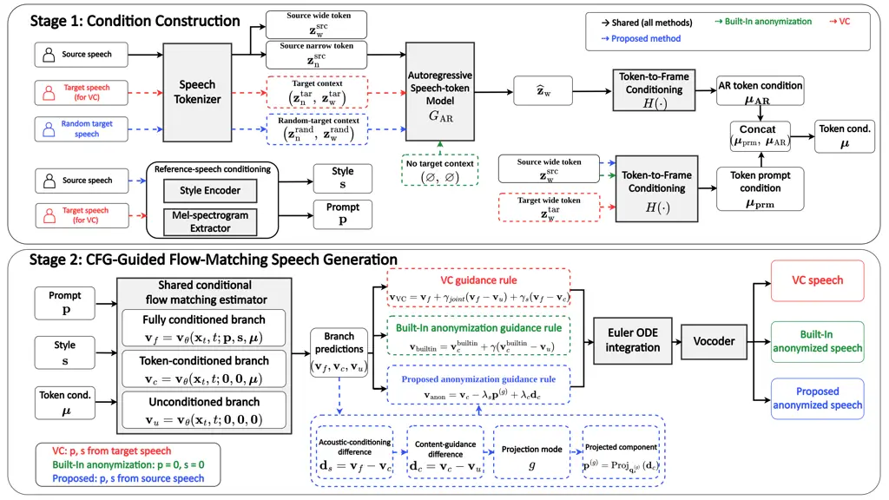
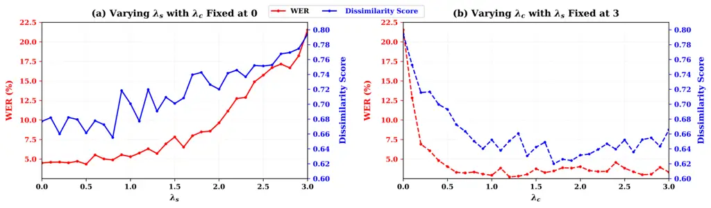

# Voice Anonymization Made Simple: Training-Free Anonymization with Projected Classifier-Free Guidance Thanks: xiang.shi@dukekunshan.edu.cn, xiaoxiao.miao@dukekunshan.edu.cn. Corresponding author: Xiaoxiao Miao.

Xiang Shi¹, Han Zhu², Ming Li³, Xiaoxiao Miao¹ Affiliation: ¹Duke
Kunshan University  
²Xiaomi Corporation  
³School of Artificial Intelligence, The Chinese University of Hong Kong,
Shenzhen Affiliation: 

###### Abstract

Voice anonymization aims to conceal speaker identity while preserving
linguistic and paralinguistic information, yet many existing methods
require dedicated training. We propose a training-free, two-stage
anonymization method for pretrained flow-matching voice conversion
systems. In the condition-construction stage, the source content
representation is regenerated under a randomly selected speaker context
to reduce residual source-speaker information while preserving
linguistic content. In the speech-generation stage, the source speech is
used to identify the generation direction associated with the original
speaker, and the source-aligned component is suppressed while useful
content guidance is retained. The proposed method modifies only
inference-time conditioning and guidance, without updating any
pretrained parameters. Experiments on VoicePrivacy 2026 Track 1 show
that the two-stage method improves speaker privacy while maintaining
competitive word error rate and emotion recognition performance¹¹ 1 Full
code and audio samples can be found at
https://github.com/xs125-stack/voice_anon_simple.

###### Index Terms: 

voice anonymization, speaker privacy, voice conversion, flow matching,
classifier-free guidance

^(†)^(†)aftertitle:

## I Introduction

Speech conveys not only linguistic content but also personal
information, including identity, health status, emotional state,
geographical background, and social characteristics \[1\]. As speech is
increasingly used for authentication, analytics, human–computer
interaction, and generative applications, information beyond the
intended purpose of collection may be inferred from recorded utterances.
Voice privacy therefore concerns limiting unauthorized access to, or
inference of, personal information conveyed through speech \[1\].

This work focuses on voice anonymization, which aims to prevent reliable
re-identification of the source speaker while preserving information
required by downstream applications, such as linguistic content and
prosodic attributes \[2\]. The task was formalized by the VoicePrivacy
Challenge, which provides common datasets, baselines, and evaluation
protocols \[3, 4\]. Subsequent editions introduced increasingly stronger
attacker models, including semi-informed attackers \[5, 6\],
emotion-preservation evaluation \[7, 8\], and, most recently, stronger
ASV attackers pretrained on voice-converted speech together with
cross-gender and multilingual evaluation \[9, 10\].

Voice anonymization methods broadly follow signal-processing or neural
synthesis approaches. Signal-processing methods modify acoustic
properties such as formants or speaking rate, but may distort speech and
remain vulnerable to strong attackers \[11, 12, 13, 14, 15, 4, 6\].

Neural synthesis methods reconstruct speech from transformed or
disentangled representations. ASR+TTS removes speaker identity through
text resynthesis but also discards paralinguistic information \[16\],
while more advanced systems preserve prosodic attributes or disentangle
content, prosody, and speaker information before anonymization \[17, 18,
2, 19, 20, 21, 22, 23, 24\]. Other approaches anonymize general speech
representations or discrete speech tokens without explicit speaker
embeddings \[25, 26, 27, 28\].

Diffusion and flow-matching models have recently emerged as powerful
generative frameworks for voice anonymization. DiffVC+ adapts
diffusion-based voice conversion for anonymization \[29\]; F3-VA
generates anonymized speaker embeddings using flow matching before
conditional speech reconstruction \[30\]; and DiffAnon reconstructs
codec representations from semantic, prosodic, and speaker conditions
with classifier-free guidance to control prosody preservation \[31\].
These methods demonstrate that diffusion and flow matching enable
high-quality and controllable speech anonymization.

However, most existing approaches require anonymization-specific
training, additional learned components, or retraining when applied to a
different voice conversion model. This raises a broader question: can a
pretrained flow-matching-based voice conversion model be converted into
a voice anonymizer only by changing its inference procedure?

We address this question with a training-free, two-stage anonymization
framework for pretrained generative voice conversion systems. The main
idea is to intervene at both the representation and generation levels.
During condition construction, the source content representation is
regenerated under an external speaker context to reduce its dependence
on the original speaker. During speech generation, the source speech is
used to identify the generation direction associated with the source
identity, and the source-aligned component is suppressed while useful
content guidance is retained. Both operations are performed only at
inference time and require no parameter updates.

We implement this framework on Seed-VC v2, a state-of-the-art zero-shot
voice conversion system \[32\]. Seed-VC v2 follows a two-stage
generation process: it first constructs the conditions required for
conversion and then synthesizes speech through conditional flow
matching. This structure makes it suitable for applying our two
interventions separately. In the first stage, a randomly selected target
utterance guides the reconstruction of the source-content condition. In
the second stage, source-aware projected classifier-free guidance steers
generation away from the original speaker.



Fig. 1: Overview of standard voice conversion, built-in anonymization,
and the proposed training-free method within the shared Seed-VC v2
backbone. The proposed method modifies condition construction to reduce
source-speaker dependence and modifies generation guidance to suppress
source-aligned information. Detailed condition and guidance definitions
are introduced in Sections II and III.

Experiments under the VoicePrivacy 2026 Track 1 (English) protocol show
that the proposed training-free two-stage intervention achieves a
favorable privacy–utility trade-off, improving speaker privacy while
maintaining competitive linguistic and emotion utility compared with the
baselines.

## II Preliminaries

### II-A Voice Conversion in Seed-VC v2

Figure 1 shows the released Seed-VC v2 pipeline. Seed-VC is a zero-shot
voice conversion system that transfers a source utterance to an unseen
reference speaker while preserving linguistic content \[32\]. The
published Seed-VC model uses continuous semantic features, whereas v2
inserts an autoregressive (AR) speech-token model before the conditional
flow-matching acoustic model.²² 2
https://github.com/Plachtaa/seed-vc/blob/main/inference_v2.py Both
versions share the same basic idea: the reference speaker is represented
by both a global timbre vector and a complete reference segment that
provides in-context information \[32\]. In Figure 1, black arrows denote
shared computation and red arrows denote standard VC.

Stage 1: Condition construction. This stage constructs the complete
token condition $`\boldsymbol{\mu}`$, the acoustic prompt
$`\mathbf{p}`$, and the global style embedding $`\mathbf{s}`$. The
complete token condition is not simply a source content representation.
It contains a prompt-side part aligned with the reference speech and an
AR-generated part for the content to be synthesized.

The source and target utterances are processed by pretrained narrow- and
wide-band tokenizers.³³ 3
https://github.com/Plachtaa/ASTRAL-quantization The source narrow-band
tokens provide the linguistic sequence, while the target narrow- and
wide-band tokens serve as AR context and prefix. The AR model therefore
generates a target-conditioned wide-band sequence for the source
portion,

```math
\widehat{\mathbf{z}}_{\mathrm{w}}=G_{\mathrm{AR}}\left(\mathbf{z}^{\mathrm{src}}_{\mathrm{n}};\mathbf{z}^{\mathrm{tar}}_{\mathrm{n}},\mathbf{z}^{\mathrm{tar}}_{\mathrm{w}}\right), \tag{1}
```

which is converted to the Mel-frame rate as
$`\boldsymbol{\mu}_{\mathrm{AR}}=H(\widehat{\mathbf{z}}_{\mathrm{w}})`$.
Here, $`\boldsymbol{\mu}_{\mathrm{AR}}`$ describes the source content to
be generated, but in a token form already influenced by the target
context.

The target wide-band tokens are regulated separately to form the
token-prompt condition
$`\boldsymbol{\mu}_{\mathrm{prm}}=H(\mathbf{z}^{\mathrm{tar}}_{\mathrm{w}})`$.
The two parts are then concatenated along time as
$`\boldsymbol{\mu}=\operatorname{Concat}_{t}(\boldsymbol{\mu}_{\mathrm{prm}},\boldsymbol{\mu}_{\mathrm{AR}})`$.
They are regulated separately because the prompt region and generated
region must be aligned to different Mel lengths before concatenation.

The same target utterance also provides the acoustic prompt and global
style embedding, $`\mathbf{p}=M(x^{\mathrm{tar}})`$ and
$`\mathbf{s}=E_{\mathrm{s}}(x^{\mathrm{tar}})`$, where $`M(\cdot)`$ is
Mel-spectrogram extraction and $`E_{\mathrm{s}}(\cdot)`$ is a pretrained
CAM++ encoder \[33\]. Their roles are complementary:
$`\boldsymbol{\mu}_{\mathrm{prm}}`$ tells the model what is spoken in
the reference segment, $`\mathbf{p}`$ shows how that segment is realized
acoustically, $`\mathbf{s}`$ gives the overall speaker and timbre, and
$`\boldsymbol{\mu}_{\mathrm{AR}}`$ specifies the content to generate
next.

Together, these conditions form an aligned in-context reference and
consistently direct standard VC toward the target speaker \[32\].

Stage 2: Speech generation. The conditional flow-matching model uses
$`(\boldsymbol{\mu},\mathbf{p},\mathbf{s})`$ to generate the converted
Mel-spectrogram. Its velocity network is a diffusion transformer (DiT)
\[34\]. At flow time $`t`$ and state $`\mathbf{x}_{t}`$, the estimator
$`\mathbf{v}_{\theta}(\mathbf{x}_{t},t;\mathbf{p},\mathbf{s},\boldsymbol{\mu})`$
defines the ODE $`d\mathbf{x}_{t}/dt=\mathbf{v}_{\theta}`$, which is
integrated from Gaussian noise by a fixed-step Euler solver.

For multi-condition classifier-free guidance (CFG), the estimator is
evaluated under three condition sets,

```math
\displaystyle\mathbf{v}_{f} \displaystyle=\mathbf{v}_{\theta}\left(\mathbf{x}_{t},t;\mathbf{p},\mathbf{s},\boldsymbol{\mu}\right), \tag{2}
```

```math
\displaystyle\mathbf{v}_{c} \displaystyle=\mathbf{v}_{\theta}\left(\mathbf{x}_{t},t;\mathbf{0},\mathbf{0},\boldsymbol{\mu}\right),
```

```math
\displaystyle\mathbf{v}_{u} \displaystyle=\mathbf{v}_{\theta}\left(\mathbf{x}_{t},t;\mathbf{0},\mathbf{0},\mathbf{0}\right),
```

giving the fully conditioned, token-conditioned, and unconditional
predictions. Standard VC combines them as

```math
\mathbf{v}_{\mathrm{VC}}=\mathbf{v}_{f}+\gamma_{\mathrm{joint}}\left(\mathbf{v}_{f}-\mathbf{v}_{u}\right)+\gamma_{\mathrm{s}}\left(\mathbf{v}_{f}-\mathbf{v}_{c}\right), \tag{3}
```

where $`\gamma_{\mathrm{joint}}`$ scales the joint guidance contributed
by all conditions, including both token/content and reference-speaker
information. In contrast, $`\gamma_{\mathrm{s}}`$ scales the additional
guidance introduced by the acoustic prompt and style embedding. The
Euler solver produces a converted Mel-spectrogram, which a pretrained
BigVGAN v2 vocoder \[35\] converts into waveform audio.

### II-B Built-in Anonymization in Seed-VC v2

Seed-VC v2 also provides a training-free built-in anonymization mode,
shown by the green path in Figure 1. It keeps the same two-stage
backbone but removes explicit target-timbre conditioning.

Stage 1: Condition construction. The AR model receives the source
narrow-band tokens but no target context or prefix,

```math
\widehat{\mathbf{z}}_{\mathrm{w}}^{\mathrm{builtin}}=G_{\mathrm{AR}}\left(\mathbf{z}^{\mathrm{src}}_{\mathrm{n}};\varnothing,\varnothing\right),\qquad\boldsymbol{\mu}_{\mathrm{AR}}^{\mathrm{builtin}}=H\left(\widehat{\mathbf{z}}_{\mathrm{w}}^{\mathrm{builtin}}\right), \tag{4}
```

where $`\varnothing`$ denotes an absent AR context or prefix.

The released wrapper still constructs a token-prompt prefix from
target*audio_path. However, because the acoustic prompt and style
embedding are set to zero, this prefix no longer forms an aligned
in-context reference pair. Our preliminary tests found little difference
between using a source-derived or target-derived prefix. We therefore
use the source utterance by default, giving
$`\boldsymbol{\mu}*{\mathrm{prm}}^{\mathrm{builtin}}=H(\mathbf{z}^{\mathrm{src}}_{\mathrm{w}})`$.
The complete built-in token condition is
$`\boldsymbol{\mu}_{\mathrm{builtin}}=\operatorname{Concat}_{t}(\boldsymbol{\mu}_{\mathrm{prm}}^{\mathrm{builtin}},\boldsymbol{\mu}\_{\mathrm{AR}}^{\mathrm{builtin}})`$,
with $`\mathbf{p}=\mathbf{0}`$ and $`\mathbf{s}=\mathbf{0}`$.

Stage 2: Speech generation. Generation therefore uses only the complete
token condition. The estimator is evaluated under the token-conditioned
and unconditional settings,

```math
\mathbf{v}_{c}^{\mathrm{builtin}}=\mathbf{v}_{\theta}\left(\mathbf{x}_{t},t;\mathbf{0},\mathbf{0},\boldsymbol{\mu}_{\mathrm{builtin}}\right),\qquad\mathbf{v}_{u}=\mathbf{v}_{\theta}\left(\mathbf{x}_{t},t;\mathbf{0},\mathbf{0},\mathbf{0}\right), \tag{5}
```

and combined as

```math
\mathbf{v}_{\mathrm{builtin}}=\mathbf{v}_{c}^{\mathrm{builtin}}+\gamma\left(\mathbf{v}_{c}^{\mathrm{builtin}}-\mathbf{v}_{u}\right), \tag{6}
```

where $`\gamma`$ is the intelligibility CFG scale. The Euler solver
integrates this field, and the vocoder renders the anonymized waveform.

## III Proposed Method

The built-in Seed-VC anonymization mode already provides a training-free
way to anonymize speech without updating the pretrained model. However,
it still leaves room for improvement in both stages. In Stage 1, the
target-related AR inputs are simply removed, so the model does not
exploit its ability to regenerate the source content under an
alternative speaker context. As a result, the token condition is still
largely determined by the source input and may carry residual
source-speaker information entangled with the content. In Stage 2, the
guidance rule
$`\mathbf{v}_{c}^{\mathrm{builtin}}+\gamma_{c}(\mathbf{v}_{c}^{\mathrm{builtin}}-\mathbf{v}_{u})`$
reduces the direct use of source acoustic conditions, but it neither
identifies and removes the source-related information carried in the
token guidance nor steers the generation trajectory away from the source
speaker. These observations motivate our two modifications:
random-target conditioning in Stage 1, which regenerates the source
content under an independently sampled speaker context to weaken
residual source-speaker information, and source-conditioning-aware
projected CFG in Stage 2, which actively suppresses source-aligned
directions during generation. The two modifications are highlighted as
the blue path in Figure 1.

### III-A Stage 1: Random-Target-Conditioned Token and Source-Acoustic Condition Construction

In Stage 1, we change only the AR-generated part of the token condition.
As shown in the upper panel of Figure 1, the complete token condition
contains two parts: the token-prompt condition
$`\boldsymbol{\mu}_{\mathrm{prm}}`$ and the AR token condition
$`\boldsymbol{\mu}_{\mathrm{AR}}`$. The former describes the prompt
region, whereas the latter describes the source content to be generated.

To reduce source-speaker information in the generated source-content
tokens, we sample an independent random-target utterance and use its
narrow- and wide-band tokens as the AR context and prefix. The source
narrow-band tokens still provide the linguistic sequence to be
converted. The shared AR model therefore predicts the source-portion
wide-band tokens as

```math
\widehat{\mathbf{z}}_{\mathrm{w}}=G_{\mathrm{AR}}\left(\mathbf{z}^{\mathrm{src}}_{\mathrm{n}};\mathbf{z}^{\mathrm{rand}}_{\mathrm{n}},\mathbf{z}^{\mathrm{rand}}_{\mathrm{w}}\right). \tag{7}
```

The generated sequence is then converted to the Mel-frame rate as
$`\boldsymbol{\mu}_{\mathrm{AR}}=H(\widehat{\mathbf{z}}_{\mathrm{w}})`$.
Thus, $`\boldsymbol{\mu}_{\mathrm{AR}}`$ still carries the source
linguistic content, but its token realization is guided by an unrelated
speaker context.

The token-prompt condition is constructed separately from the source
wide-band tokens as
$`\boldsymbol{\mu}_{\mathrm{prm}}=H(\mathbf{z}^{\mathrm{src}}_{\mathrm{w}})`$.
We deliberately keep $`\boldsymbol{\mu}_{\mathrm{prm}}`$ source-derived
because the same source utterance also provides the acoustic prompt
$`\mathbf{p}`$. This keeps the token description of the prompt region
aligned with its Mel-spectrogram. If the token-prompt condition were
instead taken from the random target while the acoustic prompt remained
source-derived, the model would receive random-target prompt tokens
together with a source acoustic example. This prompt mismatch differs
from the aligned conditioning used during Seed-VC training. In our
preliminary tests, such a mismatch sometimes improved speaker
separation, but it also made generation unstable and substantially
degraded audio quality and increased WER. We therefore use the source
utterance for both the token-prompt condition and the acoustic prompt.

The complete token condition is formed by temporal concatenation as
$`\boldsymbol{\mu}=\operatorname{Concat}_{t}(\boldsymbol{\mu}_{\mathrm{prm}},\boldsymbol{\mu}_{\mathrm{AR}})`$.
This operation is shown explicitly by the _Concat_ block in Figure 1.
The two parts are first regulated to their own Mel lengths and are
concatenated only afterward.

In parallel, the source utterance is passed through the same
Mel-spectrogram extractor and CAM++ style encoder used by Seed-VC,
giving $`\mathbf{p}=M(x^{\mathrm{src}})`$ and
$`\mathbf{s}=E_{\mathrm{s}}(x^{\mathrm{src}})`$, where $`M(\cdot)`$
denotes prompt-Mel extraction and $`E_{\mathrm{s}}(\cdot)`$ denotes the
style encoder. The source-derived $`\boldsymbol{\mu}_{\mathrm{prm}}`$
and $`\mathbf{p}`$ form an aligned prompt example, while $`\mathbf{s}`$
describes the overall source timbre. However, these source conditions
are not used as desired output attributes. They are retained only to
expose the effect of source-acoustic conditioning in Stage 2.

Because the complete token condition retains a source prompt part and AR
generation starts from source tokens, Stage 1 reduces but cannot
guarantee the removal of all source-speaker information.

### III-B Stage 2: Source-Conditioning-Aware Projected Classifier-Free Guidance for Conditional Flow-Matching Speech Generation

In Stage 2, we use the source prompt and style embedding only to
identify the generation direction associated with the source speaker. At
each ODE step, the difference between the fully conditioned and
token-conditioned predictions shows how the source acoustic conditions
change the current generation state. The difference between the
token-conditioned and unconditional predictions shows the effect of the
complete token condition $`\boldsymbol{\mu}`$, which contains both
$`\boldsymbol{\mu}_{\mathrm{prm}}`$ and
$`\boldsymbol{\mu}_{\mathrm{AR}}`$. We project this token-guidance
direction onto the source-conditioning direction and suppress the
aligned component.

Accordingly, the source prompt $`\mathbf{p}`$ and style embedding
$`\mathbf{s}`$ serve only as a reference. They identify what should be
suppressed rather than what should be reconstructed. The remaining token
guidance continues to support linguistic generation, so sampling starts
from the token-conditioned field $`\mathbf{v}_{c}`$, not from the fully
conditioned field $`\mathbf{v}_{f}`$.

Concretely, at every ODE step, the shared estimator is evaluated under
the same three condition sets as in Eq. (2), using the
$`(\boldsymbol{\mu},\mathbf{p},\mathbf{s})`$ constructed in Stage 1 to
obtain $`\mathbf{v}_{f}`$, $`\mathbf{v}_{c}`$, and $`\mathbf{v}_{u}`$.
We then form

```math
\mathbf{d}_{s}=\mathbf{v}_{f}-\mathbf{v}_{c},\qquad\mathbf{d}_{c}=\mathbf{v}_{c}-\mathbf{v}_{u}, \tag{8}
```

where $`\mathbf{d}_{s}`$ is the source-conditioning direction
contributed by the source acoustic prompt and style embedding, and
$`\mathbf{d}_{c}`$ is the guidance direction contributed by the complete
token condition. Their alignment identifies the part of token guidance
that changes the acoustic state in a way consistent with reintroducing
source conditioning. We do not assume that $`\mathbf{d}_{s}`$ is a pure
speaker direction or that $`\mathbf{d}_{c}`$ is a pure content
direction.

Both $`\mathbf{d}_{s}`$ and $`\mathbf{d}_{c}`$ have shape $`C\times T`$,
where $`C`$ is the feature dimension and $`T`$ is the number of frames.
The projection reference $`\mathbf{q}^{(g)}_{s,t}`$ is built from
$`\mathbf{d}_{s}`$ at one of three temporal granularities,

```math
\mathbf{q}^{(g)}_{s,t}=\begin{cases}\mathbf{d}_{s,t},&g=\mathrm{token},\\[4.0pt]
\dfrac{1}{T}\displaystyle\sum_{\tau=1}^{T}\mathbf{d}_{s,\tau},&g=\mathrm{global},\\[10.0pt]
\dfrac{1}{K}\displaystyle\sum_{\tau\in\mathcal{W}_{t}}\mathbf{d}_{s,\tau},&g=\mathrm{smooth},\end{cases} \tag{9}
```

where _Token_ uses the source-conditioning vector at the same frame,
_Global_ uses one utterance-level mean, and _Smooth_ uses a local
sliding-window mean over $`\mathcal{W}_{t}=\{t-10,\dots,t+10\}`$.⁴⁴ 4
$`K=21`$: the current frame plus the ten preceding and ten following
frames, with reflection padding at utterance boundaries. We therefore
refer to this smooth variant as _Smooth-21_ in the experiments. These
choices respectively preserve frame-level variation, remove local
variation, or provide an intermediate smoothed reference.

The component of token guidance aligned with the selected reference is

```math
\mathbf{p}^{(g)}_{t}=\frac{\left\langle\mathbf{d}_{c,t},\mathbf{q}^{(g)}_{s,t}\right\rangle}{\max\!\left(\left\|\mathbf{q}^{(g)}_{s,t}\right\|_{2}^{2},\epsilon\right)}\mathbf{q}^{(g)}_{s,t}. \tag{10}
```

The vector being projected is always $`\mathbf{d}_{c,t}`$; only the
temporal construction of the reference changes across modes. We treat
$`\mathbf{p}^{(g)}`$ as a proxy for source-speaker information remaining
in the token pathway.

The proposed guidance rule removes this component and then reinforces
the token guidance,

```math
\mathbf{v}_{\mathrm{anon}}=\mathbf{v}_{c}-\lambda_{s}\,\mathbf{p}^{(g)}+\lambda_{c}\,\mathbf{d}_{c}, \tag{11}
```

where $`\lambda_{s}`$ controls source-aligned suppression and
$`\lambda_{c}`$ controls token guidance. Using $`\mathbf{v}_{c}`$ as the
base field prevents the source prompt and style from directly
reconstructing the source voice, while the difference between
$`\mathbf{v}_{f}`$ and $`\mathbf{v}_{c}`$ still indicates which
direction should be removed. The shared Euler solver then integrates
$`\mathbf{x}_{t_{k+1}}=\mathbf{x}_{t_{k}}+\Delta t_{k}\,\mathbf{v}_{\mathrm{anon}}(\mathbf{x}_{t_{k}},t_{k})`$,
and the pretrained vocoder renders the final waveform.



Fig. 2: Effects of $`\lambda_{s}`$ and $`\lambda_{c}`$ on the
30-utterance screening subset. A higher dissimilarity score indicates
lower source-speaker similarity, and WER is computed at the corpus
level.

## IV Experiments

Our experiments proceed in three steps. First, we construct a small
screening subset containing 30 utterances selected from the VPC
LibriSpeech development clean set \[36\], denoted as _Libri_dev_. ⁵⁵ 5
The screening subset contains 30 speakers, with one long and clearly
spoken utterance selected per speaker. It is used only for quick
screening; empirically, the selected settings generalize well to the
full development and evaluation sets, although tuning on the full
development set could potentially yield better settings and would make
the dense $`(\lambda_{s},\lambda_{c})`$ sweep substantially more
expensive. On this subset, we test whether the two coefficients in
Eq. (11) behave as intended: increasing $`\lambda_{s}`$ should
strengthen anonymization by removing more source-aligned guidance,
whereas increasing $`\lambda_{c}`$ should strengthen content guidance
and reduce WER. Second, after confirming these roles, we use the same
subset to search for the best $`(\lambda_{s},\lambda_{c})`$ pair for
each combination of random-target condition construction and projection
mode. Third, with the selected scale pairs fixed, we evaluate all
systems on the full VPC 2026 Track 1 development and evaluation sets.
These full-set experiments serve as ablation studies for the
random-target-conditioned construction of
$`\boldsymbol{\mu}_{\mathrm{AR}}`$ introduced in Section III-A and the
projected guidance proposed in Section III-B.

### IV-A Evaluation Protocol, Datasets, and Settings

We follow the VoicePrivacy Challenge 2026 Track 1 (English) evaluation
protocol \[10\] and use the challenge-provided datasets, attack models,
and automatic speech recognition (ASR) and speech emotion recognition
(SER) evaluation models without modification. Speaker privacy is
measured by equal error rate (EER) under lazy-informed and semi-informed
attacks, where a higher value indicates stronger protection against
speaker re-identification. Linguistic-content preservation is measured
by word error rate (WER, lower is better), and emotion preservation is
measured by unweighted average recall (UAR, higher is better).

The random-target pool introduced in Section III contains one short
utterance (3–6 s) from each of 500 speakers in the LibriTTS
train-other-500 subset \[37\]. For every source utterance used by a
random-target-conditioned system, one target utterance is sampled from
this pool with replacement. The sampled target utterance provides the
narrow-band context and wide-band prefix used to construct the
AR-generated part $`\boldsymbol{\mu}_{\mathrm{AR}}`$. The token-prompt
part $`\boldsymbol{\mu}_{\mathrm{prm}}`$ remains source-derived so that
it stays aligned with the source acoustic prompt. A fixed random seed is
used, and the same source--target assignment is retained across all
projection modes and scale settings to ensure a controlled comparison.
⁶⁶ 6 We also performed preliminary checks with several alternative
random seeds and source–target assignments and observed only small
changes. These checks suggest that using an unrelated target context is
more important than the exact target identity for weakening
source-speaker information in $`\boldsymbol{\mu}_{\mathrm{AR}}`$.

### IV-B Results

Verifying the Roles of the Two Guidance Scales. We take the subset
_Libri_dev_ to verify whether the two coefficients in Eq. (11) have the
intended effects. All configurations use the same source utterances. For
random-target-conditioned configurations, the same fixed source–target
pairs are used throughout the sweep. Only the AR-generated part
$`\boldsymbol{\mu}_{\mathrm{AR}}`$ changes with the sampled target;
$`\boldsymbol{\mu}_{\mathrm{prm}}`$ remains source-derived in all
configurations. Privacy is measured on this subset using the
dissimilarity score

```math
A=1-\frac{1}{N}\sum_{i=1}^{N}\cos\left(\mathbf{e}^{\mathrm{src}}_{i},\mathbf{e}^{\mathrm{anon}}_{i}\right),\qquad N=30,
```

where the embeddings are extracted using the same speaker model as the
VPC ASV pipeline. A higher value indicates that the anonymized speech is
farther from the source speaker. Utility is measured by corpus-level WER
over the same 30 utterances using the VPC ASR model.

Figure 2 varies one coefficient while keeping the other fixed. ⁷⁷ 7 In
Fig. 2, $`\lambda_{s}=3`$ is used as the upper sweep bound for
diagnostic analysis, not as the selected operating point. As expected,
increasing $`\lambda_{s}`$ raises the dissimilarity score, although
excessive suppression also increases WER. Increasing $`\lambda_{c}`$, in
contrast, lowers WER by strengthening token guidance, but it also
reduces the dissimilarity score. These opposite trends confirm the roles
assigned to the two terms: $`\lambda_{s}`$ mainly controls
source-speaker suppression, whereas $`\lambda_{c}`$ mainly controls
linguistic-content preservation.

| System    | RT             | $`\boldsymbol{\lambda_{s}}`$ | $`\boldsymbol{\lambda_{c}}`$ | EER   | WER  | UAR   |
| --------- | -------------- | ---------------------------- | ---------------------------- | ----- | ---- | ----- |
| Built-in  |                | 0.7                          | 0.7                          | 33.15 | 4.18 | 41.85 |
| Global    |                | 0.9                          | 2.8                          | 33.90 | 4.20 | 39.21 |
| Smooth-21 |                | 1.0                          | 3.0                          | 34.20 | 4.39 | 40.35 |
| Token     |                | 0.2                          | 2.4                          | 33.48 | 4.22 | 40.30 |
| Global    | $`\checkmark`$ | 0.9                          | 2.8                          | 34.44 | 4.72 | 38.62 |
| Smooth-21 | $`\checkmark`$ | 1.0                          | 3.0                          | 34.79 | 4.47 | 39.06 |
| Token     | $`\checkmark`$ | 0.2                          | 2.4                          | 33.80 | 4.60 | 39.43 |
| Global    | $`\checkmark`$ | 1.2                          | 2.9                          | 34.61 | 4.42 | 40.13 |
| Smooth-21 | $`\checkmark`$ | 1.1                          | 2.8                          | 35.09 | 4.52 | 40.38 |
| Token     | $`\checkmark`$ | 0.1                          | 1.3                          | 34.72 | 4.36 | 39.95 |

TABLE I: Development-set ablation results. RT means that
$`\boldsymbol{\mu}_{\mathrm{AR}}`$ uses random-target context. Higher
EER and UAR are better, while lower WER is better. The highest EER is
shaded.

| System        | Development |       |       |       | Evaluation |       |      |       |
| ------------- | ----------- | ----- | ----- | ----- | ---------- | ----- | ---- | ----- |
|               | L-EER       | S-EER | WER   | UAR   | L-EER      | S-EER | WER  | UAR   |
| Orig.         | 7.34        | –     | 1.80  | 69.08 | 3.41       | –     | 1.84 | 71.06 |
| B2            | 8.15        | 4.23  | 10.44 | 55.66 | 5.62       | 3.72  | 9.96 | 53.49 |
| B3            | 26.03       | 16.32 | 4.31  | 38.08 | 19.06      | 14.24 | 4.31 | 35.24 |
| B4            | 19.73       | 15.28 | 6.16  | 41.97 | 14.64      | 11.13 | 5.90 | 42.78 |
| B5            | 30.94       | 20.05 | 4.91  | 40.08 | 25.65      | 17.05 | 4.44 | 38.25 |
| Built-in      | 33.15       | 24.64 | 4.18  | 41.85 | 28.19      | 17.78 | 4.58 | 40.38 |
| Smooth-21^(†) | 35.09       | 25.14 | 4.52  | 40.38 | 29.39      | 21.51 | 4.46 | 39.57 |

TABLE II: Track 1 comparison with the official baselines. Privacy is
measured by EER (%) under lazy-informed (L) and semi-informed (S)
attacks, and utility by WER (%) and UAR (%). Built-in anon. uses
$`(\lambda_{s},\lambda_{c})=(0.7,0.7)`$ and Smooth-21 uses
$`(1.1,2.8)`$; $`\dagger`$ marks systems using random-target context for
$`\boldsymbol{\mu}_{\mathrm{AR}}`$. The maximum value in each EER column
is shaded.

Guidance Scale Grid Search on _Libri_dev_. After verifying the roles of
the two scales, we use the same 30-utterance subset to select the
operating point of each system. For each of the three projection modes
(Global, Smooth-21, and Token), we test both target-free AR construction
and random-target-conditioned AR construction. In both cases, the
token-prompt condition $`\boldsymbol{\mu}_{\mathrm{prm}}`$ is extracted
from the source utterance. This gives six configurations in total.

For every configuration, both $`\lambda_{s}`$ and $`\lambda_{c}`$ are
swept from $`0`$ to $`3`$ with a step size of $`0.1`$. The source
utterances and, when applicable, their random-target assignments remain
fixed throughout the search. We first retain configurations with WER
below $`5\%`$, close to the baselines, and then choose the one with
stronger source-speaker dissimilarity. The $`5\%`$ threshold is an
application-dependent design choice. The selected values are reported in
Table I. After selection, all scale pairs are fixed and no further
tuning is performed on the complete development or evaluation sets.

Table I reports the development-set ablation results, while Table II
compares the selected Smooth-21 system with the official baselines and
built-in anonymization.

Effect of Random-Target Conditioning. Table I isolates the effect of the
Stage 1 random-target-conditioned construction of
$`\boldsymbol{\mu}_{\mathrm{AR}}`$ introduced in Section III-A. To
provide a controlled comparison, we first keep
$`(\lambda_{s},\lambda_{c})`$ exactly the same as in each target-free
counterpart and change only the use of random-target (RT) conditioning.
Under this fixed-scale setting, development Lazy-EER increases from
$`33.90\%`$ to $`34.44\%`$ for Global, from $`34.20\%`$ to $`34.79\%`$
for Smooth-21, and from $`33.48\%`$ to $`33.80\%`$ for Token. Thus, all
three projection modes achieve higher privacy with comparable utility
when RT conditioning is the only changed factor.

When the guidance scales are further tuned for the RT systems, Lazy-EER
increases to $`34.61\%`$, $`35.09\%`$, and $`34.72\%`$ for Global,
Smooth-21, and Token, respectively. These results confirm that the
benefit of random-target conditioning is not caused by different
hyperparameter choices: introducing an unrelated target context itself
consistently reduces source-speaker dependence in the AR-generated part
$`\boldsymbol{\mu}_{\mathrm{AR}}`$. We therefore retain
random-target-conditioned AR construction in the selected system used
for the subsequent semi-informed comparison.

Effect of the Projection Method. Table I also evaluates the projected
speech-generation rule introduced in Section III-B. The three
configurations without random-target context use the same target-free
construction of $`\boldsymbol{\mu}_{\mathrm{AR}}`$ and the same
source-derived $`\boldsymbol{\mu}_{\mathrm{prm}}`$ as the built-in
Seed-VC anonymization mode. Their main difference is therefore in
Stage 2. The built-in mode uses the complete token condition with prompt
and style set to zero, whereas the proposed systems additionally use
source prompt and style to estimate the source-conditioning direction
and then remove the aligned part of token guidance.

All three projection variants improve development Lazy-EER over the
built-in mode: Global, Smooth-21, and Token reach $`33.90\%`$,
$`34.20\%`$, and $`33.48\%`$, respectively, compared with $`33.16\%`$
for built-in anonymization. Their WER remains close to that of the
built-in system. This indicates that the privacy gain is not produced
only by random-target conditioning, suppressing the source-aligned
component during speech generation is itself beneficial. Smooth-21 gives
the strongest privacy result among the three projection granularities.

Overall Comparison with Baselines. Table II compares the selected
random-target-conditioned Smooth-21 system with the official baselines
and the built-in Seed-VC anonymization mode. On the evaluation set,
Smooth-21 reaches a Lazy-EER of $`29.39\%`$ and a Semi-EER of
$`21.51\%`$, both higher than the corresponding results of the built-in
anonymization mode. It also exceeds the strongest official baseline B5
in both evaluation EER measures, while maintaining a comparable WER.
Smooth-21 also achieves the highest development EERs, confirming its
effectiveness against a semi-informed attacker while preserving
competitive utility.

## V Conclusion and Future Work

We presented a training-free, two-stage voice anonymization method built
on Seed-VC v2. The ablation results show that random-target-conditioned
AR construction reduces source-speaker dependence in
$`\boldsymbol{\mu}_{\mathrm{AR}}`$, while source-conditioning-aware
projected CFG further suppresses source-aligned information carried by
the complete token guidance during speech generation. Together, the two
stages improve speaker privacy while maintaining competitive linguistic
and emotion utility on VPC 2026 Track 1. The current study is limited to
English anonymization. Future work will extend the method to VPC 2026
Track 2 and investigate its performance in multilingual anonymization.

## References

- \[1\] T. Bäckström (2025) Privacy in speech technology. Proceedings of
  the IEEE 113 (7), pp. 668–692. External Links:
  [Document](https://dx.doi.org/10.1109/JPROC.2025.3632102) Cited by:
  §I.
- \[2\] A. S. Shamsabadi, B. M. L. Srivastava, A. Bellet, N.
  Vauquier, E. Vincent, M. Maouche, M. Tommasi, and N. Papernot (2023)
  Differentially private speaker anonymization. Proceedings on Privacy
  Enhancing Technologies 2023 (1). External Links:
  [Link](https://hal.inria.fr/hal-03588932) Cited by: §I, §I.
- \[3\] N. Tomashenko, B. M. L. Srivastava, X. Wang, E. Vincent, A.
  Nautsch, J. Yamagishi, N. Evans, J. Patino, J. Bonastre, P. Noé, et
  al. (2020) Introducing the voiceprivacy initiative. arXiv preprint
  arXiv:2005.01387. Cited by: §I.
- \[4\] N. Tomashenko, X. Wang, E. Vincent, J. Patino, B. M. L.
  Srivastava, P. Noé, A. Nautsch, N. Evans, J. Yamagishi, B. O’Brien, et
  al. (2022) The voiceprivacy 2020 challenge: results and findings.
  Computer Speech & Language 74, pp. 101362. Cited by: §I, §I.
- \[5\] N. Tomashenko, X. Wang, X. Miao, H. Nourtel, P. Champion, M.
  Todisco, E. Vincent, N. Evans, J. Yamagishi, and J. Bonastre (2022)
  The VoicePrivacy 2022 challenge evaluation plan. arXiv preprint
  arXiv:2203.12468. Cited by: §I.
- \[6\] M. Panariello, N. Tomashenko, X. Wang, X. Miao, P. Champion, H.
  Nourtel, M. Todisco, N. Evans, E. Vincent, and J. Yamagishi (2024) The
  voiceprivacy 2022 challenge: progress and perspectives in voice
  anonymisation. IEEE/ACM Transactions on Audio, Speech, and Language
  Processing 32, pp. 3477–3491. Cited by: §I, §I.
- \[7\] N. Tomashenko, X. Miao, P. Champion, S. Meyer, X. Wang, E.
  Vincent, M. Panariello, N. Evans, J. Yamagishi, and M. Todisco (2024)
  The voiceprivacy 2024 challenge evaluation plan. arXiv preprint
  arXiv:2404.02677. Cited by: §I.
- \[8\] N. Tomashenko, X. Miao, P. Champion, S. Meyer, M. Panariello, X.
  Wang, N. Evans, E. Vincent, J. Yamagishi, and M. Todisco (2026) The
  third voiceprivacy challenge: preserving emotional expressiveness and
  linguistic content in voice anonymization. Computer Speech & Language
  100, pp. 101988. External Links: ISSN 0885-2308,
  [Document](https://dx.doi.org/https%3A//doi.org/10.1016/j.csl.2026.101988),
  [Link](https://www.sciencedirect.com/science/article/pii/S0885230826000513)
  Cited by: §I.
- \[9\] R. Arefeen, X. Miao, R. Tong, A. B. Ng, S. See, and T.
  Liu (2026) DAST: a dual-stream voice anonymization attacker with
  staged training. In Proc. Interspeech 2026, Cited by: §I.
- \[10\] X. Miao, N. Tomashenko, R. Arefeen, S. Meyer, M. Panariello, X.
  Wang, E. Vincent, N. Evans, J. Yamagishi, and M. Todisco (2026) The
  VoicePrivacy 2026 challenge evaluation plan. Note: Version 2.0.
  \[Online\]. Available:
  https://www.voiceprivacychallenge.org/vp2026/docs/VPC_2026_sept01.pdf
  Cited by: §I, §IV-A.
- \[11\] P. Gupta, G. P. Prajapati, S. Singh, M. R. Kamble, and H. A.
  Patil (2020) Design of voice privacy system using linear prediction.
  In Proc. APSIPA ASC, pp. 543–549. Cited by: §I.
- \[12\] S. P. Dubagunta, R. J. J. H. van Son, and M.
  Magimai.-Doss (2020) Adjustable deterministic pseudonymisation of
  speech: Idiap-NKI’s submission to VoicePrivacy 2020 challenge. Note:
  \[Online\]. Available:
  https://www.voiceprivacychallenge.org/vp2020/docs/Idiap-NKI.pdf Cited
  by: §I.
- \[13\] S. E. McAdams (1984) Spectral fusion, spectral parsing and the
  formation of auditory images. Ph.D. Thesis, Stanford University. Cited
  by: §I.
- \[14\] C. O. Mawalim, S. Okada, and M. Unoki (2022)System description:
  speaker anonymization by pitch shifting based on time-scale
  modification (PV-TSM)(Website) External Links:
  [Link](https://www.voiceprivacychallenge.org/results-2022/docs/1___T32.pdf)
  Cited by: §I.
- \[15\] L. Tavi, T. Kinnunen, and R. G. Hautamäki (2022) Improving
  speaker de-identification with functional data analysis of f0
  trajectories. Speech Communication 140, pp. 1–10. Cited by: §I.
- \[16\] H. L. Xinyuan, Z. Cai, A. Garg, K. Duh, L. P. García-Perera, S.
  Khudanpur, N. Andrews, and M. Wiesner (2024) HLTCOE jhu submission to
  the voice privacy challenge 2024. In Proc. 4th Symposium on Security
  and Privacy in Speech Communication, pp. 61–66. External Links:
  [Document](https://dx.doi.org/10.21437/SPSC.2024-11) Cited by: §I.
- \[17\] S. Meyer, F. Lux, J. Koch, P. Denisov, P. Tilli, and N. T.
  Vu (2023) Prosody is not identity: a speaker anonymization approach
  using prosody cloning. In Proc. ICASSP, pp. 1–5. Cited by: §I.
- \[18\] F. Fang, X. Wang, J. Yamagishi, I. Echizen, M. Todisco, N.
  Evans, and J. Bonastre (2019) Speaker anonymization using x-vector and
  neural waveform models. arXiv preprint arXiv:1905.13561. Cited by: §I.
- \[19\] C. O. Mawalim, K. Galajit, J. Karnjana, S. Kidani, and M.
  Unoki (2022) Speaker anonymization by modifying fundamental frequency
  and x-vector singular value. Computer Speech & Language 73,
  pp. 101326. Cited by: §I.
- \[20\] P. Champion (2023) Anonymizing speech: evaluating and designing
  speaker anonymization techniques. arXiv preprint arXiv:2308.04455.
  Cited by: §I.
- \[21\] J. Yao, Q. Wang, P. Guo, Z. Ning, Y. Yang, Y. Pan, and L.
  Xie (2025) MUSA: multi-lingual speaker anonymization via serial
  disentanglement. IEEE/ACM Transactions on Audio, Speech and Language
  Processing 33 (), pp. 1664–1674. Cited by: §I.
- \[22\] X. Miao, X. Wang, E. Cooper, J. Yamagishi, and N.
  Tomashenko (2022) Language-independent speaker anonymization approach
  using self-supervised pre-trained models. In Proc. The Speaker and
  Language Recognition Workshop (Odyssey 2022), pp. 279–286. External
  Links: [Document](https://dx.doi.org/10.21437/Odyssey.2022-39) Cited
  by: §I.
- \[23\] X. Miao, X. Wang, E. Cooper, J. Yamagishi, and N.
  Tomashenko (2023) Speaker anonymization using orthogonal Householder
  neural network. IEEE/ACM Trans. Audio, Speech, and Language Processing
  31 (), pp. 3681–3695. External Links:
  [Document](https://dx.doi.org/10.1109/TASLP.2023.3313429) Cited by:
  §I.
- \[24\] J. Yao, Q. Wang, P. Guo, Z. Ning, and L. Xie (2024) Distinctive
  and natural speaker anonymization via singular value
  transformation-assisted matrix. IEEE/ACM Transactions on Audio,
  Speech, and Language Processing. Cited by: §I.
- \[25\] Z. Cai, H. L. Xinyuan, A. Garg, L. P. García-Perera, K. Duh, S.
  Khudanpur, N. Andrews, and M. Wiesner (2024) Privacy versus emotion
  preservation trade-offs in emotion-preserving speaker anonymization.
  In Proc. SLT, pp. 409–414. Cited by: §I.
- \[26\] A. Das, C. Franzreb, T. Herzig, P. Pirlet, and T.
  Polzehl (2024) Comparing speech anonymization efficacy by voice
  conversion using knn and disentangled speaker feature representations.
  In Proc. SPSC 2024, pp. 121–126. Cited by: §I.
- \[27\] B. Tang, X. Miao, X. Wang, and M. Li (2025) Sef-mk:
  speaker-embedding-free voice anonymization through multi-k-means
  quantization. ASRU. Cited by: §I.
- \[28\] M. Panariello, F. Nespoli, M. Todisco, and N. Evans (2024)
  Speaker anonymization using neural audio codec language models. In
  Proc. ICASSP, pp. 4725–4729. External Links:
  [Document](https://dx.doi.org/10.1109/ICASSP48485.2024.10447871) Cited
  by: §I.
- \[29\] F. Huang, K. Zeng, and W. Zhu (2024) DiffVC+: Improving
  Diffusion-based Voice Conversion for Speaker Anonymization. In
  Interspeech 2024, pp. 4453–4457. External Links:
  [Document](https://dx.doi.org/10.21437/Interspeech.2024-502), ISSN
  2958-1796 Cited by: §I.
- \[30\] Y. Xiao, Y. Zhao, Z. Ma, S. Wang, K. Yu, J. Liao, and X.
  Chen (2026) Anonymization, not elimination: utility-preserved speech
  anonymization. IEEE Transactions on Audio, Speech and Language
  Processing. Cited by: §I.
- \[31\] I. R. Ulgen, Z. Cai, N. Andrews, P. Koehn, and B. Sisman (2026)
  DiffAnon: diffusion-based prosody control for voice anonymization.
  arXiv preprint arXiv:2604.26281. Cited by: §I.
- \[32\] S. Liu (2024) Zero-shot voice conversion with diffusion
  transformers. arXiv preprint arXiv:2411.09943. Cited by: §I, §II-A,
  §II-A.
- \[33\] H. Wang, S. Zheng, Y. Chen, L. Cheng, and Q. Chen (2023) CAM++:
  A Fast and Efficient Network for Speaker Verification Using
  Context-Aware Masking. In Interspeech 2023, pp. 5301–5305. External
  Links: [Document](https://dx.doi.org/10.21437/Interspeech.2023-1513),
  ISSN 2958-1796 Cited by: §II-A.
- \[34\] W. Peebles and S. Xie (2023) Scalable diffusion models with
  transformers. In Proceedings of the IEEE/CVF international conference
  on computer vision, pp. 4195–4205. Cited by: §II-A.
- \[35\] S. Lee, W. Ping, B. Ginsburg, B. Catanzaro, and S. Yoon (2022)
  Bigvgan: a universal neural vocoder with large-scale training. arXiv
  preprint arXiv:2206.04658. Cited by: §II-A.
- \[36\] V. Panayotov, G. Chen, D. Povey, and S. Khudanpur (2015)
  Librispeech: an asr corpus based on public domain audio books. In 2015
  IEEE International Conference on Acoustics, Speech and Signal
  Processing (ICASSP), Vol. , pp. 5206–5210. External Links:
  [Document](https://dx.doi.org/10.1109/ICASSP.2015.7178964) Cited by:
  §IV.
- \[37\] H. Zen, V. Dang, R. Clark, Y. Zhang, R. J. Weiss, Y. Jia, Z.
  Chen, and Y. Wu (2019) LibriTTS: A Corpus Derived from LibriSpeech for
  Text-to-Speech. In Interspeech 2019, pp. 1526–1530. External Links:
  [Document](https://dx.doi.org/10.21437/Interspeech.2019-2441), ISSN
  2958-1796 Cited by: §IV-A.
