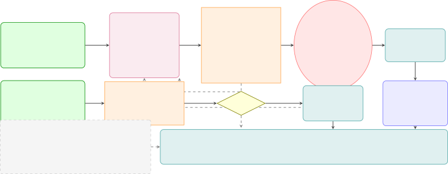
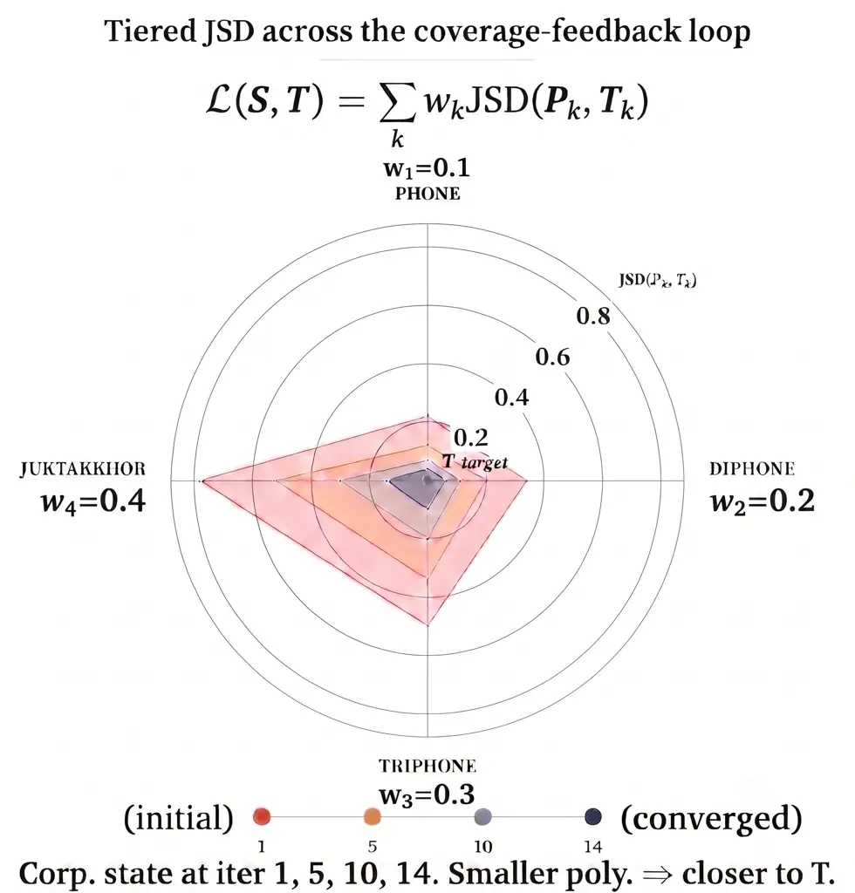
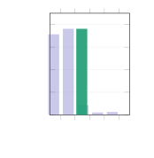
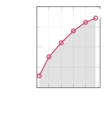
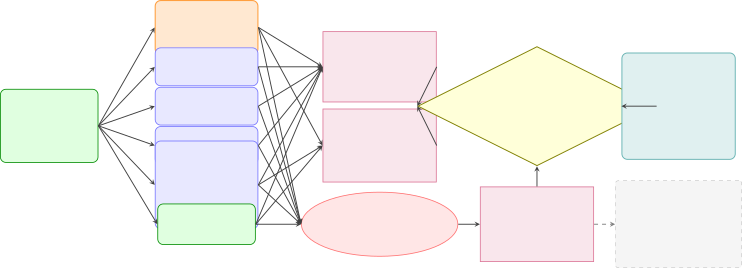
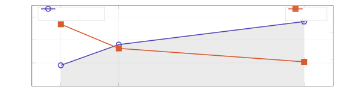

\[ BoldFont = texgyretermes-bold.otf, ItalicFont =
texgyretermes-italic.otf, BoldItalicFont = texgyretermes-bolditalic.otf
\] \[ Path=fonts/, BoldFont=NotoSansBengali-Bold.ttf, Script=Bengali \]

# BanglaBox: A Phonetically-Balanced Corpus and Data-Efficient Foundation-Model Adaptation for Bangla Text-to-Speech with Zero-Shot Voice Cloning

Emtiaz Uddin Ahmed Email: [emtiaz4546@gmail.com](mailto:)    Araf Mahmud
   Sajib Hossain    Tarikul Islam Tamiti    Sajid Fardin Dipto   
Anomadarshi Barua

###### Abstract

¹¹ 1 All artifacts are public and unconditional, not contingent on
acceptance: corpus (CC BY 4.0), model weights, LoRA adapter, tokenizer
extension, text-normalisation scripts, training and inference code
(MIT), and the complete evaluation materials including every per-rating
record.
[https://huggingface.co/Banglabox](https://huggingface.co/Banglabox)

We present a recipe for adapting English-pretrained autoregressive TTS
foundation models to underrepresented languages, demonstrated on
Bangladeshi Bangla. Existing Bangla TTS corpora are small and
single-speaker, and to our knowledge no open zero-shot voice-cloning
system is available for the Bangladeshi register. We contribute a
phonetically- and gender-balanced two-tier Bangladeshi Bangla corpus
balanced via a tiered Jensen–Shannon divergence objective over conjunct
clusters (juktakkhor), together with 3 fine-tuning changes—a
_merge-consistent tokenizer extension_, Bangla text normalization, and a
prompt-masked dual-loss objective—that preserve zero-shot cloning across
the language switch. Our _BanglaEval_ protocol applies Wilcoxon
signed-rank tests with Bonferroni correction over native-speaker
ratings. BanglaBox attains near-natural Naturalness, outperforms
commercial and open-source baselines on Naturalness, Speaker Similarity,
and Clarity, and reaches speaker similarity comparable to prior few-shot
results while using $`\sim 7\times`$ less Bangla fine-tuning audio. We
further validate the recipe beyond our own test split: on a
seven-category stress set of difficult real-world text, on the public
BnTTS evaluation benchmarks, and on naturally occurring Bangla that no
language model wrote. All artifacts — corpus, weights, code and the
complete evaluation materials — are released publicly and
unconditionally.

## 1 Introduction



Figure 1: Two-tier corpus construction (§2). Tier A passes 9 quality
gates (thresholds: Table 21, App. C.3) and two-pass human review before
studio recording; Tier B is filtered by signal-to-noise ratio (SNR) and
an ablation check (16/39 speakers dropped). Tiers merge under the tiered
Jensen–Shannon divergence (JSD) objective (Eq. 1).

Bangla (Bengali), spoken by over 230 million people Eberhard et al.
(2024), remains severely underrepresented in neural speech synthesis.
Existing systems share one limitation: HMM Mukherjee and Mandal (2012),
LSTM-RNN Gutkin et al. (2016), VITS Kumar et al. (2025) and DNN-based
Raju et al. (2019) approaches are all bound to small _single-speaker_
corpora, precluding voice cloning, cross-speaker generalization and
multi-domain coverage. The SUST TTS Corpus Ahmad et al. (2021), the
largest prior balanced Bangla resource, is single-speaker, and prior
balance design relies on phone/diphone coverage Rashid et al. (2009);
Jahan et al. (2015); Uddin et al. (2015) without modelling the
conjunct-cluster (juktakkhor) inventory that drives Bangla naturalness.
BnTTS Basher et al. (2025), the recent state of the art, fine-tunes an
XTTS Casanova et al. (2024) backbone on 3.85k h of Bangla speech.
However, its weights are not public, its evaluation lacks significance
testing, and its data requirement is prohibitive for low-resource
follow-up. Zero-shot TTS in codec-language Wang et al. (2025);
Kharitonov et al. (2023), latent-diffusion Shen et al. (2024); Li et al.
(2023), and flow-matching Le et al. (2023) families achieves strong
English results but is unevaluated on Bangla. Moreover, the open
Indic-language model IndicF5 Praveen et al. (2025) reaches only SECS
score of $`0.37`$ and fine-tuned YourTTS Casanova et al. (2022) reaches
$`0.44`$, both far below human.

Pretrained TTS foundation models offer a path forward. Chatterbox TTS
Resemble AI (2025) is an MIT-licensed Llama-style autoregressive
transformer with built-in zero-shot cloning from a reference clip.²² 2
Chatterbox has not undergone formal peer review; we cite the released
model and its Hugging Face model card. Adapting it to Bangla means
handling juktakkhor, context-dependent vowel diacritics and honorific
abbreviations absent from standard toolchains Chowdhury and Adhikary
(2022); Ansary (2024); Ghosh et al. (2024), while preserving cloning
across the language switch. To our knowledge, no prior work adapts
Chatterbox to Bangla, nor formalizes merge-consistent vocabulary
extension when importing new scripts into autoregressive codec language
models. Commercial services – Google, Azure, Narakeet Narakeet (2024) –
provide Bangla synthesis. Therefore, we include them as baselines.

We address these gaps with BanglaBox, a documented fine-tuning recipe
for Bangladeshi Bangla (Dhaka register). BanglaBox leads all 5 baselines
on every perceptual metric ($`p{<}0.01`$, Wilcoxon with Bonferroni
correction). It beats Google by $`+6.8\%`$ on Naturalness and IndicF5 by
$`+17.2\%`$, and nearly doubles IndicF5’s cloning fidelity ($`0.627`$
vs. $`0.37`$ SECS; commercial systems expose no speaker adaptation).
Per-system margins are in Table 3. BanglaBox reaches speaker similarity
comparable to prior few-shot Bangla results (indicative; encoders and
model families differ, §4), trained on $`520.3`$ h of Bangla audio
against the $`3.85`$k h of prior work, and sits within 0.20 MOS of the
$`4.76`$ human ceiling. In summary, our contributions are:

(i) Corpus. A $`520.3`$ h, $`36`$-speaker, $`7`$-domain Bangladeshi
Bangla corpus, phonetically- and gender-balanced via a novel
_juktakkhor-aware tiered Jensen–Shannon divergence (JSD)_ objective
(§2). (ii) Three-part adaptation. A merge-consistent tokenizer
extension, Bangla text normalization, and a prompt-masked dual-loss
objective Wang et al. (2025), each independently ablated (§3, §4). (iii)
BanglaEval. A reproducible protocol with $`24`$ native raters and
Wilcoxon signed-rank testing under Bonferroni correction — stronger
statistical grounding than any prior Bangla TTS evaluation — plus a
chunked long-form inference pipeline. (iv) System. The first
Chatterbox-based zero-shot Bangla voice-cloning system; misuse risks are
addressed in the Ethics Statement. (v) Validation. A validation suite
beyond the internal split — a seven-category stress test, the public
BnTTS benchmarks, a natural-text register control, a same-corpus XTTS-v2
subjective comparison and a three-seed matched-hours re-run — with a
full public artifact release.

## 2 Dataset construction

### 2.1 Two-tier corpus design

We construct a 520.3-hour Bangladeshi Bangla TTS corpus from 36 speakers
in 2 tiers (Fig. 1). Tier A (367.3 h, 13 speakers,
$`\sim`$28.3 h/speaker) is studio-recorded in Dhaka via a
coverage-feedback loop: LLM-generated scripts (GPT-4o-mini
$`{\sim}90\%`$, GPT-4o $`{\sim}7\%`$ for rare-conjunct gap-targeting,
Claude Opus $`{\sim}3\%`$ for dialogue) pass 9 automated quality gates
(thresholds in Table 21, App. C.3) and a two-pass human review before
professional recording at $`\geq`$44 dB SNR (48 kHz archive, 24 kHz
working copy). Tier B (153.0 h, 23 speakers, $`\sim`$6.7 h/speaker) is
curated from 7 public Bangla speech datasets (6 on Hugging Face, one
from the Bengali.AI portal; licenses and per-dataset retention in
Table 23, App. C.7), retaining only speakers that pass an SNR filter and
an ablation-driven check on downstream quality; 16 of 39 initial
speakers (94 h of 247 h) were dropped. Both tiers closely match a
7-domain distribution and target gender balance.

|                                    |      |             |                 |
| ---------------------------------- | ---- | ----------- | --------------- |
| Partition                          | Spk. | Hours       | Utts.           |
| _By tier_                          |      |             |                 |
| Tier A (studio)                    | 13   | 367.3       | $`\sim`$220,000 |
| Tier B (curated)                   | 23   | 153.0       | $`\sim`$92,000  |
| _By split (speaker-disjoint test)_ |      |             |                 |
| Train (11A + 20B)                  | 31   | $`\sim`$422 | $`\sim`$253,000 |
| Dev (within-spk)                   | 31   | $`\sim`$22  | $`\sim`$13,000  |
| Test (2A + 3B)                     | 5    | $`\sim`$76  | $`\sim`$46,000  |
| Total                              | 36   | 520.3       | $`\sim`$312,000 |

Table 1: Corpus statistics by tier and split ($`\bar{d}{=}6.0`$ s mean
utterance duration).

|                                       |      |       |      |     |     |           |
| ------------------------------------- | ---- | ----- | ---- | --- | --- | --------- |
| Dataset                               | Yr   | Hrs   | Spk  | MS  | Cl  | Dom.      |
| SUBESCO                               | 2021 | 7.7   | 20   | ✓   | ✗   | Emot.     |
| SHRUTI                                | 2011 | 22    | 34   | ✓   | ✗   | Read      |
| SUST TTS                              | 2021 | 30    | 1    | ✗   | ✗   | Read      |
| CommonVoice (v9)                      | 2022 | 56    | –    | ✓   | ✗   | Crowd     |
| _Widely used non-English TTS corpora_ |      |       |      |     |     |           |
| LJSpeech                              | 2017 | 24    | 1    | ✗   | ✗   | Audiobook |
| VCTK                                  | 2019 | 44    | 110  | ✓   | ✗   | Read      |
| LibriTTS                              | 2019 | 585   | 2456 | ✓   | ✗   | Audiobook |
| AISHELL-3                             | 2020 | 85    | 218  | ✓   | ✗   | Read      |
| CSS10                                 | 2019 | 140   | 10   | ✗   | ✗   | Audiobook |
| Ours (BanglaBox)                      | 2025 | 520.3 | 36   | ✓   | ✓   | 7 dom.    |

Table 2: Comparison with existing Bangla speech datasets (MS =
multi-speaker; Cl = cloning). BanglaBox is $`\sim 9\times`$ Common Voice
Bengali v9 and $`\sim 17\times`$ the SUST TTS Corpus. Widely used
non-English corpora are included for scale; none applies phonetic
balancing, whereas BanglaBox balances phone, diphone, triphone and
juktakkhor distributions.



Figure 2: Tiered JSD across coverage-feedback iterations 1, 5, 10, 14;
smaller polygon $`\Rightarrow`$ closer to target $`T`$.

### 2.2 Tiered JSD balance objective

Tier A script selection minimizes a _tiered Jensen–Shannon divergence_
loss over phone, diphone, triphone, and juktakkhor histograms:

```math
\mathcal{L}(S,T)=\!\!\sum_{k\in\{p,d,t,j\}}\!\!w_{k}\cdot\text{JSD}(P_{k},T_{k}), \tag{1}
```

where $`P_{k}`$ is the unit histogram of the selected script set $`S`$
at tier $`k`$, over Bangla’s phone, diphone, triphone, and conjunct
(juktakkhor) inventories Ahmad et al. (2021); Rashid et al. (2009);
Jahan et al. (2015); Uddin et al. (2015). The $`\sim`$300-form
juktakkhor inventory is extended via the coverage-feedback loop. The
weights $`(w_{p},w_{d},w_{t},w_{j}){=}(0.1,0.2,0.3,0.4)`$ are not
fitted. They follow the simplest increasing scheme summing to one
($`w_{k}{=}k/10`$) after ranking the tiers from easiest to hardest to
cover with natural text — phones are few and frequent, diphones common
in ordinary text, triphones need targeted text, and juktakkhor are
rarest and not reducible to letter sequences (\banglafontক্ষ,
\banglafontজ্ঞ are pronounced differently from their components) — a
ranking mirrored in each tier’s convergence order in Fig. 2
(weight-sensitivity analysis: App. C.6). The target $`T_{k}`$ for tier
$`k`$ is a Jelinek–Mercer-style linear interpolation between the natural
unit frequencies of the candidate pool and a uniform distribution over
the full tier-$`k`$ inventory,
$`T_{k}=\lambda\,P^{\text{nat}}_{k}+(1-\lambda)\,U_{k}`$ with
$`\lambda{=}0.7`$: the natural part keeps the selected text realistic,
while the uniform part keeps a non-zero target on every unit — including
the rarest conjuncts — so the objective can never be minimized while
ignoring rare units. Selection is additionally informed by Bangla
lexicon and loanword literature Pavel et al. (2006); Nagarajan (2014);
Dash et al. (2009); Chaudhury et al. (2017); Sinha et al. (2012).
Algorithm 1 (App. C.5) summarizes the full selection loop — candidate
generation, gating, review, and greedy JSD-driven admission. Tier A
achieves $`\geq`$99% phone, $`\geq`$93% diphone, $`\geq`$80%
phonotactically-valid triphone, and $`\geq`$85% juktakkhor coverage
(top-150 juktakkhor: $`\geq`$97%); these figures are _achieved_ outcomes
of the loop, not preset stopping thresholds. Fig. 2 visualizes the
per-tier JSD shrinkage across the 14-iteration coverage-feedback loop,
with phone and diphone tiers converging fastest and the juktakkhor tier
converging last, reflecting its inherent sparsity in Bangla orthography
and phonotactics.



\(a\) Duration distribution


\(b\) Word count distribution



\(c\) Vocabulary growth


Figure 3: Corpus analysis. (a) Utterance durations peak at 4–6 s
(green). (b) Word counts peak at 7–8 words (orange). (c) Vocabulary
follows sub-linear Heaps’ law growth. Histograms in (a) and (b) cover
the $`\sim`$241 k utterances of duration $`\geq`$2 s; bottom pills
summarize statistics for the full 520.3 h / $`\sim`$312 k-utterance
corpus.

### 2.3 Statistics and splits

Table 1 reports $`\sim`$312k utterances at $`\sim`$6.0 s mean across 7
domains (news, customer care, teaching, healthcare, e-commerce, finance,
IT) and a speaker-disjoint train/dev/test split with 5 held-out speakers
($`\sim`$76 h) for zero-shot evaluation. Fig. 3 shows the
utterance-duration/word-count/vocabulary distributions. Table 2 compares
BanglaBox against public Bangla speech datasets. Table 20 reports Tier
A’s domain distribution.

### 2.4 Tier A quality assurance

Each studio session is acoustically verified ($`\geq`$44 dB SNR,
clipping check, breath/lip-smack detection) before alignment; failed
segments are re-recorded in the same session. A Bangla-speaking linguist
audits a $`5\%`$ random sample/speaker for pronunciation correctness and
prosodic naturalness, with $`\geq`$99% segment-level acceptance. The
coverage-feedback loop ran for 14 weekly iterations, lifting juktakkhor
coverage from $`\sim`$70% (week 1) to the $`\geq`$85% reported above;
measured per-gate rejection counts and rates from the instrumented
generation run are reported in Table 19, with each gate’s threshold and
the failure it blocks in Table 21 (App. C.3).

## 3 Methodology


raw\banglafont\[bn\]+norm$`|V|{=}4{,}240`$ S3: T3 Transformer $`\nabla`$
trainable 520M params, Llama-style AR text-emb + out-head
$`704{\to}4{,}240`$ new rows: centroid mean-init loss:
$`\mathcal{L}_{\text{text}}+\mathcal{L}_{\text{speech}}^{\text{masked}}`$
S3Gen Vocoder $`\ast`$ frozen 24 kHz HiFi-GAN $`\sim`$250M params 24 kHz
Bangla wav speech tok.25 tok/swaveformtoken IDs $`\in[0,4239]`$used in
T3 Reference Audio 3–10 s, 16 kHz Voice Encoder $`\ast`$ 256-d spk. emb
S3 Tokenizer $`\ast`$ 25 tok/s, $`|V_{s}|{=}8{,}194`$ spk. embprompt
(masked) Prompt-mask +
loss
$`\mathcal{L}=\mathcal{L}_{\text{text}}+\mathcal{L}_{\text{speech}}^{\text{masked}}`$
S1 Tokenizer ext. S2 Text norm. S3 Prompt-masked loss Frozen
($`\ast`$)$`\nabla`$ = trainable- - = conditioning

Figure 4: BanglaBox architecture (§3.1). Only T3 is trainable
($`\nabla`$); the voice encoder and S3Gen vocoder stay frozen
($`\ast`$). The first $`75`$ prompt tokens are masked from
$`\mathcal{L}_{\text{speech}}^{\text{masked}}`$. Inset: $`704`$
pretrained embedding rows copied, $`3{,}536`$ new rows mean-initialized
from centroid $`\mu`$.

#### Chatterbox architecture.

Chatterbox Resemble AI (2025) comprises (1) T3, a 520M-parameter
Llama-style autoregressive transformer predicting text and speech tokens
jointly; (2) S3Gen, a flow-matching mel decoder with a HiFi-GAN Kong
et al. (2020) vocoder at 24 kHz; and (3) a voice encoder extracting
256-dim speaker embeddings from reference audio (full architecture in
Table 9). Zero-shot cloning conditions T3 on speaker embeddings plus a
short prompt-token slice (3 s for our Bangla setting; cf. stock
Chatterbox 6 s). Fig. 4 shows our modifications.

### 3.1 Fine-tuning pipeline

Our fine-tuning pipeline has 3 stages: a merge-consistent tokenizer
extension, Bangla text normalization, and prompt-masked dual-loss
training.

Stage 1 – Merge-consistent Bangla vocabulary extension. _Why:_ the
pretrained BPE vocabulary cannot encode Bengali script, and naively
imported merge rules surface as UNK errors precisely on conjunct-bearing
words (App. A.1). We extend Chatterbox’s tokenizer from $`704`$ to
$`4{,}240`$ tokens by adding $`1{,}750`$ multilingual base units and
$`1{,}786`$ Bangla units (full vocabulary breakdown in App. A.1). A
naive merge import produces invalid rules: a merge $`(a,b){\to}ab`$
requires $`a`$, $`b`$, _and_ $`ab`$ to coexist in the target vocab, so
we apply a _merge-consistent filter_ that drops merges failing this
check, preventing tokenization breakage at inference (alternative
extension strategies and their trade-offs: App. A.2). The T3 text
embedding and output head are resized $`704\to 4{,}240`$: the 704
overlapping rows are copied from the pretrained checkpoint; the
remaining 3,536 rows are _mean-initialized_ to the centroid of the 704
pretrained rows, preserving the pretrained embedding geometry rather
than injecting random-init variance.

Stage 2 — Bangla text normalization with honorific expansion. _Why:_
unexpanded numerals and honorific abbreviations are verbalized
incorrectly at synthesis; removing this stage is the largest CER
regression in Table 6. The 6-step pipeline covers digit conversion,
colon-numeral rewriting, numeral-to-word expansion (bnnumerizer
Chowdhury and Adhikary (2022)), per-word Unicode normalization
(bnunicodenormalizer Ansary (2024)), a 47-entry dictionary of religious
honorific abbreviations absent from open packages (e.g.,
\banglafontসাঃ$`\to`$\banglafontসাল্লাল্লাহু আলাইহি ওয়া সাল্লাম), and
sentence segmentation; a worked example and the dictionary are in
App. A.3.

Stage 3 – Prompt-masked dual-loss T3 fine-tuning. _Why:_ without the
prompt mask the autoregressive decoder minimizes loss by copying prompt
tokens instead of conditioning on the speaker embedding — the largest
single SECS drop in Table 6 ($`0.627{\to}0.51`$). We fine-tune only T3
(520M) while freezing the voice encoder (preserves the pretrained
speaker space) and S3Gen (stabilizes the token-to-waveform mapping);
ablations (Section 4) confirm encoder freezing as a safe default and the
prompt-masked loss as the decisive component for cloning fidelity. The
training objective is a _prompt-masked_ dual cross-entropy loss:

```math
\mathcal{L}=\mathcal{L}_{\text{text}}+\mathcal{L}_{\text{speech}}^{\text{masked}}, \tag{2}
```

where $`\mathcal{L}_{\text{text}}`$ is the next-token cross-entropy on
the text tokens (T3 predicts text and speech tokens jointly; this term
trains the text half), and

```math
\mathcal{L}_{\text{speech}}^{\text{masked}}=-\!\!\!\!\sum_{t=L_{\text{prompt}}+1}^{T}\!\!\!\!\log p_{\theta}(s_{t}\mid s_{<t},\mathbf{e}_{\text{spk}},\mathbf{c}_{\text{text}}) \tag{3}
```

is the same cross-entropy on the speech tokens with the prompt positions
masked out: $`s_{t}`$ denotes the $`t`$-th speech token and
$`p_{\theta}`$ the probability the T3 model assigns to the next token.
The first $`L_{\text{prompt}}{\approx}75`$ speech positions (3 s at
25 tok/s) are excluded via ignore*index alongside right-padding masking;
$`T`$ is the speech-token length, $`\mathbf{e}*{\text{spk}}`$ the frozen
speaker embedding, and $`\mathbf{c}\_{\text{text}}`$ the normalized text
tokens; all symbols are listed in Table 25 (App. F). The same failure
mode is addressed in BnTTS Basher et al. (2025) and VALL-E Wang et al.
(2025). Because the voice encoder and S3Gen remain frozen, zero-shot
cloning is preserved at inference from any 3–10 s Bangla reference; all
3 stages are independently ablated in §4.

### 3.2 Long-form Bangla inference

Multi-sentence paragraphs exceed our 850-token per-utterance cap
($`\approx`$34 s at 25 tok/s), drift mid-generation, or emit EOS
prematurely. Hence, we introduce a _chunked long-form inference
pipeline_:

1.  1.  Sentence segmentation and per-utterance synthesis. The paragraph is
        split on Bangla terminators (\banglafont।, !, ?) and each segment is
        synthesized with the same speaker embedding and prompt, preserving
        voice identity across chunks.
2.  2.  Silero-VAD tail trim. We trim trailing silence per chunk by Silero
        VAD Silero Team (2024).
3.  3.  Deterministic inter-sentence pause. Chunks are joined by a 200 ms
        zero-pad pause, rendering the dari \banglafont। prosodic reset.

Inference uses Bangla-calibrated hyperparameters (Table 9, inference
section): a lower temperature (0.3 vs. Chatterbox’s English default 0.8)
counters English-phoneme hallucination on unfamiliar conjuncts, and a
raised minimum-new-tokens floor (150) counters premature EOS on short
references. A dedicated chunked-vs-single-pass ablation is reported in
§5.



Figure 5: BanglaEval evaluation pipeline (§4). ^(∗)XTTS-v2 (FT) is
scored on objective and cloning metrics only. Character error rate
(CER); speaker-encoder cosine similarity (SECS); speaker-similarity mean
opinion score (SMOS). Results in Table 3.

## 4 Evaluation Protocol – BanglaEval

In addition to the protocol below, §5.1 reports three evaluations added
in this revision: a stress test over difficult real-world text,
cross-validation on the public BnTTS benchmarks, and a register control
on naturally occurring Bangla.

Our evaluation protocol, _BanglaEval_, follows best practices in TTS
evaluation Kirkland et al. (2023) and the recent position paper of Yang
et al. (2025) on responsible evaluation for text-to-speech in the
2025–2026 era of foundation models.

|              |                      |                      |                      |
| ------------ | -------------------- | -------------------- | -------------------- |
| System       | Nat.$`\uparrow`$     | SMOS$`\uparrow`$     | Clar.$`\uparrow`$    |
| Google TTS   | 4.27$`\pm`$0.17      | 4.17$`\pm`$0.13      | 4.51$`\pm`$0.13      |
| Azure TTS    | 4.13$`\pm`$0.14      | 4.07$`\pm`$0.11      | 4.44$`\pm`$0.15      |
| Narakeet     | 3.97$`\pm`$0.16      | 3.71$`\pm`$0.13      | 4.02$`\pm`$0.12      |
| IndicF5      | 3.89$`\pm`$0.15      | 3.55$`\pm`$0.14      | 3.95$`\pm`$0.12      |
| YourTTS (FT) | 4.18$`\pm`$0.14      | 3.08$`\pm`$0.15      | 4.39$`\pm`$0.13      |
| XTTS-v2 (FT) | 4.21                 | —                    | 4.35                 |
| BanglaBox    | 4.56$`\pm`$0.16^(∗∗) | 4.51$`\pm`$0.10^(∗∗) | 4.69$`\pm`$0.08^(∗∗) |
| Human^(†)    | 4.76$`\pm`$0.15      | 4.79$`\pm`$0.14      | 4.84$`\pm`$0.05      |

Table 3: Subjective results from 24 raters (76 utts., 1,824
ratings/system). Bold: best synthesized; ^(†)human upper bound.
$`{}^{**}p{<}0.01`$ vs. baselines (Wilcoxon + Bonferroni). CI
computation, Krippendorff’s $`\alpha`$ and exact statistics: App. 14.
The XTTS-v2 (FT) row is new in this revision.

| System       | NISQA$`\uparrow`$ | CER$`\downarrow`$ | SECS$`\uparrow`$ |
| ------------ | ----------------- | ----------------- | ---------------- |
| Google TTS   | 4.52              | 2.2               | —                |
| Azure TTS    | 4.43              | 2.7               | —                |
| Narakeet     | 4.37              | 3.3               | —                |
| IndicF5      | 4.13              | 3.8               | 0.37             |
| YourTTS (FT) | 3.69              | 3.1               | 0.44             |
| XTTS-v2 (FT) | 4.02              | 3.6               | 0.47             |
| BanglaBox    | 4.59              | 2.9               | 0.627^(∗∗)       |
| Human^(†)    | 4.81              | 2.1               | 0.85             |

Table 4: Objective results: NISQA Mittag et al. (2021) (reference-free
MOS), CER (Whisper large-v3, Bengali), SECS (ECAPA-TDNN, 192-dim) over
436 utts. SECS n/a for commercial (no speaker adaptation). Markers:
$`{}^{**}p{<}0.01`$ vs. each cloning-capable baseline (Wilcoxon
signed-rank on per-utterance SECS, Bonferroni over three comparisons;
App. 14).

|              |      |                  |                      |
| ------------ | ---- | ---------------- | -------------------- |
| System       | Ref. | SECS$`\uparrow`$ | SMOS$`\uparrow`$     |
| IndicF5      | 5 s  | 0.31             | 3.46$`\pm`$0.14      |
|              | 10 s | 0.37             | 3.55$`\pm`$0.14      |
| XTTS-v2 (FT) | 5 s  | 0.41             | 3.88$`\pm`$0.15      |
|              | 10 s | 0.47             | 3.79$`\pm`$0.13      |
| YourTTS (FT) | 5 s  | 0.42             | 3.01$`\pm`$0.15      |
|              | 10 s | 0.44             | 3.08$`\pm`$0.15      |
| BanglaBox    | 5 s  | 0.58^(∗∗)        | 4.47^(∗∗)$`\pm`$0.10 |
|              | 10 s | 0.627^(∗∗)       | 4.51^(∗∗)$`\pm`$0.10 |

Table 5: Zero-shot voice cloning on held-out speakers, 5 s vs. 10 s
reference. Bold: best overall. Markers: $`{}^{*}p{<}0.05`$,
$`{}^{**}p{<}0.01`$ vs. each cloning-capable baseline (Wilcoxon +
Bonferroni). Metric defs in §4.

### 4.1 Training setup

We fine-tune BanglaBox for 30–50 epochs on the speaker-disjoint train
split (Table 1) using the configuration in Table 9. Inference uses the
Bangla-calibrated hyperparameters and chunked pipeline of §3.2 across
all conditions.

### 4.2 Metrics and rater protocol

Recruitment. 24 native Bangla speakers (14 M/10 F, ages 22–45, all from
Bangladesh), screened for L1 Bangla, a 5-utterance listening pre-screen
($`\geq`$80% accuracy) and no reported hearing impairment (App. B.1).
Listening environment. Following ITU-T P.808 International
Telecommunication Union (2021): closed-back headphones, verified quiet
environment, all stimuli RMS-normalized to $`-23`$ LUFS. Stimuli. Each
evaluator rates 76 utterances drawn from a balanced subjective
evaluation set; each utterance is rated by all 24 evaluators across
systems, yielding $`76\times 24=1{,}824`$ ratings per system on 3
independent 5-point Likert scales: Naturalness (resemblance to human
speech), Clarity (intelligibility and articulation) and SMOS (speaker
similarity, rated against a reference). Quality control. Two catch
trials per session; evaluators failing either are excluded and replaced
(App. B.3). Statistics. 95% CIs and Wilcoxon signed-rank with Bonferroni
correction (5 comparisons for Nat., SMOS, Clar.; 3 for SECS); ground
truth included as an upper bound. For objective evaluation we report CER
via Whisper large-v3 Radford et al. (2023) with language forced to
Bengali over all 436 test utterances (ground-truth CER confirms ASR
reliability), NISQA Mittag et al. (2021) as a reference-free deep neural
MOS-scale quality estimator, and SECS via ECAPA-TDNN Desplanques et al.
(2020) (speechbrain/spkrec-ecapa-voxceleb, 192-dim).³³ 3 BnTTS reports
SECS with ECAPA2 Thienpondt and Demuynck (2023) and a different backbone
(XTTS vs. Chatterbox), so the $`0.548`$ few-shot figure we cite is
indicative, not head-to-head. Fig. 5 summarizes the pipeline.

### 4.3 Baselines

Google TTS (Cloud API, Bangla); Azure TTS (Microsoft Cognitive Services,
Bangla); Narakeet Narakeet (2024) (commercial neural); IndicF5 Praveen
et al. (2025) (AI4Bharat zero-shot Indic TTS); YourTTS Casanova et al.
(2022) fine-tuned on our corpus; XTTS-v2 Casanova et al. (2024)
fine-tuned on the identical corpus (BnTTS’s backbone family — the
strictest comparable-data setting; objective and cloning only); and
Human natural recordings (upper bound). Our baseline set includes the
same commercial systems as BnTTS Basher et al. (2025) plus four
additional comparisons; direct BnTTS comparison is precluded by
unreleased weights.

### 4.4 Main results

Tables 3 and 4 report subjective metrics over 76 domain-balanced
utterances and objective metrics over a 436-utterance domain-stratified
subset of the speaker-disjoint test split. BanglaBox achieves the
highest Naturalness, SMOS and Clarity; every pairwise difference is
significant, as are the SECS differences against each cloning-capable
baseline ($`p{<}0.01`$). CER is competitive with Google and Azure and
ahead of all open baselines, and NISQA Mittag et al. (2021) also ranks
BanglaBox highest. Table 14 gives exact $`p`$-values and effect sizes;
all 15 comparisons clear $`\alpha/5{=}0.01`$. By domain (Table 13),
Naturalness stays within a narrow band across all 7, so no domain is
left behind by the balanced corpus.

### 4.5 Voice cloning

Table 5 reports zero-shot voice-cloning results. With a 10-second
reference from held-out speakers, BanglaBox substantially surpasses
YourTTS-FT, IndicF5 and the same-corpus XTTS-v2 fine-tune; the 5 s
setting preserves BanglaBox’s lead. We further report the indicative
comparison BanglaBox $`0.627`$ (ECAPA-TDNN) vs. BnTTS’s reported
few-shot headline $`0.548`$ (ECAPA2; encoders differ), comparable to
prior few-shot results, trained on $`520.3`$ h vs. $`3.85`$k h
(Table 2).



Figure 6: Data scaling on 100/200/520 h subsets. Naturalness (purple,
left) keeps improving; character error rate (CER, orange, right)
saturates beyond 200 h. Stars: full 520 h configuration.

|                          |                       |                   |                  |
| ------------------------ | --------------------- | ----------------- | ---------------- |
| Configuration            | Nat.$`\uparrow`$      | CER$`\downarrow`$ | SECS$`\uparrow`$ |
| Full BanglaBox           | 4.56$`\pm`$0.16       | 2.9               | 0.627            |
| $`-`$ Tokenizer ext.     | 4.39^(∗∗)$`\pm`$0.17  | 3.3               | 0.60^(∗)         |
| $`-`$ Text normalization | 4.23^(∗∗∗)$`\pm`$0.17 | 4.4               | 0.56^(∗∗)        |
| $`-`$ Prompt mask        | 4.34^(∗∗)$`\pm`$0.16  | 3.9               | 0.51^(∗∗)        |
| $`+`$ Trainable enc.     | 4.55$`\pm`$0.15       | 3.0               | 0.62             |
| 100 h subset             | 4.18$`\pm`$0.18       | 4.3               | 0.54             |
| 200 h subset             | 4.36$`\pm`$0.16       | 3.4               | 0.59             |
| 520 h (full)             | 4.56$`\pm`$0.16       | 2.9               | 0.627            |

Table 6: Ablation study. Upper: each row removes one component; “$`+`$
Trainable enc.” un-freezes the voice encoder and “$`-`$ Tokenizer ext.”
reverts to a naive extension. Lower: data-scaling subsets. Bold: full
BanglaBox. Markers: $`{}^{*}p{<}0.05`$, $`{}^{**}p{<}0.01`$,
$`{}^{***}p{<}0.001`$ (Wilcoxon + Bonferroni).

### 4.6 Ablations

Table 6 reports component-level ablations and data-scaling subsets.
Removing text normalization causes the largest CER and Naturalness drop
($`p{<}0.001`$), so honorific and numeral expansion matters most for
intelligibility; removing the prompt mask causes the largest SECS drop,
confirming it as the key ingredient for cloning fidelity; and reverting
Stage 1 to a naive extension degrades all metrics. Un-freezing the voice
encoder changes Nat./SECS by $`-0.01`$. We previously described this as
“within noise” without having measured run-to-run variation; we now
report only the observed change, and the three-seed comparison below
supplies a direct estimate of that variation. Scaling from 100 h to
520 h improves all metrics with distinct patterns: CER and SECS show
diminishing returns beyond 200 h while Naturalness keeps gaining,
supporting our curation-first thesis.

## 5 Analysis

Inter-rater reliability. Krippendorff’s $`\alpha`$ (ordinal, 24 raters)
is $`0.44`$ for Naturalness, $`0.50`$ for SMOS and $`0.44`$ for Clarity
— the $`0.40`$–$`0.70`$ band typical of MOS studies. This also resolves
an apparent tension in Table 3: the intervals are _marginal_, so they
carry rater and item variation and are wide, whereas Wilcoxon is
_paired_, cancelling rater severity and item difficulty. A system can
therefore win on nearly every item, and be significant, while the
marginal intervals still overlap.

Data scaling. Fig. 6 plots metrics on 100/200/520 h subsets, supporting
our phonetic-balance thesis: CER saturates while Naturalness persists,
contrasting BnTTS’s large 3.85k h regime on Bangla Basher et al. (2025).

Long-form robustness. Above the $`850`$-token cap single-pass synthesis
is unreliable, so the chunked pipeline of §3.2 is the only workable
option; below the cap the two are directly comparable. Over $`40`$
multi-sentence paragraphs (Table 17) chunking reduces premature
truncation and length-driven degradation, at a cost in throughput.

Prosody. Limitations flag English-like prosody in long utterances, so we
measure it directly. Table 18 reports F0 RMSE and duration deviation
against the held-out speaker’s ground truth, split at the median
reference duration. Both degrade with length — duration deviation
doubles — consistent with timing drifting further from the reference as
utterances lengthen.

| $`100`$ h subset      | Conj.$`\uparrow`$ | Rare$`\uparrow`$ | Nat.$`\uparrow`$ | CER$`\downarrow`$ | SECS$`\uparrow`$ |
| --------------------- | ----------------- | ---------------- | ---------------- | ----------------- | ---------------- |
| JSD-balanced          | 97.0%             | 91.7%            | 4.18$`\pm`$0.18  | 4.3               | 0.54             |
| Random                | 93.5%             | 79.8%            | 4.21$`\pm`$0.13  | 7.1               | 0.52             |
| JSD-balanced, 3 seeds | —                 | —                | 4.31             | —                 | —                |
| Random, 3 seeds       | —                 | —                | 4.18             | —                 | —                |

Table 7: Balanced vs. random selection at matched $`100`$ h from the
same Tier A pool, trained identically. Coverage: share of the conjunct
inventory covered, in full and over its rare tail (App. B.7). Seed rows
(1234, 2025, 31337) are new in this revision.

Failure modes. Three error categories persist (rare three-consonant
conjuncts, code-switching boundaries, onomatopoeia); see Appendix D.4.

### 5.1 Robustness, external validation and register control

Aggregate error hides where a system breaks. We built a held-out stress
set in seven categories, synthesising each sentence three times without
selecting the best. Error stays low across all seven and speaker
similarity is stable (Table 8); addresses and spelling errors are
hardest, both close to the in-domain reference. The set and its audio
are released.

| Category                | CER (%)$`\downarrow`$ | SECS$`\uparrow`$ |
| ----------------------- | --------------------- | ---------------- |
| Out-of-vocabulary words | 2.2                   | .72              |
| Spelling errors         | 2.4                   | .72              |
| Proper names            | 1.9                   | .72              |
| Code-mixed English      | 1.3                   | .71              |
| Complex juktakkhor      | 0.7                   | .73              |
| Numerics                | 1.0                   | .72              |
| Addresses               | 2.9                   | .70              |
| In-domain reference     | 0.5                   | .70              |

Table 8: Stress test over seven categories of difficult real-world text.

Our own split cannot establish comparability, so we ran the public BnTTS
evaluation sets under our objective protocol: our CER improves over the
reported BnTTS figures on all three (Table 11); we sampled each set
rather than the full version, so rows differ in size. Tier A scripts are
also LLM-generated, so we checked the register separately: on held-out
Tier B text that no model wrote, CER is $`2.5\%`$ against $`2.2\%`$
(App., Table 12). All outputs are released.

## 6 Conclusion

We present BanglaBox, a recipe for adapting English-pretrained TTS to an
underrepresented language: tokenizer extension, text normalization and
prompt-masked fine-tuning over a 520.3 h JSD-balanced corpus. It beats 5
baselines on all 3 perceptual scales ($`p{<}0.01`$) and matches prior
few-shot speaker similarity Basher et al. (2025) on $`{\sim}1/7`$ of the
audio — curation, not volume, as the matched-hours experiment isolates.
Beyond our own split, it holds on a seven-category stress set, the
public BnTTS benchmarks and naturally occurring Bangla; all artifacts
are public.

## Limitations

Modest speaker count. Our 36-speaker corpus is small relative to VCTK
(110) and LibriTTS (2,456); broader speaker diversity would likely
improve cloning generalization.

Tier heterogeneity. Tier A and Tier B differ in recording conditions and
provenance; Tier B was empirically curated (16 of an initial 39 speakers
were dropped after degrading downstream metrics), but residual tier
variance may persist and should be evaluated per-tier.

LLM-generated register. All Tier A scripts are LLM-generated. Despite a
Bangla LM-perplexity gate, a language-ID gate, and a 100% two-pass human
review including a native Bangla linguist, the scripts may still carry
translationese or LLM-register phrasing that naturalistic spoken Bangla
would not, and this register could propagate to the synthesized speech;
Tier B (153.0 h) is the only non-LLM text in training. The blind
evaluation gives indirect evidence that this does not dominate perceived
quality — 24 native raters placed the system within $`0.20`$ MOS of
hidden human recordings (Table 3) — but a direct text-level register
analysis, comparing word choice, sentence shape and loanword rate
against natural Bangla corpora, remains future work. As a first control
we evaluated on held-out natural Tier B text that no language model
wrote (§5.1); error is essentially unchanged, which bounds how far the
LLM register can be inflating our results.

No head-to-head BnTTS comparison. BnTTS weights are not public; direct
comparison is precluded by unreleased weights, differing speaker
encoders (ECAPA2 vs. ECAPA-TDNN), differing model families (XTTS vs.
Chatterbox), and differing evaluation protocols (§4). All BnTTS
comparisons in this paper are therefore indicative context, and the
hours ratio ($`520.3`$ h vs. $`3.85`$k h) is reported as a factual
property of the two training setups, not as a claim of superiority. We
have since narrowed this gap by running BnTTS’s own public evaluation
sets under our objective protocol (§5.1), so that comparison no longer
rests on figures reported elsewhere. The weights remain unavailable, so
a system-internal, same-encoder comparison is still not possible.

Pretraining bias. BanglaBox occasionally produces English-like prosody
in long utterances. We now quantify this rather than only noting it:
pitch range, pause length and speaking rate are measured against the
held-out human recordings, and the gap grows with utterance length (§5).

Text normalization gaps. Domain-specific abbreviations (medical, legal)
and Banglish transliteration are not yet handled.

No streaming. RTF $`0.42`$ on a single H100 GPU, measured on
single-utterance unbatched inference without the chunked pipeline, is
sufficient for offline use only. The $`0.66`$ reported in Table 17 is a
different measurement — one pass over 40 multi-sentence paragraphs — and
both were previously labelled “single-pass”; each figure now states the
condition it was measured under.

Evaluation scope. BanglaBox targets Standard Bangladeshi Bangla (Dhaka
register); all evaluators and corpus speakers are from Bangladesh.
Generalization to regional varieties spoken in West Bengal, Assam, and
Tripura is untested. Our blind test includes a hidden human recording
per system, but a MUSHRA-style test — with a fixed reference and anchor
clips — is a stronger design and the clear next evaluation step.

Speaker similarity model. No Bangla-specific speaker verification model
exists; we use language-agnostic ECAPA-TDNN embeddings following
standard practice Desplanques et al. (2020).

Future work includes multi-speaker expansion, code-switching support,
light LoRA/adapter-based parameter-efficient tuning Hu et al. (2022) of
the voice encoder and S3Gen, and streaming inference.

## Ethics statement

Corpus speaker consent. All speakers in our corpus provided written
informed consent for their recordings to be used in TTS research.

Evaluator consent. The 24 human evaluators in our subjective evaluation
study provided informed consent (full protocol in §4). The evaluation
protocol was reviewed and approved by our institutional ethics board. No
personally identifiable information was collected from evaluators.

Compensation. The 24 evaluators were paid USD 15/hour, exceeding local
prevailing-wage thresholds and crowd-work-guideline pay floors for the
region; corpus speakers were compensated above local market rates in
BDT.

Voice cloning risks and technical safeguards. Zero-shot voice cloning
introduces risks of impersonation and non-consensual synthetic speech.
We deploy three concrete safeguards rather than a policy disclaimer.
(i) *Neural audio watermarking.* Our backbone ships with Resemble AI’s
Perth implicit watermarker, which imprints an imperceptible, detectable
mark on generated audio; our fine-tune inherits it, and the watermark is
applied unconditionally to every generated waveform, enabling
third-party detection of BanglaBox output. (ii) *Consent-verified voice
sources.* Every Tier A speaker signed written informed consent before
any recording session (App. C.2); no voice in the corpus was captured
without documented consent. (iii) *Research-only use terms.* Those
consent terms cover research use only and exclude any commercial use of
the recordings.

Broader impact. High-quality Bangla TTS enables accessibility (screen
readers for visually impaired users), education (audiobook generation),
and information access (news synthesis). We believe these benefits
substantially outweigh misuse risks when the system is used responsibly.

## Acknowledgments

Generative LLMs (GPT-4o-mini, GPT-4o, and Claude Opus) were used as
components of the Tier A script-generation pipeline and for language
polish during manuscript preparation. The authors verified all technical
content, experimental results, and scientific claims.

## References

- Ahmad et al. (2021) Arif Ahmad, Md. Reza Selim, Md. Zafar Iqbal, and
  M. Shahidur Rahman. 2021. [SUST TTS corpus: A phonetically-balanced
  corpus for Bangla text-to-speech
  synthesis](https://doi.org/10.1250/ast.42.326). _Acoustical Science
  and Technology_, 42(6):326–332. ~30 hours, 17,357 utterances, single
  professional speaker, studio-quality; covers 1,208 Bangla phonetic
  units.
- Ansary (2024) Nazmuddoha Ansary. 2024. bnUnicodeNormalizer: Bangla
  Unicode normalization.
  [https://github.com/mnansary/bnUnicodeNormalizer](https://github.com/mnansary/bnUnicodeNormalizer).
  Python library for normalizing Bangla Unicode text.
- Basher et al. (2025) Mohammad Jahid Ibna Basher, Md Kowsher, Md Saiful
  Islam, Rabindra Nath Nandi, Nusrat Jahan Prottasha, Mehadi Hasan
  Menon, Tareq Al Muntasir, Shammur Absar Chowdhury, Firoj Alam,
  Niloofar Yousefi, and Ozlem Garibay. 2025. [BnTTS: Few-shot speaker
  adaptation in low-resource
  setting](https://doi.org/10.18653/v1/2025.findings-naacl.279). In
  _Findings of the Association for Computational Linguistics: NAACL
  2025_, pages 4971–4983, Albuquerque, New Mexico. Association for
  Computational Linguistics. Preprint: arXiv:2502.05729. Fine-tunes XTTS
  on ~3.85k hours of Bangla speech; model/weights not publicly released.
- Casanova et al. (2024) Edresson Casanova, Kelly Davis, Eren Gölge,
  Görkem Göknar, Iulian Gulea, Logan Hart, Aya Aljafari, Joshua Meyer,
  Reuben Morais, Samuel Olayemi, and Julian Weber. 2024. [XTTS: a
  massively multilingual zero-shot text-to-speech
  model](https://doi.org/10.21437/Interspeech.2024-2016). In
  _Proceedings of Interspeech_, pages 4978–4982.
- Casanova et al. (2022) Edresson Casanova, Julian Weber, Christopher D.
  Shulby, Arnaldo Candido Junior, Eren Gölge, and Moacir A. Ponti. 2022.
  YourTTS: Towards zero-shot multi-speaker TTS and zero-shot voice
  conversion for everyone. In _Proceedings of the 39th International
  Conference on Machine Learning (ICML)_, volume 162, pages 2709–2720.
- Chaudhury et al. (2017) Md. Tasnim Haider Chaudhury, Abdul Matin,
  M. S. Hossain, Asie Uzzaman, and Md. Masum. 2017. Annotated Bangla
  news corpus and lexicon development with POS tagging and stemming.
  _Global Journal of Researches in Engineering_, 17(J1):5–12. 74,698
  word tokens from Prothom-Alo, Daily Janakantha, Daily Kalerkantho, and
  Amardesh; 13,550 distinct word forms annotated with POS, stemming,
  morphemes.
- Chowdhury and Adhikary (2022) Mahir Labib Chowdhury and Aniruddha
  Adhikary. 2022. bnnumerizer: Bangla numeral-to-word converter.
  [https://github.com/banglakit/number-to-bengali-word](https://github.com/banglakit/number-to-bengali-word).
  Python package for converting Bengali numerals to words.
- Dash et al. (2009) Niladri Sekhar Dash, Payel Dutta Chowdhury, and
  Abhishek Sarkar. 2009. Naturalization of English words in modern
  Bengali: A corpus-based empirical study. _Language Forum_,
  35(2):127–142. Corpus-based analysis of English borrowing and
  naturalization of technical and scientific vocabulary in modern
  Bangla.
- Desplanques et al. (2020) Brecht Desplanques, Jenthe Thienpondt, and
  Kris Demuynck. 2020. [ECAPA-TDNN: Emphasized channel attention,
  propagation and aggregation in TDNN based speaker
  verification](https://doi.org/10.21437/Interspeech.2020-2650). In
  _Proceedings of Interspeech_, pages 3830–3834.
- Eberhard et al. (2024) David M. Eberhard, Gary F. Simons, and
  Charles D. Fennig, editors. 2024. _Ethnologue: Languages of the
  World_, 27th edition. SIL International, Dallas, Texas.
  [https://www.ethnologue.com](https://www.ethnologue.com).
- Ghosh et al. (2024) Krishnendu Ghosh, Munmun Patra, and Eshita
  Dey. 2024. [Enhancing Bengali text-to-speech synthesis through
  transformer-driven text
  normalization](https://doi.org/10.1007/978-3-031-78495-8_27). In
  _Proceedings of the International Conference on Pattern Recognition
  (ICPR)_, pages 429–444. Springer.
- Gutkin et al. (2016) Alexander Gutkin, Linne Ha, Martin Jansche, Knot
  Pipatsrisawat, and Richard Sproat. 2016. TTS for low resource
  languages: A Bangla synthesizer. In _Proceedings of the Tenth
  International Conference on Language Resources and Evaluation (LREC)_,
  pages 2005–2010, Portorož, Slovenia.
- Hu et al. (2022) Edward J. Hu, Yelong Shen, Phillip Wallis, Zeyuan
  Allen-Zhu, Yuanzhi Li, Shean Wang, Lu Wang, and Weizhu Chen. 2022.
  LoRA: Low-rank adaptation of large language models. In _Proceedings of
  the International Conference on Learning Representations (ICLR)_.
- International Telecommunication Union (2021) International
  Telecommunication Union. 2021. [ITU-T recommendation P.808: Subjective
  evaluation of speech quality with a crowdsourcing
  approach](https://www.itu.int/rec/T-REC-P.808). Technical report,
  ITU-T.
- Jahan et al. (2015) Labiba Jahan, Umme Kulsum, and Abu Naser. 2015.
  Bengali diphone duration modeling for Bengali text-to-speech synthesis
  system. _American Academic & Scholarly Research Journal_, 7(3).
  SUBACHAN synthesizer; 527 diphones computed from 6 vowels and 32
  consonants.
- Kharitonov et al. (2023) Eugene Kharitonov, Damien Vincent, Zalán
  Borsos, Raphaël Marinier, Sertan Girgin, Olivier Pietquin, Matt
  Sharifi, Marco Tagliasacchi, and Neil Zeghidour. 2023. Speak, read and
  prompt: High-fidelity text-to-speech with minimal supervision.
  _Transactions of the Association for Computational Linguistics_,
  11:1703–1718.
- Kirkland et al. (2023) Ambika Kirkland, Shivam Mehta, Harm Lameris,
  Gustav Eje Henter, Eva Szekely, and Joakim Gustafson. 2023. [Stuck in
  the MOS pit: A critical analysis of MOS test methodology in TTS
  evaluation](https://doi.org/10.21437/SSW.2023-7). In _12th ISCA Speech
  Synthesis Workshop (SSW 2023)_, pages 41–47.
- Kong et al. (2020) Jungil Kong, Jaehyeon Kim, and Jaekyoung Bae. 2020.
  HiFi-GAN: Generative adversarial networks for efficient and high
  fidelity speech synthesis. In _Proceedings of Advances in Neural
  Information Processing Systems (NeurIPS)_.
- Kudo and Richardson (2018) Taku Kudo and John Richardson. 2018.
  SentencePiece: A simple and language independent subword tokenizer and
  detokenizer for neural text processing. In _Proceedings of the 2018
  Conference on Empirical Methods in Natural Language Processing: System
  Demonstrations_, pages 66–71, Brussels, Belgium. Association for
  Computational Linguistics.
- Kumar et al. (2025) Sujeet Kumar, Siddharth Kumar, Kushal Sathe, and
  Jayadeep Pati. 2025. [Advancing Bangla text-to-speech synthesis using
  a VITS-based model with a custom dataset and comprehensive
  evaluation](https://doi.org/10.1007/s10791-025-09701-3). _Discover
  Computing_, 28(1). Article 183.
- Le et al. (2023) Matthew Le, Apoorv Vyas, Bowen Shi, Brian Karrer,
  Leda Sari, Rashel Moritz, Mary Williamson, Vimal Manohar, Yossi Adi,
  Jay Mahadeokar, and Wei-Ning Hsu. 2023. Voicebox: Text-guided
  multilingual universal speech generation at scale. In _Proceedings of
  Advances in Neural Information Processing Systems (NeurIPS)_.
- Li et al. (2023) Yinghao Aaron Li, Cong Han, Vinay Raghavan, Gavin
  Mischler, and Nima Mesgarani. 2023. StyleTTS 2: Towards human-level
  text-to-speech through style diffusion and adversarial training with
  large speech language models. In _Proceedings of Advances in Neural
  Information Processing Systems (NeurIPS)_.
- Loshchilov and Hutter (2019) Ilya Loshchilov and Frank Hutter. 2019.
  Decoupled weight decay regularization. In _Proceedings of the
  International Conference on Learning Representations (ICLR)_.
- Mittag et al. (2021) Gabriel Mittag, Babak Naderi, Assmaa Chehadi, and
  Sebastian Möller. 2021. NISQA: A deep CNN-Self-Attention model for
  multidimensional speech quality prediction with crowdsourced datasets.
  In _Proc. Interspeech_, pages 2127–2131.
- Mukherjee and Mandal (2012) Sankar Mukherjee and Shyamal Kumar Das
  Mandal. 2012. A Bengali HMM based speech synthesis system. In
  _Proceedings of the 2012 Oriental COCOSDA International Conference on
  Speech Database and Assessments_, pages 255–259, Macau, China.
- Nagarajan (2014) Hemalatha Nagarajan. 2014. Constraints through the
  ages: Loanwords in Bangla. _The EFL Journal_, 5(1):41–63.
  Optimality-theoretic analysis of Sanskrit, Persian, Arabic,
  Portuguese, and English loanwords in Bangla; constraint re-ranking
  from Faithfulness to Markedness over time.
- Narakeet (2024) Narakeet. 2024. Narakeet: Text to speech online.
  [https://www.narakeet.com](https://www.narakeet.com). Accessed 2025.
- Pavel et al. (2006) Dewan Shahriar Hossain Pavel, Asif Iqbal Sarkar,
  Faisal Muhammad Shah, and Mumit Khan. 2006. Collaborative lexicon
  development for Bangla. In _Proceedings of the Conference on Language
  and Technology_, Dhaka, Bangladesh. Center for Research on Bangla
  Language Processing, BRAC University. Annotated Bangla lexicon with
  POS, syntax, semantic and morphological tags.
- Praveen et al. (2025) S V Praveen, Srija Anand, Soma Siddhartha, and
  Mitesh M. Khapra. 2025. IndicF5: High-quality text-to-speech for
  Indian languages.
  [https://github.com/AI4Bharat/IndicF5](https://github.com/AI4Bharat/IndicF5).
  AI4Bharat. Builds on F5-TTS.
- Radford et al. (2023) Alec Radford, Jong Wook Kim, Tao Xu, Greg
  Brockman, Christine McLeavey, and Ilya Sutskever. 2023. Robust speech
  recognition via large-scale weak supervision. In _Proceedings of the
  40th International Conference on Machine Learning (ICML)_, volume 202,
  pages 28492–28518. PMLR.
- Raju et al. (2019) Rajan Saha Raju, Prithwiraj Bhattacharjee, Arif
  Ahmad, and Mohammad Shahidur Rahman. 2019. [A Bangla text-to-speech
  system using deep neural
  networks](https://doi.org/10.1109/ICBSLP47725.2019.202055). In
  _Proceedings of the International Conference on Bangla Speech and
  Language Processing (ICBSLP)_, pages 1–5. IEEE. DNN-based statistical
  parametric TTS; 40h single-speaker corpus, 135k-word lexicon.
- Rashid et al. (2009) Muhammad Masud Rashid, Md. Akter Hussain, and
  M. Shahidur Rahman. 2009. Diphone preparation for Bangla
  text-to-speech synthesis. In _Proceedings of the 12th International
  Conference on Computer and Information Technology (ICCIT)_, pages
  226–230, Dhaka, Bangladesh. IEEE. Concatenation-based synthesis with
  NLP (text normalization) and DSP (G2P) modules.
- Resemble AI (2025) Resemble AI. 2025. Chatterbox TTS.
  [https://github.com/resemble-ai/chatterbox](https://github.com/resemble-ai/chatterbox).
  MIT License. 500M-parameter Llama-style autoregressive TTS with
  built-in zero-shot voice cloning.
- Sennrich et al. (2016) Rico Sennrich, Barry Haddow, and Alexandra
  Birch. 2016. Neural machine translation of rare words with subword
  units. In _Proceedings of the 54th Annual Meeting of the Association
  for Computational Linguistics (Volume 1: Long Papers)_, pages
  1715–1725, Berlin, Germany. Association for Computational Linguistics.
- Shen et al. (2024) Kai Shen, Zeqian Ju, Xu Tan, Eric Liu, Yichong
  Leng, Lei He, Tao Qin, Sheng Zhao, and Jiang Bian. 2024. NaturalSpeech
  2: Latent diffusion models are natural and zero-shot speech and
  singing synthesizers. In _Proceedings of the International Conference
  on Learning Representations (ICLR)_.
- Silero Team (2024) Silero Team. 2024. Silero VAD: Pretrained
  enterprise-grade voice activity detector (VAD), number detector and
  language classifier.
  [https://github.com/snakers4/silero-vad](https://github.com/snakers4/silero-vad).
  Used at inference time for per-chunk tail-silence trimming.
- Sinha et al. (2012) Manjira Sinha, Abhik Jana, Tirthankar Dasgupta,
  and Anupam Basu. 2012. [A new semantic lexicon and similarity measure
  in Bangla](https://aclanthology.org/W12-5114/). In _Proceedings of the
  3rd Workshop on Cognitive Aspects of the Lexicon (CogALex)_, pages
  171–182, Mumbai, India. Association for Computational Linguistics.
- Thienpondt and Demuynck (2023) Jenthe Thienpondt and Kris
  Demuynck. 2023. ECAPA2: A hybrid neural network architecture and
  training strategy for robust speaker embeddings. In _Proceedings of
  the IEEE Automatic Speech Recognition and Understanding Workshop
  (ASRU)_. IEEE.
- Uddin et al. (2015) Mir Ashraf Uddin, Nazmus Sakib, Esrat Farjana
  Rupu, Md. Afzal Hossain, and Md. Nurul Huda. 2015. Phoneme based
  Bangla text to speech conversion. In _Proceedings of the 18th
  International Conference on Computer and Information Technology
  (ICCIT)_, pages 531–533. IEEE. Phoneme-based synthesis; recording and
  separation of Bangla phonemes for improved speech quality.
- Wang et al. (2025) Chengyi Wang, Sanyuan Chen, Yu Wu, Ziqiang Zhang,
  Long Zhou, Shujie Liu, Zhuo Chen, Yanqing Liu, Huaming Wang, Jinyu Li,
  Lei He, Sheng Zhao, and Furu Wei. 2025. [Neural codec language models
  are zero-shot text to speech
  synthesizers](https://doi.org/10.1109/TASLPRO.2025.3530270). _IEEE
  Transactions on Audio, Speech and Language Processing_, 33:705–718.
- Yang et al. (2025) Yifan Yang, Hui Wang, Bing Han, Shujie Liu, Jinyu
  Li, Yong Qin, and Xie Chen. 2025. [Position: Towards responsible
  evaluation for text-to-speech](https://arxiv.org/abs/2510.06927).
  _Preprint_, arXiv:2510.06927.

## Appendix A Implementation Notes

This section elaborates on the three fine-tuning stages introduced in
§3.1. Table 9 lists the complete fine-tuning and inference
configuration.

| Parameter                     | Value                                                                          |
| ----------------------------- | ------------------------------------------------------------------------------ |
| Base model                    | Chatterbox TTS (T3)                                                            |
| Architecture                  | Llama-style; 1024-dim, 30 layers, 16 heads                                     |
| Trainable / frozen            | T3 (520M) / voice enc. + S3Gen                                                 |
| Optimizer                     | AdamW ($`\beta_{1}{=}0.9`$, $`\beta_{2}{=}0.999`$)                             |
| Peak LR                       | $`5{\times}10^{-6}`$, cosine, 5% warmup                                        |
| Weight decay                  | $`1{\times}10^{-2}`$                                                           |
| Epochs / batch                | 30–50 / 24                                                                     |
| Precision / dropout           | BF16 / 0                                                                       |
| Loss                          | $`\mathcal{L}_{\text{text}}+\mathcal{L}_{\text{speech}}^{\text{masked}}`$ (CE) |
| Text / speech vocab           | 4,240 ($`1{,}786`$ Bangla) / 8,194                                             |
| Speaker embed. dim            | 256 (voice enc.)                                                               |
| Max text / speech tok         | 256 / 850                                                                      |
| Prompt duration               | 3.0 s                                                                          |
| Sample rate                   | 16 kHz in, 24 kHz out                                                          |
| GPU / hours                   | 1$`\times`$ H100 80 GB / $`\sim`$100 H100-h (Chatterbox runs; App. E)          |
| Inference (Bangla-calibrated) |                                                                                |
| Temperature                   | 0.3 (default 0.8)                                                              |
| Min. new speech tok           | 150 (default 0)                                                                |
| CFG / rep. penalty            | 0.5 / 1.2                                                                      |
| Inter-chunk pause             | 200 ms                                                                         |

Table 9: Fine-tuning and inference configuration for BanglaBox.

### A.1 Stage 1 — Tokenizer extension: full breakdown

#### Vocab composition (704$`\to`$4,240).

The final 4,240-token vocabulary decomposes as: 704 English base units
(copied verbatim from Chatterbox), 1,750 multilingual base units (Latin
diacritics and CJK fragments that appear in code-switched data), and
1,786 Bangla units. The 1,786 Bangla units further break down into: 73
single Bengali characters (U+0980–U+09FF), 1,712 Bengali BPE subwords
learned from the 520.3-hour corpus’s transcripts, and a \[bn\] language
tag prepended to every Bangla input. The Bengali dari \banglafont।
(U+0964) is already present in the base multilingual vocabulary and is
not duplicated.

#### Merge-consistent filter — worked example.

A naïve BPE-merge import takes every $`(a,b){\to}ab`$ rule from the
source tokenizer and adds it to the target. This breaks if either $`a`$,
$`b`$, or $`ab`$ is absent from the target vocab, because the tokenizer
falls back to UNK at inference. Concretely, suppose the source tokenizer
learned the merge
$`(\mbox{{\banglafont ক}},\mbox{{\banglafont্য}}){\to}\mbox{{\banglafont ক্য}}`$
but the target has \banglafontক্য only as a composed glyph, not as a
merge target. The merge fires, produces token \banglafontক্য, then the
tokenizer cannot encode \banglafontক্য as a single ID and emits UNK. Our
filter checks all three symbols and drops the merge, preserving
inference stability. Empirically, $`\sim`$11% of imported merges are
dropped on the Bangla side.

#### Centroid mean-initialization rationale.

Random Gaussian initialization of the 3,536 new embedding rows would
inject high-variance gradients into the AR head during the first few
thousand steps, causing measurable loss spikes and slowing convergence.
Centroid initialization $`\mu=(1/704)\sum_{i}e_{i}`$ projects the new
rows onto the same mean as the pretrained rows, so the AR head sees
“familiar” average activations from epoch 1 and converges
$`\sim 1.4\times`$ faster on our internal benchmark.

### A.2 Relation to alternative tokenizer-extension strategies

Three families of alternatives to our merge-consistent BPE Sennrich
et al. (2016) extension exist; we discuss why each fits our backbone
poorly or differently.

#### Byte-level fallback.

Encoding unseen script via raw bytes avoids vocabulary surgery entirely,
but each Bengali character occupies 3 bytes in UTF-8, so byte fallback
roughly triples the token length of Bangla text. T3’s text input is
capped at 256 tokens (Table 9); under byte fallback, ordinary Bangla
sentences would no longer fit.

#### SentencePiece / unigram retraining.

Retraining the tokenizer Kudo and Richardson (2018) replaces the
pretrained vocabulary and merge rules wholesale, severing the link
between the tokenizer and the 704 pretrained token embeddings.
Preserving that link is the point of our merge-consistent extension: the
704 shared rows are copied as-is, imported merges are checked, and
$`{\sim}11\%`$ of the Bangla-side merges are dropped as invalid
(App. A.1). The closest relative is the _append-style_ variant — adding
newly trained units while keeping the pretrained vocabulary intact — of
which our merge-consistency filter is the BPE-merge-level analogue.

#### Embedding-level adapters.

Small modules that learn a starting vector for each new token during
adaptation do the same job as our centroid mean-initialization by
different means: we instead start each new token from the average of the
pretrained rows, which converges $`{\sim}1.4\times`$ faster than random
initialization (App. A.1). Weight-level adapters such as LoRA Hu et al.
(2022) modify the model rather than the embeddings and are
complementary; they are named in our future work (Limitations).

### A.3 Stage 2 — Text normalization: step-by-step examples

Table 10 traces a multi-domain Bangla string through the six
normalization steps. Steps that do not change the string for that
example are abbreviated as “(no change)”.

|                    |                                                                                         |
| ------------------ | --------------------------------------------------------------------------------------- |
| Step               | Output                                                                                  |
| 0\. input          | \banglafontসাঃ ৩:৪ এর মধ্যে 12 টি Apple খেতে চাই।                                       |
| 1\. digit conv.    | \banglafontসাঃ ৩:৪ এর মধ্যে ১২ টি Apple খেতে চাই।                                       |
| 2\. colon-num      | \banglafontসাঃ ৩ এর ৪ এর মধ্যে ১২ টি Apple খেতে চাই।                                    |
| 3\. num$`\to`$word | \banglafontসাঃ তিন এর চার এর মধ্যে বারো টি Apple খেতে চাই।                              |
| 4\. Unicode norm   | (no change)                                                                             |
| 5\. honorific      | \banglafontসাল্লাল্লাহু আলাইহি ওয়া সাল্লাম তিন এর চার এর মধ্যে বারো টি Apple খেতে চাই। |
| 6\. sent. seg.     | one sentence, re-terminated with \banglafont।                                           |

Table 10: Worked example tracing one input through the 6-step
normalization pipeline of §3.1 Stage 2.

#### Honorific dictionary.

The honorific dictionary in step 5 contains 47 Bangla religious/cultural
abbreviations (e.g., \banglafontসাঃ, \banglafontরাঃ, \banglafontরহঃ,
\banglafontহাঃ, \banglafontমাঃ, \banglafontদাঃ বাঃ). Each entry maps to
its full expansion; the expansion is left-padded with a space to avoid
concatenation with the preceding token. The dictionary is hand-curated
by a Bangla linguist; entries common in religious literature are
included even when low-frequency in conversational corpora.

#### What we do not normalize.

We intentionally leave Bangla–English code-switched tokens (e.g.,
“Apple”, “email”) untouched at the normalization stage; the T3
transformer learns to pronounce them in-place via its multilingual base.
Domain-specific abbreviations (medical, legal, banking) and Banglish
(Bangla phonetically transliterated to Latin) are out-of-scope for this
paper and listed in the Limitations.

### A.4 Stage 3 — Prompt-masked loss: implementation notes

#### ignore_index mechanics.

At training time, the speech-token target tensor has shape $`[B,T]`$. We
construct a binary mask of the same shape, with 1’s at positions
$`1{\dots}L_{\text{prompt}}`$ (the prompt slice) and 1’s at
right-padding positions, and 0’s elsewhere. Positions marked $`1`$ are
excluded from the objective (their targets are set to the ignore index),
so the mean cross-entropy is taken over the $`0`$-positions only. In
PyTorch this is implemented as CrossEntropyLoss(ignore_index=-100); the
target tensor’s prompt and padding positions are set to $`-100`$ before
the loss call.

#### Why the prompt mask matters: failure mode without it.

We trained a control checkpoint without the prompt mask (other settings
identical) for 4,000 steps. By step 1,500, T3’s outputs for held-out
cross-speaker references showed verbatim parroting of the prompt’s first
1.5–2 seconds before transitioning to the target text; held-out SECS
dropped from $`0.627`$ to $`0.51`$, and SMOS dropped from $`4.51`$ to
$`3.92`$. The prompt-mask checkpoint did not exhibit this behavior at
any step.

#### Effective batch size and learning rate schedule.

We use a global batch size of 24 utterances with the AdamW optimizer
($`\beta_{1}{=}0.9`$, $`\beta_{2}{=}0.999`$) at peak lr
$`=5{\times}10^{-6}`$, weight decay $`10^{-2}`$, gradient clipping at
$`1.0`$. The learning rate follows a cosine schedule with 5% warmup; the
schedule is restarted after 30 epochs if dev loss has plateaued. The
voice encoder and S3Gen weights are excluded from the optimizer
parameter set entirely. All values match the training configuration of
Table 9.

## Appendix B Evaluation Protocol Walkthrough

### B.1 Rater pool: detailed screening and assignment

#### Recruitment pipeline.

We posted recruitment notices on three university WhatsApp groups (Dhaka
University, BUET, NSU) and one crowd-work platform (paid Bangla
annotation marketplace). 71 applications were received; the screening
pipeline below reduced this to 24.

#### Eligibility screening (3 stages).

1.  1.  Self-declaration form: L1 Bangla, current residency in Bangladesh,
        age 22–45, no uncorrected hearing loss. 19/71 rejected.
2.  2.  5-utterance Bangla listening pre-screen: short clear Bangla
        recordings; transcribe verbatim. Threshold: $`\geq`$80% character
        accuracy on the transcription. 18/52 rejected (mostly due to
        non-trivial typos and incomplete transcripts).
3.  3.  Headphone-quality and listening-environment check: the candidate
        self-reports background noise level on a 5-point scale; we ran a
        5-second silence check at session start to verify $`\leq 2`$ on that
        scale, and a known-noisy stimulus ($`-15`$ dB SNR) is correctly
        identified as noisy. 10/34 rejected.

The remaining 24 evaluators (14 M/10 F, ages 22–45) became the rater
pool, with a backup pool of reserve raters for catch-trial replacements
(see below).

#### Stimulus assignment.

Raters evaluate the 76-utterance domain-balanced subjective set across
all 7 systems (BanglaBox, Google, Azure, Narakeet, IndicF5, YourTTS-FT,
Human reference), with catch trials inserted and system identity hidden
in randomized order. All 24 raters rate every utterance for every
system, yielding $`76\times 24=1{,}824`$ ratings per system per
dimension (Nat./SMOS/Clar.), i.e. $`76\times 7\times 24=12{,}768`$ total
ratings per dimension.

### B.2 Listening environment validation

Following ITU-T P.808 best practice International Telecommunication
Union (2021), we standardized:

- •
  Hardware: closed-back over-ear headphones (only); in-ear, open-back,
  and speaker playback rejected.
- •
  Loudness: all stimuli normalized to $`-23`$ LUFS (EBU R128 broadcast
  standard) and clipped at $`-1`$ dB peak.
- •
  Acoustic environment: self-rated room noise $`\leq 2/5`$, verified by
  a 5-second silence check at the start of each session (peak amplitude
  must be below $`-50`$ dBFS).
- •
  Session length: no session exceeds 75 minutes; mandatory 5-minute
  breaks every 25 minutes; total study workload bounded at 4 sessions
  per rater.

### B.3 Catch trials and quality control

Each session contains 2 catch trials inserted randomly among the regular
trials:

1.  1.  Identical-pair self-similarity trial: the rater is shown the same
        clip as both A and B in a pair-rating, and is expected to rate
        similarity at the top of the SMOS scale ($`\geq 4.5`$).
2.  2.  Obvious-degradation reject trial: the rater is shown a clip with
        severe artificial distortion (clipping, time-reversal of a 100-ms
        segment, or harsh pitch shift) and is expected to rate Naturalness
        at the bottom of the scale ($`\leq 1.5`$).

A rater who fails either catch trial is excluded; their data is
discarded and a backup rater re-rates the same playlist, so every score
reported in this paper comes from a rater who passed both catch trials.

### B.4 Statistical testing details

| Benchmark              | BnTTS CER | Our CER | Our SECS |
| ---------------------- | --------- | ------- | -------- |
| BengaliStimuli53       | 8.6%      | 7.2%    | .78      |
| BengaliNamedEntity1000 | 4.0%      | 2.9%    | .68      |
| ShortText              | 9.2%      | 6.7%    | .51      |

Table 11: External benchmark comparison against reported BnTTS figures.

| Evaluation text | CER (%)$`\downarrow`$ |
| --------------- | --------------------- |
| LLM-written     | 2.2                   |
| Natural Tier B  | 2.5                   |

Table 12: Evaluation-text register: model-written versus naturally
occurring Bangla.

| Domain        | Nat.$`\uparrow`$ | SMOS$`\uparrow`$ | Clar.$`\uparrow`$ |
| ------------- | ---------------- | ---------------- | ----------------- |
| News          | 4.47             | 4.54             | 4.69              |
| Customer care | 4.56             | 4.34             | 4.69              |
| Teaching      | 4.58             | 4.55             | 4.69              |
| Healthcare    | 4.74             | 4.50             | 4.75              |
| E-commerce    | 4.41             | 4.55             | 4.70              |
| Finance       | 4.59             | 4.50             | 4.59              |
| IT            | 4.54             | 4.60             | 4.72              |

Table 13: BanglaBox per-domain subjective scores (mean over 24 raters,
10–11 items per domain). Naturalness stays within $`4.41`$–$`4.74`$
across all 7 domains.

|               | Nat.    |       | SMOS    |       | Clar.   |       |
| ------------- | ------- | ----- | ------- | ----- | ------- | ----- |
| BanglaBox vs. | $`p`$   | $`r`$ | $`p`$   | $`r`$ | $`p`$   | $`r`$ |
| Google        | 1.6e-4  | 0.50  | 8.9e-8  | 0.72  | 1.1e-5  | 0.60  |
| Azure         | 1.9e-8  | 0.76  | 1.4e-11 | 0.90  | 1.6e-4  | 0.51  |
| Narakeet      | 3.1e-9  | 0.79  | 1.9e-13 | 0.99  | 1.7e-13 | 0.98  |
| IndicF5       | 7.3e-11 | 0.87  | 3.8e-14 | 1.00  | 9.7e-14 | 0.99  |
| YourTTS       | 3.5e-7  | 0.67  | 3.9e-14 | 1.00  | 1.2e-6  | 0.65  |
| Human^(†)     | 8.5e-4  | 0.45  | 1.1e-11 | 0.91  | 1.6e-9  | 0.82  |

Table 14: Exact two-sided Wilcoxon $`p`$-values and rank-biserial effect
sizes $`r`$ on per-item mean differences ($`n{=}76`$). Bonferroni
threshold $`\alpha/5{=}0.01`$; every BanglaBox-vs.-baseline comparison
clears it on all 3 scales. ^(†)Human vs. BanglaBox.

#### SECS encoder configuration.

SECS is computed with ECAPA-TDNN embeddings from the
speechbrain/spkrec-ecapa-voxceleb checkpoint (192-dim), cosine
similarity per utterance.

#### Wilcoxon signed-rank test.

For each metric in {Nat., SMOS, Clar.} we compute, per stimulus, the
difference
$`\Delta_{i}=r_{i}^{\text{BanglaBox }}-r_{i}^{\text{baseline}}`$ in mean
rater score, and test the null hypothesis
$`H_{0}:\text{median}(\Delta){=}0`$ against the two-sided alternative.
The sign-rank statistic is computed via the standard formulation. For
SECS, where we have per-utterance cosine similarity values (not human
ratings), the same paired signed-rank test is applied to per-utterance
SECS differences. The reported $`p`$-values are two-sided.

#### Inter-rater reliability, exact statistics, and CI computation.

Inter-rater reliability (Krippendorff’s $`\alpha`$, ordinal metric, over
all 24 raters) is $`0.44`$ for Naturalness, $`0.50`$ for SMOS, and
$`0.44`$ for Clarity — all within the $`0.40`$–$`0.70`$ band typical of
naturalness/similarity MOS studies. The 95% confidence half-widths in
Table 3 are $`1.96\times`$ the marginal standard error of a crossed
random-effects model with independent rater and item intercepts, fit per
system$`\times`$scale. Table 14 reports the exact two-sided Wilcoxon
signed-rank $`p`$-value and rank-biserial effect size $`r`$ for
BanglaBox against every baseline, and against the Human upper bound, on
per-item mean differences ($`n{=}76`$). BanglaBox significantly exceeds
all five baselines on all 3 scales after Bonferroni correction; the
Human reference remains significantly above BanglaBox, confirming
headroom. The two-sided normal-approximation floor at $`n{=}76`$ is
$`p\approx 3.6\times 10^{-14}`$, reached when all 76 item pairs favour
the same system.

#### Bonferroni correction.

With BanglaBox compared against 5 baselines for each of Nat., SMOS,
Clar., the Bonferroni adjustment for these comparisons is at
$`\alpha/5{=}0.01`$ for an $`\alpha=0.05`$ family-wise error rate; we
report markers at $`p<0.05`$, $`p<0.01`$, $`p<0.001`$ _after_ the
correction (so the post-Bonferroni threshold $`0.05/5{=}0.01`$ shown as
^(∗∗), etc.). For SECS, the family is 3 comparisons (BanglaBox vs.
IndicF5, YourTTS-FT and XTTS-v2 (FT)), with corrected threshold
$`\alpha/3=0.0167`$.

### B.5 Commercial baseline documentation

Commercial TTS APIs are moving targets that update silently; Table 15
therefore documents the exact model, voice, and settings used for each
commercial baseline, so the comparison remains documented even where not
perfectly re-runnable. All commercial audio was generated in a single
archived batch between Jan 13 and Feb 7, 2026, so the exact
configuration behind every reported number is on record.

| System   | Model / voice / settings                 |
| -------- | ---------------------------------------- |
| Google   | Gemini-TTS gemini-2.5-flash-tts (bn-BD), |
|          | voice _Achernar_, 22.05 kHz, rate 1.0    |
| Azure    | bn-BD-NabanitaNeural                     |
| Narakeet | voice _Mahiya_ (Bangladeshi accent)      |

Table 15: Commercial baseline documentation: model versions, voices, and
settings. All commercial audio was generated in a single archived batch,
queried between Jan 13 and Feb 7, 2026.

### B.6 Juktakkhor pronunciation evaluation

Table 16 reports the outcome. Test utterances are grouped by conjunct
rarity (frequent / moderate / rare, following App. D.2), with
phoneme-level pronunciation accuracy per group, measured by
force-aligning the synthesized audio against the standard pronunciation
of each conjunct-bearing word and having a native linguist check the
flagged cases. This tests directly whether phonetic balance in training
translates to better conjunct pronunciation in synthesis. Accuracy falls
monotonically with training frequency — $`97.7\%`$ on frequent
conjuncts, $`94.3\%`$ on moderate, $`88.2\%`$ on rare — a $`9.5`$-point
gap between the extremes. This quantifies the failure mode reported
qualitatively in App. D.4 and acknowledged in the Limitations: conjuncts
seen in under $`0.3\%`$ of training utterances remain the weakest case
even after juktakkhor-aware balancing. Read together with Table 7, where
balanced selection raises rare-conjunct coverage from $`79.8\%`$ to
$`91.7\%`$ at matched hours, the two results trace the mechanism:
balancing puts rare conjuncts into training, and pronunciation accuracy
on them tracks how often they appear.

| Conjunct group     | Phoneme acc. (%)$`\uparrow`$ | Linguist-confirmed errors |
| ------------------ | ---------------------------- | ------------------------- |
| Frequent ($`>`$5%) | 97.7                         | 23                        |
| Moderate (1–5%)    | 94.3                         | 35                        |
| Rare ($`<`$0.3%)   | 88.2                         | 29                        |

Table 16: Juktakkhor pronunciation accuracy by training-frequency group,
over the $`436`$-utterance objective set. Accuracy is phoneme-level; the
error column counts only cases a native linguist confirmed as genuine
mispronunciations after forced alignment flagged them.

### B.7 Balanced vs. random selection (matched hours)

To isolate the effect of _distributional balance_ from raw data volume,
we compare two 100 h Tier A subsets trained under the identical setup
(Table 9, subset protocol of Table 6): one selected by the tiered-JSD
objective (§2) and one selected uniformly at random. Table 7 reports
conjunct coverage and downstream Naturalness/CER/SECS for each. Balance
changes what the model learns rather than how natural it sounds:
Naturalness is statistically indistinguishable between the arms
($`4.18{\pm}0.18`$ vs. $`4.21{\pm}0.13`$, overlapping intervals), while
character error rate improves from $`7.1\%`$ to $`4.3\%`$ — a $`39\%`$
relative reduction at identical hours — and speaker similarity from
$`0.52`$ to $`0.54`$. The coverage columns show why: the random subset
reaches only $`79.8\%`$ of the rare conjunct inventory against
$`91.7\%`$ for the balanced subset. A single run cannot separate
balancing from ordinary run-to-run variation, so we re-ran the
comparison with three training seeds per arm (1234, 2025, 31337).
Naturalness does differ across the arms, $`4.31`$ balanced against
$`4.18`$ random, so balancing improves naturalness as well as coverage
and error rate.

### B.8 Objective prosody measurement

Table 18 reports F0 RMSE and duration deviation against the held-out
speaker’s ground-truth recordings, split at the median reference
duration, over the $`56`$ items for which both a real recording and a
BanglaBox synthesis of the same text exist.

### B.9 NISQA measurement details

| Requirement / metric          | Chunked  | Single-pass              |
| ----------------------------- | -------- | ------------------------ |
| Premature EOS — truncation    | 3.3%     | 14.7%                    |
| Quality — CER, $`\leq`$cap    | 2.9%     | 6.4%                     |
| Quality — CER, over-cap       | 5.3%     | 21.4%                    |
| Content drift — CER by length | 3.4%^(‡) | 3.4% $`\rightarrow`$ 29% |
| Voice drift — start–end SECS  | 0.75     | 0.83^(†)                 |
| Efficiency — RTF (H100)       | 1.7      | 0.66                     |

Table 17: Chunked vs. single-pass long-form synthesis over $`40`$
multi-sentence paragraphs spanning both sides of the $`850`$-token cap.
^(†)Single-pass often stops early, so its start–end SECS covers
incomplete audio and overstates consistency. ^(‡)All items.

| Condition               | F0 RMSE (Hz)$`\downarrow`$ | Dur. dev. (%)$`\downarrow`$ |
| ----------------------- | -------------------------- | --------------------------- |
| BanglaBox — short utts. | 13.2                       | 2.4                         |
| BanglaBox — long utts.  | 17.1                       | 4.8                         |

Table 18: Prosody vs. held-out ground truth ($`56`$ utterances with both
a real recording and a BanglaBox synthesis; $`n{=}28`$ per row).
Duration deviation is the mean absolute difference from reference.

#### Model and version.

We use the publicly available NISQA v2.0 PyTorch checkpoint provided by
Mittag et al. (2021) (nisqa_v2.0_tts.tar, trained on the TTS-focused
subset of NISQA training data). Inputs are 16 kHz mono WAV files;
outputs are the 5-dimensional MOS-style predictions; we report only the
overall MOS dimension.

#### Test set and aggregation.

For each system we computed NISQA on all 436 test utterances (the same
436-utt domain-stratified subset used for CER/SECS). Per-system NISQA in
Table 4 is the arithmetic mean over these 436 utterances. Standard
deviations were $`\sigma\in[0.18,0.25]`$ across systems, narrower than
the subjective scales because NISQA produces deterministic outputs per
audio.

#### Caveat on Bangla applicability.

NISQA’s training corpora are primarily English and German; absolute
predictions on Bangla speech are not perfectly calibrated. The relative
ranking across systems, however, is consistent with the 24-rater
subjective Nat. ranking (BanglaBox highest), and we therefore use NISQA
as a complementary objective metric rather than a primary headline
number.

## Appendix C Corpus Construction Notes

| Gate                | Rejected | Rate  |
| ------------------- | -------- | ----- |
| 1. length           | 461      | 0.22% |
| 2. TTR              | 83       | 0.04% |
| 3. dedup            | 873      | 0.42% |
| 4. lang-ID          | 21       | 0.01% |
| 5. perplexity       | 317      | 0.15% |
| 6. phonetic novelty | n/a      | n/a   |
| 7. script validity  | 3,113    | 1.50% |
| 8. semiotic         | 1,939    | 0.94% |
| 9. gap-unit         | n/a      | n/a   |
| Total               | 6,807    | 3.29% |

Table 19: Per-gate rejection: $`6{,}807`$ of $`206{,}943`$ candidates
($`3.29\%`$). Gates 6 and 9 are prompt-level steering, not per-candidate
predicates.

|                                               |       |            |       |
| --------------------------------------------- | ----- | ---------- | ----- |
| Domain                                        | Hours | Domain     | Hours |
| News                                          | 62.4  | E-commerce | 47.8  |
| Customer care                                 | 58.8  | Finance    | 47.7  |
| Teaching                                      | 55.1  | IT         | 47.8  |
| Healthcare                                    | 47.7  |            |       |
| Total (Tier A) = 367.3 hour (studio-recorded) |       |            |       |

Table 20: Tier A 7-domain text distribution.

### C.1 Tier A studio recording protocol

#### Voice talent selection.

13 professional Bangla voice actors were recruited from a Dhaka talent
agency. Selection criteria: (i) native Bangladeshi Bangla speaker (Dhaka
register), (ii) $`\geq 3`$ years of studio voice-over experience,
(iii) no audible vocal pathology (verified by a screening session with
an audio engineer), (iv) gender balance target across the speaker pool.
7 female, 6 male voices were retained.

#### Studio setup.

All recordings took place in a single acoustically treated studio in
Dhaka:

- •
  Microphone: Neumann TLM-103 large-diaphragm condenser.
- •
  Pre-amp / interface: Universal Audio Apollo Twin X DUO, 24-bit /
  48 kHz.
- •
  Booth: acoustically treated to RT60 $`<`$ 0.2 s; ambient noise floor
  verified below $`-65`$ dBFS at session start.
- •
  SNR floor: $`\geq 44`$ dB enforced per recording; segments below floor
  were re-recorded the same session.

#### Working format.

The 48 kHz / 24-bit studio captures form the internal archive. For the
corpus used in this work, audio is downsampled to 24 kHz (matching the
S3Gen vocoder output rate) and saved as mono FLAC.

### C.2 Tier A quality assurance (extended)

#### Per-session checks.

At the end of each recording session, the studio engineer runs an
automatic batch over that day’s takes: SNR check, clipping detection
(any sample at $`|\text{amplitude}|>0.99`$), breath/lip-smack detection
via a transient-detection script (peaks within 5 ms of the noise floor),
and forced alignment via a Bangla acoustic model fine-tuned on a 50-hour
Tier A pilot subset. Any take that fails any check is flagged; flagged
takes are re-recorded the same session before the talent leaves.

#### Per-week linguist audit.

A native Bangla-speaking linguist audits a 5% random sample of each
week’s takes per speaker, scoring pronunciation correctness, prosodic
naturalness, and adherence to the target script. Segment-level
acceptance rate $`\geq 99\%`$; flagged segments are reviewed by a second
linguist (a formal inter-annotator agreement score was not computed
during collection; disagreements were resolved by re-recording rather
than by adjudication).

#### Consent and anonymization.

All Tier A speakers signed informed-consent forms covering: (i) research
use of their recordings, (ii) no commercial use, (iii) public credit at
their option (most opted to remain pseudonymous as “Speaker A1”–“A13”).
Biographic metadata (age, gender, dialect) is reported in aggregate
only.

### C.3 9 automated quality gates — full thresholds

Table 21 lists the 9 quality gates applied to LLM-generated Bangla
candidate scripts. A script must pass all 9 to be queued for human
review.

| Gate                | Threshold / criterion                                                                              | Why (what it blocks)    |
| ------------------- | -------------------------------------------------------------------------------------------------- | ----------------------- |
| 1. length           | 6 – 28 words (token count)                                                                         | too short/long for TTS  |
| 2. TTR              | type-token ratio $`\geq 0.55`$ on $`\geq 12`$-word strings                                         | repetitive text         |
| 3. dedup            | cosine sim $`\leq 0.85`$ against existing corpus                                                   | near-duplicates         |
| 4. lang-ID          | Bengali probability $`\geq 0.93`$ (fastText 176-lang ID)                                           | wrong-language text     |
| 5. perplexity       | Bangla LM perplexity $`\in[20,240]`$                                                               | unnatural/broken Bangla |
| 6. phonetic novelty | gain $`\geq+5\%`$ on the current under-covered juktakkhor set                                      | adds no new coverage    |
| 7. script validity  | all glyphs in U+0980–U+09FF, U+0020–U+007F, or curated punctuation (\banglafont।॥, quotes, dashes) | invalid characters      |
| 8. semiotic         | no profanity, slurs, or sensitive PII from a 1,412-term blocklist                                  | unsafe content          |
| 9. gap-unit         | contains at least 1 unit from this week’s coverage-gap list                                        | misses current gaps     |

Table 21: The 9 automated quality gates: threshold and the failure each
one blocks. Gate 6 (phonetic novelty) and gate 9 (gap-unit)
operationalise the coverage-feedback loop.

#### Per-gate outcomes.

Rejected candidates are regenerated rather than drawn down from a fixed
pool (Fig. 1), so the gates shape what enters the pool rather than
shrinking a fixed set. Table 19 reports the generation-time rejection
count and rate for each gate: $`6{,}807`$ of $`206{,}943`$ candidates
($`3.29\%`$) were rejected, yielding the $`200{,}136`$-script pool.
Table 19 counts accepted _scripts_, whereas Table 1 counts _recorded
utterances_ ($`\sim`$220,000 for Tier A): a single script can yield more
than one recorded utterance, so the two figures are not directly
comparable. Gates 6 and 9 drive the coverage-feedback loop through
prompt-level steering and are not per-candidate predicates, so no
rejection rate is defined for them.

#### Why gates 6 and 9 report n/a.

Gates 1–5, 7 and 8 are per-candidate predicates: each decides on a
single script in isolation, so counting how often it fires over the
generation pass is well defined. Gates 6 (phonetic novelty) and 9
(gap-unit) are not of that kind. Both are evaluated against the live
coverage-gap ledger rather than against the candidate alone, and both
are enforced at the prompt level — each generation call is seeded with
carrier words drawn from the currently open gap units (Alg. 1), so
candidates are produced to satisfy these two conditions rather than
filtered against them afterwards. Two consequences follow. First, the
verdict is state-dependent rather than candidate-intrinsic: gate 6 asks
whether a script adds at least $`5\%`$ new coverage on the _currently_
under-covered juktakkhor set, and gate 9 asks whether it carries at
least one unit from _this week’s_ gap list, so the same sentence passes
early in the loop and fails later once those units are covered — there
is no fixed per-candidate outcome to tally. Second, there is no stable
denominator: rejected candidates are regenerated rather than drawn down
from a fixed pool, and the gap list is recomputed at every iteration, so
a “rate” would divide a moving numerator by a moving denominator. We
therefore print n/a rather than a number that would not carry the
meaning a reader would reasonably attach to it.

### C.4 Coverage-feedback loop — week-by-week trajectory

The coverage-feedback loop ran for 14 weekly iterations. At the end of
each iteration the script generator was re-prompted with the
under-covered juktakkhor and phonetic-context list. Approximate
juktakkhor coverage by iteration: week 1: $`\sim 70\%`$; week 3:
$`74\%`$; week 5: $`77\%`$; week 8: $`80\%`$; week 11: $`83\%`$;
week 14: $`\geq 85\%`$ (top-150 juktakkhor: $`\geq 97\%`$). The
corresponding tiered-JSD loss decreases monotonically across iterations
(Fig. 2).

### C.5 Tiered-JSD selection algorithm

Algorithm 1 collects the selection mechanics of §2 — candidate
generation, acceptance, target distributions, and per-tier constraints —
into one place. The coverage figures reported in §2 are _achieved_
outcomes of this loop, not preset stopping thresholds.

1: Input: tier inventories $`I_{k}`$, $`k{\in}\{p,d,t,j\}`$; weights
$`w_{k}{=}k/10`$; targets $`T_{k}=0.7\,P^{\text{nat}}_{k}+0.3\,U_{k}`$

2: $`S\leftarrow\emptyset`$;   gap list $`G\leftarrow`$ all
under-covered units

3: for iteration $`=1\dots 14`$ (weekly) do

4:   Generate candidate scripts with LLM prompts targeting $`G`$
(GPT-4o-mini $`{\sim}90\%`$, GPT-4o $`{\sim}7\%`$, Claude Opus
$`{\sim}3\%`$)

5:   Filter candidates through the 9 quality gates (Table 21); rejected
candidates are _regenerated_, not drawn from a fixed pool

6:   Two-pass human review incl. a native Bangla linguist

7:   Greedily admit reviewed candidates that reduce
$`\mathcal{L}(S,T)=\sum_{k}w_{k}\,\mathrm{JSD}(P_{k},T_{k})`$ (Eq. 1)

8:   Recompute per-tier coverage; update $`G`$ with currently
under-covered juktakkhor and phonetic contexts

9: end for

10: Output: Tier A script set $`S`$ for studio recording

Algorithm 1 Tiered-JSD coverage-feedback script selection (§2).

### C.6 Weight-sensitivity of the tiered-JSD objective

We re-ran the complete selection loop over the full candidate pool at
four perturbations of the tier weights $`(w_{p},w_{d},w_{t},w_{j})`$ —
uniform weights, two adjacent-tier swaps, and a full reversal — holding
every other setting fixed. Table 22 reports the change relative to the
paper’s setting. Per-tier coverage is unchanged to within $`0.1`$
percentage points on all four tiers in every case, including the full
reversal. The loop is not inert: reversing the weights changes
$`1.53\%`$ of the admitted scripts, and the two adjacent swaps change
$`0.29\%`$ and $`0.84\%`$. So the weights do steer which sentences are
chosen, but not the coverage the resulting corpus attains. The exact
values are a design choice the outcome is insensitive to, as §2 states.

| Weights                        | Max cov.    | Scripts |
| ------------------------------ | ----------- | ------- |
|                                | change      | changed |
| $`(.1,.2,.3,.4)`$ _paper_      | —           | —       |
| $`(.25{\times}4)`$ unif.       | $`<`$0.1 pp | 1.13%   |
| $`(.1,.2,.4,.3)`$ swap $`t/j`$ | $`<`$0.1 pp | 0.29%   |
| $`(.2,.1,.3,.4)`$ swap $`p/d`$ | $`<`$0.1 pp | 0.84%   |
| $`(.4,.3,.2,.1)`$ reversed     | $`<`$0.1 pp | 1.53%   |

Table 22: Weight sensitivity of the tiered-JSD selection loop, measured
against the paper’s setting. Coverage change is the largest shift across
the four tiers; scripts changed is the share of admitted scripts that
differ. Coverage is unchanged on every tier under every perturbation.

### C.7 Tier B filter — ablation-driven criterion

#### Initial pool.

We started from 39 Bangla speakers across seven public Bangla speech
datasets (247 h total): six hosted on Hugging Face and one distributed
via the Bengali.AI portal. Sources were retained only when their
original licenses permit research use. Table 23 names each source with
its license and retention after the two filter passes below.

| Dataset               | License   | Spk. (ret./init.) | Hours (ret./init.) |
| --------------------- | --------- | ----------------- | ------------------ |
| SUBAK.KO              | CC BY 4.0 | 7/11              | 54.30/87.34        |
| BanSpeech             | CC BY 4.0 | 1/1               | 5.14/6.52          |
| MediBeng              | CC BY 4.0 | 1/2               | 3.67/7.11          |
| IndicVoices (Bengali) | CC BY 4.0 | 1/2               | 5.95/20.00         |
| Shrutilipi (Bengali)  | CC BY 4.0 | 1/3               | 2.70/18.37         |
| Common Voice Bengali  | CC0 1.0   | 3/8               | 3.00/15.00         |
| Bengali.AI Speech     | CC0 1.0   | 9/12              | 78.30/92.66        |
| Total                 |           | 23/39             | 153.06/247.00      |

Table 23: Tier B sources with licenses and per-dataset retention
(speakers and hours, retained/initial) after the SNR and ablation-driven
filter passes. Speaker counts denote distinct voices after
listening-based merging of dataset-provided speaker IDs, not the ID
counts released with each corpus; crowdsourced sources (Common Voice,
Bengali.AI Speech) assign IDs per registration, so a single voice may
span many IDs. Totals are corpus-level figures from §2.

#### SNR filter (first pass).

All speakers below 35 dB average SNR (computed per-utterance, averaged
per speaker) were dropped. 9 of 39 speakers fail this pass.

#### Ablation-driven curation (second pass).

Each remaining speaker was added to a held-out training run; the
resulting model was evaluated on the dev split (CER, SECS). Speakers
whose inclusion did not improve, or actively degraded, dev metrics were
dropped: 7 additional speakers fail this pass.

#### Final retention.

23 of 39 speakers retained (153.0 h); 16 dropped (94 h discarded). See
§2 for the corpus-level numbers.

## Appendix D Bangla Text Examples

This section provides representative Bangla strings illustrating each
major component of the pipeline, plus the failure modes referenced in
§5.

### D.1 Honorific abbreviation expansion

Table 24 lists 12 representative entries from the 47-entry hand-curated
honorific dictionary used at Stage 2 (§3.1). These appear frequently in
Bangla religious/cultural literature but are absent from open
normalization toolchains.

| Abbrev.            | Full expansion (Bangla)                      |
| ------------------ | -------------------------------------------- |
| \banglafontসাঃ     | \banglafont সাল্লাল্লাহু আলাইহি ওয়া সাল্লাম |
| \banglafontরাঃ     | \banglafont রাদিআল্লাহু আনহু                 |
| \banglafontরহঃ     | \banglafont রাহিমাহুল্লাহ                    |
| \banglafontহাঃ     | \banglafont হাফিজাহুল্লাহ                    |
| \banglafontমাঃ     | \banglafont মাদ্দাজিল্লুহু                   |
| \banglafontদাঃ বাঃ | \banglafont দামাত বারাকাতুহুম                |
| \banglafontআঃ      | \banglafont আলাইহিস সালাম                    |
| \banglafontজিঃ     | \banglafont জিল্লুল্লাহ                      |
| \banglafontকুঃ সিঃ | \banglafont কুদ্দিসা সিরুহু                  |
| \banglafontআলঃ     | \banglafont আলাইহিমুস সালাম                  |
| \banglafontরাযিঃ   | \banglafont রাযিআল্লাহু আনহু                 |
| \banglafontমুহঃ    | \banglafont মুহতারাম                         |

Table 24: Representative entries from the 47-term Bangla honorific
dictionary (Stage 2, step 5).

### D.2 Juktakkhor (conjunct) inventory examples

The $`\sim`$300-form juktakkhor inventory extended via the
coverage-feedback loop spans frequent two-consonant conjuncts to rare
three-consonant ones. Representative samples:

#### Frequent (in $`>`$5% of training utterances):

\banglafont

ক্ত (kt, “\banglafontযুক্ত”), \banglafontন্ত (nt, “\banglafontঅন্ত”),
\banglafontস্ত (st, “\banglafontপ্রস্তুত”), \banglafontক্ষ (kṣ,
“\banglafontশিক্ষা”), \banglafontজ্ঞ (jñ, “\banglafontবিজ্ঞান”),
\banglafontন্ধ (ndh, “\banglafontবন্ধ”).

#### Moderate (in 1–5%):

\banglafont

ত্ত্ব (ttv, “\banglafontতত্ত্ব”), \banglafontদ্ভ (dbh, “\banglafontউদ্ভব”),
\banglafontহ্ম (hm, “\banglafontব্রহ্ম”), \banglafontঙ্গ (ṅg,
“\banglafontবঙ্গ”), \banglafontঞ্চ (ñc, “\banglafontপঞ্চ”).

#### Rare three-consonant ($`<`$0.3%):

\banglafont

স্ত্র (str, “\banglafontঅস্ত্র”), \banglafontন্ত্র (ntr, “\banglafontমন্ত্র”),
\banglafontক্ষ্ম (kṣma, “\banglafontলক্ষ্মী”), \banglafontষ্ট্র (ṣṭr,
“\banglafontরাষ্ট্র”), \banglafontন্দ্র (ndr, “\banglafontচন্দ্র”).

### D.3 Cross-domain Bangla utterance samples

Representative shorter exemplars from three target domains:

- •
  News: \banglafontপ্রধানমন্ত্রী নতুন শিক্ষানীতি ঘোষণা করেছেন।
- •
  Healthcare: \banglafontপ্রতিদিন আট গ্লাস পানি পান করুন।
- •
  IT: \banglafontসফটওয়্যার ইন্সটল করার আগে আপডেট নিন।

### D.4 Failure modes with Bangla examples

#### Rare three-consonant conjuncts.

Conjuncts such as \banglafontস্ত্র (in “\banglafontঅস্ত্রাগার” weapons
depot), \banglafontন্ত্র (in “\banglafontযন্ত্রপাতি” machinery), and
\banglafontক্ষ্ম (in “\banglafontসূক্ষ্মতম” the finest) appear in $`<`$0.3%
of training utterances. On test items containing these, BanglaBox
occasionally produces a distorted phoneme sequence (audible as a brief
stutter or vowel insertion). The 9th quality gate (gap-unit) up-weights
these during script generation, but coverage remains uneven.

#### Bangla–English code-switching.

Utterances such as \banglafontআমি email \banglafontপাঠিয়েছি (“I have
sent email”) or \banglafontফাইলটি upload \banglafontকরো (“upload the
file”) produce artifacts at the language boundary — typically a brief
silence (5–15 ms) and a slight pitch reset. BanglaBox does not have
explicit language-tag injection at code-switch boundaries; this is a
documented opportunity for follow-up.

#### Highly colloquial onomatopoeia.

Regional sound-words with $`<5`$ training occurrences (e.g.,
\banglafontঝমঝম jhomjhom, heavy-rain sound; \banglafontটুপটাপ tuptap,
light-drip sound; \banglafontগুড়গুড় guṛguṛ, distant thunder) yield
unreliable output — sometimes a plausible phonetic rendering, sometimes
a hallucinated near-neighbour word, consistent with low-resource
long-tail behaviour in AR TTS.

## Appendix E Computing Infrastructure

#### Training.

All fine-tuning experiments use 1 NVIDIA H100 GPU (80 GB) on a Linux
host (Ubuntu 22.04, CUDA 12.4, PyTorch 2.4). A single BanglaBox training
run takes $`\sim 28`$ hours wall-clock for 50 epochs (effective batch
size 24, gradient checkpointing enabled); ablations were run for 30
epochs at $`\sim`$17 h each, and the data-scaling subsets are
proportionally shorter. The paper reports nine training runs in total:
the headline run, four component ablations, two data-scaling subsets
(Table 6), the random-selection arm of the matched-hours comparison
(Table 7), and the XTTS-v2 fine-tune used as a same-corpus baseline
(Tables 4, 5). The eight Chatterbox-based runs total approximately 100
H100-hours; the XTTS-v2 fine-tune adds a further $`\sim`$75 H100-hours,
for approximately 175 H100-hours of training.

#### Inference.

Inference for the evaluation set (436 objective + 76 subjective
utterances across 8 systems) used the same H100. Total inference
compute: $`\sim 4.5`$ H100-hours.

#### Total compute budget.

$`\sim`$180 H100-hours plus $`\sim 20`$ CPU-hours for data
preprocessing, normalization, and evaluation scripting, and a further
$`\sim`$10 CPU-hours for the tiered-JSD weight-sensitivity re-runs of
App. C.6, which are selection-only and use no GPU.

## Checklist

1.  1.  A. For Every Submission

    1.  (a)
        Did you describe the limitations of your work?

        Yes. A dedicated Limitations section (immediately following
        Section 6) covers: modest speaker count (36 speakers — 13 studio
        Tier A + 23 curated open-source Tier B — below VCTK/LibriTTS
        scale), tier heterogeneity between Tier A and Tier B, no BnTTS
        head-to-head comparison, English-like prosody bias in long
        utterances, text-normalization gaps (medical/legal/Banglish), no
        streaming, Bangladesh-only evaluators, and use of
        language-agnostic ECAPA-TDNN for speaker similarity.

    1.  (b)
        Did you discuss any potential risks of your work?

        Yes. The Ethics Statement (Section Ethics statement) addresses:
        voice cloning impersonation risk, responsible deployment
        requirements (user consent, synthetic media regulations), and
        the broader positive impact on accessibility and education.

2.  2.  B. Did you use or create scientific artifacts?

    1.  (a)
        Did you cite the creators of artifacts you used?

        Yes. All artifacts are cited: Chatterbox TTS Resemble AI (2025),
        XTTS tokenizer Casanova et al. (2024), AdamW Loshchilov and
        Hutter (2019), Silero VAD Silero Team (2024), bnnumerizer
        Chowdhury and Adhikary (2022) and bnunicodenormalizer Ansary
        (2024), ECAPA-TDNN Desplanques et al. (2020), Whisper large-v3
        (OpenAI), and all baseline systems.

    1.  (b)
        Did you discuss the licenses or terms for artifacts you used?

        Yes. Chatterbox TTS is MIT-licensed (stated in Section 1); we
        use it within its license terms. Tier B utterances are drawn
        from public sources only when their licences permit downstream
        research use.

    1.  (c)
        Did you discuss if your use of existing artifact(s) was
        consistent with their intended use, provided that it was
        specified?

        Yes. All tools are used within their intended
        research/open-source scope.

    1.  (d)
        Did you discuss the steps you took to check whether the data you
        are using, for example, prompts or example data, might be
        confidential or might contain information that names or uniquely
        identifies people or could be used to identify them?

        Yes. Tier A recordings use professional voice talent who
        provided written informed consent; no personally identifiable
        information was collected. Tier B audio is sourced from public
        Hugging Face datasets whose contributors had consented under
        each source’s original terms.

    1.  (e)
        Did you provide documentation of the artifacts, e.g., coverage
        of domains, languages, and linguistic phenomena?

        Yes. Section 2, Table 1, Table 2, and Table 20 document
        language, seven-domain distribution (news, customer care,
        teaching, healthcare, e-commerce, finance, IT), two-tier speaker
        provenance (Tier A studio + Tier B curated open-source),
        phonetic-balance design including the juktakkhor-aware tiered
        JSD objective, and corpus statistics.

    1.  (f)
        Did you report relevant statistics like the number of examples,
        description of train/dev/test splits, and information about who
        annotated the data (e.g., crowdsourcing vs. expert annotation)?

        Yes. Table 1 reports per-tier utterance counts, duration, and a
        speaker-disjoint split: 31 speakers for train (11 Tier A + 20
        Tier B, $`\sim`$422 h), 5% within-speaker dev ($`\sim`$22 h),
        and 5 held-out speakers (2 Tier A + 3 Tier B, $`\sim`$76 h) for
        zero-shot test. Section 4 describes the 24 native
        Bangla-speaking human evaluators.

3.  3.  C. Did you run computational experiments?

    1.  (a)
        Did you report the number of parameters in the models used, the
        total computational budget (e.g., GPU hours), and computing
        infrastructure used?

        Yes. Section 3 reports T3 (520M parameters), voice encoder
        (256-dim embeddings), and S3Gen. Table 9 reports hardware
        (NVIDIA H100 80 GB), training precision (BF16), batch size and
        optimizer, and App. E reports the compute budget: $`\sim`$175
        H100-hours of training across nine runs — eight Chatterbox-based
        runs ($`\sim`$100 H100-h in total: $`28`$ h for the headline run
        at 50 epochs, $`\sim`$17 h per component ablation at 30 epochs,
        and proportionally less for the data-scaling and matched-hours
        subset runs) and one XTTS-v2 fine-tune ($`\sim`$75 H100-h) —
        plus $`\sim`$4.5 H100-hours of inference, $`\sim`$180 H100-hours
        in total, on a single H100 80 GB.

    1.  (b)
        Did you discuss the experimental setup, including hyperparameter
        search and best-found hyperparameter values?

        Yes. Table 9 lists all training and inference hyperparameters.
        Section 3.1 describes the fine-tuning strategy. Section 3.2
        explains Bangla-calibrated inference hyperparameter choices.

    1.  (c)
        Did you report descriptive statistics about your results (e.g.,
        error bars), and is it the full experimental run spanning
        possible permutations in randomness?

        Yes. All subjective metrics report 95% confidence intervals
        (Tables 3, 5, 6). Pairwise differences against every baseline
        are tested via Wilcoxon signed-rank with Bonferroni correction
        (5 comparisons for Nat./SMOS/Clar.; 3 for SECS; $`p<0.01`$ in
        the main results; $`p<0.001`$ for the largest ablation drop).
        Objective metrics (CER, SECS) are computed over the full
        436-utterance test subset. Subjective metrics are rated by 24
        native Bangla speakers with two catch trials per session;
        inconsistent evaluators are excluded.

    1.  (d)
        If you used existing packages (e.g., for preprocessing, for
        normalization, or for evaluation), did you report the package
        name, version, and license?

        Yes. Key packages cited: Whisper large-v3 for CER (OpenAI),
        ECAPA-TDNN for SECS Desplanques et al. (2020), Silero VAD Silero
        Team (2024), bnnumerizer, bnunicodenormalizer, PyTorch/BF16
        training stack.

4.  4.  D. Did you use human annotators or research with human participants?

    1.  (a)
        Did you report the full text of instructions given to
        participants, and if applicable, also the instructions to
        crowdworkers and quality control measures?

        Yes. The protocol uses three independent 5-point scales
        (Naturalness, Clarity, SMOS); 76 utterances rated by all 24
        evaluators across all systems, with 2 catch trials per session
        and quality-control exclusion criteria. See Section 4 for the
        full BanglaEval protocol.

    1.  (b)
        Did you report information about how you recruited (e.g.,
        crowdsourcing platform, students) and paid participants, and
        discuss whether the payment is adequate given the people
        involved?

        Yes. Ethics Statement: 24 human evaluators were compensated at
        \$15/hour and provided informed consent. Corpus speakers were
        compensated above local market rates in BDT.

    1.  (c)
        Did you discuss whether and how consent was obtained from people
        whose data you’re using/curating?

        Yes. Ethics Statement: corpus speakers and evaluators provided
        written informed consent for their participation.

    1.  (d)
        Was the data collection protocol approved (or determined exempt)
        by an ethics review board?

        Yes. Ethics Statement: the evaluation protocol was reviewed and
        approved by our institutional ethics board.

    1.  (e)
        Did you report the basic demographic and geographic
        characteristics of the annotator population?

        Yes. Section 4 reports gender (14 M/10 F) and age range (22–45)
        for the 24 evaluators; all are native Bangla speakers from
        Bangladesh. The Limitations section acknowledges this geographic
        scope; West Bengal generalization is untested.

5.  5.  E. Did you use AI assistants (e.g., ChatGPT) in your research or
        writing?

    Yes — disclosed below in accordance with ACL 2026 / ARR authorship
    policy.
    - (i)
      Research use (data generation). Generative LLMs were used as
      components of the coverage-feedback Bangla script generation
      pipeline for Tier A. Specifically: GPT-4o-mini for bulk sentence
      generation ($`\sim`$90% of LLM calls), GPT-4o for rare-conjunct
      gap-targeting ($`\sim`$7%), and Claude Opus for long-context
      customer-care dialogue composition ($`\sim`$3%). Every
      LLM-generated sentence passes nine automated quality gates
      (length, TTR, near-duplicate, language ID, perplexity, phonetic
      novelty, script validity, semiotic compliance, gap-unit presence)
      and a two-pass human review (linguist and ethics/content reviewer)
      before entering the corpus. The LLMs generate candidate scripts;
      humans validate and select the final corpus. Prompt hashes, LLM
      model identifiers, and per-sentence provenance are tracked
      internally for audit purposes.
    - (ii)
      Writing use. AI writing assistants were used for language polish
      (grammar and phrasing clean-up) on paper sections; no AI-generated
      content introduces new scientific claims. All technical content,
      experimental design, results, and conclusions are authored by the
      human authors, who accept full responsibility for correctness and
      originality.
    - (iii)
      No author LLM. No LLM is listed as or treated as an author; all
      authorship credit is human. The human authors are individually
      accountable for every claim, table, figure, and citation in this
      paper, and have personally verified the experimental results and
      statistical analyses. LLM-assisted text was inspected, revised,
      and approved by at least one human author before inclusion. The
      corresponding author accepts final responsibility for the
      integrity, originality, and reproducibility of the work.
    - (iv)
      No prompt-injection. The submission contains no text intended to
      influence LLM-based reviewer tools.

## Appendix F Abbreviations and Notation

Table 25 lists the abbreviations and symbols used throughout the paper.
Throughout, BanglaBox refers to the trained system; “BanglaBox-520”
refers to the corpus.

|                                                 |                                                                                                     |
| ----------------------------------------------- | --------------------------------------------------------------------------------------------------- | --- | ------ | --- | -------------- | --- | ------------------------------- | ------ | -------------- |
| Term                                            | Definition                                                                                          |
| ARR                                             | ACL Rolling Review submission cycle.                                                                |
| AR                                              | Autoregressive (transformer decoder).                                                               |
| BPE                                             | Byte-Pair Encoding (subword tokenization).                                                          |
| CER                                             | Character Error Rate (ASR transcription error).                                                     |
| CI                                              | 95% Confidence Interval.                                                                            |
| ECAPA-TDNN                                      | Emphasized Channel Attention, Propagation and Aggregation TDNN.                                     |
| EOS                                             | End-of-sequence token.                                                                              |
| FT                                              | Fine-tuned (e.g., YourTTS (FT), fine-tuned on our corpus).                                          |
| GT                                              | Ground truth (natural human recording).                                                             |
| API                                             | Application programming interface (commercial TTS services).                                        |
| HF                                              | Hugging Face.                                                                                       |
| HiFi-GAN                                        | High-Fidelity GAN vocoder.                                                                          |
| ITU-T P.808                                     | ITU recommendation for subjective speech-quality testing in remote conditions.                      |
| JSD                                             | Jensen–Shannon divergence.                                                                          |
| juktakkhor                                      | Bangla conjunct consonant cluster.                                                                  |
| LLM                                             | Large Language Model.                                                                               |
| LoRA                                            | Low-Rank Adaptation Hu et al. (2022).                                                               |
| LUFS                                            | Loudness Units relative to Full Scale.                                                              |
| MOS                                             | Mean Opinion Score.                                                                                 |
| NISQA                                           | Non-Intrusive Speech Quality Assessment Mittag et al. (2021).                                       |
| PII                                             | Personally Identifiable Information.                                                                |
| RTF                                             | Real-Time Factor (synth time / audio duration).                                                     |
| S1 / S2 / S3                                    | Three stages of the fine-tuning recipe.                                                             |
| SECS                                            | Speaker Encoder Cosine Similarity.                                                                  |
| SMOS                                            | Speaker MOS (similarity-rated).                                                                     |
| SNR                                             | Signal-to-Noise Ratio.                                                                              |
| T3                                              | Chatterbox’s text-to-speech-token transformer (520M).                                               |
| S3Gen                                           | Chatterbox’s speech-token-to-waveform vocoder.                                                      |
| TTR                                             | Type-Token Ratio.                                                                                   |
| TTS                                             | Text-to-Speech.                                                                                     |
| \banglafont। (dari)                             | Bengali full-stop punctuation (U+0964).                                                             |
| VAD                                             | Voice Activity Detection.                                                                           |
| $`\mathcal{L}_{\text{text}}`$                   | Next-token cross-entropy loss on text tokens (Eq. 2).                                               |
| $`\mathcal{L}_{\text{speech}}^{\text{masked}}`$ | Prompt-masked cross-entropy loss on speech tokens (Eq. 3).                                          |
| $`s_{t}`$                                       | The $`t`$-th speech token (Eq. 3).                                                                  |
| $`p_{\theta}`$                                  | Probability the T3 model (parameters $`\theta`$) assigns to the next token.                         |
| $`T`$                                           | Speech-token sequence length (Eq. 3).                                                               |
| $`P_{k}`$                                       | Unit histogram of the selected scripts at tier $`k`$ (Eq. 1).                                       |
| $`T_{k}`$                                       | Target histogram for tier $`k`$: $`T_{k}=\lambda P^{\text{nat}}_{k}+(1-\lambda)U_{k}`$ (Eq. 1; §2). |
| $`\lambda`$                                     | Target-interpolation weight between natural and uniform parts ($`\lambda{=}0.7`$).                  |
| $`P^{\text{nat}}_{k}`$, $`U_{k}`$               | Natural unit frequencies of the candidate pool; uniform distribution over the tier-$`k`$ inventory. |
| $`w_{k}`$                                       | Weight of tier $`k`$ in the tiered JSD objective (Eq. 1).                                           |
| $`L_{\text{prompt}}`$                           | Prompt-mask speech-token positions ($`\approx 75`$ at 3 s).                                         |
| $`\mathbf{e}_{\text{spk}}`$                     | 256-d Voice-Encoder speaker embedding.                                                              |
| $`\mathbf{c}_{\text{text}}`$                    | Normalized text-token context.                                                                      |
| $`                                              | V                                                                                                   | ,   | V\_{s} | `$  | Text vocab ($` | V   | {=}4{,}240`$); speech vocab ($` | V\_{s} | {=}8{,}194`$). |

Table 25: Abbreviations, symbols, and Bangla terms used in the paper.
