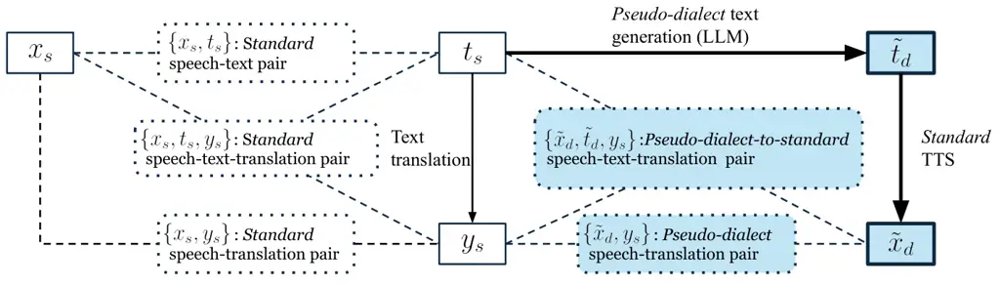

\CJKencfamily

UTF8mc\CJK@envStartUTF8

# Dialect-Robust Speech Language Models with Synthetic Pseudo-Dialect Augmentation

Shunsuke Mitsumori¹², Tomoya Mizumoto¹, Yusuke Fujita¹ Affiliation: ¹SB
Intuitions, ²Waseda University, Tokyo, Japan  
shunsuke.mitsumori@sbintuitions.co.jp

###### Abstract

Speech Language Model (SLM) performance often degrades on dialects due
to data scarcity. Conventional text-to-speech (TTS) augmentation
struggles to cover diverse dialects as it requires a certain amount of
real dialect speech. We propose synthesizing pseudo-dialect speech by
converting LLM-generated dialect text via a standard-language TTS model,
requiring zero real dialect speech. Additionally, we introduce
intermediate standard-text prediction during training, acting as
semantic normalization for downstream tasks. We evaluate dialect
understanding via dialect-to-English speech translation across Japanese,
German, and Chinese dialects. Compared to synthetic standard speech
baselines, pseudo-dialect augmentation improves scores for Japanese
(from 25.38 to 26.24) and German (from 31.57 to 32.47). Furthermore, the
intermediate standard-text prediction effectively bridges the semantic
gap, boosting performance to 28.26 for Japanese and from 11.67 to 16.37
for Chinese. These results suggest that our approach scales to various
languages without requiring speech resources specific to each dialect.

###### Index Terms: 

Speech Language Models, Dialect Adaptation, Data Augmentation, Synthetic
Data

## I Introduction

Dialect speech possesses unique linguistic features (e.g., distinct
vocabulary and grammar) and acoustic features that differ significantly
from the standard language \[1, 2\]. Because of these discrepancies,
conventional speech architectures have historically struggled with
dialect robustness \[3, 4, 5\]. Even recent advancements in Speech
Language Model (SLM) \[6, 7\], which leverage LLMs to achieve remarkable
success in tasks such as speech recognition, translation, and
dialogue \[8, 9, 10, 11\], face severe performance degradation when
encountering dialects \[12, 13\]. The degradation is primarily
attributed to the lack of real dialect speech data for model training.

In the field of low-resource languages, data augmentation approaches
using speech synthesis have been adopted to address such data scarcity.
The primary approach is to convert text obtained via LLM or web
collection into speech with a Text-to-Speech (TTS) model trained on real
speech of the target language \[14, 15\]. However, this augmentation
strategy cannot cover various dialects because it requires a sufficient
amount of real dialect speech for training TTS models.



Fig. 1: Proposed pseudo-dialect speech augmentation. From a standard
pair $`\{x_{s},t_{s}\}`$ and translation $`y_{s}`$, an LLM and standard
TTS model generate pseudo-dialect text $`\tilde{t}_{d}`$ and speech
$`\tilde{x}_{d}`$. This yields $`\{\tilde{x}_{d},y_{s}\}`$ and
$`\{\tilde{x}_{d},t_{s},y_{s}\}`$ for single-task and multi-task SLM
training, respectively.

To expand dialect coverage without relying on real dialect audio, we
focus on the potential of reusing standard-language speech resources.
Since dialects are varieties of a standard language rather than
completely distinct languages \[1\], they inherently share overlapping
acoustic features. Leveraging this acoustic similarity, we propose a
novel dialect adaptation framework that bypasses the need for
dialect-specific TTS models by utilizing “pseudo-dialect” speech.
Specifically, we first employ an LLM to rewrite standard text into text
with dialectal linguistic features. Then, we utilize a standard-language
TTS model to convert this augmented text into pseudo-dialect speech.
Since this framework requires zero real dialect speech resources, it
enables data augmentation for arbitrary dialects.

Furthermore, leveraging the property that pseudo-dialect speech
inherently pairs with standard language text during its generation, we
introduce multi-task learning with intermediate standard-text
prediction. We exploit this standard text as an explicit intermediate
output before predicting the final target task. By projecting the input
into the standard language, we force the model to map the dialectal
audio into a rich semantic space where the backend LLM can perform
strong reasoning.

We verified the general effectiveness of the proposed framework through
two main perspectives. To measure dialect understanding capabilities of
SLM, we followed previous work \[12\] and evaluated the models using a
dialect-to-English translation task. First, to test its effectiveness
across languages, we evaluated SLMs across Japanese, German, and Chinese
dialects. Second, to test architectural generalizability of our
pseudo-dialect speech augmentation, we applied our augmentation to
conventional end-to-end models (Whisper) and cascade models
(Whisper+LLM) using Japanese data.

Experimental results showed that, compared to a synthetic standard
speech baseline, the pseudo-dialect augmentation improved English
translation BLEU scores for Japanese (from 25.38 to 26.24) and German
(from 31.57 to 32.47). Furthermore, intermediate standard-text
prediction boosted performance for Japanese (to 28.26) and Chinese (from
11.67 to 16.37). Regarding architectural generalizability, the
pseudo-dialect speech augmentation also benefited the direct Whisper
model (from 18.44 to 18.98) and the cascade system (from 29.65 to 30.44)
over their respective synthetic standard speech baselines.

## II Proposed Method

In this section, we formulate the proposed dialect adaptation framework.
Our target task is to predict a translation text $`y`$ from an input
speech signal $`x`$ by modeling $`p(y|x)`$. In practice, directly
training $`p(y|x)`$ is challenging because paired data $`\{(x,y)\}`$ are
scarce. To obtain pseudo translation labels, we start from an automatic
speech recognition (ASR) corpus of standard speech-text pairs
$`\{(x_{s},t_{s})\}`$ and apply a text translation model
$`p_{\theta}(y|t_{s})`$ to the transcripts:

```math
y_{s}\sim p_{\theta}(y|t_{s}). \tag{1}
```

This yields pseudo-labeled speech translation data
$`\{(x_{s},y_{s})\}`$. However, the available ASR corpus mostly consists
of standard speech $`x_{s}`$, and the lack of dialect speech $`x_{d}`$
is a fundamental bottleneck. To address this, we propose a dialect
adaptation framework using pseudo-dialect speech augmentation (Figure 1)
and multi-task learning with intermediate standard-text prediction.

### II-A Pseudo-Dialect Speech Augmentation

To mitigate the shortage of dialect speech, we synthesize pseudo-dialect
training examples without relying on real dialect speech. Given a
standard text $`t_{s}`$, we first generate a pseudo-dialect text
$`\tilde{t}_{d}`$ using an LLM-based dialect generation model
$`p_{\phi}(\tilde{t}_{d}|t_{s})`$:

```math
\tilde{t}_{d}\sim p_{\phi}(\tilde{t}_{d}|t_{s}). \tag{2}
```

Next, we synthesize pseudo-dialect speech $`\tilde{x}_{d}`$ from
$`\tilde{t}_{d}`$ using a standard TTS model $`p_{\psi}(x|t)`$:

```math
\tilde{x}_{d}\sim p_{\psi}(x|\tilde{t}_{d}). \tag{3}
```

Finally, we pair the synthesized speech $`\tilde{x}_{d}`$ with the
pseudo translation label $`y_{s}`$ to obtain
$`\{(\tilde{x}_{d},y_{s})\}`$ for SLM training. Note that the TTS model
$`p_{\psi}(x|t)`$ is trained on standard speech-text pairs, and thus
$`\tilde{x}_{d}`$ is typically perceived as non-native-sounding dialect
speech. Nevertheless, because $`\tilde{t}_{d}`$ contains dialectal
lexical and syntactic cues, $`\tilde{x}_{d}`$ provides useful
supervision for dialect robustness.

### II-B Intermediate Standard-Text Prediction for SLM

With the proposed augmentation, each training sample forms a triplet
$`(\tilde{x}_{d},t_{s},y_{s})`$. To effectively translate dialect speech
$`x_{d}`$, we exploit the standard text $`t_{s}`$ as an explicit
intermediate representation. By projecting the input into $`t_{s}`$, we
map the audio into a rich semantic space where the underlying LLM
possesses the strongest semantic reasoning capabilities. This process
acts as a semantic denoising step, effectively bridging the dialectal
input and the target translation. We factorize the speech translation
model as:

```math
p(y|x)=\sum_{t_{s}}p(y|t_{s},x)p(t_{s}|x). \tag{4}
```

In practice, we approximate the marginalization over $`t_{s}`$ by
decoding the most probable sequence. This yields a chain-of-thought
process that predicts the standard text $`t_{s}`$ as a semantic bridge
followed by the final translation $`y`$. During training, the model is
jointly optimized using both the pseudo-dialect data
$`(\tilde{x}_{d},t_{s},y_{s})`$ and the original standard data
$`(x_{s},t_{s},y_{s})`$.

|                      |                                                |                           |                          |                                                                                                   |
| -------------------- | ---------------------------------------------- | ------------------------- | ------------------------ | ------------------------------------------------------------------------------------------------- |
| Output Targets       | Transcription ($`\tilde{t}_{d}`$ or $`t_{s}`$) | Standard text ($`t_{s}`$) | Translation text ($`y`$) | Output Format                                                                                     |
| ASR+English          | ✓                                              |                           | ✓                        | \<ASR\>$`\tilde{t}_{d}`$ or $`t_{s}`$\</ASR\>\<en\>$`y`$\</en\>                                   |
| Standard+English     |                                                | ✓                         | ✓                        | \<standard\>$`t_{s}`$\</standard\>\<en\>$`y`$\</en\>                                              |
| ASR+Standard+English | ✓                                              | ✓                         | ✓                        | \<ASR\>$`\tilde{t}_{d}`$ or $`t_{s}`$\</ASR\>\<standard\>$`t_{s}`$\</standard\>\<en\>$`y`$\</en\> |

TABLE I: Output formats for each multi-task learning configuration.
Variables follow the notation introduced in Section 2, where the
transcription target ($`\tilde{t}_{d}`$ or $`t_{s}`$) depends on the
input speech.

## III Experimental Setup

We verify the effectiveness of the pseudo-dialect speech augmentation
and intermediate standard-text prediction, as proposed in Section II,
within the SLM framework. Because the linguistic relationship between
regional dialects and the standard language varies across different
languages, we conduct our experiments on Japanese, Chinese, and German
to evaluate the general effectiveness of our approach.

### III-A Evaluation Tasks

To evaluate dialect understanding, we focus on the English translation
task taking real dialect speech as input. This task verifies whether the
model truly understands the underlying semantics of the dialect speech
to predict the final translation ($`y`$) \[12\]. To evaluate the English
translation performance, BLEU \[16\] scores were computed using
SacreBLEU \[17\].

### III-B Model and Training Setup

In this study, we constructed SLMs connecting a speech encoder and an
LLM with a projector. Across all languages, we adopted Whisper
large-v3 \[18\] as the speech encoder. For the LLM backend, we utilized
Llama-3.1-Swallow-8B-Instruct-v0.3 \[19\] for Japanese, and
Llama-3.1-8B-Instruct \[20\] for German and Chinese. The projector
consists of two 1-dimensional convolution layers (kernel size 4, stride 2) with GELU activations and a final linear layer. Following previous
studies on SLMs \[21, 22, 23, 24\], the parameters of the speech encoder
and the LLM were frozen during training, while only the projector
parameters were updated.

All SLM models were trained on 8 NVIDIA H100 (80GB) GPUs for 10 epochs
using the AdamW optimizer. The effective batch size was set to 512, and
the learning rate peaked at 1e-4. The SLM training times varied
depending on the dataset sizes of each language. For Japanese, training
took approximately 2 days without pseudo-dialect speech augmentation,
and 4 days with the augmentation. For Chinese, it required slightly over
1 day without augmentation and approximately 2.5 days with it. For
German, training took approximately 6 hours and 12 hours, respectively.

|                            |                      |          |        |         |
| -------------------------- | -------------------- | -------- | ------ | ------- |
| Synthetic data added       | Output Target        | Japanese | German | Chinese |
| No Augmentation (baseline) | English              | 24.21    | 22.37  | 11.61   |
| Synthetic standard speech  | English              | 25.38    | 31.57  | 11.72   |
| Pseudo-dialect speech      | English              | 26.24    | 32.47  | 11.67   |
| Pseudo-dialect speech      | ASR+English          | 27.67    | 29.81  | 16.30   |
| Pseudo-dialect speech      | Standard+English     | 28.26    | 30.73  | 16.37   |
| Pseudo-dialect speech      | ASR+Standard+English | 24.95    | 29.92  | 13.24   |

TABLE II: Comparison of dialect understanding capabilities evaluated via
dialect-to-English speech translation performance (BLEU) across multiple
languages, data augmentation settings, and task output formats. For the
output targets, “English” denotes direct translation, while “ASR” and
“Standard” represent intermediate speech transcription and standard-text
prediction, respectively.

### III-C Datasets

#### III-C1 Evaluation Datasets

To evaluate dialect understanding, we utilized corpora containing real
speech from regional dialects. For Japanese, we used CPJD \[25\]
comprising real speech from 20 dialects. For German, we used
SwissDial \[26\] consisting of 8 dialects. For Chinese, we utilized
KeSpeech \[27\] containing 8 dialect subsets. To ensure accurate
evaluation across all three languages, we generated high-quality English
reference labels from their respective standard language parallel texts
using GPT-4o. These real dialect speeches were strictly excluded from
the training data.

#### III-C2 Training Datasets

Depending on the experimental configurations, models for each language
were trained using real standard language resources, either alone,
augmented with synthesized pseudo-dialect speech, or augmented with
synthetic standard speech (which is included for comparison purposes as
detailed in Section III-D1).

For Japanese, we utilized ReazonSpeech large v2 comprising approximately
2.6M utterances \[28\], employing its transcripts as standard Japanese
labels and as the source text for the data augmentation pipeline.
Additionally, we included real standard speech from Speech-BSD (20,000
utterances) \[29\] and the Japanese subset of CoVoST2 (1,119
utterances) \[30\], along with their human-annotated Japanese
transcripts and English translations.

For German, we used the German subset of Multilingual LibriSpeech \[31\]
comprising approximately 0.4M utterances. For Chinese, we utilized a
subset of 3M utterances from WenetSpeech \[32\]. These datasets served
as standard speech training data and the source texts for the data
augmentation pipeline.

Because ReazonSpeech, the German subset of Multilingual LibriSpeech, and
WenetSpeech lack English translations, we generated their English labels
using Qwen2.5-32B-Instruct \[33\]. We chose a different model from the
LLM used to generate the English references for evaluation (GPT-4o) to
prevent overfitting to the specific stylistic biases of a single machine
translation system, following previous work \[12\].

|                            |       |       |           |       |         |       |          |       |       |          |       |
| -------------------------- | ----- | ----- | --------- | ----- | ------- | ----- | -------- | ----- | ----- | -------- | ----- |
| Synthetic data added       | Avg.  | Akita | Hiroshima | Iyo   | Fukuoka | Awa   | Hokkaido | Fukui | Kyoto | Miyazaki | Enshu |
| No Augmentation (baseline) | 24.21 | 19.10 | 25.97     | 27.49 | 26.72   | 25.34 | 30.19    | 27.69 | 24.35 | 21.73    | 23.83 |
| Synthetic standard speech  | 25.38 | 19.90 | 26.67     | 27.58 | 28.46   | 26.29 | 30.17    | 29.57 | 25.97 | 23.23    | 24.70 |
| Pseudo-dialect speech      | 26.24 | 20.12 | 27.39     | 29.16 | 30.39   | 27.23 | 30.78    | 30.13 | 27.14 | 24.98    | 25.22 |

|                            |       |         |         |       |          |         |       |       |          |       |       |
| -------------------------- | ----- | ------- | ------- | ----- | -------- | ------- | ----- | ----- | -------- | ----- | ----- |
| Synthetic data added       | Avg.  | Okayama | Saitama | Tosa  | Morokata | Tsugaru | Iwaki | Izumo | Kanazawa | Nara  | Osaka |
| No Augmentation (baseline) | 24.21 | 24.83   | 28.66   | 25.36 | 10.60    | 14.30   | 27.75 | 22.55 | 21.68    | 26.67 | 28.19 |
| Synthetic standard speech  | 25.38 | 25.96   | 31.03   | 26.78 | 10.12    | 14.65   | 30.12 | 24.92 | 20.04    | 28.81 | 29.58 |
| Pseudo-dialect speech      | 26.24 | 28.97   | 31.98   | 28.14 | 12.41    | 16.70   | 30.05 | 23.28 | 21.45    | 28.40 | 29.45 |

TABLE III: Comparison of English translation performance (BLEU) across
different types of data augmentation, showing the average score and
individual results for 20 Japanese dialects.

|                       |       |       |           |       |         |       |          |       |       |          |       |
| --------------------- | ----- | ----- | --------- | ----- | ------- | ----- | -------- | ----- | ----- | -------- | ----- |
| Output Targets        | Avg.  | Akita | Hiroshima | Iyo   | Fukuoka | Awa   | Hokkaido | Fukui | Kyoto | Miyazaki | Enshu |
| English (Single-task) | 26.24 | 20.12 | 27.39     | 29.16 | 30.39   | 27.23 | 30.78    | 30.13 | 27.14 | 24.98    | 25.22 |
| ASR+English           | 27.67 | 23.26 | 30.24     | 31.27 | 33.50   | 28.58 | 30.96    | 31.51 | 27.94 | 26.96    | 26.29 |
| Standard+English      | 28.26 | 22.20 | 32.53     | 31.68 | 32.25   | 29.72 | 31.21    | 30.27 | 29.88 | 26.93    | 26.39 |
| ASR+Standard+English  | 24.95 | 19.23 | 25.12     | 25.93 | 29.18   | 27.13 | 27.45    | 29.42 | 26.46 | 22.22    | 25.36 |

|                       |       |         |         |       |          |         |       |       |          |       |       |
| --------------------- | ----- | ------- | ------- | ----- | -------- | ------- | ----- | ----- | -------- | ----- | ----- |
| Output Targets        | Avg.  | Okayama | Saitama | Tosa  | Morokata | Tsugaru | Iwaki | Izumo | Kanazawa | Nara  | Osaka |
| English (Single-task) | 26.24 | 28.97   | 31.98   | 28.14 | 12.41    | 16.70   | 30.05 | 23.28 | 21.45    | 28.40 | 29.45 |
| ASR+English           | 27.67 | 29.59   | 34.09   | 28.32 | 11.48    | 17.65   | 30.12 | 24.83 | 23.63    | 30.38 | 30.95 |
| Standard+English      | 28.26 | 29.79   | 34.00   | 29.22 | 12.34    | 20.43   | 31.20 | 27.25 | 24.63    | 30.62 | 30.85 |
| ASR+Standard+English  | 24.95 | 25.05   | 29.04   | 25.45 | 12.54    | 16.68   | 30.12 | 22.53 | 21.96    | 27.45 | 28.45 |

TABLE IV: Impact of intermediate prediction on English translation
(BLEU), showing the average score and individual results for 20 Japanese
dialects. All models were trained on the dataset augmented with
pseudo-dialect speech.

### III-D Experimental Configurations

#### III-D1 Data Augmentation Configurations

We compare three training data settings to evaluate the proposed
pseudo-dialect speech. All models in this comparison are trained as
standard single-task models.

No Augmentation: Uses only the real speech data from Section III-C,
serving as a baseline without synthetic data. This original training set
consists of approximately 2.6M utterances for Japanese, 0.4M for German,
and 3.0M for Chinese.

Synthetic standard speech: Adds synthesized standard utterances
generated from the respective standard source texts described in
Section III-C. By including a 1:1 match of synthesized utterances, this
configuration doubles the training volume to a total of 5.2M for
Japanese, 0.8M for German, and 6.0M for Chinese. For Japanese, we used
Tsukasa-Speech \[34\] with reference speech from the JVS corpus \[35\].
For German and Chinese, Qwen-TTS \[33\] was utilized to convert the
standard transcripts using the original standard speech as reference.
This setup isolates the effect of pure data volume, verifying that
performance gains come specifically from dialectal linguistic features.

Pseudo-dialect speech: Adds the proposed pseudo-dialect speech to the
baseline dataset. The standard source transcripts for each language were
translated into one of the target regional dialects chosen at random (20
dialects for Japanese, 8 for German, and 8 for Chinese). This dialectal
rewriting was performed via gpt-oss-120b \[36\] across all languages.
The rewritten texts were then synthesized into speech using the
identical TTS setup as the synthetic standard speech for each language.
To ensure a fair comparison, this configuration maintains the exact same
total data volume as the synthetic standard speech setting.

#### III-D2 Multi-task Learning Configurations

To verify the effectiveness of multi-task learning with intermediate
standard-text prediction for the SLM, we trained models on the full
dataset augmented with pseudo-dialect speech in Section III-D1. The
designated target output formats for these multi-task configurations are
defined in Table I. By generating this concatenated sequence, the joint
probability formulated in Eq. 4 is implicitly optimized through the
standard autoregressive next-token prediction (cross-entropy) loss.
During evaluation of the multi-task models, the final English
translation was obtained by extracting the text enclosed within the
\<en\> and \</en\> tags using regular expressions.

## IV Experimental Results

Table II presents the overall dialect understanding performance
evaluated via English translation BLEU on the real dialect speech from
Section III-C1, across multiple languages under the various data
augmentation settings and multi-task learning configurations described
in Section III-D1. The results indicate that our framework successfully
improved the dialect understanding performance across all target
languages. However, whether pseudo-dialect speech augmentation or
multi-task learning primarily drove these improvements highly depended
on the linguistic properties of each language. To rigorously evaluate
these performance differences, we conducted paired bootstrap resampling
tests \[37\] with 1,000 iterations ($`p<0.05`$) at the overall language
or individual dialect levels. Note that Japanese dialect subsets have
small sample sizes ($`\sim`$250 utterances). Thus, non-significant
results may stem from low statistical power rather than an absence of
effect.

|              |                        |                       |                     |                        |
| ------------ | ---------------------- | --------------------- | ------------------- | ---------------------- |
| Category     | Input Audio (Dialect)  | English Ground Truth  | Baseline Output     | Proposed Output        |
| Improved 1   | ほんで食材も           | And we also ran out   | And I also bought   | And we also ran out of |
| (Kyoto)      | たりひんかったんどす． | of ingredients.       | some ingredients.   | ingredients.           |
| Improved 2   | きっと素敵な休日に     | I’m sure it will be a | I hope you have a   | I’m sure it will be a  |
| (Iwaki)      | なっぺよ．             | wonderful holiday.    | wonderful holiday.  | wonderful holiday.     |
| Failure 1    | がめるものがめるもの， | The things I pick up  | There are a lot of  | There are a lot of     |
| (Kanazawa)\* | 古いものが多いがやて． | tend to be old.       | old things here.    | old things here.       |
| Failure 2    | 赤のスマホでも         | A red smartphone      | I might as well use | Maybe it’s okay if     |
| (Tsugaru)†   | いいがもな．           | might be nice, too.   | my smartphone.      | it’s an iPhone.        |

TABLE V: Qualitative analysis of translation outputs from the English
translation task. Asterisk (\*) and dagger (†) indicate failure cases
due to unseen vocabulary and acoustic gaps.

[TABLE]

TABLE VI: Comparison of English translation outputs across multi-task
configurations. All models were trained on the identical dataset
augmented with pseudo-dialect speech, differing only in their target
output formats.

While Japanese demonstrated substantial improvements from both
approaches, elevating the performance from the baseline of 24.21 to a
maximum score of 28.26, German and Chinese exhibited contrasting
behaviors regarding which method was effective. For German, data
augmentation with pseudo-dialect speech successfully improved the
dialect understanding performance compared to the augmentation with
synthetic standard speech (+0.90 BLEU, $`p<0.001`$). Conversely,
multi-task learning was not effective for German because direct
translation is already effective. Forcing an intermediate text output
likely caused error propagation rather than serving as a semantic
bridge. In contrast, for Chinese, pseudo-dialect speech augmentation
showed no noticeable effect. However, multi-task learning with
intermediate standard Mandarin prediction improved the dialect
understanding performance from 11.67 to 16.37 (+4.70 BLEU). Chinese
dialects share an ideogram-based written system with the standard
language. Therefore, they share a strong grammatical and lexical
foundation despite different pronunciations. Mapping the speech input to
this standard text space thus likely functioned as an effective semantic
bridge for the LLM backend. Conversely, this shared text does not alter
its character forms to reflect phonetic variations. Unlike phonetic
languages, reproducing dialect-specific readings using a standard TTS
model is uniquely challenging. Consequently, the TTS model failed to
synthesize distinct dialectal speech, potentially limiting the benefit
of audio augmentation. Furthermore, compared to the Standard+English
setting, the ASR+Standard+English setting degraded performance across
all three languages. This decline is likely attributed to the
amplification of error propagation caused by passing through two
intermediate predictions.

We next examine the detailed performance across the 20 Japanese
dialects. As shown in Table III, pseudo-dialect augmentation improved
the average BLEU score to 26.24, significantly outperforming synthetic
standard speech (25.38, $`p<0.001`$). It brought gains over both the
no-augmentation and synthetic standard speech baselines in 15 dialects
(with 4 out of 20 dialects showing statistical significance,
$`p<0.05`$).

Table IV demonstrates that incorporating the standard Japanese
intermediate target (Standard+English) achieved further performance
improvements, significantly outperforming the ASR+English target
($`p<0.05`$). Compared to the direct English translation, this
configuration improved performance in 19 out of 20 dialects (with 9
dialects showing statistically significant improvements, $`p<0.05`$),
including dialects where audio augmentation alone showed no gains. In
contrast, the ASR target (ASR+English) was less stable, showing larger
performance fluctuations in specific dialects like Hiroshima, Izumo, and
Tsugaru. This instability underscores that mapping to a standard text
space provides a more robust semantic bridge than literal
transcriptions.

## V Analysis

This section provides a qualitative analysis to examine how our method
improves dialect understanding and to identify remaining challenges.
This evaluation is conducted using Japanese examples from Table V and
Table VI, which showed clear performance improvements across both data
augmentation and output format configurations. Through these cases, we
demonstrate the specific advantages and limitations of pseudo-dialect
speech augmentation, as well as the benefits of multi-task learning.

### V-A Improvement by Pseudo-Dialect Speech

As shown in the improvement examples, the proposed method is able to
learn grammar and vocabulary unique to dialects. Specifically, the
baseline model misrecognized the dialectal phrase
“たりひんかった(tarihinkatta)” as “katta” that means “bought” in
Improved 1. Similarly, in Improved 2, it misrecognized the dialectal
ending “nappeyo” (meaning “will probably become”) as the phonetically
similar standard expression “natteyo” (which expresses a desire or
request). In contrast, the proposed method correctly recognized the
dialect expressions in both examples. These results support that through
learning with pseudo-dialect speech that has dialectal linguistic
features even with standard language acoustic features, SLM can acquire
knowledge regarding the grammar and vocabulary structure of dialects.

### V-B Challenges of Pseudo-Dialect Speech

On the other hand, the failure examples highlight two primary
challenges. First is uncovered dialect vocabulary due to limitations in
LLM translation quality. In failure example 1, both models failed to
recognize the dialect term “がめる(gameru)” that means “pick up”.
Investigation of the training data revealed that all instances that
should have been translated to “がめる(gameru)” were missed by the LLM.
In failure example 2, both methods failed to recognize the standard word
“赤(aka)” that means “red” due to the Tsugaru dialect accent. This
indicates that the method has limitations in adapting to acoustic
variations unique to dialects, since the pseudo-dialect speech is
synthesized with standard language acoustic features.

### V-C Improvement by Multi-task Learning

Table VI compares the outputs of the different models given a Tsugaru
dialect input. The single-task model mistranslates the dialectal phrase
“わさけだ(wasakeda)”, which means “someone gave it to me.” Furthermore,
in the model jointly outputting transcriptions, the phrase is
misrecognized as “話さけだ,” which is not an existing word sequence but
could be pronounced similarly, and this error propagates directly to the
English translation. In contrast, the model jointly outputting standard
Japanese successfully captures the core semantic meaning of parental
giving, translating the phrase as “bought it for me.” This configuration
yields the most contextually accurate English output among the compared
models. This indicates that standard Japanese serves as an effective
intermediate representation that bridges the semantic gap between
dialects and English.

## VI Effectiveness across different Model Architectures

To verify whether our proposed pseudo-dialect speech augmentation is
effective beyond the SLM architecture, we also examine its impact on
alternative frameworks, specifically direct English translation using
Whisper, and a cascade speech translation system combining Whisper and
Swallow. For these models, Whisper and Swallow are trained
independently. Unlike the frozen configuration of the SLM, Whisper
undergoes full-parameter fine-tuning with 1,543.5M total and trainable
parameters, whereas Swallow is efficiently tuned using LoRA \[38\] with
41.9M trainable parameters out of 8,072.2M total parameters.
Consequently, the cascade system comprises 9,615.7M total parameters,
with 1,585.4M trainable parameters. Due to these significant differences
in trainable parameters, our evaluation focuses on the effectiveness of
pseudo-dialect augmentation within each respective architecture rather
than comparing absolute performance across them.

All models were trained on 8 NVIDIA A100 (80GB) GPUs for 10 epochs using
the AdamW optimizer. For the individual training of Whisper and Swallow,
the effective batch size was 256, and the peak learning rate was 1e-5.
Training Whisper took about 1.5 days without augmentation and 3 days
with it, while Swallow required about 1 day and 2 days, respectively.

The results of the English translation task using the SLM, Whisper, and
the cascade system are presented in Table VII. First, although the
cascade system outperforms the SLM, this is primarily because both
Whisper and Swallow underwent fine-tuning. Therefore, this result does
not necessarily indicate the architectural superiority of one model over
the other. Notably, not only for the SLM but also for both direct
English translation using Whisper and the cascade translation system,
applying the proposed pseudo-dialect speech augmentation improved
translation performance compared to training with synthetic standard
speech (+0.54 and +0.79 for Whisper and the cascade system,
respectively, $`p<0.001`$). This demonstrates that, even after isolating
the effect of simply increasing the data volume, the proposed
pseudo-dialect speech augmentation is generally effective across various
architectures.

|                     |          |          |          |
| ------------------- | -------- | -------- | -------- |
| Dataset             | SLM      | Whisper  | Cascade  |
| \# Total params     | 8,683.7M | 1,543.5M | 9,615.7M |
| \# Trainable params | 18.4M    | 1,543.5M | 1,585.4M |
| No training         | -        | 14.36    | 19.87    |
| No Augmentation     | 24.21    | 17.78    | 29.78    |
| + Standard          | 25.38    | 18.44    | 29.65    |
| + Pseudo-dialect    | 26.24    | 18.98    | 30.44    |

TABLE VII: Effectiveness of pseudo-dialect augmentation across
architectures in English translation (BLEU). “No training” means no
fine-tuning. “+ Standard” and “+ Pseudo-dialect” add synthetic standard
and pseudo-dialect speech. SLM scores match averages in Table III.

## VII Conclusion

In this study, we proposed dialect adaptation for SLM using
pseudo-dialect speech synthesized without real dialect speech, combined
with multi-task learning leveraging the corresponding standard language
text. Experimental results demonstrated that our method improves dialect
understanding performance across multiple languages and alternative
model architectures. This serves as a practical and scalable strategy to
expand the dialect coverage of SLM, eliminating the need for extensive
dialect speech collection.

The qualitative analysis in Section V illustrated how the proposed
method improves dialect understanding, while also highlighting the
importance of LLM dialect translation quality and cases where the TTS
system needs to capture dialectal accents. Therefore, establishing
evaluation protocols for low-resource dialect text translation, as well
as developing advanced speech synthesis technologies that replicate
realistic dialectal features under low-resource constraints, remain key
directions for future work.

## References

- \[1\] J. K. Chambers and P. Trudgill (1998) Dialect and language. In
  Dialectology, Cambridge Textbooks in Linguistics, pp. 3–12. Cited by:
  §I, §I.
- \[2\] M. Zampieri and P. Nakov (Eds.) (2021) Similar Languages,
  Varieties, and Dialects: A Computational Perspective. Studies in
  Natural Language Processing, Cambridge University Press. Cited by: §I.
- \[3\] S. Miwa and A. Kai (2023) Dialect Speech Recognition Modeling
  using Corpus of Japanese Dialects and Self-Supervised Learning-based
  Model XLSR. In Interspeech 2023, pp. 4928–4932. External Links:
  [Document](https://dx.doi.org/10.21437/Interspeech.2023-2463), ISSN
  2958-1796 Cited by: §I.
- \[4\] B. Li, T. N. Sainath, K. C. Sim, M. Bacchiani, E. Weinstein, P.
  Nguyen, Z. Chen, Y. Wu, and K. Rao (2018) Multi-dialect speech
  recognition with a single sequence-to-sequence model. In 2018 IEEE
  International Conference on Acoustics, Speech and Signal Processing
  (ICASSP), Vol. , pp. 4749–4753. External Links:
  [Document](https://dx.doi.org/10.1109/ICASSP.2018.8461886) Cited by:
  §I.
- \[5\] S. Yoo, I. Song, and Y. Bengio (2019) A highly adaptive acoustic
  model for accurate multi-dialect speech recognition. In ICASSP
  2019-2019 IEEE International Conference on Acoustics, Speech and
  Signal Processing (ICASSP), pp. 5716–5720. Cited by: §I.
- \[6\] W. Cui, D. Yu, X. Jiao, et al. (2025) Recent advances in speech
  language models: a survey. In Proc. 63rd Annual Meeting of the
  Association for Computational Linguistics (Volume 1: Long Papers),
  pp. 13943–13970. External Links:
  [Document](https://dx.doi.org/10.18653/v1/2025.acl-long.682), ISBN
  979-8-89176-251-0 Cited by: §I.
- \[7\] J. Peng, Y. Wang, B. Li, Y. Guo, et al. (2024) A survey on
  speech large language models for understanding. IEEE Journal of
  Selected Topics in Signal Processing 20, pp. 2–31. Cited by: §I.
- \[8\] D. Zhang, S. Li, X. Zhang, et al. (2023) SpeechGPT: empowering
  large language models with intrinsic cross-modal conversational
  abilities. In Proc. Findings of EMNLP, pp. 15757–15773. Cited by: §I.
- \[9\] A. Défossez, L. Mazaré, M. Orsini, et al. (2024) Moshi: a
  speech-text foundation model for real-time dialogue. arXiv preprint
  arXiv:2410.00037. Cited by: §I.
- \[10\] Q. Fang, S. Guo, Y. Zhou, et al. (2025) LLaMA-omni: seamless
  speech interaction with large language models. In Proc. ICLR, Cited
  by: §I.
- \[11\] W. Chen, Z. Ma, R. Yan, et al. (2025) SLAM-omni:
  timbre-controllable voice interaction system with single-stage
  training. In Proc. Findings of ACL, pp. 2262–2282. Cited by: §I.
- \[12\] T. Mizumoto, Y. Fujita, H. Shi, L. Liu, A. Kojima, and Y.
  Sudo (2025) Evaluating Japanese dialect robustness across speech and
  text-based large language models. In Proc. ASRU, Cited by: §I, §I,
  §III-A, §III-C2.
- \[13\] Y. Chen, X. Yue, C. Zhang, X. Gao, R. T. Tan, and H. Li (2026)
  VoiceBench: benchmarking LLM-based voice assistants. Transactions of
  the Association for Computational Linguistics (TACL) 14, pp. 378–398.
  Cited by: §I.
- \[14\] T. Wang, L. Xu, W. Lu, and S. Cheng (2025) From tens of hours
  to tens of thousands: scaling back-translation for speech recognition.
  In Proc. EMNLP, pp. 12461–12475. External Links:
  [Document](https://dx.doi.org/10.18653/v1/2025.emnlp-main.629), ISBN
  979-8-89176-332-6 Cited by: §I.
- \[15\] A. Dao, D. B. Vu, H. H. Ha, et al. (2025) Speechless: Speech
  Instruction Training Without Speech for Low Resource Languages. In
  Proc. Interspeech, pp. 3239–3243. External Links:
  [Document](https://dx.doi.org/10.21437/Interspeech.2025-1292), ISSN
  2958-1796 Cited by: §I.
- \[16\] K. Papineni, S. Roukos, T. Ward, and W. Zhu (2002) BLEU: a
  method for automatic evaluation of machine translation. In Proceedings
  of the 40th Annual Meeting on Association for Computational
  Linguistics, pp. 311–318. Cited by: §III-A.
- \[17\] M. Post (2018) A call for clarity in reporting BLEU scores. In
  Proc. Third Conference on Machine Translation: Research Papers,
  Belgium, Brussels, pp. 186–191. Cited by: §III-A.
- \[18\] A. Radford, J. W. Kim, T. Xu, G. Brockman, C. McLeavey, and I.
  Sutskever (2023) Robust speech recognition via large-scale weak
  supervision. In Proc. ICML, Vol. 202, pp. 28492–28518. Cited by:
  §III-B.
- \[19\] K. Fujii, T. Nakamura, M. Loem, et al. (2024) Continual
  pre-training for cross-lingual llm adaptation: enhancing japanese
  language capabilities. In Proc. First Conference on Language Modeling,
  COLM. Cited by: §III-B.
- \[20\] AI@Meta (2024) Llama 3 model card. Note:
  https://github.com/meta-llama/llama3/blob/main/MODEL_CARD.md Cited by:
  §III-B.
- \[21\] X. Wang, Y. Li, C. Fu, Y. Zhang, Y. Shen, L. Xie, K. Li, X.
  Sun, and L. Ma (2025) Freeze-omni: a smart and low latency
  speech-to-speech dialogue model with frozen llm. ICML. Cited by:
  §III-B.
- \[22\] Y. Du, Z. Ma, Y. Yang, K. Deng, X. Chen, B. Yang, Y. Xiang, M.
  Liu, and B. Qin (2025) CoT-st: enhancing llm-based speech translation
  with multimodal chain-of-thought. Proc. ACL. Cited by: §III-B.
- \[23\] Z. Ma, G. Yang, Y. Yang, Z. Gao, J. Wang, Z. Du, F. Yu, Q.
  Chen, S. Zheng, S. Zhang, et al. (2025) Speech recognition meets large
  language model: benchmarking, models, and exploration. Proc. AAAI.
  Cited by: §III-B.
- \[24\] G. Yang, Z. Ma, Z. Gao, S. Zhang, and X. Chen (2024)
  CTC-assisted llm-based contextual asr. Proc. SLT. Cited by: §III-B.
- \[25\] S. Takamichi and H. Saruwatari (2018) CPJD corpus: crowdsourced
  parallel speech corpus of Japanese dialects. In Proc. LREC, Cited by:
  §III-C1.
- \[26\] P. Dogan-Schönberger, J. Mäder, and T. Hofmann (2021)
  SwissDial: parallel multidialectal corpus of spoken swiss german.
  arXiv preprint arXiv:2103.11401. Cited by: §III-C1.
- \[27\] Z. Tang, D. Wang, Y. Xu, J. Sun, X. Lei, S. Zhao, C. Wen, X.
  Tan, C. Xie, S. Zhou, R. Yan, C. Lv, Y. Han, W. Zou, and X. Li (2021)
  KeSpeech: an open source speech dataset of mandarin and its eight
  subdialects. In Proc. NeurIPS Datasets and Benchmarks, Cited by:
  §III-C1.
- \[28\] Y. Yin, D. Mori, and S. Fujimoto (2023) ReazonSpeech: A Free
  and Massive Corpus for Japanese ASR. In Proc. 29th Annual Meeting of
  the Association for Natural Language Processing, Cited by: §III-C2.
- \[29\] S. Shimizu, C. Chu, S. Li, and S. Kurohashi (2023) Towards
  speech dialogue translation mediating speakers of different languages.
  In Proc. Findings of ACL, pp. 1122–1134. Cited by: §III-C2.
- \[30\] C. Wang, A. Wu, and J. Pino (2020) CoVoST 2: a massively
  multilingual speech-to-text translation corpus. arXiv preprint
  arXiv:2007.10310. Cited by: §III-C2.
- \[31\] V. Pratap, Q. Xu, A. Sriram, G. Synnaeve, and R.
  Collobert (2020) MLS: A Large-Scale Multilingual Dataset for Speech
  Research. In Proc. Interspeech , pp. 2757–2761. Cited by: §III-C2.
- \[32\] B. Zhang, H. Lv, P. Guo, Q. Shao, C. Yang, L. Xie, X. Xu, H.
  Bu, X. Chen, C. Zeng, D. Wu, and Z. Peng (2022) WenetSpeech: a 10000+
  hours multi-domain mandarin corpus for speech recognition. In Proc.
  ICASSP, Cited by: §III-C2.
- \[33\] Qwen, :, A. Yang, B. Yang, B. Zhang, et al. (2025) Qwen2.5
  technical report. arXiv preprint arXiv:2412.15115. Cited by: §III-C2,
  §III-D1.
- \[34\] R. Soshyant, A. Meta, Cryptowooser, and Buttercream (2024)
  Tsukasa speech: engineering the naturalness and rich expressiveness.
  Hugging Face. Cited by: §III-D1.
- \[35\] S. Takamichi, K. Mitsui, Y. Saito, et al. (2019) JVS corpus:
  free japanese multi-speaker voice corpus. arXiv preprint
  arXiv:1908.06248. Cited by: §III-D1.
- \[36\] OpenAI (2025) Gpt-oss-120b & gpt-oss-20b model card. arXiv
  preprint arXiv:2508.10925. Cited by: §III-D1.
- \[37\] P. Koehn (2004) Statistical significance tests for machine
  translation evaluation. In Proceedings of the 2004 Conference on
  Empirical Methods in Natural Language Processing, D. Lin and D. Wu
  (Eds.), pp. 388–395. Cited by: §IV.
- \[38\] E. J. Hu, Y. Shen, P. Wallis, Z. Allen-Zhu, Y. Li, S. Wang, L.
  Wang, and W. Chen (2022) LoRA: low-rank adaptation of large language
  models.. In ICLR, Cited by: §VI.

\CJK@envEnd
