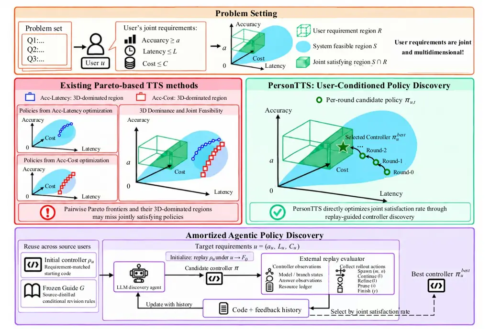

# From Pareto to Preference: Personalized Test-Time Scaling via Amortized Agentic Policy Discovery

Xinglin Wang¹¹ 1 Equal contribution. Affiliation:  Beijing Institute of
Technology Email: [wangxinglin@bit.edu.cn](mailto:)    Zishen Liu¹¹ 1
Equal contribution. Affiliation:  Beijing Institute of Technology
Email: [liuzishen@bit.edu.cn](mailto:)    Tong Zheng¹¹ 1 Equal
contribution. Email: [peiwenyuan@bit.edu.cn](mailto:)    Shaoxiong
Feng²² 2 Corresponding author. Affiliation:  Xiaohongshu Inc
Email: [liyiwei@bit.edu.cn](mailto:)    Peiwen Yuan Affiliation: 
Beijing Institute of Technology Email: [shijiayi@bit.edu.cn](mailto:)   
Yiwei Li Affiliation:  Beijing Institute of Technology
Email: [zhangyq@bit.edu.cn](mailto:)    Jiayi Shi Affiliation:  Beijing
Institute of Technology Email: [tanchuyi@bit.edu.cn](mailto:)    Yueqi
Zhang Affiliation:  Beijing Institute of Technology
Email: [zhangji@bit.edu.cn](mailto:)    Chuyi Tan Affiliation:  Beijing
Institute of Technology Email: [likan@bit.edu.cn](mailto:)    Ji Zhang
Affiliation:  Beijing Institute of Technology
Email: [zhengtong12356@gmail.com](mailto:)    Boyuan Pan Affiliation: 
Xiaohongshu Inc Email: [shaoxiongfeng2023@gmail.com](mailto:)    Kan
Li²² 2 Corresponding author. Affiliation:  Beijing Institute of
Technology Email: [panboyuan@xiaohongshu.com](mailto:)

###### Abstract

Test-time scaling (TTS) improves the reasoning capabilities of large
language models by allocating additional inference computation. Existing
approaches to improving TTS efficiency largely optimize accuracy against
one resource dimension at a time, advancing either the _accuracy–cost_
or _accuracy–latency_ Pareto frontier. Yet user requirements are
multidimensional: users may specify accuracy, latency, and
inference-cost requirements jointly, and different requirements can
favor different controllers. We formulate _Personalized Test-Time
Scaling_ as discovering executable controllers that maximize the joint
satisfaction rate of user-specific requirements. To reduce the overhead
of repeated policy discovery for new user profiles, we propose
PersonTTS, an amortized agentic policy-discovery framework that reuses
prior search experience through requirement-matched controller
initialization and source-distilled procedural guidance, while retaining
target-profile evaluation for every candidate. Experiments on AIME and
HMMT show that PersonTTS substantially outperforms strong TTS baselines
in joint requirement satisfaction on unseen user profiles and held-out
problems. Under the same candidate-evaluation budget, cross-user
experience reuse further improves policy quality while substantially
reducing discovery-agent time and cost¹¹ 1 Our code and data have been
released on
[https://github.com/WangXinglin/PersonTTS](https://github.com/WangXinglin/PersonTTS)..

|     |
| --- |
|     |

## 1 Introduction



Figure 1: Comparison of Existing Test-Time Scaling Paradigms and
Personalized Test-Time Scaling. Existing methods primarily optimize
accuracy against latency or inference cost separately, whereas
Personalized TTS targets their joint satisfaction under user-specific
requirements. PersonTTS amortizes user-conditioned controller discovery
by reusing requirement-matched controllers and procedural guidance from
prior searches.

Test-time scaling (TTS) has emerged as a powerful paradigm for improving
the reasoning capabilities of large language models (OpenAI, 2024; Kimi
Team et al., 2025; DeepSeek-AI et al., 2025). By allocating additional
computation at inference time, TTS enables extended exploration of the
solution space, allowing models to explore diverse reasoning paths,
evaluate candidate answers, and refine solutions for complex tasks such
as mathematical reasoning (Wang et al., 2023b; Madaan et al., 2023;
Lightman et al., 2024). However, scaling up this exploration incurs
substantial inference overhead (Brown et al., 2024; Snell et al., 2025).
To mitigate these overheads, existing approaches largely focus on
advancing the _accuracy–cost_ or _accuracy–latency_ Pareto frontier by
reducing redundant computation (Wu et al., 2025; Wang et al., 2025b;
Wang et al., 2026a; Wang et al., 2026b; Zheng et al., 2026b), for
example, using adaptive sampling, early stopping, or selective branch
pruning (Aggarwal et al., 2023; Li et al., 2024; Wang et al., 2025a;
Zheng et al., 2026a).

While yielding promising efficiency gains, these approaches typically
optimize accuracy against one resource dimension at a time, which does
not fully capture a user’s joint requirements. In practice, users may
require a target accuracy subject to both latency and inference-cost
limits (Huang et al., 2025; Wang et al., 2026c), so different
requirements can favor different controllers even on the same problem
set. Consequently, optimizing either Pareto frontier can fail to
identify controllers that satisfy accuracy, latency, and inference-cost
requirements jointly (Figure 1). We therefore formulate _Personalized
Test-Time Scaling_ as discovering executable controllers that maximize
the joint satisfaction rate of user-specific accuracy, latency, and
inference-cost requirements, shifting the focus from Pareto to
preference.

Crucially, personalization affects not only how a controller is
evaluated, but also how it should execute. An executable TTS controller
coordinates model selection, reasoning width and depth, refinement,
pruning, and stopping (Zheng et al., 2026b), and these decisions can
depend on the target requirements. Candidate controllers must therefore
be evaluated under the target profile rather than assumed to transfer
across users. However, running policy discovery independently for every
new profile can be costly, e.g., \$39.9 and 160 minutes for a complete
policy-discovery run (Zheng et al., 2026b).

To address this challenge, we propose PersonTTS, an amortized agentic
policy-discovery framework that reuses prior search experience across
users. Specifically, PersonTTS retrieves a controller from a source
profile with similar requirements and re-evaluates it under the target
profile to initialize discovery, while a frozen Guide distilled from
source discovery histories informs subsequent proposals (see Figure 1).
An LLM discovery agent then proposes executable controllers using the
target requirements, replay feedback, and accumulated search history.
Each candidate is evaluated under the target profile, and the controller
with the highest joint satisfaction rate is retained. By combining
controller reuse and procedural guidance with target-specific
evaluation, PersonTTS amortizes design effort across users and enables
more efficient personalized policy discovery.

We evaluate PersonTTS on AIME and HMMT (Dekoninck et al., 2026) using
six Qwen3 models (Yang et al., 2025), with independently sampled source
and target requirement profiles and separate held-out problem sets.
PersonTTS substantially outperforms strong TTS baselines in joint
requirement satisfaction on both unseen user profiles and held-out
problems. Under the same candidate-evaluation budget, cross-user
experience reuse further improves policy quality over independent
target-side discovery while substantially reducing discovery-agent time
and monetary cost. Ablation studies further characterize the distinct
roles of requirement-matched initialization and procedural guidance in
personalized policy discovery.

Our contributions are summarized as follows:

- •
  We formulate Personalized Test-Time Scaling as executable controller
  discovery under joint user-specific accuracy, latency, and
  inference-cost requirements, with the objective of maximizing their
  joint satisfaction.
- •
  We propose PersonTTS, an amortized agentic policy-discovery framework
  that reuses requirement-matched controllers and procedural discovery
  experience across users while preserving target-specific evaluation.
- •
  We empirically validate PersonTTS on AIME and HMMT, demonstrating
  substantial gains over strong TTS baselines on unseen user profiles
  and held-out problems, while cross-user experience reuse further
  improves policy quality and reduces discovery overhead under the same
  candidate-evaluation budget.

## 2 Related Work

##### Efficient Test-Time Scaling.

Test-time scaling improves reasoning by allocating additional inference
computation through parallel sampling and aggregation (Wang et al.,
2023b; Brown et al., 2024; Wu et al., 2025; Snell et al., 2025),
iterative feedback and refinement (Madaan et al., 2023), or structured
search over intermediate reasoning states (Yao et al., 2023; Besta et
al., 2024). A growing body of work seeks to make this additional
computation more efficient by reducing unnecessary exploration. Adaptive
sampling and early stopping terminate generation once sufficient
evidence has been accumulated (Aggarwal et al., 2023; Li et al., 2024),
while methods conditioned on problem difficulty or reasoning quality
allocate computation adaptively across problems or reasoning paths (Wan
et al., 2025; Wang et al., 2025a; Snell et al., 2025; Wang et al.,
2026a). Other approaches improve the organization of inference through
branch pruning, adaptive control of search width and depth, parallel
execution, or cross-branch information sharing (Wang et al., 2025b;
Huang et al., 2025; Wang et al., 2026d; Wang et al., 2026b; Zheng et
al., 2026a; Zheng et al., 2026b). Despite their different mechanisms,
these methods can largely be viewed as advancing the _accuracy–cost_ or
_accuracy–latency_ Pareto frontier. In contrast, Personalized TTS
considers user-specific accuracy, latency, and inference-cost
requirements jointly, and seeks executable controllers that maximize
their joint satisfaction rather than optimizing a single
accuracy–resource Pareto frontier.

##### Agentic Discovery.

Large language models are increasingly used as discovery agents that
iteratively propose, evaluate, and refine executable artifacts, ranging
from algorithms and programs to agentic workflows (Romera-Paredes et
al., 2024; Liu et al., 2024; Novikov et al., 2025; Hu et al., 2025;
Zhang et al., 2025). Recent approaches further leverage textual feedback
or execution histories to guide subsequent proposals, enabling more
targeted optimization of prompts, modules, and system code (Agrawal et
al., 2026; Lee et al., 2026). AutoTTS brings this paradigm to test-time
scaling by formulating TTS strategy design as executable controller
synthesis in an offline replay environment, targeting the accuracy–cost
Pareto frontier (Zheng et al., 2026b). PersonTTS extends this paradigm
to user-specific joint accuracy, latency, and inference-cost
requirements, while amortizing the otherwise repeated controller
discovery across profiles through reusable prior experience.

##### Experience Reuse in LLMs.

Prior work has explored reusing past experience to improve subsequent
behavior, including reflections and distilled insights (Shinn et al.,
2023; Zhao et al., 2024), reasoning and search experience distilled from
successful and failed trajectories (Ouyang et al., 2026; Wang et al.,
2026d), reusable executable skills (Wang et al., 2023a) and replay world
simulators (Zheng et al., 2026c). At the design level, SWIFT distills
reusable design knowledge from previous workflow searches, while
FlowBank precomputes and selects workflows for new queries (Du et al.,
2026; Yuan et al., 2026). PersonTTS instead focuses on reuse across user
requirement profiles, using source controllers to initialize target
discovery and distilled procedural experience to guide subsequent
proposals, while retaining target-profile evaluation for controller
selection.

## 3 Methodology

We formulate Personalized Test-Time Scaling as a user-conditioned
controller-discovery problem:

> _Given a user’s accuracy, latency, and inference-cost requirements,
> how can we efficiently automate personalized TTS policy design to
> maximize the probability of jointly satisfying these requirements?_

To address this problem, we propose PersonTTS, which combines
feedback-driven program search with cross-user experience reuse. For
each target requirement, retrieval provides an initial policy, a frozen
Guide informs candidate revisions, and replay-based selection retains
the evaluated policy with the highest joint satisfaction rate.

### 3.1 Problem Formulation

We represent a user’s requirements by a profile
$`u=(a_{u},L_{u},C_{u})`$, which specifies an accuracy floor
$`a_{u}\in[0,1]`$, a ceiling $`L_{u}`$ on maximum per-question replay
latency, and a ceiling $`C_{u}`$ on mean per-question inference cost. In
an environment $`e`$ with models $`\mathcal{M}_{e}`$, a policy $`\pi`$
is executable code that maps $`u`$ and the current observation history
$`h_{k}`$ to an action. Public observations include model and branch
availability, branch progress, intermediate answers and answer
histories, and accumulated latency and cost. As correctness is assessed
externally, the controller receives neither reference answers nor
correctness labels.

##### Action space.

A policy controls _model routing_, _reasoning width_, _reasoning depth_,
and _self-refinement_. Calling a reasoning path a branch, we write
$`\pi(u,h_{k})\in\mathcal{A}_{e}`$, where

```math
\mathcal{A}_{e}=\{\operatorname{Spawn}(m,n),\operatorname{Continue}(I),\operatorname{Refine}(I),\operatorname{Prune}(i),\operatorname{Finish}(y)\}. \tag{1}
```

Here, $`\operatorname{Spawn}(m,n)`$ opens $`n`$ branches with model
$`m\in\mathcal{M}_{e}`$, $`\operatorname{Continue}(I)`$ advances the
selected branch set $`I`$, and $`\operatorname{Refine}(I)`$ starts
self-refinement for eligible branches whose current stage has ended.
$`\operatorname{Prune}(i)`$ excludes branch $`i`$ from further reasoning
and answer selection. $`\operatorname{Finish}(y)`$ ends the question
with an observed answer $`y`$, or deterministic plurality voting if
$`y`$ is omitted. The environment determines action admissibility, while
the full interface is given in Appendix G. Program search can therefore
revise both resource allocation and the rules that adapt it to
intermediate observations.

##### Joint satisfaction objective.

Fix a labeled question set
$`\mathcal{D}=\{(q_{i},y_{i}^{\star})\}_{i=1}^{N}`$, $`N\geq 1`$, a
cache $`\mathcal{R}_{e}`$, and a nonempty finite replay-seed panel
$`\Omega`$. Each seed specifies a complete evaluation over
$`\mathcal{D}`$, called a _seed batch_, and varies cached-branch
consumption order. For complete finite replay records
$`\tau_{u}^{\pi}(s)=\operatorname{Replay}_{e}(\pi,u;\mathcal{R}_{e},\mathcal{D},s)`$,
define

```math
A_{u}^{\pi}(s)=\frac{1}{N}\sum_{i}\chi_{i}(\tau_{u}^{\pi}(s)),\quad L_{u}^{\pi}(s)=\max_{q\in\mathcal{D}}\ell_{s}(q;\pi,u),\quad C_{u}^{\pi}(s)=\frac{1}{N}\sum_{i}c_{i}(\tau_{u}^{\pi}(s)), \tag{2}
```

where $`\chi_{i}`$ checks the returned answer against $`y_{i}^{\star}`$,
$`c_{i}`$ is the inference cost for question $`q_{i}`$, and
$`\ell_{s}(q;\pi,u)`$ is its replay latency, with
$`L_{u}^{\pi}(s)=\Lambda_{e}(\tau_{u}^{\pi}(s))`$. We therefore define
the _joint satisfaction rate_ (JSR) as the fraction of seed batches
satisfying all three requirements simultaneously:

```math
\widehat{S}_{u}(\pi;\mathcal{D},\Omega)=\frac{1}{|\Omega|}\sum_{s\in\Omega}\mathbf{1}\!\left[A_{u}^{\pi}(s)\geq a_{u},\ L_{u}^{\pi}(s)\leq L_{u},\ C_{u}^{\pi}(s)\leq C_{u}\right]. \tag{3}
```

JSR measures the fraction of seed batches meeting all three requirements
simultaneously. As changing $`u`$ affects both the acceptance thresholds
and potentially the policy’s actions, candidates must be evaluated under
the target profile.

### 3.2 User-Conditioned Agentic Policy Discovery

The search space includes branching, stopping, and refinement logic as
well as model and sampling choices. To efficiently explore this space
for policies satisfying a user’s requirements, an LLM agent revises
executable controller logic while retaining AutoTTS’s offline replay
foundation and within-search reuse of code and diagnostics (Zheng et
al., 2026b). Cached trajectories, intermediate answers, and resource
records let us evaluate candidates without additional rollouts. The
controller acts on observations revealed by replay within each query,
while the agent revises its code using the resulting feedback between
evaluations.

A scalar JSR ranks candidates but cannot distinguish an accuracy
shortfall from a resource violation. Each evaluation therefore returns
$`F_{t}=(X_{t},\zeta_{t},\mathcal{T}_{t})`$: the JSR $`X_{t}`$,
constraint pass rates and margins in $`\zeta_{t}`$, and sanitized
executed traces $`\mathcal{T}_{t}`$ linking these outcomes to controller
decisions. Appendix E.5 characterizes what exact constraint pass rates
and JSR reveal about single-constraint failures. Starting from
$`\rho_{u}`$, we obtain initial feedback $`F_{0}`$ and then generate
$`B`$ new candidates:

```math
\pi_{u,t}\sim p_{\theta}(\cdot\mid e,u,\rho_{u},\mathcal{H}_{u,<t},\widehat{\eta}_{u,t},G),\qquad t=1,\ldots,B. \tag{4}
```

where $`\mathcal{H}_{u,<t}`$ contains accessible prior code and
feedback, $`\widehat{\eta}_{u,t}`$ contains trace-based latency and
token-cost estimates, and $`G`$ is the optional Guide (Section 3.3). The
initial code $`\rho_{u}`$ is a retrieved source policy when warm-start
is enabled and a generic template otherwise. It stays fixed across
rounds, while the history accumulates all scored candidates, including
unsuccessful revisions. Adaptation changes program code, not the agent
parameters $`\theta`$.

The agent inspects evidence and submits one candidate per round for
external static validation and replay. However, it does not execute or
score candidates itself. The full procedure is given in Algorithm 1 in
Appendix A, where the discovery set, seed panel, and replay realizations
are fixed. Only a strict JSR improvement replaces the incumbent, so ties
retain the earlier policy. Initialization is evaluated separately from
the $`B`$ new scored candidates, while agent time and expenditure are
measured separately.

### 3.3 Cross-User Experience Reuse

Offline replay removes repeated rollouts, but each new user still
requires program design and diagnosis. To reduce this repetition, we
retain source search histories in a _Policy Experience Bank_, including
user profiles, candidate code, evaluation feedback, execution traces,
and selected policies. These records support two forms of reuse:
retrieval provides a starting policy, while a Guide distilled from
candidate comparisons informs subsequent revisions under the new user’s
requirements.

##### Requirement-similarity policy initialization.

Let $`\mathcal{I}_{e}`$ index source entries with compatible models and
runtime configurations, with $`\pi_{i}^{\mathrm{src}}`$ selected for
source profile $`u_{i}`$. To compare resource ratios alongside accuracy
differences, we log-transform resource ceilings and standardize using
compatible source profiles:

```math
\mathbf{x}(u)=(a_{u},\ln L_{u},\ln C_{u}),\qquad z_{e,j}(u)=\frac{x_{j}(u)-\mu_{e,j}}{\sigma_{e,j}},\quad j=1,2,3, \tag{5}
```

where $`\mu_{e,j}`$ and $`\sigma_{e,j}`$ are source-coordinate means and
standard deviations. Retrieval assumes a nonempty compatible bank,
positive resource ceilings, and positive coordinate standard deviations.
Equal-weight Euclidean distance then selects the initial program:

```math
i^{\star}(u)\in\operatorname*{arg\,min}_{i\in\mathcal{I}_{e}}\|\mathbf{z}_{e}(u)-\mathbf{z}_{e}(u_{i})\|_{2},\qquad\rho_{u}=\pi_{i^{\star}(u)}^{\mathrm{src}}. \tag{6}
```

We replay the retrieved code under the target profile to obtain
$`F_{0}`$. This establishes its target joint satisfaction rate (JSR) and
supplies constraint diagnostics for the first revision, rather than
relying on its source score.

##### Procedural skill distillation and guided discovery.

The retrieved policy and its initial feedback provide a starting point,
but deciding how to revise it requires evidence about alternative
designs. We therefore compare source candidates under their associated
user requirements, linking code changes to evaluation feedback and
execution traces. An agent distills these comparisons into a shared
Guide whose rules specify when a revision is appropriate, which changes
to prioritize, and how to evaluate the resulting policy. Supporting and
unsuccessful cases help identify the conditions under which each rule
applies.

When enabled, the frozen Guide enters every proposal through Equation 4,
while target feedback updates the agent’s search evidence rather than
the Guide itself. This allows source-side preparation to be shared
across users while keeping candidate generation and final selection tied
to each target profile. Construction details are provided in
Appendices H and I.

### 3.4 Separating Requirement Changes from Execution Changes

Reusing a source policy changes both how its outcomes are judged and how
it may execute. To separate these effects, fix source and target
profiles $`u,v`$, a common environment, cache, question set, and finite
nonempty panel $`\Omega`$. For a policy $`\pi`$ with complete finite
outcomes under both profiles, we denote its joint satisfaction rate
(JSR) by $`f_{z,\Omega}(\pi)=\widehat{S}_{z}(\pi;\mathcal{D},\Omega)`$.
Orient metrics so that larger is better:
$`\mathbf{w}_{z}^{\pi}(s)=(A_{z}^{\pi}(s),-L_{z}^{\pi}(s),-C_{z}^{\pi}(s))`$
and $`\mathbf{b}(z)=(a_{z},-L_{z},-C_{z})`$. For fixed positive unit
scales $`d_{j}`$, define

```math
g^{\pi}(s)=\min_{1\leq j\leq 3}\frac{w_{u,j}^{\pi}(s)-b_{j}(v)}{d_{j}},\qquad\bar{f}_{\pi}=\frac{1}{|\Omega|}\sum_{s\in\Omega}\mathbf{1}\{g^{\pi}(s)\geq 0\}. \tag{7}
```

The scales normalize units. Applying target thresholds to fixed source
outcomes gives $`\bar{f}_{\pi}`$, so

```math
f_{v,\Omega}(\pi)-f_{u,\Omega}(\pi)=[\bar{f}_{\pi}-f_{u,\Omega}(\pi)]+[f_{v,\Omega}(\pi)-\bar{f}_{\pi}]. \tag{8}
```

The first term captures threshold changes on fixed records, while the
second captures the effect of requirement-conditioned execution. This
decomposition explains why source-profile performance can inform target
discovery without generally determining target-profile performance.
Appendix E extends this analysis to comparisons between policies,
including ranking reversals under changed requirements and the
insufficiency of marginal metrics for determining JSR.

##### Proposition: target satisfaction bounds.

Suppose finite bounds $`r^{\pi}(s)`$ satisfy
$`r^{\pi}(s)\geq\max_{j}|w_{v,j}^{\pi}(s)-w_{u,j}^{\pi}(s)|/d_{j}`$ for
every seed. Then $`F_{\pi}^{-}\leq f_{v,\Omega}(\pi)\leq F_{\pi}^{+}`$,
where

```math
F_{\pi}^{-}=\frac{1}{|\Omega|}\sum_{s\in\Omega}\mathbf{1}\{g^{\pi}(s)\geq r^{\pi}(s)\},\qquad F_{\pi}^{+}=\frac{1}{|\Omega|}\sum_{s\in\Omega}\mathbf{1}\{g^{\pi}(s)\geq-r^{\pi}(s)\}. \tag{9}
```

The proof is in Appendix E.1. When $`r^{\pi}(s)=0`$ for every seed,
rethresholding determines target JSR exactly. More generally, the bound
depends on execution deviation, not profile distance alone. Observed
target deviations yield a post-replay diagnostic, while prediction
before replay requires independently justified deviation bounds.
Accordingly, PersonTTS uses source similarity and design experience to
guide policy discovery, while retaining target execution for candidate
evaluation and selection.

## 4 Experiments

### 4.1 Experimental Setup

##### Benchmarks and profiles.

We evaluate PersonTTS on AIME and HMMT (Dekoninck et al., 2026) using
six Qwen3 models with 0.6B, 1.7B, 4B, 8B, 14B, and 32B parameters (Yang
et al., 2025). AIME24–25 provides 60 discovery problems, with AIME26 (30
problems) held out, while HMMT24 provides 30 discovery problems, with
HMMT25 (30 problems) held out. For each problem–model pair, the replay
pool contains 128 pre-sampled, checkpointed reasoning trajectories with
intermediate answers, token counts for thinking, probing, and feedback,
and latency records, as described in Appendix B.1. Each benchmark uses
100 source profiles for the main comparison and 20 independently sampled
target profiles for cross-user experiments. We sample profiles by
difficulty-stratified maximin coverage calibrated on discovery data,
using the procedure in Appendix B.3; the source and target sets contain
no duplicate threshold triples. The experience bank and Guide are
constructed only from source-profile discovery histories, excluding
target-profile records and held-out problem outcomes. Additionally, we
provide the full evaluation protocol and discovery settings in
Appendices B.2 and B.4, respectively.

##### Baselines.

We compare against three baseline families. AutoTTS (Zheng et al.,
2026b) optimizes a scalar accuracy–cost trade-off, for which we report
$`\beta=0.5`$ and $`\beta=1.0`$ separately. Self-Consistency includes
ASC (Aggarwal et al., 2023) and ESC (Li et al., 2024), also reported
separately. Both use fixed model, width, depth, and refinement
configurations while allowing runtime stopping decisions.
Parallel-Probe (Zheng et al., 2026a) combines intermediate-answer
probing, branch pruning, and self-refinement. Together, these baselines
compare personalized policy discovery with scalar-objective search and
predefined inference strategies under the same joint-satisfaction
metric.

### 4.2 Main Results

To evaluate whether directly optimizing for user-specific joint
requirements provides an advantage over existing TTS strategies, we
compare PersonTTS and its no-reuse variant against strong external
baselines under the same joint-satisfaction metric. Table 1 indicates
that personalized controller discovery substantially outperforms these
baselines across both benchmarks and retains this advantage on held-out
problems, while the no-reuse variant already preserves most of this
advantage. This suggests that the primary gain comes from optimizing
executable controllers for the joint user requirements themselves,
rather than from cross-user experience reuse alone. Building on this
stronger personalized objective, cross-user reuse further improves
target-profile policies under the same candidate-evaluation budget, with
the improvement persisting on held-out problems, indicating that source
experience helps steer discovery toward controller designs that transfer
beyond the problems used during search.

|                            |             |        |            |        |             |        |            |        |
| -------------------------- | ----------- | ------ | ---------- | ------ | ----------- | ------ | ---------- | ------ |
| Method                     | AIME24-25   |        | AIME26     |        | HMMT24      |        | HMMT25     |        |
|                            | (Discovery) |        | (Held-out) |        | (Discovery) |        | (Held-out) |        |
|                            | Source      | Target | Source     | Target | Source      | Target | Source     | Target |
| ASC                        | 13.53       | 0.14   | 7.03       | 0.00   | 11.91       | 4.89   | 12.03      | 4.98   |
| ESC                        | 13.28       | 0.14   | 6.22       | 0.00   | 11.22       | 4.89   | 11.83      | 4.98   |
| ParallelProbeSR            | 23.77       | 10.19  | 23.89      | 9.35   | 23.81       | 19.30  | 18.07      | 11.51  |
| AutoTTS ($`\beta=0.5`$)    | 12.11       | 16.41  | 10.52      | 16.03  | 7.04        | 2.96   | 7.25       | 3.23   |
| AutoTTS ($`\beta=1.0`$)    | 31.15       | 35.58  | 30.11      | 35.47  | 0.00        | 0.01   | 0.00       | 0.15   |
| PersonTTS (w/o reuse)      | 88.35       | 85.57  | 78.60      | 79.22  | 91.41       | 87.04  | 85.71      | 69.16  |
| PersonTTS (w/o warm-start) | –           | 96.45  | –          | 83.50  | –           | 88.27  | –          | 79.09  |
| PersonTTS (w/o Guide)      | –           | 95.13  | –          | 79.60  | –           | 91.19  | –          | 74.04  |
| PersonTTS                  | –           | 96.57  | –          | 83.85  | –           | 90.86  | –          | 77.28  |

Table 1: JSR (%; higher is better) across problem and profile splits.
Source and target profiles follow the Setup, and problem splits are
labeled separately. PersonTTS variants use the policy with the highest
JSR on discovery problems across initialization and all five rounds.
PersonTTS uses both reuse mechanisms. “w/o reuse” removes both the Guide
and warm-start, while the other “w/o” variants remove the named
mechanism. Dashes denote unreported results. Bold marks the highest
reported value in each column.

### 4.3 Ablation Study

To disentangle how the two forms of cross-user experience reuse
contribute to policy discovery, we separately remove requirement-matched
initialization and the Guide under the same target profiles and
candidate-evaluation budget. Figure 2 and Table 1 reveal distinct roles
for the two mechanisms: warm-start mainly improves the initial search
point, whereas the Guide informs subsequent revisions and provides more
consistent held-out gains across benchmarks. Their gains are not
uniformly additive, suggesting that retrieved controllers act as
target-dependent initialization priors, while procedural guidance is
less dependent on a particular source controller.

Figure 2: Best-observed JSR on discovery sets across rounds. Curves show
the cumulative maximum JSR on the discovery sets after initialization
and each of the five candidate rounds (R0–R4), averaged over target
profiles on AIME24–25 and HMMT24. The four curves compare PersonTTS with
the variants without warm-start, without the Guide, and without both
mechanisms.

To determine whether the policy-quality gains from experience reuse are
accompanied by lower discovery overhead, we further compare agent-call
time and cost under the same five-round protocol. Table 2 reveals that
the Guide accounts for most of the consistent efficiency improvement:
relative to no reuse, Guide-only discovery reduces agent-call time by
approximately $`46\%`$ and cost by approximately $`36\%`$ across the two
benchmarks, whereas warm-start alone mainly shortens elapsed time and
can slightly increase cost. Together with the policy-quality ablation,
this pattern suggests that distilled procedural experience reduces
repeated diagnosis and revision effort throughout discovery, while
requirement-matched retrieval primarily serves as an initialization
prior whose value is more dependent on the target setting.

| Method                     | Round     |          |           |          |           | Total    |
| -------------------------- | --------- | -------- | --------- | -------- | --------- | -------- | --------- | -------- | --------- | -------- | --------- | --------- |
|                            | R0        | R1       | R2        | R3       | R4        |          |
| AIME                       |           |          |           |          |           |          |
| PersonTTS (w/o reuse)      | 18.67$`\, | \,`$1.58 | 17.37$`\, | \,`$2.29 | 14.56$`\, | \,`$2.20 | 12.33$`\, | \,`$1.94 | 11.70$`\, | \,`$2.29 | 74.63$`\, | \,`$10.30 |
| PersonTTS (w/o Guide)      | 12.74$`\, | \,`$1.61 | 13.72$`\, | \,`$2.03 | 14.70$`\, | \,`$2.36 | 12.85$`\, | \,`$2.27 | 12.31$`\, | \,`$2.37 | 66.33$`\, | \,`$10.64 |
| PersonTTS (w/o warm-start) | 13.60$`\, | \,`$1.24 | 7.05$`\,  | \,`$1.29 | 7.56$`\,  | \,`$1.46 | 6.13$`\,  | \,`$1.28 | 5.35$`\,  | \,`$1.37 | 39.69$`\, | \,`$6.64  |
| PersonTTS                  | 8.49$`\,  | \,`$1.15 | 8.90$`\,  | \,`$1.51 | 8.49$`\,  | \,`$1.67 | 7.83$`\,  | \,`$1.57 | 6.70$`\,  | \,`$1.50 | 40.41$`\, | \,`$7.40  |
| HMMT                       |           |          |           |          |           |          |
| PersonTTS (w/o reuse)      | 22.06$`\, | \,`$2.05 | 18.63$`\, | \,`$2.47 | 14.82$`\, | \,`$2.40 | 15.80$`\, | \,`$2.72 | 14.18$`\, | \,`$2.70 | 85.49$`\, | \,`$12.34 |
| PersonTTS (w/o Guide)      | 15.41$`\, | \,`$2.25 | 16.14$`\, | \,`$2.50 | 14.80$`\, | \,`$2.46 | 17.12$`\, | \,`$2.99 | 12.83$`\, | \,`$2.56 | 76.30$`\, | \,`$12.76 |
| PersonTTS (w/o warm-start) | 14.05$`\, | \,`$1.40 | 9.00$`\,  | \,`$1.54 | 8.29$`\,  | \,`$1.67 | 7.66$`\,  | \,`$1.63 | 7.29$`\,  | \,`$1.62 | 46.29$`\, | \,`$7.87  |
| PersonTTS                  | 11.68$`\, | \,`$1.74 | 11.34$`\, | \,`$1.80 | 10.40$`\, | \,`$2.03 | 7.45$`\,  | \,`$1.61 | 7.63$`\,  | \,`$1.66 | 48.51$`\, | \,`$8.84  |

Table 2: Agent-call elapsed time and cost during target-profile
discovery on discovery problems. Each cell reports time (minutes)
$`\,|\,`$ cost (USD), with lower values better for both metrics. Values
are averaged over 20 target profiles per benchmark and round. Total
gives the per-profile sum across the five rounds. Variant names follow
Table 1.

### 4.4 Analysis

We analyze the proposed PersonTTS from the following perspectives: (1)
discovery-to-held-out generalization, (2) experience bank scaling, (3)
cross-benchmark generalization (Appendix D.1).

#### 4.4.1 Discovery-to-Held-out Generalization

To examine whether round-wise discovery JSR is informative of
out-of-sample policy quality, we evaluate the policy produced at each
discovery round on both the optimization and held-out problems. Figure 3
shows that improvements in discovery JSR are generally accompanied by
stronger held-out policies, with PersonTTS finishing above independent
discovery on both benchmarks. The two trajectories are not perfectly
aligned, however, and the persistent discovery–held-out gap indicates
that discovery JSR is an informative search signal rather than a direct
estimate of out-of-sample joint satisfaction.

Figure 3: Discovery-to-held-out generalization across rounds. Solid and
dashed lines report the JSR of the policy produced at each discovery
round on the discovery and held-out problems, respectively, for
PersonTTS and the variant without cross-user reuse on AIME and HMMT.
Held-out evaluations are used only for analysis and never exposed to the
discovery agent or used for policy selection.

#### 4.4.2 Experience Bank Scaling

To understand how the amount of reusable source experience affects
target discovery, we vary the number of source-profile–policy pairs
available for retrieval while keeping the Guide and target-side
candidate-evaluation budget fixed. For each benchmark, five
bank-sampling seeds construct nested banks of 20 and 60
source-profile–policy pairs from the full 100-pair bank, and each
sampled bank is used in a separate discovery run for the same target
profiles.

The results in Table 3 indicate that enlarging the bank consistently
improves policy quality on the discovery problems, suggesting that
broader coverage of requirement-specific controller designs increases
the chance of retrieving a useful starting point. This trend does not
extend monotonically to held-out problems, however: larger banks
continue to help on AIME but reverse on HMMT, showing that broader
retrieval coverage can facilitate target-side search without
guaranteeing stronger cross-problem generalization. Because the Guide
and candidate-evaluation budget remain fixed, this pattern isolates a
limitation of retrieval-side scaling and motivates calibrated coverage
or retrieval-confidence estimates rather than treating bank size as a
uniformly beneficial scaling axis.

| Bank Size | AIME24–25   | AIME26     | HMMT24      | HMMT25     |
| --------- | ----------- | ---------- | ----------- | ---------- |
|           | (Discovery) | (Held-out) | (Discovery) | (Held-out) |
| 20        | 92.24       | 80.30      | 86.22       | 86.09      |
| 60        | 94.51       | 81.38      | 87.40       | 85.91      |
| 100       | 96.57       | 83.85      | 90.86       | 77.28      |

Table 3: Experience-bank scaling: JSR (%; higher is better) of the final
discovery-selected policies. Scores are averaged over available
bank-seed runs within each target profile, then equally over 20
profiles. Bold marks the highest reported value in each column. The
100-profile bank is the full source bank used in the main comparison.

## 5 Conclusions

In this work, we formulate Personalized Test-Time Scaling, which seeks
executable controllers that jointly satisfy user-specific accuracy,
latency, and inference-cost requirements rather than optimizing a single
accuracy–resource Pareto frontier. We propose PersonTTS, an amortized
agentic policy-discovery framework that combines target-conditioned
controller search with cross-user reuse of requirement-matched source
controllers and procedural guidance, while retaining target-profile
evaluation for candidate selection. Experiments on AIME and HMMT
demonstrate substantial gains over strong TTS baselines on unseen user
profiles and held-out problems, while cross-user experience reuse
further improves policy quality and reduces discovery overhead under the
same candidate-evaluation budget. Overall, our results highlight the
value of amortizing personalized TTS policy design across users. Future
work could combine calibrated coverage or uncertainty estimates with
request-frequency-aware deployment decisions, reusing matched
controllers when the experience bank is reliable and triggering
background discovery for frequent or poorly covered profiles whose
search cost can be amortized over future requests.

## AI Use Statement

In this work, we used generative AI tools to polish the manuscript. We
have not used generative AI tools for other tasks with required
disclosure, and the remaining disclosure tasks are not applicable to
this work. Additionally, we used generative AI tools to improve the
manuscript’s readability. We have reviewed the polished text. We take
responsibility for the final content of this work, including text,
claims, or artifacts produced with the aid of generative AI.

## Ethics Statement

This study uses offline replay with simulated operational requirement
profiles and mathematical reasoning problems; it involves no human
participants and does not measure subjective satisfaction. The reported
joint-satisfaction metric is defined by accuracy and resource
constraints in this replay setting. Deployment would require validation
on the intended workload and resource accounting.

## Reproducibility Statement

Section 3 defines the controller interface, joint-satisfaction
objective, retrieval procedure, and candidate-selection loop.
Section 4.1 describes the problem and profile splits, replay evaluation
protocol, and discovery settings. The appendix documents replay-pool
construction, profile sampling, the discovery prompt and public API,
Guide distillation, round-wise measurements, and the proofs for the
conditional transfer analysis.

## References

- Aggarwal et al. (2023) P. Aggarwal, A. Madaan, Y. Yang, et al. Let’s
  sample step by step: adaptive-consistency for efficient reasoning and
  coding with llms. In Proceedings of the 2023 Conference on Empirical
  Methods in Natural Language Processing, pp. 12375–12396. Cited by: §1,
  §2, §4.1.
- Agrawal et al. (2026) L. A. Agrawal, S. Tan, D. Soylu, N. Ziems, R.
  Khare, K. Opsahl-Ong, A. Singhvi, H. Shandilya, M. J. Ryan, M. Jiang,
  et al. Gepa: reflective prompt evolution can outperform reinforcement
  learning. In International Conference on Learning Representations,
  Vol. 2026, pp. 8479–8565. Cited by: §2.
- Besta et al. (2024) M. Besta, N. Blach, A. Kubicek, R.
  Gerstenberger, M. Podstawski, L. Gianinazzi, J. Gajda, T. Lehmann, H.
  Niewiadomski, P. Nyczyk, et al. Graph of thoughts: solving elaborate
  problems with large language models. In Proceedings of the AAAI
  conference on artificial intelligence, Vol. 38, pp. 17682–17690. Cited
  by: §2.
- Brown et al. (2024) B. Brown, J. Juravsky, R. Ehrlich, R. Clark, Q. V.
  Le, C. Ré, and A. Mirhoseini Large language monkeys: scaling inference
  compute with repeated sampling. arXiv preprint arXiv:2407.21787. Cited
  by: §1, §2.
- DeepSeek-AI et al. (2025) DeepSeek-AI, D. Guo, D. Yang, H. Zhang, J.
  Song, R. Zhang, R. Xu, Q. Zhu, S. Ma, P. Wang, X. Bi, X. Zhang, X.
  Yu, Y. Wu, Z. F. Wu, Z. Gou, Z. Shao, Z. Li, Z. Gao, A. Liu, B.
  Xue, B. Wang, B. Wu, B. Feng, C. Lu, C. Zhao, C. Deng, C. Zhang, C.
  Ruan, D. Dai, D. Chen, D. Ji, E. Li, F. Lin, F. Dai, F. Luo, G.
  Hao, G. Chen, G. Li, H. Zhang, H. Bao, H. Xu, H. Wang, H. Ding, H.
  Xin, H. Gao, H. Qu, H. Li, J. Guo, J. Li, J. Wang, J. Chen, J.
  Yuan, J. Qiu, J. Li, J. L. Cai, J. Ni, J. Liang, J. Chen, K. Dong, K.
  Hu, K. Gao, K. Guan, K. Huang, K. Yu, L. Wang, L. Zhang, L. Zhao, L.
  Wang, L. Zhang, L. Xu, L. Xia, M. Zhang, M. Zhang, M. Tang, M. Li, M.
  Wang, M. Li, N. Tian, P. Huang, P. Zhang, Q. Wang, Q. Chen, Q. Du, R.
  Ge, R. Zhang, R. Pan, R. Wang, R. J. Chen, R. L. Jin, R. Chen, S.
  Lu, S. Zhou, S. Chen, S. Ye, S. Wang, S. Yu, S. Zhou, S. Pan, S. S.
  Li, S. Zhou, S. Wu, S. Ye, T. Yun, T. Pei, T. Sun, T. Wang, W.
  Zeng, W. Zhao, W. Liu, W. Liang, W. Gao, W. Yu, W. Zhang, W. L.
  Xiao, W. An, X. Liu, X. Wang, X. Chen, X. Nie, X. Cheng, X. Liu, X.
  Xie, X. Liu, X. Yang, X. Li, X. Su, X. Lin, X. Q. Li, X. Jin, X.
  Shen, X. Chen, X. Sun, X. Wang, X. Song, X. Zhou, X. Wang, X.
  Shan, Y. K. Li, Y. Q. Wang, Y. X. Wei, Y. Zhang, Y. Xu, Y. Li, Y.
  Zhao, Y. Sun, Y. Wang, Y. Yu, Y. Zhang, Y. Shi, Y. Xiong, Y. He, Y.
  Piao, Y. Wang, Y. Tan, Y. Ma, Y. Liu, Y. Guo, Y. Ou, Y. Wang, Y.
  Gong, Y. Zou, Y. He, Y. Xiong, Y. Luo, Y. You, Y. Liu, Y. Zhou, Y. X.
  Zhu, Y. Xu, Y. Huang, Y. Li, Y. Zheng, Y. Zhu, Y. Ma, Y. Tang, Y.
  Zha, Y. Yan, Z. Z. Ren, Z. Ren, Z. Sha, Z. Fu, Z. Xu, Z. Xie, Z.
  Zhang, Z. Hao, Z. Ma, Z. Yan, Z. Wu, Z. Gu, Z. Zhu, Z. Liu, Z. Li, Z.
  Xie, Z. Song, Z. Pan, Z. Huang, Z. Xu, Z. Zhang, and Z. Zhang
  DeepSeek-r1: incentivizing reasoning capability in llms via
  reinforcement learning. arXiv preprint arXiv:2501.12948. Cited by: §1.
- Dekoninck et al. (2026) J. Dekoninck, N. Jovanović, T. Gehrunger, K.
  Rögnvaldsson, I. Petrov, C. Sun, and M. Vechev Beyond benchmarks:
  matharena as an evaluation platform for mathematics with llms.
  External Links: 2605.00674, [Link](https://arxiv.org/abs/2605.00674)
  Cited by: §1, §4.1.
- Du et al. (2026) S. Du, J. Liu, W. Du, Y. Huang, J. Li, Y. Luo, X.
  Zhang, V. Conitzer, and C. Kingsford Why search when you can transfer?
  amortized agentic workflow design from structural priors. arXiv
  preprint arXiv:2604.25012. Cited by: §2.
- Hu et al. (2025) S. Hu, C. Lu, and J. Clune Automated design of
  agentic systems. In International Conference on Learning
  Representations, Vol. 2025, pp. 21344–21377. Cited by: §2.
- Huang et al. (2025) J. Y. Huang, M. Damani, Y. El-Kurdi, R. Astudillo,
  and W. Sun Latency and token-aware test-time compute. arXiv preprint
  arXiv:2509.09864. Cited by: §1, §2.
- Kimi Team et al. (2025) Kimi Team, A. Du, B. Gao, B. Xing, C.
  Jiang, C. Chen, C. Li, C. Xiao, C. Du, C. Liao, et al. Kimi k1.5:
  scaling reinforcement learning with llms. arXiv preprint
  arXiv:2501.12599. Cited by: §1.
- Lee et al. (2026) Y. Lee, R. Nair, Q. Zhang, K. Lee, O. Khattab,
  and C. Finn Meta-harness: end-to-end optimization of model harnesses.
  arXiv preprint arXiv:2603.28052. Cited by: §2.
- Li et al. (2024) Y. Li, P. Yuan, S. Feng, B. Pan, X. Wang, B. Sun, H.
  Wang, and K. Li Escape sky-high cost: early-stopping self-consistency
  for multi-step reasoning. In International Conference on Learning
  Representations, Vol. 2024, pp. 14751–14768. Cited by: §1, §2, §4.1.
- Lightman et al. (2024) H. Lightman, V. Kosaraju, Y. Burda, H.
  Edwards, B. Baker, T. Lee, J. Leike, J. Schulman, I. Sutskever, and K.
  Cobbe Let’s verify step by step. In International Conference on
  Learning Representations, Vol. 2024, pp. 39578–39601. Cited by: §1.
- Liu et al. (2024) F. Liu, X. Tong, M. Yuan, X. Lin, F. Luo, Z.
  Wang, Z. Lu, and Q. Zhang Evolution of heuristics: towards efficient
  automatic algorithm design using large language model. arXiv preprint
  arXiv:2401.02051. Cited by: §2.
- Madaan et al. (2023) A. Madaan, N. Tandon, P. Gupta, S. Hallinan, L.
  Gao, S. Wiegreffe, U. Alon, N. Dziri, S. Prabhumoye, Y. Yang, S.
  Gupta, B. P. Majumder, K. Hermann, S. Welleck, A. Yazdanbakhsh, and P.
  Clark Self-refine: iterative refinement with self-feedback. In
  Advances in Neural Information Processing Systems (NeurIPS), Vol. 36,
  pp. 46534–46594. Cited by: §1, §2.
- Novikov et al. (2025) A. Novikov, N. Vũ, M. Eisenberger, E. Dupont, P.
  Huang, A. Z. Wagner, S. Shirobokov, B. Kozlovskii, F. J. Ruiz, A.
  Mehrabian, et al. Alphaevolve: a coding agent for scientific and
  algorithmic discovery. arXiv preprint arXiv:2506.13131. Cited by: §2.
- OpenAI (2024) OpenAI Learning to reason with llms. External Links:
  [Link](https://openai.com/index/learning-to-reason-with-llms/) Cited
  by: §1.
- Ouyang et al. (2026) S. Ouyang, J. Yan, I. Hsu, Y. Chen, K. Jiang, Z.
  Wang, R. Han, L. Le, S. Daruki, X. Tang, et al. Reasoningbank: scaling
  agent self-evolving with reasoning memory. In International Conference
  on Learning Representations, Vol. 2026, pp. 94327–94354. Cited by: §2.
- Romera-Paredes et al. (2024) B. Romera-Paredes, M. Barekatain, A.
  Novikov, M. Balog, M. P. Kumar, E. Dupont, F. J. Ruiz, J. S.
  Ellenberg, P. Wang, O. Fawzi, et al. Mathematical discoveries from
  program search with large language models. Nature 625 (7995),
  pp. 468–475. Cited by: §2.
- Shinn et al. (2023) N. Shinn, F. Cassano, A. Gopinath, K. Narasimhan,
  and S. Yao Reflexion: language agents with verbal reinforcement
  learning. Advances in neural information processing systems 36,
  pp. 8634–8652. Cited by: §2.
- Snell et al. (2025) C. Snell, J. Lee, K. Xu, and A. Kumar Scaling llm
  test-time compute optimally can be more effective than scaling
  parameters for reasoning. In International Conference on Learning
  Representations, Vol. 2025, pp. 10131–10165. Cited by: §1, §2.
- Wan et al. (2025) G. Wan, Y. Wu, J. Chen, and S. Li Reasoning aware
  self-consistency: leveraging reasoning paths for efficient LLM
  sampling. In Proceedings of the 2025 Conference of the Nations of the
  Americas Chapter of the Association for Computational Linguistics:
  Human Language Technologies (Volume 1: Long Papers), pp. 3613–3635.
  External Links:
  [Document](https://dx.doi.org/10.18653/v1/2025.naacl-long.184),
  [Link](https://aclanthology.org/2025.naacl-long.184/) Cited by: §2.
- Wang et al. (2023a) G. Wang, Y. Xie, Y. Jiang, A. Mandlekar, C.
  Xiao, Y. Zhu, L. Fan, and A. Anandkumar Voyager: an open-ended
  embodied agent with large language models. arXiv preprint
  arXiv:2305.16291. Cited by: §2.
- Wang et al. (2025a) X. Wang, S. Feng, Y. Li, P. Yuan, Y. Zhang, C.
  Tan, B. Pan, Y. Hu, and K. Li Make every penny count:
  difficulty-adaptive self-consistency for cost-efficient reasoning. In
  Findings of the Association for Computational Linguistics: NAACL 2025,
  pp. 6919–6932. Cited by: §1, §2.
- Wang et al. (2026a) X. Wang, Y. Li, S. Feng, P. Yuan, Y. Zhang, J.
  Shi, C. Tan, B. Pan, and Y. Hu Every rollout counts: optimal resource
  allocation for efficient test-time scaling. Advances in Neural
  Information Processing Systems 38, pp. 102312–102338. Cited by: §1,
  §2.
- Wang et al. (2026b) X. Wang, H. Lin, S. Feng, P. Yuan, Y. Li, J.
  Shi, Y. Zhang, C. Tan, J. Zhang, B. Pan, et al. Share more, search
  less: collaborative parallel thinking for efficient test-time scaling.
  arXiv preprint arXiv:2605.27030. Cited by: §1, §2.
- Wang et al. (2026c) X. Wang, Z. Liu, S. Feng, P. Yuan, Y. Li, J.
  Shi, Y. Zhang, C. Tan, J. Zhang, B. Pan, et al. On time, within
  budget: constraint-driven online resource allocation for agentic
  workflows. arXiv preprint arXiv:2605.06110. Cited by: §1.
- Wang et al. (2026d) X. Wang, J. Shi, S. Feng, P. Yuan, Y. Li, Y.
  Zhang, C. Tan, J. Zhang, B. Pan, Y. Hu, et al. Do not waste your
  rollouts: recycling search experience for efficient test-time scaling.
  arXiv preprint arXiv:2601.21684. Cited by: §2, §2.
- Wang et al. (2023b) X. Wang, J. Wei, D. Schuurmans, Q. V. Le, E. H.
  Chi, S. Narang, A. Chowdhery, and D. Zhou Self-consistency improves
  chain of thought reasoning in language models. In The Eleventh
  International Conference on Learning Representations, ICLR 2023,
  Kigali, Rwanda, May 1-5, 2023, External Links:
  [Link](https://openreview.net/pdf?id=1PL1NIMMrw) Cited by: §1, §2.
- Wang et al. (2025b) Z. Wang, T. Zhang, H. Bai, L. Hou, X. Yu, W.
  Liu, S. Xiang, and L. Zhu Faster and better llms via latency-aware
  test-time scaling. arXiv preprint arXiv:2505.19634. Cited by: §1, §2.
- Wu et al. (2025) Y. Wu, Z. Sun, S. Li, S. Welleck, and Y. Yang
  Inference scaling laws: an empirical analysis of compute-optimal
  inference for llm problem-solving. In The Thirteenth International
  Conference on Learning Representations, Cited by: §1, §2.
- Yang et al. (2025) A. Yang, A. Li, B. Yang, B. Zhang, B. Hui, B.
  Zheng, B. Yu, C. Gao, C. Huang, C. Lv, et al. Qwen3 technical report.
  arXiv preprint arXiv:2505.09388. Cited by: §1, §4.1.
- Yao et al. (2023) S. Yao, D. Yu, J. Zhao, I. Shafran, T. Griffiths, Y.
  Cao, and K. Narasimhan Tree of thoughts: deliberate problem solving
  with large language models. Advances in neural information processing
  systems 36, pp. 11809–11822. Cited by: §2.
- Yuan et al. (2026) L. Yuan, C. Deng, F. Yu, S. Chakraborty, M.
  Rostami, and F. Huang FlowBank: query-adaptive agentic workflows
  optimization through precompute-and-reuse. arXiv preprint
  arXiv:2606.11290. Cited by: §2.
- Zhang et al. (2025) J. Zhang, J. Xiang, Z. Yu, F. Teng, X. Chen, J.
  Chen, M. Zhuge, X. Cheng, S. Hong, J. Wang, et al. Aflow: automating
  agentic workflow generation. In International Conference on Learning
  Representations, Vol. 2025, pp. 34040–34077. Cited by: §2.
- Zhao et al. (2024) A. Zhao, D. Huang, Q. Xu, M. Lin, Y. Liu, and G.
  Huang Expel: llm agents are experiential learners. In Proceedings of
  the AAAI Conference on Artificial Intelligence, Vol. 38,
  pp. 19632–19642. Cited by: §2.
- Zheng et al. (2026a) T. Zheng, C. Huang, R. Dai, Y. He, R. Liu, X.
  Ni, H. Bao, K. Wang, H. Zhu, J. Huang, et al. Parallel-probe: towards
  efficient parallel thinking via 2d probing. arXiv preprint
  arXiv:2602.03845. Cited by: §1, §2, §4.1.
- Zheng et al. (2026b) T. Zheng, H. Liu, C. Huang, H. Bao, S. Zhang, R.
  Liu, R. Dai, R. Chen, C. Liu, T. Xiong, et al. LLMs improving llms:
  agentic discovery for test-time scaling. arXiv preprint
  arXiv:2605.08083. Cited by: §1, §1, §2, §2, §3.2, §4.1.
- Zheng et al. (2026c) T. Zheng, X. Wu, Z. Zhang, Z. He, C. Zhang, B.
  Coleman, R. Wei, D. Bai, H. Liu, R. Liu, X. Wang, Y. Zhuan, W.
  Kang, R. Xiang, H. Huang, X. Cheng, and Y. Guo Dream-rsi: recursive
  self-improvement through evolving worlds. External Links: 2609.14858,
  [Link](https://arxiv.org/abs/2609.14858) Cited by: §2.

## Appendix A User-Conditioned Policy Discovery Algorithm

1: Environment $`e`$, cache $`\mathcal{R}_{e}`$, requirements $`u`$,
fixed discovery set $`\mathcal{D}`$ and seed panel $`\Omega`$; initial
policy $`\rho_{u}`$ with a well-defined JSR; optional Guide $`G`$; $`B`$
new scored candidates

2:
$`F_{0}\leftarrow\textsc{Evaluate}(\rho_{u};e,\mathcal{R}_{e},u,\mathcal{D},\Omega)`$

3:
$`(\pi_{\mathrm{best}},X_{\mathrm{best}})\leftarrow(\rho_{u},\textsc{JSR}(F_{0}))`$;
$`\mathit{records}\leftarrow[(\rho_{u},F_{0})]`$

4: for $`t=1,\ldots,B`$ do

5:   $`\mathcal{H}_{u,<t}\leftarrow`$ accessible context from
$`\mathit{records}`$

6:   $`\widehat{\eta}_{u,t}\leftarrow`$ calibration estimates from
available traces

7:
  $`\pi_{u,t}\leftarrow\textsc{AgentGenerate}(e,u,\rho_{u},\mathcal{H}_{u,<t},\widehat{\eta}_{u,t},G)`$

8:   StaticValidate($`\pi_{u,t}`$)

9:
  $`F_{t}\leftarrow\textsc{Evaluate}(\pi_{u,t};e,\mathcal{R}_{e},u,\mathcal{D},\Omega)`$

10:   Append $`(\pi_{u,t},F_{t})`$ to $`\mathit{records}`$

11:   if $`\textsc{JSR}(F_{t})>X_{\mathrm{best}}`$ then

12:
   $`(\pi_{\mathrm{best}},X_{\mathrm{best}})\leftarrow(\pi_{u,t},\textsc{JSR}(F_{t}))`$

13:   end if

14: end for

15: return $`\pi_{\mathrm{best}}`$

Algorithm 1 User-Conditioned Policy Discovery

## Appendix B Implementation Details

### B.1 Offline Replay Pool Construction

We construct a frozen replay pool from offline model rollouts. For each
problem–model pair in Section 4.1, we collect 128 rollouts containing
extracted answers, think/probe/feedback token counts, and wall-clock
latency records. Each rollout consists of an initial reasoning stage
followed by up to 5 self-refinement stages. Within each stage, we place
a checkpoint every 500 thinking tokens and use an answer probe of
approximately 30 tokens to extract the current answer.

Rollout generation uses temperature $`T=0.6`$, top-$`p=0.95`$, and
top-$`k=20`$. Correctness is checked by answer extraction and symbolic
comparison with the reference answer. The replay cache excludes question
text, raw reasoning, and feedback text; correctness labels are not
exposed to controllers.

### B.2 Replay Evaluation and Cost Accounting

To compare policies under identical evaluation conditions, all methods
share profiles, replay pools, 1,000 evaluation seeds, and
resource-accounting rules within each benchmark split. The same seed
panel is used across discovery rounds. Seeds reorder branch consumption
rather than problems; replay is deterministic given the policy, profile,
problem set, cache, seed, and execution settings, so these seeds are not
independent discovery runs. All controller evaluations use CPU-only
offline replay without additional task-model calls.

Within each seed, accuracy and weighted compute are per-question means,
while latency is the maximum per-question replay latency defined in
Equation 2,
$`\Lambda_{e}(\tau_{u}^{\pi}(s))=\max_{q\in\mathcal{D}}\ell_{s}(q;\pi,u)`$.
This maximum is a replay statistic, not measured batch wall time.
Latency is computed from stored rollout timings: sequential phases add,
while each parallel phase contributes its cohort maximum.

We calculate weighted compute by summing think, probe, and feedback
tokens over consumed branches, with each token weighted by its model’s
parameter count normalized to Qwen3-8B ²² 2
[https://www.alibabacloud.com/help/en/model-studio/model-pricing](https://www.alibabacloud.com/help/en/model-studio/model-pricing).
Profile cost budgets apply to the mean weighted compute per question.
Discovery-agent dollar expenditure is measured and reported separately
from replay inference cost.

We report joint satisfaction rate (JSR), as defined in Equation 3,
averaged equally over profiles within each benchmark; cross-benchmark
summaries average the two benchmark scores. Controller access
restrictions are specified in Appendix C.

### B.3 Requirement Profile Sampling

Calibration and profile generation are performed separately for AIME and
HMMT, using discovery problems only. The calibration script,
calibrate_profile_grid.py, evaluates the Cartesian product in Table B.1,
giving $`6\times 5\times 7\times 6=1{,}260`$ anchor configurations per
benchmark.

Table B.1: Calibration grid. Depth is a checkpoint limit per stage; the
refinement limit counts additional stages after the initial stage.

| Dimension             | Values                               |
| --------------------- | ------------------------------------ |
| Model                 | Qwen3-0.6B, 1.7B, 4B, 8B, 14B, 32B   |
| Rollout width         | $`\{1,4,8,16,64\}`$                  |
| Depth per stage       | $`\{1,2,4,8,16,32,66\}`$ checkpoints |
| Self-refinement limit | $`\{0,1,2,3,4,5\}`$                  |

The calibration policy spawns the configured width as one parallel
cohort, uses no early stopping or pruning, and refines only branches
that reach a cached terminal stage within the depth limit. It returns a
deterministic plurality vote over branch answers. Each configuration is
replayed under 100 seeds over all 60 AIME or 30 HMMT discovery problems.
Within-seed metrics are aggregated as in Equation 2. Let
$`(A_{k}^{\mathrm{anc}},L_{k}^{\mathrm{anc}},C_{k}^{\mathrm{anc}})`$
denote the recorded calibration summary for anchor $`k`$.

The profile-generation script, generate*profiles_stratified.py, uses
empirical quantile functions $`Q*{A},Q*{L},Q*{C}`$ from the anchor
summaries. Candidate thresholds are drawn independently in quantile
space:

```math
\displaystyle z_{A},z_{L},z_{C} \displaystyle\stackrel{{\scriptstyle\mathrm{iid}}}{{\sim}}\operatorname{Uniform}(0.03,0.97), \tag{10}
```

```math
\displaystyle u \displaystyle=(Q_{A}(z_{A}),Q_{L}(z_{L}),Q_{C}(z_{C}))=(a_{u},L_{u},C_{u}).
```

Its feasibility ratio is the fraction of anchor configurations whose
recorded calibration summaries satisfy all three thresholds:

```math
\operatorname{FR}(u)=\frac{1}{1260}\sum_{k=1}^{1260}\mathbf{1}\!\left[A_{k}^{\mathrm{anc}}\geq a_{u}\;\land\;L_{k}^{\mathrm{anc}}\leq L_{u}\;\land\;C_{k}^{\mathrm{anc}}\leq C_{u}\right]. \tag{11}
```

A lower ratio marks a harder requirement profile relative to this anchor
family. We use the ratio to stratify profile difficulty; it measures
anchor coverage rather than feasibility for every possible controller.

Candidates are divided into five equal-frequency bins by feasibility
ratio. Within each bin, greedy maximin selection chooses the candidate
with the greatest minimum distance to the profiles already selected in
that bin, using the sampler’s normalized constraint space. With
generation seed 20260901, the source set contains 100 profiles per
benchmark, with 20 selected from each bin. The 20-profile target sets
are sampled independently with distinct seeds using the same procedure;
no complete threshold triple is shared with the corresponding source
set.

### B.4 Discovery Settings

Policy discovery follows Algorithm 1 with $`B=5`$ new-candidate
evaluations per profile and a separate initialization evaluation. All
scored rounds are retained even after incumbent joint satisfaction rate
(JSR) reaches one. We use claude-opus-4-6 as the discovery agent, with a
one-hour session limit and a 4,000-token thinking-budget setting. The
agent interface does not expose temperature, so the provider default is
used. Infrastructure retries have a separate allowance. The discovery
prompt is provided in Appendix F. Source runs use PersonTTS (w/o reuse).
On the same target profiles, we compare PersonTTS (w/o reuse), PersonTTS
(w/o Guide), PersonTTS (w/o warm-start), and PersonTTS under the same
budget. For each PersonTTS variant, the policy with the highest JSR on
discovery problems is frozen for evaluation on held-out problems.
Outcomes on held-out problems never inform selection, while target-local
discovery feedback remains available during adaptation.

## Appendix C Controller and Discovery Configuration

Table C.1 separates controller execution, candidate generation, and
external evaluation.

Table C.1: Information and permissions by component.

| Component          | Inputs                                                                                                        | Operations                                                                    |
| ------------------ | ------------------------------------------------------------------------------------------------------------- | ----------------------------------------------------------------------------- |
| Controller         | Requirements, model availability, remaining rollouts, branch progress, answer histories, and resource ledger. | Permitted replay actions only.                                                |
| Discovery agent    | Starting code, accessible code/feedback history, bounded sanitized trace summaries, and optional Guide.       | Edits candidate.py; cannot execute or score it.                               |
| External evaluator | Submitted code, replay cache, and reference answers.                                                          | Executes code, records costs, checks answers, and returns permitted feedback. |

Static validation restricts controller code to the permitted API and
prohibits file, network, and reflection access. These restrictions do
not prevent the discovery agent from editing candidate code. Branch
models are fixed at spawning. Gold answers and held-out evaluation
results are not returned to the controller or discovery agent.

The agent interface does not expose temperature, so the provider default
is used. Infrastructure retries have a separate allowance. All
conditions retain five scored rounds, including after incumbent joint
satisfaction rate (JSR) reaches one.

## Appendix D Additional Analysis

### D.1 Cross-Benchmark Generalization

To isolate how much controller structure can transfer across problem
distributions without target-specific search, we directly reuse
requirement-matched policies discovered on the other benchmark and
evaluate them unchanged on the target benchmark. This setting removes
the discovery agent and Guide, allowing the effect of
requirement-matched policy transfer to be examined independently.

Table D.1 shows that controllers retrieved by requirement similarity
remain useful even without target-benchmark discovery, indicating that
the retrieved policies can retain useful controller structure under a
shift in problem distribution. Their performance nevertheless remains
substantially below target-native PersonTTS, suggesting that requirement
matching is best viewed as a useful initialization mechanism rather than
a substitute for target-specific discovery.

[TABLE]

Table D.1: Cross-benchmark evaluation: JSR (%; higher is better),
averaged over 20 target profiles with 1,000 replay seeds each. Baseline
mean/max summarize the five external configurations in Table 1 plus
AutoTTS-template, which is not reported there. PersonTTS reports the
target-native result on the corresponding target profiles and held-out
problems in that table.

## Appendix E What Source Comparisons Imply under New Requirements

### E.1 Target Satisfaction Bounds

We prove the bound in Equation 9. The source margin $`g^{\pi}(s)`$ uses
the target thresholds, and $`r^{\pi}(s)`$ bounds the normalized
source–target execution deviation on the same finite seed panel.

###### Proof.

Define the minimum standardized target-execution margin

```math
g_{v}^{\pi}(s)=\min_{j}\frac{w_{v,j}^{\pi}(s)-b_{j}(v)}{d_{j}}. \tag{12}
```

By assumption, each normalized target margin differs from its source
counterpart by at most $`r^{\pi}(s)`$. Their minima therefore satisfy

```math
|g_{v}^{\pi}(s)-g^{\pi}(s)|\leq r^{\pi}(s). \tag{13}
```

Hence $`g^{\pi}(s)\geq r^{\pi}(s)`$ implies $`g_{v}^{\pi}(s)\geq 0`$,
while $`g_{v}^{\pi}(s)\geq 0`$ implies $`g^{\pi}(s)\geq-r^{\pi}(s)`$.
Therefore

```math
\mathbf{1}\{g^{\pi}(s)\geq r^{\pi}(s)\}\leq\mathbf{1}\{g_{v}^{\pi}(s)\geq 0\}\leq\mathbf{1}\{g^{\pi}(s)\geq-r^{\pi}(s)\}. \tag{14}
```

Averaging over $`s\in\Omega`$ gives
$`F_{\pi}^{-}\leq f_{v,\Omega}(\pi)\leq F_{\pi}^{+}`$. ∎

When $`r^{\pi}(s)=0`$ for every seed, rethresholding determines the
target joint satisfaction rate (JSR) exactly. More generally, the bound
depends on execution deviation rather than profile distance alone.

### E.2 Comparing Programs on Fixed Source Records

Fix an environment, trajectory cache, question set $`\mathcal{D}`$ with
$`N\geq 1`$ questions, and a nonempty finite indexed replay panel
$`\Omega`$, with $`m=|\Omega|`$. Two complete programs
$`\pi,\pi^{\prime}`$ have complete, finite outcomes
$`(A_{u}^{p}(s),L_{u}^{p}(s),C_{u}^{p}(s))`$ under the same source
profile $`u`$, for $`p\in\{\pi,\pi^{\prime}\}`$ and $`s\in\Omega`$, with
accuracy in $`[0,1]`$ and nonnegative resources. Accuracy is the batch
average, latency the maximum over questions, and cost the mean over
questions, as in Equation 2. Comparisons concern whole programs rather
than isolated causal effects. Seed independence is not assumed.

Let $`\mathcal{P}=[0,1]\times[0,\infty)\times[0,\infty)`$ be the space
of finite requirement thresholds. Each stored outcome defines an
acceptance region and a reclassified score:

```math
\displaystyle R_{u,s}^{p} \displaystyle=[0,A_{u}^{p}(s)]\times[L_{u}^{p}(s),\infty)\times[C_{u}^{p}(s),\infty), \tag{15}
```

```math
\displaystyle\bar{J}_{u\to z}^{p}(s) \displaystyle=\mathbf{1}\{z\in R_{u,s}^{p}\},\qquad\bar{S}_{u\to z}(p)=\frac{1}{m}\sum_{s\in\Omega}\bar{J}_{u\to z}^{p}(s),
```

```math
\displaystyle\bar{\Delta}_{u}(z) \displaystyle=\bar{S}_{u\to z}(\pi^{\prime})-\bar{S}_{u\to z}(\pi).
```

Bars denote threshold changes applied to _fixed source outcomes_, not
executions under $`z`$. Write
$`\widehat{S}_{z}(p)=\widehat{S}_{z}(p;\mathcal{D},\Omega)`$ for the
actual execution joint satisfaction rate (JSR) from Equation 3. At the
source, $`\bar{S}_{u\to u}(p)=\widehat{S}_{u}(p)`$. Reclassification at
another profile need not equal $`\widehat{S}_{z}(p)`$.

###### Proposition 1 (Requirement-dependent comparisons of fixed records).

Define the gained and lost success sets
$`G_{u}(z)=\{s\in\Omega:z\in R_{u,s}^{\pi^{\prime}}\setminus R_{u,s}^{\pi}\}`$
and
$`H_{u}(z)=\{s\in\Omega:z\in R_{u,s}^{\pi}\setminus R_{u,s}^{\pi^{\prime}}\}`$.
For every $`z\in\mathcal{P}`$,

```math
\bar{\Delta}_{u}(z)=\frac{|G_{u}(z)|-|H_{u}(z)|}{m}. \tag{16}
```

The comparison is constant within each region induced by the threshold
hyperplanes $`a_{z}=A_{u}^{p}(s)`$, $`L_{z}=L_{u}^{p}(s)`$, and
$`C_{z}=C_{u}^{p}(s)`$ for $`p\in\{\pi,\pi^{\prime}\}`$ and
$`s\in\Omega`$, with equality faces and domain boundaries treated
separately. If $`v`$ relaxes $`u`$, namely $`a_{v}\leq a_{u}`$,
$`L_{v}\geq L_{u}`$, $`C_{v}\geq C_{u}`$, let $`n_{p}(u,v)`$ count seeds
unsuccessful at $`u`$ but successful at $`v`$ under reclassification.
Then

```math
\bar{\Delta}_{u}(v)=\bar{\Delta}_{u}(u)+\frac{n_{\pi^{\prime}}(u,v)-n_{\pi}(u,v)}{m}. \tag{17}
```

In particular, a strict source advantage $`\bar{\Delta}_{u}(u)>0`$
reverses strictly if and only if

```math
n_{\pi}(u,v)-n_{\pi^{\prime}}(u,v)>m\bar{\Delta}_{u}(u). \tag{18}
```

Equality gives a tie. A smaller left-hand side preserves strict
advantage.

###### Proof.

For each seed, the two joint indicators differ by $`+1`$ on
$`G_{u}(z)`$, $`-1`$ on $`H_{u}(z)`$, and zero otherwise. Summing gives
Equation 16. Within each specified region, every comparison of a
threshold coordinate with a stored outcome coordinate has fixed truth
value. All joint indicators are therefore constant there. Treating
equality faces separately handles the convention that meeting a
threshold exactly counts as success. Under relaxation, a successful
fixed record cannot become unsuccessful. Consequently,
$`\bar{S}_{u\to v}(p)=\widehat{S}_{u}(p)+n_{p}(u,v)/m`$. Subtracting the
identity for $`\pi`$ from that for $`\pi^{\prime}`$ gives Equation 17.
Rearranging gives the strict reversal, tie, and preservation conditions.
∎

Each fixed-record score is nondecreasing under relaxation, while its
difference from another score need not be. This monotonicity does not
automatically extend to profile-conditioned executions.

### E.3 Identical Marginals Can Conceal a Ranking Reversal

Table E.1 gives synthetic arrays consistent with the aggregation
definitions. With $`N=10`$, accuracy $`1`$ or $`0.5`$ means ten or five
correct answers, and each question can have the row’s latency and cost.
These are not measured records or a claim of realizability in the
particular cache.

| Seed | $`\pi`$: $`(A_{u}^{\pi},L_{u}^{\pi},C_{u}^{\pi})`$ | $`\pi^{\prime}`$: $`(A_{u}^{\pi^{\prime}},L_{u}^{\pi^{\prime}},C_{u}^{\pi^{\prime}})`$ |
| ---- | -------------------------------------------------- | -------------------------------------------------------------------------------------- |
| 1    | $`(1,2,1)`$                                        | $`(1,1,1)`$                                                                            |
| 2    | $`(1,3,1)`$                                        | $`(1,3,3)`$                                                                            |
| 3    | $`(0.5,1,3)`$                                      | $`(0.5,2,1)`$                                                                          |

Table E.1: Synthetic source records with identical marginal
distributions. Each triple is (batch accuracy, maximum question latency,
mean question cost).

Choose $`u=(0.75,1.5,2)`$ and $`v=(0.75,3.5,2)`$, so only the latency
ceiling is relaxed. At $`u`$, $`\pi`$ succeeds on no seed and
$`\pi^{\prime}`$ on seed 1. At $`v`$, reclassification accepts seeds 1
and 2 for $`\pi`$, but still only seed 1 for $`\pi^{\prime}`$. Source
scores $`(0,1/3)`$ therefore become $`(2/3,1/3)`$, reversing
$`\bar{\Delta}_{u}`$ from $`1/3`$ to $`-1/3`$. Here $`n_{\pi}=2`$ and
$`n_{\pi^{\prime}}=0`$, verifying the reversal criterion.

Yet both programs have the same marginal multisets: $`A:\{1,1,0.5\}`$,
$`L:\{1,2,3\}`$, and $`C:\{1,1,3\}`$. Their cross-seed mean vectors are
both $`(5/6,2,5/3)`$, and their marginal pass rates at $`v`$ are both
$`(2/3,1,2/3)`$. Their identical full marginals give identical
individual pass rates at _every_ threshold, yet different joint scores
here. Thus even full marginals, and hence their means or individual pass
rates, cannot determine joint satisfaction rate (JSR) or comparison
direction because they omit which conditions hold together in the same
seed batch.

##### A sufficient ordering condition.

Stronger paired evidence does preserve noninferiority. If every $`s`$
satisfies

```math
A_{u}^{\pi^{\prime}}(s)\geq A_{u}^{\pi}(s),\qquad L_{u}^{\pi^{\prime}}(s)\leq L_{u}^{\pi}(s),\qquad C_{u}^{\pi^{\prime}}(s)\leq C_{u}^{\pi}(s), \tag{19}
```

then $`\bar{\Delta}_{u}(z)\geq 0`$ for all $`z\in\mathcal{P}`$. Indeed,
these inequalities imply
$`R_{u,s}^{\pi}\subseteq R_{u,s}^{\pi^{\prime}}`$, so each old success
is also a new success. Conversely, per-seed region containment implies
the three inequalities by choosing
$`z=(A_{u}^{\pi}(s),L_{u}^{\pi}(s),C_{u}^{\pi}(s))`$. This equivalence
is per seed. Paired dominance is only sufficient for the aggregate
ordering. Swapping $`(1,1,2)`$ and $`(1,2,1)`$ between two seeds
preserves every aggregate JSR but violates paired dominance. Nor does
dominance imply strict improvement everywhere. At $`a_{z}=0`$ and
ceilings above all finite recorded resources, both scores equal one.

### E.4 Reclassification versus Target Execution

Now suppose both programs are also executed under $`v`$ on the same
environment, cache, question set and seed panel, with complete finite
target outcomes. For $`z\in\{u,v\}`$, define the actual comparison and
execution discrepancies

```math
\Delta(z)=\widehat{S}_{z}(\pi^{\prime})-\widehat{S}_{z}(\pi),\qquad\epsilon_{p}(u,v)=\widehat{S}_{v}(p)-\bar{S}_{u\to v}(p). \tag{20}
```

Adding and subtracting the reclassified scores yields

```math
\displaystyle\Delta(v)-\Delta(u)={} \displaystyle\underbrace{\bar{\Delta}_{u}(v)-\bar{\Delta}_{u}(u)}_{\text{threshold changes on source records}} \tag{21}
```

```math
\displaystyle+\underbrace{\epsilon_{\pi^{\prime}}(u,v)-\epsilon_{\pi}(u,v)}_{\text{profile-conditioned execution changes}}.
```

To verify the identity, substitute
$`\widehat{S}_{v}(p)=\bar{S}_{u\to v}(p)+\epsilon_{p}(u,v)`$ for each
program and use $`\Delta(u)=\bar{\Delta}_{u}(u)`$. The fixed-record
analysis above describes only the first term. If every paired outcome
triple remains unchanged for both programs, then each
$`\epsilon_{p}=0`$. In this case, reclassification gives the exact
target joint satisfaction rate (JSR) and the fixed-record comparison
applies to actual execution. This special case is not assumed for the
source bank. The same code, cache and seed do not establish outcome
invariance when the program reads the profile.

Source comparisons support contextual revision hypotheses, while target
replay evaluates proposed programs. This analysis does not assert
complete per-seed bank records, implemented cell enumeration or
dominance checks, or sufficient Guide conditions. It guarantees neither
nearest-neighbor transfer, held-out generalization, nor discovery-cost
savings.

### E.5 What Constraint Diagnostics Identify

Fix one program, one profile, and a complete finite panel $`\Omega`$ of
$`m\geq 1`$ equally weighted seeds. Let
$`E_{A},E_{L},E_{C}\subseteq\Omega`$ contain the seeds passing each
requirement, and write $`r_{i}=|E_{i}|/m`$ and
$`J=|E_{A}\cap E_{L}\cap E_{C}|/m=\widehat{S}_{u}(\pi)`$. These are
exact pass fractions, not rounded estimates. For distinct
$`i,j,k\in\{A,L,C\}`$, define
$`H_{i}=|E_{j}\cap E_{k}\cap E_{i}^{c}|/m`$, the fraction failing only
constraint $`i`$. Complements are relative to $`\Omega`$.

###### Proposition 2 (Sharp diagnostic limits).

Every feasible summary $`(r_{A},r_{L},r_{C},J)`$ on an $`m`$-seed panel
satisfies

```math
\max\{0,r_{j}+r_{k}-1-J\}\leq H_{i}\leq\min\{1-r_{i},r_{j}-J,r_{k}-J\}. \tag{22}
```

For each fixed $`i`$ separately, both endpoints and every intervening
multiple of $`1/m`$ are attained by abstract pass panels with the same
summary. For modified sets satisfying $`E_{j}^{\prime}=E_{j}`$ and
$`E_{k}^{\prime}=E_{k}`$, the new joint rate obeys
$`-J\leq J^{\prime}-J\leq H_{i}`$. If also
$`E_{i}\subseteq E_{i}^{\prime}`$, then
$`0\leq J^{\prime}-J\leq H_{i}`$.

###### Proof.

Let $`a=mr_{j}`$, $`b=mr_{k}`$, $`c=mr_{i}`$, $`t=mJ`$, and
$`q=|E_{j}\cap E_{k}|`$. Two-set intersection bounds, containment of the
$`t`$ joint successes, and room for the $`c-t`$ other members of
$`E_{i}`$ give

```math
\max\{t,a+b-m\}\leq q\leq\min\{a,b,t+m-c\}.
```

Since $`mH_{i}=q-t`$, subtracting $`t`$ proves the bounds. Conversely,
take any integer $`q`$ in this interval. Partition the panel into four
sets of sizes $`q,a-q,b-q,m-a-b+q`$, representing respectively the
intersection of $`E_{j},E_{k}`$, their two exclusive parts, and neither.
All sizes are nonnegative. Choose $`E_{i}`$ to contain $`t`$
intersection members and $`c-t`$ complement members. The interval
guarantees room for both choices. This realizes the prescribed summary
and $`mH_{i}=q-t`$, proving sharpness at every allowed grid value.

Finally, preserving $`E_{j},E_{k}`$ gives $`0\leq J^{\prime}\leq q/m`$,
hence $`-J\leq J^{\prime}-J\leq H_{i}`$. If
$`E_{i}\subseteq E_{i}^{\prime}`$, no old success is lost. Without the
pass-preservation restriction, $`E_{i}^{\prime}=\emptyset`$ or
$`\Omega`$ attains the respective extreme changes at the pass-array
level without asserting executable realizability. ∎

##### When summaries suffice.

If $`r_{A}=1`$, then $`E_{A}=\Omega`$, and hence $`H_{L}=r_{C}-J`$,
$`H_{C}=r_{L}-J`$, and $`H_{A}=0`$. If also $`r_{C}=1`$, then
$`H_{L}=1-J=1-r_{L}`$. More generally, $`r_{C}=J`$ implies that any
strict joint satisfaction rate (JSR) improvement must increase the cost
pass fraction, since $`J^{\prime}\leq r_{C}^{\prime}`$. This does not
require $`r_{A}=1`$ and holds even if accuracy and latency pass sets
change.

##### When summaries remain ambiguous.

Consider synthetic three-seed pass arrays, with coordinates $`(A,L,C)`$:

```math
P=((1,1,1),(0,1,1),(1,0,0)),\qquad Q=((1,1,1),(1,0,1),(0,1,0)).
```

Both have $`r_{A}=r_{L}=r_{C}=2/3`$ and $`J=1/3`$, but their
$`(H_{A},H_{L})`$ values are $`(1/3,0)`$ and $`(0,1/3)`$ respectively.
Thus even the joint score and all marginal pass rates need not identify
which isolated repair could help. These arrays are illustrative, not
measured cache outcomes.

This application of elementary finite-set intersection bounds concerns
outcome-level opportunities. It does not implement a repair rule or
assume that a continuation-cap edit changes latency alone. Source
summaries describe source executions. When the paired outcome triples
remain unchanged, reclassification of source records coincides with
target execution. Target replay continues to evaluate the full generated
program.

## Appendix F Prompts

In this section, we present the full prompt used in our policy-discovery
experiments.


Figure 4: Policy-discovery prompt. The System Message and User Message
are presented together in the single framed prompt box used for one
policy-improvement round.

## Appendix G Public Policy API


Figure 5: Public policy API. The public environment contract, state
fields, actions, personalized utility definition, and candidate
restrictions used by the offline replay controller.

## Appendix H Meta-Prompt for Strategy Guide Generation


Figure 6: Strategy-guide generation meta-prompt. A provenance-aware
procedure for distilling conditional cross-user controller-design
knowledge from authorized discovery experience while separating
environment contracts, local calibration, and empirical guidance.

## Appendix I General Methodology from Training-Set Discovery Traces

We distill the training-set discovery traces into a controller-design
workflow. The summary separates replay contracts, local calibration,
search heuristics, and failure diagnosis so that the design can be
applied to new user profiles with profile-specific re-estimation.


Figure 7: General controller-design methodology. A
training-trace-derived workflow for calibrating replay costs, satisfying
explicit accuracy–latency–compute constraints, diagnosing failures, and
making conservative policy updates. Empirical statistics are confined to
the training-set discovery evidence and should not be interpreted as
universal laws.
