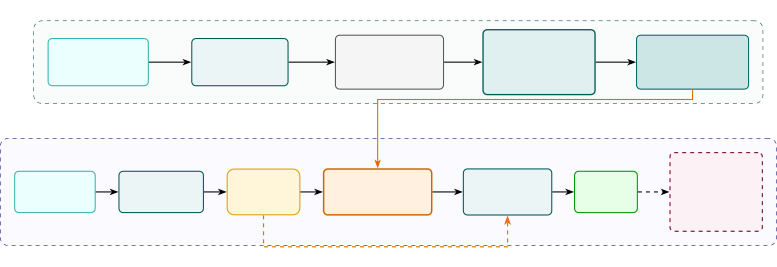

# Training-Free Instruction TTS Gender Bias Calibration Using Model-Adaptive Steering

Kuan-Yu Chen     Yi-Cheng Lin     Jeng-Lin Li     Jian-Jiun Ding
^(†)^(†)thanks: \*Code is available at
[https://github.com/DanielChen1128/ITTS-Debias](https://github.com/DanielChen1128/ITTS-Debias)

###### Abstract

Instruction text-to-speech (ITTS) systems systematically encode acoustic
gender skews from descriptive style prompts, such as occupations or
personas, even when demographic attributes are left unspecified.
Calibrating the implicit gender distribution of the synthesized voices,
across heterogeneous architectures and without model retraining or
overriding explicit user prompts, is an open problem. In this work, we
propose model-adaptive steering, a training-free bias calibration method
that steers post-encoder conditioning representations using a group
deviation vector paired with a coarse-to-fine strength search on a
development set. A deterministic lexical gate bypasses intervention
whenever explicit gender keywords are detected, preserving intended
prompt semantics. Evaluated on a 12,800-prompt held-out benchmark across
four ITTS models (three architectures), the proposed method reduces
aggregate calibration error from 11.5–28.1 to 0.8–5.9 percentage points
(e.g., shifting Parler-TTS Mini from 78.1% and PromptTTS++ from 27.3%
female to 50.8–52.4%). Output rates stay within 0.9 pp across anchor set
sizes at fixed operating points, while UTMOS decreases by at most 0.08
and WER degrades by at most 3.3 pp.

###### Index Terms: 

instruction text-to-speech, demographic fairness, latent steering,
representation calibration, training-free debiasing

^(†)^(†)address: ¹AI Research Center, Inventec Corporation, Taiwan  
²Graduate Institute of Communication Engineering, National Taiwan
University, Taiwan

## 1 Introduction

Instruction text-to-speech (ITTS) enables open-ended natural language
control over speaker persona, prosody, and acoustic environments,
supporting applications from voice assistants to personalized audiobook
synthesis \[6, 24\]. Recent advances have explored ITTS under diverse
architectural paradigms, including autoregressive language
models \[14\], non-autoregressive acoustic generators \[18\], and hybrid
dual-stream architectures \[25\]. Despite their impressive synthesis
quality and stylistic fidelity, these systems exhibit persistent
demographic biases. When prompts lack explicit demographic constraints,
career, status, or persona attributes, such as “experienced software
engineer” or “gentle kindergarten teacher”, can induce skewed acoustic
gender profiles \[4, 9\]. Left unmitigated, such implicit defaults risk
reinforcing societal stereotypes in downstream deployments.

Although demographic bias has been widely investigated in text
processing and speech-related tasks, including automatic speech
recognition, speech emotion recognition, and self-supervised
representation learning \[8, 20, 12, 11, 21, 13\], bias mitigation in
generative instruction-guided speech synthesis remains comparatively
underexplored. Recently, activation steering has emerged as a
training-free mechanism for controlling the model behavior, first in
language models \[22, 16, 26\] and more recently for explicit acoustic
attributes such as emotion and accent \[23, 19\]. However, existing
frameworks steer individual generations toward an explicitly specified
attribute, rather than calibrating the aggregate demographic
distribution induced by prompts that specify no attribute at all.
Naively applying continuous latent shifts also raises two concerns that
our design anticipates: overly large offsets may degrade acoustic
quality, while indiscriminate steering may override explicitly specified
demographic attributes. A training-free intervention that reduces
demographic disparities while preserving acoustic fidelity and the user
intent thus remains an open challenge.

In this work, we propose model-adaptive steering, a training-free bias
calibration method that estimates a separate deviation direction and
operating point at each model’s own post-encoder conditioning interface.
Our approach is based on the assumption that demographic bias manifests
as a directional skew in that conditioning space. We estimate an
empirical group deviation vector from paired counterfactual anchors to
offset the implicit demographic skew and steer the resulting output
distribution toward parity. It operates on those representations
directly, without parameter-efficient adaptation or model
retraining \[5, 10\]. To mitigate localized demographic saturation under
complex semantic combinations, we partition the prompt space into
descriptor-type strata \[4\] and formulate a joint fairness objective
across these strata, identifying an operating point $`\theta^{*}`$ that
avoids stratum saturation through coarse-to-fine grid search. Finally, a
deterministic lexical gate bypasses intervention on gender-specified
inputs, activating steering only on prompts without explicit gender
keywords. Across a 12,800-prompt held-out test benchmark, our method
substantially reduces demographic disparities across prompt strata at a
small utility cost. The main contributions of this work are summarized
as follows:

- •
  Training-Free and Model-Adaptive Steering: A single inference-time
  intervention, instantiated at each model’s own conditioning interface,
  calibrates gender output rates across three conditioning layouts
  (token-level, pooled style, dual-stream) without updating generator
  parameters or adding adapters.
- •
  Multi-Stratum Operating-Point Calibration: A joint objective over
  overall and stratum-wise disparities, combined with a saturation
  filter, prevents the single-gender collapse that aggregate parity
  alone admits.
- •
  Bias and Utility Evaluation: Aggregate calibration error drops from
  11.5–28.1 to 0.8–5.9 pp across four models, significant against every
  baseline, at a small utility cost (UTMOS $`\leq`$0.08, WER $`\leq`$3.3
  pp).



Figure 1: Two-stage calibration and inference framework. Stage 1
estimates the group deviation vector $`\mathbf{d}`$ from anchor pairs
$`\mathcal{A}_{N}`$ and identifies the operating point $`\theta^{*}`$ on
$`\mathcal{D}_{\mathrm{dev}}`$ via coarse-to-fine search (Sec. 2.2).
Stage 2 shifts post-encoder conditioning representations $`\mathbf{H}`$
prior to acoustic decoding, where a deterministic lexical gate bypasses
steering whenever explicit gender keywords are detected.

## 2 Method

### 2.1 Group Deviation Estimation

Let $`M`$ denote a frozen ITTS generator that samples speech
$`y\sim M(x,c)`$ from an instruction prompt $`x`$ and transcript $`c`$
under fixed seeds. As shown in Fig. 1, the text encoder $`E`$ maps
$`(x,c)`$ to intermediate conditioning
$`\mathbf{H}(x,c)=[\mathbf{h}_{1},\dots,\mathbf{h}_{T}]\in\mathbb{R}^{T\times D}`$
with attention mask $`a_{t}\in\{0,1\}`$. Parler-TTS and PromptTTS++
encode only $`x`$; VoxInstruct encodes $`x`$ and $`c`$ jointly.

Because different ITTS architectures have distinct representations and
native demographic skews, estimation is performed per model. Let
$`\mathcal{A}_{N}=\{(x_{j}^{F},x_{j}^{M},c_{j})\}_{j=1}^{N}`$ denote
$`N`$ counterfactual anchor pairs sharing identical templates and
transcripts but differing solely in explicit gender descriptors (e.g.,
$`x_{j}^{F}=`$ “A woman speaking with a warm tone” vs. $`x_{j}^{M}=`$ “A
man speaking with a warm tone” paired with identical text $`c_{j}`$).
Anchors are disjoint from the test set (Sec. 3.1). Via masked mean
pooling over tokens, each sequence is aggregated into

```math
\mathbf{z}(x,c)=\frac{\sum_{t=1}^{T}a_{t}\mathbf{h}_{t}}{\sum_{t=1}^{T}a_{t}}. \tag{1}
```

From these paired representations, we compute the model-specific group
deviation vector:

```math
\mathbf{d}=\frac{1}{N}\sum_{j=1}^{N}\left[\mathbf{z}(x_{j}^{M},c_{j})-\mathbf{z}(x_{j}^{F},c_{j})\right]. \tag{2}
```

Thus, $`\mathbf{d}\in\mathbb{R}^{D}`$ reflects the average
female-to-male representation shift, where positive (negative) steering
drives features toward male (female) acoustic profiles. Here
$`\mathbf{d}`$ provides an operational steering direction rather than a
theoretical disentanglement of gender from correlated semantic
attributes. Steering with strength $`\alpha\in\mathbb{R}`$ shifts every
unmasked token:

```math
\mathbf{h}^{\prime}_{t}=\mathbf{h}_{t}+g(x)\,a_{t}\,\alpha\,\mathbf{d}, \tag{3}
```

where the lexical gate $`g(x)=0`$ if $`x`$ contains a term in
$`\mathcal{V}_{\text{gender}}`$ (Sec. 2.3) and $`g(x)=1`$ otherwise.
$`M(x,c;\alpha)`$ denotes the generator decoding from
$`\mathbf{H}^{\prime}`$, thus $`\alpha=0`$ recovers $`M`$.

|              |                                          |                                |           |           |           |           |           |                                       |                        |                        |                    |                    |
| ------------ | ---------------------------------------- | ------------------------------ | --------- | --------- | --------- | --------- | --------- | ------------------------------------- | ---------------------- | ---------------------- | ------------------ | ------------------ |
|              |                                          | Female Classification Rate (%) |           |           |           |           |           | Calibration Error (pp) $`\downarrow`$ |                        |                        | Utility            |                    |
| Model        | Setting                                  | All                            | Status    | Career    | Persona   | 2-axis    | 3-axis    | $`E_{\mathrm{agg}}`$                  | $`E_{\mathrm{macro}}`$ | $`E_{\mathrm{worst}}`$ | UTMOS $`\uparrow`$ | WER $`\downarrow`$ |
| Parler-Mini  | Original                                 | $`78.11`$                      | $`82.00`$ | $`79.42`$ | $`76.92`$ | $`78.77`$ | $`77.71`$ | $`28.11`$                             | $`28.97`$              | $`32.00`$              | $`3.8346`$         | $`0.1826`$         |
|              | Neutral                                  | $`86.07`$                      | 76.00     | $`85.08`$ | $`88.13`$ | $`85.26`$ | $`85.45`$ | $`36.07`$                             | $`33.98`$              | $`38.13`$              | $`3.9021`$         | $`0.1314`$         |
|              | LEACE$`{}_{\text{pb}}`$ ($`\beta=1.00`$) | 74.84                          | $`77.00`$ | 83.08     | 67.33     | 78.03     | 74.13     | 24.84                                 | 25.91                  | 33.08                  | $`3.8512`$         | $`0.1419`$         |
|              | Ours ($`\alpha=2.5`$)                    | 52.43                          | 51.00     | 56.62     | 46.79     | 54.94     | 53.55     | 2.43                                  | 3.86                   | 6.62                   | $`3.8059`$         | $`0.1413`$         |
| Parler-Large | Original                                 | $`74.83`$                      | $`53.00`$ | $`88.46`$ | $`85.69`$ | $`63.99`$ | $`61.29`$ | $`24.83`$                             | $`20.49`$              | $`38.46`$              | $`3.5362`$         | $`0.2487`$         |
|              | Neutral                                  | $`79.51`$                      | 62.00     | $`92.92`$ | $`84.58`$ | $`72.19`$ | $`69.77`$ | $`29.51`$                             | $`26.29`$              | $`42.92`$              | $`3.2827`$         | $`0.3224`$         |
|              | LEACE$`{}_{\text{pb}}`$ ($`\beta=0.50`$) | 75.39                          | $`68.00`$ | 90.00     | 83.68     | 65.87     | 62.45     | 25.39                                 | 24.00                  | 40.00                  | $`3.5427`$         | $`0.2403`$         |
|              | Ours ($`\alpha=2.0`$)                    | 51.31                          | 36.00     | 71.81     | 61.05     | 39.84     | 33.84     | 1.31                                  | 14.64                  | 21.81                  | $`3.4601`$         | $`0.2813`$         |
| PromptTTS++  | Original                                 | $`27.28`$                      | $`0.00`$  | $`53.15`$ | $`18.95`$ | $`24.10`$ | $`20.13`$ | $`22.72`$                             | $`28.00`$              | $`50.00`$              | $`3.6751`$         | $`0.0064`$         |
|              | Neutral                                  | $`38.92`$                      | $`4.00`$  | $`77.77`$ | 39.54     | $`26.81`$ | $`18.81`$ | $`11.08`$                             | $`27.72`$              | $`46.00`$              | $`3.6328`$         | $`0.0039`$         |
|              | LEACE$`{}_{\text{pb}}`$ ($`\beta=0.50`$) | 58.20                          | 12.00     | 63.12     | $`69.33`$ | 51.84     | 47.90     | 8.20                                  | 14.88                  | 38.00                  | $`3.7247`$         | $`0.0077`$         |
|              | Ours ($`\alpha=-0.25`$)                  | 50.80                          | 41.00     | 56.88     | 51.15     | 48.94     | 47.45     | 0.80                                  | 4.13                   | 9.00                   | $`3.5999`$         | $`0.0130`$         |
| VoxInstruct  | Original                                 | $`61.47`$                      | $`58.00`$ | $`61.37`$ | $`65.18`$ | $`62.23`$ | $`56.26`$ | $`11.47`$                             | $`10.61`$              | $`15.18`$              | $`2.2949`$         | $`0.3178`$         |
|              | Neutral                                  | 56.81                          | 45.00     | $`67.85`$ | $`65.67`$ | 50.52     | 43.10     | 6.81                                  | 9.19                   | $`17.85`$              | $`2.3671`$         | $`0.5253`$         |
|              | LEACE$`{}_{\text{pb}}`$ ($`\beta=0.75`$) | $`61.87`$                      | $`64.00`$ | 60.88     | 64.02     | $`63.32`$ | $`58.48`$ | $`11.87`$                             | $`12.14`$              | 14.02                  | $`2.2825`$         | $`0.2778`$         |
|              | Ours (AR/NAR: 4, 3)                      | 55.86                          | 56.00     | 55.31     | 60.92     | 55.23     | 50.58     | 5.86                                  | 5.61                   | 10.92                  | $`2.2925`$         | $`0.2952`$         |

Table 1: Held-out evaluation ($`12{,}800`$) across prompt strata and
calibration errors. Error metrics are reported in percentage points
(pp), with $`p_{F}`$ in % ($`E_{\mathrm{agg}}`$ weights strata by size;
$`E_{\mathrm{macro}}`$ weights them equally):
$`E_{\mathrm{agg}}=|p_{F}-50|`$,
$`E_{\mathrm{macro}}=\frac{1}{5}\sum_{s}|p_{F,s}-50|`$, and
$`E_{\mathrm{worst}}=\max_{s}|p_{F,s}-50|`$ ($`\downarrow`$ lower is
better). Speech utility (UTMOS $`\uparrow`$, WER $`\downarrow`$) is
evaluated on a shared 500-prompt test subset (WER as a fraction). 95%
bootstrap CI half-widths: $`\leq`$0.88 pp (All), $`\leq`$2.00 pp
($`E_{\mathrm{macro}}`$); 7 utterances $`<`$0.1 s are excluded. Test
strata hold 100/2,600/3,900/3,100/3,100 prompts, thus status-driven
$`E_{\mathrm{worst}}`$ carries $`\pm`$9.8 pp. All representation-based
methods are fitted on the same 2,500 anchor pairs. Bold denotes the best
debiasing result within each model; underline denotes the second best
(Original serves as the unmitigated baseline).

### 2.2 Coarse-to-Fine Steering Strength Search

Steering strength is calibrated exclusively on the 500-item development
set $`\mathcal{D}_{\text{dev}}`$, holding the deviation vector
$`\mathbf{d}`$ ($`N=2{,}500`$) frozen. We group prompts into five strata
$`\mathcal{S}`$ by descriptor type: status, career, persona, and
two-/three-axis prompts combining two or three of these;
$`\mathcal{D}_{\text{dev}}`$ holds 100 items $`\mathcal{D}_{s}`$ per
stratum $`s`$. Let $`y_{i}(\theta)\sim M(x_{i},c_{i};\theta)`$ and
$`G(y)\in\{0,1\}`$ denote the binary acoustic-gender proxy
($`1=\text{female}`$, Eq. (7)). The steering strength is
$`\theta=\alpha`$ for single-stream models and
$`\theta=(\alpha_{\mathrm{AR}},\alpha_{\mathrm{NAR}})`$ for dual-stream
VoxInstruct. We monitor overall and stratum-wise female classification
rates:

```math
\begin{split}p_{F}(\theta)&=\frac{1}{|\mathcal{D}_{\text{dev}}|}\sum_{i\in\mathcal{D}_{\text{dev}}}\mathbb{I}[G(y_{i}(\theta))=1],\\
p_{F,s}(\theta)&=\frac{1}{|\mathcal{D}_{s}|}\sum_{i\in\mathcal{D}_{s}}\mathbb{I}[G(y_{i}(\theta))=1],\quad\forall s\in\mathcal{S}.\end{split} \tag{4}
```

To avoid single-gender collapse, candidates causing stratum saturation
($`p_{F,s}(\theta)\in\{0,1\}`$) are discarded. Remaining configurations
are evaluated by minimizing the joint parity objective:

```math
J(\theta)=|p_{F}(\theta)-0.5|+\frac{1}{|\mathcal{S}|}\sum_{s\in\mathcal{S}}|p_{F,s}(\theta)-0.5|. \tag{5}
```

The first term alone would let opposite stratum errors cancel; the
second penalizes them individually. Rates are fractions in (4)–(5) and
percentages in Tables 1–3.

As discrete proxy classifications render $`J(\theta)`$
non-differentiable, candidate configurations are optimized via
coarse-to-fine grid search. We first evaluate a broad coarse grid
$`\Theta_{\text{coarse}}`$ to bound the parity region, followed by an
optional evaluation of finer candidates $`\Theta_{\text{refine}}`$
within that region.

For the three single-stream models, we evaluate coarse candidates
$`\Theta_{\text{coarse}}=\{0,\allowbreak\pm 1.0,\allowbreak\pm 1.5,\allowbreak\pm 2.0,\allowbreak\pm 2.5\}`$.
For PromptTTS++, coarse screening is followed by the refinement set
$`\Theta_{\text{refine}}=\{-0.375,\allowbreak-0.300,\allowbreak-0.250,\allowbreak-0.200,\allowbreak-0.125\}`$.
For VoxInstruct, we search a coarse $`4\times 4`$ grid with
$`(\alpha_{\mathrm{AR}},\alpha_{\mathrm{NAR}})\in\{0,2,4,6\}\times\{0,1,2,3\}`$.
Ties in $`J(\theta)`$ are broken by selecting the parameter with the
lowest worst-case stratum deviation
$`E_{\mathrm{worst}}(\theta)=\max_{s}|p_{F,s}(\theta)-0.5|`$, followed
by the minimal parameter norm $`\|\theta\|_{2}`$. The result is frozen
as the calibrated operating point $`\theta^{*}`$ and evaluated unchanged
on the held-out test data.

### 2.3 Inference-Time Conditional Feature Intervention

During inference, a deterministic lexical gate first scans prompt $`x`$
via case-insensitive word-boundary matching against gender lexicon
$`\mathcal{V}_{\text{gender}}`$ (male, female, man, woman, boy, girl).
Detecting any keyword $`w\in\mathcal{V}_{\text{gender}}`$ sets
$`g(x)=0`$ and bypasses intervention, preserving explicit user intent.
For unspecified prompts, (3) is applied with the operating point
$`\theta^{*}`$ at each generator’s own conditioning interface:

Token-Level (Parler-TTS): (3) with $`\alpha=\alpha^{*}`$, applied prior
to acoustic cross-attention.

Global Style (PromptTTS++): (3) with $`\alpha=\alpha^{*}`$ and $`T=1`$,
applied to the pooled style embedding.

Dual-Stream (VoxInstruct): Applied independently to the autoregressive
(AR) and non-autoregressive (NAR) conditioning streams, using separate
deviation vectors
$`(\mathbf{d}_{\mathrm{AR}},\mathbf{d}_{\mathrm{NAR}})`$ (each via (2))
and operating point
$`(\alpha_{\mathrm{AR}}^{*},\alpha_{\mathrm{NAR}}^{*})`$:

```math
\mathbf{h}^{\prime}_{k,t}=\mathbf{h}_{k,t}+g(x)\,a_{k,t}\,\alpha_{k}^{*}\mathbf{d}_{k},\hskip 20.00003ptk\in\{\mathrm{AR},\mathrm{NAR}\}. \tag{6}
```

In all settings, generator parameters remain frozen; we modify only the
conditioning features at inference.

### 2.4 Baselines and Evaluation Metrics

Parameter-Update-Free Baselines. Under identical data splits, we
benchmark against two training-free controls: (i) a prompt-level
baseline (Neutral) appending “The speaker’s gender is unspecified; do
not infer it from occupation or persona”, and (ii) a
representation-level baseline, LEACE$`{}_{\text{pb}}`$, applying
LEACE \[2\] to pooled features,
$`\mathbf{z}^{\prime}=(1-\beta)\mathbf{z}+\beta T_{\mathrm{LEACE}}(\mathbf{z})`$,
with $`\mathbf{z}^{\prime}-\mathbf{z}`$ broadcast to tokens as in (3);
LEACE is fitted on pooled anchor features and gender labels, and
$`\beta\in[0,1]`$ is tuned via (5).

Acoustic Proxy Classifier. Acoustic gender is assessed via a pretrained
wav2vec 2.0 classifier \[1, 3\] yielding logits $`(q_{F},q_{M},q_{C})`$.
Following established audit protocols \[4, 9\], we derive binary proxy
predictions while excluding child logit $`q_{C}`$:

```math
G(y)=\mathbb{I}\left(q_{F}(y)\geq q_{M}(y)\right). \tag{7}
```

Utterances whose top class is child are thus still labeled F or M.
$`G(y)`$ serves strictly as an automated acoustic proxy for synthetic
output distributions rather than ground-truth speaker identity.

Speech Utility Measures. To assess potential utility trade-offs,
acoustic naturalness is measured via UTMOS22 \[17\], and transcription
intelligibility via Word Error Rate (WER) using Whisper-large-v3 \[15\].

Statistical and Diagnostic Analyses. 95% confidence intervals (CIs) come
from a stratified bootstrap \[7\] over test prompts (10,000 resamples);
setting differences use a paired bootstrap, and utility changes a paired
Wilcoxon signed-rank test. For each descriptor with $`\geq`$10 prompts
(multi-axis prompts count toward each component), we compute its female
rate and report Spearman’s $`\rho`$ between Original and steered rates,
its noise ceiling from binomial redraws, and the standard deviation
(s.d.) of rates. We also report the fraction of outputs with binary
posterior $`P_{F}=\sigma(q_{F}-q_{M})\in[0.4,0.6]`$.

## 3 Experiments

(a) Coarse Grid Search ($`\alpha\in[-2.5,2.5]`$)

| Model        | $`-2.5`$ | $`-2.0`$ | $`-1.5`$ | $`-1.0`$ | $`0.0`$ | $`1.0`$ | $`1.5`$ | $`2.0`$  | $`2.5`$  |
| ------------ | -------- | -------- | -------- | -------- | ------- | ------- | ------- | -------- | -------- |
| Parler-Mini  | 96.8     | 96.6     | 94.4     | 90.6     | 78.6    | 66.2    | 62.4    | 55.0     | 53.2^(∗) |
| Parler-Large | 89.0     | 86.8     | 84.4     | 83.4     | 73.4    | 65.8    | 59.2    | 51.0^(∗) | 44.4     |
| PromptTTS++  | 99.6     | 100.0    | 100.0    | 100.0    | 26.2    | 0.0     | 0.0     | 0.0      | 0.0      |

(b) PromptTTS++ Local Refinement Grid  
$`\alpha`$ $`-0.375`$ $`-0.300`$ $`\mathbf{-0.250^{*}}`$ $`-0.200`$
$`-0.125`$ Female (%) 67.6 56.6 48.6 41.0 33.8

(c) VoxInstruct Dual-Stream Grid
($`\alpha_{\mathrm{AR}}\times\alpha_{\mathrm{NAR}}`$)  
$`\alpha_{\mathrm{AR}}\;\backslash\;\alpha_{\mathrm{NAR}}`$
$`\mathbf{0}`$ $`\mathbf{1}`$ $`\mathbf{2}`$ $`\mathbf{3}`$
$`\mathbf{0}`$ 63.4 63.4 63.2 63.6 $`\mathbf{2}`$ 62.6 63.0 62.4 62.4
$`\mathbf{4}`$ 60.2 59.6 59.8 59.4^(∗) $`\mathbf{6}`$ 61.4 60.8 60.8
60.8

Table 2: Female classification rates (%) on the 500-item development
set. Bold with an asterisk (\*) indicates the selected operating point
$`\theta^{*}`$.

|              |                      |       |       |                 |
| ------------ | -------------------- | ----- | ----- | --------------- |
|              | Anchor Pairs ($`N`$) |       |       |                 |
| Model        | 500                  | 1,500 | 2,500 | $`\Delta`$ (pp) |
| Parler-Mini  | 52.60                | 52.82 | 52.43 | 0.39            |
| Parler-Large | 52.00                | 52.19 | 51.31 | 0.88            |
| PromptTTS++  | 51.20                | 50.50 | 50.80 | 0.70            |
| VoxInstruct  | 56.30                | 56.06 | 55.86 | 0.44            |

Table 3: Sensitivity of female classification rates (%) to anchor pair
count $`N`$ on the held-out test set ($`12{,}800`$). Calibrated
operating points $`\theta^{*}`$ remain fixed. $`\Delta`$ denotes the
maximum percentage point variation across pair counts.

### 3.1 Experimental Setup and Evaluation Protocol

Our benchmark comprises 13,300 instruction prompts partitioned into a
500-item development set ($`\mathcal{D}_{\text{dev}}`$) and a
12,800-item test set. The development set is balanced across the five
strata (Sec. 2.2; 100 prompts each). The held-out test partition
contains the remaining 100 status, 2,600 career, 3,900 persona, 3,100
two-axis, and 3,100 three-axis prompts. This division enforces strict
prompt-ID disjointness between calibration and evaluation, although
lexical descriptors and templates originate from the shared benchmark
inventory. Across all evaluated systems, generation seeds, target
transcripts, and batching configurations are held constant to ensure
identical synthesis conditions across interventions.

Both model-adaptive steering and LEACE$`{}_{\text{pb}}`$ are fitted on
the same 2,500 paired anchors: 500 derive from
$`\mathcal{D}_{\text{dev}}`$ prompts, extended with self-constructed
pairs to 1,500 and 2,500. Calibration parameters ($`\theta^{*}`$ and
$`\beta^{*}`$) are optimized exclusively on $`\mathcal{D}_{\text{dev}}`$
and frozen prior to generating and evaluating the 12,800 held-out test
prompts, preventing data leakage. Acoustic gender proxy classifications
follow the evaluation setup in Sec. 2.4, and speech utility metrics
(UTMOS and WER) are evaluated as absolute means on the same 500 test
prompts for all settings.

### 3.2 Operating-Point Calibration

As shown in Table 2, unmitigated models ($`\alpha=0`$) display
pronounced, architecture-dependent baseline skews on the development
set: Parler-Mini and Parler-Large heavily favor female classifications,
whereas PromptTTS++ skews toward male. Calibration via (5) counteracts
these polarities while avoiding stratum saturation. VoxInstruct starts
at 63.4%. The selected points bring Parler-Mini, Parler-Large, and
PromptTTS++ to 53.2%, 51.0%, and 48.6%, and VoxInstruct to 59.4% at
$`(\alpha_{\mathrm{AR}}^{*},\alpha_{\mathrm{NAR}}^{*})=(4,3)`$;
Parler-Mini and $`\alpha_{\mathrm{NAR}}^{*}`$ sit at their grid edges.
In our runs the stratum term never altered the selected point; its
operative role was discarding saturated candidates.
LEACE$`{}_{\text{pb}}`$ weights $`\beta^{*}`$ (Table 1) are selected
with the same objective.

### 3.3 Held-Out Evaluation and Robustness Analysis

Debiasing Efficacy Across Architectures. As reported in Table 1,
model-adaptive steering substantially reduces calibration errors across
all four systems on the held-out test partition. Aggregate error
($`E_{\mathrm{agg}}`$) drops from 11.47–28.11 to 0.80–5.86 percentage
points (pp), while consistently attaining the lowest point-estimate
errors across macro ($`E_{\mathrm{macro}}`$) and worst-stratum
($`E_{\mathrm{worst}}`$) metrics. Paired bootstrap CIs of the
$`E_{\mathrm{macro}}`$ reduction exclude zero for all four models, both
against Original and against the best baseline. In contrast, appending
neutrality instructions exacerbates female skew in Parler models. While
LEACE$`{}_{\text{pb}}`$ lowers aggregate error in PromptTTS++
($`E_{\mathrm{agg}}=8.20`$ pp), it under-corrects status (12.00% female)
while shifting persona to 69.33%.

Anchor-Count Sensitivity. Table 3 evaluates sensitivity to anchor subset
size ($`N\in\{500,1{,}500,2{,}500\}`$) at fixed operating points.
Downstream female classification rates vary within narrow margins across
the tested nested anchor subsets, with the maximum shift across counts
($`\Delta`$) bounded within 0.88 pp across all systems. Though based on
one nested sequence per model, this suggests direction estimation is
robust to anchor reduction.

### 3.4 Stratum-Level Consistency and Speech Utility

Stratum-Level Parity Breakdown. Aggregate balance does not ensure
uniform calibration across strata. Our method keeps
$`E_{\mathrm{worst}}`$ within 6.62–10.92 pp except for Parler-Large.
Parler-Large retains $`E_{\mathrm{worst}}=21.81`$ pp in career,
consistent with its large baseline spread (38.46 pp), which a single
global offset mitigates but cannot eliminate.

Descriptor-Level Analysis. Spearman’s $`\rho`$ between Original and
steered descriptor rates is 0.91–0.92 for Parler (binomial noise ceiling
0.93–0.95), 0.69 for PromptTTS++ (0.98), and 0.82 for VoxInstruct. The
mean descriptor rate moves toward 50% in every model, yet the s.d.
across descriptors widens for both Parler models (13.9$`\to`$17.8,
18.1$`\to`$25.5 pp), narrows for PromptTTS++ (32.6$`\to`$10.6), and is
flat for VoxInstruct: a global offset can widen descriptor spread.

Classifier Posterior. The fraction of ambiguous outputs
($`P_{F}\in[0.4,0.6]`$) is 2.7% under Original and 3.4% under steering
(mean over models). Parity thus reflects a mix of clearly female and
clearly male voices rather than ambiguous outputs.

Speech Utility Evaluation. On this 500-prompt subset (Table 1),
objective speech utility shifts remain modest. Relative to Original,
UTMOS decreases by at most 0.076, and WER ranges from $`-4.13`$ pp
(Parler-Mini) to $`+3.26`$ pp (Parler-Large). LEACE$`{}_{\text{pb}}`$
attains higher UTMOS on three of four models and lower WER on three of
four; our method trades this small utility cost for substantially lower
calibration error. Paired Wilcoxon tests find significant ($`p<0.05`$)
UTMOS changes for 1 of 4 models and WER changes for 2 of 4 (median
$`\Delta`$WER $`=0`$); perceptual evaluation is left for future work.

## 4 Conclusion

We presented model-adaptive steering, a training-free method to
calibrate acoustic gender output rates in frozen ITTS systems via
post-encoder conditioning offsets. Across 12,800 held-out prompts, it
reduces calibration errors across three conditioning layouts at a cost
of at most 0.08 UTMOS, attaining lower point-estimate errors than both
baselines. At fixed operating points, output rates stay within 0.9 pp
down to 500 anchor pairs. While Parler-Large and VoxInstruct retain
residual stratum disparities, our findings show that classifier-assigned
demographic outputs can be modulated via simple offsets in conditioning
space.

## Compliance with Ethical Standards

We highlight several ethical considerations and methodological
boundaries in this work. First, our evaluation operationalizes gender as
a binary construct ($`F/M`$) to interface with available pretrained
acoustic models and annotations; this engineering simplification does
not reflect the full, non-binary spectrum of human gender identity.
Second, our study examines perceived acoustic gender in isolation,
omitting intersecting demographic dimensions such as age, ethnicity, and
regional dialect. Third, all benchmarks, lexicons, and models are
strictly restricted to English, warranting caution when generalizing our
conclusions to languages with explicit grammatical gender or distinct
cultural associations. Finally, the automated classifier $`G(y)`$
functions strictly as an acoustic proxy to characterize statistical
skews across synthetic output distributions, and must not be interpreted
as assessing or validating true personal identities.

## References

- \[1\] A. Baevski, Y. Zhou, A. Mohamed, and M. Auli (2020) wav2vec 2.0:
  a framework for self-supervised learning of speech representations. In
  Proc. Advances in Neural Information Processing Systems (NeurIPS),
  Vol. 33, pp. 12449–12460. Cited by: §2.4.
- \[2\] N. Belrose, D. Schneider-Joseph, S. Ravfogel, R. Cotterell, E.
  Raff, and S. Biderman (2023) LEACE: perfect linear concept erasure in
  closed form. In Proc. Advances in Neural Information Processing
  Systems (NeurIPS), Vol. 36, pp. 66044–66063. Cited by: §2.4.
- \[3\] F. Burkhardt, J. Wagner, H. Wierstorf, F. Eyben, and B. W.
  Schuller (2023) Speech-based age and gender prediction with
  transformers. In Proc. ITG Conference on Speech Communication,
  pp. 46–50. Cited by: §2.4.
- \[4\] K.-Y. Chen et al. (2026) The binding effect: analyzing how
  multi-dimensional cues form gender bias in instruction TTS. arXiv
  preprint arXiv:2603.20743. Cited by: §1, §1, §2.4.
- \[5\] H. Gao, J. Ni, K. Qian, Y. Zhang, S. Chang, and M.
  Hasegawa-Johnson (2022) WavPrompt: towards few-shot spoken language
  understanding with frozen language models. In Proc. Interspeech, Cited
  by: §1.
- \[6\] Z. Guo, Y. Leng, Y. Wu, S. Zhao, and X. Tan (2023) PromptTTS:
  controllable text-to-speech with text descriptions. In Proc. IEEE
  ICASSP, pp. 1–5. Cited by: §1.
- \[7\] T. Hesterberg (2011) Bootstrap. Wiley Interdisciplinary Reviews:
  Computational Statistics 3 (6), pp. 497–526. Cited by: §2.4.
- \[8\] A. Koenecke et al. (2020) Racial disparities in automated speech
  recognition. Proceedings of the National Academy of Sciences 117 (14),
  pp. 7684–7689. Cited by: §1.
- \[9\] C.-Y. Kuan and H.-y. Lee (2025) Gender bias in
  instruction-guided speech synthesis models. In Proc. Findings of the
  Association for Computational Linguistics: NAACL, pp. 5402–5428. Cited
  by: §1, §2.4.
- \[10\] K.-J. Kwon, J.-H. So, and S.-H. Lee (2025) Parameter-efficient
  fine-tuning for low-resource text-to-speech via cross-lingual
  continual learning. In Proc. Interspeech, Cited by: §1.
- \[11\] Y.-C. Lin, H.-C. Chou, and H.-y. Lee (2025) Mitigating subgroup
  disparities in multi-label speech emotion recognition: a
  pseudo-labeling and unsupervised learning approach. In Proc.
  Interspeech, Cited by: §1.
- \[12\] Y.-C. Lin, H.-C. Chou, Y.-H. L. Liang, and H.-y. Lee (2025)
  Emo-debias: benchmarking gender debiasing techniques in multi-label
  speech emotion recognition. In Proc. IEEE Automatic Speech Recognition
  and Understanding Workshop (ASRU), pp. 1–8. Cited by: §1.
- \[13\] Y.-C. Lin, T.-Q. Lin, H.-C. Lin, A. T. Liu, and H.-y.
  Lee (2024) On the social bias of speech self-supervised models. In
  Proc. Interspeech, pp. 4638–4642. Cited by: §1.
- \[14\] D. Lyth and S. King (2024) Natural language guidance of
  high-fidelity text-to-speech with synthetic annotations. arXiv
  preprint arXiv:2402.01912. Cited by: §1.
- \[15\] A. Radford, J. W. Kim, T. Xu, G. Brockman, C. McLeavey, and I.
  Sutskever (2023) Robust speech recognition via large-scale weak
  supervision. In Proc. International Conference on Machine Learning
  (ICML), pp. 28492–28518. Cited by: §2.4.
- \[16\] N. Rimsky, N. Gabrieli, J. Schulz, M. Tong, E. Hubinger, and A.
  Turner (2024) Steering Llama 2 via contrastive activation addition. In
  Proc. Annual Meeting of the Association for Computational Linguistics
  (ACL), pp. 15504–15522. Cited by: §1.
- \[17\] T. Saeki, D. Xin, W. Nakata, T. Koriyama, S. Takamichi, and H.
  Saruwatari (2022) UTMOS: UTokyo-SaruLab system for VoiceMOS challenge 2022. In Proc. Interspeech, pp. 4521–4525. Cited by: §2.4.
- \[18\] R. Shimizu et al. (2024) PromptTTS++: controlling speaker
  identity in prompt-based text-to-speech using natural language
  descriptions. In Proc. IEEE ICASSP, pp. 12672–12676. Cited by: §1.
- \[19\] J. Sun et al. (2026) Activation steering for accent adaptation
  in large audio language models. arXiv preprint arXiv:2603.05813. Cited
  by: §1.
- \[20\] R. Tatman (2017) Gender and dialect bias in YouTube’s automatic
  captions. In Proc. ACL Workshop on Ethics in Natural Language
  Processing, pp. 53–59. Cited by: §1.
- \[21\] Y.-S. Tsai, Y.-C. Lin, H.-C. Chou, and H.-y. Lee (2025)
  Co-vada: a confidence-oriented voice augmentation debiasing approach
  for fair speech emotion recognition. In Proc. IEEE Automatic Speech
  Recognition and Understanding Workshop (ASRU), pp. 1–8. Cited by: §1.
- \[22\] A. M. Turner et al. (2023) Steering language models with
  activation engineering. arXiv preprint arXiv:2308.10248. Cited by: §1.
- \[23\] T. Xie, S. Yang, C. Li, D. Yu, and L. Liu (2025) EmoSteer-TTS:
  fine-grained and training-free emotion-controllable text-to-speech via
  activation steering. arXiv preprint arXiv:2508.03543. Cited by: §1.
- \[24\] D. Yang, S. Liu, R. Huang, C. Weng, and H. Meng (2024)
  InstructTTS: modelling expressive TTS in discrete latent space with
  natural language style prompt. IEEE/ACM Transactions on Audio, Speech,
  and Language Processing 32, pp. 2913–2925. Cited by: §1.
- \[25\] Y. Zhou et al. (2024) VoxInstruct: expressive human
  instruction-to-speech generation with unified multilingual codec
  language modelling. In Proc. ACM Int. Conf. Multimedia, pp. 554–563.
  Cited by: §1.
- \[26\] A. Zou et al. (2023) Representation engineering: a top-down
  approach to AI transparency. arXiv preprint arXiv:2310.01405. Cited
  by: §1.
