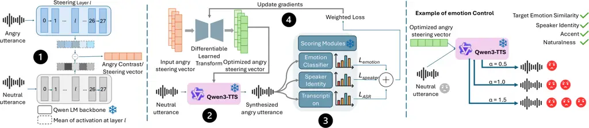
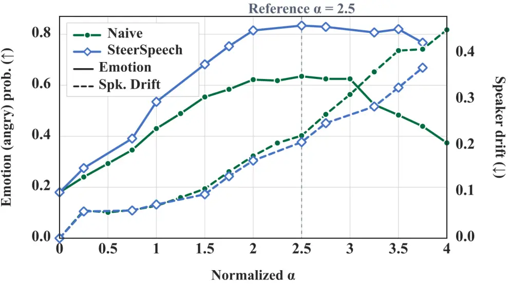

# SteerSpeech: Activation Steering for Emotion Control in generated speech

Afsara Benazir    Darius Pétermann    Felix Xiaozhu Lin    Salar Rahili
^(†)^(†)thanks: This work was performed while A.˜Benazir was an intern
at Netflix.

###### Abstract

Pretrained text-to-speech (TTS) models can generate expressive speech,
but reliable inference-time emotion control remains challenging: prompts
and reference audio offer coarse, inconsistent control, whereas
specialized conditioning and model adaptation require costly training.
We present SteerSpeech, a lightweight activation-steering framework that
controls emotion by injecting steering vectors into hidden activations.
For each target emotion we train a lightweight low-rank transform, using
a multi-expert objective that encourages monotonic emotion control while
preserving speaker identity and linguistic content, constraining
steering drift, and keeping the TTS backbone frozen. To optimize through
discrete speech tokens, we introduce a two-pass generation-and-replay
pipeline using a straight-through estimator to backpropagate expert
supervision through sampled tokens. At inference, a target-emotion
steering direction is optimized with its respective transform and
injected into the base TTS model. Objective and subjective evaluations
with Qwen3-TTS across seen, unseen, and accented speakers show stronger
continuous emotion control with limited speaker and content degradation.
SteerSpeech achieves 1.08$`\times`$–7.12$`\times`$ baseline
target-emotion scores and for a representative emotion subjectively, it
receives 78.1%–96.8% intensity preference and
1.43$`\times`$–1.46$`\times`$ speaker-identity preservation at high
steering strengths.

###### Index Terms: 

Text-to-speech, Emotion control, Speech synthesis, Activation steering

^(†)^(†)address: ¹University of Virginia  
²Netflix, Inc.



Figure 1: SteerSpeech overview.

## 1 Introduction

Modern text-to-speech (TTS) systems generate highly natural speech, yet
precise inference-time control of emotion remains challenging. Existing
approaches condition synthesis on emotion labels, reference speech,
natural-language descriptions, or prosodic controls \[12, 13, 5\]. Such
controls can be coarse or inconsistent, while introducing a specialized
encoder or adapting the TTS model for emotion controllability requires
computationally expensive training and substantial labeled data. A more
practical approach should enable downstream modification of attributes
such as emotion, accent, and speaking style without retraining the
underlying TTS model.

Activation steering \[17\] provides a lightweight alternative by
modifying a pretrained model’s intermediate representations using a
steering direction derived from the difference between mean of target
and neutral activations. Prior work applies this approach to emotional
speech synthesis: EmoSteer-TTS \[23\] derives steering directions by
identifying and modifying activation dimensions most relevant to the
target emotion, whereas EmoShift \[27\] transforms hidden
representations into emotion-specific steering directions through
learned mappings; EmoKnob \[3\] directly manipulates speaker embeddings.
However, the success of such intervention depends on how the steering
direction is constructed, where it is applied, and how strongly it is
injected. Steering directions may provide weak or unstable control,
capture unrelated properties, alter speaker identity, linguistic
content, or naturalness \[19\] and vary with the steering strength,
making continuous control difficult \[23\].

Our goal is to enable continuous and fine-grained inference-time control
of emotion in generated speech without retraining the TTS backbone or
altering other attributes such as accent and speaking style. Our key
insight is that reliable emotion steering requires more than
strengthening the target emotion: the steering direction should be
jointly guided by emotion, speaker, and transcription experts to
preserve identity and linguistic content.

To that end, we propose SteerSpeech, a lightweight framework that learns
a low-rank residual transform using multi-expert supervision enabled by
a two-pass generation-and-replay pipeline that backpropagates through
discrete speech tokens. Given a coarse emotion contrast, i.e. the
activation difference between target and neutral emotions, the transform
produces an optimized steering direction that strengthens the target
emotion while preserving other speech attributes. We jointly optimize
the transform across multiple steering strengths to encourage a
monotonic increase in emotion intensity while limiting unpredictable
behavior and off-target drift, all while keeping the TTS backbone
frozen. Our contributions are:

- •
  We introduce SteerSpeech, a lightweight activation-steering framework
  for fine-grained, continuous inference-time control of emotion in
  generated speech without retraining the underlying TTS model.
- •
  We learn a low-rank residual transform of emotion-steering directions
  using a multi-expert objective that explicitly promotes monotonic
  emotion control while preserving speaker identity, linguistic content,
  and speech quality.
- •
  We demonstrate through objective and subjective evaluations that
  SteerSpeech provides fine-grained emotion controllability compared to
  baselines and generalizes across seen, unseen, and accented speakers.

## 2 Background

Emotion control in TTS. Existing systems guide emotional expression
through conditioning signals at multiple levels. Categorical emotion
labels provide simple utterance-level control but represent emotion
using a small set of predefined classes \[14\]. Reference speech
transfers expressive characteristics from example speech \[21\], while
natural-language descriptions provide a more flexible interface for
specifying emotional style \[13\]. Finer control uses hierarchical
emotion distributions \[12\] or pitch and energy sketches for local
prosodic trajectories \[5\]. However, these methods often require
task-specific conditioning modules, joint TTS training, preference-based
fine-tuning \[10\], or substantial backbone adaptation, increasing
parameter and computational costs.

Activation steering for controllable emotion synthesis. Activation
steering \[17\] offers a lightweight mechanism for controlling a
pretrained model by modifying its hidden representations while keeping
the model parameters frozen. Given a hidden state $`h^{(l)}`$ at layer
$`l`$, a target-emotion direction is added with steering strength
$`\alpha`$:

```math
v_{e}^{(l)}=\bar{h}_{e}^{(l)}-\bar{h}_{n}^{(l)},\qquad\widetilde{h}^{(l)}=h^{(l)}+\alpha v_{e}^{(l)}, \tag{1}
```

where $`\bar{h}_{e}^{(l)}`$ and $`\bar{h}_{n}^{(l)}`$ denote the mean
target-emotion and neutral activations, averaged over all decoding
frames in respective utterances. Prior systems realize this intervention
differently: EmoSteer-TTS \[23\] uses neutral-to-emotion activation
differences, while EmoShift \[27\] uses learned emotion-specific
offsets. CoCoEmo \[20\] identifies effective steering sites and composes
mean-difference directions for single and mixed emotions, whereas
HE-Vector \[9\] constructs and combines emotion and dialect vectors in
model parameter space. In contrast, SteerSpeech uses explicit
multi-expert supervision for monotonic emotion intensity and attribute
preservation and learns a low-rank transform that optimizes a target
steering direction at an internal layer.

## 3 System Design

### 3.1 Overview

We propose SteerSpeech, a lightweight, plug-and-play framework that
learns to refine activation-steering directions for controllable emotion
synthesis.

Workflow, is illustrated in Fig. 1. For each target emotion, we train a
lightweight transform. Training consists of four steps:

extracting raw emotion contrasts from matched emotion and neutral
utterance pairs,

transforming the contrast and injecting it into a frozen speech
generator,

scoring the synthesized speech with frozen emotion, speaker, and
transcription experts, and

updating only the learned transform, $`T_{\theta}`$ using their weighted
objective function (Eq. 6). Except for $`T_{\theta}`$, all components of
the underlying speech generation pipeline remain frozen (Sec. 3.3).

Inference. Given a raw emotion contrast $`v_{e}`$ i.e., mean activation
difference between target-emotion and neutral utterances, $`T_{\theta}`$
takes $`v_{e}`$ as input and produces a refined steering direction.
Steering with $`T_{\theta}(v_{e})`$ produces progressively stronger
target emotion as the steering strength $`\alpha`$ increases, while
preserving speaker identity and linguistic content.

System Components. SteerSpeech consists of the following:

(1) Frozen speech generator. We use a pretrained autoregressive TTS
model conditioned on target text and reference speech that predicts
discrete speech tokens, which are subsequently decoded into waveform
audio. We steer at an intermediate hidden layer following insights from
\[20\].

(2) Low-rank learned transform. The transform is the only trainable
component: it normalizes a raw emotion contrast $`v_{e}`$ and applies a
rank-$`r`$ normalized-affine residual correction,

```math
\bar{v}_{e}=\frac{v_{e}}{\|v_{e}\|_{2}},\qquad q=\bar{v}_{e}+U(D\bar{v}_{e})+b,\qquad \tag{2}
```

where $`D\in\mathbb{R}^{r\times d}`$ and $`U\in\mathbb{R}^{d\times r}`$
parameterize the rank-$`r`$ correction, and $`b\in\mathbb{R}^{d}`$ is
the learned bias. With $`d=1024`$ and $`r=16`$, the transform contains
$`33{,}793`$ parameters per emotion. $`U(D\bar{v}_{e})`$ is linear:
$`D`$ is randomly initialized with orthonormal rows, while $`U`$ and
$`b`$ are zero-initialized, making the initial residual zero and
preserving the input direction. The corrected vector $`q`$ is normalized
and rescaled: $`q/\lVert q\rVert_{2}`$ sets the direction and $`s`$ the
magnitude, where $`s_{0}`$ is the median $`\ell_{2}`$-norm of input
contrasts and $`\eta`$ a learned scalar.

```math
s=s_{0}(1+\beta\tanh\eta),\qquad v_{e}^{\star}=T_{\theta}(v_{e})=s\left(\frac{q}{\lVert q\rVert_{2}}\right) \tag{3}
```

We set $`\beta=0.2`$, restricting the magnitude to within $`\pm 20\%`$
of the reference magnitude $`s_{0}`$, i.e.,
$`0.8s_{0}<\lVert T_{\theta}(v_{e})\rVert_{2}<1.2s_{0}`$. This allows
the transform to refine the steering direction while constraining large
changes in geometry and magnitude. The direction
$`\alpha v_{e}^{\star}`$ is injected at layer $`l`$, after which the
hidden-state norm is restored to its pre-injection value.

(3) Frozen expert scoring modules. We use three frozen expert models to
provide supervision: an emotion expert measures target-emotion strength,
a speaker expert assesses identity preservation relative to the
reference speech, and a transcription expert evaluates consistency with
the target text.

### 3.2 Learning Objective

We train the learned transform using complementary objectives for
emotion control, speaker preservation, and transcript preservation,
together with a regularization term that constrains changes to the
original steering vector.

Monotonic emotion supervision. A central goal of SteerSpeech is
continuous controllability: increasing the steering strength $`\alpha`$
should produce a corresponding increase in target-emotion intensity. We
therefore train over an ordered set of steering strengths
$`\alpha_{0}<\alpha_{1}<\cdots<\alpha_{K}`$.

Let $`\ell_{j}\equiv\ell(\alpha_{j})`$ denote the
target-emotion-versus-rest log-odds of speech generated at steering
strength $`\alpha_{j}`$. We encourage monotonicity by requiring the
increase in emotion score between adjacent steering strengths to be
proportional to the corresponding increase in $`\alpha`$:

```math
\mathcal{L}_{\mathrm{mono}}=\frac{1}{K}\sum_{j=0}^{K-1}\left[\kappa\Delta\alpha_{j}-\Delta\ell_{j}\right]_{+},
```

where $`\Delta\alpha_{j}=\alpha_{j+1}-\alpha_{j}`$,
$`\Delta\ell_{j}=\ell_{j+1}-\operatorname{sg}(\ell_{j})`$,
$`[z]_{+}=\max(0,z)`$, $`\kappa`$ controls the required increase in
emotion score per unit increase in steering strength, and
$`\operatorname{sg}(\cdot)`$ denotes stop-gradient. This hinge loss
encourages the desired ordering across steering strengths. However,
monotonic ordering alone admits a trivial solution in which the emotion
score increases with $`\alpha`$ while remaining weak at all operating
points. We therefore include a term, where $`p_{e}(\alpha_{\max})`$
denotes the target-emotion probability at the maximum strength and
$`\lambda`$ controls how strongly the model is encouraged to express the
target emotion:

```math
\mathcal{L}_{\mathrm{emotion}}=\mathcal{L}_{\mathrm{mono}}-\lambda\log p_{e}(\alpha_{\max}) \tag{4}
```

Speaker-preservation loss. To measure speaker changes introduced
specifically by steering, we use the corresponding unsteered generation
as a reference. We penalize deviations from the unsteered output’s
similarity to the reference speaker. Let $`e_{T}`$, $`e_{U}`$, and
$`e_{R}`$ denote the speaker embeddings of the steered output, unsteered
output, and reference speech, respectively. We define

```math
s_{T}=\cos(e_{T},e_{R}),\qquad s_{U}=\operatorname{sg}\!\left(\cos(e_{U},e_{R})\right),\qquad\mathcal{L}_{\mathrm{speaker}}=\left|s_{T}-s_{U}\right| \tag{5}
```

Transcript-preservation loss. Given generated audio $`x`$ and target
transcript tokens $`y_{1:T}`$, we use the differentiable teacher-forced
token negative log-likelihood,
$`\mathcal{L}_{\mathrm{ASR}}=\allowbreak-\frac{1}{T}\sum_{t=1}^{T}\allowbreak\log P(y_{t}\mid y_{<t},x).`$

Regularization loss. We constrain directional and magnitude drift with
$`\mathcal{L}_{\mathrm{reg}}=0.01\left[1-\cos(q,\bar{v}_{e})\right]+0.01\eta^{2}`$;
computed once per unique contrast vector after averaging per-row losses.

Combined learning objective. The per-sample losses are combined as
follows: the resulting objective is backpropagated only to the learned
steering transform.

```math
\mathcal{L}_{\mathrm{update}}=\mathcal{L}_{\mathrm{emotion}}+32\mathcal{L}_{\mathrm{speaker}}+0.2\mathcal{L}_{\mathrm{ASR}}+\mathcal{L}_{\mathrm{reg}} \tag{6}
```

|                    |          |                  |                   |                     |                   |                   |                  |                   |                     |                   |                   |                  |                   |                     |                   |                   |
| ------------------ | -------- | ---------------- | ----------------- | ------------------- | ----------------- | ----------------- | ---------------- | ----------------- | ------------------- | ----------------- | ----------------- | ---------------- | ----------------- | ------------------- | ----------------- | ----------------- |
|                    |          | Angry            |                   |                     |                   |                   | Happy            |                   |                     |                   |                   | Sad              |                   |                     |                   |                   |
| Method             | Subset   | Emo.$`\uparrow`$ | Top-1$`\uparrow`$ | Drift$`\downarrow`$ | WER$`\downarrow`$ | UTMOS$`\uparrow`$ | Emo.$`\uparrow`$ | Top-1$`\uparrow`$ | Drift$`\downarrow`$ | WER$`\downarrow`$ | UTMOS$`\uparrow`$ | Emo.$`\uparrow`$ | Top-1$`\uparrow`$ | Drift$`\downarrow`$ | WER$`\downarrow`$ | UTMOS$`\uparrow`$ |
| Emotion reference  | Pooled   | 0.617            | 0.775             | 0.189               | 4.9               | 4.077             | 0.333            | 0.394             | 0.172               | 2.4               | 4.131             | 0.033            | 0.019             | 0.158               | 6.0               | 4.256             |
| Naive              | Pooled   | 0.651            | 0.755             | 0.233               | 6.0               | 2.540             | 0.487            | 0.615             | 0.247               | 7.1               | 2.999             | 0.126            | 0.100             | 0.156               | 8.0               | 3.452             |
| SteerSpeech (ours) | Seen     | 0.848            | 0.942             | 0.188               | 6.1               | 3.209             | 0.589            | 0.825             | 0.268               | 8.0               | 3.211             | 0.255            | 0.283             | 0.191               | 8.8               | 3.503             |
|                    | Unseen   | 0.807            | 0.925             | 0.161               | 6.1               | 3.142             | 0.554            | 0.800             | 0.275               | 15.5              | 2.955             | 0.166            | 0.175             | 0.151               | 10.6              | 3.752             |
|                    | Accented | 0.824            | 0.975             | 0.252               | 2.3               | 2.980             | 0.302            | 0.425             | 0.208               | 4.7               | 4.146             | 0.246            | 0.250             | 0.192               | 4.2               | 3.513             |
|                    | Pooled   | 0.835            | 0.945             | 0.195               | 5.1               | 3.149             | 0.524            | 0.740             | 0.258               | 9.7               | 3.347             | 0.235            | 0.255             | 0.183               | 7.8               | 3.555             |

Table 1: End-to-end comparison across target emotions.

### 3.3 Methodology

Training $`T_{\theta}`$ is challenging because expert supervision is
available only after autoregressive generation and decoding, while
discrete codec-token sampling is non-differentiable; thus, gradients
from the emotion, speaker, and transcription experts cannot directly
propagate back to the transform.

We address this with a two-pass pipeline: (1) we extract
emotion-to-neutral activation differences from matched utterances and
transform each contrast using $`T_{\theta}`$; (2) in Pass 1, for each
contrast and steering strength $`\alpha`$, we inject the transformed
direction at layer $`l`$ and autoregressively sample discrete codec
tokens using standard inference; (3) in Pass 2, we replay the sampled
sequence with teacher forcing \[22\] and a straight-through estimator
(STE) \[2\], retaining the discrete codec tokens in the forward pass
while propagating gradients through their continuous representations,
which a differentiable decoder converts to waveforms; and (4) frozen
experts evaluate emotion intensity, speaker preservation, and transcript
consistency across multiple $`\alpha`$ values. This joint evaluation
encourages monotonic target-emotion increase while constraining speaker
and content drift. The combined loss in Eq. 6 updates only
$`T_{\theta}`$, while the TTS backbone, decoder, and experts remain
frozen. At inference, the expert evaluators and differentiable replay
path are removed.

## 4 results and analysis

### 4.1 Experimental Setup

Datasets. We use the English subset of the Emotional Speech Dataset
(ESD) \[26\], containing 350 parallel utterances per speaker from 10
native English speakers; Audio is sampled at 16 kHz and average duration
is 5-10 seconds. Evaluation covers (1) seen: unseen utterances from
in-domain speakers (2) unseen: an unseen speaker split with two held-out
English speakers, and (3) accented: cross-corpus generalization on four
non-native Mandarin speakers from L2-ARCTIC \[25\]. We reserve a
separate held-out speaker split for validation, distinct from the train
and test splits.

Models. We use Qwen3-TTS-0.6B \[11\], a popular TTS model with Qwen
language model backbone. Our rank-16 transform has 33K parameters. The
expert models used during training were emotion2vec for emotion
classification \[15\], WavLM for speaker verification \[4\], and Whisper
for ASR \[16\]. For evaluation, we used an XLSR-53-based emotion
classifier \[6\], ECAPA-TDNN for speaker verification \[7\], wav2vec 2.0
for ASR-based WER \[1\] and UTMOS \[18\] for speech-quality assessment.

Implementation Details. We use temperature $`0.9`$, top-$`k=50`$,
top-$`p=1.0`$, a fixed seed, and steer at layer 15. For monotonic
supervision, we use $`\alpha\in\{0.3,0.4,\ldots,1.0\}`$. The transform
is trained with AdamW (batch 32, learning rate $`10^{-3}`$, weight decay
$`10^{-4}`$, and 5% warmup with cosine decay). For evaluation, we
construct one global difference of means contrast per emotion from
held-out speakers and transform it using $`T_{\theta}`$.

Baselines. We compare against the following baselines: (1) Emotion
reference: generates emotional speech using a reference emotional
utterance as conditioning signal \[24\] (2) Naive difference-of-means
(or Naive): Constructs a steering direction by subtracting the mean
neutral representation from the mean representation of the target
emotion. (3) SteerSpeech (ours): Our system, evaluated on the three
splits described above: seen, unseen and accented. We report both
split-level and pooled performance. Additional baselines were omitted
because they require model-specific reimplementation and cross-paper
results are not directly comparable.

Evaluation Metrics. Objective metrics include (1) Emotion confidence
($`\uparrow`$) (2) Top-1 accuracy ($`\uparrow`$), the percentage of
samples classified as the target emotion (3) Speaker drift
($`\downarrow`$) calculated as how much the steered speech deviates from
the unsteered synthesized speech to account for any model bias and (4)
Word error rate (WER) ($`\downarrow`$) between synthesized speech
transcript and reference text and (5) UTMOS ($`\uparrow`$), predicted
mean opinion score (MOS) assessing the naturalness of synthesized
speech. Subjective metrics include (1) emotion preference (2) speaker-ID
preference, and (3) naturalness in Survey 1; and (1) speaker-ID
preservation and (2) perceived emotion increase in Survey 2. All
subjective metrics are $`\uparrow`$.

|                                     |                                 |                                    |                          |
| ----------------------------------- | ------------------------------- | ---------------------------------- | ------------------------ |
| Comparison                          | Emotion preference $`\uparrow`$ | Speaker ID preference $`\uparrow`$ | Naturalness $`\uparrow`$ |
| SteerSpeech (ours) vs. Naive        | 78.1/21.9                       | 41.2/58.8                          | 47.7/52.3                |
| SteerSpeech (ours) vs. Emotion ref. | 96.8/3.2                        | 12.6/87.4                          | 16.2/83.8                |
| Naive vs. Emotion ref.              | 83.5/16.5                       | 20.3/79.7                          | 21.2/78.8                |

Table 2: Subjective Evaluation: A/B preference (%). Ours show maximum
emotion intensity with competitive naturalness.

|                        |                          |       |            |                    |       |            |
| ---------------------- | ------------------------ | ----- | ---------- | ------------------ | ----- | ---------- |
|                        | Speaker ID preserved (%) |       |            | Anger increase (%) |       |            |
| Intensity ($`\alpha`$) | Ours                     | Naive | $`\Delta`$ | Ours               | Naive | $`\Delta`$ |
| $`0.0\rightarrow 0.3`$ | 89.2                     | 84.2  | $`+5.0`$   | 58.3               | 47.5  | $`+10.8`$  |
| $`0.3\rightarrow 0.5`$ | 87.5                     | 84.9  | $`+2.6`$   | 80.8               | 67.2  | $`+13.6`$  |
| $`0.5\rightarrow 0.7`$ | 65.8                     | 67.5  | $`-1.7`$   | 71.7               | 62.5  | $`+9.2`$   |
| $`0.7\rightarrow 0.9`$ | 66.7                     | 46.6  | $`+20.1`$  | 83.3               | 41.4  | $`+42.0`$  |
| $`0.9\rightarrow 1.0`$ | 69.2                     | 47.4  | $`+21.8`$  | 58.3               | 36.2  | $`+22.1`$  |

Table 3: Subjective Evaluation: Effect of steering strength. SteerSpeech
better preserves speaker identity at high intensity ($`\alpha`$).

Subjective Evaluation. We conducted two blinded anger listening studies
with 55 participants and at least 16 labels per comparison. Survey 1
used 60 A/B comparisons to assess preferences between SteerSpeech and
baselines across all splits. Survey 2 compared five adjacent
steering-strength ($`\alpha`$) transitions for SteerSpeech and Naive
using identical speakers and text. Listeners judged whether higher
strength increased anger while preserving speaker identity.

### 4.2 End-to-End Results

Overall performance. Table 1 compares end-to-end performance at each
method’s best-performing $`\alpha`$ from grid search (peak achievable
performance); Fig. 2 confirms the advantage holds at matched $`\alpha`$.
SteerSpeech improves target-emotion scores by 3.7-18.4 percentage points
(pp) and top-1 accuracy by 12.5-19.0pp across emotions. Others are
emotion-dependent: anger reduces both speaker drift (by 0.038) and WER
(by 0.9pp), whereas happy and sad incur modestly higher speaker drift
(+0.011/+0.027), with sadness exhibiting the lowest emotion score
(0.235). This can be explained by emotion-specific acoustic cues: anger
exhibits salient high-arousal characteristics that may be easier to
steer, whereas happiness relies on subtler valence cues and sadness more
strongly on temporal and rhythmic patterns; similar trend appears in
recent work \[8\]. SteerSpeech UTMOS score improves over Naive by
0.103-0.609 across emotions. The emotion reference baseline has the
weakest emotion intensity (SteerSpeech is 1.35$`\times`$-7.12$`\times`$
higher); its higher naturalness and lower speaker drift largely reflect
smaller changes from the original speech.

Survey 1 (Table 2) shows that, at $`\alpha=1.0`$, SteerSpeech is
preferred for emotion intensity (78.1% vs. 21.9%), while Naive is
preferred for speaker-ID preservation (58.8% vs. 41.2%), revealing an
emotion–identity trade-off. Survey 2 (Table 3) shows that SteerSpeech
better preserves speaker identity at higher intensities, exceeding Naive
by 20.1 and 21.8pp and in perceived anger increases by 42.0 and 22.1 pp,
demonstrating higher identity preservation at high emotion intensity.

Generalization. SteerSpeech generalizes to unseen and accented speakers.
For anger, unseen speakers show modest reductions in emotion and Top-1
accuracy (0.848 to 0.807; 0.942 to 0.925), lower speaker drift (0.188 to
0.161), and unchanged WER. Accented speakers achieve 0.824 emotion,
0.975 Top-1, 2.3% WER, and 0.252 speaker drift. For happy and sad,
unseen and accented speakers retain 51–97% of seen-speaker emotion and
Top-1. Detailed subjective results confirm this: anger is perceived
monotonically in 78.5%, 93.6%, and 65.6% of comparisons for seen,
unseen, and accented speakers, respectively; accented speakers show the
highest identity (55.6%) and naturalness (61.7%).



Figure 2: Tradeoff between target-emotion (angry) score and speaker
drift at increasing steering strength ($`\alpha`$). Ours show stronger
emotion scores with lower speaker drift, especially at higher
$`\alpha`$, whereas Naive steering shows increasing drift & declining
emotion intensity.

Ablation. We use angry as a representative emotion in ablation.

Emotion controllability/tradeoff. SteerSpeech achieves a consistently
better trade-off between emotion intensity and speaker drift than the
Naive baseline (Fig. 2). The optimal range is approximately
$`\alpha=2.0`$-$`2.5`$; at $`\alpha=2.5`$, SteerSpeech reaches a peak
emotion probability of 0.834 with slightly lower drift than Naive.
Beyond $`\alpha\approx 3`$, drift increases for both methods, but
Naive’s emotion intensity declines sharply while SteerSpeech remains
comparatively robust. At matched emotion intensity, ours reduces speaker
drift by 12–67% versus Naive; WER falls 12–21% on seen/accented speech
but rises 3% on unseen speech.

Component contribution. On a validation subset, adding
$`L_{\text{speaker}}`$ to $`L_{\text{emotion}}`$ reduced speaker drift
by 0.042, while $`L_{\text{ASR}}`$ reduced WER by 3.82 pp. Combining
both provides a balanced operating point, highlighting the complementary
roles of the loss components.

Matrix vs. bias. We ablate the trained low-rank correction
$`U(D\bar{v}_{e})`$ and bias $`b`$ in Eq. 2 at inference, without
retraining and with matched steering norms. At $`\alpha=0.7`$,
unseen-speaker anger accuracy is 92.5% for the full transform, 85.0%
with only $`U(D\bar{v}_{e})`$, and 80.0% with only $`b`$; on seen
speakers, either component nearly matches the full transform, indicating
overlapping, split-dependent benefits.

## 5 Conclusion

In this work, we introduce SteerSpeech, a lightweight framework for
continuous, monotonic emotion control with robust generalization to
unseen and accented speakers. Unlike prior steering methods that inject
a fixed or unsupervised direction, SteerSpeech jointly trains a low-rank
transform with emotion, speaker, and transcription experts so that
emotion intensity increases monotonically with steering strength while
speaker and content drift stay constrained. Our results show that this
supervision enables reliable inference-time emotion control without
modifying the TTS backbone. Future work will extend SteerSpeech to
additional TTS backbones and emotions.

## References

- \[1\] A. Baevski, Y. Zhou, A. Mohamed, and M. Auli (2020) wav2vec 2.0:
  a framework for self-supervised learning of speech representations. In
  Adv. Neural Inf. Process. Syst., Vol. 33, pp. 12449–12460. Cited by:
  §4.1.
- \[2\] Y. Bengio, N. Léonard, and A. Courville (2013) Estimating or
  propagating gradients through stochastic neurons for conditional
  computation. arXiv preprint arXiv:1308.3432. Cited by: §3.3.
- \[3\] H. Chen, R. Chen, and J. Hirschberg (2024) EmoKnob: enhance
  voice cloning with fine-grained emotion control. In Proceedings of the
  2024 Conference on Empirical Methods in Natural Language Processing,
  pp. 8170–8180. Cited by: §1.
- \[4\] S. Chen et al. (2022) WavLM: large-scale self-supervised
  pre-training for full stack speech processing. IEEE J. Sel. Topics
  Signal Process. 16 (6), pp. 1505–1518. Cited by: §4.1.
- \[5\] W. Chen, S. Yang, G. Li, and X. Wu (2025) DrawSpeech: expressive
  speech synthesis using prosodic sketches as control conditions. In
  Proc. IEEE Int. Conf. Acoust., Speech Signal Process. (ICASSP),
  pp. 1–5. Cited by: §1, §2.
- \[6\] A. Conneau, A. Baevski, R. Collobert, A. Mohamed, and M.
  Auli (2021) Unsupervised cross-lingual representation learning for
  speech recognition. In Proc. Interspeech, pp. 2426–2430. Cited by:
  §4.1.
- \[7\] B. Desplanques, J. Thienpondt, and K. Demuynck (2020)
  ECAPA-TDNN: emphasized channel attention, propagation and aggregation
  in TDNN-based speaker verification. In Proc. Interspeech,
  pp. 3830–3834. Cited by: §4.1.
- \[8\] H. Du, J. Shi, S. Lu, G. Zhou, and A. Gao (2026) Sparse
  autoencoders for interpretable emotion control in text-to-speech. In
  Forty-third International Conference on Machine Learning, Cited by:
  §4.2.
- \[9\] P. Feng et al. (2026) Task vector in TTS: toward emotionally
  expressive dialectal speech synthesis. In Proc. IEEE Int. Conf.
  Acoust., Speech Signal Process. (ICASSP), pp. 1–5. Cited by: §2.
- \[10\] X. Gao, C. Zhang, Y. Chen, H. Zhang, and N. F. Chen (2025)
  Emo-DPO: controllable emotional speech synthesis through direct
  preference optimization. In Proc. IEEE Int. Conf. Acoust., Speech
  Signal Process. (ICASSP), pp. 1–5. Cited by: §2.
- \[11\] H. Hu et al. (2026) Qwen3-TTS technical report. arXiv preprint
  arXiv:2601.15621. Cited by: §4.1.
- \[12\] S. Inoue, K. Zhou, S. Wang, and H. Li (2024) Hierarchical
  emotion prediction and control in text-to-speech synthesis. In Proc.
  IEEE Int. Conf. Acoust., Speech Signal Process. (ICASSP),
  pp. 10601–10605. Cited by: §1, §2.
- \[13\] X. Jing, K. Zhou, A. Triantafyllopoulos, and B. W.
  Schuller (2025) Enhancing emotional text-to-speech controllability
  with natural language guidance through contrastive learning and
  diffusion models. In Proc. IEEE Int. Conf. Acoust., Speech Signal
  Process. (ICASSP), pp. 1–5. Cited by: §1, §2.
- \[14\] M. Kang, W. Han, S. J. Hwang, and E. Yang (2023) ZET-Speech:
  zero-shot adaptive emotion-controllable text-to-speech synthesis with
  diffusion and style-based models. In Proc. Interspeech, pp. 4339–4343.
  Cited by: §2.
- \[15\] Z. Ma et al. (2024) emotion2vec: self-supervised pre-training
  for speech emotion representation. In Findings Assoc. Comput.
  Linguistics: ACL, pp. 15747–15760. Cited by: §4.1.
- \[16\] A. Radford, J. W. Kim, T. Xu, G. Brockman, C. McLeavey, and I.
  Sutskever (2023) Robust speech recognition via large-scale weak
  supervision. In Proc. 40th Int. Conf. Mach. Learn. (ICML), Vol. 202,
  pp. 28492–28518. Cited by: §4.1.
- \[17\] N. Rimsky, N. Gabrieli, J. Schulz, M. Tong, E. Hubinger, and A.
  Turner (2024) Steering Llama 2 via contrastive activation addition. In
  Proc. 62nd Annu. Meeting Assoc. Comput. Linguistics (ACL),
  pp. 15504–15522. Cited by: §1, §2.
- \[18\] T. Saeki, D. Xin, W. Nakata, T. Koriyama, S. Takamichi, and H.
  Saruwatari (2022) UTMOS: UTokyo-SaruLab system for VoiceMOS challenge 2022. In Proc. Interspeech 2022, pp. 4521–4525. Cited by: §4.1.
- \[19\] D. Tan et al. (2024) Analysing the generalisation and
  reliability of steering vectors. In Adv. Neural Inf. Process. Syst.,
  Vol. 37, pp. 139179–139212. Cited by: §1.
- \[20\] S. Wang, S. Tan, S. Liu, H. Jia, G. Huang, J. Bailey, and T.
  Dang (2026) CoCoEmo: composable and controllable human-like emotional
  TTS via activation steering. In Forty-third International Conference
  on Machine Learning, Cited by: §2, §3.1.
- \[21\] Y. Wang et al. (2018) Style tokens: unsupervised style
  modeling, control and transfer in end-to-end speech synthesis. In
  Proc. Int. Conf. Mach. Learn. (ICML), pp. 5180–5189. Cited by: §2.
- \[22\] R. J. Williams and D. Zipser (1989) A learning algorithm for
  continually running fully recurrent neural networks. Neural Comput. 1
  (2), pp. 270–280. Cited by: §3.3.
- \[23\] T. Xie, S. Yang, C. Li, D. Yu, and L. Liu (2025) EmoSteer-TTS:
  fine-grained and training-free emotion-controllable text-to-speech via
  activation steering. arXiv preprint arXiv:2508.03543. Cited by: §1,
  §2.
- \[24\] G. Zhang et al. (2023) iEmoTTS: toward robust cross-speaker
  emotion transfer and control for speech synthesis based on
  disentanglement between prosody and timbre. IEEE/ACM Trans. Audio,
  Speech, Lang. Process. 31, pp. 1693–1705. Cited by: §4.1.
- \[25\] G. Zhao et al. (2018) L2-ARCTIC: a non-native english speech
  corpus. In Proc. Interspeech, Cited by: §4.1.
- \[26\] K. Zhou, B. Sisman, R. Liu, and H. Li (2021) Seen and unseen
  emotional style transfer for voice conversion with a new emotional
  speech dataset. In Proc. IEEE Int. Conf. Acoust., Speech Signal
  Process. (ICASSP), pp. 920–924. Cited by: §4.1.
- \[27\] L. Zhou, H. Jiang, J. Li, T. Wang, and H. Li (2026) EmoShift:
  lightweight activation steering for enhanced emotion-aware speech
  synthesis. In Proc. IEEE Int. Conf. Acoust., Speech Signal Process.
  (ICASSP), Cited by: §1, §2.
