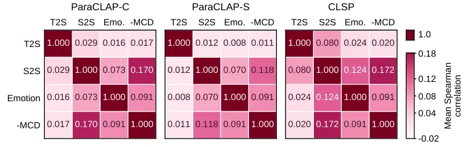

# BEYOND SPEECH CAPTIONS: SPEECH-REWARDED STYLE PLANNING FOR CONVERSATIONAL TEXT-TO-SPEECH

Shiao Zhu    Lianbo Liu    Sizhen Lyu    Yuzhe Wang    Sheng Li   
Takahiro Shinozaki

###### Abstract

Natural-language style descriptions provide an interpretable interface
between large language models (LLMs) and controllable text-to-speech
(TTS). However, using descriptions as pseudo-labels compresses target
acoustics into text, and descriptive fidelity need not imply effective
control of a particular synthesizer. We empirically show that
speech–text alignment only weakly predicts downstream acoustic
similarity among candidate instructions for the same utterance. We
therefore propose Speech-Rewarded Style Planning (SRSP), which trains a
text-based style planner through a frozen downstream TTS model. Given
dialogue history and response text, the planner generates candidate
instructions and is optimized with group-relative policy optimization
(GRPO), using the teacher-forced likelihood of target speech tokens as
the reward. On an English subset of the ISCSLP 2026 CoT-TTS corpus, SRSP
achieves higher speech-style and emotion similarity to target speech and
lower mel-cepstral distortion than the Base LLM and
target-audio-informed captioning baselines. LLM-based expressive speech
evaluation further shows gains over all baselines in contextual
appropriateness and reference consistency.

###### Index Terms: 

conversational speech synthesis, speaking style control, large language
models, reinforcement learning, spoken dialogue systems

^(†)^(†)address: ¹Institute of Science Tokyo, Tokyo, Japan  
²Independent Researcher, Tokyo, Japan

## 1 Introduction

Spoken dialogue conveys both linguistic content and manner of delivery.
The same response can sound reassuring, hesitant, or excited, with
different conversational effects. Response text alone does not fully
determine how an utterance should be delivered. Inferring an appropriate
speaking style from conversational context is therefore an important
task in conversational TTS \[10, 22\].

Natural-language style descriptions provide an interpretable and
editable interface between conversational reasoning and prompt-based
TTS, allowing textual instructions to control how an utterance is spoken
\[12, 24, 11\]. Speech captioners such as StyleCap, SECap, and AlignCap
describe paralinguistic and emotional properties of speech in natural
language \[21, 19, 9\]. Such descriptions have also been used as
explicit intermediate representations in conversational speech
generation; for example, Chain-Talker predicts a context-aware
empathetic caption before generating semantic speech codes and
expressive speech \[8\]. A natural way to train a standalone text-based
style planner is therefore to use speech-derived captions as supervision
for predicting style instructions from dialogue context and response
text.

However, when target speech is summarized as a caption, acoustic details
omitted from that summary are not explicitly represented in the
caption-based supervision. More importantly, predicting a target
description and producing an effective instruction for a particular
synthesizer are distinct objectives: even an accurate description need
not induce the closest acoustic realization of the target speech. We
address this mismatch with Speech-Rewarded Style Planning (SRSP), which
uses a frozen downstream TTS model to provide training feedback for a
text-based style planner. GRPO updates the planner using rewards based
on the target-speech likelihood induced by candidate instructions,
optimizing it for downstream synthesis behavior rather than agreement
with speech-derived descriptions. Related work has also explored
target-speech likelihood rewards for expressive TTS \[15\] and GRPO for
instruction-controlled TTS \[1\].

Our contributions are as follows:

- •
  We empirically show that, among candidate style instructions for the
  same utterance, speech–text alignment only weakly predicts downstream
  acoustic similarity, making it a weak proxy for selecting effective
  instructions.
- •
  We propose Speech-Rewarded Style Planning, a text-based style planner
  trained with direct feedback from a frozen downstream TTS model.
  Candidate instructions are rewarded using teacher-forced target-speech
  likelihood, and GRPO updates the planner without requiring target
  style captions.
- •
  Experiments on an English subset of the ISCSLP 2026 CoT-TTS corpus
  show that SRSP outperforms all baselines on five downstream acoustic
  metrics across both evaluation partitions. LLM-based expressive speech
  evaluation further shows gains in contextual appropriateness and
  reference consistency.

## 2 Descriptive Alignment as a Proxy for Downstream Control



Figure 1: Mean within-utterance Spearman correlations across both
development partitions.

We examine whether stronger speech–text alignment of a style instruction
implies better downstream control of the synthesizer. For each utterance
in the 5,500-utterance development set described in Sec. 4.1, we sample
eight candidate style instructions from the Base LLM given the dialogue
history and response text, using the training decoding parameters. We
then synthesize the response under each instruction.

We use CLAPScore \[4\] to measure style alignment between the generated
style instruction and target speech, denoted as T2S, and speech–speech
cosine similarity to measure style similarity between synthesized and
target speech, denoted as S2S. Both are computed as cosine similarities
between embeddings from pretrained speech–text dual-encoder models.
Specifically, we use ParaSpeechCLAP-Combined (ParaCLAP-C),
ParaSpeechCLAP-Situational (ParaCLAP-S) \[2\], and CLSP \[23\]. Together
with the three S2S scores, we use emotion similarity, computed as the
cosine similarity between emotion2vec probability vectors \[13\], and
MCD-DTW, the mel-cepstral distortion after dynamic time warping, as
downstream acoustic metrics.

To assess how T2S relates to downstream acoustic similarity, we compute
within-utterance Spearman correlations across candidate instructions
between each T2S score and each downstream acoustic metric, as well as
pairwise correlations among the acoustic metrics. MCD is negated so that
higher values consistently indicate better target matching, and the
correlations are averaged across utterances.

Figure 1 shows that T2S scores from both ParaSpeechCLAP variants are
nearly uncorrelated with S2S, emotion similarity, and $`-\mathrm{MCD}`$.
CLSP, which targets fine-grained speech-style alignment \[23\], shows
somewhat stronger but still weak T2S correlations. For each downstream
acoustic metric, its correlation with T2S remains lower than its
correlations with the other acoustic metrics.

To examine the downstream consequences of this ranking mismatch, we
compare instruction selection based on T2S with selection based on
downstream acoustic metrics. For each utterance, we select the
best-scoring candidate under each criterion and evaluate the
corresponding synthesis on all five downstream acoustic metrics, using
random selection as a reference.

|                |                           |                   |                    |
| -------------- | ------------------------- | ----------------- | ------------------ |
| Selection      | S2S C/S/CLSP $`\uparrow`$ | Emo. $`\uparrow`$ | MCD $`\downarrow`$ |
| Random         | .3105/.3049/.8135         | .5964             | 6.3266             |
| ParaCLAP-C T2S | .3181/.3127/.8180         | .6044             | 6.3052             |
| ParaCLAP-S T2S | .3125/.3104/.8163         | .5986             | 6.3142             |
| CLSP T2S       | .3173/.3101/.8198         | .6032             | 6.2711             |
| ParaCLAP-C S2S | .5133/.4595/.8465         | .6210             | 6.0731             |
| ParaCLAP-S S2S | .4529/.5262/.8406         | .6176             | 6.1581             |
| CLSP S2S       | .4200/.4075/.8762         | .6354             | 6.0677             |
| Emotion        | .3247/.3191/.8206         | .8601             | 6.1932             |
| MCD-DTW        | .3456/.3288/.8235         | .6160             | 5.2331             |

Table 1: Synthesis performance by instruction-selection criterion on the
combined development partitions. Bold and underline indicate the best
and second-best results, respectively.

Table 1 shows that T2S-based selection provides only small improvements
over random selection. In contrast, selecting by any downstream acoustic
metric outperforms all three T2S-based criteria across all five
downstream acoustic metrics, including those not used for selection.
Thus, the candidate pool contains instructions that produce speech more
closely matching the target, but descriptive alignment does not reliably
identify them. Together with the weak correlations in Fig. 1, these
results indicate that descriptive alignment is a weak proxy for
downstream synthesis behavior, motivating synthesis-aware feedback.

## 3 Speech-Rewarded Style Planning

### 3.1 Problem formulation

Let $`H`$ be text-only dialogue history, $`y`$ the response text, $`p`$
a same-speaker prompt utterance, and $`s=(s_{1},\ldots,s_{T})`$ the
target speech tokens. The style policy generates a natural-language
instruction $`z\sim\pi_{\theta}(z\mid H,y)`$. During training, $`s`$ is
used only to construct the reward. At inference, the planner receives
only $`(H,y)`$, and its instruction conditions the TTS model together
with response text $`y`$ and prompt audio $`p`$.

### 3.2 Speech-token likelihood as reward

For candidate instruction $`z_{i}`$, the autoregressive LLM of the
frozen TTS model computes the mean teacher-forced cross-entropy (CE)
loss over the target speech-token sequence:

```math
\mathcal{L}_{\mathrm{TTS}}(z_{i})=-\frac{1}{T}\sum_{t=1}^{T}\log p_{\phi}(s_{t}\mid s_{<t},y,z_{i}). \tag{1}
```

All candidates in a reward group share $`(y,s)`$, so their relative
losses measure how each instruction changes the probability assigned to
the same target speech by the fixed synthesizer.

Figure 2: Overview of SRSP. Frozen-TTS target-speech likelihood rewards
candidate instructions during training, while GRPO updates the planner.
Dashed arrows denote training-only paths; snowflakes denote frozen
components.

| System         | T2S Score $`\uparrow`$ |             |             | S2S Score $`\uparrow`$ |             |             | Emo. Cos. $`\uparrow`$ | MCD-DTW $`\downarrow`$ |
| -------------- | ---------------------- | ----------- | ----------- | ---------------------- | ----------- | ----------- | ---------------------- | ---------------------- |
|                | ParaCLAP-C             | ParaCLAP-S  | CLSP        | ParaCLAP-C             | ParaCLAP-S  | CLSP        |                        |                        |
| Raw TTS        | –                      | –           | –           | .3370/.3494            | .3246/.3303 | .8160/.8148 | .6098/.6119            | 6.2426/6.3932          |
| Base LLM       | -.0089/-.0141          | .0161/.0160 | .4718/.4686 | .3166/.3220            | .2979/.3078 | .8150/.8146 | .6124/.5927            | 6.3395/6.5072          |
| AF-Next^(†)    | .0788/.0841            | .0996/.0973 | .5404/.5423 | .2874/.2982            | .2596/.2637 | .7842/.7863 | .5770/.5677            | 6.8890/7.0128          |
| Qwen3-Omni^(†) | -.0087/-.0119          | .0225/.0193 | .5101/.5053 | .3176/.3312            | .3083/.3130 | .8194/.8182 | .6228/.6226            | 6.1593/6.3189          |
| SRSP (ours)    | .0073/-.0044           | .0324/.0232 | .4591/.4518 | .3632/.3627            | .3496/.3502 | .8329/.8296 | .6417/.6269            | 5.9569/6.1637          |

Table 2: Results on test*in/test_out. Bold and underline indicate the
best and second-best results, respectively. ^(†): descriptions
conditioned on the ground-truth target waveform. Paired Wilcoxon tests
with Holm correction across 40 downstream acoustic comparisons show
significant gains ($`p*{\mathrm{Holm}}<.05`$) in 38 cases; the
exceptions are test_out emotion similarity vs. Raw TTS and Qwen3-Omni.

The reward is
$`R_{i}=-\mathcal{L}_{\mathrm{TTS}}(z_{i})-\mathcal{P}_{i}`$, where
$`\mathcal{P}_{i}`$ contains auxiliary penalties that discourage
degenerate style instructions, including overly short, generic, and
repetitive outputs.

### 3.3 Group-relative policy optimization

We optimize the planner using GRPO \[16\]. For each training instance,
we sample $`G`$ instructions and standardize their rewards within the
group:

```math
A_{i}=\frac{R_{i}-\bar{R}}{\sigma_{R}+\epsilon}, \tag{2}
```

where $`\bar{R}`$ and $`\sigma_{R}`$ are the group mean and standard
deviation, and $`\epsilon`$ is a small constant for numerical stability.

The clipped objective includes a KL penalty to the reference policy:

```math
\displaystyle\mathcal{J}(\theta)=\mathbb{E}_{i,t}\Big[ \displaystyle\min\{r_{i,t}A_{i},\operatorname{clip}(r_{i,t},1-\eta,1+\eta)A_{i}\} \tag{3}
```

```math
\displaystyle-\beta D_{\mathrm{KL}}(\pi_{\theta}\|\pi_{\mathrm{ref}})\Big],
```

where $`r_{i,t}`$ is the token-level likelihood ratio to the rollout
policy, the expectation averages over valid generated tokens in each
rollout batch, and $`\pi_{\mathrm{ref}}`$ is the frozen initial policy.
The clipping parameter is $`\eta`$, and $`\beta`$ is the KL weight.

The planner is prompted to generate one natural-language English
sentence describing the speaking style, as summarized in Fig. 3(a).
During training, we randomly sample zero to three CosyVoice-style
examples as in-context demonstrations for each instance; the same
examples are shared by all candidates in a reward group. At inference,
two examples are sampled per utterance.

## 4 Experiments

### 4.1 Experimental setup

Figure 3: Abbreviated prompting configurations for style generation and
LLM-based expressive speech evaluation.

Data. We construct an English subset of the ISCSLP 2026 CoT-TTS corpus
\[20\], retaining utterances with duration 3–15 s, active-speech ratio
$`\geq 0.70`$, loudness $`\geq-40`$ dBFS, transcript length $`\leq 300`$
characters, reference similarity $`\geq 0.65`$, naturalness score
$`\geq 3.0`$, and noise score $`\geq 3.5`$. Excluding samples with
temporally overlapping context and target speech yields a 299.75-hour
pool. From this pool, we create four development and test partitions,
each containing 2,750 utterances (approximately 5 hours). The
dev_in/test_in partitions hold out complete scenes from movies
represented in training, whereas dev_out/test_out hold out entire
movies. After excluding training samples that overlap with held-out
development or test utterances in either the target or dialogue context,
277.60 hours remain for training.

Models and optimization. The Qwen3.5-9B planner \[14\] is adapted with
rank-16 LoRA \[7\] on all linear layers ($`\alpha=32`$, dropout
$`0.02`$). Fun-CosyVoice3-0.5B \[3\] is the frozen reward and synthesis
model. We train for one epoch with $`G=8`$, learning rate
$`2\times 10^{-6}`$, clipping parameter $`\eta=0.2`$, and KL weight
$`\beta=0.075`$. We use TRL 1.3.0 \[17\] with its default token-level
importance sampling and DAPO-style loss normalization \[25\]. Style
generation uses temperature $`1.3`$ during training and $`0.7`$ at test
time. For the auxiliary reward penalties, instructions shorter than 6
words receive a penalty of 5, while those containing 6–11 words receive
a penalty of 0.5. Repeated bigrams and trigrams are penalized with
weight $`0.01`$ using a per-worker rolling history of 2,048 generated
instructions.

Baselines. _Raw TTS_ synthesizes responses without inferred style
instructions. _Base LLM_ uses unadapted Qwen3.5-9B with the same
$`(H,y)`$ input, planner prompt, demonstrations, and inference
configuration as SRSP, providing the direct pre-RL comparison. _AF-Next_
uses NVIDIA’s [Audio Flamingo Next
Captioner](https://huggingface.co/nvidia/audio-flamingo-next-captioner-hf)
checkpoint \[5\], while _Qwen3-Omni_ uses
[Qwen3-Omni-30B-A3B-Instruct](https://huggingface.co/Qwen/Qwen3-Omni-30B-A3B-Instruct)
\[18\]. Both are privileged captioning baselines with direct access to
the ground-truth target waveform, approximating an upper-bound
captioning setting without an additional caption-prediction stage. They
use the shared prompt in Fig. 3(b) and the official decoding strategies.
Their captions are used directly as CosyVoice3 style instructions; all
systems otherwise share the same TTS backend, response text, and
same-speaker prompt audio. These captions are not optimized for
CosyVoice3 and may therefore be suboptimal as control instructions.

### 4.2 System-level results

Table 2 shows that SRSP achieves the best performance on all five
downstream acoustic metrics in both partitions, despite the privileged
baselines having access to the ground-truth target audio. Style
instructions alone do not guarantee improvement: the unadapted Base LLM
obtains lower S2S scores and higher MCD-DTW than Raw TTS, whereas
speech-rewarded post-training reverses this degradation.

AF-Next provides a particularly clear example of the mismatch between
descriptive alignment and downstream control: it achieves the highest
T2S scores under all three speech–text encoders but ranks last on all
five downstream acoustic metrics in both partitions. This mirrors the
candidate-level mismatch observed in Sec. 2: high descriptive alignment
does not necessarily translate into effective downstream control.

### 4.3 LLM-based expressive speech evaluation

| System      | SRSP wins vs. system |             | System wins vs. GT |
| ----------- | -------------------- | ----------- | ------------------ |
|             | Context              | Reference   | Context            |
| Raw TTS     | 65.54/63.92          | 66.31/64.38 | 12.26/13.09        |
| Base LLM    | 54.19/53.67          | 60.91/57.75 | 15.90/16.87        |
| AF-Next     | 75.63/75.75          | 75.01/75.05 | 7.42/9.35          |
| Qwen3-Omni  | 55.21/56.65          | 58.50/57.50 | 14.95/16.95        |
| SRSP (ours) | –                    | –           | 18.41/19.06        |

Table 3: Win rates (%) in LLM-based expressive speech evaluation,
reported as test_in/test_out. Rates exclude ties and invalid judgments
(together $`<1\%`$ of all judgments).

A single recorded response represents only one possible realization of a
reply, so reference consistency does not necessarily capture contextual
appropriateness. We therefore complement target-reference evaluation
with a context-only judgment that evaluates speaking style from the
dialogue context without access to the target response audio. We use
Gemini 3.8 Flash \[6\] as an automatic audio judge in blind A/B
comparisons on all utterances in both test partitions, with a low
thinking level.

In the context-only setting (Fig. 3(c)), the judge receives the three
preceding utterances as audio with transcripts and the current response
text, and selects the candidate whose speaking style is more appropriate
for the reply. In the target-reference setting (Fig. 3(d)), it receives
the context transcripts, current response text, and ground-truth
response waveform, and selects the candidate whose style is more
consistent with that waveform. Both candidates speak the same response
text, and the judge is instructed to ignore speaker identity, voice
timbre, and recording quality.

Table 3 shows that SRSP is preferred over all four baselines in both
settings and partitions ($`p<.001`$, two-sided exact binomial tests). In
the context-only setting, it achieves win rates of 54.19%/53.67% against
the direct pre-RL Base LLM. Since the judge has no access to the target
recording in this setting, this improvement indicates that
speech-rewarded post-training also improves contextual appropriateness.
In context-only comparisons with ground-truth speech, SRSP achieves the
highest win rates among the synthesized systems (18.41%/19.06%).
Ground-truth speech nevertheless remains preferred over all synthesized
systems, highlighting the remaining gap in contextual appropriateness.

## 5 Conclusion

Our candidate-level analysis shows that speech–text alignment only
weakly predicts downstream acoustic similarity. Speech-Rewarded Style
Planning addresses this gap by training a conversational style planner
with the teacher-forced target-speech likelihood of a frozen TTS model.
The resulting planner outperforms all baselines on five downstream
acoustic metrics across both evaluation partitions. LLM-based expressive
speech evaluation further shows gains in contextual appropriateness and
reference consistency. These results support optimizing natural-language
instructions for their downstream synthesis behavior rather than relying
solely on descriptive alignment. Our expressive-speech evaluation relies
on an LLM judge and has not been validated by human listening tests. In
addition, both reward computation and synthesis use CosyVoice3;
evaluating transfer to other TTS backends remains for future work.

## Acknowledgment and AI Disclosure

This work was supported in part by JST BOOST, Japan Grant Number
JPMJBY25F6. ChatGPT (OpenAI) was used to assist with language editing
and phrasing refinement throughout the manuscript, as well as with the
development of experimental scripts.

## References

- \[1\] D. Chen, X. Zhang, Y. Wang, K. Dai, L. Ma, and Z. Wu (2026)
  FlexiVoice: enabling flexible style control in zero-shot TTS with
  natural language instructions. In Proc. ICLR, Cited by: §1.
- \[2\] A. Diwan, E. Choi, and D. Harwath (2026) ParaSpeechCLAP: a
  dual-encoder speech-text model for rich stylistic language-audio
  pretraining. arXiv preprint arXiv:2603.28737. Cited by: §2.
- \[3\] Z. Du, C. Gao, Y. Wang, F. Yu, T. Zhao, et al. (2025) CosyVoice
  3: towards in-the-wild speech generation via scaling-up and
  post-training. arXiv preprint arXiv:2505.17589. Cited by: §4.1.
- \[4\] B. Elizalde, S. Deshmukh, M. Al Ismail, and H. Wang (2023) CLAP:
  learning audio concepts from natural language supervision. In 2023
  IEEE International Conference on Acoustics, Speech and Signal
  Processing (ICASSP), pp. 1–5. External Links:
  [Document](https://dx.doi.org/10.1109/ICASSP49357.2023.10095889) Cited
  by: §2.
- \[5\] S. Ghosh, A. Goel, K. Jayakumar, L. Koroshinadze, N. Anand, Z.
  Kong, et al. (2026) Audio Flamingo Next: next-generation open
  audio-language models for speech, sound, and music. arXiv preprint
  arXiv:2604.10905. Cited by: §4.1.
- \[6\] Google DeepMind (2026) Gemini 3.8 Flash. Note: Accessed: Sep.
  15, 2026. \[Online\]. Available:
  [https://deepmind.google/models/model-cards/gemini-3-8-flash/](https://deepmind.google/models/model-cards/gemini-3-8-flash/)
  Cited by: §4.3.
- \[7\] E. J. Hu, Y. Shen, P. Wallis, Z. Allen-Zhu, Y. Li, S. Wang, L.
  Wang, and W. Chen (2022) LoRA: low-rank adaptation of large language
  models. In Proc. ICLR, Cited by: §4.1.
- \[8\] Y. Hu, R. Liu, Y. Ren, X. Yin, and H. Li (2025) Chain-Talker:
  chain understanding and rendering for empathetic conversational speech
  synthesis. In Findings of the Association for Computational
  Linguistics: ACL 2025, pp. 1988–2003. External Links:
  [Document](https://dx.doi.org/10.18653/v1/2025.findings-acl.101) Cited
  by: §1.
- \[9\] Z. Liang, H. Shi, and H. Chen (2024) AlignCap: aligning speech
  emotion captioning to human preferences. In Proc. EMNLP,
  pp. 3837–3846. External Links:
  [Document](https://dx.doi.org/10.18653/v1/2024.emnlp-main.224) Cited
  by: §1.
- \[10\] G. Lin, C. Chiang, and H. Lee (2024) Advancing large language
  models to capture varied speaking styles and respond properly in
  spoken conversations. In Proceedings of the 62nd Annual Meeting of the
  Association for Computational Linguistics (Volume 1: Long Papers),
  pp. 6626–6642. External Links:
  [Document](https://dx.doi.org/10.18653/v1/2024.acl-long.358) Cited by:
  §1.
- \[11\] H. Lou, H. Paik, W. Hu, and L. Yao (2025) ParaStyleTTS: toward
  efficient and robust paralinguistic style control for expressive
  text-to-speech generation. In Proceedings of the 34th ACM
  International Conference on Information and Knowledge Management,
  pp. 1979–1988. External Links:
  [Document](https://dx.doi.org/10.1145/3746252.3761311) Cited by: §1.
- \[12\] D. Lyth and S. King (2024) Natural language guidance of
  high-fidelity text-to-speech with synthetic annotations. arXiv
  preprint arXiv:2402.01912. Cited by: §1.
- \[13\] Z. Ma, Z. Zheng, J. Ye, J. Li, Z. Gao, S. Zhang, and X.
  Chen (2024) emotion2vec: self-supervised pre-training for speech
  emotion representation. In Findings of the Association for
  Computational Linguistics: ACL 2024, pp. 15747–15760. External Links:
  [Document](https://dx.doi.org/10.18653/v1/2024.findings-acl.931) Cited
  by: §2.
- \[14\] Qwen Team (2026) Qwen3.5: towards native multimodal agents.
  External Links: [Link](https://qwen.ai/blog?id=qwen3.5) Cited by:
  §4.1.
- \[15\] Y. Ren, J. Li, H. Sun, Y. Chen, C. Yi, Y. Huang, H. Gu, Y. Bai,
  and X. Yang (2026) Evaluating and rewarding LALMs for expressive
  role-play TTS via mean continuation log-probability. In Proceedings of
  the 43rd International Conference on Machine Learning (ICML), Cited
  by: §1.
- \[16\] Z. Shao, P. Wang, Q. Zhu, R. Xu, J. Song, X. Bi, H. Zhang, M.
  Zhang, Y. K. Li, Y. Wu, and D. Guo (2024) DeepSeekMath: pushing the
  limits of mathematical reasoning in open language models. arXiv
  preprint arXiv:2402.03300. Cited by: §3.3.
- \[17\] L. von Werra, Y. Belkada, L. Tunstall, E. Beeching, T.
  Thrush, N. Lambert, S. Huang, K. Rasul, and Q. Gallouédec (2020) TRL:
  Transformers Reinforcement Learning. Note:
  [https://github.com/huggingface/trl](https://github.com/huggingface/trl)Software
  Cited by: §4.1.
- \[18\] J. Xu, Z. Guo, H. Hu, Y. Chu, X. Wang, J. He, et al. (2025)
  Qwen3-Omni technical report. arXiv preprint arXiv:2509.17765. Cited
  by: §4.1.
- \[19\] Y. Xu, H. Chen, J. Yu, Q. Huang, Z. Wu, S. Zhang, G. Li, Y.
  Luo, and R. Gu (2024) SECap: speech emotion captioning with large
  language model. In Proceedings of the AAAI Conference on Artificial
  Intelligence, Vol. 38, pp. 19323–19331. External Links:
  [Document](https://dx.doi.org/10.1609/aaai.v38i17.29902) Cited by: §1.
- \[20\] W. Xue, J. Feng, S. Zhang, Y. Wang, R. Yang, B. Liu, L. Xue, S.
  Cheng, J. Pan, W. Bian, B. Kang, and B. Long (2026) ISCSLP 2026
  CoT-TTS challenge: chain-of-thought reasoning for context-aware
  text-to-speech. arXiv preprint arXiv:2606.21933. Cited by: §4.1.
- \[21\] K. Yamauchi, Y. Ijima, and Y. Saito (2024) StyleCap: automatic
  speaking-style captioning from speech based on speech and language
  self-supervised learning models. In Proc. IEEE ICASSP,
  pp. 11261–11265. External Links:
  [Document](https://dx.doi.org/10.1109/ICASSP48485.2024.10445977) Cited
  by: §1.
- \[22\] H. Yan, Y. Zhu, K. Zheng, B. Liu, H. Cao, D. Jiang, and L.
  Xu (2024) Talk with human-like agents: empathetic dialogue through
  perceptible acoustic reception and reaction. In Proceedings of the
  62nd Annual Meeting of the Association for Computational Linguistics
  (Volume 1: Long Papers), pp. 15009–15022. External Links:
  [Document](https://dx.doi.org/10.18653/v1/2024.acl-long.801) Cited by:
  §1.
- \[23\] Y. Yang, B. Han, H. Wang, W. Wang, Z. Ma, L. Zhou, Z. Jin, G.
  Yang, T. Wang, X. Tan, and X. Chen (2026) Towards fine-grained and
  multi-granular contrastive language-speech pre-training. In
  Proceedings of the 64th Annual Meeting of the Association for
  Computational Linguistics (Volume 1: Long Papers), pp. 4217–4235.
  External Links:
  [Document](https://dx.doi.org/10.18653/v1/2026.acl-long.194) Cited by:
  §2, §2.
- \[24\] J. Yu, Z. Gou, C. Li, Z. Wang, P. Yang, W. Chen, and J.
  Yin (2025) Eliciting implicit acoustic styles from open-domain
  instructions to facilitate fine-grained controllable generation of
  speech. In Proceedings of the 2025 Conference on Empirical Methods in
  Natural Language Processing, Suzhou, China, pp. 3679–3695. External
  Links: [Document](https://dx.doi.org/10.18653/v1/2025.emnlp-main.182)
  Cited by: §1.
- \[25\] Q. Yu, Z. Zhang, R. Zhu, Y. Yuan, X. Zuo, Y. Yue, W. Dai, T.
  Fan, G. Liu, J. Liu, L. Liu, X. Liu, et al. (2025) DAPO: an
  open-source LLM reinforcement learning system at scale. In Advances in
  Neural Information Processing Systems, Vol. 38. External Links:
  [Document](https://dx.doi.org/10.52202/085713-3775) Cited by: §4.1.
